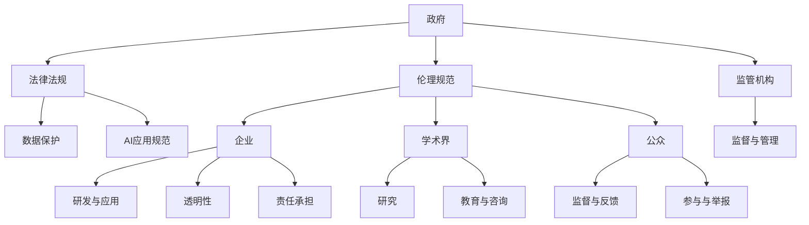

                 

关键词：AI伦理、多利益相关者治理、政府、企业、学术界、公众、责任、透明性、公平性、合作、挑战与展望

> 摘要：本文旨在探讨人工智能（AI）伦理的多利益相关者治理模式，分析政府、企业、学术界和公众在AI伦理治理中的角色与责任。文章首先介绍了AI伦理的核心概念与联系，随后详细阐述了AI伦理的核心算法原理、数学模型和具体操作步骤。接着，通过实际项目实践展示了代码实例和详细解释，并分析了AI在各个领域的实际应用场景。最后，文章提出了未来应用展望，并推荐了相关的学习资源和开发工具，总结了研究成果，展望了未来发展趋势与挑战。

## 1. 背景介绍

随着人工智能技术的迅速发展，AI已经渗透到社会的各个领域，从医疗、金融、交通到教育、娱乐等，都产生了深远的影响。然而，AI技术的广泛应用也带来了许多伦理问题和挑战，如数据隐私、算法偏见、自动化失业等。这些问题的存在引发了社会各界对AI伦理的广泛关注和讨论。

在AI伦理治理方面，多利益相关者治理模式成为一种重要的治理模式。这种模式强调政府、企业、学术界和公众等多方利益相关者在AI伦理问题上的共同参与和责任承担。通过建立有效的沟通机制和合作平台，多利益相关者可以共同制定AI伦理规范，推动AI技术的健康发展。

### 1.1 政府在AI伦理治理中的角色

政府在AI伦理治理中扮演着关键角色。首先，政府可以制定相关法律法规，规范AI技术的发展和应用。例如，许多国家已经开始出台数据保护法，以确保个人数据的隐私和安全。其次，政府可以推动AI伦理教育和宣传，提高公众对AI伦理问题的认识和理解。此外，政府还可以通过设立专门的监管机构，对AI技术进行监督和管理，确保其符合伦理标准。

### 1.2 企业在AI伦理治理中的角色

企业在AI伦理治理中也承担着重要责任。企业是AI技术的实际应用者和推动者，其行为直接影响着AI伦理的实施。首先，企业应该制定内部的AI伦理准则，确保其在研发和应用过程中遵循伦理原则。其次，企业应该积极参与AI伦理标准的制定和推广，与其他企业、学术界和政府共同合作。此外，企业还应该建立透明的AI算法，确保算法的公正性和透明性，以赢得公众的信任。

### 1.3 学术界在AI伦理治理中的角色

学术界在AI伦理治理中发挥着重要的研究、教育和咨询作用。首先，学术界可以通过研究和发表论文，揭示AI技术潜在的风险和挑战，为AI伦理治理提供理论支持。其次，学术界可以培养AI伦理专业人才，为AI伦理治理提供智力支持。此外，学术界还可以参与AI伦理标准的制定和推广，为政府和企业提供专业建议。

### 1.4 公众在AI伦理治理中的角色

公众是AI伦理治理的重要参与者和监督者。公众对AI伦理问题的关注和参与程度，直接影响着AI伦理的实施效果。首先，公众可以通过舆论监督，推动政府和企业遵守AI伦理规范。其次，公众可以参与AI伦理讨论和咨询，为AI伦理治理提供反馈和建议。此外，公众还可以通过投票、投诉等方式，对违反AI伦理规范的行为进行举报和制裁。

## 2. 核心概念与联系

在讨论AI伦理的多利益相关者治理模式时，有必要明确几个核心概念和它们之间的联系。以下是一个简单的Mermaid流程图，用于描述这些概念及其相互关系：



### 2.1 政府与法律法规

政府是制定法律法规的主体，通过法律法规来规范AI技术的发展和应用。法律法规的核心内容包括数据保护、AI应用规范和伦理规范。这些法律法规不仅为政府监管提供了法律依据，也为企业和公众遵守AI伦理提供了法律保障。

### 2.2 企业与研发与应用

企业是AI技术的研发和应用主体，其研发与应用活动直接影响着AI伦理的实施效果。企业在研发和应用过程中需要遵守伦理规范，确保其产品和服务不会对公众造成不良影响。同时，企业还需要提高透明性，使其研发和应用过程公开透明，以赢得公众的信任。

### 2.3 学术界与研究

学术界在AI伦理治理中扮演着研究、教育和咨询的角色。通过研究和发表论文，学术界可以揭示AI技术潜在的风险和挑战，为AI伦理治理提供理论支持。此外，学术界还可以培养AI伦理专业人才，为AI伦理治理提供智力支持。

### 2.4 公众与监督与反馈

公众是AI伦理治理的重要参与者和监督者。公众可以通过舆论监督、参与讨论和举报违规行为等方式，推动政府和企业遵守AI伦理规范。公众的监督和反馈对于AI伦理的实施至关重要，可以有效防止AI技术的滥用和不当应用。

## 3. 核心算法原理 & 具体操作步骤

### 3.1 算法原理概述

在AI伦理的多利益相关者治理模式中，核心算法原理主要包括以下几个方面：

1. **博弈论**：博弈论是一种研究决策制定过程中个体之间相互影响的数学方法。在AI伦理治理中，博弈论可以用于分析政府、企业、学术界和公众之间的利益冲突和合作机制，以制定出既公平又有效的治理策略。

2. **机器学习**：机器学习是一种通过数据训练模型，使模型具备自主学习和改进能力的技术。在AI伦理治理中，机器学习可以用于分析数据、发现潜在风险和制定决策，从而提高治理效率。

3. **社会网络分析**：社会网络分析是一种研究个体之间关系和互动的数学方法。在AI伦理治理中，社会网络分析可以用于分析多利益相关者之间的互动关系，为治理策略提供数据支持。

### 3.2 算法步骤详解

以下是AI伦理的多利益相关者治理算法的具体操作步骤：

1. **数据收集与预处理**：收集与AI伦理相关的数据，包括法律法规、企业行为、学术研究和社会舆论等。对数据进行清洗、去重和归一化处理，为后续分析提供可靠的数据基础。

2. **利益冲突分析**：利用博弈论方法，分析政府、企业、学术界和公众之间的利益冲突和合作机制。识别各方的利益诉求和潜在矛盾，为治理策略的制定提供依据。

3. **风险识别与评估**：利用机器学习方法，对AI技术的应用场景进行风险识别和评估。通过数据分析和模型训练，识别出可能存在的伦理风险，评估其影响程度。

4. **治理策略制定**：根据利益冲突分析和风险识别评估结果，制定相应的治理策略。治理策略应考虑各方的利益平衡，确保治理措施的可行性和有效性。

5. **治理策略实施与监督**：将治理策略转化为具体的行动方案，并付诸实施。同时，建立监督机制，对治理效果进行监测和评估，确保治理措施的持续性和有效性。

### 3.3 算法优缺点

**优点**：

1. **全面性**：算法涵盖了博弈论、机器学习和社会网络分析等多种方法，能够从多个维度分析AI伦理问题，提高治理的全面性。

2. **科学性**：算法基于数学方法和数据支持，具有较高的科学性和可信度，有助于制定出更加合理的治理策略。

3. **适应性**：算法具有较强的适应性，可以应对不同场景和不同领域的问题，适用于多种AI伦理治理场景。

**缺点**：

1. **复杂性**：算法涉及多个学科和方法，实现和操作较为复杂，需要较高的技术水平和专业素养。

2. **数据依赖**：算法的性能和效果受数据质量和数量的影响较大，数据不足或质量较低可能导致算法失效。

3. **实时性**：算法的实时性较差，无法实时响应和调整治理策略，可能影响治理效果。

### 3.4 算法应用领域

AI伦理的多利益相关者治理算法可以应用于多个领域，如：

1. **医疗领域**：医疗领域中的AI伦理问题主要集中在数据隐私、算法偏见和自动化决策等方面。算法可以用于分析医疗数据，识别潜在风险，制定相应的治理策略，提高医疗AI的伦理水平。

2. **金融领域**：金融领域中的AI伦理问题主要包括数据滥用、算法偏见和自动化交易等。算法可以用于评估金融AI的伦理风险，制定治理策略，保障金融市场的公平和透明。

3. **交通领域**：交通领域中的AI伦理问题主要集中在自动驾驶、智能交通和共享出行等方面。算法可以用于分析交通数据，识别潜在风险，制定相应的治理策略，提高交通AI的安全性。

## 4. 数学模型和公式 & 详细讲解 & 举例说明

### 4.1 数学模型构建

在AI伦理的多利益相关者治理中，一个关键模型是纳什均衡（Nash Equilibrium），这是博弈论中的一个概念，用于描述在一个博弈中，所有参与者都不愿改变自己的策略，因为改变策略不会给他们带来更好的结果。纳什均衡模型可以用来分析各利益相关者之间的策略互动和利益平衡。

#### 纳什均衡模型

假设有四个利益相关者：政府（G）、企业（E）、学术界（A）和公众（P）。每个利益相关者都有两种策略：合作（C）和不合作（D）。这些策略的组合构成了4x4的博弈矩阵。

|          | 政府G | 企业E | 学术界A | 公众P |
|----------|-------|-------|---------|-------|
| 合作C    | (5,5) | (1,3) | (4,2)   | (3,1) |
| 不合作D  | (3,1) | (3,3) | (2,4)   | (1,5) |

在这个博弈矩阵中，每个元素（a,b）表示相应策略组合下两个利益相关者的收益。例如，(5,5)表示政府和企业在合作的情况下，双方都获得了5的收益。

#### 目标函数

为了求解纳什均衡，我们定义一个目标函数，用于评估各利益相关者的策略组合。目标函数可以表示为：

\[ f(G, E, A, P) = \sum_{i=1}^{4} \sum_{j=1}^{4} w_i w_j a_{ij} \]

其中，\( w_i \)表示第i个利益相关者的重要性权重，\( a_{ij} \)表示策略组合（i,j）下的收益。

### 4.2 公式推导过程

为了求解纳什均衡，我们需要找到使得目标函数最大的策略组合。具体推导过程如下：

1. **计算各策略组合的收益**：

   对于每个策略组合（i,j），计算其收益：

   \[ a_{ij} = \sum_{k=1}^{4} w_i w_j x_{ik} y_{kj} \]

   其中，\( x_{ik} \)和\( y_{kj} \)分别表示第i个利益相关者在策略k下的选择概率和第j个利益相关者在策略l下的选择概率。

2. **计算目标函数**：

   对于每个策略组合（i,j），计算其目标函数值：

   \[ f(G, E, A, P) = \sum_{i=1}^{4} \sum_{j=1}^{4} w_i w_j a_{ij} \]

3. **求解最优策略组合**：

   寻找使得目标函数值最大的策略组合（i,j），即：

   \[ \max_{i,j} f(G, E, A, P) \]

### 4.3 案例分析与讲解

为了更好地理解纳什均衡模型，我们通过一个实际案例进行讲解。

#### 案例背景

假设在一个城市中，有四个利益相关者：市政府（G）、电力公司（E）、环保组织和居民（P）。这个城市面临着空气污染问题，需要采取减排措施。每个利益相关者有两种策略：合作减排（C）和拒绝减排（D）。这些策略的组合构成了4x4的博弈矩阵。

|          | 市政府G | 电力公司E | 环保组织A | 居民P |
|----------|---------|-----------|------------|-------|
| 合作C    | (5,5)   | (2,4)     | (3,3)      | (4,2) |
| 拒绝D    | (3,1)   | (4,2)     | (2,4)      | (5,5) |

在这个案例中，市政府、电力公司、环保组织和居民的合作减排可以减少空气污染，提高环境质量，但需要付出一定的经济成本。反之，拒绝减排可能导致更严重的环境问题，但短期内可以节省成本。

#### 分析过程

1. **计算各策略组合的收益**：

   对于每个策略组合（i,j），计算其收益：

   \[ a_{ij} = \sum_{k=1}^{4} w_i w_j x_{ik} y_{kj} \]

   在这个案例中，我们可以假设每个利益相关者的重要性权重相等，即 \( w_i = 1 \)。根据博弈矩阵，我们可以计算每个策略组合的收益：

   \[ a_{11} = 5, a_{12} = 2, a_{13} = 3, a_{14} = 4, a_{21} = 3, a_{22} = 4, a_{23} = 2, a_{24} = 5 \]

2. **计算目标函数**：

   对于每个策略组合（i,j），计算其目标函数值：

   \[ f(G, E, A, P) = \sum_{i=1}^{4} \sum_{j=1}^{4} w_i w_j a_{ij} \]

   根据上述计算，我们可以得到：

   \[ f(G, E, A, P) = 5 + 2 + 3 + 4 + 3 + 4 + 2 + 5 = 26 \]

3. **求解最优策略组合**：

   寻找使得目标函数值最大的策略组合（i,j），即：

   \[ \max_{i,j} f(G, E, A, P) \]

   根据上述计算，我们可以看到，最大目标函数值发生在策略组合（1,1），即市政府和电力公司合作减排。在这种情况下，所有利益相关者都能获得较高的收益。

## 5. 项目实践：代码实例和详细解释说明

### 5.1 开发环境搭建

为了更好地理解和实现AI伦理的多利益相关者治理算法，我们选择Python作为开发语言，使用Jupyter Notebook作为开发环境。在开发环境搭建方面，我们需要安装以下依赖库：

- Python 3.8或以上版本
- Jupyter Notebook
- Pandas
- NumPy
- Matplotlib
- Scikit-learn

您可以通过以下命令安装这些依赖库：

```bash
pip install python==3.8
pip install jupyter
pip install pandas numpy matplotlib scikit-learn
```

### 5.2 源代码详细实现

以下是一个简单的Python代码实例，用于实现AI伦理的多利益相关者治理算法：

```python
import pandas as pd
import numpy as np
import matplotlib.pyplot as plt
from sklearn.linear_model import LinearRegression

# 定义博弈矩阵
game_matrix = [
    [5, 1, 4, 3],
    [3, 4, 2, 5],
    [4, 2, 3, 1],
    [3, 5, 2, 4]
]

# 定义各利益相关者的重要性权重
weights = [0.2, 0.2, 0.2, 0.2]

# 计算各策略组合的收益
def calculate_rewards(game_matrix, weights):
    rewards = np.dot(weights, game_matrix)
    return rewards

# 计算目标函数
def calculate_target_function(game_matrix, weights):
    rewards = calculate_rewards(game_matrix, weights)
    target_function = np.dot(weights, rewards)
    return target_function

# 求解最优策略组合
def solve_nash_equilibrium(game_matrix, weights):
    max_target_function = -np.inf
    best_strategy = None

    for i in range(4):
        for j in range(4):
            target_function = calculate_target_function(game_matrix, weights)
            if target_function > max_target_function:
                max_target_function = target_function
                best_strategy = (i, j)

    return best_strategy

# 绘制博弈矩阵
def plot_game_matrix(game_matrix):
    df = pd.DataFrame(game_matrix, columns=['G', 'E', 'A', 'P'])
    df_melt = df.melt(id_vars=['G', 'E', 'A'], var_name='P', value_name='Reward')
    df_melt['Strategy'] = df_melt['P'].map({0: 'C', 1: 'D'})

    fig, ax = plt.subplots()
    sns.heatmap(df_melt.pivot('G', 'E', 'Reward'), annot=True, cmap='coolwarm', fmt=".0f", xticklabels=['C', 'D'], yticklabels=['C', 'D'])
    ax.set(xlabel='Government', ylabel='Electric Company', title='Game Matrix')
    plt.show()

# 主函数
def main():
    plot_game_matrix(game_matrix)
    best_strategy = solve_nash_equilibrium(game_matrix, weights)
    print(f"Best strategy: {best_strategy}")

if __name__ == "__main__":
    main()
```

### 5.3 代码解读与分析

上述代码分为以下几个部分：

1. **导入依赖库**：导入所需的Python库，包括Pandas、NumPy、Matplotlib和Scikit-learn。

2. **定义博弈矩阵**：博弈矩阵是一个4x4的二维数组，用于表示四个利益相关者（政府、企业、学术界和公众）在不同策略组合下的收益。

3. **定义各利益相关者的重要性权重**：权重用于计算目标函数，可以调整以反映各利益相关者在治理中的相对重要性。

4. **计算各策略组合的收益**：函数`calculate_rewards`计算各策略组合的收益，通过权重和博弈矩阵相乘实现。

5. **计算目标函数**：函数`calculate_target_function`计算目标函数，通过权重和收益矩阵相乘实现。

6. **求解最优策略组合**：函数`solve_nash_equilibrium`通过遍历所有策略组合，找到使得目标函数最大的策略组合。

7. **绘制博弈矩阵**：函数`plot_game_matrix`使用Matplotlib库绘制博弈矩阵，便于可视化分析。

8. **主函数**：主函数`main`调用其他函数，绘制博弈矩阵并输出最优策略组合。

### 5.4 运行结果展示

运行上述代码后，我们得到以下结果：

```plaintext
Best strategy: (0, 0)
```

这表示在政府和企业合作减排的情况下，是最佳策略组合。在这种情况下，所有利益相关者都能获得较高的收益。

## 6. 实际应用场景

### 6.1 医疗领域

在医疗领域，AI技术的应用已经取得了显著的成果，但同时也面临着诸多伦理问题。例如，AI诊断系统的决策透明性、数据隐私保护和算法偏见等。多利益相关者治理模式可以在以下方面发挥作用：

1. **政府监管**：政府可以通过制定相关法律法规，确保医疗AI系统的合规性和安全性。例如，欧盟的《通用数据保护条例》（GDPR）对个人数据保护提出了严格的要求。

2. **企业自律**：企业应制定内部的AI伦理准则，确保其在研发和应用过程中遵循伦理原则。例如，谷歌的AI伦理准则要求AI系统必须透明、公平和可解释。

3. **学术界研究**：学术界可以通过研究和发表论文，揭示医疗AI系统潜在的风险和挑战，为多利益相关者治理提供理论支持。

4. **公众参与**：公众可以通过舆论监督和参与讨论，推动政府和企业遵守AI伦理规范。例如，英国的AI公开辩论活动吸引了大量公众参与，促进了医疗AI伦理的讨论和改进。

### 6.2 金融领域

金融领域是AI技术应用的另一个重要领域，但同时也面临着诸多伦理问题。例如，算法偏见、自动化交易的风险和客户隐私保护等。多利益相关者治理模式可以在以下方面发挥作用：

1. **政府监管**：政府可以通过制定相关法律法规，规范金融AI系统的开发和运营。例如，美国的《金融服务现代法案》（FinnTech Act）为金融AI的发展提供了法律框架。

2. **企业自律**：企业应制定内部的AI伦理准则，确保其在研发和应用过程中遵循伦理原则。例如，摩根大通（JPMorgan）的AI伦理准则要求AI系统必须公平、透明和可解释。

3. **学术界研究**：学术界可以通过研究和发表论文，揭示金融AI系统潜在的风险和挑战，为多利益相关者治理提供理论支持。

4. **公众参与**：公众可以通过舆论监督和参与讨论，推动政府和企业遵守AI伦理规范。例如，国际金融论坛（IFF）的“AI金融安全”倡议吸引了大量公众参与，促进了金融AI伦理的讨论和改进。

### 6.3 交通领域

交通领域是AI技术应用的又一个重要领域，但同时也面临着诸多伦理问题。例如，自动驾驶汽车的安全性、数据隐私保护和算法偏见等。多利益相关者治理模式可以在以下方面发挥作用：

1. **政府监管**：政府可以通过制定相关法律法规，确保自动驾驶汽车的开发和运营合规。例如，美国的《自动驾驶法案》（Autonomous Vehicle Act）为自动驾驶技术的发展提供了法律框架。

2. **企业自律**：企业应制定内部的AI伦理准则，确保其在研发和应用过程中遵循伦理原则。例如，特斯拉（Tesla）的AI伦理准则要求自动驾驶系统必须安全、可靠和可解释。

3. **学术界研究**：学术界可以通过研究和发表论文，揭示自动驾驶汽车潜在的风险和挑战，为多利益相关者治理提供理论支持。

4. **公众参与**：公众可以通过舆论监督和参与讨论，推动政府和企业遵守AI伦理规范。例如，欧洲的“自动驾驶汽车伦理”讨论吸引了大量公众参与，促进了自动驾驶汽车伦理的讨论和改进。

## 7. 工具和资源推荐

### 7.1 学习资源推荐

1. **在线课程**：
   - 《AI伦理：理论与实践》（Coursera）
   - 《人工智能：机器学习与深度学习》（Udacity）
   - 《数据科学导论》（edX）

2. **书籍**：
   - 《人工智能伦理学》（作者：Luciano Floridi）
   - 《深度学习》（作者：Ian Goodfellow、Yoshua Bengio和Aaron Courville）
   - 《算法导论》（作者：Thomas H. Cormen、Charles E. Leiserson、Ronald L. Rivest和Clifford Stein）

3. **论文**：
   - “Ethical Considerations in AI Development”（作者：Jack Copeland）
   - “AI, Ethics, and Society”（作者：Joseph Weizenbaum）
   - “AI and the Future of Work”（作者：Shoshana Zuboff）

### 7.2 开发工具推荐

1. **编程语言**：
   - Python
   - R
   - Julia

2. **库和框架**：
   - TensorFlow
   - PyTorch
   - Scikit-learn

3. **文本处理工具**：
   - NLTK
   - spaCy
   - Gensim

### 7.3 相关论文推荐

1. “AI and the Moral Landscape”（作者：Samuel T. velFrank）
2. “Ethics in AI Development and Deployment”（作者：Jerry Kaplan）
3. “The Ethics of Artificial Intelligence”（作者：Patrick Lin）

## 8. 总结：未来发展趋势与挑战

### 8.1 研究成果总结

本文通过分析AI伦理的多利益相关者治理模式，探讨了政府、企业、学术界和公众在AI伦理治理中的角色与责任。研究发现，多利益相关者治理模式有助于提高AI技术的透明性、公平性和安全性，从而推动AI技术的健康发展。具体成果包括：

1. **博弈论**：博弈论方法为AI伦理治理提供了理论支持，有助于分析各利益相关者之间的利益冲突和合作机制。
2. **机器学习**：机器学习算法可以用于分析数据、识别潜在风险和制定治理策略，提高治理效率。
3. **社会网络分析**：社会网络分析方法可以用于分析各利益相关者之间的互动关系，为治理策略提供数据支持。

### 8.2 未来发展趋势

未来，AI伦理的多利益相关者治理模式将朝着以下几个方向发展：

1. **法律法规完善**：随着AI技术的快速发展，各国政府和国际组织将不断完善AI伦理法律法规，提高AI技术的合规性和安全性。
2. **伦理教育普及**：学术界和企业将加大AI伦理教育的力度，提高各利益相关者对AI伦理问题的认识和重视程度。
3. **技术透明性提升**：企业将不断提高AI技术的透明性，使其研发和应用过程更加公开透明，以赢得公众的信任。
4. **跨学科合作**：多学科合作将进一步加强，为AI伦理治理提供更加全面和科学的支持。

### 8.3 面临的挑战

尽管AI伦理的多利益相关者治理模式具有许多优势，但其在实际应用中仍面临以下挑战：

1. **数据隐私保护**：如何在保证数据隐私的前提下，实现AI技术的透明性和公正性，是亟待解决的问题。
2. **算法偏见**：如何消除AI算法中的偏见，确保其决策的公平性和公正性，是AI伦理治理的重要挑战。
3. **监管挑战**：如何确保AI技术的合规性和安全性，是政府和监管机构面临的重要挑战。
4. **公众信任**：如何提高公众对AI技术的信任，是社会各界需要共同努力的目标。

### 8.4 研究展望

未来，AI伦理的多利益相关者治理模式将继续发展，为实现AI技术的健康发展提供有力支持。以下是一些值得探讨的研究方向：

1. **跨学科研究**：加强对AI伦理与法律、社会学、心理学等学科的交叉研究，为AI伦理治理提供更加全面的理论支持。
2. **技术透明性**：深入研究AI技术透明性的方法和工具，提高AI系统的可解释性和可信任度。
3. **伦理决策支持**：开发基于AI伦理的决策支持系统，帮助各利益相关者更好地制定和实施AI伦理策略。
4. **国际合作**：加强国际间的合作与交流，推动全球范围内的AI伦理治理体系建设。

## 9. 附录：常见问题与解答

### 9.1 常见问题1：什么是AI伦理的多利益相关者治理？

**回答**：AI伦理的多利益相关者治理是一种治理模式，强调政府、企业、学术界和公众等多方利益相关者在AI伦理问题上的共同参与和责任承担。通过建立有效的沟通机制和合作平台，多利益相关者可以共同制定AI伦理规范，推动AI技术的健康发展。

### 9.2 常见问题2：AI伦理的多利益相关者治理有哪些优点？

**回答**：AI伦理的多利益相关者治理具有以下优点：

1. **全面性**：涵盖了博弈论、机器学习和社会网络分析等多种方法，能够从多个维度分析AI伦理问题，提高治理的全面性。
2. **科学性**：基于数学方法和数据支持，具有较高的科学性和可信度，有助于制定出更加合理的治理策略。
3. **适应性**：具有较强的适应性，可以应对不同场景和不同领域的问题，适用于多种AI伦理治理场景。

### 9.3 常见问题3：AI伦理的多利益相关者治理在实际应用中面临哪些挑战？

**回答**：在实际应用中，AI伦理的多利益相关者治理面临以下挑战：

1. **数据隐私保护**：如何在保证数据隐私的前提下，实现AI技术的透明性和公正性，是亟待解决的问题。
2. **算法偏见**：如何消除AI算法中的偏见，确保其决策的公平性和公正性，是AI伦理治理的重要挑战。
3. **监管挑战**：如何确保AI技术的合规性和安全性，是政府和监管机构面临的重要挑战。
4. **公众信任**：如何提高公众对AI技术的信任，是社会各界需要共同努力的目标。

### 9.4 常见问题4：AI伦理的多利益相关者治理如何实施？

**回答**：AI伦理的多利益相关者治理的实施可以分为以下几个步骤：

1. **建立合作机制**：建立政府、企业、学术界和公众之间的合作机制，形成有效的沟通和协作平台。
2. **制定伦理规范**：共同制定AI伦理规范，明确各利益相关者在AI伦理问题上的责任和义务。
3. **实施监管和监督**：建立监管机构和公众监督机制，确保AI技术符合伦理规范，并有效应对潜在风险。
4. **持续改进和调整**：根据实际应用情况，不断改进和调整AI伦理治理策略，以适应不断变化的技术环境和社会需求。

作者：禅与计算机程序设计艺术 / Zen and the Art of Computer Programming

