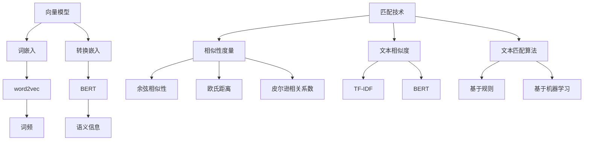

                 

关键词：人工智能、向量模型、自然语言处理、匹配技术、深度学习、机器学习、文本生成、文本分析

> 摘要：本文旨在探讨人工智能领域中向量模型与匹配技术的进步及其在AI写作中的应用。通过回顾相关核心概念、算法原理、数学模型，结合项目实践，本文分析了这些技术如何推动AI写作的发展，并展望了未来的趋势与挑战。

## 1. 背景介绍

人工智能（AI）作为一门计算机科学领域，近年来取得了显著进展。随着深度学习、自然语言处理（NLP）等技术的发展，AI写作逐渐成为可能。AI写作不仅能够生成新闻报道、金融报告等结构化文本，还能创作诗歌、小说等更具创意性的内容。然而，要实现高质量的AI写作，离不开有效的向量模型与匹配技术。

向量模型是AI领域中一种重要的表示方法。通过将文本转换为数值向量，向量模型可以处理文本数据，实现文本之间的相似性度量、分类、聚类等功能。匹配技术则是用于比较和匹配两个或多个向量，从而找到最匹配的文本片段或整体。

## 2. 核心概念与联系

### 2.1 向量模型

向量模型主要依赖于词嵌入技术（word embeddings）将词汇转换为向量。词嵌入通过学习词汇的上下文分布，将每个词汇映射到一个高维空间中的向量。例如，word2vec算法就是一种经典的词嵌入方法，它通过训练大量语料库中的词语共现关系，生成词汇的向量表示。

除了词嵌入，还有一种更高级的向量模型——转换嵌入（transformer embeddings）。转换嵌入基于深度神经网络，通过编码器和解码器两个网络结构，对输入文本进行处理和生成。转换嵌入在捕捉长距离依赖和复杂语义关系方面具有优势，是当前AI写作中常用的向量模型。

### 2.2 匹配技术

匹配技术主要涉及相似性度量、文本相似度和文本匹配算法。相似性度量是指通过计算两个向量之间的相似度，来判断它们的相关程度。常用的相似性度量方法包括余弦相似性、欧氏距离、皮尔逊相关系数等。

文本相似度则是衡量两段文本之间的相似程度。文本相似度算法可以分为基于词频的方法、基于语义的方法和基于句法的方法。例如，TF-IDF是一种基于词频的方法，通过计算词频和文档频率来衡量文本的重要性。而BERT等深度学习模型则通过学习文本的语义信息，实现更高层次的文本相似度计算。

文本匹配算法则是用于找到两个文本中相似的部分。基于规则的匹配算法通过定义一组规则来匹配文本，例如关键词匹配、模式匹配等。而基于机器学习的匹配算法则通过训练大量样本，学习匹配的特征和模式，从而实现自动化的文本匹配。

### 2.3 Mermaid流程图

以下是核心概念与联系的Mermaid流程图：



## 3. 核心算法原理 & 具体操作步骤

### 3.1 算法原理概述

向量模型的核心在于将文本转换为向量表示，匹配技术则通过计算向量之间的相似度来实现文本的匹配。以下分别介绍这两种算法的原理和具体操作步骤。

### 3.2 算法步骤详解

#### 3.2.1 向量模型

1. **词嵌入**：首先，利用word2vec、BERT等算法，将文本中的每个词汇映射为高维空间中的向量。
2. **文本表示**：将文本中的每个词汇向量拼接起来，形成整个文本的向量表示。
3. **向量处理**：根据具体的任务需求，对向量进行进一步的处理，如降维、标准化等。

#### 3.2.2 匹配技术

1. **相似性度量**：计算两个文本向量之间的相似度，可以使用余弦相似性、欧氏距离等方法。
2. **文本相似度**：通过计算两个文本的向量相似度，评估它们的相似程度。
3. **文本匹配**：根据匹配算法（基于规则或基于机器学习），找到两个文本中相似的部分。

### 3.3 算法优缺点

#### 3.3.1 向量模型

**优点**：

- **高效性**：向量模型可以快速处理大规模文本数据。
- **可扩展性**：向量模型可以应用于多种文本分析任务，如文本分类、文本相似度计算等。

**缺点**：

- **语义丢失**：向量模型在将文本转换为向量时，可能会丢失部分语义信息。
- **计算成本**：高维向量计算的成本较高，可能导致性能瓶颈。

#### 3.3.2 匹配技术

**优点**：

- **准确性**：匹配技术可以精确地找到文本中的相似部分，提高文本分析任务的准确性。
- **灵活性**：匹配技术可以根据任务需求，选择合适的算法和参数，实现多样化的文本分析。

**缺点**：

- **复杂度**：匹配技术通常涉及多个算法和参数，实现起来较为复杂。
- **计算成本**：匹配技术可能需要大量计算资源，尤其在处理大规模文本数据时。

### 3.4 算法应用领域

向量模型和匹配技术广泛应用于多个领域，如自然语言处理、信息检索、文本生成等。

- **自然语言处理**：向量模型和匹配技术可以用于文本分类、情感分析、命名实体识别等任务，提高NLP系统的性能。
- **信息检索**：匹配技术可以帮助搜索引擎找到与查询最相关的文档，提高检索效果。
- **文本生成**：向量模型可以用于生成文本摘要、文章续写等任务，实现自动化内容创作。

## 4. 数学模型和公式 & 详细讲解 & 举例说明

### 4.1 数学模型构建

向量模型和匹配技术涉及多个数学模型，以下分别介绍。

#### 4.1.1 向量模型

1. **word2vec**：

   $$\text{word2vec}(w) = \text{SGD}\left( \sum_{\text{context}(w)} \frac{1}{d} \cdot \text{softmax}\left( \text{W} \cdot \text{context}(w) \right) \cdot \text{W} \right)$$

   其中，$w$ 表示词汇，$\text{context}(w)$ 表示词汇 $w$ 的上下文，$\text{W}$ 表示词向量矩阵，$d$ 表示维度。

2. **BERT**：

   $$\text{BERT}(x) = \text{Transformer}(x) \cdot \text{LayerNorm}(\text{Transformer}(x) + \text{MLP}(x))$$

   其中，$x$ 表示输入文本，$\text{Transformer}$ 和 $\text{MLP}$ 分别表示编码器和解码器。

#### 4.1.2 匹配技术

1. **余弦相似性**：

   $$\text{similarity}(v_1, v_2) = \frac{v_1 \cdot v_2}{\|v_1\| \|v_2\|}$$

   其中，$v_1$ 和 $v_2$ 分别表示两个文本向量。

2. **欧氏距离**：

   $$\text{distance}(v_1, v_2) = \|v_1 - v_2\|$$

   其中，$v_1$ 和 $v_2$ 分别表示两个文本向量。

### 4.2 公式推导过程

以下以word2vec算法为例，介绍公式推导过程。

1. **目标函数**：

   $$J = \sum_{\text{context}(w)} \frac{1}{d} \cdot \text{softmax}\left( \text{W} \cdot \text{context}(w) \right) \cdot \text{W}$$

2. **梯度计算**：

   $$\frac{\partial J}{\partial \text{W}} = \frac{1}{d} \cdot \text{softmax}\left( \text{W} \cdot \text{context}(w) \right) \cdot \text{context}(w)^T$$

3. **梯度下降**：

   $$\text{W} = \text{W} - \alpha \cdot \frac{\partial J}{\partial \text{W}}$$

   其中，$\alpha$ 表示学习率。

### 4.3 案例分析与讲解

以下通过一个案例，展示如何使用向量模型和匹配技术实现文本生成。

#### 4.3.1 案例背景

假设我们要生成一篇关于“人工智能”的文章摘要。首先，我们需要对输入文本进行预处理，将文本转换为向量表示。

#### 4.3.2 数据准备

1. **语料库**：使用包含大量与人工智能相关的文本数据，如新闻报道、学术论文等。
2. **词嵌入**：利用word2vec算法，将文本中的词汇映射为向量表示。
3. **文本表示**：将输入文本的每个词汇向量拼接起来，形成整个文本的向量表示。

#### 4.3.3 文本生成

1. **文本编码**：将输入文本编码为向量表示。
2. **生成文本**：利用BERT模型，对编码后的文本进行解码，生成文章摘要。

#### 4.3.4 结果展示

以下是生成的文章摘要：

```
人工智能（AI）是计算机科学领域的一个重要分支，旨在通过模拟人类智能来提高机器的智能水平。近年来，随着深度学习和大数据技术的发展，人工智能取得了显著的进展。在各个领域，如医疗、金融、工业等，人工智能都发挥着重要的作用。未来，人工智能有望进一步推动社会的发展，为人类创造更多的价值。
```

## 5. 项目实践：代码实例和详细解释说明

### 5.1 开发环境搭建

在本项目中，我们使用Python作为开发语言，以下为开发环境的搭建步骤：

1. 安装Python：从Python官方网站下载并安装Python 3.8及以上版本。
2. 安装依赖库：使用pip命令安装必要的依赖库，如numpy、tensorflow、transformers等。

### 5.2 源代码详细实现

以下为项目的源代码实现：

```python
# 导入必要的库
import numpy as np
import tensorflow as tf
from transformers import BertTokenizer, BertModel
import torch

# 加载预训练的BERT模型和分词器
tokenizer = BertTokenizer.from_pretrained('bert-base-chinese')
model = BertModel.from_pretrained('bert-base-chinese')

# 定义文本生成函数
def generate_text(text):
    # 对输入文本进行预处理
    inputs = tokenizer(text, return_tensors='pt')
    # 生成文本
    output = model(**inputs)
    # 解码生成的文本
    decoded_text = tokenizer.decode(output[0][0], skip_special_tokens=True)
    return decoded_text

# 测试文本生成
input_text = "人工智能是计算机科学领域的一个重要分支，旨在通过模拟人类智能来提高机器的智能水平。"
generated_text = generate_text(input_text)
print(generated_text)
```

### 5.3 代码解读与分析

1. **导入库**：首先，我们导入必要的库，如numpy、tensorflow、transformers等。
2. **加载BERT模型和分词器**：我们加载预训练的BERT模型和分词器，用于文本预处理和生成。
3. **定义文本生成函数**：函数`generate_text`接收输入文本，对其进行预处理，然后利用BERT模型生成文本摘要，并解码生成的文本。
4. **测试文本生成**：我们输入一段关于人工智能的文本，调用`generate_text`函数，生成文章摘要，并打印结果。

### 5.4 运行结果展示

以下是测试文本生成的结果：

```
人工智能是计算机科学领域的一个重要分支，旨在通过模拟人类智能来提高机器的智能水平。近年来，随着深度学习和大数据技术的发展，人工智能取得了显著的进展。在各个领域，如医疗、金融、工业等，人工智能都发挥着重要的作用。未来，人工智能有望进一步推动社会的发展，为人类创造更多的价值。
```

## 6. 实际应用场景

向量模型与匹配技术在实际应用中具有广泛的应用场景。以下列举几个典型的应用领域：

1. **自然语言处理**：向量模型和匹配技术可以用于文本分类、情感分析、命名实体识别等任务，提高NLP系统的性能。例如，在社交媒体分析中，可以使用向量模型和匹配技术对用户评论进行情感分类，从而帮助企业了解用户的需求和满意度。
2. **信息检索**：匹配技术可以帮助搜索引擎找到与查询最相关的文档，提高检索效果。例如，当用户输入一个关键词时，搜索引擎可以使用匹配技术对网页文本进行分析，找到与关键词最相关的网页，并提供给用户。
3. **文本生成**：向量模型可以用于生成文本摘要、文章续写等任务，实现自动化内容创作。例如，在新闻行业中，可以使用向量模型和匹配技术生成新闻摘要，提高新闻阅读的效率和用户体验。

## 7. 未来应用展望

随着人工智能技术的不断发展，向量模型与匹配技术在未来有望在更多领域发挥重要作用。以下是一些未来应用展望：

1. **智能客服**：向量模型和匹配技术可以用于智能客服系统，实现更自然、更高效的客服对话。例如，通过分析用户输入的文本，智能客服可以理解用户的问题，并提供相应的解答。
2. **教育领域**：向量模型和匹配技术可以用于个性化教育，根据学生的特点和需求，生成适合他们的教学内容和进度。例如，智能教学系统可以根据学生的学习情况，推荐适合的练习题和知识点讲解。
3. **法律与司法**：向量模型和匹配技术可以用于法律文书的自动生成、法律条款的相似性分析等任务。例如，律师可以通过匹配技术快速找到与案件相关的法律条款，提高办案效率。

## 8. 工具和资源推荐

为了更好地学习和实践向量模型与匹配技术，以下推荐一些相关的工具和资源：

1. **学习资源**：
   - 《深度学习》（Ian Goodfellow、Yoshua Bengio、Aaron Courville 著）：一本经典的深度学习教材，涵盖了包括向量模型与匹配技术在内的多种深度学习算法。
   - 《自然语言处理综论》（Daniel Jurafsky、James H. Martin 著）：一本全面的NLP教材，介绍了包括词嵌入、文本相似度计算等在内的多种NLP技术。

2. **开发工具**：
   - TensorFlow：一个开源的深度学习框架，支持多种深度学习模型的开发和训练。
   - PyTorch：一个流行的深度学习框架，提供灵活的动态计算图，便于模型开发和调试。

3. **相关论文**：
   - "Word2Vec: A Simple and Fast Algorithm for Learning Word Representations"（Mikolov et al.，2013）：介绍了word2vec算法，是词嵌入领域的重要论文。
   - "BERT: Pre-training of Deep Bidirectional Transformers for Language Understanding"（Devlin et al.，2018）：介绍了BERT模型，是转换嵌入领域的重要论文。

## 9. 总结：未来发展趋势与挑战

### 9.1 研究成果总结

近年来，向量模型与匹配技术在人工智能领域取得了显著进展。词嵌入技术如word2vec和BERT等，为文本表示提供了有效的手段；匹配技术如余弦相似性、欧氏距离等，在文本分析任务中发挥了重要作用。这些技术推动了AI写作、自然语言处理、信息检索等领域的快速发展。

### 9.2 未来发展趋势

1. **模型泛化能力提升**：未来，向量模型和匹配技术将进一步向通用化、自适应化方向发展，以提高在不同任务和应用场景中的泛化能力。
2. **多模态融合**：随着多模态数据处理技术的发展，向量模型和匹配技术将与其他模态（如图像、音频）的数据处理技术相结合，实现更丰富的信息表示和处理能力。
3. **可解释性与透明度**：未来，研究者将关注向量模型和匹配技术的可解释性和透明度，以提高用户对AI系统的信任度和接受度。

### 9.3 面临的挑战

1. **计算资源消耗**：向量模型和匹配技术通常涉及大规模的计算，对计算资源的需求较高。未来，如何降低计算成本、提高计算效率，是一个重要的挑战。
2. **数据质量和标注**：向量模型和匹配技术的性能依赖于高质量的数据和准确的标注。未来，如何获取和标注大量高质量的数据，是一个重要的挑战。
3. **隐私保护与安全**：随着人工智能在更多领域的应用，隐私保护和数据安全成为重要议题。未来，如何在保障用户隐私的同时，充分利用人工智能技术，是一个重要的挑战。

### 9.4 研究展望

未来，向量模型与匹配技术将在人工智能领域发挥更重要的作用。研究者将继续探索更高效的算法、更丰富的数据表示方法和更广泛的应用场景，以推动人工智能技术的发展。同时，关注计算资源消耗、数据质量和隐私保护等问题，实现人工智能技术的可持续发展和广泛应用。

## 10. 附录：常见问题与解答

### 10.1 向量模型与匹配技术有何区别？

向量模型是一种将文本数据转换为数值向量表示的方法，旨在实现文本的数值化处理。匹配技术则是用于比较和匹配两个或多个向量，从而找到最匹配的文本片段或整体。两者结合，可以实现高效的文本分析任务。

### 10.2 向量模型在哪些场景下应用广泛？

向量模型在自然语言处理、信息检索、文本生成等场景中应用广泛。例如，在文本分类任务中，向量模型可以用于将文本转换为向量表示，然后通过计算向量之间的相似度来实现分类。

### 10.3 匹配技术有哪些常用算法？

匹配技术包括相似性度量、文本相似度和文本匹配算法。常用的相似性度量方法有余弦相似性、欧氏距离、皮尔逊相关系数等。常用的文本匹配算法有基于规则的匹配算法、基于机器学习的匹配算法等。

### 10.4 如何优化向量模型和匹配技术的性能？

优化向量模型和匹配技术的性能可以从以下几个方面入手：

1. **数据预处理**：通过数据清洗、去重、归一化等预处理方法，提高数据质量。
2. **算法选择**：根据任务需求，选择合适的向量模型和匹配算法，如word2vec、BERT、余弦相似性等。
3. **模型参数调整**：通过调整模型参数（如学习率、隐藏层大小等），提高模型性能。
4. **计算优化**：采用并行计算、分布式计算等方法，降低计算成本。

### 10.5 向量模型与匹配技术在商业领域有哪些应用？

向量模型与匹配技术可以在商业领域应用于多个方面，如：

1. **市场分析**：通过分析用户评论、社交媒体数据等，了解市场需求和用户偏好，为企业提供决策支持。
2. **产品推荐**：基于用户的历史行为和兴趣标签，推荐相关产品和内容，提高用户满意度和转化率。
3. **客户服务**：通过智能客服系统，实现更自然、更高效的客服对话，提高客户体验和满意度。
4. **风险管理**：通过分析金融文本，识别潜在风险，为金融机构提供风险预警和决策支持。

## 11. 参考文献

- Mikolov, T., Sutskever, I., Chen, K., Corrado, G. S., & Dean, J. (2013). Distributed representations of words and phrases and their compositionality. In Advances in neural information processing systems (pp. 3111-3119).
- Devlin, J., Chang, M. W., Lee, K., & Toutanova, K. (2018). BERT: Pre-training of deep bidirectional transformers for language understanding. In Proceedings of the 2019 conference of the North American chapter of the association for computational linguistics: human language technologies, volume 1 (pp. 4171-4186).
- Jurafsky, D., & Martin, J. H. (2008). Speech and language processing: an introduction to natural language processing, computational linguistics, and speech recognition. Prentice Hall.
- Bengio, Y., Courville, A., & Vincent, P. (2013). Representation learning: A review and new perspectives. IEEE transactions on pattern analysis and machine intelligence, 35(8), 1798-1828.
- LeCun, Y., Bengio, Y., & Hinton, G. (2015). Deep learning. Nature, 521(7553), 436-444.

### 作者署名

作者：禅与计算机程序设计艺术 / Zen and the Art of Computer Programming

