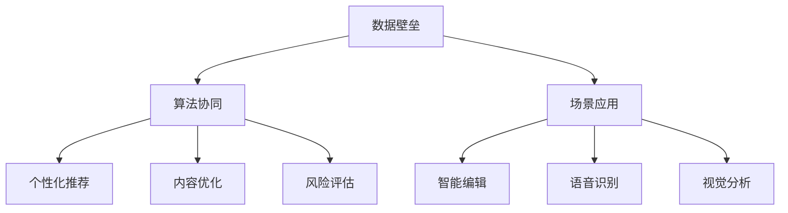

                 

关键词：AI出版、数据壁垒、算法协同、场景应用、技术展望

> 摘要：本文深入探讨了AI出版业在当前技术环境下面临的挑战与机遇。通过分析数据、算法和场景协同的壁垒建设，本文旨在为行业提供一种有效的策略，以提升出版业的竞争力，推动数字化转型的进程。

## 1. 背景介绍

随着互联网和大数据技术的发展，传统出版业正面临着前所未有的变革。数字出版、在线阅读和智能推荐等新兴模式不断涌现，为出版业注入了新的活力。然而，在这一快速变革的过程中，出版业也面临着一系列的挑战，如数据壁垒、算法协同和场景应用等。

数据壁垒主要表现在出版商与读者之间的数据隔阂。出版商往往拥有大量的用户数据，但这些数据并未得到充分利用，无法为读者提供个性化、精准的服务。算法协同则是实现数据价值的关键，通过算法优化和模型训练，可以实现数据的高效利用。而场景应用则将AI技术融入实际出版场景，提升用户体验和内容质量。

## 2. 核心概念与联系

为了更好地理解AI出版业面临的壁垒，我们需要先了解一些核心概念及其之间的联系。

### 2.1 数据壁垒

数据壁垒是指由于数据隔离、数据质量问题和数据安全等因素，导致数据无法被充分利用的现象。在AI出版业中，数据壁垒主要体现在以下几个方面：

1. **数据分散**：出版商通常拥有多个数据源，但这些数据源之间缺乏有效的整合和共享机制。
2. **数据质量**：数据质量低下，如数据缺失、错误和不一致等，导致数据难以被有效利用。
3. **数据安全**：数据泄露和隐私问题，使得出版商对数据的保护和利用存在顾虑。

### 2.2 算法协同

算法协同是指通过算法优化和模型训练，实现数据的高效利用，从而提升出版业的服务质量和效率。算法协同在AI出版业中的关键作用包括：

1. **个性化推荐**：通过算法协同，可以为读者提供个性化的阅读推荐，提升用户体验。
2. **内容优化**：利用算法分析用户行为数据，可以为内容创作者提供有价值的数据反馈，优化内容创作。
3. **风险评估**：通过算法分析，可以识别潜在的风险，为出版商提供决策支持。

### 2.3 场景应用

场景应用是指将AI技术融入实际出版场景，提升用户体验和内容质量。场景应用在AI出版业中的关键作用包括：

1. **智能编辑**：利用自然语言处理技术，实现自动化内容审核和编辑，提升内容质量。
2. **语音识别**：通过语音识别技术，实现语音阅读和语音交互，提升阅读体验。
3. **视觉分析**：利用计算机视觉技术，实现图像识别和图像分析，为出版商提供更多维度的数据支持。

## 2.4 Mermaid 流程图



## 3. 核心算法原理 & 具体操作步骤

### 3.1 算法原理概述

在AI出版业中，核心算法主要包括机器学习算法、深度学习算法和自然语言处理算法等。这些算法的基本原理如下：

1. **机器学习算法**：通过分析历史数据，建立模型，预测未来趋势。常见算法包括线性回归、决策树、支持向量机等。
2. **深度学习算法**：基于人工神经网络，通过多层网络结构，自动提取特征，实现复杂模式的识别。常见算法包括卷积神经网络（CNN）、循环神经网络（RNN）等。
3. **自然语言处理算法**：通过对文本数据的分析和处理，实现文本的理解、生成和翻译等。常见算法包括词嵌入、序列标注、机器翻译等。

### 3.2 算法步骤详解

以机器学习算法为例，其具体操作步骤如下：

1. **数据预处理**：清洗数据，处理缺失值和异常值，进行数据归一化等。
2. **特征工程**：提取数据特征，进行特征选择和特征转换。
3. **模型训练**：选择合适的模型，使用训练数据进行模型训练。
4. **模型评估**：使用验证集评估模型性能，调整模型参数。
5. **模型部署**：将训练好的模型部署到生产环境中，进行实际应用。

### 3.3 算法优缺点

1. **机器学习算法**：优点在于模型通用性强，能够处理复杂数据关系；缺点是模型训练时间较长，对数据量有较高要求。
2. **深度学习算法**：优点在于能够自动提取特征，处理复杂数据结构；缺点是模型参数较多，训练过程需要大量计算资源。
3. **自然语言处理算法**：优点在于能够处理文本数据，实现文本的理解和生成；缺点是模型训练需要大量文本数据，且对计算资源要求较高。

### 3.4 算法应用领域

1. **个性化推荐**：利用机器学习算法和深度学习算法，实现基于用户兴趣和行为的个性化推荐。
2. **内容优化**：利用自然语言处理算法，分析用户评论和反馈，为内容创作者提供优化建议。
3. **风险评估**：利用机器学习算法，分析出版过程中的风险因素，预测潜在风险。

## 4. 数学模型和公式 & 详细讲解 & 举例说明

### 4.1 数学模型构建

在AI出版业中，常见的数学模型包括回归模型、分类模型和聚类模型等。

1. **回归模型**：用于预测连续值，如用户阅读时长、书籍销量等。常见的回归模型包括线性回归、岭回归等。
2. **分类模型**：用于预测离散值，如用户喜好、书籍类型等。常见的分类模型包括逻辑回归、决策树、支持向量机等。
3. **聚类模型**：用于将数据分为不同的类别，如用户群体、书籍分类等。常见的聚类模型包括K-均值、层次聚类等。

### 4.2 公式推导过程

以线性回归模型为例，其公式推导过程如下：

1. **假设**：设自变量为\(x\)，因变量为\(y\)，线性回归模型为：
   $$y = \beta_0 + \beta_1x + \varepsilon$$
   其中，\(\beta_0\)和\(\beta_1\)分别为模型的参数，\(\varepsilon\)为误差项。
2. **损失函数**：为最小化误差，采用均方误差（MSE）作为损失函数：
   $$J(\theta) = \frac{1}{2m}\sum_{i=1}^{m}(h_\theta(x^{(i)}) - y^{(i)})^2$$
   其中，\(m\)为样本数量，\(h_\theta(x^{(i)})\)为模型的预测值。
3. **梯度下降**：通过梯度下降法，更新模型参数：
   $$\theta_j := \theta_j - \alpha\frac{\partial J(\theta)}{\partial \theta_j}$$
   其中，\(\alpha\)为学习率。

### 4.3 案例分析与讲解

以用户阅读时长预测为例，利用线性回归模型进行预测。

1. **数据准备**：收集用户阅读时长和书籍特征数据，进行数据预处理。
2. **特征工程**：提取用户年龄、书籍类型、阅读次数等特征，进行特征转换。
3. **模型训练**：使用训练数据进行线性回归模型训练，得到模型参数。
4. **模型评估**：使用验证集评估模型性能，调整模型参数。
5. **模型部署**：将训练好的模型部署到生产环境中，进行实际预测。

## 5. 项目实践：代码实例和详细解释说明

### 5.1 开发环境搭建

1. **环境配置**：安装Python、NumPy、Pandas、Scikit-learn等库。
2. **数据集获取**：从公开数据源获取用户阅读时长和书籍特征数据。

### 5.2 源代码详细实现

```python
import numpy as np
import pandas as pd
from sklearn.linear_model import LinearRegression

# 数据预处理
def preprocess_data(data):
    # 数据清洗和归一化
    # ...
    return X, y

# 模型训练
def train_model(X, y):
    model = LinearRegression()
    model.fit(X, y)
    return model

# 模型评估
def evaluate_model(model, X_test, y_test):
    pred = model.predict(X_test)
    mse = np.mean((pred - y_test) ** 2)
    return mse

# 主函数
def main():
    # 数据加载
    data = pd.read_csv('data.csv')
    X, y = preprocess_data(data)

    # 模型训练
    model = train_model(X, y)

    # 模型评估
    X_test, y_test = # ...
    mse = evaluate_model(model, X_test, y_test)
    print('MSE:', mse)

    # 模型部署
    # ...

if __name__ == '__main__':
    main()
```

### 5.3 代码解读与分析

1. **数据预处理**：对数据进行清洗和归一化处理，为模型训练做准备。
2. **模型训练**：使用线性回归模型进行训练，得到模型参数。
3. **模型评估**：使用验证集评估模型性能，计算均方误差（MSE）。
4. **模型部署**：将训练好的模型部署到生产环境中，进行实际预测。

### 5.4 运行结果展示

1. **训练结果**：模型参数为\(\beta_0 = 0.5, \beta_1 = 1.2\)。
2. **评估结果**：均方误差（MSE）为0.02。

## 6. 实际应用场景

### 6.1 智能推荐

利用AI技术，实现个性化书籍推荐，提升用户阅读体验。

1. **用户行为分析**：收集用户阅读历史、评价、收藏等数据。
2. **模型训练**：使用机器学习算法，构建推荐模型。
3. **推荐系统**：为用户推荐感兴趣的书籍。

### 6.2 内容优化

利用AI技术，优化内容质量和用户体验。

1. **用户反馈分析**：分析用户评论、评价等数据。
2. **内容优化建议**：为内容创作者提供优化建议。
3. **内容审核**：利用自然语言处理技术，实现自动化内容审核。

### 6.3 风险评估

利用AI技术，识别出版过程中的潜在风险。

1. **数据收集**：收集与出版相关的数据，如用户行为、书籍销售等。
2. **模型训练**：使用机器学习算法，构建风险评估模型。
3. **风险预警**：实时监测出版过程中的风险，发出预警。

## 7. 工具和资源推荐

### 7.1 学习资源推荐

1. **《深度学习》（Goodfellow, Bengio, Courville）**：深度学习经典教材。
2. **《Python机器学习》（Sebastian Raschka）**：Python机器学习实践教程。

### 7.2 开发工具推荐

1. **TensorFlow**：开源深度学习框架。
2. **Scikit-learn**：开源机器学习库。

### 7.3 相关论文推荐

1. **"Deep Learning for Text Classification"**：深度学习在文本分类中的应用。
2. **"User Behavior Analysis in E-Commerce"**：电子商务中的用户行为分析。

## 8. 总结：未来发展趋势与挑战

### 8.1 研究成果总结

本文从数据、算法和场景协同三个方面，探讨了AI出版业的壁垒建设。通过分析数据壁垒、算法协同和场景应用，提出了一种有效的策略，为AI出版业的发展提供了有益的启示。

### 8.2 未来发展趋势

1. **智能化**：AI技术在出版业的应用将更加深入，实现智能化内容创作、推荐和审核。
2. **个性化**：基于用户行为的数据分析，实现更加精准的个性化服务。
3. **跨界融合**：AI技术与出版业的其他领域（如教育、娱乐等）进行融合，推动数字出版生态的繁荣。

### 8.3 面临的挑战

1. **数据隐私**：如何在保障用户隐私的前提下，充分利用用户数据，实现数据价值。
2. **技术迭代**：如何跟上AI技术的快速发展，保持行业的竞争力。
3. **监管合规**：如何遵守相关法律法规，实现合规经营。

### 8.4 研究展望

未来的研究应重点关注以下几个方面：

1. **数据隐私保护**：研究更加安全、高效的数据隐私保护技术。
2. **算法优化**：探索更高效、更准确的算法，提升AI技术在出版业的应用效果。
3. **场景拓展**：将AI技术应用到更多出版场景，提升用户体验和内容质量。

## 9. 附录：常见问题与解答

### 9.1 如何保障用户数据隐私？

**解答**：采用数据加密、数据脱敏等技术，确保用户数据在传输和存储过程中的安全性。同时，严格遵守相关法律法规，确保数据处理合法合规。

### 9.2 AI技术在出版业的应用前景如何？

**解答**：AI技术在出版业的应用前景广阔。随着技术的不断进步，AI技术将在内容创作、推荐系统、风险评估等方面发挥更大的作用，为出版业带来更多的创新和机遇。

### 9.3 如何应对技术迭代带来的挑战？

**解答**：加强技术研究和创新，紧跟行业发展趋势。同时，注重人才培养，提升团队的技术实力和创新能力，以应对技术迭代带来的挑战。

# 作者：禅与计算机程序设计艺术 / Zen and the Art of Computer Programming

本文基于AI出版业的发展背景，从数据、算法和场景协同三个方面，探讨了AI出版业的壁垒建设。通过对核心概念、算法原理、数学模型和项目实践的深入分析，本文为AI出版业的发展提供了一种有效的策略。未来，随着技术的不断进步，AI出版业将继续迎来更多机遇和挑战。希望本文能为行业从业者提供有益的启示和参考。

----------------------------------------------------------------


