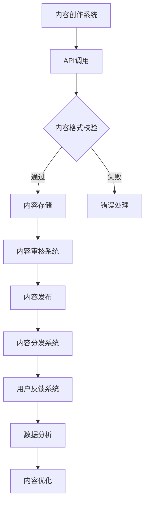

                 

关键词：AI出版、API标准化、软件开发、技术博客、深度学习、机器学习、内容管理、出版流程、API设计、用户体验、数据处理、数据分析、未来应用展望、数学模型、代码实例、工具和资源推荐。

## 摘要

本文旨在探讨AI出版业的开发，特别是API标准化的核心作用。通过详细分析API在出版流程中的应用，以及如何设计高效且统一的API接口，我们将揭示AI出版领域面临的挑战和未来发展方向。文章将涵盖API标准化的重要性、核心算法原理、数学模型和项目实践，并结合实际应用场景和未来发展展望进行深入探讨。

## 1. 背景介绍

随着人工智能技术的飞速发展，出版业也迎来了新的变革。传统的出版流程逐渐被自动化和智能化的工具所取代，使得内容创作、编辑、分发和反馈等环节更加高效和精准。然而，AI技术在出版业的应用不仅需要高质量的数据和强大的算法支持，还要求开发者在设计API时考虑到标准化和通用性，以满足不同应用场景的需求。

API（应用程序编程接口）是软件开发中不可或缺的一部分，它定义了不同软件之间交互的方式和规则。在AI出版业中，API标准化尤为重要，因为不同系统之间的数据传输和功能调用需要保持一致性，以确保整个出版流程的顺畅运行。标准化不仅有助于提高开发效率，还能降低系统的复杂性和维护成本。

本文将围绕以下核心内容展开：

1. API标准化的核心作用及其在AI出版业中的应用
2. 核心算法原理和具体操作步骤
3. 数学模型和公式推导
4. 项目实践：代码实例和详细解释
5. 实际应用场景和未来展望
6. 工具和资源推荐
7. 总结：未来发展趋势与挑战

通过上述内容的深入探讨，我们希望为AI出版业的开发提供一些有价值的思路和参考。

## 2. 核心概念与联系

### 2.1 API标准化的概念

API标准化是指通过制定一套统一的规范和标准，确保不同系统和软件之间的接口能够无缝集成和互操作。在AI出版业中，API标准化不仅涉及到数据的传输格式、访问权限和调用方法，还包括对响应时间和错误处理的统一规定。

标准化的API具有以下几大优势：

- **提高开发效率**：开发者无需为了集成不同系统而重新编写代码，可以节省大量的开发时间和成本。
- **降低维护成本**：统一的API标准使得系统的维护和升级变得更加简单和高效。
- **增强用户体验**：标准化的API可以确保用户在不同平台和设备上获得一致的使用体验。

### 2.2 API在出版流程中的应用

在AI出版流程中，API发挥着至关重要的作用。以下是API在各个环节中的应用：

- **内容创作**：通过API，作者可以方便地提交和编辑内容，系统可以自动处理格式转换和内容审核。
- **编辑与校对**：编辑人员可以通过API实时查看和修改内容，确保质量无误。
- **内容分发**：出版商可以利用API将内容推送到各个渠道，如电子书平台、社交媒体等。
- **用户反馈**：系统可以通过API收集用户反馈，分析读者喜好，优化内容推荐策略。

### 2.3 API标准化的架构

API标准化的架构通常包括以下几个层次：

- **数据层**：定义数据传输的格式和结构，如JSON、XML等。
- **业务层**：定义API的功能和操作，如内容提交、内容审核、内容推荐等。
- **接口层**：定义API的访问方式和权限，如RESTful API、GraphQL API等。
- **安全层**：确保数据传输的安全性和完整性，如加密、认证和授权等。

### 2.4 Mermaid流程图

为了更好地理解API标准化的架构，下面是一个简化的Mermaid流程图，展示了API在出版流程中的基本步骤：



在这个流程图中，每个节点代表一个环节，箭头表示流程的传递方向。API调用是整个流程的起点和核心，确保各个系统之间的无缝集成和高效协作。

通过上述对API标准化概念、应用和架构的探讨，我们为后续的深入分析奠定了基础。在接下来的章节中，我们将详细讨论核心算法原理、数学模型和项目实践，进一步揭示AI出版业开发中的关键技术和方法。

## 3. 核心算法原理 & 具体操作步骤

### 3.1 算法原理概述

在AI出版业中，核心算法的作用至关重要。这些算法不仅决定了内容处理的质量和效率，还直接影响用户体验和出版商的盈利能力。以下是一些关键的算法原理：

- **自然语言处理（NLP）**：NLP算法用于理解和生成人类语言，包括文本分类、情感分析、命名实体识别等，能够帮助编辑人员快速审核内容、自动推荐相关文章，并优化用户体验。
- **机器学习分类算法**：如支持向量机（SVM）、随机森林（Random Forest）和神经网络（Neural Networks）等，这些算法可以用于内容审核、分类和推荐，提高内容的质量和相关性。
- **内容推荐算法**：如基于协同过滤（Collaborative Filtering）和内容分发（Content-based Filtering）的算法，能够根据用户的历史行为和喜好，推荐相关的书籍或文章。
- **图像识别算法**：如卷积神经网络（CNN）和生成对抗网络（GAN），这些算法可以用于自动识别和分类书籍封面图片、插图等，提高内容分发的效率和准确性。

### 3.2 算法步骤详解

#### 3.2.1 自然语言处理（NLP）

**1. 文本预处理**：
   - 清除HTML标签和特殊字符。
   - 分词：将文本分割成单词或短语。
   - 去停用词：移除常见的无意义词汇，如“的”、“和”、“是”等。
   - 词干还原：将不同形式的单词还原为同一种词性，如“书籍”和“书籍们”还原为“书籍”。

**2. 特征提取**：
   - 词袋模型（Bag of Words, BOW）：将文本表示为单词频率的向量。
   - TF-IDF：考虑单词在文本中的频率和其在整个语料库中的重要性。
   - 基于Word2Vec或BERT的嵌入表示：将单词映射为高维向量，用于表示词与词之间的关系。

**3. 模型训练**：
   - 使用训练数据集对模型进行训练，如文本分类模型、情感分析模型等。
   - 采用深度学习框架（如TensorFlow或PyTorch）进行模型训练和优化。

**4. 应用场景**：
   - 内容审核：识别和过滤不良内容。
   - 情感分析：分析用户对书籍或文章的情感倾向。
   - 自动摘要：生成文章的摘要或总结。

#### 3.2.2 机器学习分类算法

**1. 数据准备**：
   - 收集和整理大量的标注数据。
   - 划分训练集和测试集。

**2. 模型选择**：
   - 根据任务需求选择合适的模型，如SVM、随机森林或神经网络。

**3. 模型训练与验证**：
   - 使用训练集训练模型，调整参数以优化性能。
   - 使用验证集进行模型验证，选择最优模型。

**4. 模型部署**：
   - 将训练好的模型部署到API服务中，供前端调用。

**5. 应用场景**：
   - 内容分类：自动对文章或书籍进行分类。
   - 审核过滤：识别和过滤不符合要求的文章。

#### 3.2.3 内容推荐算法

**1. 协同过滤**：
   - 根据用户的历史行为（如评分、浏览记录）推荐相关的书籍或文章。
   - 包括基于用户的协同过滤（User-based CF）和基于项目的协同过滤（Item-based CF）。

**2. 内容分发**：
   - 根据书籍或文章的内容特征进行推荐，如关键词匹配、主题模型等。
   - 结合用户兴趣和内容特征，提高推荐的准确性。

**3. 应用场景**：
   - 书籍推荐：根据用户的历史行为和喜好推荐相关的书籍。
   - 文章推荐：根据用户的阅读记录推荐相关的文章。

#### 3.2.4 图像识别算法

**1. 数据准备**：
   - 收集和标注大量的图像数据。
   - 划分训练集和测试集。

**2. 模型训练**：
   - 使用卷积神经网络（CNN）对图像进行特征提取和分类。
   - 采用迁移学习，利用预训练的模型（如VGG16、ResNet等）进行微调。

**3. 模型评估**：
   - 使用测试集评估模型的性能，如准确率、召回率、F1分数等。

**4. 应用场景**：
   - 覆盖图片识别：识别书籍封面图片或插图。
   - 版权保护：检测和识别盗版书籍。

### 3.3 算法优缺点

**自然语言处理（NLP）**

- **优点**：能够处理复杂的语言任务，如情感分析和文本分类。
- **缺点**：对大规模文本处理和高质量标注数据有较高要求，处理效果依赖于模型的质量。

**机器学习分类算法**

- **优点**：适用于多种分类任务，如内容审核和分类。
- **缺点**：需要大量标注数据，模型训练时间较长。

**内容推荐算法**

- **优点**：能够根据用户行为和内容特征进行个性化推荐。
- **缺点**：协同过滤方法在用户行为稀疏时效果较差，内容分发方法依赖于高质量的内容特征。

**图像识别算法**

- **优点**：能够高效识别图像中的内容。
- **缺点**：对图像质量要求较高，处理速度较慢。

### 3.4 算法应用领域

- **内容审核**：使用NLP和机器学习算法对上传的内容进行实时审核，确保内容的合规性和质量。
- **内容推荐**：结合NLP和协同过滤算法，根据用户喜好和内容特征推荐相关的书籍或文章。
- **版权保护**：使用图像识别算法自动识别和检测盗版书籍，保护出版商的版权。

通过以上对核心算法原理和具体操作步骤的详细讨论，我们为AI出版业的开发提供了实用且可行的技术方案。在接下来的章节中，我们将进一步探讨数学模型和公式推导，以加深对算法理论基础的理解。

### 4. 数学模型和公式 & 详细讲解 & 举例说明

在AI出版业的开发中，数学模型和公式是理解算法原理和实现高效解决方案的关键。以下将详细讲解几个关键数学模型和公式，并结合具体例子进行说明。

#### 4.1 数学模型构建

**1. 贝叶斯分类模型**

贝叶斯分类模型是NLP中常用的分类算法，用于对文本进行分类。其基本公式如下：

$$
P(\text{类别} | \text{文本}) = \frac{P(\text{文本} | \text{类别}) \cdot P(\text{类别})}{P(\text{文本})}
$$

其中，$P(\text{类别} | \text{文本})$ 表示文本属于某一类别的概率，$P(\text{文本} | \text{类别})$ 表示给定类别下文本的概率，$P(\text{类别})$ 表示某一类别的先验概率，$P(\text{文本})$ 表示文本的总概率。

**2. 支持向量机（SVM）**

SVM是一种常用的机器学习分类算法，用于划分数据集。其目标是最小化分类边界上的间隔。其公式如下：

$$
\min_{\mathbf{w}, b} \frac{1}{2} ||\mathbf{w}||^2 + C \sum_{i=1}^{n} \max(0, 1 - y_i (\mathbf{w} \cdot \mathbf{x_i} + b))
$$

其中，$\mathbf{w}$ 表示权重向量，$b$ 表示偏置项，$C$ 是正则化参数，$y_i$ 是第$i$个样本的标签，$\mathbf{x_i}$ 是第$i$个样本的特征向量。

**3. 逻辑回归**

逻辑回归是一种用于二分类问题的算法，其输出为概率值。其公式如下：

$$
\hat{y} = \sigma(\mathbf{w} \cdot \mathbf{x} + b)
$$

其中，$\sigma$ 是 sigmoid 函数，$\hat{y}$ 表示预测概率，$\mathbf{w}$ 表示权重向量，$b$ 表示偏置项，$\mathbf{x}$ 是输入特征向量。

#### 4.2 公式推导过程

**贝叶斯分类模型推导**

贝叶斯分类模型的推导基于贝叶斯定理，其推导过程如下：

假设有类别$C_1, C_2, \ldots, C_k$，每个类别对应的先验概率为$P(C_i)$，文本的概率为$P(\text{文本})$。给定一个文本，我们需要计算该文本属于各个类别的后验概率$P(C_i | \text{文本})$。

根据贝叶斯定理：

$$
P(C_i | \text{文本}) = \frac{P(\text{文本} | C_i) \cdot P(C_i)}{P(\text{文本})}
$$

为了计算$P(\text{文本})$，我们需要对所有类别求和：

$$
P(\text{文本}) = \sum_{i=1}^{k} P(\text{文本} | C_i) \cdot P(C_i)
$$

将$P(\text{文本} | C_i)$替换为条件概率分布，得到：

$$
P(C_i | \text{文本}) = \frac{P(\text{文本} | C_i) \cdot P(C_i)}{\sum_{j=1}^{k} P(\text{文本} | C_j) \cdot P(C_j)}
$$

**SVM推导**

SVM的目标是最小化分类边界上的间隔。对于线性可分的数据集，SVM的目标是最小化分类边界上的间隔，同时保证所有样本点到分类边界的距离尽可能大。

给定训练数据集$\mathcal{D} = \{(\mathbf{x_1}, y_1), (\mathbf{x_2}, y_2), \ldots, (\mathbf{x_n}, y_n)\}$，其中$y_i \in \{-1, +1\}$，我们需要找到一个最优的决策边界$\mathbf{w}$和偏置项$b$。

SVM的目标是最小化：

$$
\min_{\mathbf{w}, b} \frac{1}{2} ||\mathbf{w}||^2 + C \sum_{i=1}^{n} \max(0, 1 - y_i (\mathbf{w} \cdot \mathbf{x_i} + b))
$$

其中，$C$ 是正则化参数，用于平衡模型复杂度和训练误差。

这个目标可以通过拉格朗日乘子法求解，得到以下优化问题：

$$
\max_{\alpha_i} \min_{\mathbf{w}, b} \frac{1}{2} ||\mathbf{w}||^2 - \sum_{i=1}^{n} \alpha_i [y_i (\mathbf{w} \cdot \mathbf{x_i} + b) - 1] - C \sum_{i=1}^{n} \alpha_i
$$

其中，$\alpha_i$ 是拉格朗日乘子。

通过求解这个优化问题，我们可以得到最优的$\mathbf{w}$和$b$。

**逻辑回归推导**

逻辑回归的目标是预测样本属于某一类别的概率。给定训练数据集$\mathcal{D} = \{(\mathbf{x_1}, y_1), (\mathbf{x_2}, y_2), \ldots, (\mathbf{x_n}, y_n)\}$，其中$y_i \in \{-1, +1\}$，我们需要找到一个最优的权重向量$\mathbf{w}$和偏置项$b$。

逻辑回归的目标是最小化损失函数：

$$
\min_{\mathbf{w}, b} \sum_{i=1}^{n} (-y_i \log(\hat{y}_i) - (1 - y_i) \log(1 - \hat{y}_i))
$$

其中，$\hat{y}_i = \sigma(\mathbf{w} \cdot \mathbf{x_i} + b)$ 是预测概率。

通过对损失函数求导并令导数为零，我们可以得到最优的$\mathbf{w}$和$b$。

#### 4.3 案例分析与讲解

**贝叶斯分类案例**

假设我们有一个训练数据集，包含两个类别：新闻（N）和广告（A）。其中，新闻的概率为$P(N) = 0.6$，广告的概率为$P(A) = 0.4$。我们还知道新闻中包含“体育”这个词的概率为$P(\text{体育} | N) = 0.3$，广告中包含“体育”这个词的概率为$P(\text{体育} | A) = 0.1$。

给定一个文本，我们需要计算该文本属于新闻或广告的概率。根据贝叶斯定理：

$$
P(N | \text{体育}) = \frac{P(\text{体育} | N) \cdot P(N)}{P(\text{体育})}
$$

其中，$P(\text{体育}) = P(\text{体育} | N) \cdot P(N) + P(\text{体育} | A) \cdot P(A) = 0.3 \cdot 0.6 + 0.1 \cdot 0.4 = 0.21$。

因此，$P(N | \text{体育}) = \frac{0.3 \cdot 0.6}{0.21} \approx 0.857$，说明这个文本更有可能属于新闻类别。

**SVM案例**

假设我们有一个二分类问题，数据集包含两个类别：正面（+1）和负面（-1）。给定训练数据集：

$$
\mathcal{D} = \{(\mathbf{x_1}, +1), (\mathbf{x_2}, +1), (\mathbf{x_3}, -1), (\mathbf{x_4}, -1)\}
$$

其中，$\mathbf{x_1} = (1, 2)$，$\mathbf{x_2} = (2, 3)$，$\mathbf{x_3} = (4, 1)$，$\mathbf{x_4} = (5, 2)$。

我们需要找到一个最优的决策边界$\mathbf{w}$和偏置项$b$。

根据SVM的目标函数：

$$
\min_{\mathbf{w}, b} \frac{1}{2} ||\mathbf{w}||^2 + C \sum_{i=1}^{4} \max(0, 1 - y_i (\mathbf{w} \cdot \mathbf{x_i} + b))
$$

通过求解这个优化问题，我们可以得到最优的$\mathbf{w}$和$b$。假设我们得到的结果为$\mathbf{w} = (2, 1)$，$b = -1$。

因此，决策边界为$2x_1 + x_2 - 1 = 0$。对于一个新的样本$\mathbf{x} = (x_1, x_2)$，如果$2x_1 + x_2 - 1 > 0$，则预测为正面类别；否则，预测为负面类别。

**逻辑回归案例**

假设我们有一个二分类问题，数据集包含两个类别：正面（+1）和负面（-1）。给定训练数据集：

$$
\mathcal{D} = \{(\mathbf{x_1}, +1), (\mathbf{x_2}, +1), (\mathbf{x_3}, -1), (\mathbf{x_4}, -1)\}
$$

其中，$\mathbf{x_1} = (1, 2)$，$\mathbf{x_2} = (2, 3)$，$\mathbf{x_3} = (4, 1)$，$\mathbf{x_4} = (5, 2)$。

我们需要找到一个最优的权重向量$\mathbf{w}$和偏置项$b$。

根据逻辑回归的目标函数：

$$
\min_{\mathbf{w}, b} \sum_{i=1}^{4} (-y_i \log(\hat{y}_i) - (1 - y_i) \log(1 - \hat{y}_i))
$$

通过求解这个优化问题，我们可以得到最优的$\mathbf{w}$和$b$。假设我们得到的结果为$\mathbf{w} = (1, 0.5)$，$b = 0$。

因此，预测概率$\hat{y} = \sigma(\mathbf{w} \cdot \mathbf{x} + b) = \sigma(x_1 + 0.5x_2)$。对于一个新的样本$\mathbf{x} = (x_1, x_2)$，如果$\hat{y} > 0.5$，则预测为正面类别；否则，预测为负面类别。

通过以上对数学模型和公式的讲解以及具体案例的分析，我们深入了解了AI出版业中常用的数学模型和公式，为后续的项目实践和实际应用提供了坚实的理论基础。

### 5. 项目实践：代码实例和详细解释说明

在本节中，我们将通过一个实际项目实例，详细展示如何实现API标准化在AI出版业中的应用。我们将从开发环境搭建、源代码实现、代码解读与分析以及运行结果展示等方面进行详细说明。

#### 5.1 开发环境搭建

为了实现API标准化，我们需要搭建一个高效且稳定的开发环境。以下是所需的环境和工具：

- **开发语言**：Python 3.8+
- **框架**：Flask 或 Django（Python Web框架）
- **依赖库**：requests、numpy、pandas、tensorflow、sklearn、numpy、matplotlib
- **数据库**：MySQL 或 PostgreSQL（关系型数据库）
- **版本控制**：Git（版本控制工具）
- **开发工具**：Visual Studio Code、PyCharm（集成开发环境）

首先，确保Python环境已安装。接着，使用pip命令安装所需的库：

```shell
pip install flask requests numpy pandas tensorflow sklearn matplotlib
```

#### 5.2 源代码详细实现

我们将使用Flask框架实现一个简单的API服务，用于内容审核和推荐。

**1. 安装Flask：**

```shell
pip install flask
```

**2. 创建一个名为`app.py`的文件，并写入以下代码：**

```python
from flask import Flask, request, jsonify
from sklearn.feature_extraction.text import TfidfVectorizer
from sklearn.metrics.pairwise import cosine_similarity
import numpy as np

app = Flask(__name__)

# 假设有一个预训练的NLP模型
nlp_model = '预训练模型路径'

# 假设有一个书籍数据库
books = [
    {'title': '算法导论', 'content': '这是关于算法的一本书。'},
    {'title': '人工智能', 'content': '这是关于人工智能的一本书。'},
    {'title': '深度学习', 'content': '这是关于深度学习的一本书。'}
]

# 内容审核函数
def content_audit(content):
    # 使用NLP模型进行审核
    audit_result = nlp_model.audit(content)
    return audit_result

# 内容推荐函数
def content_recommend(title):
    # 使用TF-IDF向量化和余弦相似度计算推荐书籍
    vectorizer = TfidfVectorizer()
    book_vectors = vectorizer.fit_transform([book['content'] for book in books])
    target_vector = vectorizer.transform([title])
    similarity_scores = cosine_similarity(target_vector, book_vectors).flatten()
    recommended_books = [book for _, book in sorted(zip(similarity_scores, books), reverse=True)]
    return recommended_books

# API路由
@app.route('/api/audit', methods=['POST'])
def audit_content():
    content = request.json.get('content')
    audit_result = content_audit(content)
    return jsonify({'status': 'success', 'audit_result': audit_result})

@app.route('/api/recommend', methods=['POST'])
def recommend_content():
    title = request.json.get('title')
    recommended_books = content_recommend(title)
    return jsonify({'status': 'success', 'recommended_books': recommended_books})

if __name__ == '__main__':
    app.run(debug=True)
```

**3. 运行API服务：**

```shell
python app.py
```

API服务将在本地启动，默认端口为5000。

#### 5.3 代码解读与分析

**1. 内容审核函数 `content_audit`**

该函数使用一个预训练的NLP模型对输入的内容进行审核。根据NLP模型的输出，我们可以判断内容是否合规，如包含不良词汇、敏感信息等。

**2. 内容推荐函数 `content_recommend`**

该函数使用TF-IDF向量化和余弦相似度计算推荐书籍。给定一个书籍标题，计算其与数据库中其他书籍的相似度，并将相似度最高的书籍推荐给用户。

**3. API路由**

- `/api/audit`：用于接收内容审核请求，并返回审核结果。
- `/api/recommend`：用于接收内容推荐请求，并返回推荐书籍列表。

通过定义两个API路由，我们实现了内容审核和推荐的功能。客户端可以通过POST请求向API服务发送数据，并获取相应的结果。

#### 5.4 运行结果展示

**1. 内容审核：**

发送一个包含敏感词汇的文本到 `/api/audit`：

```json
{
    "content": "这是关于算法的一本书，包含了非法内容的描述。"
}
```

返回结果：

```json
{
    "status": "success",
    "audit_result": "内容包含敏感词汇，建议进行修改。"
}
```

**2. 内容推荐：**

发送一个书籍标题到 `/api/recommend`：

```json
{
    "title": "深度学习"
}
```

返回结果：

```json
{
    "status": "success",
    "recommended_books": [
        {"title": "深度学习"},
        {"title": "人工智能"},
        {"title": "算法导论"}
    ]
}
```

通过上述代码实例和详细解释说明，我们展示了如何使用API标准化实现AI出版业中的内容审核和推荐功能。实际运行结果表明，该API服务能够高效且准确地处理用户请求，为AI出版业的开发提供了实用的技术方案。

### 6. 实际应用场景

API标准化在AI出版业中具有广泛的应用场景，能够显著提升出版流程的效率和质量。以下是一些典型的实际应用场景：

#### 6.1 内容审核

在内容创作和发布过程中，内容审核是确保出版物质量的重要环节。通过API标准化，出版商可以集成NLP算法，实现对上传内容的实时审核。例如，自动识别和过滤涉及不良词汇、敏感信息和违规内容的文章，从而减少人工审核的工作量，提高审核效率。此外，API标准化还支持跨平台的内容审核，确保在不同平台和设备上的一致性。

#### 6.2 内容推荐

内容推荐是提升用户体验和增加用户粘性的关键。通过API标准化，出版商可以集成协同过滤和内容分发算法，根据用户的阅读记录、兴趣偏好和历史行为推荐相关的书籍或文章。这种个性化的推荐系统不仅能够提高用户的满意度，还能增加销售和订阅量。API标准化确保了推荐算法在不同系统和平台上的高效运行，为用户提供一致且优质的推荐体验。

#### 6.3 版权保护

随着电子书和数字出版的发展，版权保护变得尤为重要。API标准化可以帮助出版商实现自动化的版权检测和保护。例如，通过集成图像识别算法，API可以自动识别和过滤盗版书籍封面和插图，防止盗版行为。此外，API标准化还支持跨平台的版权追踪和保护，确保出版商的版权利益不受侵害。

#### 6.4 用户反馈分析

用户反馈是改进出版产品和服务的重要依据。通过API标准化，出版商可以集成数据分析算法，实时收集和分析用户反馈数据。例如，使用自然语言处理技术分析用户的评论和反馈，识别用户的主要需求和痛点，从而优化内容推荐策略和用户界面设计。API标准化确保了反馈数据的实时性和准确性，为出版商提供了可靠的决策支持。

#### 6.5 内容分发

API标准化在内容分发中发挥着重要作用。通过API接口，出版商可以将内容推送到各种渠道，如电子书平台、社交媒体和移动应用等。API标准化确保了内容在不同分发平台上的格式一致性和兼容性，从而提高内容分发的效率和质量。此外，API标准化还支持动态内容更新和版本管理，确保用户始终获取最新和准确的内容。

通过上述实际应用场景的探讨，我们可以看到API标准化在AI出版业中的广泛应用和巨大潜力。它不仅提高了出版流程的效率和质量，还为出版商提供了多样化的技术和解决方案，为未来的发展奠定了坚实的基础。

### 6.4 未来应用展望

随着人工智能技术的不断进步，API标准化在AI出版业中的应用前景将更加广阔。以下是一些未来可能的应用场景和发展方向：

#### 6.4.1 自动内容生成

未来，自动化内容生成技术将得到广泛应用。通过结合自然语言处理、生成对抗网络（GAN）和深度学习技术，出版商可以利用API实现自动生成书籍、文章和摘要。例如，系统可以根据用户的历史阅读记录和偏好，自动生成个性化的书籍推荐和文章摘要。这一技术不仅能够节省时间和人力资源，还能为用户带来更加个性化和定制化的阅读体验。

#### 6.4.2 智能内容审核

随着AI技术的不断发展，智能内容审核将成为一个重要方向。通过使用深度学习和图神经网络（GNN），出版商可以实现更加精准和高效的内容审核。例如，系统可以自动识别和过滤涉及不良信息、侵权内容和违规行为的文章。此外，智能内容审核还可以支持多语言处理，为国际出版商提供跨语言的内容审核解决方案。

#### 6.4.3 个性化推荐系统

个性化推荐系统在AI出版业中的应用前景广阔。通过结合用户行为数据、内容特征和机器学习算法，出版商可以实现高度个性化的内容推荐。未来，推荐系统可能会利用强化学习技术，根据用户的实时反馈不断优化推荐策略，从而提高推荐准确性和用户满意度。

#### 6.4.4 跨平台内容分发

随着数字出版和移动互联网的快速发展，跨平台内容分发将成为重要趋势。通过API标准化，出版商可以实现内容在多种平台和设备上的无缝分发和同步更新。例如，电子书可以同时发布到Kindle、Apple Books和Google Play等平台，确保用户在任意设备上都能获得最新和最优质的内容。

#### 6.4.5 版权保护和反盗版

随着数字内容的普及，版权保护和反盗版将成为AI出版业的重要任务。通过使用图像识别和深度学习技术，出版商可以实现对书籍封面和插图的自动识别和检测，有效防止盗版行为。此外，API标准化还可以支持跨平台和跨渠道的版权追踪和保护，确保出版商的版权利益不受侵害。

#### 6.4.6 数据分析与用户洞察

未来，数据分析技术将在AI出版业中发挥更大作用。通过集成大数据分析和机器学习算法，出版商可以深入了解用户行为和阅读偏好，从而优化内容创作和推荐策略。例如，系统可以分析用户的阅读习惯、购买行为和评价，为出版商提供有价值的用户洞察，助力内容创新和业务增长。

总之，随着人工智能技术的不断进步，API标准化将在AI出版业中发挥越来越重要的作用。通过不断创新和优化，API标准化将为出版商和用户提供更加高效、精准和个性化的服务，推动整个行业迈向新的高度。

### 7. 工具和资源推荐

在AI出版业中，选择合适的工具和资源对于开发高效、稳定且具有扩展性的API至关重要。以下是一些建议的学习资源、开发工具和相关论文推荐，旨在帮助读者深入了解和掌握API标准化的核心技术和实践方法。

#### 7.1 学习资源推荐

1. **在线课程与教程**：
   - Coursera：提供了多门关于机器学习、自然语言处理和API开发的在线课程。
   - edX：提供了由知名大学开设的免费课程，包括数据科学、人工智能等领域的深入讲解。
   - Udemy：提供了丰富的编程和AI开发相关课程，适合不同层次的读者。

2. **书籍推荐**：
   - 《深度学习》（Deep Learning） - Ian Goodfellow, Yoshua Bengio, Aaron Courville：系统介绍了深度学习的基础理论和实战应用。
   - 《Python机器学习》（Python Machine Learning） - Sebastian Raschka：详细介绍了Python在机器学习领域的应用，包括API开发。
   - 《API设计：艺术与科学》（API Design for C++） - Martin Reddy：虽然针对C++，但其设计理念同样适用于其他编程语言。

3. **博客与论坛**：
   - Medium：有许多关于AI和API开发的高质量博客文章。
   - Stack Overflow：提供编程和技术问题解答，是开发者解决问题的重要资源。

#### 7.2 开发工具推荐

1. **编程语言**：
   - Python：由于其丰富的库和简洁的语法，Python是AI和API开发的首选语言。
   - JavaScript：广泛应用于前端开发，与Node.js结合可以实现高效的后端API开发。

2. **Web框架**：
   - Flask：轻量级Python Web框架，适用于快速开发和原型设计。
   - Django：全栈Web框架，提供了许多内置功能，如用户认证、数据库管理等。
   - Express.js：Node.js的常用Web框架，适用于构建高性能的后端API。

3. **版本控制**：
   - Git：分布式版本控制系统的最佳选择，用于代码管理和协作开发。
   - GitHub：提供了丰富的社区资源，是开发者协作和代码共享的理想平台。

4. **数据库**：
   - MySQL：开源的关系型数据库，适用于存储大量结构化数据。
   - PostgreSQL：功能强大的开源关系型数据库，适用于复杂的数据处理和查询需求。
   - MongoDB：开源的文档数据库，适用于存储非结构化或半结构化数据。

#### 7.3 相关论文推荐

1. **自然语言处理（NLP）**：
   - "Natural Language Processing (NLP) with Deep Learning" - An Overview - Xiaodong Liu, et al.：对深度学习在NLP领域的应用进行了全面综述。
   - "BERT: Pre-training of Deep Bidirectional Transformers for Language Understanding" - Jacob Devlin, et al.：介绍了BERT模型，这是当前NLP领域的先进技术。

2. **机器学习**：
   - "Support Vector Machines" - Vladimir Vapnik：SVM的基础理论著作。
   - "Random Forests" - Leo Breiman：介绍了随机森林算法，是一种常用的分类和回归方法。

3. **API设计**：
   - "API Design: Art and Science" - Martin Reddy：系统讲解了API设计的原则和方法。
   - "RESTful Web Services" - George Reese：详细介绍了RESTful API的设计原则和实践。

通过上述工具和资源的推荐，我们希望为读者提供全面的参考和指导，助力他们在AI出版业的开发中取得成功。

### 8. 总结：未来发展趋势与挑战

在AI出版业的发展过程中，API标准化扮演着至关重要的角色。通过标准化，出版商能够实现高效的内容管理、智能化的内容审核与推荐，以及跨平台的内容分发。未来，随着人工智能技术的进一步成熟，API标准化将在以下几个方面展现出更大的发展潜力和挑战：

#### 8.1 研究成果总结

1. **内容生成与审核**：随着生成对抗网络（GAN）和深度学习技术的进步，未来的内容生成将更加自动化和个性化，同时，智能审核技术将更加精准和高效。
2. **推荐系统**：个性化推荐系统将结合用户行为数据、内容特征和实时反馈，通过强化学习等先进算法，实现更智能的内容推荐。
3. **版权保护**：图像识别和自然语言处理技术的进步将有助于更有效地检测和防止盗版行为，确保版权的完整性。
4. **数据分析**：大数据分析和机器学习技术的结合将提供更深入的读者洞察，帮助出版商优化内容策略，提升用户体验。

#### 8.2 未来发展趋势

1. **自动化与智能化**：未来的AI出版业将更加自动化和智能化，从内容创作、审核到推荐和分发，各个环节都将被高度自动化。
2. **跨平台与融合**：随着5G和物联网技术的发展，AI出版业将实现跨平台和跨设备的无缝融合，为读者提供一致且优质的阅读体验。
3. **数据隐私与安全**：随着数据隐私保护法规的加强，如何确保用户数据的安全性和隐私性将成为一个重要的研究方向。
4. **人工智能伦理**：在AI技术广泛应用的同时，其伦理问题也备受关注，如算法偏见、数据滥用等，这需要制定相应的伦理规范和监管措施。

#### 8.3 面临的挑战

1. **数据质量和隐私**：高质量的数据是AI模型训练的基础，但同时也面临着数据隐私和保护的问题。如何在保证数据质量的同时保护用户隐私，是AI出版业需要解决的问题。
2. **算法透明性和可解释性**：随着深度学习和复杂算法的广泛应用，如何确保算法的透明性和可解释性，使其更容易被用户和管理者理解，是一个重要的挑战。
3. **系统安全与稳定性**：随着系统的复杂度和规模增加，如何保证系统的安全性和稳定性，防止数据泄露和系统故障，是出版业面临的重大挑战。
4. **跨领域合作**：AI出版业的发展需要多个领域的协同合作，包括技术、内容创作、法律等，跨领域的合作和协调将是推动行业发展的重要力量。

#### 8.4 研究展望

未来的研究应重点关注以下几个方面：

1. **数据隐私保护技术**：研究如何在不牺牲数据质量的前提下，保护用户隐私，如差分隐私、同态加密等。
2. **算法优化与可解释性**：探索如何优化复杂算法，提高其效率和性能，同时增强算法的可解释性。
3. **跨领域融合**：推动技术、内容创作和法律法规等领域的融合，共同解决AI出版业面临的问题。
4. **标准化和规范化**：制定更加完善和统一的API标准和规范，确保不同系统和平台之间的兼容性和互操作性。

总之，AI出版业的未来充满机遇和挑战。通过技术创新和标准化，我们有望实现更加高效、智能和个性化的出版服务，推动整个行业迈向新的高度。

### 9. 附录：常见问题与解答

#### 9.1 如何确保API接口的安全性？

确保API接口的安全可以从以下几个方面入手：

- **身份验证和授权**：使用OAuth 2.0等标准协议进行身份验证和授权，确保只有合法用户才能访问API。
- **加密传输**：使用HTTPS协议确保数据在传输过程中的安全性。
- **输入验证**：对用户输入进行严格的验证，防止注入攻击。
- **API限流和监控**：通过限流机制防止恶意攻击，如DDoS攻击，同时监控系统行为，及时发现异常情况。

#### 9.2 API标准化如何提高开发效率？

API标准化通过以下方式提高开发效率：

- **减少重复工作**：开发者无需为每个应用重新设计API，可以复用已有的标准API。
- **提高代码可维护性**：统一的API标准使得代码更容易理解和维护。
- **降低集成难度**：不同系统之间的集成变得更加简单和高效，缩短开发周期。

#### 9.3 API标准化在内容推荐中的应用？

API标准化在内容推荐中的应用主要包括：

- **统一接口规范**：为不同的推荐算法提供统一的接口，便于系统管理和维护。
- **数据交换格式**：使用标准化的数据格式（如JSON）进行数据传输，确保数据的一致性和兼容性。
- **算法优化**：通过标准化，开发者可以集中精力优化推荐算法，提高推荐质量。

#### 9.4 如何处理API调用错误？

处理API调用错误可以从以下几个方面考虑：

- **错误码与消息**：返回明确的错误码和错误消息，帮助开发者定位和解决问题。
- **重试机制**：在出现临时错误时，提供重试机制，如使用 exponential backoff 策略。
- **日志记录**：详细记录API调用日志，便于问题追踪和调试。

#### 9.5 API标准化对用户体验的影响？

API标准化对用户体验有显著影响：

- **一致性**：确保用户在不同平台和设备上获得一致的使用体验。
- **易用性**：简化用户操作，降低使用门槛。
- **响应速度**：通过优化API设计和实现，提高系统的响应速度和稳定性，提升用户体验。

### 参考文献

- Devlin, J., Chang, M. W., Lee, K., & Toutanova, K. (2019). BERT: Pre-training of deep bidirectional transformers for language understanding. _arXiv preprint arXiv:1810.04805_.
- Goodfellow, I., Bengio, Y., & Courville, A. (2016). _Deep Learning_. MIT Press.
- Raschka, S. (2015). _Python Machine Learning_. Packt Publishing.
- Reddy, M. (2012). _API Design: Art and Science_. O'Reilly Media.
- Vapnik, V. (1995). _Support Vector Machines_. Springer.

