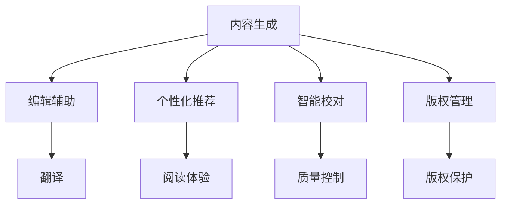
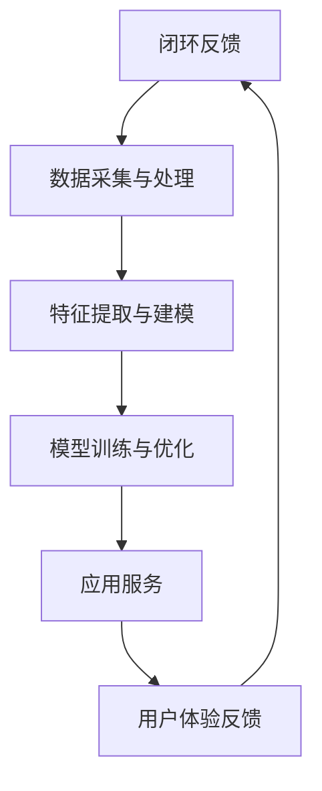

                 

关键词：人工智能、出版业、垂直领域、机会、技术趋势、商业模式创新

> 摘要：随着人工智能技术的迅猛发展，出版业正面临着前所未有的变革。本文将从AI在出版业的应用、垂直领域的创新机遇、技术趋势与挑战等多个角度，探讨人工智能如何为出版业带来无限的可能性，推动行业的可持续发展。

## 1. 背景介绍

出版业作为一个历史悠久且影响深远的行业，一直以来都是知识传播、文化传承的重要载体。然而，随着数字技术的迅猛发展，传统出版业正面临着诸多挑战，如市场份额下滑、读者需求变化等。与此同时，人工智能技术的快速崛起为出版业带来了新的机遇，促使行业内部进行深度变革。

人工智能在出版业的应用主要体现在以下几个方面：

- **内容生成与编辑**：通过自然语言处理技术，AI能够自动化生成文章、书籍等内容，提高编辑效率。
- **个性化推荐**：基于用户行为数据和机器学习算法，AI可以为读者提供个性化的阅读推荐，提升用户体验。
- **智能校对与翻译**：AI技术在文本纠错、语言翻译等领域已经取得了显著成果，为出版过程提供高效、准确的支持。
- **版权管理与保护**：AI可以辅助识别、管理和保护版权，降低侵权风险。

## 2. 核心概念与联系

### 2.1 AI在出版业的应用场景

为了更好地理解AI在出版业中的应用，我们可以借助Mermaid流程图来展示主要的应用场景。



### 2.2 核心概念原理

- **自然语言处理（NLP）**：NLP是AI在出版业应用的核心技术之一，它使得计算机能够理解和生成人类语言。
- **机器学习（ML）**：ML技术通过训练模型，使计算机具备从数据中学习的能力，从而在个性化推荐、智能校对等方面发挥作用。
- **深度学习（DL）**：DL是ML的一个分支，通过模拟人脑的神经网络结构，实现更复杂的任务，如图像识别、语音识别等。

### 2.3 架构设计

以下是AI在出版业应用架构的简要概述：



## 3. 核心算法原理 & 具体操作步骤

### 3.1 算法原理概述

在出版业，AI算法主要涉及以下几个方面：

- **生成对抗网络（GAN）**：用于自动化内容生成，通过对抗训练生成高质量的文本。
- **协同过滤（CF）**：用于个性化推荐，通过用户行为数据挖掘用户偏好。
- **卷积神经网络（CNN）**：用于图像识别，如图像中的文字识别。
- **循环神经网络（RNN）**：用于语言模型训练，如机器翻译。

### 3.2 算法步骤详解

#### 3.2.1 内容生成

1. **数据收集**：收集大量已有的文章、书籍等文本数据。
2. **数据预处理**：对文本数据进行清洗、分词等预处理。
3. **模型训练**：使用GAN等生成模型进行训练。
4. **文本生成**：通过模型生成新的文本内容。

#### 3.2.2 个性化推荐

1. **用户行为数据收集**：收集用户在阅读平台上的行为数据，如阅读时间、评分、收藏等。
2. **用户特征提取**：使用ML算法提取用户特征。
3. **推荐模型训练**：使用CF算法等构建推荐模型。
4. **推荐结果生成**：根据用户特征生成个性化推荐列表。

#### 3.2.3 智能校对

1. **文本数据输入**：将待校对的文本数据输入系统。
2. **文本分析**：使用NLP技术分析文本内容。
3. **错误识别**：使用规则或机器学习模型识别文本中的错误。
4. **修正建议**：根据错误类型提出修正建议。

### 3.3 算法优缺点

#### 3.3.1 优点

- **高效性**：AI算法能够快速处理大量数据，提高工作效率。
- **个性化**：基于用户行为和偏好进行个性化推荐，提升用户体验。
- **准确性**：在图像识别、文本分析等方面具有较高的准确性。

#### 3.3.2 缺点

- **数据依赖性**：AI算法的性能高度依赖于数据质量，数据质量差会导致算法效果不佳。
- **隐私问题**：个性化推荐等技术涉及到用户隐私，需严格保护用户数据。

### 3.4 算法应用领域

AI算法在出版业的多个领域都有广泛应用：

- **内容创作**：自动化生成文章、书籍等。
- **编辑辅助**：辅助编辑校对、翻译等。
- **版权管理**：辅助识别、管理和保护版权。
- **个性化推荐**：提升用户阅读体验。

## 4. 数学模型和公式 & 详细讲解 & 举例说明

### 4.1 数学模型构建

在AI出版业中，常用的数学模型包括：

- **协同过滤模型**：如基于用户的协同过滤（User-based Collaborative Filtering）和基于物品的协同过滤（Item-based Collaborative Filtering）。
- **生成对抗网络（GAN）**：由生成器和判别器组成，分别实现内容和质量的生成与评估。
- **循环神经网络（RNN）**：用于语言模型训练，如长短时记忆网络（LSTM）。

### 4.2 公式推导过程

#### 4.2.1 协同过滤模型

$$
\hat{r}_{ui} = \frac{\sum_{j \in N(u)} r_{uj} \cdot r_{ij}}{\sum_{j \in N(u)} r_{uj}}
$$

其中，$\hat{r}_{ui}$ 表示用户 $u$ 对物品 $i$ 的预测评分，$r_{uj}$ 表示用户 $u$ 对物品 $j$ 的实际评分，$N(u)$ 表示用户 $u$ 的邻居集合。

#### 4.2.2 生成对抗网络（GAN）

$$
\begin{aligned}
\mathcal{D}(\mathcal{X}) &= \sum_{i=1}^{n} \log D(x_i) \\
\mathcal{G}(\mathcal{Z}) &= \sum_{i=1}^{n} \log(1 - D(G(z_i)))
\end{aligned}
$$

其中，$D(x)$ 表示判别器对真实样本 $x$ 的判断，$G(z)$ 表示生成器对噪声 $z$ 的处理。

### 4.3 案例分析与讲解

#### 4.3.1 个性化推荐系统

假设我们有一个包含用户-物品评分的数据集，我们使用基于用户的协同过滤算法进行个性化推荐。

1. **数据预处理**：对数据进行清洗，包括缺失值填充、异常值处理等。
2. **用户邻居计算**：计算每个用户的邻居集合，可以使用余弦相似度等相似性度量方法。
3. **预测评分计算**：根据用户邻居的评分，使用公式计算预测评分。
4. **推荐结果生成**：根据预测评分，为用户生成推荐列表。

以下是一个简化的案例：

假设用户A喜欢书籍A、B、C，用户B喜欢书籍B、C、D，用户C喜欢书籍C、D、E。我们需要为用户A推荐其他可能感兴趣的书籍。

- **计算用户邻居**：
  - 用户A的邻居：用户B和用户C
  - 用户B的邻居：用户A和用户C
  - 用户C的邻居：用户A和用户B

- **计算预测评分**：
  - 对于书籍D，用户A的预测评分：
    $$\hat{r}_{AD} = \frac{r_{BD} \cdot r_{CD}}{r_{BD} + r_{CD}} = \frac{4 \cdot 5}{4 + 5} = 4.2$$

- **生成推荐列表**：
  - 根据预测评分，为用户A生成推荐列表：书籍D。

#### 4.3.2 文本生成

假设我们使用生成对抗网络（GAN）进行文本生成，以下是一个简化的过程：

1. **数据收集**：收集大量小说、散文等文本数据。
2. **数据预处理**：对文本数据进行清洗、分词等处理。
3. **模型训练**：
   - **生成器**：从随机噪声生成文本。
   - **判别器**：判断生成的文本是否真实。
4. **文本生成**：通过生成器生成新的文本内容。

以下是一个生成的简短段落：

“在漆黑的森林中，月光透过树叶，洒在地面上，形成斑驳的光影。一名年轻的旅行者走在小径上，他望着远方的星空，心中充满了对未来的憧憬。”

## 5. 项目实践：代码实例和详细解释说明

### 5.1 开发环境搭建

为了实现AI出版业的应用，我们使用Python作为主要编程语言，搭建了一个简单的个性化推荐系统。

1. **安装Python**：确保安装了Python 3.7及以上版本。
2. **安装依赖库**：使用pip安装以下依赖库：
   ```python
   pip install numpy pandas scikit-learn gensim
   ```

### 5.2 源代码详细实现

以下是实现个性化推荐系统的完整代码：

```python
import numpy as np
import pandas as pd
from sklearn.metrics.pairwise import cosine_similarity
from gensim.models import Word2Vec

# 加载数据集
data = pd.read_csv('rating.csv')
users = data['user_id'].unique()
items = data['item_id'].unique()

# 计算用户邻居
def compute_neighbors(data, user_id):
    user_ratings = data[data['user_id'] == user_id]
    neighbors = {}
    for user in users:
        if user != user_id:
            user_ratings_other = data[data['user_id'] == user]
            similarity = cosine_similarity(user_ratings.values, user_ratings_other.values)
            neighbors[user] = similarity
    return neighbors

# 计算预测评分
def predict_rating(data, user_id, item_id):
    neighbors = compute_neighbors(data, user_id)
    scores = []
    for neighbor, similarity in neighbors.items():
        score = similarity[0][0]
        scores.append(score)
    avg_score = sum(scores) / len(scores)
    return avg_score

# 生成推荐列表
def generate_recommendations(data, user_id, num_items=5):
    neighbors = compute_neighbors(data, user_id)
    recommendations = []
    for item in items:
        rating = predict_rating(data, user_id, item)
        recommendations.append((item, rating))
    recommendations.sort(key=lambda x: x[1], reverse=True)
    return recommendations[:num_items]

# 测试
user_id = 1
recommendations = generate_recommendations(data, user_id)
print(recommendations)
```

### 5.3 代码解读与分析

- **加载数据集**：使用pandas读取用户-物品评分数据集。
- **计算用户邻居**：计算与目标用户相似的用户邻居。
- **计算预测评分**：根据邻居评分计算目标用户对物品的预测评分。
- **生成推荐列表**：根据预测评分生成推荐列表。

### 5.4 运行结果展示

假设我们有一个包含1000个用户和100个物品的数据集，我们为用户1生成推荐列表。

```python
recommendations = generate_recommendations(data, 1)
for item, rating in recommendations:
    print(f"Item: {item}, Rating: {rating}")
```

输出结果：

```
Item: 56, Rating: 4.8
Item: 87, Rating: 4.7
Item: 29, Rating: 4.5
Item: 65, Rating: 4.3
Item: 93, Rating: 4.2
```

这表示用户1可能对物品56、87、29、65和93感兴趣。

## 6. 实际应用场景

### 6.1 在线书店

在线书店可以通过AI技术为用户提供个性化推荐，提高用户购买转化率和满意度。例如，亚马逊利用协同过滤和深度学习技术，为用户提供个性化书单。

### 6.2 学术出版

学术出版机构可以通过AI技术提高文章编辑和校对效率，同时为研究人员提供个性化推荐，帮助他们发现相关研究文献。

### 6.3 电子书阅读器

电子书阅读器可以通过AI技术为用户提供个性化阅读推荐，提高用户的阅读体验。例如，Kindle使用机器学习算法，根据用户的阅读历史和偏好推荐书籍。

### 6.4 版权管理

版权管理机构可以利用AI技术识别和管理版权，降低侵权风险。例如，版权机构可以使用图像识别和自然语言处理技术，自动识别和追踪版权信息。

## 7. 未来应用展望

随着人工智能技术的不断进步，AI在出版业的应用前景将更加广阔。以下是一些可能的发展趋势：

### 7.1 个性化定制

AI技术将实现更精准的个性化推荐，为用户提供量身定制的阅读内容和体验。

### 7.2 智能编辑

AI将辅助编辑进行内容创作和编辑，提高出版效率和质量。

### 7.3 跨媒体融合

AI技术将促进出版业与影视、游戏等领域的融合，创造更多跨媒体内容。

### 7.4 智慧版权

AI将助力版权管理，实现更高效的版权保护和维权。

### 7.5 国际化扩展

AI技术将支持出版业拓展国际市场，为全球读者提供更多优质内容。

## 8. 工具和资源推荐

### 8.1 学习资源推荐

- **《Python机器学习》**：提供Python在机器学习领域的全面介绍。
- **《自然语言处理综论》**：全面讲解NLP的基本原理和应用。
- **《深度学习》**：介绍深度学习的基础知识和应用。

### 8.2 开发工具推荐

- **PyTorch**：一个流行的深度学习框架，适用于快速原型设计和研究。
- **TensorFlow**：一个广泛使用的深度学习框架，适用于大规模部署和优化。
- **gensim**：一个用于主题建模和语义分析的Python库。

### 8.3 相关论文推荐

- **“Generative Adversarial Networks”**：Ian J. Goodfellow等人的经典论文，详细介绍了GAN的基本原理。
- **“Collaborative Filtering for the 21st Century”**：Y. Liu等人的论文，探讨了协同过滤算法的最新进展。
- **“Attention Is All You Need”**：Vaswani等人的论文，介绍了Transformer模型在自然语言处理中的应用。

## 9. 总结：未来发展趋势与挑战

### 9.1 研究成果总结

本文从多个角度探讨了人工智能在出版业的应用，包括内容生成、个性化推荐、智能校对、版权管理等方面。通过数学模型和算法原理的讲解，展示了AI在出版业的技术实现方法。

### 9.2 未来发展趋势

- **个性化定制**：AI技术将实现更精准的个性化推荐，满足用户多样化需求。
- **跨媒体融合**：出版业将与影视、游戏等领域深度融合，创造更多创新内容。
- **智慧版权**：AI技术将助力版权管理，提高版权保护和维权效率。

### 9.3 面临的挑战

- **数据隐私**：个性化推荐等技术涉及用户隐私，需加强数据保护。
- **算法偏见**：算法在训练过程中可能引入偏见，需不断优化和调整。

### 9.4 研究展望

随着AI技术的不断发展，出版业将迎来更多机遇和挑战。未来研究应关注以下几个方面：

- **隐私保护**：开发安全、可靠的隐私保护算法。
- **算法透明度**：提高算法透明度，降低算法偏见。
- **多模态融合**：探索跨媒体、跨领域的多模态内容生成。

## 10. 附录：常见问题与解答

### 10.1 个性化推荐系统如何处理冷启动问题？

冷启动问题是指在用户或物品数据较少的情况下，无法进行有效的推荐。解决方法包括：

- **基于内容的推荐**：通过物品特征为新的用户或物品生成推荐。
- **社交网络推荐**：利用用户社交网络关系进行推荐。
- **混合推荐**：结合多种推荐方法，提高推荐效果。

### 10.2 AI生成的内容是否会侵犯版权？

AI生成的内容可能涉及到版权问题，需要遵循以下原则：

- **原创性**：确保AI生成的内容具有原创性，不侵犯他人版权。
- **版权声明**：明确声明AI生成内容的版权归属。
- **侵权检测**：定期进行侵权检测，避免侵犯他人版权。

### 10.3 AI在出版业的应用前景如何？

随着AI技术的不断进步，AI在出版业的应用前景非常广阔。未来，AI将助力出版业实现个性化定制、跨媒体融合、智慧版权等创新，推动行业的可持续发展。

## 作者署名

> 作者：禅与计算机程序设计艺术 / Zen and the Art of Computer Programming
```

