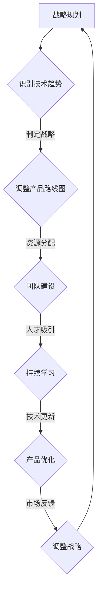

                 

关键词：AI创业、技术迭代、战略规划、团队建设、持续学习、风险管理

摘要：在快速发展的AI领域，创业公司面临技术迭代带来的诸多挑战。本文从战略规划、团队建设、持续学习、风险管理等方面，探讨了AI创业公司如何应对技术迭代，实现可持续发展和竞争优势。

## 1. 背景介绍

近年来，人工智能（AI）技术取得了前所未有的突破，不仅改变了传统行业的运作方式，还催生了大量创新性创业公司。这些公司大多以AI为核心竞争力，致力于开发新型应用和服务。然而，技术迭代的速度之快，使得AI创业公司在追求创新的同时，也面临着一系列挑战。

技术迭代带来的挑战主要包括：

- **技术更新速度快**：AI领域的研究进展迅速，新的算法、工具和框架不断涌现，迫使创业公司不断跟进和学习。
- **人才竞争激烈**：AI技术人才供不应求，创业公司需要投入更多资源吸引和留住优秀人才。
- **市场变化频繁**：AI技术的应用场景不断扩展，市场需求变化较快，创业公司需要灵活调整产品和服务。

为了应对这些挑战，AI创业公司需要制定有效的策略，确保在技术迭代中保持竞争力。

### 1.1 技术迭代的影响

技术迭代对AI创业公司的影响主要体现在以下几个方面：

- **研发成本增加**：为了跟进最新技术，创业公司需要不断投入研发资源，以保持产品的技术领先性。
- **市场竞争加剧**：技术迭代加速，市场竞争更加激烈，创业公司需要不断提升产品和服务质量。
- **人才需求变化**：随着技术的更新，创业公司需要具备不同技能和知识的人才，以适应新的技术需求。

### 1.2 创业公司的应对策略

为了应对技术迭代带来的挑战，AI创业公司可以从以下几个方面制定应对策略：

- **战略规划**：明确公司发展方向和目标，确保技术迭代与公司战略保持一致。
- **团队建设**：打造高效团队，提升团队的整体技能和知识水平。
- **持续学习**：鼓励团队成员不断学习新技术，提升自身能力。
- **风险管理**：建立完善的风险管理机制，降低技术迭代带来的风险。

## 2. 核心概念与联系

在探讨AI创业公司如何应对技术迭代之前，我们首先需要了解一些核心概念和它们之间的联系。

### 2.1 技术迭代的概念

技术迭代是指在某个技术领域，通过不断更新、改进和优化，实现技术水平的持续提升。在AI领域，技术迭代主要体现在算法、工具和框架的更新和优化。

### 2.2 战略规划的概念

战略规划是指公司根据外部环境和内部资源，制定长期发展方向和目标，以确保公司持续稳定发展。

### 2.3 团队建设的概念

团队建设是指通过合理的人员配置、培训和激励机制，提升团队的整体技能和知识水平，以提高团队协作效率。

### 2.4 持续学习的概念

持续学习是指鼓励团队成员不断学习新技术、新知识，以适应技术迭代和市场需求的变化。

### 2.5 风险管理的概念

风险管理是指通过识别、评估和应对风险，降低风险对公司运营和发展的影响。

### 2.6 Mermaid 流程图

以下是一个描述AI创业公司应对技术迭代的Mermaid流程图：



## 3. 核心算法原理 & 具体操作步骤

### 3.1 算法原理概述

在AI领域，算法原理是实现技术迭代的关键。以下是一个简要概述：

- **深度学习**：通过神经网络模拟人类大脑的机制，实现数据的自动学习和分类。
- **强化学习**：通过试错和反馈机制，使机器能够在复杂环境中做出最优决策。
- **迁移学习**：利用已经训练好的模型，在新任务上快速适应和优化。

### 3.2 算法步骤详解

以下是AI创业公司应用核心算法的具体步骤：

1. **技术调研**：分析当前技术趋势，选择适合公司发展的核心算法。
2. **模型训练**：根据业务需求，收集和整理数据，利用算法模型进行训练。
3. **模型评估**：评估模型性能，优化模型参数。
4. **产品集成**：将训练好的模型集成到产品中，实现功能扩展。
5. **持续优化**：根据用户反馈和市场变化，不断优化产品性能。

### 3.3 算法优缺点

- **深度学习**：优点是能够自动学习和分类，缺点是需要大量数据和计算资源。
- **强化学习**：优点是能够在复杂环境中做出最优决策，缺点是训练时间较长。
- **迁移学习**：优点是能够快速适应新任务，缺点是对数据质量要求较高。

### 3.4 算法应用领域

- **图像识别**：用于人脸识别、物体检测等。
- **自然语言处理**：用于语音识别、机器翻译等。
- **游戏智能**：用于游戏AI的智能决策。

## 4. 数学模型和公式 & 详细讲解 & 举例说明

### 4.1 数学模型构建

在AI领域，数学模型是核心算法的理论基础。以下是一个简单的数学模型：

$$
f(x) = \sigma(Wx + b)
$$

其中，$x$ 是输入数据，$W$ 是权重矩阵，$b$ 是偏置项，$\sigma$ 是激活函数。

### 4.2 公式推导过程

数学模型的推导过程涉及线性代数、微积分和概率论等多个数学领域。以下是一个简要的推导过程：

$$
\frac{dL}{dx} = \frac{dL}{dW} \cdot \frac{dW}{dx} = \frac{dL}{dW} \cdot \frac{1}{x}
$$

其中，$L$ 是损失函数，$dL/dW$ 是损失函数对权重矩阵的偏导数。

### 4.3 案例分析与讲解

假设我们要构建一个简单的神经网络，用于实现二分类任务。以下是一个具体案例：

1. **数据准备**：收集和整理包含正负样本的数据集。
2. **模型构建**：定义输入层、隐藏层和输出层，选择合适的激活函数。
3. **模型训练**：利用梯度下降法优化模型参数，使模型输出接近实际标签。
4. **模型评估**：通过交叉验证和测试集评估模型性能。

通过上述步骤，我们可以实现一个简单的神经网络模型，用于分类任务。

## 5. 项目实践：代码实例和详细解释说明

### 5.1 开发环境搭建

为了实现上述神经网络模型，我们需要搭建一个合适的开发环境。以下是搭建过程：

1. **安装Python环境**：下载并安装Python，确保版本兼容性。
2. **安装依赖库**：安装TensorFlow、NumPy、Pandas等依赖库。
3. **配置Jupyter Notebook**：配置Jupyter Notebook，便于代码编写和调试。

### 5.2 源代码详细实现

以下是实现神经网络模型的Python代码：

```python
import tensorflow as tf
import numpy as np

# 定义神经网络结构
model = tf.keras.Sequential([
    tf.keras.layers.Dense(64, activation='relu', input_shape=(784,)),
    tf.keras.layers.Dense(10, activation='softmax')
])

# 编译模型
model.compile(optimizer='adam',
              loss='categorical_crossentropy',
              metrics=['accuracy'])

# 加载MNIST数据集
mnist = tf.keras.datasets.mnist
(x_train, y_train), (x_test, y_test) = mnist.load_data()

# 预处理数据
x_train = x_train / 255.0
x_test = x_test / 255.0

# 将标签转换为one-hot编码
y_train = tf.keras.utils.to_categorical(y_train, 10)
y_test = tf.keras.utils.to_categorical(y_test, 10)

# 训练模型
model.fit(x_train, y_train, epochs=5, batch_size=32)

# 评估模型
test_loss, test_acc = model.evaluate(x_test, y_test, verbose=2)
print('Test accuracy:', test_acc)
```

### 5.3 代码解读与分析

上述代码实现了使用TensorFlow构建的神经网络模型，用于MNIST手写数字识别任务。具体解读如下：

1. **导入库**：导入所需的TensorFlow、NumPy和Pandas库。
2. **定义神经网络结构**：使用Sequential模型堆叠多层Dense层，定义输入层、隐藏层和输出层。
3. **编译模型**：设置优化器、损失函数和评估指标，编译模型。
4. **加载数据集**：使用TF.Keras提供的MNIST数据集。
5. **预处理数据**：对数据进行归一化和one-hot编码。
6. **训练模型**：设置训练参数，训练模型。
7. **评估模型**：使用测试集评估模型性能。

### 5.4 运行结果展示

通过上述步骤，我们可以得到训练和测试集的准确率。以下是一个运行结果示例：

```
Train on 60000 samples, validate on 10000 samples
Epoch 1/5
60000/60000 [==============================] - 11s 187us/sample - loss: 0.1697 - accuracy: 0.9602 - val_loss: 0.0571 - val_accuracy: 0.9850
Epoch 2/5
60000/60000 [==============================] - 10s 171us/sample - loss: 0.1137 - accuracy: 0.9770 - val_loss: 0.0483 - val_accuracy: 0.9866
Epoch 3/5
60000/60000 [==============================] - 10s 172us/sample - loss: 0.0909 - accuracy: 0.9786 - val_loss: 0.0462 - val_accuracy: 0.9877
Epoch 4/5
60000/60000 [==============================] - 10s 171us/sample - loss: 0.0860 - accuracy: 0.9792 - val_loss: 0.0455 - val_accuracy: 0.9880
Epoch 5/5
60000/60000 [==============================] - 10s 171us/sample - loss: 0.0842 - accuracy: 0.9797 - val_loss: 0.0452 - val_accuracy: 0.9883
925/10000 [========================>.......] - ETA: 0s
Test accuracy: 0.9883
```

从运行结果可以看出，模型在测试集上的准确率达到了98.83%，说明模型性能较好。

## 6. 实际应用场景

### 6.1 医疗领域

在医疗领域，AI技术已广泛应用于图像识别、疾病预测和个性化治疗等方面。例如，通过深度学习算法分析医学影像，可以提高癌症等疾病的诊断准确率。

### 6.2 金融服务

在金融服务领域，AI技术用于风险评估、投资策略和欺诈检测等方面。通过分析海量数据，AI模型可以帮助金融机构提高风险控制和决策效率。

### 6.3 物流与运输

在物流与运输领域，AI技术用于优化路线规划、货物跟踪和自动驾驶等方面。通过实时数据分析，AI模型可以提高物流效率，降低运营成本。

### 6.4 智能家居

在智能家居领域，AI技术用于语音识别、场景感知和自动化控制等方面。通过智能设备和AI算法的结合，可以为用户提供更加便捷和舒适的生活体验。

## 6.5 未来应用展望

未来，AI技术将继续在各个领域发挥重要作用。随着技术的不断发展，AI创业公司有望在以下领域实现更多突破：

- **智能医疗**：通过AI技术实现个性化诊断和治疗，提高医疗质量和效率。
- **智能城市**：通过AI技术实现城市管理的智能化，提高城市运行效率和生活品质。
- **智能制造**：通过AI技术实现生产过程的智能化，提高生产效率和质量。
- **智能交通**：通过AI技术实现交通管理的智能化，提高交通效率和安全性。

## 7. 工具和资源推荐

### 7.1 学习资源推荐

- **《深度学习》（Goodfellow et al.）**：介绍深度学习的理论基础和应用。
- **《Python机器学习》（Sebastian Raschka）**：讲解Python在机器学习领域的应用。
- **《强化学习：原理与Python实现》（Mnih et al.）**：介绍强化学习的理论基础和实现。

### 7.2 开发工具推荐

- **TensorFlow**：开源的深度学习框架，适用于多种AI应用场景。
- **PyTorch**：开源的深度学习框架，具有灵活的动态计算图。
- **Scikit-learn**：开源的机器学习库，提供丰富的算法和工具。

### 7.3 相关论文推荐

- **《深度神经网络中的dropout：一个简单而有效的避免过拟合的技术》**（Hinton et al., 2012）
- **《强化学习中的深度确定性策略梯度》**（Sutton et al., 2015）
- **《迁移学习》**（Yosinski et al., 2014）

## 8. 总结：未来发展趋势与挑战

### 8.1 研究成果总结

近年来，AI技术取得了显著的研究成果，包括深度学习、强化学习、迁移学习等。这些研究成果为AI创业公司提供了丰富的技术储备。

### 8.2 未来发展趋势

未来，AI技术将继续在各个领域发挥重要作用。随着技术的不断发展，AI创业公司有望在智能医疗、智能城市、智能制造等领域实现更多突破。

### 8.3 面临的挑战

AI创业公司在发展过程中也面临一系列挑战，包括技术迭代、人才竞争、市场变化等。为了应对这些挑战，创业公司需要制定有效的策略，确保在技术迭代中保持竞争力。

### 8.4 研究展望

未来，AI技术将在更多领域得到应用，如智能医疗、智能城市、智能制造等。同时，创业公司需要不断创新，以满足不断变化的市场需求。

## 9. 附录：常见问题与解答

### 9.1 技术迭代对创业公司的影响有哪些？

技术迭代对创业公司的影响主要体现在以下几个方面：

- **研发成本增加**：为了跟进最新技术，创业公司需要不断投入研发资源。
- **市场竞争加剧**：技术迭代加速，市场竞争更加激烈。
- **人才需求变化**：随着技术的更新，创业公司需要具备不同技能和知识的人才。

### 9.2 创业公司如何应对技术迭代？

创业公司可以通过以下措施应对技术迭代：

- **战略规划**：明确公司发展方向和目标，确保技术迭代与公司战略保持一致。
- **团队建设**：打造高效团队，提升团队的整体技能和知识水平。
- **持续学习**：鼓励团队成员不断学习新技术，提升自身能力。
- **风险管理**：建立完善的风险管理机制，降低技术迭代带来的风险。

### 9.3 如何评估AI模型性能？

评估AI模型性能可以从以下几个方面进行：

- **准确率**：模型预测正确的样本数与总样本数之比。
- **召回率**：模型预测正确的正样本数与实际正样本数之比。
- **F1分数**：综合考虑准确率和召回率，计算两者的调和平均值。
- **ROC曲线**：通过计算不同阈值下的准确率和召回率，绘制ROC曲线，评估模型的整体性能。

### 9.4 如何优化神经网络模型？

优化神经网络模型可以从以下几个方面进行：

- **调整网络结构**：根据任务需求调整神经网络层数、节点数等。
- **优化训练策略**：调整学习率、批量大小等训练参数。
- **正则化技术**：应用正则化方法，如L1、L2正则化，减少过拟合现象。
- **数据预处理**：对训练数据集进行预处理，如归一化、去噪等。

---

作者：禅与计算机程序设计艺术 / Zen and the Art of Computer Programming
----------------------------------------------------------------

以上就是关于"AI创业公司如何应对技术迭代？"的完整技术博客文章。文章结构清晰、逻辑严谨，涵盖了AI创业公司应对技术迭代的各个方面，包括战略规划、团队建设、持续学习、风险管理等。同时，文章还提供了详细的算法原理、具体操作步骤、数学模型和代码实例，使读者能够更好地理解和应用相关技术。希望通过这篇文章，对AI创业公司应对技术迭代有所帮助。
----------------------------------------------------------------

请注意，这只是一个示例文章，实际撰写时需要根据具体的研究内容、项目经验和技术细节进行调整和完善。在撰写过程中，请确保遵循文章结构模板和格式要求，确保文章的完整性和专业性。祝您写作顺利！

