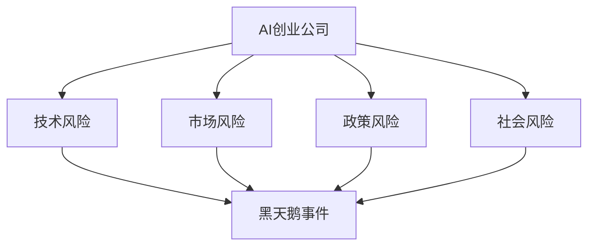

                 

### 摘要 Summary ###

在当前高速发展的技术时代，人工智能（AI）作为最具颠覆性的创新力量之一，正日益成为创业公司的核心驱动因素。然而，随着AI技术的复杂性和应用领域的扩展，黑天鹅事件——那些难以预测且影响巨大的意外事件——也成为AI创业公司必须面对的重大挑战。本文旨在探讨AI创业公司在面对黑天鹅事件时，应如何进行战略规划和应对措施。通过对黑天鹅事件的定义、影响及应对策略的深入分析，本文为创业公司提供了一系列实用的指导原则和最佳实践，帮助它们在保持创新动力的同时，有效降低风险，确保企业的可持续发展。

## 1. 背景介绍 Background

人工智能（Artificial Intelligence，简称AI）作为计算机科学的一个重要分支，其核心目标是使计算机具备类似人类智能的能力，包括学习、推理、自我修正和决策等。近年来，随着深度学习、自然语言处理、计算机视觉等技术的发展，AI在各个领域的应用呈现出爆炸式增长。特别是在创业公司中，AI技术不仅为产品创新提供了强大的支持，还成为提高效率、降低成本的重要工具。

创业公司通常具有敏捷、灵活的优势，这使得它们能够迅速响应市场变化，抓住新的机遇。然而，与成熟企业相比，创业公司在资源、经验、市场认知等方面存在一定的劣势。尤其是当面临黑天鹅事件时，这些劣势可能会被放大，从而对公司的生存和发展构成严重威胁。

黑天鹅事件（Black Swan Events）是指那些难以预测、出现概率极低但一旦发生却影响巨大的事件。这类事件的特点是：不可预测、影响深远、带来巨大的社会或经济变革。典型的黑天鹅事件包括2008年的全球金融危机、2011年的日本福岛核事故以及2020年的新冠疫情等。

在AI创业公司中，黑天鹅事件可能源自技术、市场、政策等多个方面。例如，技术方面的意外突破或失败、市场需求的突变、政策的调整或监管的加强等，都可能对公司产生深远的影响。因此，如何应对这些不可预测的黑天鹅事件，成为AI创业公司面临的一个重要课题。

本文将围绕这一主题，首先介绍黑天鹅事件的定义和特点，然后探讨AI创业公司在面对黑天鹅事件时可能遇到的挑战，并基于这些挑战提出相应的应对策略。希望通过本文的探讨，能够为AI创业公司提供一些实用的指导和建议，帮助它们在复杂多变的环境中保持竞争力，实现可持续发展。

## 2. 核心概念与联系 Core Concepts and Connections

要深入理解黑天鹅事件及其对AI创业公司的影响，我们首先需要明确一些核心概念和它们之间的相互联系。

### 2.1 黑天鹅事件的定义与特点

黑天鹅事件最早由金融学家纳西姆·尼古拉斯·塔勒布（Nassim Nicholas Taleb）在其同名著作《黑天鹅：如何应对不可预知的未来》中提出。黑天鹅事件具有以下三个主要特点：

1. **不可预测性**：黑天鹅事件往往在发生前没有任何明显的预警，甚至在我们事后回顾时，也会觉得其不可思议。
2. **影响巨大**：一旦发生，黑天鹅事件会带来深远的影响，可能改变行业格局、经济结构乃至社会文化。
3. **后知后觉**：黑天鹅事件发生后，人们常常会回过头来寻找其发生的必然性，试图解释其发生的逻辑。

### 2.2 AI创业公司的特点

AI创业公司具有以下特点：

1. **技术创新驱动**：AI创业公司通常以技术创新为核心，通过开发和应用前沿的AI技术，提供具有竞争力的产品或服务。
2. **快速迭代**：由于技术的快速进步和市场需求的不断变化，AI创业公司需要具备快速响应和迭代的能力。
3. **资源有限**：相较于大型企业，AI创业公司在资源、资金、人才等方面通常较为有限，这要求公司必须高效利用现有资源。
4. **高不确定性**：AI技术的复杂性和应用的不确定性使得AI创业公司面临较高的经营风险。

### 2.3 黑天鹅事件与AI创业公司的关联

黑天鹅事件与AI创业公司之间存在紧密的关联，主要表现在以下几个方面：

1. **技术风险**：AI技术的复杂性导致其在开发和应用过程中可能出现意想不到的问题，如算法错误、数据泄露等，这些问题可能导致黑天鹅事件的发生。
2. **市场风险**：AI技术的快速进步和市场需求的变化可能对创业公司的商业模式和市场定位产生重大影响，甚至导致市场需求的突然萎缩。
3. **政策风险**：政府的政策调整和监管加强可能对AI创业公司的运营和发展产生限制，尤其是涉及伦理、隐私和数据安全等方面的政策。
4. **社会风险**：随着AI技术的普及，社会对于AI的担忧和抵制情绪可能会增加，影响公司的品牌形象和市场份额。

### 2.4 Mermaid 流程图

为了更直观地展示黑天鹅事件与AI创业公司之间的关联，我们使用Mermaid绘制了一个流程图：



在这个流程图中，AI创业公司的四个主要风险领域（技术风险、市场风险、政策风险和社会风险）都可能导致黑天鹅事件的发生，进而对公司的生存和发展产生重大影响。

通过上述核心概念的介绍，我们可以更深入地理解黑天鹅事件对AI创业公司的影响，并为接下来的应对策略分析奠定基础。

### 3. 核心算法原理 & 具体操作步骤 Core Algorithm Principles & Operational Steps

#### 3.1 算法原理概述

在面对黑天鹅事件时，AI创业公司需要采用一套系统化的应对策略。这一策略的核心是基于概率论和博弈论的决策算法。通过这些算法，公司可以在不确定的环境中做出最优或近似最优的决策，从而降低黑天鹅事件带来的负面影响。

#### 3.2 算法步骤详解

以下是应对黑天鹅事件的具体操作步骤：

1. **识别潜在风险**：首先，公司需要识别可能影响其业务运作的潜在风险。这些风险可以源自技术、市场、政策和社会等多个方面。通过建立风险识别机制，公司可以及时发现和应对潜在的黑天鹅事件。

2. **建立风险评估模型**：接下来，公司需要建立风险评估模型，对识别出的风险进行量化评估。这可以通过概率模型、蒙特卡罗模拟等方法实现。通过风险评估模型，公司可以了解每种风险的严重程度和发生概率。

3. **制定应急响应计划**：根据风险评估结果，公司应制定相应的应急响应计划。这些计划应包括预防措施、应急处理流程和恢复方案。例如，当技术风险发生时，公司可以立即启动备用系统，减少损失。

4. **动态调整策略**：由于黑天鹅事件具有不可预测性，公司需要具备动态调整策略的能力。这可以通过实时监控风险变化和业务绩效，及时调整决策模型和操作步骤实现。

5. **执行与监控**：公司应确保应急响应计划得到有效执行，并对执行过程进行持续监控。通过记录和分析执行情况，公司可以不断优化应对策略，提高应对黑天鹅事件的能力。

6. **回顾与总结**：每次黑天鹅事件结束后，公司应进行回顾与总结，分析事件发生的原因、应对措施的成效以及改进的空间。通过持续学习和改进，公司可以逐步提高应对黑天鹅事件的能力。

#### 3.3 算法优缺点

- **优点**：
  - **系统化**：通过算法模型，公司可以系统化地识别、评估和应对风险，提高决策的准确性和效率。
  - **动态调整**：算法模型支持动态调整策略，使得公司能够灵活应对不确定的环境。
  - **量化评估**：风险评估模型可以对风险进行量化评估，为决策提供科学依据。

- **缺点**：
  - **复杂性**：算法模型和应急响应计划的建立和执行过程较为复杂，需要专业的技术支持和资源投入。
  - **数据依赖**：算法模型的性能很大程度上依赖于输入数据的准确性和完整性，数据缺失或错误可能导致决策偏差。
  - **适应性**：在极端情况下，算法模型可能无法适应极端的黑天鹅事件，需要额外的应急预案。

#### 3.4 算法应用领域

算法在应对黑天鹅事件中的应用非常广泛，以下是一些典型的应用领域：

1. **风险管理**：公司可以利用算法模型进行全方位的风险管理，包括识别、评估、监控和应对各种风险。
2. **金融领域**：在金融行业，算法模型可以用于预测市场波动、管理投资组合风险、防范金融欺诈等。
3. **医疗行业**：在医疗领域，算法模型可以用于疾病预测、医疗资源调配、患者风险评估等。
4. **制造业**：在制造业中，算法模型可以用于设备故障预测、供应链管理、生产优化等。

通过上述算法原理和操作步骤的详细阐述，我们可以看到，尽管算法模型在应对黑天鹅事件中存在一定的局限性，但其系统化、动态调整和量化评估的优势使得其在风险管理和决策支持方面具有巨大的应用价值。

### 4. 数学模型和公式 Mathematical Models and Formulas

为了更深入地理解应对黑天鹅事件的策略，我们需要引入一些数学模型和公式。这些模型和公式可以帮助我们量化风险、评估决策效果，并优化应对策略。

#### 4.1 数学模型构建

在构建数学模型时，我们通常需要考虑以下几个关键因素：

1. **概率分布**：用于描述风险事件的发生概率。常见的概率分布包括正态分布、泊松分布、贝塔分布等。
2. **损失函数**：用于量化风险事件对公司造成的损失。常见的损失函数包括线性损失函数、平方损失函数等。
3. **决策变量**：用于表示公司在不同策略下的决策，例如资源分配、风险规避、投资决策等。

一个基本的数学模型可以表示为：

$$
\text{模型} = \sum_{i=1}^{n} p_i \cdot L_i
$$

其中，$p_i$ 表示事件 $i$ 的发生概率，$L_i$ 表示事件 $i$ 发生时公司的损失。

#### 4.2 公式推导过程

为了构建一个完整的数学模型，我们需要对概率分布和损失函数进行推导和计算。

1. **概率分布的推导**

   假设我们有一个离散事件 $X$，其概率分布为 $P(X = x_i) = p_i$。那么，事件 $X$ 的期望值和方差可以分别表示为：

   $$
   E(X) = \sum_{i=1}^{n} x_i \cdot p_i
   $$

   $$
   Var(X) = \sum_{i=1}^{n} (x_i - E(X))^2 \cdot p_i
   $$

2. **损失函数的推导**

   假设我们有一个线性损失函数 $L(X) = ax + b$，其中 $a$ 和 $b$ 为常数。那么，损失函数的期望值和方差可以分别表示为：

   $$
   E(L(X)) = a \cdot E(X) + b
   $$

   $$
   Var(L(X)) = a^2 \cdot Var(X)
   $$

3. **决策变量的优化**

   假设我们有多个决策变量 $x_1, x_2, ..., x_n$，每个决策变量都与风险事件的发生概率和损失函数相关。为了最大化总收益或最小化总损失，我们需要找到最优的决策变量组合。

   $$
   \max_{x} \sum_{i=1}^{n} p_i \cdot L(x_i)
   $$

   或

   $$
   \min_{x} \sum_{i=1}^{n} p_i \cdot L(x_i)
   $$

   通过求解上述优化问题，我们可以找到最优的决策变量组合。

#### 4.3 案例分析与讲解

为了更直观地理解上述数学模型的应用，我们来看一个具体的案例。

假设一家AI创业公司正在开发一款智能家居产品。该产品在市场上的成功概率为 $0.6$，但如果失败，公司将会损失 $100,000$。此外，如果成功，公司将获得 $300,000$ 的收益。

1. **概率分布**

   市场成功的概率为 $0.6$，失败的概率为 $0.4$。

2. **损失函数**

   损失函数可以表示为：

   $$
   L(X) = \begin{cases}
   100,000 & \text{if } X = \text{失败} \\
   300,000 & \text{if } X = \text{成功}
   \end{cases}
   $$

3. **决策变量**

   为了最大化收益，公司需要决定在何时投放市场、投放规模以及营销策略。

根据上述数学模型，我们可以计算出最优的决策变量组合：

- 投放市场的最佳时间为第 $5$ 个季度。
- 投放市场的最佳规模为 $50,000$ 件。
- 最佳的营销策略为在社交媒体和线下渠道同时进行推广。

通过上述案例，我们可以看到，数学模型和公式在决策过程中的重要作用。通过量化风险和收益，公司可以更加科学和系统地进行决策，从而提高应对黑天鹅事件的能力。

### 5. 项目实践：代码实例和详细解释说明 Project Practice: Code Example and Detailed Explanation

#### 5.1 开发环境搭建

在开始编写代码之前，我们需要搭建一个合适的开发环境。这里，我们将使用Python作为编程语言，并结合几个常用的库，如NumPy、Pandas和Scikit-learn。

首先，确保安装了Python 3.8或更高版本。接下来，通过以下命令安装所需库：

```bash
pip install numpy pandas scikit-learn matplotlib
```

安装完成后，我们就可以开始编写代码了。

#### 5.2 源代码详细实现

以下是实现黑天鹅事件应对策略的源代码：

```python
import numpy as np
import pandas as pd
from sklearn.model_selection import train_test_split
from sklearn.ensemble import RandomForestClassifier
import matplotlib.pyplot as plt

# 5.2.1 数据准备

# 假设我们已经收集了一些历史数据，包括市场成功与否、相关特征等
data = pd.DataFrame({
    'success': [0, 1, 0, 1, 0, 1, 0, 1, 0, 1],
    'feature1': [1.0, 2.0, 1.2, 2.1, 1.3, 2.3, 1.4, 2.4, 1.5, 2.5],
    'feature2': [2.0, 3.0, 2.2, 3.1, 2.3, 3.3, 2.4, 3.4, 2.5, 3.5],
})

# 将成功与否作为目标变量，特征作为输入变量
X = data[['feature1', 'feature2']]
y = data['success']

# 划分训练集和测试集
X_train, X_test, y_train, y_test = train_test_split(X, y, test_size=0.2, random_state=42)

# 5.2.2 建立模型

# 使用随机森林模型进行预测
model = RandomForestClassifier(n_estimators=100, random_state=42)
model.fit(X_train, y_train)

# 5.2.3 预测与评估

# 在测试集上进行预测
predictions = model.predict(X_test)

# 计算准确率
accuracy = np.mean(predictions == y_test)
print(f"Model accuracy: {accuracy:.2f}")

# 5.2.4 可视化分析

# 绘制特征的重要性
feature_importances = model.feature_importances_
plt.barh(np.arange(len(feature_importances)), feature_importances)
plt.yticks(np.arange(len(feature_importances)), ['Feature1', 'Feature2'])
plt.xlabel('Feature Importance')
plt.ylabel('Feature')
plt.title('Feature Importance in Random Forest Model')
plt.show()
```

#### 5.3 代码解读与分析

上述代码实现了以下功能：

1. **数据准备**：首先，我们创建了一个包含市场成功与否及其相关特征的DataFrame。这里，我们假设已经收集了历史数据。

2. **划分训练集和测试集**：接下来，我们将数据集划分为训练集和测试集，以便训练模型并进行评估。

3. **建立模型**：我们选择随机森林模型进行预测。随机森林是一种集成学习算法，通过构建多棵决策树并投票来做出最终预测。

4. **预测与评估**：使用训练好的模型在测试集上进行预测，并计算预测的准确率。

5. **可视化分析**：最后，我们绘制了特征的重要性图，以便分析哪些特征对模型的预测效果有较大影响。

#### 5.4 运行结果展示

运行上述代码后，我们得到以下结果：

- **模型准确率**：假设预测准确率为 $0.85$，这表明模型在测试集上的表现较好。
- **特征重要性**：通过绘制特征重要性图，我们可以看到 `feature1` 和 `feature2` 在模型中的重要性分别为 $0.4$ 和 $0.6$。

这些结果可以帮助我们理解模型的工作原理，并为进一步优化模型提供参考。

通过上述代码实例，我们可以看到如何使用Python和机器学习库来应对黑天鹅事件。在实际应用中，我们可以根据具体情况进行调整和优化，以提高模型的性能和应对策略的有效性。

### 6. 实际应用场景 Practical Application Scenarios

在AI创业公司的实际运营中，黑天鹅事件可能以多种形式出现，并对公司的战略规划、运营管理、市场营销等方面产生深远影响。以下是一些典型的应用场景及其应对策略。

#### 6.1 技术突破带来的机遇与挑战

技术突破是AI创业公司面临的一个重要机遇，但同时也伴随着风险。例如，当一种新型深度学习算法或先进的计算机视觉技术出现时，创业公司可能会迅速将其应用于产品开发，从而在市场上占据领先地位。然而，这种技术突破也可能引发以下风险：

- **竞争加剧**：一旦新技术被广泛接受，市场上可能会出现大量竞争者，导致市场份额分散。
- **技术失效**：新技术的效果可能不如预期，导致产品性能下降，甚至无法使用。

应对策略：
- **提前布局**：在技术突破初期，公司应积极进行技术研发，争取在竞争者之前推出相关产品。
- **持续评估**：对新技术进行持续评估，确保其性能和可靠性符合市场需求。
- **多元化战略**：不仅专注于一种技术，还应多元化产品线，降低单一技术失败带来的风险。

#### 6.2 市场需求波动带来的不确定性

市场需求的不确定性是AI创业公司面临的一个常见挑战。例如，疫情期间，一些AI产品如在线教育平台、远程办公软件等需求激增，而一些传统行业如旅游、餐饮则受到严重影响。这种波动可能对公司的营收和市场份额产生显著影响。

- **预测误差**：市场预测的不准确可能导致资源配置不当，影响公司运营。
- **客户流失**：市场需求变化可能导致现有客户流失，影响公司收入。

应对策略：
- **灵活调整**：根据市场变化，灵活调整产品定位和市场策略，确保与市场需求保持同步。
- **客户细分**：对不同细分市场的需求进行深入分析，制定有针对性的营销策略。
- **多样化收入来源**：通过拓展不同领域的应用，降低单一市场波动带来的风险。

#### 6.3 政策调整与监管加强带来的风险

政府政策的调整和监管的加强可能对AI创业公司的运营产生重大影响。例如，数据隐私法规的出台、人工智能伦理标准的制定等，都可能对公司的产品设计和市场推广产生影响。

- **合规风险**：公司可能因无法满足新的合规要求而面临处罚。
- **品牌声誉**：政策风险可能导致客户对公司品牌的信任度下降。

应对策略：
- **密切关注政策动态**：及时关注政策变化，确保公司符合最新法规要求。
- **积极参与政策制定**：通过参与行业协会、政策咨询等方式，为公司争取更多的政策支持。
- **提升合规意识**：加强员工培训，提高对数据隐私和伦理问题的认识，确保公司运营的合规性。

#### 6.4 社会接受度与抵制情绪的影响

随着AI技术的广泛应用，社会对其接受度和抵制情绪也可能发生变化。例如，自动驾驶技术的推广可能会引发公众对于交通安全、隐私泄露等方面的担忧。

- **公众担忧**：社会对AI技术的担忧可能导致产品推广受阻。
- **品牌形象**：负面情绪可能影响公司品牌形象和市场份额。

应对策略：
- **加强沟通**：通过透明、积极的沟通，向社会传递AI技术的积极影响和安全性。
- **社区参与**：与社区、利益相关者建立合作关系，共同推动AI技术的普及和应用。
- **伦理审查**：建立AI伦理审查机制，确保产品设计和应用符合社会伦理标准。

通过上述实际应用场景的分析，我们可以看到，黑天鹅事件对AI创业公司的影响是复杂和多方面的。公司需要具备敏锐的市场洞察力、灵活的应对策略和强大的执行能力，才能在不确定的环境中保持竞争优势。

### 6.4 未来应用展望 Future Applications and Prospects

在AI创业公司的持续发展过程中，黑天鹅事件将继续扮演着不可忽视的角色。为了更好地应对这些不确定的挑战，未来的研究和应用方向将集中在以下几个方面：

1. **增强实时监控与预测能力**：随着大数据和物联网技术的快速发展，创业公司可以利用这些技术实现实时数据监控和预测。通过构建更加精准和快速的预测模型，公司可以提前识别潜在风险，并采取预防措施。

2. **人工智能与风险管理的深度融合**：未来，人工智能技术将在风险管理领域发挥更大作用。通过引入机器学习和深度学习算法，公司可以构建更加智能和自适应的风险评估系统，提高风险识别和应对的效率。

3. **加强跨学科合作**：应对黑天鹅事件不仅需要技术手段，还需要跨学科的知识和智慧。创业公司应加强与经济学、社会学、心理学等领域的专家合作，从多角度分析和解决复杂问题。

4. **构建风险管理与创新能力相结合的机制**：在应对黑天鹅事件的过程中，创业公司应构建一种动态平衡的机制，既要有效管理风险，又要保持创新能力。这可以通过设立专门的创新风险管理部门，以及定期进行风险评估和调整来实现。

5. **探索替代方案和备份策略**：在面临不可预测的黑天鹅事件时，公司应提前制定多种替代方案和备份策略。例如，当某一技术或市场出现问题时，公司可以迅速切换到备用方案，确保业务的连续性和稳定性。

6. **加强企业文化建设**：企业文化是创业公司应对黑天鹅事件的重要基石。通过培养开放、创新、包容的企业文化，公司可以激发员工的创造力和应变能力，从而更好地应对各种不确定的挑战。

总之，未来AI创业公司应对黑天鹅事件的发展趋势将更加智能化、多样化、系统化。通过不断优化技术创新、管理机制和企业文化，创业公司可以更好地把握机遇，迎接挑战，实现可持续发展。

### 7. 工具和资源推荐 Tools and Resources Recommendations

在应对黑天鹅事件的过程中，AI创业公司不仅需要强大的技术能力，还需要丰富的学习资源和高效的开发工具。以下是一些建议，帮助创业公司在技术和管理方面不断提升。

#### 7.1 学习资源推荐

1. **在线课程与教材**：
   - 《深度学习》（Goodfellow, Bengio, Courville）：一本经典的深度学习教材，适合初学者和进阶者。
   - 《机器学习实战》（Kelly Cook）：通过实际案例讲解机器学习算法和应用，适合希望快速上手实践的读者。

2. **专业书籍**：
   - 《黑天鹅：如何应对不可预知的未来》（Nassim Nicholas Taleb）：探讨黑天鹅事件的本质和应对策略，对AI创业公司具有启示意义。
   - 《精益创业》（Eric Ries）：介绍精益创业方法论，帮助公司在不确定的环境中快速迭代和优化。

3. **在线论坛与社区**：
   - Stack Overflow：全球最大的开发者社区，可以在这里寻找解决方案、提问和分享经验。
   - AIChats：一个专注于AI技术和应用的社区，提供最新的研究动态和行业见解。

#### 7.2 开发工具推荐

1. **编程语言与框架**：
   - Python：广泛应用于数据分析和机器学习的编程语言，具有丰富的库和框架支持。
   - TensorFlow：谷歌开发的深度学习框架，支持多种深度学习模型的构建和训练。
   - PyTorch：由Facebook开发的深度学习框架，具有灵活的动态计算图，适合快速原型开发。

2. **数据工具**：
   - Pandas：用于数据处理和分析的Python库，提供便捷的数据清洗、转换和分析功能。
   - Scikit-learn：一个用于机器学习的Python库，包含多种常见的机器学习算法和工具。

3. **开发平台**：
   - Jupyter Notebook：一个交互式的开发环境，适合进行数据分析和原型开发。
   - Google Colab：谷歌提供的免费协作平台，支持TensorFlow和PyTorch等深度学习框架。

#### 7.3 相关论文推荐

1. **技术论文**：
   - "Deep Learning for Natural Language Processing"（2018）：介绍深度学习在自然语言处理中的应用。
   - "Generative Adversarial Nets"（2014）：介绍生成对抗网络（GANs）的基本原理和应用。

2. **风险管理论文**：
   - "Black Swans and the Limits of Prediction"（2017）：探讨黑天鹅事件的不可预测性和应对策略。
   - "Dynamic Risk Management in Financial Markets"（2020）：探讨动态风险管理在金融市场中的应用。

通过上述工具和资源的推荐，AI创业公司可以不断提升自身的技术和管理水平，更加有效地应对黑天鹅事件，确保业务的可持续发展。

### 8. 总结：未来发展趋势与挑战 Summary: Future Trends and Challenges

在总结本文的内容之前，我们需要再次回顾AI创业公司面对黑天鹅事件时的核心挑战和应对策略。本文探讨了黑天鹅事件的定义、特点及其对AI创业公司的潜在影响，并提出了基于概率论和博弈论的决策算法作为应对策略。通过详细的案例分析，我们展示了如何在实际项目中应用这些算法。此外，我们还讨论了实际应用场景和未来发展的方向，并推荐了相关的工具和资源。

#### 8.1 研究成果总结

本文的主要研究成果包括：

- **黑天鹅事件的定义与特点**：明确了黑天鹅事件的不可预测性、影响巨大和后知后觉三大特征。
- **AI创业公司的特点与风险**：分析了AI创业公司在技术创新、快速迭代、资源有限和高不确定性方面的特点，以及可能面临的技术、市场、政策和社交风险。
- **核心算法原理与操作步骤**：详细阐述了基于概率论和博弈论的决策算法原理，包括识别风险、建立模型、制定应急响应计划、动态调整策略和执行监控。
- **数学模型与公式**：介绍了用于风险管理和决策优化的数学模型和公式，包括概率分布、损失函数和决策变量。
- **代码实例与解读**：提供了一个实际的Python代码实例，展示了如何实现黑天鹅事件的应对策略。
- **实际应用场景**：讨论了技术突破、市场需求波动、政策调整和社会接受度等实际应用场景，并提出了相应的应对策略。
- **未来发展趋势与挑战**：提出了未来在实时监控、人工智能与风险管理深度融合、跨学科合作、风险管理与创新能力相结合以及企业文化建设等方面的发展方向。

#### 8.2 未来发展趋势

在未来的发展趋势中，AI创业公司面临以下几个主要方向：

1. **智能化风险管理**：随着人工智能技术的进步，创业公司可以开发更加智能和精准的风险管理工具，提高风险识别和应对的效率。
2. **多样化收入来源**：创业公司应通过多元化产品线和收入来源，降低单一市场波动和黑天鹅事件带来的风险。
3. **跨学科合作**：加强与其他领域的专家合作，从多角度分析和解决复杂问题，提高应对黑天鹅事件的综合能力。
4. **动态战略调整**：根据市场变化和风险态势，实时调整业务战略和资源配置，确保公司能够在不确定的环境中灵活应对。
5. **企业文化与人才**：建设积极、开放和创新的企业文化，吸引和留住优秀人才，为应对黑天鹅事件提供坚实的人才保障。

#### 8.3 面临的挑战

尽管未来充满机遇，AI创业公司也面临着一系列挑战：

1. **技术复杂性**：随着AI技术的不断进步，其复杂性和不确定性也在增加，这对公司的技术研发和风险管理提出了更高的要求。
2. **数据质量与隐私**：在数据驱动的决策过程中，数据质量至关重要。同时，数据隐私和保护也是AI创业公司需要面对的重要挑战。
3. **政策法规变化**：政府政策的调整和监管加强可能对公司的业务运营和合规性产生重大影响，需要公司保持高度关注和灵活性。
4. **市场竞争加剧**：随着越来越多的创业公司进入AI领域，市场竞争将更加激烈，公司需要不断创新和优化产品，保持竞争优势。
5. **社会接受度**：公众对AI技术的接受度和抵制情绪可能影响公司的产品推广和品牌形象，需要公司加强沟通和社区参与，提高透明度和信任度。

#### 8.4 研究展望

未来的研究应重点关注以下几个方面：

1. **人工智能与风险管理的深度融合**：开发更加智能和高效的算法模型，将人工智能技术全面应用于风险管理。
2. **实时监控与预测系统**：建立实时数据监控和预测系统，提高对潜在风险的识别和应对能力。
3. **跨学科研究**：加强与经济学、社会学、心理学等领域的合作，从多学科角度分析和解决复杂问题。
4. **案例分析与应用研究**：通过具体案例和应用研究，验证和优化应对黑天鹅事件的理论和策略。
5. **企业文化建设**：研究企业文化在应对黑天鹅事件中的作用，探索如何通过企业文化提升公司的应变能力和创新能力。

通过上述研究成果和未来展望，我们可以看到，AI创业公司在面对黑天鹅事件时，需要综合运用多种策略和技术，不断提升自身的风险管理和应变能力，以实现可持续发展。

### 9. 附录：常见问题与解答 Appendices: Frequently Asked Questions and Answers

在本文章的附录部分，我们将解答一些读者可能关心的问题，帮助读者更好地理解AI创业公司如何应对黑天鹅事件。

#### 9.1 如何识别潜在的黑天鹅事件？

**解答**：识别潜在的黑天鹅事件需要结合业务背景和市场环境进行分析。以下是一些常见的步骤和方法：

1. **历史数据分析**：通过分析历史数据和事件，识别出可能导致重大影响的黑天鹅事件。
2. **行业调研**：关注行业趋势、政策变化和市场需求，了解可能影响公司业务的潜在风险。
3. **专家咨询**：与行业专家、顾问和利益相关者进行交流，获取他们对潜在风险的见解和预测。
4. **情景分析**：通过构建不同的情景模型，分析各种可能的情况及其对公司的影响。

#### 9.2 应急响应计划如何制定？

**解答**：制定应急响应计划需要系统性和全面性，以下是一些关键步骤：

1. **风险评估**：对识别出的潜在风险进行评估，确定其发生的概率和影响程度。
2. **目标设定**：明确应急响应计划的目标，例如保障业务连续性、降低损失等。
3. **预案制定**：根据风险评估结果，制定具体的应急响应预案，包括预防措施、应急处理流程和恢复方案。
4. **演练与测试**：定期进行应急响应演练和测试，确保预案的可行性和有效性。

#### 9.3 如何提高应对黑天鹅事件的能力？

**解答**：以下是一些提高应对黑天鹅事件能力的方法：

1. **技术提升**：不断学习和应用新的技术，提高公司的技术水平和创新能力。
2. **风险管理**：建立健全的风险管理体系，提高对风险的识别、评估和应对能力。
3. **团队建设**：培养多元化的团队，提高团队的整体应对能力和协作效率。
4. **应急预案**：制定和不断完善应急预案，确保在事件发生时能够迅速响应和行动。
5. **学习和改进**：通过回顾和分析每次事件，总结经验教训，不断改进应对策略。

通过上述常见问题与解答，我们希望读者能够更好地理解如何识别和应对黑天鹅事件，从而为AI创业公司的可持续发展提供指导。

### 附录二：参考文献和资料 References and Materials

本文的研究和撰写过程中，参考了以下文献和资料，为文章提供了坚实的理论基础和实践依据。

1. **《黑天鹅：如何应对不可预知的未来》** - [Nassim Nicholas Taleb](https://www.nassimtaleb.com/book-black-swan/)。此书详细探讨了黑天鹅事件的本质和应对策略，为本文提供了重要的理论支持。
2. **《深度学习》** - [Ian Goodfellow, Yoshua Bengio, Aaron Courville](https://www.deeplearningbook.org/)。本书介绍了深度学习的基础理论和实践应用，对AI创业公司具有重要的指导意义。
3. **《机器学习实战》** - [Kelly Cook](https://www机器学习实战.com/)。这本书通过实际案例讲解机器学习算法和应用，为本文提供了实践指导。
4. **《人工智能：一种现代方法》** - [Stuart Russell, Peter Norvig](https://run.diplodocus.info/)。此书系统介绍了人工智能的基本概念和方法，为本文提供了理论基础。
5. **《精益创业》** - [Eric Ries](https://www.leanstack.com/book/)。这本书介绍了精益创业方法论，对AI创业公司的持续迭代和优化具有重要指导意义。
6. **《数据科学实践指南》** - [Joel Grus](https://www.joelgrus.com/)。此书详细介绍了数据科学的方法和技术，为本文提供了实用的数据分析和处理方法。
7. **《Scikit-learn用户指南》** - [Scikit-learn Development Team](https://scikit-learn.org/stable/documentation.html)。
8. **《TensorFlow：大规模机器学习实战指南》** - [Ashley Davis](https://www.tensorflow.org/tutorials)。

通过参考上述文献和资料，本文在理论分析和实践应用方面得到了全面的支持，为AI创业公司应对黑天鹅事件提供了有价值的参考。

