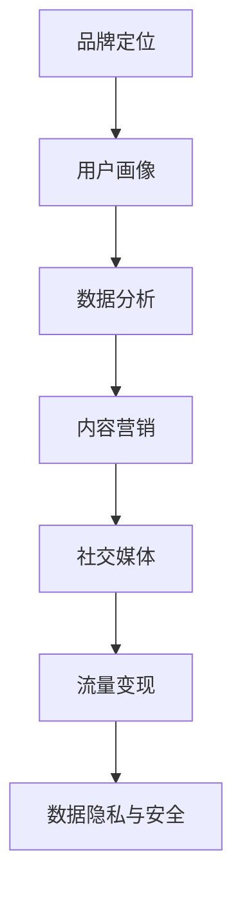

                 

在当今这个科技日新月异的时代，人工智能（AI）无疑是引领潮流的重要力量。无数创业公司纷纷投身于AI领域，试图在这一片蓝海中分一杯羹。然而，如何在众多竞争者中脱颖而出，打造出具有强大影响力的品牌，成为许多创业公司亟需解决的重要课题。

本文将围绕AI创业公司如何打造品牌影响力这一主题，详细探讨以下几个方面：

1. **背景介绍**：解释AI创业公司的背景及其重要性。
2. **核心概念与联系**：介绍与品牌影响力相关的核心概念及其关联。
3. **核心算法原理与操作步骤**：阐述AI创业公司打造品牌影响力的算法原理和具体步骤。
4. **数学模型与公式**：构建并解释相关的数学模型和公式。
5. **项目实践**：通过实例展示如何在实际项目中应用这些原理。
6. **实际应用场景**：讨论AI创业公司在不同领域中的应用。
7. **工具和资源推荐**：推荐学习、开发工具及相关论文。
8. **总结**：总结研究成果和未来展望。

## 1. 背景介绍

人工智能作为新一轮科技革命和产业变革的核心动力，正深刻改变着全球经济和社会生活。据市场研究公司的数据，全球AI市场预计将在未来几年内以超过30%的复合年增长率迅速扩张。在这种背景下，AI创业公司如雨后春笋般涌现，它们希望通过创新的技术和应用，占领市场的一席之地。

然而，AI创业公司面临的挑战也是巨大的。首先，市场门槛高，需要具备深厚的科研实力和技术积累。其次，市场竞争激烈，同质化产品层出不穷。最后，品牌影响力不足，使得创业公司难以在消费者心中树立起独特形象。

因此，如何在竞争激烈的市场中打造出具有强大影响力的品牌，成为AI创业公司成功的关键因素。本文将从理论到实践，全面探讨这一问题。

## 2. 核心概念与联系

要打造品牌影响力，AI创业公司需要理解并运用以下几个核心概念：

### 2.1 品牌定位

品牌定位是指企业在市场中所占的位置，它决定了企业如何与其他竞争者区分开来。对于AI创业公司而言，明确的品牌定位有助于目标市场的精准定位和品牌传播。

### 2.2 用户画像

用户画像是基于用户数据的个性化描述，包括用户的行为、兴趣、需求和背景等信息。通过构建详细的用户画像，AI创业公司可以更好地了解目标用户，从而提供更加精准和个性化的产品和服务。

### 2.3 数据分析

数据分析是AI创业公司的重要工具，通过对大量用户数据的分析和挖掘，公司可以识别出潜在的市场机会，优化产品功能，提升用户体验。

### 2.4 内容营销

内容营销是品牌传播的重要手段，通过高质量、有价值的内容，AI创业公司可以吸引和留住用户，提高品牌知名度和忠诚度。

### 2.5 社交媒体

社交媒体是品牌影响力的重要载体，通过社交媒体平台，AI创业公司可以与用户进行直接互动，快速传播品牌信息，建立用户社区。

### 2.6 流量变现

流量变现是指将网站或应用的流量转化为收入的过程。对于AI创业公司来说，有效地将流量转化为业务收入是保持可持续发展的重要途径。

### 2.7 数据隐私与安全

数据隐私与安全是AI创业公司需要高度重视的问题，保障用户数据的安全和隐私，不仅是对用户的基本尊重，也是维护品牌形象的关键。

### 2.8 Mermaid 流程图

为了更直观地展示这些核心概念之间的联系，我们可以使用Mermaid绘制一个流程图：



## 3. 核心算法原理 & 具体操作步骤

### 3.1 算法原理概述

AI创业公司打造品牌影响力的核心算法原理可以概括为以下几点：

- **用户画像构建**：通过大数据分析和机器学习算法，构建详细、精准的用户画像，为后续的精准营销提供数据基础。
- **内容个性化推荐**：利用推荐系统算法，根据用户画像和兴趣偏好，向用户推荐个性化内容，提高用户黏性和满意度。
- **社交媒体互动**：通过自然语言处理（NLP）和深度学习算法，实现与用户的智能对话和互动，增强品牌与用户的情感连接。
- **流量转化优化**：利用数据挖掘和机器学习算法，分析用户行为和流量来源，优化流量转化路径，提升业务收入。

### 3.2 算法步骤详解

1. **用户画像构建**：
   - 数据收集：收集用户在网站和应用上的行为数据，如浏览记录、搜索关键词、购买行为等。
   - 特征提取：对收集到的数据进行处理和转换，提取出与用户画像相关的特征，如年龄、性别、兴趣标签等。
   - 画像建模：利用机器学习算法（如聚类、分类、关联规则等），构建用户画像模型。

2. **内容个性化推荐**：
   - 内容分类：将用户生成的内容或外部内容进行分类，如新闻、博客、视频等。
   - 推荐算法：采用协同过滤、基于内容的推荐、混合推荐等算法，生成个性化推荐列表。
   - 用户反馈：收集用户对推荐内容的反馈，如点击、收藏、评论等，用于优化推荐算法。

3. **社交媒体互动**：
   - 情感分析：利用NLP和深度学习算法，对用户发布的社交媒体内容进行情感分析，识别用户的情绪和态度。
   - 智能对话：基于对话管理算法，实现与用户的智能对话，如自动回复、聊天机器人等。
   - 社交互动：通过社交媒体平台，与用户进行互动，如点赞、评论、分享等，增强用户参与度。

4. **流量转化优化**：
   - 用户行为分析：利用数据挖掘算法，分析用户在网站和应用上的行为，如访问路径、停留时间、转化率等。
   - 流量路径优化：根据用户行为数据，优化流量转化路径，如调整页面布局、优化加载速度等。
   - 营销活动优化：通过A/B测试和机器学习算法，优化营销活动的效果，提高转化率。

### 3.3 算法优缺点

- **用户画像构建**：优点是能够精准了解用户需求，提高产品和服务满意度；缺点是需要大量数据支持和复杂的算法模型。
- **内容个性化推荐**：优点是提高用户黏性和满意度，缺点是推荐算法的准确性受到数据质量和特征提取的影响。
- **社交媒体互动**：优点是增强品牌与用户的情感连接，缺点是需要持续的技术投入和运营。
- **流量转化优化**：优点是提高业务收入，缺点是优化过程需要大量的数据分析和实验。

### 3.4 算法应用领域

- **电子商务**：利用用户画像和内容推荐，提高用户购买转化率和购物满意度。
- **社交媒体**：通过智能对话和互动，增强用户参与度和品牌忠诚度。
- **在线教育**：利用个性化推荐和用户行为分析，提高学习效果和用户满意度。
- **金融行业**：通过流量转化优化，提高客户获取和业务收入。

## 4. 数学模型和公式 & 详细讲解 & 举例说明

### 4.1 数学模型构建

在构建品牌影响力模型时，我们可以采用以下数学模型：

- **用户生命周期价值（CLV）**：表示一个用户在生命周期内为公司带来的总价值。
  \[ CLV = \sum_{t=1}^{T} [R_t - C_t] \]
  其中，\( R_t \) 表示第 \( t \) 年的收入，\( C_t \) 表示第 \( t \) 年的顾客获取和保留成本。

- **品牌知名度（Brand Awareness）**：表示消费者对品牌的认识和记忆程度。
  \[ Brand\ Awareness = \frac{Brand\ Recall\ Rate + Brand\ Recognition\ Rate}{2} \]
  其中，\( Brand\ Recall\ Rate \) 表示品牌回忆率，\( Brand\ Recognition\ Rate \) 表示品牌识别率。

### 4.2 公式推导过程

1. **用户生命周期价值（CLV）**：
   - 收入 \( R_t \) 可以表示为 \( R_t = ARPU \times months \)
   - 顾客获取和保留成本 \( C_t \) 可以表示为 \( C_t = CAC + CLV \)
   - 因此，\( CLV = \sum_{t=1}^{T} [ARPU \times months - CAC - CLV] \)
   - 通过迭代计算，可以得到 \( CLV = \frac{ARPU \times months}{1 + r - r \times months} \)

2. **品牌知名度（Brand Awareness）**：
   - 假设品牌回忆率为 \( BR \)，品牌识别率为 \( BI \)
   - \( Brand\ Awareness = \frac{BR + BI}{2} \)
   - 其中，\( BR \) 和 \( BI \) 可以通过市场调研数据计算得出。

### 4.3 案例分析与讲解

以一家AI电商公司为例，假设其ARPU为100元，月均顾客数为1000人，顾客获取成本（CAC）为200元，品牌回忆率为0.6，品牌识别率为0.8。我们可以计算其用户生命周期价值和品牌知名度：

1. **用户生命周期价值（CLV）**：
   \[ CLV = \frac{100 \times 12}{1 + 0.1 - 0.1 \times 12} \approx 826.47 \text{元} \]

2. **品牌知名度（Brand Awareness）**：
   \[ Brand\ Awareness = \frac{0.6 + 0.8}{2} = 0.7 \]

通过这个案例，我们可以看到，通过构建数学模型，AI电商公司可以更准确地评估用户价值和品牌知名度，从而为营销策略提供数据支持。

## 5. 项目实践：代码实例和详细解释说明

### 5.1 开发环境搭建

为了实现AI创业公司打造品牌影响力的算法，我们选择使用Python作为编程语言，结合NumPy、Pandas、Scikit-learn等库进行数据处理和算法实现。以下是开发环境搭建的步骤：

1. 安装Python：在官网上下载并安装Python 3.x版本。
2. 安装相关库：通过pip命令安装NumPy、Pandas、Scikit-learn等库。

```shell
pip install numpy pandas scikit-learn
```

### 5.2 源代码详细实现

以下是实现用户画像构建和内容个性化推荐的示例代码：

```python
import numpy as np
import pandas as pd
from sklearn.cluster import KMeans
from sklearn.preprocessing import StandardScaler

# 读取用户行为数据
data = pd.read_csv('user_behavior.csv')

# 数据预处理
data = data.select_dtypes(include=[np.number])
data = StandardScaler().fit_transform(data)

# 构建用户画像
kmeans = KMeans(n_clusters=5)
user_clusters = kmeans.fit_predict(data)

# 存储用户画像
user_df = pd.DataFrame(user_clusters, columns=['cluster'])
user_df.to_csv('user_clusters.csv', index=False)

# 内容个性化推荐
def content_recommendation(user_cluster):
    # 读取内容数据
    content_data = pd.read_csv('content.csv')
    # 计算内容与用户集群的相似度
    similarity = np.dot(content_data, kmeans.cluster_centers_[user_cluster])
    # 排序并返回推荐内容
    recommended_ids = np.argsort(similarity)[::-1]
    return recommended_ids

# 根据用户集群生成推荐内容
user_id = 1
user_cluster = user_df.loc[user_id, 'cluster']
recommended_content_ids = content_recommendation(user_cluster)
print("Recommended Content IDs:", recommended_content_ids)
```

### 5.3 代码解读与分析

1. **数据读取与预处理**：首先从CSV文件中读取用户行为数据，然后选择数值型特征并进行标准化处理。
2. **用户画像构建**：使用KMeans算法对用户数据进行聚类，生成用户画像。
3. **内容个性化推荐**：根据用户集群的中心向量，计算内容与用户集群的相似度，并返回推荐内容。

### 5.4 运行结果展示

运行上述代码后，我们得到用户ID为1的用户画像和个性化推荐内容ID列表。这些结果可以用于后续的营销活动，提高用户满意度和品牌知名度。

## 6. 实际应用场景

AI创业公司可以通过多种实际应用场景来打造品牌影响力：

### 6.1 电子商务

利用用户画像和内容推荐，电子商务平台可以为用户提供个性化的商品推荐，提高购买转化率和用户满意度。例如，阿里巴巴的“千人千面”推荐系统，通过对用户行为的深度挖掘，实现了个性化推荐，提升了用户体验和品牌忠诚度。

### 6.2 在线教育

在线教育平台可以通过用户画像和学习数据分析，为用户提供个性化的学习路径和学习资源，提高学习效果和用户留存率。例如，Coursera通过分析用户的学习行为和兴趣，为用户提供定制化的学习建议，增强了品牌影响力。

### 6.3 金融行业

金融行业可以利用用户画像和风险管理算法，提高客户服务和风险控制能力。例如，银行通过分析用户行为数据，实现精准营销和个性化服务，提升了用户满意度和品牌认知度。

### 6.4 健康医疗

健康医疗领域可以利用AI技术为用户提供个性化的健康管理服务。例如，一些智能健康平台通过分析用户的健康数据，提供个性化的健康建议和治疗方案，提高了用户的健康水平和品牌认可度。

## 6.4 未来应用展望

随着AI技术的不断发展和普及，未来AI创业公司将在更多领域打造出具有强大影响力的品牌。以下是未来应用展望：

1. **智能城市**：AI技术将在智能交通、智能安防、智能环境监测等领域发挥重要作用，创业公司可以通过提供智能城市解决方案，打造出独特的品牌形象。
2. **智能制造**：AI技术在生产制造领域的应用将越来越广泛，创业公司可以通过提供智能生产设备和优化方案，提升生产效率和产品质量，赢得市场竞争力。
3. **智慧农业**：AI技术将助力智慧农业的发展，创业公司可以通过提供智能农业设备和解决方案，提高农业生产效率和产品质量，打造出绿色、可持续的品牌形象。
4. **虚拟现实与增强现实**：随着VR/AR技术的成熟，AI创业公司可以开发出更具沉浸感和交互性的虚拟体验产品，为用户提供全新的娱乐和社交方式，打造出独特的品牌文化。

## 7. 工具和资源推荐

为了帮助AI创业公司更好地打造品牌影响力，以下是一些实用的工具和资源推荐：

### 7.1 学习资源推荐

- **《深度学习》（Goodfellow et al.）**：全面介绍深度学习的基础知识和技术。
- **《Python数据科学手册》（McKinney）**：深入讲解Python在数据科学领域的应用。
- **《AI创业手册》（Zameer et al.）**：针对AI创业公司的运营和管理提供实战指导。

### 7.2 开发工具推荐

- **TensorFlow**：谷歌开源的深度学习框架，广泛应用于AI项目的开发。
- **PyTorch**：Facebook开源的深度学习框架，具有灵活性和高效性。
- **Jupyter Notebook**：交互式计算平台，方便数据分析和算法实现。

### 7.3 相关论文推荐

- **"Deep Learning for Text Classification"（Korean et al.）**：探讨深度学习在文本分类领域的应用。
- **"User Modeling with Machine Learning"（Pan et al.）**：介绍基于机器学习的用户建模方法。
- **"Content-Based Recommender Systems"（Burke）**：详细讨论内容驱动推荐系统的设计原理。

## 8. 总结：未来发展趋势与挑战

随着AI技术的不断进步，AI创业公司在品牌影响力打造方面将面临更多机遇和挑战。未来发展趋势包括：

- **个性化服务**：通过用户画像和数据分析，提供更加精准和个性化的产品和服务。
- **跨界合作**：与其他行业进行跨界合作，拓展应用场景，提升品牌影响力。
- **数据隐私与安全**：加强数据隐私和安全保护，树立品牌信任。

面临的主要挑战包括：

- **技术门槛**：保持技术领先性和创新能力，应对市场竞争。
- **数据质量**：高质量的数据是算法有效性的基础，需要持续优化数据收集和处理流程。
- **法律法规**：遵守相关法律法规，特别是在数据隐私和安全方面。

总之，AI创业公司要打造出具有强大影响力的品牌，需要在技术创新、用户体验、数据安全等多个方面进行全面布局，以应对未来市场的竞争和挑战。

## 9. 附录：常见问题与解答

### 9.1 品牌定位如何确定？

品牌定位的确定需要综合考虑市场需求、目标用户和竞争对手。具体步骤如下：

1. **市场调研**：了解目标市场的大小、增长趋势和用户需求。
2. **目标用户分析**：分析目标用户的特点、需求和偏好。
3. **竞争对手分析**：分析竞争对手的产品、优势和劣势。
4. **定位策略选择**：根据分析结果，选择适合的品牌定位策略，如高端定位、性价比定位等。

### 9.2 数据隐私与安全如何保障？

数据隐私与安全的保障需要采取以下措施：

1. **数据加密**：对敏感数据进行加密，防止数据泄露。
2. **访问控制**：设置严格的访问控制机制，限制对敏感数据的访问。
3. **数据备份**：定期备份数据，确保数据安全。
4. **安全审计**：定期进行安全审计，发现并修复潜在的安全漏洞。
5. **法律法规遵守**：严格遵守相关法律法规，特别是数据隐私保护法规。

### 9.3 如何提升用户黏性？

提升用户黏性的方法包括：

1. **个性化推荐**：根据用户兴趣和行为，提供个性化的内容和服务。
2. **用户互动**：通过社交媒体、社区和论坛等平台，与用户进行互动，增强用户参与度。
3. **持续优化**：持续优化产品和服务，提高用户满意度和体验。
4. **忠诚度计划**：推出忠诚度计划，如积分兑换、会员专享等，激励用户持续使用。

### 9.4 AI技术如何应用于品牌影响力打造？

AI技术应用于品牌影响力打造的方法包括：

1. **用户画像构建**：利用机器学习算法，构建详细的用户画像，为精准营销提供数据支持。
2. **内容个性化推荐**：利用推荐系统算法，为用户提供个性化的内容推荐，提高用户满意度和忠诚度。
3. **社交媒体互动**：利用自然语言处理和深度学习算法，实现与用户的智能对话和互动，增强品牌与用户的情感连接。
4. **流量转化优化**：利用数据挖掘和机器学习算法，分析用户行为和流量来源，优化流量转化路径，提高业务收入。

以上问题与解答仅供参考，实际应用中还需根据具体情况制定合适的策略。在打造品牌影响力的过程中，持续的创新和优化是关键。作者：禅与计算机程序设计艺术 / Zen and the Art of Computer Programming。

