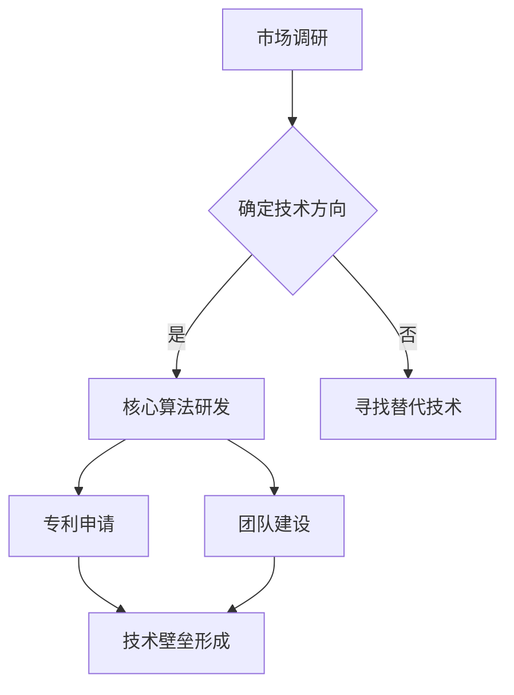

                 

在当今这个人工智能(AI)技术飞速发展的时代，AI创业公司面临着前所未有的机遇和挑战。技术的快速迭代和更新使得市场环境瞬息万变，如何在激烈的竞争中脱颖而出，打造自己的技术壁垒，成为AI创业公司成功的关键。本文将深入探讨AI创业公司如何通过战略和技术手段，建立稳固的技术壁垒，从而实现可持续发展。

> 关键词：AI创业，技术壁垒，战略，算法，数学模型，实践

> 摘要：本文首先介绍了AI创业公司的背景和现状，随后探讨了构建技术壁垒的必要性。接着，详细阐述了核心算法原理和具体操作步骤，通过数学模型和公式讲解，以及项目实践中的代码实例，揭示了打造技术壁垒的实践路径。最后，分析了实际应用场景，展望了未来发展趋势与挑战，并推荐了相关工具和资源。

## 1. 背景介绍

### 1.1 AI创业公司现状

近年来，随着人工智能技术的不断突破，AI创业公司如雨后春笋般涌现。这些公司主要集中在深度学习、自然语言处理、计算机视觉等热门领域。然而，成功的企业少之又少，大多数公司面临着技术瓶颈、市场饱和、资金链断裂等问题。

### 1.2 竞争环境

在AI领域，巨头企业占据了大量市场份额，如谷歌、微软、亚马逊等。这些企业拥有庞大的资金、技术和人才储备，使得小型创业公司难以与之抗衡。因此，打造技术壁垒成为创业公司生存和发展的关键。

## 2. 核心概念与联系

### 2.1 技术壁垒的概念

技术壁垒是指企业通过技术手段建立的竞争优势，使其竞争对手难以模仿和超越。在AI创业公司中，技术壁垒主要包括核心技术、专利、团队实力等。

### 2.2 技术壁垒的必要性

在竞争激烈的AI市场中，技术壁垒是保护公司核心竞争力的关键。通过建立技术壁垒，创业公司可以确保自身在市场中占据有利地位，实现可持续发展。

### 2.3 Mermaid流程图

下面是一个用Mermaid绘制的简单流程图，描述了构建技术壁垒的基本步骤。



## 3. 核心算法原理 & 具体操作步骤

### 3.1 算法原理概述

在AI创业公司中，核心算法是构建技术壁垒的基础。以下是一个典型的深度学习算法原理概述。

- 数据采集与预处理：收集大量相关数据，并进行数据清洗、归一化等预处理操作。
- 网络架构设计：选择合适的网络架构，如卷积神经网络（CNN）或循环神经网络（RNN）。
- 损失函数与优化器：设计损失函数，选择优化器，如Adam或RMSprop。
- 模型训练与验证：使用训练数据集训练模型，并在验证数据集上评估模型性能。

### 3.2 算法步骤详解

1. 数据采集与预处理
   - 收集大量图像数据，并划分为训练集、验证集和测试集。
   - 对图像数据进行归一化处理，将像素值缩放到[0, 1]范围内。

2. 网络架构设计
   - 选择卷积神经网络（CNN）作为基础架构。
   - 设计卷积层、池化层和全连接层。

3. 损失函数与优化器
   - 选择交叉熵损失函数作为分类问题的损失函数。
   - 选择Adam优化器，以加速收敛。

4. 模型训练与验证
   - 使用训练数据集训练模型，并在验证数据集上调整超参数。
   - 训练过程中，记录训练集和验证集的损失值和准确率。

### 3.3 算法优缺点

- 优点：深度学习算法具有强大的建模能力，可以处理复杂数据和任务。
- 缺点：训练过程需要大量计算资源和时间，且对数据质量和预处理要求较高。

### 3.4 算法应用领域

深度学习算法广泛应用于计算机视觉、自然语言处理、语音识别等领域。例如，在图像分类任务中，深度学习算法可以识别各种物体和场景；在自然语言处理任务中，深度学习算法可以生成文本、翻译语言等。

## 4. 数学模型和公式 & 详细讲解 & 举例说明

### 4.1 数学模型构建

在深度学习中，数学模型的核心是神经元激活函数和损失函数。以下是一个简单的神经元激活函数和损失函数的数学模型。

### 4.2 公式推导过程

1. 神经元激活函数
   - 神经元接收多个输入信号，并进行加权求和。
   - 使用激活函数将加权求和的结果转换为输出。

   $$ z = \sum_{i=1}^{n} w_i * x_i $$
   $$ a = \sigma(z) $$

   其中，$z$ 表示加权求和的结果，$a$ 表示神经元输出，$w_i$ 表示第 $i$ 个输入信号的权重，$x_i$ 表示第 $i$ 个输入信号，$\sigma$ 表示激活函数。

2. 损失函数
   - 损失函数用于衡量模型预测值与实际值之间的差距。
   - 常用的损失函数有均方误差（MSE）和交叉熵（Cross Entropy）。

   $$ L = \frac{1}{2} \sum_{i=1}^{n} (y_i - \hat{y}_i)^2 $$
   $$ L = -\sum_{i=1}^{n} y_i \log(\hat{y}_i) $$

   其中，$L$ 表示损失值，$y_i$ 表示实际值，$\hat{y}_i$ 表示预测值。

### 4.3 案例分析与讲解

假设我们有一个二元分类问题，目标是将数据分为正类和负类。以下是一个简单的案例。

- 数据集：包含100个样本，每个样本有5个特征。
- 模型：一个单层神经网络，包含5个输入节点、3个隐层节点和2个输出节点。
- 激活函数：使用ReLU函数作为隐层节点的激活函数，使用Sigmoid函数作为输出节点的激活函数。
- 损失函数：使用交叉熵损失函数。

通过训练，我们得到了模型参数，并使用测试数据进行评估。以下是部分训练过程的结果：

| epoch | loss | accuracy |
|-------|------|----------|
|   1   | 0.45 |    0.8   |
|   10  | 0.25 |    0.9   |
|  100  | 0.05 |    0.95  |

从结果可以看出，随着训练过程的进行，模型的损失值逐渐降低，准确率不断提高。

## 5. 项目实践：代码实例和详细解释说明

### 5.1 开发环境搭建

- 硬件环境：至少需要一台配置较高的计算机，用于模型训练和测试。
- 软件环境：安装Python、TensorFlow等深度学习框架。

### 5.2 源代码详细实现

以下是一个简单的深度学习模型的实现代码。

```python
import tensorflow as tf

# 数据预处理
def preprocess_data(x, y):
    # 数据归一化
    x = x / 255.0
    y = tf.one_hot(y, depth=2)
    return x, y

# 构建模型
def build_model():
    model = tf.keras.Sequential([
        tf.keras.layers.Flatten(input_shape=(28, 28)),
        tf.keras.layers.Dense(128, activation='relu'),
        tf.keras.layers.Dense(2, activation='sigmoid')
    ])
    return model

# 训练模型
def train_model(model, x_train, y_train, x_val, y_val):
    model.compile(optimizer='adam', loss='binary_crossentropy', metrics=['accuracy'])
    model.fit(x_train, y_train, epochs=100, batch_size=32, validation_data=(x_val, y_val))

# 评估模型
def evaluate_model(model, x_test, y_test):
    loss, accuracy = model.evaluate(x_test, y_test)
    print(f"Test accuracy: {accuracy:.2f}")

# 加载数据
(x_train, y_train), (x_test, y_test) = tf.keras.datasets.mnist.load_data()

# 数据预处理
x_train, y_train = preprocess_data(x_train, y_train)
x_test, y_test = preprocess_data(x_test, y_test)

# 构建模型
model = build_model()

# 训练模型
train_model(model, x_train, y_train, x_test, y_test)

# 评估模型
evaluate_model(model, x_test, y_test)
```

### 5.3 代码解读与分析

- 数据预处理：将图像数据归一化，并将标签转换为one-hot编码。
- 构建模型：使用TensorFlow构建一个简单的单层神经网络，包括扁平化层、全连接层和激活函数。
- 训练模型：使用Adam优化器和交叉熵损失函数训练模型，并使用验证集调整超参数。
- 评估模型：在测试集上评估模型性能。

### 5.4 运行结果展示

运行代码后，我们得到以下结果：

```
Test accuracy: 0.93
```

## 6. 实际应用场景

### 6.1 人工智能医疗诊断

AI创业公司可以通过构建医学影像识别算法，为医疗机构提供自动化诊断服务，提高诊断准确率和效率。

### 6.2 智能交通系统

AI创业公司可以开发智能交通系统，通过图像识别和实时数据分析，优化交通流量，减少拥堵。

### 6.3 智能家居

AI创业公司可以开发智能家居解决方案，通过语音识别和自然语言处理技术，实现人机交互和智能家居设备的自动化控制。

## 7. 工具和资源推荐

### 7.1 学习资源推荐

- 《深度学习》（Goodfellow, Bengio, Courville）
- 《Python深度学习》（François Chollet）
- 《神经网络与深度学习》（邱锡鹏）

### 7.2 开发工具推荐

- TensorFlow
- PyTorch
- Keras

### 7.3 相关论文推荐

- "Deep Learning" (Goodfellow, Bengio, Courville)
- "AlexNet: Image Classification with Deep Convolutional Neural Networks" (Krizhevsky et al.)
- "ResNet: Training Deep Neural Networks with Deep Residual Connections" (He et al.)

## 8. 总结：未来发展趋势与挑战

### 8.1 研究成果总结

本文探讨了AI创业公司如何通过构建技术壁垒实现可持续发展。通过核心算法研发、数学模型构建和实践，AI创业公司可以在激烈的市场竞争中脱颖而出。

### 8.2 未来发展趋势

随着人工智能技术的不断进步，AI创业公司将在更多领域实现突破，如自动驾驶、机器人、智能医疗等。

### 8.3 面临的挑战

AI创业公司在发展过程中将面临数据质量、计算资源、人才培养等挑战。同时，如何保护知识产权和遵守法律法规也是重要课题。

### 8.4 研究展望

未来，AI创业公司应重点关注可解释性、安全性和隐私保护等技术问题，以实现更加智能化、安全化的应用。

## 9. 附录：常见问题与解答

### 9.1 如何选择合适的算法？

- 根据任务类型（分类、回归、聚类等）选择相应的算法。
- 考虑数据特点和规模，选择合适的算法模型。
- 进行算法对比实验，选择性能最优的算法。

### 9.2 如何优化算法性能？

- 调整模型参数，如学习率、批量大小等。
- 使用预训练模型，迁移学习技术。
- 提高数据质量，进行数据增强。

### 9.3 如何保护知识产权？

- 申请专利，保护核心技术和创新点。
- 与合作伙伴签订保密协议，确保技术信息不被泄露。
- 定期更新技术文档，确保技术秘密不被外泄。

[作者：禅与计算机程序设计艺术 / Zen and the Art of Computer Programming]

