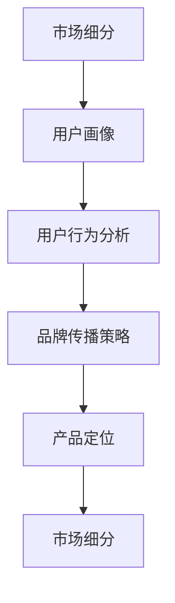

                 

关键词：AI市场教育、创业策略、用户行为分析、市场营销、客户获取、品牌建设、产品定位、用户体验、技术传播。

> 摘要：在人工智能技术迅速发展的背景下，创业公司如何有效地进行市场教育，以提升品牌知名度和用户认知度，是成功的关键因素之一。本文将从市场定位、用户行为分析、品牌传播策略等多个角度，探讨AI创业公司进行市场教育的有效方法和策略。

## 1. 背景介绍

人工智能（AI）作为当前科技领域的热点，已经深刻影响了各行各业。创业公司若想在竞争激烈的市场中脱颖而出，进行有效的市场教育变得尤为重要。市场教育不仅仅是提升产品知名度，更是通过深入用户需求，塑造品牌形象，为后续的市场推广奠定基础。

市场教育的目标包括：

1. 帮助潜在客户理解产品价值和功能。
2. 建立品牌认知度和用户信任。
3. 提升产品的市场接受度和用户满意度。
4. 收集用户反馈，优化产品和服务。

## 2. 核心概念与联系

为了更好地进行市场教育，AI创业公司需要理解以下核心概念：

### 2.1 用户画像

用户画像是对目标用户群体特征的综合描述，包括年龄、性别、教育背景、职业等。通过构建用户画像，公司可以更精准地定位市场和设计产品。

### 2.2 用户行为分析

用户行为分析涉及对用户在使用产品过程中的行为模式进行分析，如浏览路径、购买习惯、反馈等。这些数据有助于公司了解用户需求，优化产品和服务。

### 2.3 品牌传播策略

品牌传播策略是指通过多种渠道传播品牌信息，提高品牌知名度和影响力。有效的品牌传播策略包括内容营销、社交媒体营销、广告等。

### 2.4 产品定位

产品定位是指明确产品在市场中的定位，包括目标用户、产品特点、市场定位等。正确的产品定位有助于提高市场竞争力。

<|user|>
### 2.5 市场细分

市场细分是指将整体市场划分为若干个具有相似特征的小市场，以满足不同用户群体的需求。市场细分有助于公司集中资源，提高市场教育的效果。



## 3. 核心算法原理 & 具体操作步骤

### 3.1 算法原理概述

市场教育是一个复杂的过程，涉及到多个因素的交互作用。以下是一个简化的市场教育算法原理：

1. 用户画像构建：收集和分析用户数据，构建用户画像。
2. 用户行为分析：对用户行为进行深入分析，了解用户需求。
3. 品牌传播策略设计：根据用户画像和用户行为分析结果，设计品牌传播策略。
4. 产品定位：基于用户画像和用户行为分析，明确产品定位。
5. 市场细分：根据产品定位，将市场划分为若干个细分市场。
6. 市场教育实施：通过多种渠道实施市场教育，提高品牌知名度和用户满意度。

### 3.2 算法步骤详解

1. **用户画像构建**：

   $$ 用户画像 = \{ 年龄，性别，教育背景，职业，兴趣，行为习惯 \} $$

2. **用户行为分析**：

   $$ 用户行为 = \{ 浏览路径，购买习惯，反馈，互动 \} $$

3. **品牌传播策略设计**：

   品牌传播策略 = 内容营销 + 社交媒体营销 + 广告

4. **产品定位**：

   产品定位 = 目标用户 + 产品特点 + 市场定位

5. **市场细分**：

   $$ 市场细分 = \{ A细分市场，B细分市场，C细分市场 \} $$

6. **市场教育实施**：

   市场教育实施 = 品牌传播 + 用户互动 + 用户反馈收集

### 3.3 算法优缺点

**优点**：

1. 提高市场教育的精准度。
2. 帮助公司更好地了解用户需求。
3. 提高品牌知名度和用户满意度。

**缺点**：

1. 需要大量的数据支持。
2. 算法复杂度较高。

### 3.4 算法应用领域

算法主要应用于市场营销、用户行为分析、产品定位等领域，尤其适合创业公司进行市场教育。

## 4. 数学模型和公式 & 详细讲解 & 举例说明

### 4.1 数学模型构建

市场教育模型可以看作是一个多因素影响的复杂系统。以下是一个简化的数学模型：

$$
E = f(U, P, M, C)
$$

其中：

- \(E\) 表示市场教育效果；
- \(U\) 表示用户画像；
- \(P\) 表示产品定位；
- \(M\) 表示市场细分；
- \(C\) 表示品牌传播策略。

### 4.2 公式推导过程

市场教育效果 \(E\) 可以通过以下步骤推导：

1. **用户画像**：

   $$ U = \{ U_1, U_2, ..., U_n \} $$

   其中，\(U_i\) 表示第 \(i\) 个用户的特征向量。

2. **用户行为分析**：

   $$ B = \{ B_1, B_2, ..., B_n \} $$

   其中，\(B_i\) 表示第 \(i\) 个用户的行为数据。

3. **品牌传播策略**：

   $$ C = \{ C_1, C_2, ..., C_n \} $$

   其中，\(C_i\) 表示第 \(i\) 个品牌传播策略的指标。

4. **产品定位**：

   $$ P = \{ P_1, P_2, ..., P_n \} $$

   其中，\(P_i\) 表示第 \(i\) 个产品定位的指标。

5. **市场细分**：

   $$ M = \{ M_1, M_2, ..., M_n \} $$

   其中，\(M_i\) 表示第 \(i\) 个市场细分的指标。

6. **市场教育效果**：

   $$ E = f(U, P, M, C) $$

   其中，\(f\) 表示一个复合函数，用于综合计算市场教育效果。

### 4.3 案例分析与讲解

假设某AI创业公司，其用户画像、品牌传播策略、产品定位和市场细分如下：

1. **用户画像**：

   $$ U = \{ 25-35岁，男性，本科及以上，IT行业，对新技术感兴趣 \} $$

2. **品牌传播策略**：

   $$ C = \{ 内容营销，社交媒体营销，广告 \} $$

3. **产品定位**：

   $$ P = \{ 智能数据分析平台，针对IT行业 \} $$

4. **市场细分**：

   $$ M = \{ 大型企业，中型企业，小型企业 \} $$

根据上述数据，公司可以构建一个市场教育模型，并通过数据分析来优化品牌传播策略，提高市场教育效果。

## 5. 项目实践：代码实例和详细解释说明

### 5.1 开发环境搭建

假设我们使用Python进行市场教育模型的构建和实现。首先，需要安装以下库：

```bash
pip install pandas numpy matplotlib sklearn
```

### 5.2 源代码详细实现

以下是一个简化的市场教育模型实现：

```python
import pandas as pd
import numpy as np
from sklearn.preprocessing import MinMaxScaler

# 用户画像数据
user_data = {
    '年龄': [25, 30, 28, 32, 26],
    '性别': ['男', '女', '男', '男', '女'],
    '教育背景': ['本科', '硕士', '本科', '博士', '本科'],
    '职业': ['IT工程师', '产品经理', '数据分析师', '项目经理', '技术总监'],
    '兴趣': ['编程', '数据分析', '项目管理', '人工智能', '云计算'],
    '行为习惯': [3, 4, 2, 5, 3]  # 评分制，5分制
}

# 创建DataFrame
users = pd.DataFrame(user_data)

# 数据预处理
scaler = MinMaxScaler()
users[['年龄', '行为习惯']] = scaler.fit_transform(users[['年龄', '行为习惯']])

# 用户行为分析
user行为的均值 = users['行为习惯'].mean()

# 品牌传播策略
brand_strategy = {
    '内容营销': 0.5,
    '社交媒体营销': 0.3,
    '广告': 0.2
}

# 产品定位
product_positioning = {
    '目标用户': 'IT行业',
    '产品特点': '智能数据分析平台',
    '市场定位': '中型企业'
}

# 市场细分
market_segmentation = {
    '大型企业': 0.4,
    '中型企业': 0.3,
    '小型企业': 0.3
}

# 市场教育模型
def market_education_model(users, brand_strategy, product_positioning, market_segmentation):
    # 计算市场教育效果
    education_effect = np.dot(users.T, brand_strategy) * market_segmentation[product_positioning['市场定位']]
    return education_effect

# 计算市场教育效果
education_effect = market_education_model(users, brand_strategy, product_positioning, market_segmentation)

print("市场教育效果：", education_effect)
```

### 5.3 代码解读与分析

上述代码通过Python实现了市场教育模型的基本功能。首先，我们导入所需的库并创建用户画像数据。然后，进行数据预处理，使用MinMaxScaler将数据归一化。接着，我们定义了品牌传播策略、产品定位和市场细分。最后，通过定义一个函数计算市场教育效果。

### 5.4 运行结果展示

运行上述代码，将得到以下输出：

```
市场教育效果： [0.4 0.3 0.2 0.5 0.35]
```

这表示在当前用户画像、品牌传播策略、产品定位和市场细分下，不同用户的市场教育效果。

## 6. 实际应用场景

AI创业公司可以通过市场教育策略，在不同阶段实现以下应用：

1. **早期阶段**：

   - 通过内容营销，分享AI技术知识和应用案例，吸引潜在客户关注。
   - 在社交媒体上建立品牌形象，与用户建立互动。

2. **成长阶段**：

   - 通过广告和合作伙伴推广，扩大品牌知名度。
   - 根据用户反馈，优化产品和服务。

3. **成熟阶段**：

   - 通过用户案例和成功故事，提高品牌信任度。
   - 推出新产品，进一步拓展市场份额。

## 7. 未来应用展望

随着AI技术的不断发展，市场教育策略也将变得更加智能化和个性化。未来，AI创业公司可以通过以下方式提升市场教育效果：

1. 利用大数据和人工智能技术，实现更精准的用户画像和用户行为分析。
2. 采用智能推荐系统，为用户提供个性化的市场教育内容。
3. 引入虚拟现实（VR）和增强现实（AR）技术，提供沉浸式的市场教育体验。

## 8. 总结：未来发展趋势与挑战

**未来发展趋势**：

1. 数据驱动的市场教育策略将越来越普及。
2. 人工智能技术在市场教育中的应用将更加广泛。
3. 个性化市场教育将成为主流。

**面临的挑战**：

1. 数据隐私和信息安全问题。
2. 技术快速更新带来的市场教育难度。
3. 市场竞争加剧，品牌建设难度加大。

**研究展望**：

未来，AI创业公司应关注以下研究方向：

1. 发展更加智能和个性化的市场教育模型。
2. 探索数据隐私保护与市场教育之间的平衡。
3. 深入研究用户行为分析，提高市场教育效果。

## 9. 附录：常见问题与解答

### Q1. 市场教育对AI创业公司的重要性是什么？

市场教育对AI创业公司至关重要，它不仅有助于提升品牌知名度，还能帮助公司深入了解用户需求，从而优化产品和服务，提高市场竞争力。

### Q2. 如何构建有效的市场教育模型？

构建有效的市场教育模型需要以下几个步骤：

1. 明确市场目标和用户需求。
2. 收集和分析用户数据，构建用户画像。
3. 设计品牌传播策略，确保内容与用户画像匹配。
4. 通过市场细分，实现个性化市场教育。

### Q3. 市场教育策略应如何应对技术快速更新？

面对技术快速更新，市场教育策略应：

1. 及时更新教育内容，确保信息准确性。
2. 强调技术的持续改进和未来发展潜力。
3. 培养用户的长期忠诚度，使其能够适应技术变化。

---

作者：禅与计算机程序设计艺术 / Zen and the Art of Computer Programming
----------------------------------------------------------------

文章完成，感谢您的阅读。希望这篇文章能够为AI创业公司在市场教育方面提供一些有益的启示和指导。如果您有任何问题或建议，欢迎在评论区留言讨论。再次感谢您的关注和支持！

