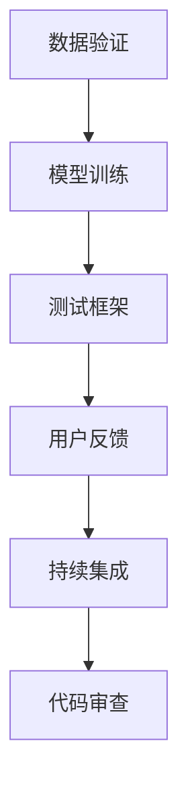

                 

关键词：AI创业、质量控制、数据验证、模型训练、测试框架、用户反馈、持续集成、代码审查。

摘要：本文将探讨AI创业公司在产品开发过程中如何进行质量控制，以实现高效且准确的模型和算法。文章将涵盖数据验证、模型训练、测试框架、用户反馈、持续集成、代码审查等多个方面，为AI创业公司提供实用的质量控制策略。

## 1. 背景介绍

随着人工智能技术的飞速发展，AI创业公司如雨后春笋般涌现。然而，在激烈的市场竞争中，质量成为决定企业成败的关键因素。高质量的产品不仅能够满足用户需求，提高用户体验，还能降低维护成本，增强品牌竞争力。因此，AI创业公司必须重视质量控制，确保其产品在功能、性能、安全等方面达到高标准。

### 质量控制的重要性

质量控制对AI创业公司具有以下几个重要意义：

1. **提升用户体验**：高质量的产品能够提供更好的用户体验，满足用户需求，增加用户满意度。
2. **降低维护成本**：质量控制能够发现和修复潜在问题，减少后期维护成本。
3. **增强品牌竞争力**：高质量的产品能够树立企业良好形象，增强市场竞争力。
4. **提高生产效率**：质量控制能够优化开发流程，提高生产效率，缩短产品上市时间。

### 当前AI创业公司面临的挑战

尽管质量控制对AI创业公司至关重要，但它们在实施过程中仍面临以下挑战：

1. **数据质量**：数据是AI模型的基础，但数据质量参差不齐，可能包含噪声、错误或不完整信息。
2. **模型训练**：模型训练过程中可能存在过拟合、欠拟合等问题，影响模型性能。
3. **测试难度**：AI产品的测试通常比传统软件更为复杂，涉及多种测试方法和技术。
4. **团队协作**：质量控制需要团队协作，但团队规模可能较小，人员流动性大，协作困难。
5. **资源限制**：AI创业公司在资源上可能受到限制，难以投入大量资金和人力进行质量控制。

## 2. 核心概念与联系

为了实现高效的质量控制，AI创业公司需要理解并掌握以下核心概念：

### 数据验证（Data Validation）

数据验证是确保数据质量和一致性的过程。数据验证通常包括以下步骤：

1. **数据清洗**：去除重复数据、噪声数据和错误数据。
2. **数据校验**：检查数据格式、范围、类型等是否符合要求。
3. **数据一致性检查**：确保数据在不同来源、时间、环境之间的一致性。

### 模型训练（Model Training）

模型训练是指使用训练数据集对模型进行调整和优化，使其能够准确预测或分类。模型训练通常包括以下步骤：

1. **数据预处理**：对训练数据进行清洗、归一化、特征提取等预处理。
2. **选择合适模型**：根据业务需求选择合适的机器学习模型。
3. **模型调优**：通过交叉验证、网格搜索等技术优化模型参数。

### 测试框架（Test Framework）

测试框架是指用于自动化测试的一套工具和流程。测试框架通常包括以下功能：

1. **单元测试**：测试单个模块或函数的功能和性能。
2. **集成测试**：测试多个模块或系统的集成情况。
3. **性能测试**：评估系统的响应时间、吞吐量、并发能力等性能指标。

### 用户反馈（User Feedback）

用户反馈是获取用户使用体验和需求的重要途径。用户反馈通常包括以下方式：

1. **用户调研**：通过问卷调查、访谈等方式收集用户意见。
2. **用户行为分析**：分析用户在系统中的操作记录、使用时长等数据。
3. **用户反馈机制**：建立用户反馈渠道，及时收集和处理用户反馈。

### 持续集成（Continuous Integration）

持续集成是指将代码不断合并到主分支，并自动运行测试，确保代码质量。持续集成通常包括以下步骤：

1. **代码审查**：对提交的代码进行审查，确保代码符合规范和标准。
2. **自动化测试**：运行单元测试、集成测试和性能测试，确保代码质量。
3. **自动化部署**：将测试通过的代码部署到生产环境，确保系统稳定性。

### 代码审查（Code Review）

代码审查是指对代码进行审查和评估，确保代码质量、规范和安全性。代码审查通常包括以下步骤：

1. **代码规范检查**：检查代码是否符合编程规范和风格。
2. **代码逻辑审查**：检查代码逻辑是否正确、清晰。
3. **代码安全性审查**：检查代码是否存在安全漏洞和风险。

### Mermaid 流程图

## 3. 核心算法原理 & 具体操作步骤

### 3.1 算法原理概述

AI创业公司的质量控制算法主要基于以下几个方面：

1. **数据预处理**：对输入数据进行清洗、归一化和特征提取，为模型训练做好准备。
2. **模型选择**：根据业务需求和数据特点选择合适的机器学习模型。
3. **模型训练**：使用训练数据集对模型进行调整和优化，提高模型性能。
4. **测试评估**：使用测试数据集对模型进行评估，确保模型达到预期性能。
5. **用户反馈**：收集用户反馈，优化模型和系统功能。
6. **代码审查**：对代码进行审查，确保代码质量和安全性。

### 3.2 算法步骤详解

#### 3.2.1 数据预处理

1. **数据清洗**：去除重复数据、噪声数据和错误数据。
2. **数据归一化**：将数据缩放到同一范围内，提高模型训练效果。
3. **特征提取**：从原始数据中提取有意义的特征，提高模型表现。

#### 3.2.2 模型选择

1. **业务需求分析**：根据业务需求选择合适的机器学习模型。
2. **数据特点分析**：分析数据特点，选择适合的模型类型。
3. **模型评估**：对比不同模型的性能，选择最佳模型。

#### 3.2.3 模型训练

1. **划分数据集**：将数据集划分为训练集、验证集和测试集。
2. **训练过程**：使用训练集对模型进行调整和优化。
3. **模型评估**：使用验证集评估模型性能，调整模型参数。

#### 3.2.4 测试评估

1. **测试集评估**：使用测试集评估模型性能，确保模型达到预期性能。
2. **交叉验证**：使用交叉验证技术评估模型泛化能力。
3. **性能指标**：计算模型性能指标，如准确率、召回率、F1值等。

#### 3.2.5 用户反馈

1. **用户调研**：通过问卷调查、访谈等方式收集用户意见。
2. **用户行为分析**：分析用户在系统中的操作记录、使用时长等数据。
3. **用户反馈处理**：根据用户反馈优化模型和系统功能。

#### 3.2.6 代码审查

1. **代码规范检查**：检查代码是否符合编程规范和风格。
2. **代码逻辑审查**：检查代码逻辑是否正确、清晰。
3. **代码安全性审查**：检查代码是否存在安全漏洞和风险。

### 3.3 算法优缺点

#### 优点

1. **高效性**：自动化测试和持续集成能够提高开发效率。
2. **准确性**：数据验证和模型训练能够确保数据质量和模型性能。
3. **灵活性**：用户反馈和代码审查能够根据用户需求和技术规范不断优化产品。

#### 缺点

1. **资源消耗**：持续集成和代码审查需要一定的硬件和人力投入。
2. **时间成本**：测试和审查过程需要一定的时间，可能影响产品上市时间。

### 3.4 算法应用领域

1. **金融行业**：用于信用评估、风险管理、智能投顾等。
2. **医疗行业**：用于疾病诊断、医疗影像分析、智能辅助诊断等。
3. **零售行业**：用于需求预测、库存管理、个性化推荐等。
4. **制造业**：用于生产优化、设备维护、智能监控等。

## 4. 数学模型和公式

### 4.1 数学模型构建

在AI创业公司的质量控制过程中，常用的数学模型包括：

1. **线性回归**：用于预测连续值。
2. **逻辑回归**：用于预测离散值。
3. **决策树**：用于分类和回归。
4. **神经网络**：用于复杂模式识别。

### 4.2 公式推导过程

以下以线性回归为例，介绍公式推导过程：

#### 4.2.1 模型假设

1. **线性关系**：假设输入特征和输出目标之间存在线性关系。
2. **独立同分布**：假设输入特征和输出目标是独立同分布的。

#### 4.2.2 模型公式

线性回归模型公式如下：

\[ y = \beta_0 + \beta_1x + \epsilon \]

其中，\( y \)为输出目标，\( x \)为输入特征，\( \beta_0 \)为截距，\( \beta_1 \)为斜率，\( \epsilon \)为误差项。

#### 4.2.3 公式推导

1. **最小二乘法**：通过最小化误差平方和来求解模型参数。

误差平方和公式如下：

\[ J(\beta_0, \beta_1) = \sum_{i=1}^{n}(y_i - (\beta_0 + \beta_1x_i))^2 \]

2. **求导**：对误差平方和关于\( \beta_0 \)和\( \beta_1 \)求导，并令导数为零，得到最优参数。

对\( \beta_0 \)求导：

\[ \frac{\partial J}{\partial \beta_0} = -2\sum_{i=1}^{n}(y_i - (\beta_0 + \beta_1x_i)) \]

对\( \beta_1 \)求导：

\[ \frac{\partial J}{\partial \beta_1} = -2\sum_{i=1}^{n}(y_i - (\beta_0 + \beta_1x_i)x_i \]

3. **求解最优参数**：

\[ \beta_0 = \frac{1}{n}\sum_{i=1}^{n}y_i - \beta_1\frac{1}{n}\sum_{i=1}^{n}x_i \]

\[ \beta_1 = \frac{1}{n}\sum_{i=1}^{n}(x_i - \bar{x})(y_i - \bar{y}) \]

其中，\( \bar{x} \)和\( \bar{y} \)分别为输入特征和输出目标的平均值。

### 4.3 案例分析与讲解

以下以一个简单的线性回归案例进行说明：

#### 案例数据

| 序号 | 输入特征 \( x \) | 输出目标 \( y \) |
| --- | --- | --- |
| 1 | 1 | 2 |
| 2 | 2 | 4 |
| 3 | 3 | 6 |
| 4 | 4 | 8 |

#### 模型构建

1. **数据预处理**：对输入特征和输出目标进行归一化处理，使得输入特征和输出目标的范围在\[0, 1\]之间。

| 序号 | 输入特征 \( x \) | 输出目标 \( y \) | 归一化输入 \( x' \) | 归一化输出 \( y' \) |
| --- | --- | --- | --- | --- |
| 1 | 1 | 2 | 0 | 0 |
| 2 | 2 | 4 | 0.5 | 0.5 |
| 3 | 3 | 6 | 1 | 1 |
| 4 | 4 | 8 | 1.5 | 1.5 |

2. **模型训练**：使用最小二乘法求解最优参数。

\[ \beta_0 = \frac{1}{4}\sum_{i=1}^{4}y_i' - \beta_1\frac{1}{4}\sum_{i=1}^{4}x'i' \]

\[ \beta_1 = \frac{1}{4}\sum_{i=1}^{4}(x_i' - \bar{x}')

