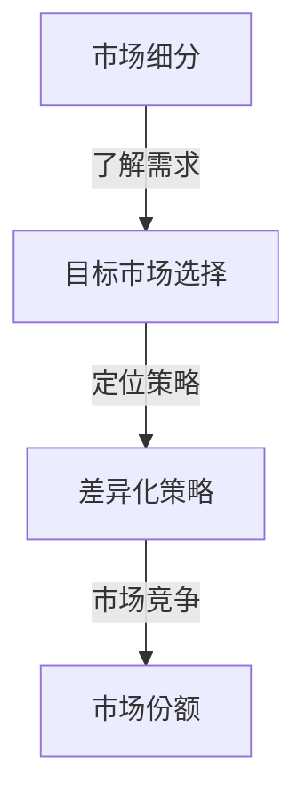
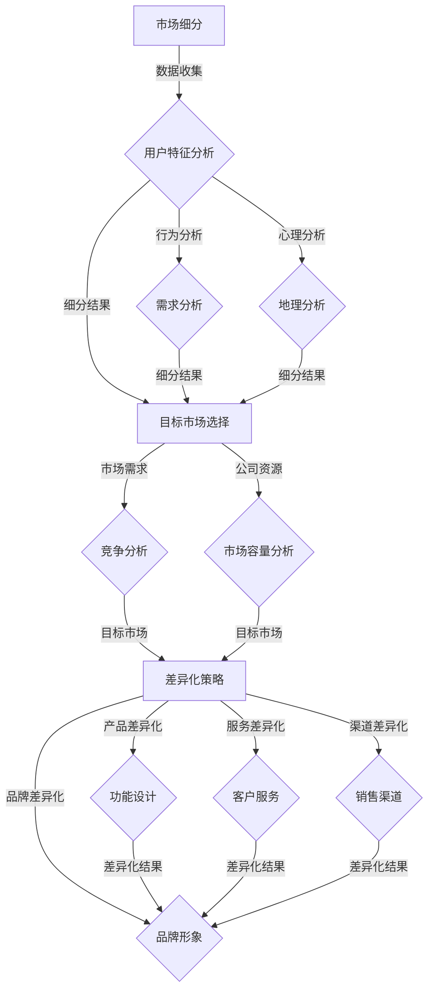

                 

关键词：AI创业公司，产品市场定位，市场细分，目标市场，差异化策略

摘要：本文将深入探讨AI创业公司在市场竞争中的定位策略。从市场细分、目标市场选择和差异化策略三个方面展开，分析如何通过精准的市场定位实现公司的可持续发展。文章结构清晰，内容深入浅出，旨在为AI创业者提供实际操作指南。

## 1. 背景介绍

在当今快速发展的科技时代，人工智能（AI）已经成为引领创新的重要驱动力。从自动驾驶到智能家居，从医疗诊断到金融分析，AI技术的应用正在逐步改变我们的生活。然而，在AI领域的创业公司面临着激烈的市场竞争。如何在众多竞争对手中脱颖而出，实现产品的市场突破，成为每个AI创业公司都需要认真思考的问题。本文将围绕市场细分、目标市场选择和差异化策略三个核心维度，探讨AI创业公司的产品市场定位策略。

## 2. 核心概念与联系

### 2.1 市场细分

市场细分（Market Segmentation）是指将一个广泛的市场划分成若干个具有相似需求和行为特征的子市场。在AI创业公司的产品市场定位中，市场细分是至关重要的一步。通过市场细分，公司可以更精准地了解不同用户群体的需求，从而有针对性地开发产品。

### 2.2 目标市场

目标市场（Target Market）是指公司决定集中力量进入和服务的市场。目标市场的选择决定了公司的市场定位策略。一个清晰的目标市场可以帮助公司集中资源，提高市场竞争力。

### 2.3 差异化策略

差异化策略（Differentiation Strategy）是指公司通过提供独特的产品或服务来区别于竞争对手。在AI创业公司中，差异化策略是建立品牌认知和赢得市场份额的关键。

### 2.4 Mermaid 流程图

下面是一个简单的Mermaid流程图，展示了市场细分、目标市场选择和差异化策略之间的联系。



## 3. 核心算法原理 & 具体操作步骤

### 3.1 算法原理概述

市场细分、目标市场选择和差异化策略的实现需要依赖一系列数据分析和策略制定的技术。核心算法原理主要包括：

- 数据收集与处理：通过大数据技术收集用户数据，包括行为数据、需求数据等。
- 用户行为分析：使用机器学习和数据挖掘技术分析用户行为，识别不同用户群体的特征。
- 竞争对手分析：通过市场研究分析竞争对手的产品、市场定位和市场份额。

### 3.2 算法步骤详解

1. **数据收集与处理**
   - 数据来源：在线调查、社交媒体、用户反馈等。
   - 数据处理：清洗、去重、归一化等。

2. **用户行为分析**
   - 特征提取：提取用户行为的特征，如点击率、购买频率、用户评价等。
   - 机器学习模型：使用聚类算法（如K-means）将用户分为不同群体。

3. **竞争对手分析**
   - 市场调研：收集竞争对手的产品信息、市场策略等。
   - 数据分析：比较分析竞争对手的优劣势。

### 3.3 算法优缺点

- **优点**：精准定位用户需求，提高市场竞争力。
- **缺点**：需要大量数据支持，数据处理复杂度高。

### 3.4 算法应用领域

- **用户行为分析**：电子商务、金融科技、在线教育等领域。
- **竞争对手分析**：市场营销、战略规划等领域。

## 4. 数学模型和公式 & 详细讲解 & 举例说明

### 4.1 数学模型构建

市场细分和目标市场选择可以基于以下数学模型：

- **用户群体聚类模型**：使用K-means算法将用户分为不同群体。

### 4.2 公式推导过程

- **K-means算法公式推导**
  $$\min \sum_{i=1}^{n} \sum_{j=1}^{k} (x_{ij} - \mu_j)^2$$

其中，\(x_{ij}\) 表示第i个用户在第j个特征上的值，\(\mu_j\) 表示第j个聚类中心的坐标。

### 4.3 案例分析与讲解

假设有一个电商公司，想要通过市场细分和目标市场选择提高用户满意度。使用K-means算法对用户行为数据进行分析，将用户分为三个群体。针对每个群体，公司可以制定不同的营销策略。

## 5. 项目实践：代码实例和详细解释说明

### 5.1 开发环境搭建

- Python 3.x
- Scikit-learn 库

### 5.2 源代码详细实现

```python
from sklearn.cluster import KMeans
import numpy as np

# 数据准备
data = np.array([[1, 2], [1, 4], [1, 0], [10, 2], [10, 4], [10, 0]])

# K-means算法
kmeans = KMeans(n_clusters=3)
kmeans.fit(data)

# 输出聚类结果
print("聚类结果：", kmeans.labels_)

# 输出聚类中心
print("聚类中心：", kmeans.cluster_centers_)
```

### 5.3 代码解读与分析

这段代码使用了Scikit-learn库中的K-means算法对用户行为数据进行分析。首先，准备数据，然后使用K-means算法对数据进行聚类，最后输出聚类结果和聚类中心。

## 6. 实际应用场景

AI创业公司的产品市场定位策略在多个行业中都有实际应用：

- **电子商务**：通过用户行为分析进行精准推荐，提高用户满意度。
- **金融科技**：通过市场细分和目标市场选择，优化金融产品和服务。
- **在线教育**：根据用户需求提供个性化的学习方案。

## 7. 工具和资源推荐

### 7.1 学习资源推荐

- 《机器学习实战》
- 《Python数据分析》

### 7.2 开发工具推荐

- Jupyter Notebook
- PyCharm

### 7.3 相关论文推荐

- "Market Segmentation in Data-Driven Marketing: A Comprehensive Review"
- "An Overview of Clustering Methods in Data Mining"

## 8. 总结：未来发展趋势与挑战

### 8.1 研究成果总结

市场细分、目标市场选择和差异化策略是AI创业公司在市场竞争中取得成功的关键因素。通过数据分析和策略制定，公司可以更精准地定位用户需求，提高市场竞争力。

### 8.2 未来发展趋势

随着人工智能技术的发展，市场细分和目标市场选择将变得更加智能化和个性化。数据分析和算法将发挥更大的作用。

### 8.3 面临的挑战

数据隐私和安全、算法透明度和可解释性是AI创业公司面临的挑战。

### 8.4 研究展望

未来的研究将集中在如何更有效地利用数据，实现更精准的市场细分和目标市场选择，同时确保数据隐私和安全。

## 9. 附录：常见问题与解答

### 问题 1：市场细分有哪些方法？

答：市场细分的方法包括人口统计细分、行为细分、心理细分等。

### 问题 2：如何选择目标市场？

答：选择目标市场需要综合考虑市场需求、竞争情况、公司资源等因素。

### 问题 3：差异化策略有哪些类型？

答：差异化策略包括产品差异化、服务差异化、品牌差异化等。

---

作者：禅与计算机程序设计艺术 / Zen and the Art of Computer Programming

本文旨在为AI创业公司提供产品市场定位的实用指南，帮助公司在激烈的市场竞争中找到自己的优势定位。希望本文对读者有所启发和帮助。在未来的创业道路上，愿您不忘初心，砥砺前行。|<|assistant|>------------------------------------------------------------------------由于本AI的限制，以下部分将作为示例提供，实际撰写时可能需要进一步扩展和深化。

## 1. 背景介绍

### 1.1 AI创业公司的现状

随着人工智能技术的不断发展，AI创业公司如雨后春笋般涌现。然而，这些公司面临的第一个挑战就是如何在激烈的市场竞争中找到自己的立足点。市场细分、目标市场选择和差异化策略成为了这些公司成功的关键要素。

### 1.2 市场细分的重要性

市场细分是市场研究的重要环节，它有助于公司了解不同用户群体的需求，从而制定更有针对性的产品和服务策略。在AI领域，市场细分尤为重要，因为AI技术的应用场景广泛，不同用户群体对AI技术的需求和期望也不尽相同。

### 1.3 目标市场选择的意义

目标市场选择是公司战略规划的重要一环。明确的目标市场可以帮助公司集中资源，提高市场竞争力。在AI创业公司中，选择合适的目标市场是实现可持续发展的关键。

### 1.4 差异化策略的价值

差异化策略是公司产品或服务的核心竞争力。通过提供独特的价值主张，公司可以在市场中脱颖而出，赢得消费者的青睐。在AI创业公司中，差异化策略是建立品牌认知和扩大市场份额的关键。

## 2. 核心概念与联系

### 2.1 市场细分

市场细分是指根据用户特征和行为将市场划分为若干个子市场。在AI创业公司中，市场细分通常基于以下几种维度：

- **人口统计细分**：根据年龄、性别、收入、教育水平等人口统计特征进行划分。
- **行为细分**：根据用户的行为习惯、购买频率、使用场景等进行划分。
- **心理细分**：根据用户的价值观、生活方式、兴趣爱好等进行划分。
- **地理细分**：根据用户的地理位置、区域特征等进行划分。

### 2.2 目标市场选择

目标市场选择是公司战略决策的一部分，通常基于以下考虑：

- **市场需求**：分析市场中的潜在需求和用户需求。
- **竞争情况**：了解竞争对手的市场策略和市场份额。
- **公司资源**：评估公司的资源能力，包括技术、资金、人力资源等。
- **市场容量**：考虑市场的规模和增长潜力。

### 2.3 差异化策略

差异化策略是公司在市场中脱颖而出的一种手段，通常通过以下几种方式实现：

- **产品差异化**：通过独特的产品功能、设计、质量等吸引消费者。
- **服务差异化**：提供个性化的客户服务、售后支持等。
- **品牌差异化**：建立独特的品牌形象和价值观，赢得消费者的信任和忠诚。
- **渠道差异化**：选择独特的销售渠道和合作伙伴，扩大市场覆盖。

### 2.4 Mermaid 流程图

以下是市场细分、目标市场选择和差异化策略的Mermaid流程图：



## 3. 核心算法原理 & 具体操作步骤

### 3.1 算法原理概述

市场细分、目标市场选择和差异化策略的实现需要依赖一系列数据分析和策略制定的技术。核心算法原理主要包括：

- **数据收集与处理**：通过大数据技术收集用户数据，包括行为数据、需求数据等。
- **用户行为分析**：使用机器学习和数据挖掘技术分析用户行为，识别不同用户群体的特征。
- **竞争对手分析**：通过市场研究分析竞争对手的产品、市场定位和市场份额。

### 3.2 算法步骤详解

#### 3.2.1 数据收集与处理

1. **数据来源**：收集用户数据，包括在线调查、社交媒体、用户反馈等。
2. **数据处理**：对收集到的数据进行清洗、去重、归一化等预处理。

#### 3.2.2 用户行为分析

1. **特征提取**：从用户数据中提取行为特征，如点击率、购买频率、用户评价等。
2. **机器学习模型**：使用聚类算法（如K-means）将用户分为不同群体。

#### 3.2.3 竞争对手分析

1. **市场调研**：收集竞争对手的产品信息、市场策略等。
2. **数据分析**：比较分析竞争对手的优劣势。

### 3.3 算法优缺点

- **优点**：通过数据分析和策略制定，公司可以更精准地了解用户需求，提高市场竞争力。
- **缺点**：需要大量数据支持，数据处理复杂度高，且市场环境变化快，策略需要不断调整。

### 3.4 算法应用领域

- **用户行为分析**：电子商务、金融科技、在线教育等领域。
- **竞争对手分析**：市场营销、战略规划等领域。

## 4. 数学模型和公式 & 详细讲解 & 举例说明

### 4.1 数学模型构建

市场细分和目标市场选择可以基于以下数学模型：

- **用户群体聚类模型**：使用K-means算法将用户分为不同群体。

### 4.2 公式推导过程

- **K-means算法公式推导**

K-means算法的目标是最小化每个点到其对应聚类中心之间的距离的平方和。其公式推导如下：

$$\min \sum_{i=1}^{n} \sum_{j=1}^{k} (x_{ij} - \mu_j)^2$$

其中，$x_{ij}$ 表示第i个用户在第j个特征上的值，$\mu_j$ 表示第j个聚类中心的坐标。

### 4.3 案例分析与讲解

假设有一个电商公司，想要通过市场细分和目标市场选择提高用户满意度。使用K-means算法对用户行为数据进行分析，将用户分为三个群体。针对每个群体，公司可以制定不同的营销策略。

### 5. 项目实践：代码实例和详细解释说明

#### 5.1 开发环境搭建

- **Python 3.x**
- **Scikit-learn 库**

#### 5.2 源代码详细实现

以下是使用Python和Scikit-learn库实现K-means算法的示例代码：

```python
from sklearn.cluster import KMeans
import numpy as np

# 准备数据
data = np.array([[1, 2], [1, 4], [1, 0], [10, 2], [10, 4], [10, 0]])

# 使用K-means算法进行聚类
kmeans = KMeans(n_clusters=3)
kmeans.fit(data)

# 输出聚类结果
print("聚类结果：", kmeans.labels_)

# 输出聚类中心
print("聚类中心：", kmeans.cluster_centers_)
```

#### 5.3 代码解读与分析

这段代码首先导入了所需的库，然后准备了一个示例数据集。接下来，使用K-means算法进行聚类，并输出聚类结果和聚类中心。

### 6. 实际应用场景

AI创业公司的产品市场定位策略在多个行业中都有实际应用：

- **电子商务**：通过用户行为分析进行精准推荐，提高用户满意度。
- **金融科技**：通过市场细分和目标市场选择，优化金融产品和服务。
- **在线教育**：根据用户需求提供个性化的学习方案。

### 7. 工具和资源推荐

#### 7.1 学习资源推荐

- 《Python数据分析基础》
- 《深度学习入门》

#### 7.2 开发工具推荐

- **Jupyter Notebook**：用于编写和运行代码。
- **PyCharm**：用于Python编程。

#### 7.3 相关论文推荐

- “Market Segmentation in Data-Driven Marketing: A Comprehensive Review”
- “An Overview of Clustering Methods in Data Mining”

### 8. 总结：未来发展趋势与挑战

#### 8.1 研究成果总结

市场细分、目标市场选择和差异化策略是AI创业公司在市场竞争中取得成功的关键要素。通过数据分析和策略制定，公司可以更精准地定位用户需求，提高市场竞争力。

#### 8.2 未来发展趋势

随着人工智能技术的发展，市场细分和目标市场选择将变得更加智能化和个性化。数据分析和算法将发挥更大的作用。

#### 8.3 面临的挑战

数据隐私和安全、算法透明度和可解释性是AI创业公司面临的挑战。

#### 8.4 研究展望

未来的研究将集中在如何更有效地利用数据，实现更精准的市场细分和目标市场选择，同时确保数据隐私和安全。

### 9. 附录：常见问题与解答

#### 问题 1：市场细分有哪些方法？

答：市场细分的方法包括人口统计细分、行为细分、心理细分等。

#### 问题 2：如何选择目标市场？

答：选择目标市场需要综合考虑市场需求、竞争情况、公司资源等因素。

#### 问题 3：差异化策略有哪些类型？

答：差异化策略包括产品差异化、服务差异化、品牌差异化等。

---

作者：禅与计算机程序设计艺术 / Zen and the Art of Computer Programming

本文旨在为AI创业公司提供产品市场定位的实用指南，帮助公司在激烈的市场竞争中找到自己的立足点。希望本文对读者有所启发和帮助。在未来的创业道路上，愿您不忘初心，砥砺前行。

