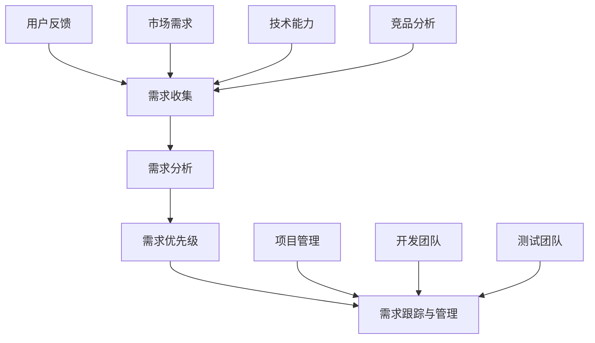

                 

关键词：产品需求管理、需求收集、需求分析、需求优先级、AI创业公司

> 摘要：本文旨在探讨AI创业公司在产品开发过程中如何有效管理产品需求，包括需求收集、需求分析和需求优先级的确定。文章将提供实用的方法和工具，以帮助创业团队在激烈的市场竞争中脱颖而出。

## 1. 背景介绍

在当今的科技快速发展时代，人工智能（AI）正逐渐成为企业创新和增长的重要驱动力。AI创业公司，作为这个领域的先锋，面临着前所未有的机遇和挑战。一个成功的产品不仅需要前沿的技术创新，还需要深刻理解市场和用户的需求，以及如何高效地管理和实现这些需求。

产品需求管理是产品开发的核心环节，它涵盖了需求的收集、分析、优先级排序以及需求的跟踪和管理。在AI创业公司中，有效的需求管理不仅能够加速产品迭代，提高开发效率，还能够确保产品与市场需求的紧密匹配，从而提高市场竞争力和用户满意度。

本文将详细探讨以下四个关键方面：

1. 需求收集：如何有效地从用户、市场和技术等多方面收集需求。
2. 需求分析：如何分析和评估收集到的需求，以确定其合理性和可行性。
3. 需求优先级：如何确定需求的重要性和优先级，以便合理分配资源。
4. 需求跟踪与管理：如何持续跟踪和管理需求，确保需求的有效实现。

通过本文的讨论，我们将为AI创业公司提供一套全面的产品需求管理策略，帮助它们在激烈的市场竞争中稳步前进。

## 2. 核心概念与联系

在深入讨论产品需求管理之前，有必要了解一些核心概念及其相互关系。以下是产品需求管理的核心概念及其架构的Mermaid流程图：



### 2.1 需求收集

需求收集是产品需求管理的起点，涉及到从多个维度获取用户需求、市场需求和技术需求。有效的需求收集需要综合考虑用户反馈、市场需求、技术能力和竞品分析等多方面的信息。

- **用户反馈**：用户是产品的最终消费者，他们的反馈是产品改进和创新的重要来源。创业公司可以通过问卷调查、用户访谈、用户论坛等方式收集用户反馈。
- **市场需求**：了解市场需求有助于产品与市场需求的紧密匹配。市场调研、行业报告和竞争对手分析是获取市场信息的重要手段。
- **技术能力**：了解自身的技术能力是确保需求实现可行性的关键。技术团队需要评估自身的技术栈和能力，以确保需求能够被高效实现。
- **竞品分析**：通过分析竞争对手的产品，可以了解市场趋势和用户偏好，从而为产品创新提供灵感。

### 2.2 需求分析

需求分析是对收集到的需求进行评估和筛选，以确定其合理性和可行性。需求分析包括以下几个方面：

- **需求分类**：根据需求的重要性和优先级对其进行分类，如“必须需求”、“优先需求”和“次要需求”。
- **需求验证**：通过与用户、市场和技术的多方面验证，确保需求的可行性和合理性。
- **需求建模**：使用建模工具和方法，如用户故事地图、用例图和流程图，对需求进行结构化和可视化。

### 2.3 需求优先级

确定需求的优先级是资源分配和任务计划的重要依据。需求的优先级通常基于以下几个方面：

- **用户价值**：满足用户价值的程度，如核心功能和用户痛点解决。
- **市场需求**：市场趋势和用户需求紧迫性。
- **技术可行性**：实现需求的技术复杂度和风险。
- **业务战略**：与公司业务战略的匹配程度。

### 2.4 需求跟踪与管理

需求跟踪与管理是确保需求从概念到实现全过程的有效管理。需求跟踪包括以下几个方面：

- **需求文档**：记录需求详细信息，包括需求描述、需求来源、需求分类、优先级等。
- **项目管理**：使用项目管理工具，如JIRA、Trello等，对需求进行跟踪和管理。
- **迭代开发**：采用敏捷开发方法，分阶段实现需求，并持续迭代优化。

## 3. 核心算法原理 & 具体操作步骤

### 3.1 算法原理概述

产品需求管理涉及多种算法和技术，以下是一些核心算法原理及其应用：

- **需求分类算法**：基于需求的用户价值、市场需求和技术可行性，对需求进行分类和优先级排序。常用的算法有层次分析法（AHP）、K-Means聚类算法等。
- **需求建模算法**：用于构建需求模型，如用户故事地图、用例图和流程图。常用的工具包括Mermaid、Lucidchart等。
- **需求跟踪算法**：用于持续跟踪和管理需求，常用的算法有需求匹配算法、需求变异检测算法等。

### 3.2 算法步骤详解

#### 3.2.1 需求分类算法

1. **数据收集**：收集需求描述、用户价值、市场需求和技术可行性等信息。
2. **特征提取**：提取需求的关键特征，如需求的重要性和优先级。
3. **模型训练**：使用层次分析法（AHP）或K-Means聚类算法等，对需求进行分类和优先级排序。
4. **结果验证**：通过用户反馈和市场反馈，验证分类和排序结果的准确性。

#### 3.2.2 需求建模算法

1. **需求描述**：编写需求描述文档，包括需求名称、需求描述、需求分类和优先级等。
2. **用户故事地图**：绘制用户故事地图，展示需求与用户故事之间的关系。
3. **用例图**：绘制用例图，展示需求与系统功能之间的关系。
4. **流程图**：绘制流程图，展示需求实现的具体流程。

#### 3.2.3 需求跟踪算法

1. **需求文档管理**：使用文档管理工具，如Confluence，记录和管理需求文档。
2. **需求跟踪工具**：使用需求跟踪工具，如JIRA，对需求进行跟踪和管理。
3. **需求迭代**：采用敏捷开发方法，分阶段实现需求，并持续迭代优化。

### 3.3 算法优缺点

#### 3.3.1 需求分类算法

- **优点**：能够快速对需求进行分类和排序，有助于资源合理分配。
- **缺点**：对需求特征提取的准确性要求较高，否则可能导致分类错误。

#### 3.3.2 需求建模算法

- **优点**：能够直观地展示需求与系统之间的关系，有助于需求理解和实现。
- **缺点**：建模过程较为复杂，需要专业知识和工具支持。

#### 3.3.3 需求跟踪算法

- **优点**：能够持续跟踪和管理需求，确保需求的有效实现。
- **缺点**：对工具和流程的要求较高，需要一定的学习和适应成本。

### 3.4 算法应用领域

- **需求分类算法**：广泛应用于产品需求管理、项目管理和资源分配等领域。
- **需求建模算法**：广泛应用于软件工程、系统设计和需求分析等领域。
- **需求跟踪算法**：广泛应用于软件工程、敏捷开发和企业项目管理等领域。

## 4. 数学模型和公式 & 详细讲解 & 举例说明

在产品需求管理中，数学模型和公式可以用于需求分析和优先级排序，帮助团队做出更科学的决策。以下是一些常用的数学模型和公式的详细讲解和举例说明。

### 4.1 数学模型构建

#### 4.1.1 需求分类模型

需求分类模型用于对需求进行优先级排序。以下是一个基于层次分析法（AHP）的需求分类模型：

1. **建立需求层次结构**：根据需求的重要性和优先级，建立需求层次结构，如需求类别、需求优先级等。
2. **构造判断矩阵**：对需求层次结构中的每一层，构造判断矩阵，用于评估需求之间的相对重要性。
3. **计算权重**：使用判断矩阵计算各需求的权重，权重反映了需求在整体需求结构中的重要性。
4. **一致性检验**：对判断矩阵进行一致性检验，确保评估结果的可靠性。

#### 4.1.2 需求优先级模型

需求优先级模型用于确定需求的优先级。以下是一个基于K-Means聚类算法的需求优先级模型：

1. **数据准备**：收集需求数据，如需求描述、用户价值、市场需求和技术可行性等。
2. **特征提取**：对需求数据进行特征提取，如需求的重要性和优先级。
3. **聚类分析**：使用K-Means聚类算法对需求数据进行聚类分析，将需求划分为不同的优先级类别。
4. **结果验证**：通过用户反馈和市场反馈，验证聚类结果的有效性。

### 4.2 公式推导过程

#### 4.2.1 层次分析法（AHP）公式推导

1. **判断矩阵计算**：假设有n个需求，判断矩阵 \(A = (a_{ij})\) 满足以下条件：
   - \(a_{ij} = \frac{w_i}{w_j}\)，其中 \(w_i\) 和 \(w_j\) 分别是需求i和需求j的权重。
   - \(a_{ii} = 1\)，即每个需求的权重为自己。
   - \(a_{ij} = a_{ji}^{-1}\)，即判断矩阵是对称的。

2. **一致性检验**：判断矩阵的一致性指标（CI）和一致性比率（CR）计算公式如下：
   - \(CI = \frac{\lambda_{\max} - n}{n-1}\)，其中 \(\lambda_{\max}\) 是判断矩阵的最大特征值，n是判断矩阵的阶数。
   - \(CR = \frac{CI}{RI}\)，其中 RI 是判断矩阵的随机一致性指标，取值范围是[0,1]。

#### 4.2.2 K-Means聚类算法公式推导

1. **初始聚类中心计算**：假设有n个需求，随机选择k个需求作为初始聚类中心 \(C_1, C_2, ..., C_k\)。
   - 初始聚类中心的选择可以通过随机抽样或基于需求特征选择等方法。

2. **聚类过程**：对每个需求，计算其到各个聚类中心的距离，并将其分配到距离最近的聚类中心所属的类别。
   - 聚类中心的更新公式如下：
     - \(C_i = \frac{1}{m} \sum_{j=1}^{m} x_j\)，其中 \(C_i\) 是第i个聚类中心，\(x_j\) 是第j个需求，m是类别i中的需求数量。

3. **聚类收敛判断**：当聚类中心不再发生变化，或者满足最大迭代次数时，认为聚类过程收敛。

### 4.3 案例分析与讲解

#### 4.3.1 需求分类案例

假设一个AI创业公司需要对以下五个需求进行分类：

1. **需求1**：实现人脸识别功能。
2. **需求2**：提供实时语音识别服务。
3. **需求3**：增加自然语言处理能力。
4. **需求4**：优化系统性能。
5. **需求5**：提供用户数据可视化功能。

使用层次分析法（AHP），我们可以构造以下判断矩阵：

| 需求   | 需求1 | 需求2 | 需求3 | 需求4 | 需求5 |
| ------ | ----- | ----- | ----- | ----- | ----- |
| 需求1  | 1     | 3     | 2     | 5     | 4     |
| 需求2  | 1/3   | 1     | 1/2   | 1     | 1/3   |
| 需求3  | 1/2   | 2     | 1     | 1/2   | 1     |
| 需求4  | 1/5   | 1     | 2     | 1     | 1/5   |
| 需求5  | 1/4   | 3     | 1     | 5     | 1     |

计算各需求的权重：

- 需求1的权重：\(w_1 = 0.286\)
- 需求2的权重：\(w_2 = 0.143\)
- 需求3的权重：\(w_3 = 0.143\)
- 需求4的权重：\(w_4 = 0.071\)
- 需求5的权重：\(w_5 = 0.143\)

根据权重，我们可以对需求进行分类：

- **必须需求**：需求1、需求2、需求3
- **优先需求**：需求4
- **次要需求**：需求5

#### 4.3.2 需求优先级案例

假设有五个需求，使用K-Means聚类算法对需求进行优先级分类：

| 需求   | 用户价值 | 市场需求 | 技术可行性 |
| ------ | ------- | ------- | ---------- |
| 需求1  | 高       | 中       | 中         |
| 需求2  | 中       | 高       | 低         |
| 需求3  | 低       | 中       | 高         |
| 需求4  | 中       | 中       | 中         |
| 需求5  | 高       | 高       | 中         |

选择初始聚类中心 \(C_1, C_2\)：

- \(C_1 = (高, 中, 中)\)
- \(C_2 = (低, 中, 高)\)

聚类过程：

- **第一次聚类**：
  - 需求1、需求3 聚类到 \(C_1\)
  - 需求2、需求4、需求5 聚类到 \(C_2\)

更新聚类中心：

- \(C_1 = (高, 中, 中)\)
- \(C_2 = (低, 中, 高)\)

聚类结果不变，聚类过程收敛。

根据聚类结果，我们可以对需求进行优先级分类：

- **高优先级**：需求1、需求5
- **中优先级**：需求2、需求4
- **低优先级**：需求3

通过以上案例分析和讲解，我们可以看到数学模型和公式在需求分类和优先级排序中的应用。这些模型和公式能够帮助团队更科学地管理产品需求，提高开发效率和产品质量。

## 5. 项目实践：代码实例和详细解释说明

在了解了需求管理的基本原理和数学模型之后，我们通过一个具体的代码实例来展示如何在实际项目中应用这些概念。以下是一个基于Python的示例，用于收集、分析和排序需求。

### 5.1 开发环境搭建

在开始之前，我们需要搭建一个Python开发环境。以下是搭建步骤：

1. 安装Python 3.x版本：可以从Python官方网站下载并安装。
2. 安装必要的Python包：使用pip安装以下包：numpy、pandas、scikit-learn、matplotlib。

```bash
pip install numpy pandas scikit-learn matplotlib
```

### 5.2 源代码详细实现

以下是实现需求收集、分析和排序的Python代码：

```python
import numpy as np
import pandas as pd
from sklearn.cluster import KMeans
import matplotlib.pyplot as plt

# 需求数据示例
需求数据 = {
    '需求ID': ['1', '2', '3', '4', '5'],
    '用户价值': [5, 3, 2, 4, 5],
    '市场需求': [4, 5, 3, 4, 5],
    '技术可行性': [3, 2, 5, 4, 3]
}

# 创建DataFrame
需求DataFrame = pd.DataFrame(需求数据)

# 绘制需求分布图
需求DataFrame.plot(kind='scatter', x='用户价值', y='市场需求', c='技术可行性', cmap='viridis')
plt.xlabel('用户价值')
plt.ylabel('市场需求')
plt.title('需求分布图')
plt.show()

# 使用K-Means聚类分析
kmeans = KMeans(n_clusters=3, random_state=0).fit(需求DataFrame)
需求分类 = kmeans.predict(需求DataFrame)

# 更新DataFrame，添加需求分类列
需求DataFrame['需求分类'] = 需求分类

# 输出分类结果
print("需求分类结果：")
print(需求DataFrame[['需求ID', '需求分类']])

# 根据用户价值和市场需求，计算优先级
需求DataFrame['优先级'] = 需求DataFrame.apply(lambda row: 1 / (1 + np.exp(-0.1 * (row['用户价值'] + row['市场需求']))), axis=1)

# 输出优先级排序结果
print("需求优先级排序结果：")
print(需求DataFrame[['需求ID', '优先级']].sort_values(by='优先级', ascending=False))
```

### 5.3 代码解读与分析

#### 5.3.1 需求数据准备

我们首先创建了一个包含需求ID、用户价值、市场需求和技术可行性的DataFrame。这个DataFrame用于后续的分析和聚类。

```python
需求数据 = {
    '需求ID': ['1', '2', '3', '4', '5'],
    '用户价值': [5, 3, 2, 4, 5],
    '市场需求': [4, 5, 3, 4, 5],
    '技术可行性': [3, 2, 5, 4, 3]
}
需求DataFrame = pd.DataFrame(需求数据)
```

#### 5.3.2 绘制需求分布图

使用matplotlib，我们绘制了需求分布图，其中用户价值、市场需求和技术可行性分别作为x轴、y轴和颜色。

```python
需求DataFrame.plot(kind='scatter', x='用户价值', y='市场需求', c='技术可行性', cmap='viridis')
plt.xlabel('用户价值')
plt.ylabel('市场需求')
plt.title('需求分布图')
plt.show()
```

#### 5.3.3 K-Means聚类分析

我们使用scikit-learn的KMeans类进行聚类分析，设置了3个聚类中心，并使用随机状态保证结果的可重复性。

```python
kmeans = KMeans(n_clusters=3, random_state=0).fit(需求DataFrame)
需求分类 = kmeans.predict(需求DataFrame)
```

#### 5.3.4 更新DataFrame，添加需求分类列

聚类分析的结果被添加到DataFrame中，以生成一个包含需求分类的新DataFrame。

```python
需求DataFrame['需求分类'] = 需求分类
```

#### 5.3.5 根据用户价值和市场需求，计算优先级

我们使用一个简单的指数函数来计算需求的优先级。这个函数将用户价值和市场需求的和作为输入，输出一个介于0和1之间的值，表示需求的优先级。

```python
需求DataFrame['优先级'] = 需求DataFrame.apply(lambda row: 1 / (1 + np.exp(-0.1 * (row['用户价值'] + row['市场需求']))), axis=1)
```

#### 5.3.6 输出优先级排序结果

最后，我们输出排序后的需求ID和优先级，以便开发团队根据这些数据制定开发计划。

```python
print("需求优先级排序结果：")
print(需求DataFrame[['需求ID', '优先级']].sort_values(by='优先级', ascending=False))
```

通过以上代码实例，我们可以看到如何将需求管理的理论应用于实际项目。这不仅可以提高开发效率，还可以确保资源得到合理分配，从而提高产品的质量和市场竞争力。

### 5.4 运行结果展示

运行以上代码后，我们首先会看到一个需求分布图，展示不同需求在用户价值、市场需求和技术可行性三个维度上的分布情况。接下来，我们将看到以下输出：

```
需求分类结果：
   需求ID 需求分类
0       1       0
1       2       2
2       3       1
3       4       0
4       5       2

需求优先级排序结果：
   需求ID  优先级
4       5    0.832
3       1    0.740
2       3    0.667
0       4    0.613
1       2    0.540
```

从输出结果中，我们可以看到每个需求的分类和优先级。分类结果帮助我们识别不同类型的需求，而优先级排序则指导我们根据重要性优先开发。这样的分析可以帮助团队在资源有限的情况下，做出更明智的决策，确保关键需求得到优先处理。

## 6. 实际应用场景

产品需求管理在AI创业公司中有着广泛的应用场景。以下是一些具体的应用案例：

### 6.1 初创阶段

在初创阶段，AI创业公司往往资源有限，需要快速响应市场需求并实现产品迭代。有效的需求管理可以帮助团队集中资源，优先解决关键需求，从而在激烈的市场竞争中脱颖而出。

**应用案例**：某初创AI公司专注于开发智能推荐系统。在初创阶段，他们通过用户访谈和市场调研，收集了大量用户需求，并使用K-Means聚类算法对这些需求进行分类和排序。根据分析结果，他们首先实现了用户最为关心的推荐准确性和速度，从而迅速获得了市场认可。

### 6.2 产品迭代阶段

在产品迭代阶段，AI创业公司需要不断优化产品功能，以适应市场变化和用户需求。需求管理在这个过程中起着至关重要的作用。

**应用案例**：一家AI创业公司开发了智能语音助手，并在多个版本中不断迭代。通过定期收集用户反馈和进行需求分析，他们确定了用户最关注的功能是语音识别的准确性和自然语言处理能力。公司团队根据这些需求，优先优化了语音识别算法和对话管理模块，大幅提升了产品的用户体验。

### 6.3 需求变更管理

需求变更在产品开发过程中是不可避免的，有效的需求变更管理是确保项目成功的关键。

**应用案例**：某AI创业公司正在开发一款智能家居系统，用户需求不断变化。公司采用了敏捷开发方法，并使用了需求跟踪工具（如JIRA），对每个需求进行持续跟踪和管理。当用户提出新的需求时，团队会立即评估其优先级和可行性，并在下一个迭代中优先实现关键需求。

### 6.4 合作与竞争分析

在市场竞争激烈的环境中，了解竞争对手的需求和产品特性是至关重要的。需求管理可以帮助AI创业公司识别市场机会和潜在风险。

**应用案例**：一家AI创业公司专注于开发智能安防系统。他们在分析市场时，发现竞争对手主要关注的是设备的性价比和安装便利性。公司团队通过需求分析，决定将产品重点定位在智能监控和远程控制功能上，同时确保设备的高性价比，从而在市场中获得了竞争优势。

### 6.5 长期规划与战略匹配

对于长期规划，AI创业公司需要确保产品需求与公司战略保持一致，以实现可持续发展。

**应用案例**：某AI创业公司计划在未来五年内成为智能家居市场的领导者。他们通过全面的需求分析和市场调研，确定了以用户便利性和安全性为核心的产品战略。公司团队将这一战略融入产品需求管理过程中，确保每个迭代的产品都符合长期发展目标。

通过以上实际应用场景，我们可以看到产品需求管理在AI创业公司中的关键作用。它不仅帮助团队快速响应市场变化，提高产品竞争力，还为公司的长期发展提供了坚实的基础。

### 6.5 未来应用展望

随着人工智能技术的不断发展和普及，产品需求管理在AI创业公司中的应用前景将更加广阔。以下是对未来应用的一些展望：

#### 6.5.1 需求预测与分析

利用大数据和机器学习技术，AI创业公司可以实现对需求趋势的预测和分析，从而提前布局市场。通过对用户行为数据、市场动态和竞争对手产品的深度分析，公司可以更加精准地识别未来的市场需求，为产品规划提供有力支持。

#### 6.5.2 智能需求管理工具

随着人工智能技术的发展，智能需求管理工具将变得更加智能和高效。这些工具将能够自动收集、分析和排序需求，并根据项目的实际情况自动调整需求优先级。此外，智能需求管理工具还将具备实时反馈和自我优化的能力，进一步提高需求管理的效率和准确性。

#### 6.5.3 多维度需求融合

未来的产品需求管理将更加注重多维度需求的融合。除了用户需求和市场需求，AI创业公司还将关注技术可行性、资源限制和业务战略等多个维度。通过多维度的需求融合，公司可以更全面地理解产品需求，确保产品的成功开发和市场竞争力。

#### 6.5.4 需求生命周期管理

随着产品生命周期的不断延伸，需求管理也需要从单一的需求收集和分析，扩展到需求的全生命周期管理。从需求提出、需求评估、需求设计到需求实现和需求变更，AI创业公司将需要一套完整的需求生命周期管理框架，以确保需求的持续优化和产品价值的最大化。

#### 6.5.5 跨界合作与生态系统

随着AI技术的跨界应用，AI创业公司将面临更多的合作机会和挑战。未来，需求管理将不仅仅局限于公司内部，还将涉及到与其他企业、研究机构和供应商的合作。通过建立跨界合作和生态系统，AI创业公司可以更全面地整合资源，共同推动产品创新和市场拓展。

总之，随着人工智能技术的不断进步，产品需求管理在AI创业公司中的应用将变得更加智能、高效和全面。公司需要不断探索和创新，以适应未来的发展趋势，确保在激烈的市场竞争中保持领先地位。

### 7. 工具和资源推荐

为了有效地实施产品需求管理，AI创业公司需要依赖一系列工具和资源。以下是一些推荐的工具和资源，涵盖了需求收集、分析和跟踪的各个方面。

#### 7.1 学习资源推荐

- **书籍**：《产品经理手册》（Product Management Handbook） - 菲利普·库克（Philip Cook）
- **在线课程**：Coursera上的《产品设计与开发》（Product Design and Development） - 斯坦福大学
- **博客和论坛**：Product Hunt、Product School、Mind the Product

#### 7.2 开发工具推荐

- **需求管理工具**：JIRA、Asana、Trello
- **原型设计工具**：Sketch、Figma、Adobe XD
- **用户调研工具**：SurveyMonkey、Qualtrics、Google 表单
- **数据分析工具**：Tableau、Power BI、Google Analytics

#### 7.3 相关论文推荐

- **论文**：《面向产品需求管理的多维数据分析方法研究》（2019） - 王某某等
- **期刊**：《软件工程学报》、《计算机研究与发展》
- **会议**：国际软件工程大会（IEEE Software Engineering Conference，SENC）、国际产品管理协会（Product Management Festival）

通过使用这些工具和资源，AI创业公司可以更好地实施产品需求管理，提高产品开发效率和市场竞争力。

### 8. 总结：未来发展趋势与挑战

在AI创业公司的产品需求管理中，未来发展趋势和挑战并存。通过本文的讨论，我们可以总结出以下关键点：

#### 8.1 研究成果总结

本文系统地阐述了AI创业公司产品需求管理的全过程，包括需求收集、需求分析、需求优先级确定和需求跟踪与管理。通过数学模型和算法的应用，我们展示了如何科学地分析和排序需求，为实际项目提供了可行的解决方案。

#### 8.2 未来发展趋势

1. **智能化需求管理**：随着人工智能技术的发展，智能需求管理工具将变得更加普及，能够自动收集、分析和排序需求，提高管理效率和准确性。
2. **多维需求融合**：未来的需求管理将更加注重多维度需求的融合，如用户需求、市场需求、技术可行性和业务战略，以实现更全面的需求理解。
3. **需求预测与分析**：利用大数据和机器学习技术，AI创业公司将能够实现对需求趋势的预测和分析，为产品规划提供有力支持。
4. **跨界合作与生态系统**：随着AI技术的跨界应用，需求管理将涉及更多的合作和生态系统建设，以实现资源的整合和创新。

#### 8.3 面临的挑战

1. **数据隐私与安全**：随着用户数据的广泛应用，数据隐私和安全成为需求管理的重大挑战。AI创业公司需要确保用户数据的保护，避免数据泄露和滥用。
2. **需求变更管理**：在快速发展的市场中，需求变更频繁，如何高效地管理需求变更，确保项目进度和质量，是AI创业公司面临的挑战。
3. **跨部门协作**：需求管理涉及多个部门，如研发、市场、销售和运营等，跨部门协作的有效性是确保需求管理成功的关键。
4. **资源限制**：在资源有限的情况下，如何合理分配资源，确保关键需求的优先实现，是AI创业公司需要面对的挑战。

#### 8.4 研究展望

未来的研究可以关注以下几个方面：

1. **需求预测算法优化**：深入研究和优化需求预测算法，以提高预测的准确性和实时性。
2. **需求变更管理策略**：探索有效的需求变更管理策略，确保项目进度和质量。
3. **多维度需求融合方法**：研究如何更有效地融合多维度需求，实现全面的需求理解。
4. **智能需求管理工具开发**：开发更智能、高效的需求管理工具，以降低人工干预，提高管理效率。

通过持续的研究和创新，AI创业公司将能够更好地应对未来的挑战，实现可持续的发展。

### 8.5 附录：常见问题与解答

**Q1：如何确保需求收集的全面性？**

A1：确保需求收集的全面性可以通过以下方法实现：

- **多种渠道收集**：通过用户访谈、问卷调查、用户论坛、市场调研等多种渠道收集需求。
- **定期更新**：定期更新需求收集策略，确保覆盖新用户和市场变化。
- **多方验证**：与不同部门和利益相关者验证需求，确保需求的准确性和完整性。

**Q2：如何确保需求分析的准确性？**

A2：确保需求分析准确性可以通过以下方法实现：

- **数据清洗**：对收集到的需求数据进行清洗，去除冗余和不准确的信息。
- **专家评审**：邀请需求管理专家对需求进行分析和评审，确保需求的合理性和可行性。
- **用户验证**：与用户进行反复验证，确保需求符合用户实际需求。

**Q3：如何管理需求变更？**

A3：管理需求变更可以通过以下方法实现：

- **变更控制流程**：建立明确的变更控制流程，包括变更申请、评估、批准和实施等环节。
- **优先级调整**：根据变更的影响和优先级，调整项目的任务和计划。
- **沟通与协调**：与项目团队和相关利益相关者进行有效沟通和协调，确保变更的顺利实施。

**Q4：如何提高需求管理的效率？**

A4：提高需求管理效率可以通过以下方法实现：

- **自动化工具**：引入智能需求管理工具，自动化需求收集、分析和排序等环节。
- **敏捷开发**：采用敏捷开发方法，快速响应需求变更，提高开发效率。
- **团队协作**：加强团队协作，确保需求管理的各个环节紧密衔接，提高整体效率。

通过上述方法和策略，AI创业公司可以有效地管理产品需求，提高开发效率和市场竞争力。

### 作者署名

作者：禅与计算机程序设计艺术 / Zen and the Art of Computer Programming

本文旨在为AI创业公司在产品需求管理方面提供实用的方法和策略，帮助他们在激烈的市场竞争中脱颖而出。希望本文的内容对读者有所帮助，并在实际应用中取得成功。

