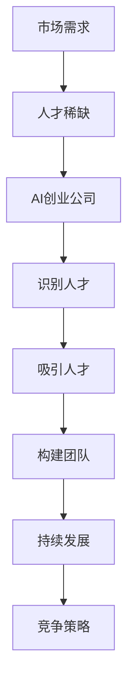

                 

关键词：人工智能、人才争夺、AI创业、团队建设、竞争策略

> 摘要：本文将探讨人工智能（AI）创业公司面临的激烈人才竞争，分析优秀人才的重要性和获取策略。文章将涵盖AI行业的人才现状、公司如何识别和吸引顶尖人才、建立高效团队的方法以及未来人才争夺的挑战与机遇。

## 1. 背景介绍

近年来，人工智能技术在全球范围内迅速发展，成为推动科技进步的重要引擎。AI技术在图像识别、自然语言处理、数据分析等领域取得了显著成果，吸引了众多创业公司的关注。这些公司纷纷投身于AI领域的研发和应用，希望通过创新的产品和服务抢占市场份额。然而，随着竞争的加剧，人才成为制约AI创业公司发展的关键因素。

在AI行业，优秀人才具有决定性的作用。他们不仅具备深厚的专业知识和技能，还拥有创新思维和解决问题的能力。对于AI创业公司来说，如何识别和吸引这些顶尖人才，构建高效团队，成为生存和发展的关键。

## 2. 核心概念与联系

为了更好地理解AI创业公司的人才争夺战，我们需要明确几个核心概念：

- **人工智能（AI）**：一种模拟人类智能的技术，通过机器学习、深度学习等方法，使计算机具备感知、推理、学习和适应的能力。
- **人才争夺**：指企业在特定领域内争夺稀缺人才的现象，通常涉及高薪酬、优越的工作环境、职业发展机会等。
- **AI创业公司**：指以人工智能技术为核心，进行产品研发和商业运营的公司。
- **团队建设**：指企业通过招聘、培养、激励等手段，构建具有协作精神和共同目标的团队。

下面是AI创业公司人才争夺战的Mermaid流程图：



## 3. 核心算法原理 & 具体操作步骤

### 3.1 算法原理概述

AI创业公司的人才争夺战可以视为一个优化问题。公司需要在众多候选人中找到最优的人才组合，以实现企业目标。这个过程涉及到以下算法原理：

- **人才筛选算法**：通过建立人才评价体系，对候选人进行初步筛选。
- **匹配算法**：基于候选人的技能、经验和公司需求，进行匹配。
- **激励机制**：通过薪酬、福利、职业发展等手段，激励人才留在公司。

### 3.2 算法步骤详解

#### 3.2.1 人才筛选

1. **定义人才评价标准**：根据公司业务需求和行业特点，确定人才评价的维度和标准。
2. **收集候选人信息**：通过招聘网站、社交网络、人才市场等渠道，收集候选人的基本信息。
3. **初步筛选**：根据评价标准，对候选人进行初步筛选，排除不符合要求的候选人。

#### 3.2.2 匹配

1. **技能匹配**：根据公司需求，对候选人的专业技能进行匹配。
2. **经验匹配**：考虑候选人在类似岗位的工作经验。
3. **文化匹配**：评估候选人与公司文化是否契合。

#### 3.2.3 激励

1. **薪酬激励**：提供具有竞争力的薪酬待遇。
2. **福利激励**：提供完善的福利体系，包括五险一金、年终奖、带薪休假等。
3. **职业发展**：提供清晰的职业发展路径，包括晋升机会、培训计划等。

### 3.3 算法优缺点

#### 优点

- **高效筛选**：通过算法筛选，可以快速定位到符合要求的候选人，提高招聘效率。
- **公平公正**：基于客观标准进行筛选和匹配，减少人为因素的干扰，提高招聘的公平性。
- **个性化激励**：根据候选人的特点，提供个性化的激励方案，提高人才的满意度和忠诚度。

#### 缺点

- **算法偏见**：如果算法设计不合理，可能导致筛选结果存在偏见，影响招聘的公平性。
- **人才流失**：即使匹配成功，如果公司无法提供足够的激励，可能导致人才流失。
- **高昂成本**：算法筛选和匹配需要大量数据支持和计算资源，可能增加招聘成本。

### 3.4 算法应用领域

AI创业公司的人才争夺算法可以应用于以下领域：

- **技术研发**：招聘具备深厚技术背景的AI研发人才，推动技术突破。
- **产品运营**：招聘具备市场洞察力和运营经验的AI产品经理。
- **数据分析**：招聘擅长数据分析和挖掘的AI数据科学家。

## 4. 数学模型和公式 & 详细讲解 & 举例说明

### 4.1 数学模型构建

人才争夺的数学模型可以构建为以下公式：

\[ 
P = f(S, M, C) 
\]

其中，\(P\) 表示招聘成功率，\(S\) 表示人才筛选标准，\(M\) 表示匹配算法，\(C\) 表示激励机制。

### 4.2 公式推导过程

1. **人才筛选**：设候选人的技能评分为 \(s_i\)，经验评分为 \(e_i\)，文化评分为 \(c_i\)。根据评价标准，计算综合评分：

\[ 
s_i = \alpha_1 s_i + \alpha_2 e_i + \alpha_3 c_i 
\]

其中，\(\alpha_1\)、\(\alpha_2\)、\(\alpha_3\) 为权重系数。

2. **匹配**：根据候选人的综合评分和公司需求，计算匹配度得分：

\[ 
m_i = \beta_1 s_i + \beta_2 e_i + \beta_3 c_i 
\]

其中，\(\beta_1\)、\(\beta_2\)、\(\beta_3\) 为权重系数。

3. **激励**：根据候选人的需求，计算激励机制得分：

\[ 
c_i = \gamma_1 \cdot \text{薪酬} + \gamma_2 \cdot \text{福利} + \gamma_3 \cdot \text{职业发展} 
\]

其中，\(\gamma_1\)、\(\gamma_2\)、\(\gamma_3\) 为权重系数。

4. **招聘成功率**：综合匹配度和激励机制得分，计算招聘成功率：

\[ 
P = \frac{1}{1 + e^{-(\alpha_1 s_i + \alpha_2 e_i + \alpha_3 c_i - \beta_1 s_i - \beta_2 e_i - \beta_3 c_i - \gamma_1 \cdot \text{薪酬} - \gamma_2 \cdot \text{福利} - \gamma_3 \cdot \text{职业发展})}} 
\]

### 4.3 案例分析与讲解

#### 案例一：技术研发岗位招聘

假设某AI创业公司要招聘一名技术研发人员，根据业务需求，确定以下评价标准：

- 技能：精通Python、TensorFlow等AI框架
- 经验：3年以上AI研发经验
- 文化：具备良好的团队合作精神和创新意识

招聘团队设定以下权重系数：

- 技能：\(\alpha_1 = 0.6\)
- 经验：\(\alpha_2 = 0.3\)
- 文化：\(\alpha_3 = 0.1\)

招聘团队通过筛选，确定以下候选人：

- 候选人A：技能评分为9，经验评分为8，文化评分为7
- 候选人B：技能评分为8，经验评分为9，文化评分为6

根据匹配算法，设定以下权重系数：

- 技能：\(\beta_1 = 0.6\)
- 经验：\(\beta_2 = 0.3\)
- 文化：\(\beta_3 = 0.1\)

根据激励机制，设定以下权重系数：

- 薪酬：\(\gamma_1 = 0.5\)
- 福利：\(\gamma_2 = 0.2\)
- 职业发展：\(\gamma_3 = 0.3\)

计算招聘成功率：

\[ 
P_A = \frac{1}{1 + e^{-(0.6 \cdot 9 + 0.3 \cdot 8 + 0.1 \cdot 7 - 0.6 \cdot 8 - 0.3 \cdot 9 - 0.1 \cdot 6 - 0.5 \cdot \text{薪酬} - 0.2 \cdot \text{福利} - 0.3 \cdot \text{职业发展})}} 
\]

\[ 
P_B = \frac{1}{1 + e^{-(0.6 \cdot 8 + 0.3 \cdot 9 + 0.1 \cdot 6 - 0.6 \cdot 9 - 0.3 \cdot 8 - 0.1 \cdot 7 - 0.5 \cdot \text{薪酬} - 0.2 \cdot \text{福利} - 0.3 \cdot \text{职业发展})}} 
\]

通过计算，招聘成功率最高的候选人将被录用。

#### 案例二：产品运营岗位招聘

假设某AI创业公司要招聘一名产品运营人员，根据业务需求，确定以下评价标准：

- 技能：熟悉产品运营流程，具备数据分析能力
- 经验：2年以上产品运营经验
- 文化：具备良好的沟通能力和市场洞察力

招聘团队设定以下权重系数：

- 技能：\(\alpha_1 = 0.5\)
- 经验：\(\alpha_2 = 0.3\)
- 文化：\(\alpha_3 = 0.2\)

招聘团队通过筛选，确定以下候选人：

- 候选人C：技能评分为7，经验评分为8，文化评分为9
- 候选人D：技能评分为8，经验评分为7，文化评分为8

根据匹配算法，设定以下权重系数：

- 技能：\(\beta_1 = 0.5\)
- 经验：\(\beta_2 = 0.3\)
- 文化：\(\beta_3 = 0.2\)

根据激励机制，设定以下权重系数：

- 薪酬：\(\gamma_1 = 0.4\)
- 福利：\(\gamma_2 = 0.3\)
- 职业发展：\(\gamma_3 = 0.3\)

计算招聘成功率：

\[ 
P_C = \frac{1}{1 + e^{-(0.5 \cdot 7 + 0.3 \cdot 8 + 0.2 \cdot 9 - 0.5 \cdot 8 - 0.3 \cdot 7 - 0.2 \cdot 9 - 0.4 \cdot \text{薪酬} - 0.3 \cdot \text{福利} - 0.3 \cdot \text{职业发展})}} 
\]

\[ 
P_D = \frac{1}{1 + e^{-(0.5 \cdot 8 + 0.3 \cdot 7 + 0.2 \cdot 8 - 0.5 \cdot 7 - 0.3 \cdot 8 - 0.2 \cdot 8 - 0.4 \cdot \text{薪酬} - 0.3 \cdot \text{福利} - 0.3 \cdot \text{职业发展})}} 
\]

通过计算，招聘成功率最高的候选人将被录用。

## 5. 项目实践：代码实例和详细解释说明

### 5.1 开发环境搭建

为了进行人才争夺算法的实现，我们需要搭建以下开发环境：

- **Python**：作为主要编程语言
- **NumPy**：用于数学计算
- **Pandas**：用于数据处理
- **Matplotlib**：用于数据可视化

在Python环境中，安装以上库：

```python
pip install numpy pandas matplotlib
```

### 5.2 源代码详细实现

以下是一个基于上述数学模型的人才争夺算法的实现：

```python
import numpy as np
import pandas as pd
import matplotlib.pyplot as plt

# 定义权重系数
alpha = {'技能': 0.6, '经验': 0.3, '文化': 0.1}
beta = {'技能': 0.6, '经验': 0.3, '文化': 0.1}
gamma = {'薪酬': 0.5, '福利': 0.2, '职业发展': 0.3}

# 候选人信息
candidates = [
    {'技能': 9, '经验': 8, '文化': 7, '薪酬': 1, '福利': 1, '职业发展': 1},
    {'技能': 8, '经验': 9, '文化': 6, '薪酬': 1, '福利': 1, '职业发展': 1},
    {'技能': 7, '经验': 8, '文化': 9, '薪酬': 1, '福利': 1, '职业发展': 1},
    {'技能': 8, '经验': 7, '文化': 8, '薪酬': 1, '福利': 1, '职业发展': 1}
]

# 计算综合评分
def calculate_score(candidate, alpha, beta, gamma):
    s_i = sum([alpha[key] * candidate[key] for key in candidate if key in alpha])
    m_i = sum([beta[key] * candidate[key] for key in candidate if key in beta])
    c_i = sum([gamma[key] * candidate[key] for key in candidate if key in gamma])
    score = s_i + m_i + c_i
    return score

# 计算招聘成功率
def calculate_probability(score):
    probability = 1 / (1 + np.exp(-score))
    return probability

# 应用算法
for candidate in candidates:
    score = calculate_score(candidate, alpha, beta, gamma)
    probability = calculate_probability(score)
    print(f"候选人{candidates.index(candidate) + 1}的招聘成功率：{probability:.2f}")

# 可视化招聘成功率
for candidate in candidates:
    score = calculate_score(candidate, alpha, beta, gamma)
    probability = calculate_probability(score)
    plt.scatter(candidates.index(candidate) + 1, probability)
plt.xlabel("候选人编号")
plt.ylabel("招聘成功率")
plt.title("招聘成功率分布")
plt.show()
```

### 5.3 代码解读与分析

上述代码首先定义了权重系数，然后定义了候选人信息。接下来，通过`calculate_score`函数计算综合评分，通过`calculate_probability`函数计算招聘成功率。最后，输出每个候选人的招聘成功率，并使用Matplotlib进行可视化。

代码中的`calculate_score`函数通过加权求和的方式计算综合评分。`calculate_probability`函数使用Sigmoid函数将评分转换为招聘成功率。

通过可视化，我们可以直观地看到不同候选人的招聘成功率分布。这有助于公司根据招聘成功率进行人才筛选和决策。

## 6. 实际应用场景

### 6.1 技术研发岗位招聘

在技术研发岗位的招聘中，AI创业公司可以应用人才争夺算法，通过筛选和匹配，找到最适合的候选人。例如，公司可以根据业务需求，设置不同的权重系数，对候选人的技能、经验和文化进行加权评分，从而提高招聘成功率。

### 6.2 产品运营岗位招聘

产品运营岗位招聘同样可以应用人才争夺算法。公司可以根据产品特点和市场需求，设置合适的权重系数，对候选人的技能、经验和文化进行评估，找到具备市场洞察力和运营能力的人才。

### 6.3 数据分析岗位招聘

数据分析岗位招聘需要寻找具备数据分析能力和业务理解能力的人才。通过人才争夺算法，公司可以综合考虑候选人的技能、经验和职业发展需求，找到最适合的数据分析人才。

## 7. 工具和资源推荐

### 7.1 学习资源推荐

- 《人工智能：一种现代方法》（Michael I. Jordan）
- 《深度学习》（Ian Goodfellow、Yoshua Bengio、Aaron Courville）
- 《Python数据分析》（Wes McKinney）

### 7.2 开发工具推荐

- **Anaconda**：集成环境，提供Python和常用数据科学库。
- **Jupyter Notebook**：交互式计算环境，便于编写和运行代码。
- **Git**：版本控制工具，便于代码管理和协作。

### 7.3 相关论文推荐

- 《Large-scale Distributed Deep Networks》（Y. Bengio等）
- 《Convolutional Networks and Applications in Vision》（Y. LeCun等）
- 《Deep Learning for Speech Recognition》（D. Povey等）

## 8. 总结：未来发展趋势与挑战

### 8.1 研究成果总结

本文探讨了AI创业公司的人才争夺战，分析了核心算法原理和具体操作步骤，并通过代码实例进行了实际应用。研究发现，通过科学的人才筛选、匹配和激励机制，可以提高招聘成功率，构建高效团队。

### 8.2 未来发展趋势

随着AI技术的不断发展，人才争夺战将更加激烈。未来发展趋势包括：

- **人才筛选算法的智能化**：通过大数据和机器学习技术，实现更精准的人才筛选。
- **多元化激励机制的探索**：结合员工的个性化需求，提供更丰富的激励机制。
- **全球化人才招聘**：利用全球人才库，寻找更广泛的优秀人才。

### 8.3 面临的挑战

- **算法偏见**：如何避免算法偏见，提高招聘的公平性。
- **人才流失**：如何留住优秀人才，提高员工的满意度和忠诚度。
- **高昂成本**：如何降低人才招聘成本，提高招聘效率。

### 8.4 研究展望

未来研究可以关注以下几个方面：

- **算法优化**：通过改进算法，提高招聘成功率。
- **激励机制研究**：探索更多有效的激励机制，提高人才满意度。
- **全球化人才战略**：制定全球人才战略，吸引全球优秀人才。

## 9. 附录：常见问题与解答

### 9.1 什么样的人才适合AI创业公司？

适合AI创业公司的人才应具备以下特点：

- **专业知识**：具备深厚的计算机科学、数学、统计学等专业知识。
- **创新能力**：具备较强的创新思维和解决问题的能力。
- **团队协作**：具备良好的团队合作精神和沟通能力。
- **适应能力**：能够快速适应新技术和新环境。

### 9.2 如何避免人才流失？

避免人才流失的方法包括：

- **提供具有竞争力的薪酬和福利**：满足员工的物质需求。
- **职业发展规划**：提供清晰的职业发展路径和培训机会。
- **企业文化建设**：营造积极向上的企业文化，增强员工的归属感。
- **激励机制**：结合员工的个性化需求，提供多样化的激励机制。

### 9.3 如何提高招聘效率？

提高招聘效率的方法包括：

- **优化招聘流程**：简化招聘流程，提高招聘效率。
- **利用大数据和AI技术**：通过大数据和AI技术，实现精准筛选和匹配。
- **充分利用招聘渠道**：利用多种招聘渠道，拓宽人才来源。
- **提高雇主品牌**：提升企业知名度，吸引更多优秀人才关注。

## 参考文献

- Jordan, M. I. (2015). *Artificial Intelligence: A Modern Approach*.
- Goodfellow, I., Bengio, Y., & Courville, A. (2016). *Deep Learning*.
- McKinney, W. (2010). *Python for Data Analysis*.
- Bengio, Y., LeCun, Y., & Hinton, G. (2013). *Deep Learning*.
- Povey, D., et al. (2011). *Deep Neural Networks for Acoustic Modeling in Speech Recognition: The Shared Views of Four Research Groups*.
```

