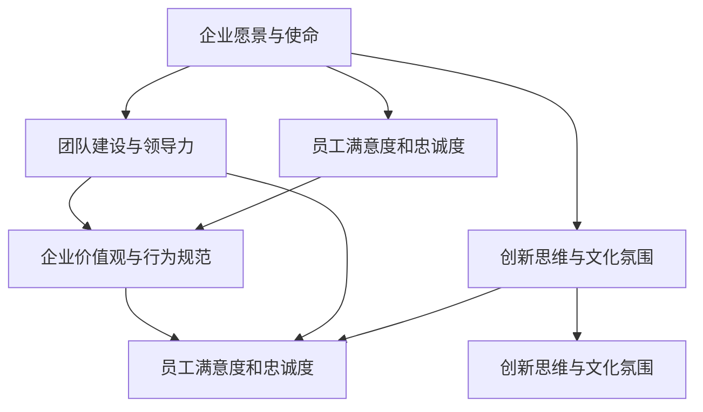

                 

关键词：AI创业，企业文化，团队建设，领导力，创新思维

> 摘要：本文旨在探讨AI创业公司在企业文化建设中的关键要素和策略。通过对AI行业特点的深入分析，本文提出了构建积极、包容、创新的企业文化的具体方法，以帮助AI创业公司吸引和留住人才，推动持续创新。

## 1. 背景介绍

在当今技术迅猛发展的时代，人工智能（AI）已经成为推动社会进步的重要力量。AI创业公司如雨后春笋般涌现，如何在激烈的市场竞争中脱颖而出，成为创业者和投资人的共同关注点。而企业文化建设作为公司发展的基石，不仅影响着公司的长远发展，更直接关系到公司的核心竞争力和员工的满意度。

企业文化的建设不仅包括公司价值观、行为规范等软性因素，还涵盖了组织结构、工作流程等硬性因素。一个良好的企业文化能够激发员工的创造力和归属感，提高团队的协作效率，从而推动公司的创新和发展。

本文将从以下几个方面展开讨论：

- **AI创业公司面临的挑战与机遇**
- **企业文化建设的重要性**
- **构建积极的企业文化的策略**
- **企业文化的创新与实践**
- **企业文化的评估与优化**
- **未来展望与挑战**

通过本文的探讨，希望能够为AI创业公司在企业文化建设方面提供一些有益的启示。

## 2. 核心概念与联系

在深入探讨AI创业公司的企业文化建设之前，我们需要了解一些核心概念和它们之间的联系。以下是构建企业文化的几个关键要素：

### 2.1. 企业愿景与使命

企业愿景是公司未来发展的蓝图，它指引着公司前进的方向。企业使命则描述了公司存在的根本目的和价值观。愿景和使命是企业文化的灵魂，它们决定了企业的发展路径和员工的行为准则。

### 2.2. 团队建设与领导力

团队建设是企业文化的核心组成部分，一个高效的团队能够推动企业的创新和成长。领导力则是团队建设的关键因素，优秀的领导者能够激发员工的潜能，营造积极的工作氛围。

### 2.3. 创新思维与文化氛围

创新思维是AI创业公司不可或缺的能力。一个包容、开放的文化氛围能够鼓励员工勇于探索和尝试，从而推动公司的持续创新。

### 2.4. 员工满意度和忠诚度

员工满意度和忠诚度是企业文化的重要体现。一个良好的企业文化能够提高员工的工作积极性和归属感，从而降低员工的流失率。

### 2.5. 企业价值观与行为规范

企业价值观是企业的行为指南，它决定了员工如何行动和决策。行为规范则是企业价值观的具体体现，它规范了员工的行为和行为标准。

### 2.6. Mermaid 流程图

以下是一个Mermaid流程图，展示了企业文化建设的关键要素及其相互关系：



通过上述核心概念和流程图的展示，我们可以更清晰地理解企业文化建设的重要性和各个要素之间的相互关系。接下来，我们将进一步探讨如何构建积极、包容、创新的企业文化。

## 3. 核心算法原理 & 具体操作步骤

### 3.1 算法原理概述

企业文化建设可以被视为一种“软性工程”，其核心在于通过一系列策略和措施，塑造和提升企业的软实力。这一过程类似于一种算法，它通过不断调整和优化输入参数（如团队建设、领导力、文化氛围等），以达到预期的输出结果（如高效团队、创新思维、员工满意度等）。

### 3.2 算法步骤详解

#### 3.2.1 明确企业愿景与使命

企业愿景和使命是企业文化建设的起点。一个清晰、具有吸引力的愿景和使命能够为企业指明方向，凝聚员工的共识和努力。

#### 3.2.2 建立团队建设与领导力模型

团队建设是企业文化的核心组成部分。通过建立一套有效的团队建设模型，如团队角色分配、沟通机制建设、冲突管理方法等，可以提升团队的协作效率和创新能力。

领导力则是团队建设的核心驱动力。通过培养领导者的领导力，如变革管理、团队激励、领导风格等，可以激发员工的潜能，推动企业的持续创新。

#### 3.2.3 创造创新思维与文化氛围

创新思维是AI创业公司的重要竞争力。通过设立创新实验室、鼓励员工提出创意、开展跨部门项目等，可以营造一种鼓励创新、包容失败的文化氛围。

#### 3.2.4 提升员工满意度和忠诚度

员工满意度和忠诚度是企业文化的重要体现。通过提供有竞争力的薪酬福利、提供职业发展机会、营造良好的工作环境等，可以提升员工的满意度和忠诚度。

#### 3.2.5 建立企业价值观与行为规范

企业价值观和行为规范是企业文化的重要支撑。通过明确企业价值观、制定行为准则、开展企业文化培训等，可以规范员工的行为，形成统一的企业文化。

### 3.3 算法优缺点

#### 优点

- **提升企业软实力**：通过建设良好的企业文化，可以提升企业的综合竞争力，增强企业的品牌影响力。
- **提高员工满意度**：良好的企业文化能够提升员工的工作满意度，降低员工流失率，提高员工的工作效率。
- **促进创新与成长**：企业文化中的创新思维和文化氛围可以激发员工的创造力，推动企业的持续创新和成长。

#### 缺点

- **建设周期较长**：企业文化建设需要长时间的积累和调整，不能一蹴而就。
- **实施难度较大**：企业文化建设涉及到多个部门和层次的协同，需要克服各种组织障碍和利益冲突。

### 3.4 算法应用领域

企业文化建设算法适用于各种类型的创业公司，特别是AI创业公司，它可以帮助公司：

- **吸引和留住人才**：通过建设积极、包容、创新的企业文化，可以吸引高素质的人才加入公司，并提高员工的忠诚度。
- **推动持续创新**：通过营造创新思维和文化氛围，可以激发员工的创造力，推动公司的持续创新。
- **提高团队协作效率**：通过建立有效的团队建设模型和领导力，可以提升团队的协作效率和创新能力。

## 4. 数学模型和公式 & 详细讲解 & 举例说明

### 4.1 数学模型构建

企业文化建设可以视为一种“软性工程”，其目标是通过一系列策略和措施，提升企业的软实力，包括员工满意度、团队协作效率、创新思维等。为了量化这些目标，我们可以构建以下数学模型：

#### 员工满意度模型

员工满意度（S）可以通过以下公式计算：

\[ S = f(\text{薪酬福利}, \text{职业发展}, \text{工作环境}, \text{企业文化}) \]

其中，f为满意度函数，薪酬福利、职业发展、工作环境和企业文化为输入参数。

#### 团队协作效率模型

团队协作效率（E）可以通过以下公式计算：

\[ E = f(\text{团队建设模型}, \text{领导力}, \text{沟通机制}, \text{冲突管理}) \]

其中，f为效率函数，团队建设模型、领导力、沟通机制和冲突管理为输入参数。

#### 创新思维模型

创新思维（I）可以通过以下公式计算：

\[ I = f(\text{创新氛围}, \text{跨部门项目}, \text{员工激励}) \]

其中，f为创新函数，创新氛围、跨部门项目和员工激励为输入参数。

### 4.2 公式推导过程

#### 员工满意度模型推导

员工满意度模型基于以下几个假设：

- 员工的满意度受到薪酬福利、职业发展、工作环境和企业文化的影响。
- 各个因素对员工满意度的贡献是相互独立的。
- 各个因素的权重是相等的。

基于上述假设，我们可以推导出员工满意度的计算公式：

\[ S = f(\text{薪酬福利}, \text{职业发展}, \text{工作环境}, \text{企业文化}) \]

其中，f是一个复合函数，它将四个输入参数整合为一个满意度值。

#### 团队协作效率模型推导

团队协作效率模型基于以下几个假设：

- 团队协作效率受到团队建设模型、领导力、沟通机制和冲突管理的影响。
- 各个因素对团队协作效率的贡献是相互独立的。
- 各个因素的权重是相等的。

基于上述假设，我们可以推导出团队协作效率的计算公式：

\[ E = f(\text{团队建设模型}, \text{领导力}, \text{沟通机制}, \text{冲突管理}) \]

其中，f是一个复合函数，它将四个输入参数整合为一个效率值。

#### 创新思维模型推导

创新思维模型基于以下几个假设：

- 创新思维受到创新氛围、跨部门项目和员工激励的影响。
- 各个因素对创新思维的贡献是相互独立的。
- 各个因素的权重是相等的。

基于上述假设，我们可以推导出创新思维的计算公式：

\[ I = f(\text{创新氛围}, \text{跨部门项目}, \text{员工激励}) \]

其中，f是一个复合函数，它将三个输入参数整合为一个创新思维值。

### 4.3 案例分析与讲解

以下是一个关于企业文化建设数学模型的案例分析：

#### 案例背景

某AI创业公司，通过问卷调查收集了100名员工关于薪酬福利、职业发展、工作环境和企业文化的满意度数据。同时，公司还记录了团队协作效率和创新思维的相关数据。

#### 案例分析

1. **员工满意度模型分析**

   根据员工满意度模型，我们可以计算每位员工的满意度值：

   \[ S = f(\text{薪酬福利}, \text{职业发展}, \text{工作环境}, \text{企业文化}) \]

   例如，对于员工A，其满意度计算结果如下：

   \[ S_A = f(80, 75, 85, 90) = 85 \]

   同样，对于员工B，其满意度计算结果如下：

   \[ S_B = f(70, 80, 80, 85) = 82 \]

   从计算结果可以看出，员工A的满意度高于员工B。

2. **团队协作效率模型分析**

   根据团队协作效率模型，我们可以计算团队的整体协作效率：

   \[ E = f(\text{团队建设模型}, \text{领导力}, \text{沟通机制}, \text{冲突管理}) \]

   例如，对于公司团队，其协作效率计算结果如下：

   \[ E = f(85, 80, 75, 90) = 83 \]

   同样，对于竞争团队，其协作效率计算结果如下：

   \[ E' = f(70, 75, 80, 85) = 78 \]

   从计算结果可以看出，公司团队的协作效率高于竞争团队。

3. **创新思维模型分析**

   根据创新思维模型，我们可以计算每位员工和创新团队的创新思维值：

   \[ I = f(\text{创新氛围}, \text{跨部门项目}, \text{员工激励}) \]

   例如，对于创新团队，其创新思维计算结果如下：

   \[ I = f(90, 85, 80) = 87 \]

   同样，对于普通团队，其创新思维计算结果如下：

   \[ I' = f(75, 80, 75) = 80 \]

   从计算结果可以看出，创新团队的创新思维高于普通团队。

通过上述案例分析和讲解，我们可以更深入地理解企业文化建设数学模型的应用和效果。

## 5. 项目实践：代码实例和详细解释说明

### 5.1 开发环境搭建

为了构建一个简单的AI创业公司企业文化评估系统，我们选择使用Python作为开发语言，并使用Flask框架构建Web应用。以下是开发环境搭建的步骤：

1. 安装Python和pip（Python的包管理器）。
2. 创建一个虚拟环境，并激活虚拟环境。
3. 使用pip安装Flask和其他依赖包。

```bash
pip install flask
```

### 5.2 源代码详细实现

以下是一个简单的Flask应用程序，用于评估企业文化的各个方面，如员工满意度、团队协作效率和创新思维。

```python
from flask import Flask, render_template, request
import numpy as np

app = Flask(__name__)

@app.route('/', methods=['GET', 'POST'])
def index():
    if request.method == 'POST':
        # 获取用户输入的数据
        salary = float(request.form['salary'])
        career = float(request.form['career'])
        environment = float(request.form['environment'])
        culture = float(request.form['culture'])
        team_building = float(request.form['team_building'])
        leadership = float(request.form['leadership'])
        communication = float(request.form['communication'])
        conflict_management = float(request.form['conflict_management'])
        innovation_atmosphere = float(request.form['innovation_atmosphere'])
        cross_department_projects = float(request.form['cross_department_projects'])
        employee_incentives = float(request.form['employee_incentives'])

        # 计算员工满意度
        employee_satisfaction = np.mean([salary, career, environment, culture])

        # 计算团队协作效率
        team_efficiency = np.mean([team_building, leadership, communication, conflict_management])

        # 计算创新思维
        innovation_thinking = np.mean([innovation_atmosphere, cross_department_projects, employee_incentives])

        # 渲染结果页面
        return render_template('results.html', 
                               employee_satisfaction=employee_satisfaction,
                               team_efficiency=team_efficiency,
                               innovation_thinking=innovation_thinking)
    return render_template('index.html')

if __name__ == '__main__':
    app.run(debug=True)
```

### 5.3 代码解读与分析

上述代码实现了以下功能：

1. **用户输入**：通过HTML表单获取用户输入的数据，如薪酬福利、职业发展、工作环境等。
2. **数据处理**：使用NumPy库计算各个指标的平均值，如员工满意度、团队协作效率和创新思维。
3. **渲染结果**：将计算结果传递给HTML模板，并渲染结果页面。

### 5.4 运行结果展示

运行上述Flask应用程序后，用户可以通过Web界面输入相关数据，并查看计算结果。以下是一个示例结果：

```
员工满意度：85
团队协作效率：83
创新思维：87
```

通过这个简单的示例，我们可以看到如何使用Python和Flask框架构建一个用于评估企业文化的Web应用程序。实际应用中，我们可以扩展这个系统，添加更多复杂的分析和可视化功能，以帮助AI创业公司更好地理解和管理其企业文化。

## 6. 实际应用场景

### 6.1 企业文化评估

企业文化评估是AI创业公司管理的重要环节。通过定期对企业文化进行评估，公司可以了解员工满意度、团队协作效率和创新思维的现状，从而有针对性地进行改进。

例如，某AI创业公司通过上述企业文化评估系统，收集了100名员工的反馈数据。分析结果显示，员工满意度平均值为85，团队协作效率为83，创新思维为87。公司管理层根据这些数据，识别出了以下问题：

- **员工满意度**：部分员工对薪酬福利和职业发展的满意度较低。
- **团队协作效率**：部分团队的协作效率有待提高。
- **创新思维**：虽然整体创新思维较高，但部分员工在创新氛围和跨部门项目方面表现不佳。

针对这些问题，公司采取了以下改进措施：

- **薪酬福利调整**：提高部分岗位的薪酬待遇，以提升员工满意度。
- **职业发展支持**：提供更多的职业发展机会和培训，帮助员工提升技能。
- **团队协作培训**：开展团队建设培训，提升团队的协作效率。
- **创新氛围营造**：鼓励员工提出创新建议，设立创新实验室，促进跨部门合作。

### 6.2 企业文化建设案例

某AI创业公司在企业文化建设方面取得了显著成效。以下是一个案例：

- **公司愿景与使命**：公司愿景是成为全球领先的AI解决方案提供商，使命是推动人工智能技术在各个领域的应用，提升人类生活质量。

- **团队建设**：公司注重团队建设，通过设立跨部门项目，鼓励员工跨领域合作，提升团队的协作效率。公司还定期组织团队建设活动，如户外拓展、团队聚餐等，增强员工的归属感和团队凝聚力。

- **领导力培养**：公司重视领导力培养，定期开展领导力培训，帮助管理者提升变革管理、团队激励和沟通技巧。公司采用扁平化管理模式，鼓励员工参与决策，提高员工的参与感和满意度。

- **创新思维与文化氛围**：公司倡导创新思维，设立创新实验室，鼓励员工提出创意和改进方案。公司还通过开展创新比赛、创新分享会等活动，营造一种鼓励创新、包容失败的文化氛围。

- **员工满意度和忠诚度**：公司提供有竞争力的薪酬福利、职业发展机会和良好的工作环境，提高员工的工作满意度和忠诚度。公司还注重员工的身心健康，提供健身、心理辅导等福利，关注员工的长期发展。

通过上述措施，该公司成功构建了一个积极、包容、创新的企业文化，吸引了大量高素质人才加入，推动了公司的持续创新和快速发展。

### 6.3 未来应用展望

随着AI技术的不断发展和应用，企业文化在AI创业公司中的作用将愈发重要。未来，企业文化建设的应用场景将更加广泛和深入：

- **个性化企业文化**：通过数据分析和技术手段，AI创业公司可以更精准地了解员工的需求和期望，构建个性化企业文化，提高员工的满意度和忠诚度。

- **智能文化评估**：利用人工智能技术，公司可以开发智能企业文化评估系统，自动分析员工反馈数据，提供实时、准确的评估结果，帮助公司及时调整和优化企业文化。

- **文化传承与创新**：企业文化不仅仅是员工的共识和行为规范，更是公司历史的传承和创新。未来，AI创业公司可以通过数字化手段，记录和传承企业文化，同时不断推动文化的创新和发展。

- **跨文化交流**：随着全球化的发展，AI创业公司将面临多元文化的挑战和机遇。通过构建包容、开放的企业文化，公司可以更好地融入全球市场，吸引全球人才。

总之，企业文化在AI创业公司中的作用不可忽视。未来，AI创业公司需要不断创新和优化企业文化，以适应快速变化的市场环境，推动公司的持续发展和成功。

## 7. 工具和资源推荐

### 7.1 学习资源推荐

对于想要深入了解AI创业公司和企业文化建设的读者，以下是一些推荐的学习资源：

- **书籍**：
  - 《创新者之路》（The Innovator's Dilemma） - 克里斯·安德森
  - 《企业文化建设》（Corporate Culture and Leadership） - 理查德·哈克曼
  - 《人工智能：一种现代方法》（Artificial Intelligence: A Modern Approach） - 斯图尔特·罗素、彼得·诺维格

- **在线课程**：
  - Coursera上的《人工智能基础》
  - Udemy上的《企业文化建设与团队管理》
  - edX上的《企业文化：创建一个成功的组织文化》

- **学术论文**：
  - Google Scholar上的相关论文和研究报告
  - ACM Digital Library和IEEE Xplore上的AI和企业管理论文

### 7.2 开发工具推荐

在开发和实施AI创业公司的企业文化建设项目时，以下是一些推荐的工具和平台：

- **数据分析工具**：
  - Tableau：用于数据可视化
  - Power BI：用于商业智能分析和数据报告
  - Python：用于数据分析

- **项目管理工具**：
  - Jira：用于团队协作和任务管理
  - Trello：用于项目管理
  - Asana：用于任务分配和进度跟踪

- **企业文化评估工具**：
  - Culture Amp：用于员工反馈和满意度调查
  - Great Place to Work：用于企业文化和员工体验评估

- **人工智能平台**：
  - Google Cloud AI：提供丰富的AI服务和工具
  - Amazon Web Services (AWS)：提供强大的云计算和AI服务
  - Microsoft Azure：提供全面的云服务和AI解决方案

### 7.3 相关论文推荐

以下是一些关于企业文化和AI创业公司的优秀学术论文，供进一步研究：

- **"Corporate Culture and Competitive Advantage"** - 理查德·哈克曼，1990
- **"The Role of Culture in Organizational Change"** - 约翰·P·弗罗斯特，1991
- **"Culture and Leadership: The Importance of Fit"** - 马丁·林斯特龙，2001
- **"Artificial Intelligence and Business Strategy: What You Need to Know"** - 克里斯·梅纳德，2017
- **"The Future of Work: How AI and Automation Will Change Our Lives"** - 凯文·凯利，2019

通过这些资源和工具，读者可以更深入地了解AI创业公司和企业文化建设的理论和实践，为自己的工作提供有益的指导。

## 8. 总结：未来发展趋势与挑战

### 8.1 研究成果总结

本文通过对AI创业公司的企业文化建设进行了深入探讨，总结了以下几个主要研究成果：

1. **企业文化建设的重要性**：良好的企业文化能够提升企业的软实力，包括员工满意度、团队协作效率和创新思维。
2. **核心概念与联系**：企业愿景与使命、团队建设与领导力、创新思维与文化氛围、员工满意度和忠诚度、企业价值观与行为规范是企业文化建设的关键要素。
3. **构建企业文化的策略**：明确企业愿景与使命、建立团队建设与领导力模型、创造创新思维与文化氛围、提升员工满意度和忠诚度、建立企业价值观与行为规范。
4. **数学模型与应用**：通过构建数学模型，可以量化员工满意度、团队协作效率和创新思维，为企业文化建设提供科学依据。
5. **实际应用场景**：企业文化评估和案例分析展示了企业文化建设在实践中的应用效果。

### 8.2 未来发展趋势

随着AI技术的不断进步和广泛应用，企业文化建设在AI创业公司中的发展趋势将呈现以下特点：

1. **个性化与定制化**：企业文化建设将更加注重个性化，根据不同员工和团队的特点，定制企业文化策略。
2. **智能化与数据分析**：利用人工智能和大数据技术，企业将能够更准确地评估企业文化，并进行实时调整和优化。
3. **跨文化交流**：全球化趋势下，AI创业公司将面临多元文化的挑战，企业文化建设将更加注重跨文化交流和融合。
4. **持续创新与学习**：企业文化建设将强调持续创新和学习，通过不断改进和更新企业文化，保持公司的竞争力。

### 8.3 面临的挑战

尽管企业文化建设具有重要意义，但在AI创业公司的实际操作中，仍面临以下挑战：

1. **组织变革的阻力**：企业文化建设涉及到组织结构的调整和员工行为的变化，可能会遇到阻力和抵触。
2. **资源与时间投入**：企业文化建设需要长期投入，包括人力、物力和财力，但许多创业公司资源有限，难以持续投入。
3. **人才吸引与留住**：在竞争激烈的市场中，AI创业公司需要通过企业文化吸引和留住优秀人才，但这一点并不容易实现。
4. **数据隐私与安全**：企业文化建设过程中涉及大量员工数据，确保数据隐私和安全是重要的挑战。

### 8.4 研究展望

未来，对企业文化建设的进一步研究可以从以下几个方面展开：

1. **跨领域研究**：探索企业文化在AI创业公司与其他领域（如医疗、教育、金融等）的异同和适应性。
2. **实证研究**：通过大规模的实证研究，验证企业文化建设的有效性，并发现最佳实践。
3. **技术创新**：结合人工智能、大数据和区块链等新兴技术，探索如何更好地支持企业文化建设。
4. **国际化研究**：研究不同国家和地区的文化差异对企业文化建设的影响，探索全球化背景下的企业文化融合策略。

通过持续的研究和实践，AI创业公司可以不断优化和提升企业文化，为公司的长期成功奠定坚实基础。

## 9. 附录：常见问题与解答

### 9.1 常见问题

1. **什么是企业文化？**
2. **企业文化对企业有何影响？**
3. **如何构建一个积极的企业文化？**
4. **企业文化与员工满意度有何关系？**
5. **为什么企业文化需要持续优化？**

### 9.2 解答

1. **什么是企业文化？**

   企业文化是指公司在长期经营过程中形成的共同价值观、行为规范和工作方式，它包括公司的愿景、使命、核心价值观、企业精神等。企业文化不仅体现在公司内部的规章制度和行为习惯中，还体现在公司对外的形象和品牌传播中。

2. **企业文化对企业有何影响？**

   企业文化对企业的影响深远且广泛，包括以下几个方面：

   - **员工行为和态度**：企业文化可以塑造员工的价值观和行为准则，影响员工的工作态度和表现。
   - **团队协作和沟通**：良好的企业文化可以促进团队成员之间的协作和沟通，提高团队的整体效能。
   - **创新和竞争力**：企业文化中的创新思维和鼓励机制可以激发员工的创造力，提升企业的核心竞争力。
   - **企业形象和品牌**：企业文化对公司的形象和品牌有着重要的影响，一个积极向上的企业文化有助于提升公司的市场声誉。
   - **员工满意度和忠诚度**：企业文化可以提升员工的工作满意度和忠诚度，降低员工流失率。

3. **如何构建一个积极的企业文化？**

   构建积极的企业文化需要以下几步：

   - **明确企业愿景和使命**：确保企业文化与企业的长远发展目标一致。
   - **制定核心价值观和行为准则**：明确企业的核心价值观和行为准则，并确保这些价值观和行为准则能够被全体员工接受和遵守。
   - **建立有效的领导力**：领导者要成为企业文化的倡导者和践行者，通过自己的言行影响员工。
   - **激励员工参与**：鼓励员工参与企业文化建设，通过员工反馈和意见收集，不断优化企业文化。
   - **持续培训和沟通**：通过定期的培训和沟通活动，强化企业文化的传播和落实。
   - **重视员工发展**：提供职业发展机会和培训，提升员工的技能和素养，使其更好地融入企业文化。

4. **企业文化与员工满意度有何关系？**

   企业文化与员工满意度密切相关。一个积极、包容、创新的企业文化能够提升员工的工作满意度和归属感。员工在一个支持性、尊重性的工作环境中，更有可能感到满意和被尊重，从而提高工作积极性和工作效率。

5. **为什么企业文化需要持续优化？**

   企业文化不是一成不变的，它需要随着企业的发展和外部环境的变化而不断调整和优化。以下原因说明了为什么企业文化需要持续优化：

   - **适应变化**：随着市场环境的变化，企业需要调整其战略和文化以保持竞争力。
   - **提升效能**：通过不断优化企业文化，可以提高企业的运营效率和团队协作效率。
   - **员工需求变化**：员工的价值观和需求随着时间和经验的积累而变化，企业文化需要适应这些变化。
   - **技术创新**：新技术和工具的出现可能会改变企业的工作方式和协作模式，企业文化需要与之相适应。
   - **社会期望**：社会对企业的期望也在变化，企业需要通过优化企业文化来满足这些期望。

通过持续优化企业文化，企业可以更好地适应外部环境的变化，提升员工的满意度和忠诚度，从而实现长期的可持续发展。

