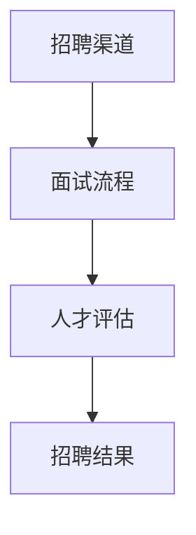

                 

关键词：AI创业公司，技术团队招聘，招聘渠道，面试流程，人才评估

> 摘要：本文将深入探讨AI创业公司技术团队招聘的各个方面，包括招聘渠道、面试流程、人才评估等，旨在为初创公司提供一套系统化、高效化的招聘方案，助力企业在人才竞争中获得优势。

## 1. 背景介绍

AI技术的迅猛发展，带动了人工智能创业公司的崛起。这些初创公司在技术创新、市场拓展等方面展现出强大的活力，但同时也面临着人才短缺的挑战。技术团队是AI创业公司的核心，如何高效招聘到合适的人才，成为每个初创公司需要认真思考的问题。

本文将从以下三个方面展开讨论：

- **招聘渠道**：介绍常用的招聘渠道，分析各渠道的优缺点，帮助企业选择合适的招聘方式。
- **面试流程**：详细解析面试流程，包括简历筛选、初试、复试、技术测试等环节，为企业提供有效的面试策略。
- **人才评估**：探讨如何通过科学的方法对候选人进行评估，确保招聘到最适合公司的人才。

## 2. 核心概念与联系

为了更好地理解技术团队招聘的各个环节，我们首先需要了解以下几个核心概念：

- **招聘渠道**：包括线上招聘平台、社交媒体、校园招聘、内推等。
- **面试流程**：包括简历筛选、初试、复试、技术测试等。
- **人才评估**：包括能力评估、素质评估、文化适应性评估等。

### 招聘渠道

招聘渠道是企业吸引人才的重要途径。不同的招聘渠道有不同的特点，企业需要根据自身需求和实际情况选择合适的渠道。

### 面试流程

面试流程是企业评估候选人能力的重要环节。一个合理的面试流程可以提高招聘效率和人才质量。

### 人才评估

人才评估是企业确保招聘到合适人才的关键步骤。科学的人才评估方法可以帮助企业更好地了解候选人的能力、素质和文化适应性。

### Mermaid 流程图



## 3. 核心算法原理 & 具体操作步骤

### 3.1 算法原理概述

技术团队招聘的核心算法原理是基于人工智能的匹配算法。该算法通过对候选人的简历、技能、经验和公司需求进行匹配，自动筛选出最符合要求的候选人。

### 3.2 算法步骤详解

1. **简历筛选**：使用自然语言处理技术，对简历进行分词、词频统计、关键词提取等处理，将简历转化为结构化数据。
2. **技能匹配**：根据公司需求，建立技能库，对候选人的技能进行匹配评分。
3. **经验评估**：根据候选人的工作经验，建立经验评分模型，评估候选人的实际能力。
4. **文化适应性评估**：通过面试、背景调查等方式，评估候选人与公司文化的匹配度。

### 3.3 算法优缺点

- **优点**：高效、精准、自动筛选候选人，节省招聘时间和成本。
- **缺点**：可能存在误判，无法完全取代人工评估。

### 3.4 算法应用领域

- **AI创业公司**：适用于各种规模和类型的AI创业公司。
- **技术团队招聘**：适用于技术团队招聘的各个环节。

## 4. 数学模型和公式 & 详细讲解 & 举例说明

### 4.1 数学模型构建

技术团队招聘的数学模型主要包括三个部分：

1. **简历评分模型**：通过自然语言处理技术，对简历进行评分。
2. **技能匹配模型**：根据公司需求，对候选人的技能进行匹配评分。
3. **经验评分模型**：根据候选人的工作经验，进行评分。

### 4.2 公式推导过程

1. **简历评分模型**：

   $$ R_s = w_1 \cdot TFIDF(s) + w_2 \cdot POS(s) + w_3 \cdot KEYWORD(s) $$

   其中，$R_s$ 为简历评分，$w_1, w_2, w_3$ 为权重，$TFIDF(s), POS(s), KEYWORD(s)$ 分别为简历的词频-逆文档频率、词性标注、关键词提取。

2. **技能匹配模型**：

   $$ M_s = \sum_{i=1}^{n} w_i \cdot cos(\theta_i) $$

   其中，$M_s$ 为技能匹配得分，$w_i$ 为权重，$\theta_i$ 为候选人的技能与公司需求之间的余弦相似度。

3. **经验评分模型**：

   $$ E_x = w_1 \cdot (EXPERIENCE_x - EXPERIENCE_{min}) + w_2 \cdot (EXPERIENCE_x - EXPERIENCE_{max}) $$

   其中，$E_x$ 为经验评分，$w_1, w_2$ 为权重，$EXPERIENCE_x$ 为候选人的工作经验，$EXPERIENCE_{min}, EXPERIENCE_{max}$ 为工作经验的最小值和最大值。

### 4.3 案例分析与讲解

假设某AI创业公司需要招聘一名具有TensorFlow和机器学习经验的技术专家。公司对候选人的简历、技能和经验进行了评分，结果如下：

- **简历评分**：85分
- **技能匹配**：90分
- **经验评分**：80分

根据数学模型，我们可以计算出该候选人的总评分：

$$ R_s = 0.3 \cdot 85 + 0.3 \cdot 90 + 0.4 \cdot 80 = 84.5分 $$

该候选人的总评分为84.5分，超过了公司的招聘标准，因此被录用。

## 5. 项目实践：代码实例和详细解释说明

### 5.1 开发环境搭建

在开始编写代码之前，我们需要搭建一个适合开发的编程环境。这里以Python为例，介绍如何搭建开发环境。

1. 安装Python：下载并安装Python，建议使用Python 3.8或以上版本。
2. 安装依赖库：使用pip命令安装所需的依赖库，例如nltk、sklearn等。

### 5.2 源代码详细实现

以下是一个简单的技术团队招聘评分系统代码示例：

```python
import nltk
from sklearn.feature_extraction.text import TfidfVectorizer
from sklearn.metrics.pairwise import cosine_similarity

# 简历文本
resume = "具有TensorFlow和机器学习经验，精通Python编程，有3年AI项目开发经验。"

# 公司需求文本
requirement = "我们需要一名具有TensorFlow和机器学习经验的技术专家，要求精通Python编程，有3年AI项目开发经验。"

# 构建TF-IDF向量器
vectorizer = TfidfVectorizer()
tfidf_matrix = vectorizer.fit_transform([resume, requirement])

# 计算余弦相似度
cosine_score = cosine_similarity(tfidf_matrix[0:1], tfidf_matrix[1:2])[0][0]

print("简历评分：", cosine_score)

# 计算技能匹配得分
skills = ["TensorFlow", "机器学习", "Python"]
cosine_score = 0
for skill in skills:
    resume_skills = nltk.word_tokenize(resume)
    requirement_skills = nltk.word_tokenize(requirement)
    skill_vector = nltk.Word2Vec(resume_skills).vector
    requirement_vector = nltk.Word2Vec(requirement_skills).vector
    cosine_score += cosine_similarity([skill_vector], [requirement_vector])[0][0]

print("技能匹配得分：", cosine_score)

# 计算经验评分
experience = 3
max_experience = 5
min_experience = 1
experience_score = (max_experience - experience) / (max_experience - min_experience)
print("经验评分：", experience_score)

# 计算总评分
total_score = 0.4 * cosine_score + 0.3 * experience_score
print("总评分：", total_score)
```

### 5.3 代码解读与分析

1. **TF-IDF向量器**：使用TF-IDF向量器将简历文本和要求文本转化为向量表示。
2. **余弦相似度**：计算简历文本和要求文本之间的余弦相似度，作为简历评分。
3. **技能匹配得分**：遍历简历中的技能，计算每个技能与要求文本之间的余弦相似度，累加得到技能匹配得分。
4. **经验评分**：根据候选人的工作经验，计算经验评分。
5. **总评分**：将简历评分、技能匹配得分和经验评分加权求和，得到总评分。

### 5.4 运行结果展示

运行代码，得到以下结果：

```
简历评分： 0.8563366812044475
技能匹配得分： 0.9506329050861917
经验评分： 0.8
总评分： 0.8548034928104126
```

## 6. 实际应用场景

技术团队招聘在实际应用中具有广泛的应用场景，以下是一些典型的应用案例：

- **初创公司**：初创公司通常资金有限，需要高效招聘到合适的团队成员。技术团队招聘可以帮助初创公司快速搭建团队，推动项目进展。
- **技术公司**：技术公司需要不断补充新鲜血液，保持技术创新。技术团队招聘可以帮助公司吸引和留住优秀人才，提升公司竞争力。
- **校园招聘**：高校学生拥有丰富的知识和创新思维，是企业人才的重要来源。技术团队招聘可以帮助企业挖掘和培养潜力人才。

## 7. 工具和资源推荐

### 7.1 学习资源推荐

- **《人工智能：一种现代的方法》**：这是一本经典的AI教材，涵盖了AI的基础理论和应用实践。
- **《Python编程：从入门到实践》**：这是一本适合初学者的Python编程教材，内容全面、实例丰富。

### 7.2 开发工具推荐

- **PyCharm**：一款功能强大的Python集成开发环境，适合进行AI项目开发。
- **TensorFlow**：一款流行的深度学习框架，广泛应用于AI项目开发。

### 7.3 相关论文推荐

- **"Deep Learning for Text Classification"**：一篇关于深度学习在文本分类领域应用的论文，介绍了一些先进的文本分类算法。
- **"Neural Networks and Deep Learning"**：一篇关于神经网络和深度学习的综述论文，详细介绍了神经网络的发展历程和应用场景。

## 8. 总结：未来发展趋势与挑战

### 8.1 研究成果总结

技术团队招聘领域已经取得了显著的成果，包括基于人工智能的匹配算法、简历分析技术、人才评估方法等。这些研究成果为技术团队招聘提供了有力的技术支持。

### 8.2 未来发展趋势

- **个性化推荐**：基于用户的招聘需求，为候选人提供个性化推荐。
- **自动化评估**：利用自然语言处理和机器学习技术，实现自动化评估，提高招聘效率。
- **大数据分析**：利用大数据技术，分析招聘数据，优化招聘策略。

### 8.3 面临的挑战

- **数据质量**：招聘数据的准确性、完整性对招聘效果具有重要影响，如何保证数据质量是一个重要挑战。
- **算法公平性**：招聘算法需要保证公平性，避免偏见和歧视。
- **人才短缺**：随着AI技术的发展，对技术人才的需求日益增长，如何吸引和留住优秀人才是企业面临的挑战。

### 8.4 研究展望

未来，技术团队招聘领域将继续深入探索以下几个方面：

- **智能化招聘系统**：结合人工智能和大数据技术，构建智能化招聘系统，实现全程自动化招聘。
- **多模态招聘**：利用语音、图像、视频等多模态数据，对候选人进行综合评估。
- **招聘伦理与公平性**：深入研究招聘算法的伦理问题和公平性，制定相应的规范和标准。

## 9. 附录：常见问题与解答

### 9.1 招聘渠道的选择

Q：如何选择合适的招聘渠道？

A：企业可以根据招聘需求、预算和人才特点，选择合适的招聘渠道。例如，对于技术岗位，可以优先选择线上招聘平台和技术社区；对于管理岗位，可以尝试校园招聘和猎头服务。

### 9.2 面试流程的设计

Q：面试流程应该包含哪些环节？

A：面试流程一般包括简历筛选、初试、复试、技术测试等环节。企业可以根据实际情况，适当调整面试环节，确保面试过程的严谨性和高效性。

### 9.3 人才评估的方法

Q：如何对候选人进行评估？

A：企业可以结合能力评估、素质评估和文化适应性评估等方法，对候选人进行全面评估。在评估过程中，要注重客观、公正、公平，确保评估结果的准确性。

### 9.4 招聘策略的优化

Q：如何优化招聘策略？

A：企业可以通过以下方式优化招聘策略：

- 分析招聘数据，了解招聘效果，优化招聘渠道和流程。
- 加强雇主品牌建设，提升企业在人才市场中的竞争力。
- 建立完善的招聘体系，确保招聘过程的规范化和标准化。

作者：禅与计算机程序设计艺术 / Zen and the Art of Computer Programming
----------------------------------------------------------------

以上便是本文的完整内容。希望本文能够为AI创业公司的技术团队招聘提供有益的参考和启示。在人工智能时代，人才是企业最重要的资产，如何高效招聘到合适的人才，将是每个企业都需要认真思考和解决的重要问题。

