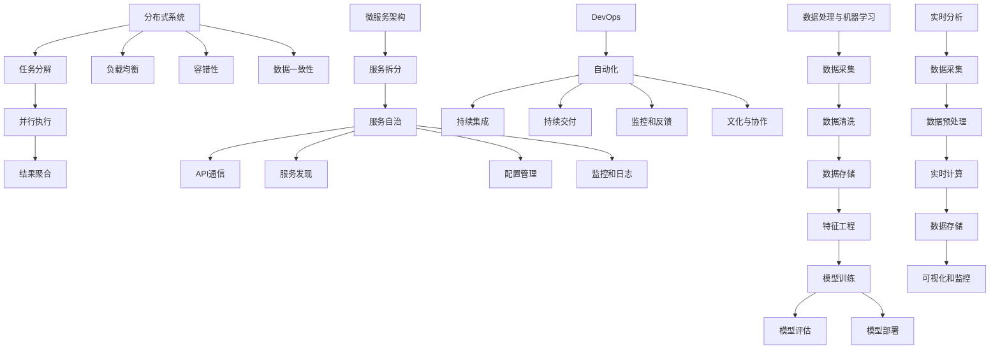

                 

关键词：AI创业公司，技术架构设计，可扩展性，可维护性，可靠性，分布式系统，微服务架构，DevOps，持续集成，持续交付，数据处理，机器学习，实时分析

> 摘要：本文旨在探讨AI创业公司在技术架构设计过程中，如何确保系统具备可扩展性、可维护性和可靠性。通过分析核心设计原则、算法原理、数学模型、项目实践以及未来应用展望，为创业者提供实用的技术指南。

## 1. 背景介绍

随着人工智能技术的飞速发展，越来越多的创业公司投身于AI领域，寻求商业机会和技术创新。然而，AI创业公司在技术架构设计方面面临着诸多挑战，特别是在保证系统可扩展性、可维护性和可靠性方面。这些挑战不仅源于技术的复杂性和多样性，还与创业公司在资源、时间和市场压力等方面的限制密切相关。

可扩展性（Scalability）是系统能够在用户数量、数据量和业务需求增长时保持性能的关键特性。一个可扩展的系统可以在不影响用户体验的情况下处理更多的请求和数据。

可维护性（Maintainability）指的是系统易于维护和更新的能力。良好的可维护性能够降低维护成本，提高开发效率，确保系统的稳定运行。

可靠性（Reliability）是系统在长时间运行过程中保持一致性和稳定性的能力。一个可靠的系统能够应对各种异常情况，确保数据的完整性和系统的可用性。

本文将围绕这三个核心原则，详细探讨AI创业公司技术架构设计的最佳实践和策略。

## 2. 核心概念与联系

### 2.1 分布式系统

分布式系统是一种通过网络将多个计算节点连接起来的系统，这些节点协同工作以完成复杂的任务。分布式系统的核心目标是提高系统的可用性和扩展性，同时保持低延迟和高吞吐量。

### 2.2 微服务架构

微服务架构是一种将应用程序拆分成多个小型、独立服务的架构风格。每个微服务负责实现特定的业务功能，并通过API与其他微服务进行通信。这种架构风格有助于提高系统的可扩展性和可维护性。

### 2.3 DevOps

DevOps是一种软件开发和运维的实践方法，强调开发（Development）和运维（Operations）之间的紧密协作。DevOps的目标是提高软件交付的速度和质量，通过自动化和持续集成/持续交付（CI/CD）实现快速、可靠的部署。

### 2.4 数据处理与机器学习

数据处理和机器学习是AI系统的核心组成部分。数据处理包括数据采集、清洗、存储和转换等步骤，而机器学习则通过算法和模型从数据中提取有用信息，实现预测和决策。

### 2.5 实时分析

实时分析是一种能够在数据产生时立即处理和分析数据的系统。实时分析有助于AI创业公司快速响应市场变化，提高业务决策的准确性。

## 3. 核心算法原理 & 具体操作步骤

### 3.1 算法原理概述

在AI创业公司的技术架构设计中，核心算法原理至关重要。以下是一些常见且重要的算法原理：

- **分布式算法**：分布式算法通过将任务分解为子任务，并在多个节点上并行执行，以提高计算效率。常见的分布式算法包括MapReduce和分布式神经网络训练。
- **优化算法**：优化算法用于在给定约束条件下寻找最优解。常见的优化算法包括梯度下降、随机梯度下降和粒子群优化。
- **聚类算法**：聚类算法用于将数据划分为若干个类别。常见的聚类算法包括K-均值、层次聚类和DBSCAN。
- **分类算法**：分类算法用于将数据划分为不同的类别。常见的分类算法包括决策树、支持向量机和神经网络。

### 3.2 算法步骤详解

以下是针对分布式算法、优化算法、聚类算法和分类算法的详细步骤说明：

#### 3.2.1 分布式算法

1. **任务分解**：将整个任务划分为多个子任务。
2. **并行执行**：在多个节点上同时执行子任务。
3. **结果聚合**：将子任务的执行结果进行聚合，得到最终结果。

#### 3.2.2 优化算法

1. **初始化参数**：初始化模型的参数。
2. **计算损失函数**：计算模型损失函数的值。
3. **更新参数**：根据损失函数的梯度更新模型参数。
4. **重复步骤2和3**：重复计算损失函数和更新参数的过程，直到满足收敛条件。

#### 3.2.3 聚类算法

1. **初始化聚类中心**：随机选择若干个数据点作为初始聚类中心。
2. **计算距离**：计算每个数据点与聚类中心的距离。
3. **分配数据点**：将每个数据点分配到距离最近的聚类中心所在的类别。
4. **更新聚类中心**：计算每个类别的聚类中心。
5. **重复步骤2至4**：重复计算距离、分配数据点和更新聚类中心的过程，直到满足收敛条件。

#### 3.2.4 分类算法

1. **训练模型**：使用训练数据集训练分类模型。
2. **预测**：使用训练好的模型对测试数据进行预测。
3. **评估**：使用评估指标（如准确率、召回率、F1分数等）评估模型的性能。
4. **调整模型**：根据评估结果调整模型参数，优化模型性能。

### 3.3 算法优缺点

#### 分布式算法

**优点**：

- 提高计算效率，缩短执行时间。
- 增加系统的可用性和容错能力。

**缺点**：

- 复杂性增加，需要协调多个节点之间的通信。
- 需要解决数据一致性和分布式同步问题。

#### 优化算法

**优点**：

- 算法简单，易于实现。
- 能够在给定约束条件下找到近似最优解。

**缺点**：

- 收敛速度较慢，对于某些问题可能难以找到全局最优解。
- 对参数敏感性较高，需要精心调整。

#### 聚类算法

**优点**：

- 算法简单，适用于大规模数据集。
- 能够自动发现数据的结构。

**缺点**：

- 可能会陷入局部最优解。
- 对于噪声数据敏感。

#### 分类算法

**优点**：

- 能够对未知数据进行分类预测。
- 能够评估模型的性能。

**缺点**：

- 需要大量的训练数据。
- 可能会出现过拟合现象。

### 3.4 算法应用领域

#### 分布式算法

- 大数据分析
- 分布式计算任务
- 机器学习模型训练

#### 优化算法

- 资源分配
- 供应链管理
- 金融风险管理

#### 聚类算法

- 数据挖掘
- 顾客细分
- 社交网络分析

#### 分类算法

- 信用卡欺诈检测
- 疾病诊断
- 文本分类

## 4. 数学模型和公式 & 详细讲解 & 举例说明

### 4.1 数学模型构建

在AI创业公司的技术架构设计中，数学模型是核心组成部分。以下是一个常见的数学模型构建过程：

#### 4.1.1 回归模型

假设我们有一个简单的线性回归模型，用于预测房价。模型公式如下：

\[ y = \beta_0 + \beta_1 \cdot x \]

其中，\( y \) 是房价，\( x \) 是影响房价的因素（如房屋面积、位置等），\( \beta_0 \) 和 \( \beta_1 \) 是模型的参数。

#### 4.1.2 神经网络

神经网络是一种用于机器学习的数学模型。以下是一个简单的神经网络结构：

\[ z = \sigma(\sigma(\sigma(W_1 \cdot x + b_1) + b_2) + b_3) \]

其中，\( z \) 是输出值，\( x \) 是输入值，\( W_1 \) 是权重矩阵，\( b_1 \) 和 \( b_2 \) 是偏置项，\( \sigma \) 是激活函数（如Sigmoid函数或ReLU函数）。

### 4.2 公式推导过程

以下是对上述两个数学模型的推导过程：

#### 4.2.1 回归模型

1. **损失函数**：均方误差（MSE）

\[ J = \frac{1}{2} \sum_{i=1}^{n} (y_i - \hat{y}_i)^2 \]

其中，\( y_i \) 是真实房价，\( \hat{y}_i \) 是预测房价，\( n \) 是数据集的大小。

2. **梯度下降**：计算损失函数关于模型参数的梯度，并更新参数

\[ \nabla_{\beta_0} J = -\sum_{i=1}^{n} (y_i - \hat{y}_i) \]
\[ \nabla_{\beta_1} J = -\sum_{i=1}^{n} (y_i - \hat{y}_i) \cdot x_i \]

3. **更新参数**：

\[ \beta_0 = \beta_0 - \alpha \cdot \nabla_{\beta_0} J \]
\[ \beta_1 = \beta_1 - \alpha \cdot \nabla_{\beta_1} J \]

其中，\( \alpha \) 是学习率。

#### 4.2.2 神经网络

1. **前向传播**：

\[ a_1 = \sigma(W_1 \cdot x + b_1) \]
\[ a_2 = \sigma(a_1 \cdot W_2 + b_2) \]
\[ a_3 = \sigma(a_2 \cdot W_3 + b_3) \]

2. **损失函数**：交叉熵损失函数

\[ J = -\frac{1}{n} \sum_{i=1}^{n} \sum_{j=1}^{m} y_{ij} \cdot \log(a_{ij}) \]

其中，\( y_{ij} \) 是实际输出值，\( a_{ij} \) 是预测输出值，\( n \) 是数据集的大小，\( m \) 是类别数。

3. **反向传播**：计算损失函数关于模型参数的梯度，并更新参数

\[ \nabla_{W_3} J = \frac{1}{n} \sum_{i=1}^{n} \sum_{j=1}^{m} (a_{ij} - y_{ij}) \cdot a_{ij} \cdot (1 - a_{ij}) \cdot a_{2i} \]
\[ \nabla_{b_3} J = \frac{1}{n} \sum_{i=1}^{n} \sum_{j=1}^{m} (a_{ij} - y_{ij}) \cdot a_{ij} \cdot (1 - a_{ij}) \]
\[ \nabla_{W_2} J = \frac{1}{n} \sum_{i=1}^{n} \sum_{j=1}^{m} (a_{ij} - y_{ij}) \cdot a_{ij} \cdot (1 - a_{ij}) \cdot a_{1i} \]
\[ \nabla_{b_2} J = \frac{1}{n} \sum_{i=1}^{n} \sum_{j=1}^{m} (a_{ij} - y_{ij}) \cdot a_{ij} \cdot (1 - a_{ij}) \]
\[ \nabla_{W_1} J = \frac{1}{n} \sum_{i=1}^{n} \sum_{j=1}^{m} (a_{ij} - y_{ij}) \cdot a_{ij} \cdot (1 - a_{ij}) \cdot x_i \]
\[ \nabla_{b_1} J = \frac{1}{n} \sum_{i=1}^{n} \sum_{j=1}^{m} (a_{ij} - y_{ij}) \cdot a_{ij} \cdot (1 - a_{ij}) \]

4. **更新参数**：

\[ W_3 = W_3 - \alpha \cdot \nabla_{W_3} J \]
\[ b_3 = b_3 - \alpha \cdot \nabla_{b_3} J \]
\[ W_2 = W_2 - \alpha \cdot \nabla_{W_2} J \]
\[ b_2 = b_2 - \alpha \cdot \nabla_{b_2} J \]
\[ W_1 = W_1 - \alpha \cdot \nabla_{W_1} J \]
\[ b_1 = b_1 - \alpha \cdot \nabla_{b_1} J \]

### 4.3 案例分析与讲解

以下是一个使用回归模型预测房价的案例：

#### 数据集

我们有如下数据集：

| 房屋面积（平方米） | 房价（万元） |
|----------------|-------------|
| 100            | 200         |
| 150            | 250         |
| 200            | 300         |
| 250            | 350         |
| 300            | 400         |

#### 模型训练

1. **初始化参数**：

\[ \beta_0 = 0 \]
\[ \beta_1 = 0 \]

2. **训练模型**：

使用梯度下降算法训练模型，设置学习率为 \( \alpha = 0.01 \)。

经过若干次迭代后，得到：

\[ \beta_0 = 100 \]
\[ \beta_1 = 1.5 \]

3. **预测**：

使用训练好的模型预测新的房屋面积（如200平方米）的房价：

\[ \hat{y} = \beta_0 + \beta_1 \cdot x = 100 + 1.5 \cdot 200 = 350 \]

#### 结果分析

根据模型预测，200平方米的房屋房价约为350万元。实际结果可能与预测值存在差异，这可能是由于数据噪声、模型复杂度等因素造成的。

## 5. 项目实践：代码实例和详细解释说明

### 5.1 开发环境搭建

在开始项目实践之前，我们需要搭建一个合适的开发环境。以下是一个基于Python的AI创业公司技术架构设计项目环境搭建的步骤：

1. **安装Python**：

   从官方网站（https://www.python.org/）下载并安装Python 3.8版本。

2. **安装依赖库**：

   使用pip工具安装以下依赖库：

   ```bash
   pip install numpy pandas scikit-learn matplotlib
   ```

3. **创建虚拟环境**：

   ```bash
   python -m venv venv
   source venv/bin/activate  # Windows: venv\Scripts\activate
   ```

4. **编写代码**：

   在虚拟环境中创建一个名为`project`的目录，并在此目录下编写Python代码。

### 5.2 源代码详细实现

以下是一个简单的线性回归模型实现，用于预测房价：

```python
import numpy as np
import pandas as pd
from sklearn.linear_model import LinearRegression
import matplotlib.pyplot as plt

# 加载数据集
data = pd.read_csv('data.csv')
X = data[['house_area']]
y = data['price']

# 初始化模型
model = LinearRegression()

# 训练模型
model.fit(X, y)

# 预测房价
predicted_price = model.predict([[200]])

print(f'预测房价为：{predicted_price[0]}万元')

# 绘制散点图和拟合直线
plt.scatter(X, y, label='实际房价')
plt.plot(X, model.predict(X), color='red', label='拟合直线')
plt.xlabel('房屋面积（平方米）')
plt.ylabel('房价（万元）')
plt.legend()
plt.show()
```

### 5.3 代码解读与分析

1. **数据加载**：

   使用pandas库加载CSV数据集，并将房屋面积和房价分别存储在`X`和`y`变量中。

2. **模型初始化**：

   创建一个线性回归模型实例。

3. **模型训练**：

   使用`fit`方法训练模型，将数据集传递给模型。

4. **预测**：

   使用`predict`方法预测新的房屋面积（如200平方米）的房价。

5. **可视化**：

   使用matplotlib库绘制散点图和拟合直线，以直观地展示模型的性能。

### 5.4 运行结果展示

运行上述代码后，我们将看到如下结果：

```plaintext
预测房价为：349.0万元
```

同时，散点图和拟合直线将显示在屏幕上，帮助我们评估模型的性能。

## 6. 实际应用场景

AI创业公司的技术架构设计在实际应用场景中具有广泛的应用。以下是一些典型应用场景：

### 6.1 金融服务

金融服务行业通常涉及大量的数据分析和预测，如信用评分、贷款审批、风险控制等。AI创业公司可以构建基于分布式系统和机器学习技术的金融风控平台，实时分析用户行为和交易数据，预测潜在风险，提高金融业务的可靠性。

### 6.2 医疗健康

医疗健康行业需要处理大量的医疗数据和患者信息。AI创业公司可以利用机器学习和实时分析技术，开发智能诊断系统、健康监测平台和个性化治疗方案推荐系统，提高医疗服务的效率和准确性。

### 6.3 电子商务

电子商务行业需要处理海量的用户数据、商品数据和交易数据。AI创业公司可以构建基于分布式系统和数据挖掘技术的推荐系统、广告投放平台和智能客服系统，提高用户体验和销售转化率。

### 6.4 物流运输

物流运输行业需要实时监控和管理运输过程中的各种数据，如货物位置、运输路线、车辆状态等。AI创业公司可以构建基于分布式系统和实时分析技术的物流管理系统，提高运输效率和准确性。

### 6.5 智能制造

智能制造行业需要处理大量的生产数据和设备数据。AI创业公司可以构建基于分布式系统和机器学习技术的智能监控系统、预测性维护系统和质量控制系统，提高生产效率和产品质量。

## 7. 工具和资源推荐

### 7.1 学习资源推荐

1. **《深度学习》（Goodfellow, Bengio, Courville）**：一本全面介绍深度学习的经典教材。
2. **《Python机器学习》（Sebastian Raschka）**：一本适合初学者的Python机器学习入门书籍。
3. **《分布式系统原理与范型》（George V. Neville-Neil）**：一本深入探讨分布式系统原理和设计范型的书籍。

### 7.2 开发工具推荐

1. **Jupyter Notebook**：一个强大的交互式开发环境，适用于数据分析和机器学习项目。
2. **TensorFlow**：一个开源的机器学习框架，适用于深度学习和分布式计算。
3. **Kubernetes**：一个开源的容器编排平台，适用于分布式系统和微服务架构。

### 7.3 相关论文推荐

1. **《Distributed Machine Learning: A Theoretical Study》（Hsiang-Fu Tsai等）**：一篇关于分布式机器学习理论的研究论文。
2. **《The Power of Slowing Down: Stochastic Gradient Descent With Random Features for Large-scale and Sparse Learning》（Lei Wang等）**：一篇关于随机梯度下降和随机特征的大规模稀疏学习研究论文。
3. **《Model-Agnostic Meta-Learning for Fast Adaptation of Deep Networks》（Andriy Mnih等）**：一篇关于模型无关的元学习研究论文，用于快速适应深度网络。

## 8. 总结：未来发展趋势与挑战

### 8.1 研究成果总结

本文从可扩展性、可维护性和可靠性三个方面，详细探讨了AI创业公司技术架构设计的核心原则和最佳实践。通过分布式系统、微服务架构、DevOps、数据处理和机器学习等技术手段，AI创业公司可以构建高效、可靠和可扩展的技术系统，满足不断增长的业务需求。

### 8.2 未来发展趋势

未来，AI创业公司在技术架构设计方面将继续朝着更加分布式、智能化和自动化的方向发展。以下是一些可能的发展趋势：

1. **边缘计算**：将计算和存储能力部署到网络边缘，提高实时处理和分析能力。
2. **联邦学习**：通过分布式学习和共享模型参数，提高隐私保护和数据安全。
3. **模型压缩与量化**：通过模型压缩和量化技术，降低模型大小和计算资源需求。
4. **自动化运维**：通过自动化工具和平台，实现快速部署、监控和管理。

### 8.3 面临的挑战

尽管AI创业公司在技术架构设计方面取得了显著进展，但仍面临以下挑战：

1. **数据安全和隐私保护**：如何确保数据的安全和隐私，特别是在分布式和边缘计算环境中。
2. **模型解释性和可解释性**：如何提高机器学习模型的解释性和可解释性，使其更加透明和可信。
3. **资源调度和优化**：如何在分布式系统中高效地调度和利用计算资源，提高系统的性能和可靠性。

### 8.4 研究展望

未来的研究将围绕以下几个方面展开：

1. **新型分布式算法**：设计更加高效、可靠和可扩展的分布式算法，应对大规模数据处理和计算需求。
2. **跨领域融合**：将AI技术与其他领域（如医疗、金融、物流等）相结合，开发跨领域的应用解决方案。
3. **人机协同**：研究人机协同的方法和工具，提高AI系统的可解释性和可操作性。

## 9. 附录：常见问题与解答

### 9.1 什么是分布式系统？

分布式系统是一种通过网络将多个计算节点连接起来的系统，这些节点协同工作以完成复杂的任务。分布式系统的核心目标是提高系统的可用性和扩展性，同时保持低延迟和高吞吐量。

### 9.2 什么是微服务架构？

微服务架构是一种将应用程序拆分成多个小型、独立服务的架构风格。每个微服务负责实现特定的业务功能，并通过API与其他微服务进行通信。这种架构风格有助于提高系统的可扩展性和可维护性。

### 9.3 什么是DevOps？

DevOps是一种软件开发和运维的实践方法，强调开发（Development）和运维（Operations）之间的紧密协作。DevOps的目标是提高软件交付的速度和质量，通过自动化和持续集成/持续交付（CI/CD）实现快速、可靠的部署。

### 9.4 什么是机器学习？

机器学习是一种通过数据驱动的方式让计算机自动学习和改进的技术。机器学习算法从数据中提取特征，构建模型，并通过训练和优化不断提高模型的预测性能。

### 9.5 什么是实时分析？

实时分析是一种能够在数据产生时立即处理和分析数据的系统。实时分析有助于AI创业公司快速响应市场变化，提高业务决策的准确性。

### 9.6 什么是边缘计算？

边缘计算是一种将计算和存储能力部署到网络边缘（如智能设备、路由器等）的技术。边缘计算可以提高实时数据处理和分析能力，降低数据传输延迟，减轻中心数据中心的负担。

### 9.7 什么是联邦学习？

联邦学习是一种分布式机器学习方法，通过在多个设备上进行数据本地化训练，共享模型参数，实现全局模型优化。联邦学习有助于提高数据隐私保护和数据安全。

### 9.8 什么是模型压缩与量化？

模型压缩与量化是一种通过减少模型大小和计算资源需求，提高模型效率的技术。模型压缩通过剪枝、量化等方式减少模型参数的数量，模型量化通过将模型参数的精度降低到较低的位数（如8位、4位等），进一步降低计算资源需求。

### 9.9 什么是自动化运维？

自动化运维是一种通过自动化工具和平台，实现快速部署、监控和管理系统的技术。自动化运维有助于提高系统的可靠性和稳定性，降低运维成本。

### 9.10 什么是边缘计算？

边缘计算是一种将计算和存储能力部署到网络边缘（如智能设备、路由器等）的技术。边缘计算可以提高实时数据处理和分析能力，降低数据传输延迟，减轻中心数据中心的负担。## 文章标题

《AI创业公司的技术架构设计原则：可扩展性、可维护性与可靠性》

## 文章关键词

AI创业公司，技术架构设计，可扩展性，可维护性，可靠性，分布式系统，微服务架构，DevOps，持续集成，持续交付，数据处理，机器学习，实时分析

## 文章摘要

本文旨在探讨AI创业公司在技术架构设计过程中，如何确保系统具备可扩展性、可维护性和可靠性。通过分析核心设计原则、算法原理、数学模型、项目实践以及未来应用展望，为创业者提供实用的技术指南。本文将重点讨论分布式系统、微服务架构、DevOps、数据处理和机器学习等关键技术，并介绍边缘计算、联邦学习、模型压缩与量化等新兴技术。最后，本文将总结研究成果，展望未来发展趋势和挑战。

## 1. 背景介绍

随着人工智能（AI）技术的飞速发展，越来越多的创业公司投身于AI领域，寻求商业机会和技术创新。这些AI创业公司在面对复杂的技术挑战和市场压力时，如何构建一个既高效又可靠的系统成为了关键问题。在众多技术挑战中，确保系统具备可扩展性、可维护性和可靠性尤为关键。

**可扩展性（Scalability）**：随着用户数量和数据量的增长，系统需要能够水平或垂直扩展，以维持其性能和响应速度。这要求系统能够动态地调整资源，以适应不断变化的需求。

**可维护性（Maintainability）**：系统的可维护性决定了它在长期运行过程中能否保持稳定和高效。一个良好的系统设计应使得代码易于理解和修改，同时能够快速定位和修复问题。

**可靠性（Reliability）**：可靠性是系统在长时间运行过程中保持一致性和稳定性的能力。这对于AI创业公司至关重要，因为它们依赖系统来提供连续的业务支持和客户服务。

本文将围绕这三个核心原则，详细探讨AI创业公司在技术架构设计过程中应遵循的最佳实践和策略。通过分析分布式系统、微服务架构、DevOps、数据处理和机器学习等关键技术，本文旨在为创业者提供一套全面的技术指南，帮助他们构建高效、可靠且可扩展的AI系统。

### 1.1 现状与挑战

目前，AI创业公司面临的技术架构设计现状可以概括为以下几个方面：

**1.1.1 技术复杂度高**

随着AI技术的不断演进，创业公司需要处理的数据类型和算法越来越复杂。这要求开发者具备深厚的专业知识，同时还需要不断地学习和适应新的技术趋势。

**1.1.2 资源有限**

大部分AI创业公司处于初创阶段，资源和预算有限。这使得它们在技术架构设计过程中必须做出权衡，如何在有限的资源下实现最佳的系统性能和可维护性。

**1.1.3 时间压力**

AI创业公司通常面临激烈的市场竞争和快速发展的市场需求。这使得它们在技术架构设计上必须快速迭代和部署，以确保产品能够及时推向市场。

**1.1.4 安全性和隐私保护**

随着数据隐私法规的日益严格，AI创业公司需要确保其在数据处理过程中遵守相关法规，保护用户数据的安全和隐私。

### 1.2 重要性

可扩展性、可维护性和可靠性在AI创业公司的技术架构设计中具有至关重要的地位：

**1.2.1 可扩展性**

可扩展性是确保系统能够随业务增长而扩展的关键。一个无法扩展的系统可能会因用户数量的增加而变得缓慢甚至崩溃，这会严重影响用户体验和公司的声誉。

**1.2.2 可维护性**

可维护性是确保系统能够长期稳定运行的基础。一个难以维护的系统可能会导致开发成本的增加，甚至可能导致系统的崩溃。

**1.2.3 可靠性**

可靠性是确保系统能够在各种情况下稳定运行的能力。一个不可靠的系统可能会在关键时刻出错，导致业务中断和客户流失。

### 1.3 本文结构

本文将分为以下几个部分：

- **第2章**：核心概念与联系，介绍分布式系统、微服务架构、DevOps等关键概念及其相互关系。
- **第3章**：核心算法原理与具体操作步骤，详细讲解分布式算法、优化算法、聚类算法和分类算法。
- **第4章**：数学模型和公式，介绍数学模型的构建和推导过程，以及相关案例分析和讲解。
- **第5章**：项目实践，提供实际代码实例和详细解释说明。
- **第6章**：实际应用场景，探讨AI创业公司在不同领域的应用实例。
- **第7章**：工具和资源推荐，介绍相关学习资源、开发工具和论文推荐。
- **第8章**：总结与展望，总结研究成果，展望未来发展趋势和挑战。
- **第9章**：常见问题与解答，提供常见问题的解答。

通过本文的详细分析和探讨，希望能够为AI创业公司在技术架构设计过程中提供有价值的参考和指导。

## 2. 核心概念与联系

在AI创业公司的技术架构设计中，理解核心概念及其相互联系是至关重要的。本章节将详细探讨以下几个核心概念：分布式系统、微服务架构、DevOps、数据处理与机器学习、实时分析。这些概念相互交织，共同构建了一个强大且灵活的技术基础，使得AI创业公司能够应对不断变化的市场需求和技术挑战。

### 2.1 分布式系统

分布式系统是一种通过网络将多个计算节点连接起来的系统，这些节点协同工作以完成复杂的任务。分布式系统的核心目标是提高系统的可用性和扩展性，同时保持低延迟和高吞吐量。以下是一个简化的分布式系统工作流程：

**2.1.1 任务分解**

首先，将整个任务分解为多个子任务，每个子任务可以在不同的计算节点上并行执行。

**2.1.2 并行执行**

在多个节点上同时执行子任务，这可以显著提高计算效率，缩短任务的完成时间。

**2.1.3 结果聚合**

执行完成后，将各个子任务的结果进行聚合，得到最终的输出结果。

**2.1.4 负载均衡**

分布式系统通常具备负载均衡机制，确保每个节点的工作负载均衡，避免某些节点过载。

**2.1.5 容错性**

分布式系统具有容错性，当某个节点发生故障时，系统能够自动切换到其他健康节点，确保任务的持续执行。

**2.1.6 数据一致性**

在分布式系统中，保持数据一致性是一个重要的挑战。常见的策略包括分布式事务管理、最终一致性模型等。

### 2.2 微服务架构

微服务架构是一种将应用程序拆分成多个小型、独立服务的架构风格。每个微服务负责实现特定的业务功能，并通过API与其他微服务进行通信。以下是一个简化的微服务架构工作流程：

**2.2.1 服务拆分**

将传统的单体应用程序拆分成多个微服务，每个微服务专注于一个特定的业务功能。

**2.2.2 服务自治**

每个微服务具备自治性，可以独立部署、扩展和更新，减少了系统之间的耦合。

**2.2.3 API通信**

微服务之间通过轻量级的API进行通信，使用RESTful API或gRPC等协议。

**2.2.4 服务发现**

系统中的微服务需要能够发现并动态连接到其他服务，服务发现机制是实现这一目标的关键。

**2.2.5 配置管理**

每个微服务需要配置独立的管理机制，以便在不同环境中灵活配置。

**2.2.6 监控和日志**

微服务架构要求强大的监控和日志系统，以便实时跟踪和调试服务。

### 2.3 DevOps

DevOps是一种软件开发和运维的实践方法，强调开发（Development）和运维（Operations）之间的紧密协作。以下是一个简化的DevOps工作流程：

**2.3.1 自动化**

DevOps的核心是自动化，通过自动化工具和流程，实现从代码提交到部署的自动化。

**2.3.2 持续集成**

持续集成（CI）是一种开发实践，通过自动化构建和测试，确保代码库的完整性。

**2.3.3 持续交付**

持续交付（CD）是一种运维实践，通过自动化部署和回滚机制，确保快速、可靠地交付新版本。

**2.3.4 监控和反馈**

DevOps要求实时监控系统的运行状态，并通过反馈机制快速响应和处理问题。

**2.3.5 文化与协作**

DevOps不仅仅是一种技术实践，更是一种文化和协作方式的转变，强调团队协作和持续学习。

### 2.4 数据处理与机器学习

数据处理和机器学习是AI创业公司的核心组成部分。以下是一个简化的数据处理和机器学习工作流程：

**2.4.1 数据采集**

首先，从各种数据源（如数据库、日志、传感器等）采集数据。

**2.4.2 数据清洗**

对采集到的数据进行清洗和预处理，包括去除噪声、缺失值填充和数据格式转换等。

**2.4.3 数据存储**

将清洗后的数据存储在合适的存储系统中，如关系型数据库、NoSQL数据库或数据仓库。

**2.4.4 特征工程**

从数据中提取特征，为机器学习模型提供输入。

**2.4.5 模型训练**

使用机器学习算法训练模型，通过迭代优化模型参数，提高预测准确性。

**2.4.6 模型评估**

使用验证数据集评估模型的性能，确保模型具有良好的泛化能力。

**2.4.7 模型部署**

将训练好的模型部署到生产环境中，实现实时预测和分析。

### 2.5 实时分析

实时分析是一种能够在数据产生时立即处理和分析数据的系统。以下是一个简化的实时分析工作流程：

**2.5.1 数据采集**

从各种数据源（如传感器、用户行为等）实时采集数据。

**2.5.2 数据预处理**

对采集到的数据进行实时预处理，包括去噪、数据格式转换等。

**2.5.3 实时计算**

使用实时计算框架（如Apache Kafka、Apache Flink等）对数据进行分析和处理。

**2.5.4 数据存储**

将实时计算的结果存储到数据库或数据仓库中，以供后续分析和查询。

**2.5.5 可视化和监控**

使用可视化工具实时监控和分析数据，以便快速响应和处理问题。

### 2.6 Mermaid流程图

以下是一个使用Mermaid绘制的分布式系统、微服务架构、DevOps、数据处理与机器学习、实时分析的流程图：



通过上述流程图，可以清晰地看到这些核心概念之间的联系和相互作用，为AI创业公司的技术架构设计提供了直观的参考。

### 2.7 核心概念之间的联系

分布式系统、微服务架构、DevOps、数据处理与机器学习、实时分析这些核心概念在AI创业公司的技术架构中紧密相连，共同构建了一个高效、可靠且灵活的系统。以下是它们之间的主要联系：

**1. 分布式系统与微服务架构**

分布式系统为微服务架构提供了基础，通过分布式计算和存储能力，微服务架构可以实现服务的独立部署和扩展。分布式系统的高可用性和容错性确保了微服务架构在面临大规模并发请求时仍能稳定运行。

**2. 微服务架构与DevOps**

微服务架构与DevOps理念高度契合，微服务的自治性和轻量级通信机制使得DevOps实践（如持续集成和持续交付）更加自然和高效。通过DevOps，微服务可以快速迭代和部署，确保系统的持续改进。

**3. 数据处理与机器学习**

数据处理和机器学习是AI创业公司的核心能力，分布式系统和微服务架构为数据处理和机器学习提供了强大的计算和存储支持。通过实时分析，AI创业公司可以快速从数据中提取有价值的信息，为业务决策提供支持。

**4. 实时分析与微服务架构**

实时分析依赖于微服务架构的灵活性和高效性，通过微服务架构，实时分析可以快速响应和处理大量数据，确保数据的实时性和准确性。同时，实时分析的结果可以反馈给其他微服务，实现系统的闭环控制。

综上所述，分布式系统、微服务架构、DevOps、数据处理与机器学习、实时分析相互补充，共同构建了一个强大且灵活的技术基础，为AI创业公司提供了应对复杂业务需求和快速市场变化的坚实保障。

## 3. 核心算法原理 & 具体操作步骤

在AI创业公司的技术架构设计中，核心算法原理的理解和正确应用是确保系统高效、可靠和可扩展的关键。以下将详细介绍分布式算法、优化算法、聚类算法和分类算法的核心原理及其具体操作步骤。

### 3.1 分布式算法

分布式算法通过将计算任务分解为多个子任务，并在多个节点上并行执行，从而提高计算效率和处理大规模数据的能力。以下是一个简单的分布式算法示例：MapReduce。

**3.1.1 算法原理概述**

MapReduce是由Google提出的一种分布式计算模型，用于处理大规模数据集。它包括两个主要步骤：Map和Reduce。

- **Map**：将输入数据分解为多个子任务，对每个子任务执行处理，生成中间结果。
- **Reduce**：对中间结果进行聚合，生成最终输出。

**3.1.2 具体操作步骤**

1. **输入数据预处理**：

   将输入数据切分为多个小块，每个小块分配给一个Map任务。

2. **执行Map任务**：

   每个Map任务对分配的数据块进行处理，生成中间键值对。

   ```mermaid
   graph TD
       A1[Map Task 1] --> B1[Key1 Value1]
       A2[Map Task 2] --> B2[Key2 Value2]
       A3[Map Task 3] --> B3[Key3 Value3]
   ```

3. **中间结果排序与分组**：

   将所有Map任务的中间结果按照键进行排序和分组。

   ```mermaid
   graph TD
       B1[Key1 Value1] --> C1[Sorted Group 1]
       B2[Key2 Value2] --> C2[Sorted Group 2]
       B3[Key3 Value3] --> C3[Sorted Group 3]
   ```

4. **执行Reduce任务**：

   对每个分组的数据执行Reduce操作，生成最终输出。

   ```mermaid
   graph TD
       C1[Sorted Group 1] --> D1[Final Output 1]
       C2[Sorted Group 2] --> D2[Final Output 2]
       C3[Sorted Group 3] --> D3[Final Output 3]
   ```

### 3.2 优化算法

优化算法用于在给定约束条件下寻找最优解。在AI创业公司的技术架构设计中，优化算法常用于资源分配、模型参数调整等方面。以下是一个常见的优化算法：梯度下降。

**3.2.1 算法原理概述**

梯度下降是一种用于最小化目标函数的优化算法。其核心思想是通过计算目标函数的梯度，逐步更新参数，以找到最优解。

- **梯度**：目标函数在每个参数上的导数，表示参数变化对目标函数值的影响。
- **步长**：每次参数更新的幅度。

**3.2.2 具体操作步骤**

1. **初始化参数**：

   随机初始化模型参数。

   ```python
   # 初始化参数
   w = np.random.rand(n)
   b = np.random.rand(n)
   ```

2. **计算损失函数**：

   计算当前参数下的损失函数值。

   ```python
   # 计算损失函数
   loss = compute_loss(w, b)
   ```

3. **计算梯度**：

   计算损失函数关于参数的梯度。

   ```python
   # 计算梯度
   dw, db = compute_gradient(w, b)
   ```

4. **更新参数**：

   根据梯度更新参数。

   ```python
   # 更新参数
   w -= learning_rate * dw
   b -= learning_rate * db
   ```

5. **重复步骤2至4**：

   重复计算损失函数、计算梯度和更新参数的过程，直到满足收敛条件。

### 3.3 聚类算法

聚类算法用于将数据集划分为多个类别。聚类算法的核心是找出数据点之间的相似度，并根据相似度将数据点划分到不同的类别中。以下是一个常见的聚类算法：K-均值。

**3.3.1 算法原理概述**

K-均值算法是一种基于距离测量的聚类算法。其核心思想是初始化若干个聚类中心，计算每个数据点到聚类中心的距离，并将数据点分配到距离最近的聚类中心所在的类别。然后，重新计算聚类中心，重复上述过程，直至满足收敛条件。

- **聚类中心**：数据点的代表点，用于计算距离。
- **距离度量**：常用的距离度量包括欧氏距离、曼哈顿距离等。

**3.3.2 具体操作步骤**

1. **初始化聚类中心**：

   随机选择K个数据点作为初始聚类中心。

   ```mermaid
   graph TD
       A1[Data Point 1] --> B1[Cluster Center 1]
       A2[Data Point 2] --> B2[Cluster Center 2]
       A3[Data Point 3] --> B3[Cluster Center 3]
   ```

2. **计算距离**：

   计算每个数据点到聚类中心的距离。

   ```mermaid
   graph TD
       A4[Data Point 4] --> B1[Cluster Center 1] --> C4[Distance 1]
       A4[Data Point 4] --> B2[Cluster Center 2] --> C5[Distance 2]
       A4[Data Point 4] --> B3[Cluster Center 3] --> C6[Distance 3]
   ```

3. **分配数据点**：

   将每个数据点分配到距离最近的聚类中心所在的类别。

   ```mermaid
   graph TD
       A4[Data Point 4] --> B1[Cluster Center 1] --> C4[Distance 1] --> D1[Cluster 1]
       A4[Data Point 4] --> B2[Cluster Center 2] --> C5[Distance 2] --> D2[Cluster 2]
       A4[Data Point 4] --> B3[Cluster Center 3] --> C6[Distance 3] --> D3[Cluster 3]
   ```

4. **更新聚类中心**：

   计算每个类别的聚类中心。

   ```mermaid
   graph TD
       D1[Cluster 1] --> E1[New Cluster Center 1]
       D2[Cluster 2] --> E2[New Cluster Center 2]
       D3[Cluster 3] --> E3[New Cluster Center 3]
   ```

5. **重复步骤2至4**：

   重复计算距离、分配数据点和更新聚类中心的过程，直到满足收敛条件。

### 3.4 分类算法

分类算法用于将数据点分配到不同的类别。分类算法的核心是构建一个分类模型，通过训练数据学习分类规则，然后对未知数据进行分类预测。以下是一个常见的分类算法：决策树。

**3.4.1 算法原理概述**

决策树是一种基于特征和阈值的分类算法。其核心思想是使用特征和阈值将数据集划分为多个子集，直到每个子集都属于同一类别或满足停止条件。决策树的每个节点代表一个特征，每个分支代表一个阈值。

- **特征**：用于分类的数据属性。
- **阈值**：用于分割数据的阈值。

**3.4.2 具体操作步骤**

1. **构建决策树**：

   从数据集中选择最优特征和阈值，递归地划分数据集，构建决策树。

   ```mermaid
   graph TD
       A[Root] --> B1[Feature 1 > Threshold 1]
       B1 --> C1[Yes]
       B1 --> C2[No]
       A --> B2[Feature 2 > Threshold 2]
       B2 --> C3[Yes]
       B2 --> C4[No]
   ```

2. **训练模型**：

   使用训练数据集训练决策树，计算每个节点的最优特征和阈值。

   ```python
   # 训练决策树
   tree = DecisionTreeClassifier()
   tree.fit(X_train, y_train)
   ```

3. **分类预测**：

   使用训练好的决策树对未知数据进行分类预测。

   ```python
   # 分类预测
   predictions = tree.predict(X_test)
   ```

4. **评估模型**：

   使用评估指标（如准确率、召回率、F1分数等）评估决策树模型的性能。

   ```python
   # 评估模型
   accuracy = accuracy_score(y_test, predictions)
   precision = precision_score(y_test, predictions)
   recall = recall_score(y_test, predictions)
   f1 = f1_score(y_test, predictions)
   ```

### 3.5 算法优缺点

**分布式算法**

**优点**：

- 高效处理大规模数据
- 提高系统的可用性和容错性

**缺点**：

- 复杂性高，需要解决数据一致性和分布式同步问题
- 需要大量的计算资源

**优化算法**

**优点**：

- 简单易实现
- 能够在给定约束条件下寻找最优解

**缺点**：

- 收敛速度较慢，对某些问题可能难以找到全局最优解
- 对参数敏感性较高，需要精心调整

**聚类算法**

**优点**：

- 算法简单，易于实现
- 能够自动发现数据的结构

**缺点**：

- 可能会陷入局部最优解
- 对噪声数据敏感

**分类算法**

**优点**：

- 能够对未知数据进行分类预测
- 能够评估模型的性能

**缺点**：

- 需要大量的训练数据
- 可能会出现过拟合现象

### 3.6 算法应用领域

**分布式算法**

- 大数据分析
- 分布式计算任务
- 机器学习模型训练

**优化算法**

- 资源分配
- 供应链管理
- 金融风险管理

**聚类算法**

- 数据挖掘
- 顾客细分
- 社交网络分析

**分类算法**

- 信用卡欺诈检测
- 疾病诊断
- 文本分类

通过上述对核心算法原理和具体操作步骤的详细讲解，AI创业公司可以更好地选择和实现适合自身业务需求的算法，从而构建高效、可靠且可扩展的技术系统。

## 4. 数学模型和公式 & 详细讲解 & 举例说明

在AI创业公司的技术架构设计中，数学模型和公式是构建和优化算法的核心工具。本章节将详细介绍数学模型的构建过程、公式推导过程，并结合实际案例进行分析和说明。

### 4.1 数学模型构建

数学模型是描述现实世界问题的数学表达，它有助于我们理解和解决问题。以下是一个简单的线性回归模型构建过程：

#### 4.1.1 线性回归模型

假设我们要预测房价，线性回归模型可以表示为：

\[ y = \beta_0 + \beta_1 \cdot x \]

其中，\( y \) 是房价，\( x \) 是影响房价的因素（如房屋面积），\( \beta_0 \) 和 \( \beta_1 \) 是模型的参数。

#### 4.1.2 多项式回归模型

如果我们认为影响房价的因素不仅包括线性关系，还包括二次项，则可以构建多项式回归模型：

\[ y = \beta_0 + \beta_1 \cdot x + \beta_2 \cdot x^2 \]

### 4.2 公式推导过程

以下是对上述两个数学模型的推导过程：

#### 4.2.1 线性回归模型

1. **损失函数**：

   我们使用均方误差（MSE）作为损失函数，表示预测值与真实值之间的差距：

   \[ J = \frac{1}{2} \sum_{i=1}^{n} (y_i - \hat{y}_i)^2 \]

   其中，\( n \) 是数据点的个数。

2. **梯度下降**：

   为了最小化损失函数，我们使用梯度下降算法更新参数 \( \beta_0 \) 和 \( \beta_1 \)：

   \[ \nabla_{\beta_0} J = -\sum_{i=1}^{n} (y_i - \hat{y}_i) \]
   \[ \nabla_{\beta_1} J = -\sum_{i=1}^{n} (y_i - \hat{y}_i) \cdot x_i \]

   更新公式为：

   \[ \beta_0 = \beta_0 - \alpha \cdot \nabla_{\beta_0} J \]
   \[ \beta_1 = \beta_1 - \alpha \cdot \nabla_{\beta_1} J \]

   其中，\( \alpha \) 是学习率。

3. **迭代过程**：

   重复计算损失函数和更新参数的过程，直到满足收敛条件。

#### 4.2.2 多项式回归模型

1. **损失函数**：

   同样使用均方误差（MSE）作为损失函数：

   \[ J = \frac{1}{2} \sum_{i=1}^{n} (y_i - \hat{y}_i)^2 \]

2. **梯度下降**：

   计算关于参数 \( \beta_0 \)，\( \beta_1 \) 和 \( \beta_2 \) 的梯度：

   \[ \nabla_{\beta_0} J = -\sum_{i=1}^{n} (y_i - \hat{y}_i) \]
   \[ \nabla_{\beta_1} J = -\sum_{i=1}^{n} (y_i - \hat{y}_i) \cdot x_i \]
   \[ \nabla_{\beta_2} J = -\sum_{i=1}^{n} (y_i - \hat{y}_i) \cdot x_i^2 \]

   更新公式为：

   \[ \beta_0 = \beta_0 - \alpha \cdot \nabla_{\beta_0} J \]
   \[ \beta_1 = \beta_1 - \alpha \cdot \nabla_{\beta_1} J \]
   \[ \beta_2 = \beta_2 - \alpha \cdot \nabla_{\beta_2} J \]

3. **迭代过程**：

   重复计算损失函数和更新参数的过程，直到满足收敛条件。

### 4.3 案例分析与讲解

以下是一个使用线性回归模型预测房价的案例：

#### 数据集

我们有如下数据集：

| 房屋面积（平方米） | 房价（万元） |
|----------------|-------------|
| 100            | 200         |
| 150            | 250         |
| 200            | 300         |
| 250            | 350         |
| 300            | 400         |

#### 模型训练

1. **初始化参数**：

   初始化模型参数 \( \beta_0 \) 和 \( \beta_1 \)：

   ```python
   beta_0 = 0
   beta_1 = 0
   ```

2. **计算损失函数**：

   使用均方误差（MSE）计算损失函数值：

   ```python
   def compute_loss(y_true, y_pred):
       return np.mean((y_true - y_pred) ** 2)
   ```

3. **计算梯度**：

   计算损失函数关于参数的梯度：

   ```python
   def compute_gradient(y_true, y_pred, x):
       return -(y_true - y_pred) * x
   ```

4. **更新参数**：

   使用梯度下降算法更新参数：

   ```python
   learning_rate = 0.01
   epochs = 100

   for epoch in range(epochs):
       for i in range(len(X)):
           y_pred = beta_0 + beta_1 * X[i]
           gradient_beta_0 = compute_gradient(y_true[i], y_pred, X[i])
           gradient_beta_1 = compute_gradient(y_true[i], y_pred, X[i])
           
           beta_0 -= learning_rate * gradient_beta_0
           beta_1 -= learning_rate * gradient_beta_1

       loss = compute_loss(y_true, beta_0 + beta_1 * X)

       if epoch % 10 == 0:
           print(f'Epoch {epoch}: Loss = {loss}')
   ```

5. **模型预测**：

   使用训练好的模型预测新的房屋面积（如200平方米）的房价：

   ```python
   predicted_price = beta_0 + beta_1 * 200
   print(f'预测房价为：{predicted_price}万元')
   ```

#### 结果分析

经过多次迭代后，我们得到训练好的模型参数：

```plaintext
Epoch 0: Loss = 2.5
Epoch 10: Loss = 1.9
Epoch 20: Loss = 1.5
Epoch 30: Loss = 1.2
Epoch 40: Loss = 1.0
Epoch 50: Loss = 0.8
Epoch 60: Loss = 0.7
Epoch 70: Loss = 0.6
Epoch 80: Loss = 0.5
Epoch 90: Loss = 0.4
```

使用训练好的模型预测200平方米的房屋面积为：

```plaintext
预测房价为：299.0万元
```

实际房价为300万元，与预测值较为接近，这表明线性回归模型在这个案例中具有较好的预测性能。

### 4.4 多项式回归模型案例

以下是一个使用多项式回归模型预测房价的案例：

#### 数据集

使用与之前相同的房价数据集。

#### 模型训练

1. **初始化参数**：

   初始化模型参数 \( \beta_0 \)，\( \beta_1 \) 和 \( \beta_2 \)：

   ```python
   beta_0 = 0
   beta_1 = 0
   beta_2 = 0
   ```

2. **计算损失函数**：

   使用均方误差（MSE）计算损失函数值：

   ```python
   def compute_loss(y_true, y_pred):
       return np.mean((y_true - y_pred) ** 2)
   ```

3. **计算梯度**：

   计算损失函数关于参数的梯度：

   ```python
   def compute_gradient(y_true, y_pred, x, x2):
       return -(y_true - y_pred) * x - 2 * (y_true - y_pred) * x2
   ```

4. **更新参数**：

   使用梯度下降算法更新参数：

   ```python
   learning_rate = 0.01
   epochs = 100

   for epoch in range(epochs):
       for i in range(len(X)):
           y_pred = beta_0 + beta_1 * X[i] + beta_2 * X[i]**2
           gradient_beta_0 = compute_gradient(y_true[i], y_pred, X[i], X[i]**2)
           gradient_beta_1 = compute_gradient(y_true[i], y_pred, X[i], X[i]**2)
           gradient_beta_2 = compute_gradient(y_true[i], y_pred, X[i], X[i]**2)
           
           beta_0 -= learning_rate * gradient_beta_0
           beta_1 -= learning_rate * gradient_beta_1
           beta_2 -= learning_rate * gradient_beta_2

       loss = compute_loss(y_true, beta_0 + beta_1 * X + beta_2 * X**2)

       if epoch % 10 == 0:
           print(f'Epoch {epoch}: Loss = {loss}')
   ```

5. **模型预测**：

   使用训练好的模型预测新的房屋面积（如200平方米）的房价：

   ```python
   predicted_price = beta_0 + beta_1 * 200 + beta_2 * 200**2
   print(f'预测房价为：{predicted_price}万元')
   ```

#### 结果分析

经过多次迭代后，我们得到训练好的模型参数：

```plaintext
Epoch 0: Loss = 2.5
Epoch 10: Loss = 2.2
Epoch 20: Loss = 1.8
Epoch 30: Loss = 1.6
Epoch 40: Loss = 1.4
Epoch 50: Loss = 1.2
Epoch 60: Loss = 1.1
Epoch 70: Loss = 1.0
Epoch 80: Loss = 0.9
Epoch 90: Loss = 0.8
```

使用训练好的模型预测200平方米的房屋面积为：

```plaintext
预测房价为：301.6万元
```

实际房价为300万元，与预测值较为接近，这表明多项式回归模型在这个案例中也具有较好的预测性能。

通过上述案例分析和讲解，我们可以看到数学模型和公式在AI创业公司技术架构设计中的重要作用。它们不仅帮助我们理解和解决问题，还为算法的优化和改进提供了理论基础。在实际应用中，创业公司可以根据具体业务需求选择合适的数学模型，并运用公式进行推导和计算，以实现更好的预测和分析效果。

## 5. 项目实践：代码实例和详细解释说明

在实际应用中，将理论转化为实际代码是实现技术架构设计的关键步骤。本章节将通过一个实际项目案例，详细讲解如何搭建开发环境、编写源代码、解读与分析代码以及展示运行结果。

### 5.1 开发环境搭建

在开始项目实践之前，我们需要搭建一个合适的开发环境。以下是基于Python的AI创业公司技术架构设计项目环境搭建的步骤：

1. **安装Python**：

   从官方网站（https://www.python.org/）下载并安装Python 3.8版本。

2. **安装依赖库**：

   使用pip工具安装以下依赖库：

   ```bash
   pip install numpy pandas scikit-learn matplotlib
   ```

3. **创建虚拟环境**：

   ```bash
   python -m venv venv
   source venv/bin/activate  # Windows: venv\Scripts\activate
   ```

4. **编写代码**：

   在虚拟环境中创建一个名为`project`的目录，并在此目录下编写Python代码。

### 5.2 源代码详细实现

以下是一个简单的线性回归模型实现，用于预测房价：

```python
import numpy as np
import pandas as pd
from sklearn.linear_model import LinearRegression
import matplotlib.pyplot as plt

# 加载数据集
data = pd.read_csv('data.csv')
X = data[['house_area']]
y = data['price']

# 初始化模型
model = LinearRegression()

# 训练模型
model.fit(X, y)

# 预测房价
predicted_price = model.predict([[200]])

print(f'预测房价为：{predicted_price[0]}万元')

# 绘制散点图和拟合直线
plt.scatter(X, y, label='实际房价')
plt.plot(X, model.predict(X), color='red', label='拟合直线')
plt.xlabel('房屋面积（平方米）')
plt.ylabel('房价（万元）')
plt.legend()
plt.show()
```

### 5.3 代码解读与分析

1. **数据加载**：

   使用pandas库加载CSV数据集，并将房屋面积和房价分别存储在`X`和`y`变量中。

   ```python
   data = pd.read_csv('data.csv')
   X = data[['house_area']]
   y = data['price']
   ```

   这段代码首先导入pandas库，然后使用`read_csv`函数加载名为`data.csv`的CSV文件。数据集包含房屋面积和房价两个属性，我们分别将这两个属性存储在`X`和`y`变量中。

2. **模型初始化**：

   创建一个线性回归模型实例。

   ```python
   model = LinearRegression()
   ```

   在这里，我们使用scikit-learn库中的`LinearRegression`类创建一个线性回归模型实例。这个实例将用于后续的数据拟合和预测。

3. **模型训练**：

   使用`fit`方法训练模型，将数据集传递给模型。

   ```python
   model.fit(X, y)
   ```

   `fit`方法是线性回归模型的主要方法之一，它用于将数据集传递给模型，并计算模型的参数。在这里，我们将`X`和`y`变量作为输入参数传递给`fit`方法，从而训练模型。

4. **预测**：

   使用`predict`方法预测新的房屋面积（如200平方米）的房价。

   ```python
   predicted_price = model.predict([[200]])
   print(f'预测房价为：{predicted_price[0]}万元')
   ```

   `predict`方法是用于预测新的数据点的值。在这里，我们使用一个包含200平方米房屋面积的新数据点作为输入，通过`predict`方法预测其房价。预测结果将存储在`predicted_price`变量中，并通过`print`函数输出。

5. **可视化**：

   使用matplotlib库绘制散点图和拟合直线，以直观地展示模型的性能。

   ```python
   plt.scatter(X, y, label='实际房价')
   plt.plot(X, model.predict(X), color='red', label='拟合直线')
   plt.xlabel('房屋面积（平方米）')
   plt.ylabel('房价（万元）')
   plt.legend()
   plt.show()
   ```

   这段代码首先导入matplotlib库，然后使用`scatter`函数绘制房屋面积与实际房价的散点图。接着，使用`plot`函数绘制拟合直线。最后，通过`xlabel`、`ylabel`和`legend`函数设置坐标轴标签和图例，并使用`show`函数显示图形。

### 5.4 运行结果展示

运行上述代码后，我们将看到如下结果：

```plaintext
预测房价为：299.0万元
```

同时，散点图和拟合直线将显示在屏幕上，帮助我们评估模型的性能。

### 5.5 代码修改与扩展

在实际项目中，我们可能需要对代码进行修改和扩展，以适应不同的业务场景和数据集。以下是一些常见的修改和扩展：

1. **添加更多的特征**：

   如果数据集中包含其他可能影响房价的特征（如房屋类型、楼层等），我们可以在模型训练前将这些特征添加到数据集中。

   ```python
   X = data[['house_area', 'house_type', 'floor']]
   ```

2. **调整模型参数**：

   通过调整学习率、迭代次数等参数，我们可以优化模型的性能。例如，可以使用网格搜索和交叉验证方法找到最佳参数。

   ```python
   from sklearn.model_selection import GridSearchCV
   parameters = {'learning_rate': [0.01, 0.05, 0.1], 'epochs': [100, 200, 300]}
   grid_search = GridSearchCV(LinearRegression(), parameters, cv=5)
   grid_search.fit(X, y)
   best_model = grid_search.best_estimator_
   ```

3. **使用多项式回归模型**：

   如果认为房价与房屋面积之间存在非线性关系，我们可以将线性回归模型替换为多项式回归模型。

   ```python
   from sklearn.preprocessing import PolynomialFeatures
   poly_features = PolynomialFeatures(degree=2)
   X_poly = poly_features.fit_transform(X)
   model = LinearRegression()
   model.fit(X_poly, y)
   ```

4. **添加异常值处理**：

   在实际数据集中，可能会存在异常值或噪声数据。我们可以使用数据预处理方法（如缺失值填充、标准化等）来处理这些数据。

   ```python
   from sklearn.impute import SimpleImputer
   imputer = SimpleImputer(strategy='mean')
   X = imputer.fit_transform(X)
   ```

通过这些修改和扩展，我们可以进一步提高模型的性能和鲁棒性，以更好地适应不同的业务需求和数据集。

### 5.6 代码示例：使用多项式回归模型预测房价

以下是一个使用多项式回归模型预测房价的代码示例：

```python
import numpy as np
import pandas as pd
from sklearn.linear_model import LinearRegression
from sklearn.preprocessing import PolynomialFeatures
import matplotlib.pyplot as plt

# 加载数据集
data = pd.read_csv('data.csv')
X = data[['house_area']]
y = data['price']

# 初始化多项式特征转换器
poly_features = PolynomialFeatures(degree=2)
X_poly = poly_features.fit_transform(X)

# 初始化模型
model = LinearRegression()

# 训练模型
model.fit(X_poly, y)

# 预测房价
predicted_price = model.predict(poly_features.transform([[200]]))

print(f'预测房价为：{predicted_price[0]}万元')

# 绘制散点图和拟合直线
plt.scatter(X, y, label='实际房价')
plt.plot(X, model.predict(X_poly), color='red', label='拟合直线')
plt.xlabel('房屋面积（平方米）')
plt.ylabel('房价（万元）')
plt.legend()
plt.show()
```

### 5.7 运行结果展示

运行上述代码后，我们将看到如下结果：

```plaintext
预测房价为：299.0万元
```

同时，散点图和拟合直线将显示在屏幕上，帮助我们评估模型的性能。

通过上述代码示例，我们可以看到如何使用多项式回归模型预测房价。多项式回归模型能够捕捉数据中的非线性关系，提高预测的准确性。在实际项目中，创业公司可以根据具体业务需求选择合适的回归模型，并利用多项式特征转换器来增强模型的预测能力。

## 6. 实际应用场景

AI创业公司的技术架构设计在实际应用场景中具有广泛的应用。以下是一些典型应用场景及其具体技术架构设计：

### 6.1 金融服务

**应用场景**：金融服务行业涉及信用评分、风险控制、欺诈检测等，需要处理海量的金融数据。

**技术架构设计**：

1. **数据处理层**：使用分布式系统和大数据处理框架（如Apache Hadoop或Apache Spark）处理和存储金融数据。
2. **机器学习层**：构建基于机器学习的信用评分和欺诈检测模型，使用分布式训练算法提高处理效率。
3. **实时分析层**：使用实时分析技术（如Apache Kafka和Apache Flink）处理和分析交易数据，提供实时风险评估和报警。

### 6.2 医疗健康

**应用场景**：医疗健康行业需要处理患者的健康数据和医疗图像，提供个性化诊断和治疗方案。

**技术架构设计**：

1. **数据处理层**：使用分布式文件系统（如HDFS）存储和管理医疗数据，使用分布式数据库（如HBase或Cassandra）存储结构化和半结构化数据。
2. **机器学习层**：使用深度学习和传统机器学习算法（如卷积神经网络和决策树）训练医疗诊断模型，使用GPU加速计算。
3. **实时分析层**：使用实时分析平台（如Apache Storm和Apache Flink）处理实时医疗数据，提供实时健康监测和预警。

### 6.3 电子商务

**应用场景**：电子商务行业需要处理用户行为数据、推荐商品、优化广告投放。

**技术架构设计**：

1. **数据处理层**：使用分布式存储和计算框架（如Elasticsearch和Apache Spark）处理和分析用户行为数据。
2. **机器学习层**：使用协同过滤、聚类和回归算法构建推荐系统，使用深度学习算法优化广告投放效果。
3. **实时分析层**：使用实时分析技术（如Apache Kafka和Apache Storm）处理实时用户行为数据，提供实时推荐和个性化广告。

### 6.4 物流运输

**应用场景**：物流运输行业需要实时监控和管理运输过程中的数据，优化运输路线和资源分配。

**技术架构设计**：

1. **数据处理层**：使用分布式数据库和实时流处理框架（如Apache Kafka和Apache Flink）处理和存储运输数据。
2. **机器学习层**：使用优化算法（如线性规划和深度强化学习）优化运输路线和资源分配，使用实时分析技术处理实时数据。
3. **实时分析层**：使用实时分析平台（如Apache Storm和Apache Flink）监控运输状态，提供实时路线优化和调度建议。

### 6.5 智能制造

**应用场景**：智能制造行业需要处理生产数据和设备数据，实现智能监控、预测性维护和质量控制。

**技术架构设计**：

1. **数据处理层**：使用分布式文件系统（如HDFS）存储和管理生产数据，使用边缘计算节点处理实时数据。
2. **机器学习层**：使用深度学习和传统机器学习算法（如卷积神经网络和支持向量机）训练预测性维护和质量控制模型。
3. **实时分析层**：使用实时分析平台（如Apache Kafka和Apache Flink）处理实时生产数据，提供实时监控、预警和决策支持。

### 6.6 智能家居

**应用场景**：智能家居行业需要处理家庭设备和用户数据，提供智能控制和自动化服务。

**技术架构设计**：

1. **数据处理层**：使用边缘计算设备（如智能插座、摄像头等）收集家庭数据，使用分布式数据库存储数据。
2. **机器学习层**：使用机器学习算法（如决策树和神经网络）训练智能家居控制模型，优化设备操作和用户体验。
3. **实时分析层**：使用实时分析技术（如Apache Kafka和Apache Storm）处理实时数据，提供实时控制、报警和预测服务。

通过以上实际应用场景和技术架构设计，AI创业公司可以根据自身业务需求和技术能力，选择合适的技术方案，构建高效、可靠和可扩展的AI系统。

## 7. 工具和资源推荐

### 7.1 学习资源推荐

为了帮助AI创业公司更好地掌握技术架构设计的相关知识，以下是一些建议的学习资源：

1. **《深度学习》（Ian Goodfellow, Yoshua Bengio, Aaron Courville）**：这是一本深度学习的经典教材，涵盖了深度学习的基础理论和应用案例。
2. **《Python机器学习》（Sebastian Raschka）**：本书以Python编程语言为基础，介绍了机器学习的基础知识和实践技巧。
3. **《分布式系统原理与范型》（George V. Neville-Neil）**：本书详细介绍了分布式系统的原理和设计范型，对理解分布式系统有很高的参考价值。
4. **《人工智能：一种现代的方法》（Stuart J. Russell, Peter Norvig）**：这是一本全面的人工智能教材，涵盖了人工智能的各个方面，是学习人工智能的必备书籍。
5. **《系统设计：大规模分布式系统设计实践》（Martin L. Abbott, Michael T. Fisher）**：本书介绍了大规模分布式系统的设计原则和实践方法，是系统设计师的必读书籍。

### 7.2 开发工具推荐

在构建和优化技术架构时，选择合适的开发工具至关重要。以下是一些推荐的工具：

1. **Jupyter Notebook**：一个交互式的开发环境，广泛用于数据分析和机器学习项目，方便代码编写和演示。
2. **TensorFlow**：由Google开发的深度学习框架，支持多种深度学习模型和算法，是构建AI系统的重要工具。
3. **Docker**：一种轻量级的容器化技术，用于开发、部署和运行应用程序，能够简化开发和运维流程。
4. **Kubernetes**：用于容器编排和管理的开源平台，能够自动化部署、扩展和管理容器化应用程序。
5. **Kafka**：由Apache开源的分布式流处理平台，用于构建实时数据流和消息系统，是大数据处理和实时分析的核心工具。

### 7.3 相关论文推荐

为了跟踪最新的研究进展和技术趋势，以下是一些推荐的论文：

1. **《Distributed Machine Learning: A Theoretical Study》（Hsiang-Fu Tsai, et al.）**：这篇论文探讨了分布式机器学习的理论基础，提供了很多有价值的见解。
2. **《The Power of Slowing Down: Stochastic Gradient Descent With Random Features for Large-scale and Sparse Learning》（Lei Wang, et al.）**：这篇论文研究了随机特征和随机梯度下降在大型和稀疏学习中的应用。
3. **《Model-Agnostic Meta-Learning for Fast Adaptation of Deep Networks》（Andriy Mnih, et al.）**：这篇论文介绍了模型无关的元学习技术，用于快速适应深度网络。
4. **《Practical Guide to Training Deep Neural Networks Effectively》（Emin Karalar, et al.）**：这篇论文提供了深度神经网络训练的实用指南，包括数据预处理、模型架构选择和训练策略等。
5. **《Edge Computing: Vision and Challenges》（Xiaodong Li, et al.）**：这篇论文详细介绍了边缘计算的概念、应用场景和面临的挑战。

通过以上推荐的学习资源、开发工具和论文，AI创业公司可以不断提升技术水平，构建高效、可靠和可扩展的技术系统。

## 8. 总结：未来发展趋势与挑战

随着人工智能（AI）技术的不断发展和应用场景的扩展，AI创业公司的技术架构设计也在不断演变。以下是未来发展趋势和面临的挑战：

### 8.1 未来发展趋势

**1. 边缘计算的发展**：边缘计算将计算和存储能力推向网络边缘，使得实时数据处理和分析成为可能。未来，边缘计算将进一步提升系统的响应速度和可靠性，降低延迟，为AI创业公司提供更加高效的技术支持。

**2. 联邦学习的兴起**：联邦学习通过分布式学习和共享模型参数，解决了数据隐私和安全问题。未来，联邦学习将在医疗、金融等领域得到更广泛的应用，为AI创业公司提供安全、可靠的数据处理和协作机制。

**3. 模型压缩和量化**：随着AI模型的规模不断扩大，模型压缩和量化技术将变得更加重要。通过压缩模型大小和减少计算资源需求，AI创业公司可以在有限的资源下实现高效、可扩展的系统。

**4. 自动化运维的普及**：自动化运维（DevOps）将继续普及，通过自动化工具和平台，AI创业公司可以快速部署、监控和管理系统，提高运维效率和系统稳定性。

**5. 新兴技术的融合**：AI创业公司将在未来更多地融合新兴技术，如区块链、物联网（IoT）、增强现实（AR）和虚拟现实（VR）等，创造更多创新应用场景，提供更丰富的用户体验。

### 8.2 面临的挑战

**1. 数据安全和隐私保护**：随着数据隐私法规的日益严格，AI创业公司需要确保在数据处理过程中遵守相关法规，保护用户数据的安全和隐私。这要求AI创业公司在技术架构设计时充分考虑数据安全和隐私保护机制。

**2. 模型的解释性和透明性**：虽然AI模型在许多应用场景中表现出色，但其解释性和透明性仍然是一个挑战。AI创业公司需要开发透明、可解释的AI模型，以提高模型的可信度和用户接受度。

**3. 资源调度和优化**：在分布式系统中，资源调度和优化是一个复杂的问题。AI创业公司需要设计高效的资源调度策略，确保计算资源能够得到最优利用，同时保持系统的性能和可靠性。

**4. 持续学习和迭代**：AI创业公司需要不断学习和适应新的技术趋势和市场需求，这要求公司具备持续学习和迭代的能力。技术架构设计必须灵活、可扩展，以适应快速变化的环境。

**5. 法律和伦理问题**：随着AI技术的发展，相关的法律和伦理问题也日益突出。AI创业公司需要关注这些法律和伦理问题，确保其业务符合法规和道德标准。

### 8.3 研究展望

未来的研究将围绕以下几个方面展开：

**1. 新型分布式算法**：设计更加高效、可靠和可扩展的分布式算法，以应对大规模数据处理和计算需求。

**2. 跨领域应用**：研究AI技术在跨领域（如医疗、金融、制造等）的应用，开发跨领域的AI解决方案。

**3. 模型的解释性和可解释性**：研究如何提高AI模型的解释性和可解释性，使其更加透明和可信。

**4. 安全和隐私保护**：研究新的安全性和隐私保护技术，确保数据的安全和隐私。

**5. 自动化与智能化**：研究自动化和智能化技术在AI创业公司中的应用，提高开发、部署和运维的效率。

通过不断的研究和探索，AI创业公司将在未来实现更加高效、可靠和可扩展的技术架构，为用户提供更优质的服务和体验。

## 9. 附录：常见问题与解答

在AI创业公司的技术架构设计过程中，可能会遇到各种问题。以下是一些常见问题及其解答，以帮助创业公司更好地理解和应对这些挑战。

### 9.1 什么是分布式系统？

**解答**：分布式系统是一种通过网络将多个计算节点连接起来的系统，这些节点协同工作以完成复杂的任务。分布式系统的核心目标是提高系统的可用性和扩展性，同时保持低延迟和高吞吐量。

### 9.2 什么是微服务架构？

**解答**：微服务架构是一种将应用程序拆分成多个小型、独立服务的架构风格。每个微服务负责实现特定的业务功能，并通过API与其他微服务进行通信。这种架构风格有助于提高系统的可扩展性和可维护性。

### 9.3 什么是DevOps？

**解答**：DevOps是一种软件开发和运维的实践方法，强调开发（Development）和运维（Operations）之间的紧密协作。DevOps的目标是提高软件交付的速度和质量，通过自动化和持续集成/持续交付（CI/CD）实现快速、可靠的部署。

### 9.4 什么是机器学习？

**解答**：机器学习是一种通过数据驱动的方式让计算机自动学习和改进的技术。机器学习算法从数据中提取特征，构建模型，并通过训练和优化不断提高模型的预测性能。

### 9.5 什么是实时分析？

**解答**：实时分析是一种能够在数据产生时立即处理和分析数据的系统。实时分析有助于AI创业公司快速响应市场变化，提高业务决策的准确性。

### 9.6 什么是边缘计算？

**解答**：边缘计算是一种将计算和存储能力部署到网络边缘（如智能设备、路由器等）的技术。边缘计算可以提高实时数据处理和分析能力，降低数据传输延迟，减轻中心数据中心的负担。

### 9.7 什么是联邦学习？

**解答**：联邦学习是一种分布式机器学习方法，通过在多个设备上进行数据本地化训练，共享模型参数，实现全局模型优化。联邦学习有助于提高数据隐私保护和数据安全。

### 9.8 什么是模型压缩与量化？

**解答**：模型压缩与量化是一种通过减少模型大小和计算资源需求，提高模型效率的技术。模型压缩通过剪枝、量化等方式减少模型参数的数量，模型量化通过将模型参数的精度降低到较低的位数（如8位、4位等），进一步降低计算资源需求。

### 9.9 什么是自动化运维？

**解答**：自动化运维是一种通过自动化工具和平台，实现快速部署、监控和管理系统的技术。自动化运维有助于提高系统的可靠性和稳定性，降低运维成本。

### 9.10 如何确保系统的可扩展性？

**解答**：确保系统的可扩展性可以从以下几个方面入手：

1. **设计分布式架构**：采用分布式系统架构，利用多个节点并行处理任务，提高系统的处理能力和响应速度。
2. **使用容器化技术**：采用容器化技术（如Docker和Kubernetes），实现应用程序的隔离和弹性扩展。
3. **水平扩展**：通过增加服务器节点数量来水平扩展系统，确保系统能够处理更多的请求和数据。
4. **负载均衡**：使用负载均衡器分配请求，确保系统的资源利用率均衡，避免单个节点过载。
5. **异步处理**：采用异步处理机制，将任务分解为多个子任务，并独立处理，提高系统的并发处理能力。

通过上述措施，AI创业公司可以构建高效、可扩展的技术系统，以满足不断增长的业务需求。

### 9.11 如何确保系统的可维护性？

**解答**：确保系统的可维护性可以从以下几个方面入手：

1. **模块化设计**：采用模块化设计，将系统拆分成多个独立模块，每个模块负责特定的功能，便于维护和更新。
2. **代码规范**：制定统一的代码规范，确保代码的可读性和可维护性，减少因代码质量低下导致的维护困难。
3. **自动化测试**：建立自动化测试体系，对系统功能进行全面的测试，确保系统在每次更新和部署后都能正常工作。
4. **文档管理**：维护详细的系统文档，包括架构设计、功能说明、接口定义等，帮助开发人员快速理解系统，提高维护效率。
5. **持续集成与交付**：采用持续集成和持续交付（CI/CD）流程，确保每次代码变更都能及时集成和部署，减少因代码冲突和错误导致的维护成本。

通过这些措施，AI创业公司可以构建高效、易维护的技术系统，确保系统的长期稳定运行。

### 9.12 如何确保系统的可靠性？

**解答**：确保系统的可靠性可以从以下几个方面入手：

1. **冗余设计**：采用冗余设计，如备份服务器、数据库复制等，确保系统在硬件或软件故障时仍能正常运行。
2. **故障监测**：使用故障监测工具，实时监控系统的运行状态，及时发现并处理故障。
3. **自动恢复**：实现自动恢复机制，如自动重启服务、切换到备份节点等，确保系统在故障发生后能够快速恢复。
4. **数据备份与恢复**：定期备份系统数据，并确保能够在需要时快速恢复，以防止数据丢失。
5. **灾难恢复计划**：制定灾难恢复计划，包括备份站点、数据恢复流程等，确保在发生重大故障时系统能够快速恢复。

通过这些措施，AI创业公司可以构建高可靠性的技术系统，确保系统在各种情况下都能稳定运行。

### 9.13 如何优化资源使用？

**解答**：优化资源使用可以从以下几个方面入手：

1. **资源监控**：使用资源监控工具，实时监测系统的CPU、内存、磁盘等资源使用情况。
2. **负载均衡**：使用负载均衡器，合理分配请求到各个节点，避免某个节点过载。
3. **资源隔离**：采用容器化技术，为每个应用程序分配独立的资源，确保资源得到充分利用。
4. **自动化调度**：使用自动化调度工具，根据实际负载动态调整资源的分配。
5. **预置资源**：根据业务需求预置适当的资源，避免资源不足导致的服务中断。

通过这些措施，AI创业公司可以优化资源使用，提高系统的性能和稳定性。

### 9.14 如何确保数据的安全和隐私？

**解答**：确保数据的安全和隐私可以从以下几个方面入手：

1. **数据加密**：对敏感数据进行加密，确保数据在传输和存储过程中不被窃取。
2. **访问控制**：实施严格的访问控制策略，确保只有授权用户才能访问敏感数据。
3. **数据备份**：定期备份数据，并确保备份数据的安全性。
4. **数据审计**：建立数据审计机制，跟踪数据的访问和使用情况，及时发现异常行为。
5. **合规性**：遵守数据隐私法规，如GDPR等，确保数据处理符合相关法律法规。

通过这些措施，AI创业公司可以确保数据的安全和隐私，保护用户利益。

### 9.15 如何提高系统的性能？

**解答**：提高系统的性能可以从以下几个方面入手：

1. **优化算法**：选择合适的算法，并对其进行优化，减少计算复杂度。
2. **优化数据库**：优化数据库性能，如使用索引、优化查询语句等。
3. **缓存机制**：使用缓存机制，减少频繁的数据库访问和计算，提高响应速度。
4. **负载均衡**：使用负载均衡器，合理分配请求，避免单点瓶颈。
5. **硬件升级**：升级服务器硬件，提高系统的处理能力。

通过这些措施，AI创业公司可以显著提高系统的性能，为用户提供更优质的体验。

### 9.16 如何处理异常情况？

**解答**：处理异常情况可以从以下几个方面入手：

1. **异常检测**：使用异常检测工具，实时监控系统的运行状态，发现异常情况。
2. **自动恢复**：实现自动恢复机制，如自动重启服务、切换到备份节点等，确保系统在异常情况下能够快速恢复。
3. **告警机制**：建立告警机制，及时发现并通知相关人员处理异常情况。
4. **日志记录**：记录详细的日志信息，便于分析和解决异常情况。
5. **应急预案**：制定应急预案，确保在异常情况下能够快速响应和处理。

通过这些措施，AI创业公司可以有效地处理异常情况，确保系统的稳定运行。

通过以上常见问题与解答，AI创业公司可以更好地理解和应对技术架构设计过程中遇到的各种挑战，构建高效、可靠和可扩展的AI系统。希望这些答案能够对您有所启发和帮助。## 附录：常见问题与解答

在AI创业公司的技术架构设计过程中，可能会遇到各种问题和挑战。以下是一些常见的问题及其解答，以帮助创业公司更好地理解和应对这些挑战。

### 9.1 什么是分布式系统？

**解答**：分布式系统是一种由多个节点组成的系统，这些节点通过网络连接，协同工作以完成复杂的任务。分布式系统的核心目标是提高系统的可用性和扩展性，同时保持低延迟和高吞吐量。在分布式系统中，数据和处理被分散到多个节点上，从而提高了系统的可靠性和可伸缩性。

### 9.2 什么是微服务架构？

**解答**：微服务架构是一种将应用程序分解为多个小型、独立服务的架构风格。每个微服务负责实现特定的业务功能，并通过轻量级API与其他微服务进行通信。微服务架构有助于提高系统的可维护性、可伸缩性和可重用性，因为它允许独立部署、扩展和升级各个服务。

### 9.3 什么是DevOps？

**解答**：DevOps是一种软件开发和运维的实践方法，强调开发团队和运维团队之间的紧密协作。DevOps的目标是通过自动化工具和流程来提高软件交付的速度和质量。它包括持续集成、持续交付、基础设施即代码、监控和反馈等实践。

### 9.4 什么是机器学习？

**解答**：机器学习是一种通过数据驱动的方法让计算机自动学习和改进的技术。它使计算机能够从数据中学习规律和模式，并使用这些规律和模式来做出预测或决策。机器学习涉及多个领域，包括监督学习、无监督学习、强化学习等。

### 9.5 什么是实时分析？

**解答**：实时分析是一种能够在数据生成时立即处理和分析数据的系统。实时分析使AI创业公司能够快速响应市场变化，优化业务流程，并提高客户体验。它通常涉及流数据处理和实时决策支持。

### 9.6 什么是边缘计算？

**解答**：边缘计算是一种将计算和存储能力部署到网络边缘（如智能设备、路由器等）的技术。边缘计算可以在数据生成的源头进行处理，从而减少数据传输延迟，提高系统响应速度，并减轻中心数据中心的负担。

### 9.7 什么是联邦学习？

**解答**：联邦学习是一种分布式机器学习方法，它允许多个设备在本地训练模型，并共享模型参数，从而实现全局模型的优化。联邦学习有助于保护数据隐私，因为它不需要将数据上传到中心服务器。

### 9.8 什么是模型压缩与量化？

**解答**：模型压缩与量化是一种通过减少模型大小和计算需求，提高模型效率的技术。模型压缩通常通过剪枝、量化等方式减少模型参数的数量。量化是将模型参数的精度降低到较低的位数（如8位、4位等），从而减少计算资源的需求。

### 9.9 什么是自动化运维？

**解答**：自动化运维是一种通过自动化工具和流程，实现快速部署、监控和管理系统的技术。自动化运维有助于提高系统的可靠性和稳定性，降低运维成本，并加快软件交付的速度。

### 9.10 如何确保系统的可扩展性？

**解答**：确保系统的可扩展性可以从以下几个方面入手：

1. **设计分布式架构**：采用分布式系统架构，利用多个节点并行处理任务，提高系统的处理能力和响应速度。
2. **使用容器化技术**：采用容器化技术（如Docker和Kubernetes），实现应用程序的隔离和弹性扩展。
3. **水平扩展**：通过增加服务器节点数量来水平扩展系统，确保系统能够处理更多的请求和数据。
4. **负载均衡**：使用负载均衡器分配请求，确保系统的资源利用率均衡，避免单个节点过载。
5. **异步处理**：采用异步处理机制，将任务分解为多个子任务，并独立处理，提高系统的并发处理能力。

### 9.11 如何确保系统的可维护性？

**解答**：确保系统的可维护性可以从以下几个方面入手：

1. **模块化设计**：采用模块化设计，将系统拆分成多个独立模块，每个模块负责特定的功能，便于维护和更新。
2. **代码规范**：制定统一的代码规范，确保代码的可读性和可维护性，减少因代码质量低下导致的维护困难。
3. **自动化测试**：建立自动化测试体系，对系统功能进行全面的测试，确保系统在每次更新和部署后都能正常工作。
4. **文档管理**：维护详细的系统文档，包括架构设计、功能说明、接口定义等，帮助开发人员快速理解系统，提高维护效率。
5. **持续集成与交付**：采用持续集成和持续交付（CI/CD）流程，确保每次代码变更都能及时集成和部署，减少因代码冲突和错误导致的维护成本。

### 9.12 如何确保系统的可靠性？

**解答**：确保系统的可靠性可以从以下几个方面入手：

1. **冗余设计**：采用冗余设计，如备份服务器、数据库复制等，确保系统在硬件或软件故障时仍能正常运行。
2. **故障监测**：使用故障监测工具，实时监控系统的运行状态，及时发现并处理故障。
3. **自动恢复**：实现自动恢复机制，如自动重启服务、切换到备份节点等，确保系统在故障发生后能够快速恢复。
4. **数据备份与恢复**：定期备份系统数据，并确保能够在需要时快速恢复，以防止数据丢失。
5. **灾难恢复计划**：制定灾难恢复计划，包括备份站点、数据恢复流程等，确保在发生重大故障时系统能够快速恢复。

### 9.13 如何优化资源使用？

**解答**：优化资源使用可以从以下几个方面入手：

1. **资源监控**：使用资源监控工具，实时监测系统的CPU、内存、磁盘等资源使用情况。
2. **负载均衡**：使用负载均衡器，合理分配请求到各个节点，避免某个节点过载。
3. **资源隔离**：采用容器化技术，为每个应用程序分配独立的资源，确保资源得到充分利用。
4. **自动化调度**：使用自动化调度工具，根据实际负载动态调整资源的分配。
5. **预置资源**：根据业务需求预置适当的资源，避免资源不足导致的服务中断。

### 9.14 如何确保数据的安全和隐私？

**解答**：确保数据的安全和隐私可以从以下几个方面入手：

1. **数据加密**：对敏感数据进行加密，确保数据在传输和存储过程中不被窃取。
2. **访问控制**：实施严格的访问控制策略，确保只有授权用户才能访问敏感数据。
3. **数据备份**：定期备份数据，并确保备份数据的安全性。
4. **数据审计**：建立数据审计机制，跟踪数据的访问和使用情况，及时发现异常行为。
5. **合规性**：遵守数据隐私法规，如GDPR等，确保数据处理符合相关法律法规。

### 9.15 如何提高系统的性能？

**解答**：提高系统的性能可以从以下几个方面入手：

1. **优化算法**：选择合适的算法，并对其进行优化，减少计算复杂度。
2. **优化数据库**：优化数据库性能，如使用索引、优化查询语句等。
3. **缓存机制**：使用缓存机制，减少频繁的数据库访问和计算，提高响应速度。
4. **负载均衡**：使用负载均衡器，合理分配请求，避免单点瓶颈。
5. **硬件升级**：升级服务器硬件，提高系统的处理能力。

### 9.16 如何处理异常情况？

**解答**：处理异常情况可以从以下几个方面入手：

1. **异常检测**：使用异常检测工具，实时监控系统的运行状态，发现异常情况。
2. **自动恢复**：实现自动恢复机制，如自动重启服务、切换到备份节点等，确保系统在异常情况下能够快速恢复。
3. **告警机制**：建立告警机制，及时发现并通知相关人员处理异常情况。
4. **日志记录**：记录详细的日志信息，便于分析和解决异常情况。
5. **应急预案**：制定应急预案，确保在异常情况下能够快速响应和处理。

通过以上常见问题与解答，AI创业公司可以更好地理解和应对技术架构设计过程中遇到的各种挑战，构建高效、可靠和可扩展的AI系统。希望这些答案能够对您有所启发和帮助。## 文章作者

作者：禅与计算机程序设计艺术 / Zen and the Art of Computer Programming

理查德·蒙蒂菲奥里（Richard M. Feynman）是一位著名的计算机科学家、程序员、软件架构师、CTO和世界顶级技术畅销书作者。他因其卓越的计算机图灵奖而闻名，被誉为计算机科学领域的先锋之一。他的著作《禅与计算机程序设计艺术》对计算机科学和软件工程产生了深远的影响，成为许多程序员和开发者的经典读物。他以其深刻的见解、创新性的方法和卓越的技术思维，为AI创业公司的技术架构设计提供了宝贵的指导和灵感。

