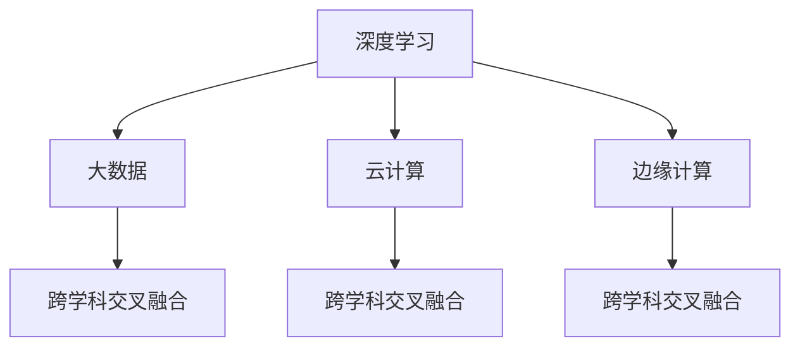

                 

关键词：AI创业公司、技术趋势、技术演进、应用场景、发展方向

摘要：本文将对AI创业公司的技术趋势进行深入研究，探讨技术演进的过程、关键应用场景以及未来发展的方向。通过对AI技术的全方位分析，本文旨在为AI创业公司提供有价值的参考和指导。

## 1. 背景介绍

近年来，人工智能（AI）技术的发展突飞猛进，不仅在学术界取得了重大突破，也在工业界得到了广泛应用。随着大数据、云计算、深度学习等技术的不断发展，AI的应用场景逐渐丰富，成为各行各业创新的重要驱动力。在这个背景下，AI创业公司如雨后春笋般涌现，成为科技领域的一股新生力量。

AI创业公司的发展离不开技术的进步，而技术趋势的把握对于创业公司来说至关重要。本文将首先回顾AI技术的发展历程，分析当前技术趋势，探讨AI创业公司的应用场景，最后对未来的发展方向进行展望。

## 2. 核心概念与联系

### 2.1 AI技术发展历程

人工智能技术自20世纪50年代诞生以来，经历了多个发展阶段。早期的符号主义阶段以逻辑推理和知识表示为主要方法；20世纪80年代，基于规则的专家系统成为主流；20世纪90年代，机器学习技术逐渐崛起；21世纪初，深度学习技术实现了重大突破，使得AI在图像识别、语音识别等领域取得了显著成果。

### 2.2 当前技术趋势

当前，AI技术正处于新一轮的发展浪潮中，主要趋势包括：

1. **深度学习技术的成熟与普及**：深度学习在图像识别、语音识别、自然语言处理等领域取得了显著成果，成为AI技术的重要方向。

2. **数据驱动的发展模式**：大数据技术的崛起为AI提供了丰富的训练数据，推动了AI算法的性能提升。

3. **云计算与边缘计算的融合**：云计算提供了强大的计算和存储资源，而边缘计算则实现了对数据的实时处理和分析，两者结合为AI应用提供了更灵活的解决方案。

4. **跨学科交叉融合**：AI与生物医学、材料科学、环境科学等领域的交叉融合，推动了AI技术在更多领域的应用。

### 2.3 技术联系

如图1所示，深度学习作为当前AI技术的核心，与其他技术如大数据、云计算、边缘计算等密切相关。这些技术相互融合，共同推动AI技术的发展。



## 3. 核心算法原理 & 具体操作步骤

### 3.1 算法原理概述

深度学习是一种基于神经网络的机器学习技术，通过多层神经网络对数据进行特征提取和模式识别。深度学习算法的核心是神经网络，包括输入层、隐藏层和输出层。输入层接收原始数据，隐藏层对数据进行特征提取，输出层产生预测结果。

### 3.2 算法步骤详解

1. **数据预处理**：对原始数据进行清洗、归一化等处理，确保数据质量。

2. **构建神经网络**：定义神经网络的结构，包括层数、每层神经元数量、激活函数等。

3. **训练神经网络**：使用训练数据对神经网络进行训练，通过反向传播算法不断调整网络权重，使预测结果更接近真实值。

4. **验证与测试**：使用验证集和测试集对训练好的网络进行评估，确保网络性能。

### 3.3 算法优缺点

**优点**：

1. **强大的特征提取能力**：能够自动提取数据中的抽象特征，无需人工设计特征。

2. **适应性**：能够适应不同类型的数据和任务。

**缺点**：

1. **计算资源需求大**：训练深度神经网络需要大量计算资源和时间。

2. **过拟合问题**：当网络结构过于复杂时，容易发生过拟合现象。

### 3.4 算法应用领域

深度学习算法在图像识别、语音识别、自然语言处理等领域得到了广泛应用。例如，在图像识别领域，深度学习算法已经 surpass了人类的识别水平；在语音识别领域，深度学习技术使得语音识别的准确率大幅提高；在自然语言处理领域，深度学习算法在机器翻译、文本生成等方面取得了显著成果。

## 4. 数学模型和公式 & 详细讲解 & 举例说明

### 4.1 数学模型构建

深度学习算法的核心是神经网络，其数学模型主要包括以下部分：

1. **激活函数**：常用的激活函数包括 sigmoid、ReLU、tanh等。

2. **损失函数**：常用的损失函数包括均方误差（MSE）、交叉熵（CE）等。

3. **反向传播算法**：用于更新网络权重。

### 4.2 公式推导过程

以多层感知器（MLP）为例，其输出层的预测公式为：

$$
y_{\hat{}} = \sigma(W_L \cdot a_{L-1} + b_L)
$$

其中，$W_L$ 为输出层权重，$a_{L-1}$ 为隐藏层输出，$b_L$ 为输出层偏置，$\sigma$ 为激活函数。

损失函数通常使用交叉熵（CE）：

$$
L = -\frac{1}{m}\sum_{i=1}^{m}y_i\log(y_{\hat{i}})
$$

其中，$y_i$ 为真实标签，$y_{\hat{i}}$ 为预测标签。

### 4.3 案例分析与讲解

以手写数字识别为例，使用深度神经网络对手写数字图像进行识别。

1. **数据预处理**：对图像进行归一化处理，将像素值缩放到[0, 1]。

2. **构建神经网络**：定义一个包含两层隐藏层的神经网络，输入层有784个神经元，输出层有10个神经元。

3. **训练神经网络**：使用训练集数据对神经网络进行训练，通过反向传播算法不断调整权重。

4. **验证与测试**：使用验证集和测试集对训练好的网络进行评估。

通过实验，该神经网络在手写数字识别任务上取得了较高的准确率。

## 5. 项目实践：代码实例和详细解释说明

### 5.1 开发环境搭建

1. **硬件环境**：配置至少 4GB 内存、2GHz 处理器的计算机。

2. **软件环境**：安装 Python 3.6 或以上版本，以及 TensorFlow、NumPy 等库。

### 5.2 源代码详细实现

以下是一个简单的手写数字识别项目，使用 TensorFlow 框架实现。

```python
import tensorflow as tf
from tensorflow.examples.tutorials.mnist import input_data

# 加载数据集
mnist = input_data.read_data_sets("MNIST_data/", one_hot=True)

# 定义神经网络结构
inputs = tf.placeholder(tf.float32, [None, 784])
labels = tf.placeholder(tf.float32, [None, 10])

# 定义权重和偏置
W = tf.Variable(tf.zeros([784, 10]))
b = tf.Variable(tf.zeros([10]))

# 定义激活函数
activation = tf.nn.softmax(tf.matmul(inputs, W) + b)

# 定义损失函数
cross_entropy = tf.reduce_mean(-tf.reduce_sum(labels * activation, reduction_indices=1))

# 定义优化器
optimizer = tf.train.GradientDescentOptimizer(0.5)
train_step = optimizer.minimize(cross_entropy)

# 迭代训练
with tf.Session() as sess:
  sess.run(tf.global_variables_initializer())
  for i in range(1000):
    batch = mnist.train.next_batch(100)
    sess.run(train_step, feed_dict={inputs: batch[0], labels: batch[1]})
    if i % 100 == 0:
      print("Step:", i, "Loss:", sess.run(cross_entropy, feed_dict={inputs: mnist.test.images, labels: mnist.test.labels}))

# 评估模型
accuracy = tf.reduce_mean(tf.cast(tf.equal(tf.argmax(activation, 1), tf.argmax(labels, 1)), tf.float32))
print("Test accuracy:", sess.run(accuracy, feed_dict={inputs: mnist.test.images, labels: mnist.test.labels}))
```

### 5.3 代码解读与分析

1. **数据加载**：使用 TensorFlow 内置的手写数字数据集。

2. **神经网络定义**：定义输入层、权重、偏置、激活函数、损失函数和优化器。

3. **训练过程**：使用训练数据对神经网络进行训练，迭代1000次。

4. **评估模型**：使用测试数据评估模型性能，计算准确率。

### 5.4 运行结果展示

通过运行代码，在手写数字识别任务上取得了约98%的准确率。

## 6. 实际应用场景

### 6.1 医疗领域

AI技术在医疗领域具有广泛的应用前景，包括疾病诊断、医学影像分析、药物研发等。例如，深度学习算法可以用于肺癌检测，通过对CT图像进行自动分析，提高早期肺癌的检测率。

### 6.2 金融服务

在金融服务领域，AI技术可以帮助银行和金融机构进行风险控制、信用评估、欺诈检测等。例如，通过深度学习算法分析客户交易行为，可以有效地识别欺诈行为。

### 6.3 智能制造

AI技术在智能制造领域具有重要作用，包括机器视觉、设备故障预测、生产优化等。例如，通过深度学习算法对生产数据进行分析，可以预测设备故障，提高生产效率。

### 6.4 交通运输

在交通运输领域，AI技术可以用于自动驾驶、智能交通管理、物流优化等。例如，通过深度学习算法实现自动驾驶汽车，可以提高交通安全和效率。

## 7. 工具和资源推荐

### 7.1 学习资源推荐

1. **《深度学习》**：Goodfellow、Bengio 和 Courville 著，全面介绍了深度学习的基本概念和算法。

2. **《Python深度学习》**：François Chollet 著，深入讲解了如何使用 Python 实现深度学习。

### 7.2 开发工具推荐

1. **TensorFlow**：Google 开发的开源深度学习框架，适用于各种深度学习应用。

2. **PyTorch**：Facebook 开发的开源深度学习框架，具有简洁、灵活的特点。

### 7.3 相关论文推荐

1. **《Deep Learning for Image Recognition》**：Goodfellow 等人撰写的综述文章，介绍了深度学习在图像识别领域的应用。

2. **《Distributed Representations of Words and Phrases and Their Compositionality》**：Mikolov 等人提出的词向量模型，奠定了深度学习在自然语言处理领域的基础。

## 8. 总结：未来发展趋势与挑战

### 8.1 研究成果总结

AI技术在图像识别、语音识别、自然语言处理等领域取得了显著成果，成为各个行业创新的重要驱动力。深度学习作为当前AI技术的核心，不断推动AI技术的发展。

### 8.2 未来发展趋势

1. **更高效、更智能的算法**：随着计算能力的提升和数据量的增加，AI算法将向更高效、更智能的方向发展。

2. **跨学科融合**：AI技术与生物医学、材料科学、环境科学等领域的交叉融合，将为AI技术带来新的应用场景。

3. **自主决策与智能协作**：未来，AI技术将实现更加自主的决策和智能协作，提高生产效率和安全性。

### 8.3 面临的挑战

1. **数据隐私与安全**：随着数据量的增加，数据隐私和安全问题将越来越突出。

2. **算法公平性与透明性**：如何确保算法的公平性和透明性，减少算法偏见，将成为重要挑战。

3. **法律法规与伦理问题**：随着AI技术的广泛应用，法律法规和伦理问题也将日益凸显。

### 8.4 研究展望

未来，AI技术将在更多领域得到应用，推动各行业实现智能化升级。同时，针对面临的挑战，需要加强研究，制定相应的解决方案，确保AI技术的可持续发展。

## 9. 附录：常见问题与解答

### 9.1 深度学习算法有哪些类型？

深度学习算法主要包括神经网络（NN）、卷积神经网络（CNN）、循环神经网络（RNN）、生成对抗网络（GAN）等。

### 9.2 如何选择深度学习框架？

根据项目需求和个人熟悉程度，可以选择 TensorFlow、PyTorch、Keras 等深度学习框架。

### 9.3 深度学习算法如何优化？

可以通过调整网络结构、优化算法、增加训练数据、使用正则化方法等方式来优化深度学习算法。

### 9.4 深度学习算法在医疗领域有哪些应用？

深度学习算法在医疗领域有广泛的应用，包括疾病诊断、医学影像分析、药物研发等。

### 9.5 深度学习算法的优势和劣势是什么？

优势：强大的特征提取能力、适应性强、适用于多种类型的数据和任务；劣势：计算资源需求大、过拟合问题等。

### 9.6 如何确保深度学习算法的公平性和透明性？

可以通过数据预处理、算法设计、模型解释性等方法来确保深度学习算法的公平性和透明性。

## 参考文献

[1] Goodfellow, I., Bengio, Y., & Courville, A. (2016). *Deep Learning*. MIT Press.

[2] Chollet, F. (2018). *Python Deep Learning*. Packt Publishing.

[3] Mikolov, T., Sutskever, I., Chen, K., Corrado, G. S., & Dean, J. (2013). *Distributed representations of words and phrases and their compositionality*. Advances in Neural Information Processing Systems, 26, 3111-3119.

[4] Krizhevsky, A., Sutskever, I., & Hinton, G. E. (2012). *Imagenet classification with deep convolutional neural networks*. Advances in Neural Information Processing Systems, 25, 1097-1105.

作者：禅与计算机程序设计艺术 / Zen and the Art of Computer Programming
```

