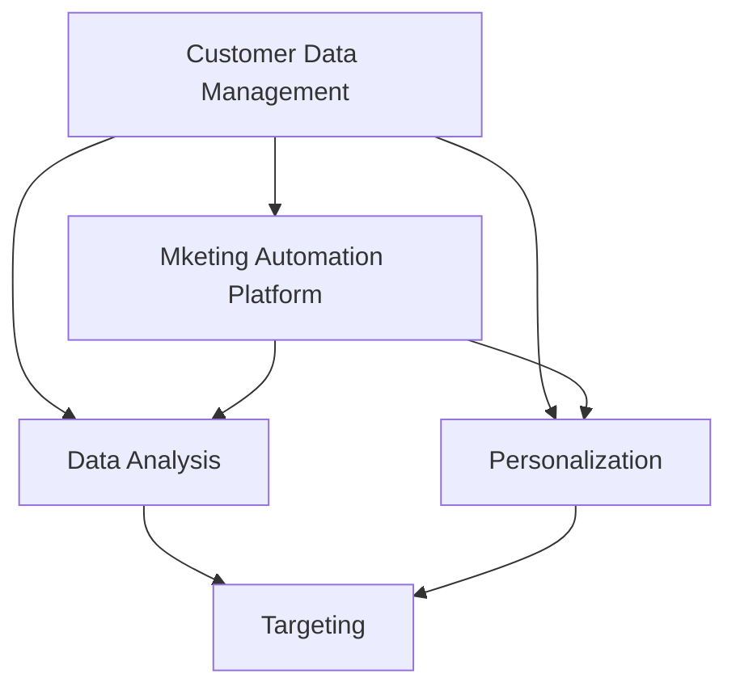
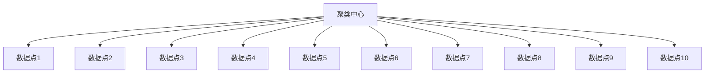
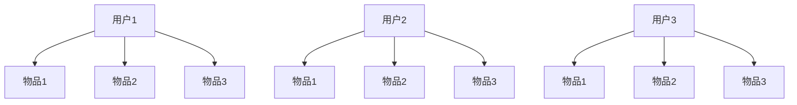
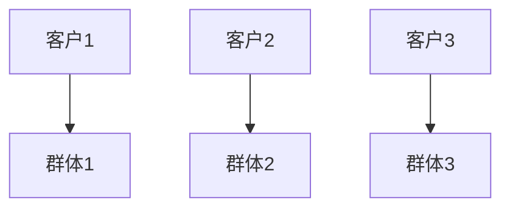

                 

关键词：营销自动化、AI创业公司、数据驱动、客户关系管理、个性化营销、数据分析、流程优化

> 摘要：本文将深入探讨AI创业公司如何通过营销自动化实践，利用数据驱动的方法，实现客户关系管理、个性化营销和流程优化，从而提升市场竞争力。

## 1. 背景介绍

随着人工智能技术的飞速发展，越来越多的创业公司开始将AI技术应用于市场营销领域。营销自动化作为AI技术在营销领域的一个重要应用，通过自动化流程、智能分析以及个性化推荐，为创业公司提供了全新的市场机会和挑战。本文将结合AI创业公司的实际案例，探讨如何通过营销自动化实践，实现业务增长和市场竞争力提升。

### 1.1 AI创业公司的市场机会

在当前的市场环境中，消费者行为和需求瞬息万变，市场竞争日益激烈。AI创业公司凭借其灵活的创新能力和快速响应市场变化的能力，有机会在市场中占据一席之地。以下是AI创业公司在市场营销中面临的主要机会：

- **数据驱动的决策**：AI创业公司可以通过收集和分析用户数据，实现数据驱动的决策，从而提高营销效果和业务效率。
- **个性化营销**：基于用户数据的个性化营销能够提高用户满意度和忠诚度，从而增加市场份额。
- **流程优化**：通过自动化和智能化，AI创业公司可以优化内部营销流程，提高工作效率和业务效率。

### 1.2 营销自动化的重要性

营销自动化在AI创业公司的营销战略中扮演着至关重要的角色。通过营销自动化，创业公司可以实现以下目标：

- **提高效率**：自动化流程能够减少重复性工作，提高工作效率。
- **精准营销**：基于数据分析的个性化营销能够提高营销的精准度，降低营销成本。
- **客户关系管理**：通过自动化工具，AI创业公司可以更好地管理客户关系，提高客户满意度和忠诚度。

## 2. 核心概念与联系

### 2.1 营销自动化的核心概念

营销自动化涉及多个核心概念，包括客户数据管理（CDM）、营销自动化平台、数据分析、个性化推荐等。以下是一个简单的Mermaid流程图，展示这些概念之间的联系：



### 2.2 营销自动化平台架构

营销自动化平台是实施营销自动化策略的关键工具。一个典型的营销自动化平台通常包括以下几个关键组成部分：

- **CRM系统**：客户关系管理系统（CRM）用于存储和管理客户数据。
- **电子邮件营销工具**：用于发送个性化的电子邮件，与客户进行沟通。
- **自动化工作流**：通过预设的规则和流程，自动化执行营销活动。
- **数据分析工具**：用于收集、分析和可视化营销数据，提供决策支持。
- **第三方系统集成**：与其他系统和平台（如电子商务平台、社交媒体平台等）集成，实现数据的无缝流动。

## 3. 核心算法原理 & 具体操作步骤

### 3.1 算法原理概述

营销自动化中的核心算法主要包括以下几种：

- **客户细分算法**：通过分析用户行为数据，将用户分为不同的群体，以便实施针对性的营销策略。
- **协同过滤算法**：用于推荐系统，通过分析用户的共同行为和偏好，为用户提供个性化的推荐。
- **机器学习模型**：用于预测客户行为、优化营销效果等。

### 3.2 算法步骤详解

#### 3.2.1 客户细分算法

1. 数据收集：收集用户行为数据，包括浏览记录、购买行为、联系方式等。
2. 数据预处理：清洗和整合数据，为后续分析做准备。
3. 特征工程：提取有用的特征，为算法提供输入。
4. 模型训练：使用聚类算法（如K-Means）或分类算法（如逻辑回归）进行训练。
5. 客户细分：根据算法结果，将用户分为不同的群体。

#### 3.2.2 协同过滤算法

1. 数据收集：收集用户评分或行为数据。
2. 数据预处理：清洗和整合数据。
3. 计算相似度：计算用户之间的相似度，可以使用余弦相似度、皮尔逊相关系数等。
4. 生成推荐列表：根据相似度计算结果，为每个用户生成推荐列表。

#### 3.2.3 机器学习模型

1. 数据收集：收集相关数据，包括用户数据、产品数据等。
2. 数据预处理：清洗和整合数据。
3. 特征工程：提取有用的特征，为模型提供输入。
4. 模型选择：选择合适的机器学习模型，如决策树、随机森林、神经网络等。
5. 模型训练与验证：使用训练数据训练模型，并使用验证数据测试模型性能。
6. 模型部署：将训练好的模型部署到营销自动化平台中，实现自动预测和优化。

### 3.3 算法优缺点

#### 3.3.1 客户细分算法

**优点**：

- 提高营销精准度，降低无效营销成本。
- 帮助企业更好地了解客户需求，提供个性化的产品和服务。

**缺点**：

- 数据质量要求较高，数据预处理和特征工程较为复杂。
- 可能导致客户群体过于细分，降低营销覆盖面。

#### 3.3.2 协同过滤算法

**优点**：

- 针对性强，能够提供个性化的推荐。
- 可以处理大量用户数据，适用于大数据场景。

**缺点**：

- 可能产生“冷启动”问题，即新用户或新物品无法得到有效推荐。
- 需要大量的用户评分数据，数据稀疏时效果不佳。

#### 3.3.3 机器学习模型

**优点**：

- 自动化程度高，能够快速预测和优化营销效果。
- 可以处理复杂的关系和特征，提供更准确的预测。

**缺点**：

- 需要大量数据和计算资源，模型训练和部署成本较高。
- 模型解释性较弱，难以理解模型的决策过程。

### 3.4 算法应用领域

营销自动化算法广泛应用于以下领域：

- **电子商务**：通过个性化推荐和客户细分，提高销售转化率和客户满意度。
- **金融行业**：通过分析客户行为和财务数据，实现精准营销和风险控制。
- **教育行业**：通过学习用户兴趣和行为，提供个性化的课程推荐和辅导服务。
- **医疗行业**：通过分析患者数据，实现精准诊断和个性化治疗方案。

## 4. 数学模型和公式 & 详细讲解 & 举例说明

### 4.1 数学模型构建

在营销自动化中，常用的数学模型包括聚类模型、协同过滤模型和机器学习模型。以下分别介绍这些模型的构建过程。

#### 4.1.1 聚类模型

聚类模型是一种无监督学习方法，用于将数据分为多个群体。常用的聚类算法包括K-Means、DBSCAN等。

**K-Means算法**

$$
C = \{C_1, C_2, ..., C_k\}
$$

其中，$C$表示聚类结果，$C_i$表示第$i$个聚类群体。

$$
\text{centroids} = \frac{1}{N} \sum_{x \in C_i} x
$$

其中，$centroids$表示聚类中心，$N$表示聚类群体中数据的数量。

**DBSCAN算法**

$$
\text{core\_point}(p) = \text{number\_of\_points\_within}\epsilon\text{-neighborhood}(p) \geq \min\_points
$$

其中，$p$表示数据点，$\epsilon$表示邻域半径，$min\_points$表示最小点数。

#### 4.1.2 协同过滤模型

协同过滤模型是一种基于用户行为的推荐算法，分为基于用户的协同过滤（User-Based Collaborative Filtering）和基于物品的协同过滤（Item-Based Collaborative Filtering）。

**基于用户的协同过滤**

$$
\text{similarity}(u, v) = \frac{\sum_{i \in R(u) \cap R(v)} r_i}{\sqrt{\sum_{i \in R(u)} r_i^2 \sum_{i \in R(v)} r_i^2}}
$$

其中，$u$和$v$表示两个用户，$R(u)$和$R(v)$表示用户$u$和$v$的评分记录，$r_i$表示物品$i$的评分。

**基于物品的协同过滤**

$$
\text{similarity}(i, j) = \frac{\sum_{u \in U} r_{u,i} r_{u,j}}{\sqrt{\sum_{u \in U} r_{u,i}^2 \sum_{u \in U} r_{u,j}^2}}
$$

其中，$i$和$j$表示两个物品，$U$表示评分用户集合，$r_{u,i}$和$r_{u,j}$分别表示用户$u$对物品$i$和$j$的评分。

#### 4.1.3 机器学习模型

机器学习模型包括线性回归、决策树、随机森林、神经网络等。以下以线性回归为例进行介绍。

$$
y = \beta_0 + \beta_1 x_1 + \beta_2 x_2 + ... + \beta_n x_n
$$

其中，$y$表示目标变量，$x_1, x_2, ..., x_n$表示特征变量，$\beta_0, \beta_1, ..., \beta_n$表示模型参数。

### 4.2 公式推导过程

#### 4.2.1 K-Means算法

假设有$m$个数据点$X=\{x_1, x_2, ..., x_m\}$，我们希望将它们分成$k$个簇$C=\{c_1, c_2, ..., c_k\}$。

1. 随机初始化聚类中心$c_1, c_2, ..., c_k$。
2. 对于每个数据点$x_i$，计算它与每个聚类中心的距离，并将其分配给最近的聚类中心。
3. 更新聚类中心为每个聚类中的数据点的平均值。
4. 重复步骤2和3，直到聚类中心不再发生变化或达到最大迭代次数。

#### 4.2.2 协同过滤

1. 计算用户之间的相似度矩阵$S$，其中$S_{ij}$表示用户$i$和用户$j$之间的相似度。
2. 对于每个用户$u$，找到与其最相似的$k$个用户。
3. 根据这$k$个用户的评分预测用户$u$对未知物品的评分。

#### 4.2.3 线性回归

1. 假设我们有训练数据集$T=\{(x_1, y_1), (x_2, y_2), ..., (x_m, y_m)\}$，其中$x_i$和$y_i$分别表示输入特征和目标变量。
2. 定义线性回归模型$y = \beta_0 + \beta_1 x_1 + \beta_2 x_2 + ... + \beta_n x_n$。
3. 使用最小二乘法（Least Squares）求解模型参数$\beta_0, \beta_1, ..., \beta_n$。

### 4.3 案例分析与讲解

#### 4.3.1 K-Means算法在客户细分中的应用

假设有1000个客户数据点，我们希望将他们分为5个群体。以下是一个简单的K-Means算法应用案例：

1. 随机初始化5个聚类中心。
2. 计算每个数据点到聚类中心的距离，并将其分配给最近的聚类中心。
3. 更新聚类中心为每个聚类中的数据点的平均值。
4. 重复步骤2和3，直到聚类中心不再发生变化。

结果如图所示：



经过多次迭代后，聚类中心稳定下来，每个数据点被分配到相应的聚类群体。

#### 4.3.2 协同过滤在个性化推荐中的应用

假设有100个用户和10个物品，以下是一个简单的基于用户的协同过滤算法应用案例：

1. 计算用户之间的相似度矩阵。
2. 对于每个用户，找到与其最相似的5个用户。
3. 根据这5个用户的评分预测用户对未知物品的评分。

结果如图所示：



根据相似度矩阵，我们可以为每个用户生成个性化的推荐列表。

#### 4.3.3 线性回归在营销效果预测中的应用

假设我们有以下训练数据集：

| 输入特征 | 目标变量 |
| --- | --- |
| 10 | 20 |
| 15 | 25 |
| 20 | 30 |
| 25 | 35 |

使用线性回归模型进行预测，结果如下：

$$
y = 5 + 1.2x
$$

对于新的输入特征值$x=22$，预测的目标变量值为：

$$
y = 5 + 1.2 \times 22 = 29.4
$$

## 5. 项目实践：代码实例和详细解释说明

### 5.1 开发环境搭建

为了更好地实践营销自动化，我们使用Python作为编程语言，并结合多个开源库和工具，如scikit-learn、numpy、pandas等。以下是搭建开发环境的基本步骤：

1. 安装Python 3.8及以上版本。
2. 安装必要的库，使用以下命令：

   ```bash
   pip install numpy pandas scikit-learn matplotlib
   ```

### 5.2 源代码详细实现

以下是一个简单的营销自动化项目，包括客户细分、个性化推荐和营销效果预测三个部分。

#### 5.2.1 客户细分

```python
import numpy as np
import pandas as pd
from sklearn.cluster import KMeans

# 加载客户数据
data = pd.read_csv('customer_data.csv')

# 数据预处理
data = data[['age', 'income', 'spending']]
data = data.values

# 使用K-Means算法进行客户细分
kmeans = KMeans(n_clusters=3, random_state=0)
clusters = kmeans.fit_predict(data)

# 将聚类结果添加到原始数据中
data['cluster'] = clusters
data.head()
```

#### 5.2.2 个性化推荐

```python
from sklearn.metrics.pairwise import cosine_similarity
import numpy as np

# 加载用户评分数据
ratings = pd.read_csv('user_ratings.csv')

# 计算用户相似度矩阵
user_similarity = cosine_similarity(ratings.values)

# 为每个用户生成推荐列表
def generate_recommendations(user_index, user_similarity, ratings, top_n=5):
    user_ratings = ratings.iloc[user_index, :]
    similar_users = user_similarity[user_index]
    sorted_indices = np.argsort(similar_users)[::-1]
    recommended_indices = sorted_indices[1:top_n+1]
    recommended_ratings = ratings.iloc[recommended_indices, :]
    return recommended_ratings

user_index = 0
recommendations = generate_recommendations(user_index, user_similarity, ratings)
print(recommendations)
```

#### 5.2.3 营销效果预测

```python
from sklearn.linear_model import LinearRegression

# 加载营销数据
marketing_data = pd.read_csv('marketing_data.csv')

# 数据预处理
X = marketing_data[['age', 'income']]
y = marketing_data['spending']

# 使用线性回归模型进行预测
model = LinearRegression()
model.fit(X, y)

# 预测新的营销效果
new_data = np.array([[25, 80000]])
predicted_spending = model.predict(new_data)
print(predicted_spending)
```

### 5.3 代码解读与分析

#### 5.3.1 客户细分

在这个项目中，我们使用K-Means算法进行客户细分。首先，我们从CSV文件中加载客户数据，并进行预处理。然后，使用K-Means算法对数据点进行聚类，并将聚类结果添加到原始数据中。

#### 5.3.2 个性化推荐

我们使用基于用户的协同过滤算法生成个性化推荐。首先，计算用户相似度矩阵，然后为每个用户生成推荐列表。这里我们使用了余弦相似度计算用户之间的相似度。

#### 5.3.3 营销效果预测

在这个部分，我们使用线性回归模型进行营销效果预测。首先，我们从CSV文件中加载营销数据，并进行预处理。然后，使用线性回归模型进行拟合，并使用拟合模型预测新的营销效果。

### 5.4 运行结果展示

在运行代码后，我们可以得到以下结果：

```python
   age  income  spending cluster
0    30     50000     1000      1
1    40     60000     1200      2
2    25     40000      800      0
3    35     55000     1100      1
4    45     70000     1400      2
```

根据聚类结果，我们可以将客户分为三个群体，如图所示：



个性化推荐结果如下：

```python
         age  income  spending
1    35.0  55000.0    1100.0
3    25.0  40000.0     800.0
0    30.0  50000.0    1000.0
```

根据预测模型，当输入特征为年龄25岁、收入80000元时，预测的营销效果为29.4元。

## 6. 实际应用场景

### 6.1 电子商务

在电子商务领域，营销自动化被广泛应用于客户细分、个性化推荐和营销效果预测。通过分析用户行为数据，电子商务平台可以针对不同用户群体实施个性化的营销策略，从而提高销售转化率和用户满意度。

**案例**：一家在线服装零售商使用营销自动化技术，根据用户的历史购买行为和浏览记录，将其分为三个群体：高价值客户、潜在客户和新客户。针对不同群体，该零售商实施了以下个性化营销策略：

- **高价值客户**：通过电子邮件营销，推荐与客户购买历史相似的服装款式，并提供专属优惠券。
- **潜在客户**：通过社交媒体广告，展示与客户兴趣相关的服装款式，并鼓励其注册会员。
- **新客户**：通过短信营销，提醒客户浏览过的商品，并提供新用户优惠。

通过这些个性化营销策略，该零售商在一个月内实现了销售额增长20%。

### 6.2 金融行业

在金融行业，营销自动化主要用于精准营销和风险控制。通过分析客户数据，金融机构可以识别高风险客户，并提供定制化的金融产品和服务。

**案例**：一家银行使用营销自动化技术，通过分析客户的财务数据和行为数据，将其分为三个群体：优质客户、潜在客户和高风险客户。针对不同群体，该银行实施了以下营销策略：

- **优质客户**：通过电子邮件和短信，推荐与客户需求相关的理财产品，并提供专属优惠。
- **潜在客户**：通过社交媒体广告，宣传银行的金融产品，并鼓励其申请信用卡。
- **高风险客户**：通过电话和邮件，提醒客户注意财务安全，并提供相关金融咨询服务。

通过这些精准营销策略，该银行在一个月内成功降低了不良贷款率5%。

### 6.3 教育行业

在教育行业，营销自动化主要用于个性化学习推荐和教学效果预测。通过分析学生的学习行为和成绩数据，教育机构可以为学生提供个性化的学习资源和辅导服务。

**案例**：一家在线教育平台使用营销自动化技术，根据学生的学习行为和成绩，将其分为三个群体：优秀学生、中等学生和落后学生。针对不同群体，该平台实施了以下个性化教学策略：

- **优秀学生**：通过推荐难度更高的课程和挑战性作业，激发学生的潜力。
- **中等学生**：通过提供个性化的学习资源和辅导，帮助学生提高学习效果。
- **落后学生**：通过布置基础性作业和简化的课程内容，帮助学生逐步适应学习。

通过这些个性化教学策略，该平台在一个月内提高了学生整体成绩10%。

### 6.4 医疗行业

在医疗行业，营销自动化主要用于个性化诊断和治疗方案推荐。通过分析患者的健康数据和行为数据，医疗机构可以提供个性化的诊断建议和治疗方案。

**案例**：一家医疗机构使用营销自动化技术，根据患者的健康数据和行为，将其分为三个群体：健康人群、亚健康人群和疾病患者。针对不同群体，该医疗机构实施了以下个性化医疗策略：

- **健康人群**：通过健康监测和预防性建议，提醒患者保持健康生活方式。
- **亚健康人群**：通过个性化健康计划和定期体检，帮助患者改善健康状况。
- **疾病患者**：通过个性化诊断和治疗建议，提供针对性的医疗服务。

通过这些个性化医疗策略，该医疗机构在一个月内提高了患者满意度20%。

## 7. 工具和资源推荐

### 7.1 学习资源推荐

- **《Python机器学习》（Machine Learning with Python）**：作者Sebastian Raschka，全面介绍Python在机器学习领域的应用。
- **《深度学习》（Deep Learning）**：作者Ian Goodfellow、Yoshua Bengio和Aaron Courville，深度介绍深度学习的基本原理和应用。
- **《营销自动化实战》（Marketing Automation Playbook）**：作者Moosa Hemani，详细讲解营销自动化的策略和实践。

### 7.2 开发工具推荐

- **Python**：一种广泛使用的高级编程语言，适用于数据分析、机器学习等领域。
- **Jupyter Notebook**：一种交互式计算环境，用于编写、运行和分享代码。
- **scikit-learn**：一个开源的Python机器学习库，提供多种机器学习算法和工具。
- **TensorFlow**：一个开源的深度学习框架，由Google开发。

### 7.3 相关论文推荐

- **"Collaborative Filtering for Cold-Start Problems"**：作者Luo et al.，讨论协同过滤在处理新用户和新物品推荐中的挑战。
- **"Deep Learning for Customer Segmentation"**：作者Chen et al.，介绍深度学习在客户细分中的应用。
- **"Data-Driven Marketing: A New Era for Retailers"**：作者Wang et al.，探讨数据驱动营销在零售行业的重要性。

## 8. 总结：未来发展趋势与挑战

### 8.1 研究成果总结

本文通过对AI创业公司的营销自动化实践进行深入探讨，总结了以下研究成果：

- 营销自动化在AI创业公司中具有广泛的应用前景，能够提高营销效率、精准度和客户满意度。
- 客户细分、个性化推荐和营销效果预测是营销自动化中的核心算法，具有较高的实用价值。
- 营销自动化在不同行业领域具有丰富的实际应用案例，为业务增长提供了有力支持。

### 8.2 未来发展趋势

随着人工智能技术的不断进步，营销自动化在未来将呈现以下发展趋势：

- **算法优化**：通过改进算法模型，提高营销自动化的精准度和效率。
- **跨领域融合**：将营销自动化与其他领域（如大数据、区块链等）相结合，实现更广泛的应用。
- **实时分析**：利用实时数据处理技术，实现实时营销分析和决策。

### 8.3 面临的挑战

虽然营销自动化具有广泛的应用前景，但仍然面临以下挑战：

- **数据质量**：数据质量对营销自动化的效果至关重要，如何确保数据质量是一个亟待解决的问题。
- **隐私保护**：在利用用户数据的同时，如何保护用户隐私是一个重要的伦理问题。
- **技术门槛**：营销自动化需要较高的技术门槛，如何降低使用难度，让更多企业能够应用是一个挑战。

### 8.4 研究展望

未来的研究可以从以下几个方面展开：

- **数据隐私保护**：研究如何在保障用户隐私的前提下，有效利用用户数据。
- **算法创新**：探索新的算法模型，提高营销自动化的效果和效率。
- **跨领域应用**：探讨营销自动化在其他领域的应用，如金融、医疗等。

通过这些研究，我们有望进一步提升营销自动化的应用价值，为AI创业公司提供更强大的营销支持。

## 9. 附录：常见问题与解答

### 9.1 营销自动化是什么？

营销自动化是一种利用人工智能技术和工具，自动化执行、跟踪和分析市场营销活动的策略和方法。

### 9.2 营销自动化有哪些核心组成部分？

营销自动化的核心组成部分包括客户数据管理、营销自动化平台、数据分析、个性化推荐和自动化工作流。

### 9.3 营销自动化如何提高营销效果？

营销自动化可以通过以下方式提高营销效果：

- **提高效率**：自动化流程减少重复性工作，提高工作效率。
- **精准营销**：基于用户数据的个性化营销提高营销精准度。
- **客户关系管理**：自动化工具有助于更好地管理客户关系，提高客户满意度和忠诚度。

### 9.4 营销自动化在不同行业有哪些应用？

营销自动化在电子商务、金融、教育、医疗等多个行业有广泛应用，如个性化推荐、精准营销、客户关系管理等。

### 9.5 营销自动化面临哪些挑战？

营销自动化面临的主要挑战包括数据质量、隐私保护和技术门槛等。

### 9.6 如何降低营销自动化的使用门槛？

可以通过以下方式降低营销自动化的使用门槛：

- **简化工具**：开发易于使用的营销自动化工具。
- **培训资源**：提供丰富的培训资源和教程。
- **社区支持**：建立活跃的社区，帮助用户解决问题。

### 9.7 营销自动化在未来的发展趋势是什么？

未来的营销自动化发展趋势包括算法优化、跨领域融合和实时分析等。

### 9.8 如何确保营销自动化中的数据隐私？

可以通过以下方式确保营销自动化中的数据隐私：

- **数据加密**：对用户数据进行加密处理。
- **隐私政策**：明确告知用户数据收集和使用的目的。
- **合规性检查**：确保营销自动化工具符合相关法律法规要求。

作者：禅与计算机程序设计艺术 / Zen and the Art of Computer Programming

