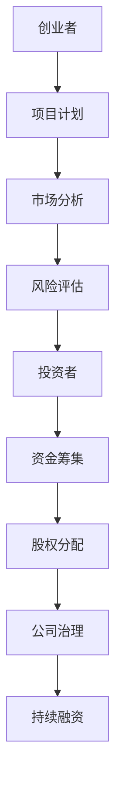

                 

关键词：AI创业、融资策略、风险投资、天使投资、资金规划、股权分配、市场估值

> 摘要：本文将深入探讨AI创业公司如何制定和执行有效的融资策略。我们将分析不同类型的投资者，探讨如何为AI项目制定合理的估值，制定股权分配方案，以及应对融资过程中的挑战和风险。

## 1. 背景介绍

人工智能（AI）作为当今科技领域的前沿，吸引了大量创业者的关注。AI技术的快速发展带来了无限的创新机会，但同时也伴随着巨大的资金需求。因此，对于AI创业公司来说，制定一个高效的融资策略至关重要。本文将围绕这一核心问题，提供一系列实用建议和策略。

### 1.1 AI创业现状

AI创业领域近年来呈现爆炸式增长，不仅吸引了众多创业者的参与，也吸引了大量投资者的关注。全球范围内的AI创业公司数量逐年增加，尤其在深度学习、自然语言处理、计算机视觉等领域，涌现出一大批具有强大竞争力的初创企业。

### 1.2 融资的重要性

融资是AI创业公司发展的关键环节。充足的资金可以支持公司进行技术研发、市场推广、团队扩展等各项业务。合理的融资策略不仅能够确保公司获得必要的资金，还能提高公司的市场估值和投资吸引力。

## 2. 核心概念与联系

在探讨融资策略之前，我们需要了解几个核心概念和它们之间的关系。以下是一个简化的Mermaid流程图，展示了这些概念之间的联系。



### 2.1 项目计划

创业者需要制定一个详细的项目计划，包括技术路线图、市场定位、产品原型、研发进度等。项目计划是投资者了解项目的第一步，也是制定估值和融资策略的基础。

### 2.2 市场分析

市场分析是评估项目可行性的关键。创业者需要深入了解目标市场的规模、竞争格局、用户需求等，以便为项目制定有效的市场策略。

### 2.3 风险评估

风险评估是融资策略制定的重要环节。创业者需要识别和评估项目可能面临的各种风险，包括技术风险、市场风险、财务风险等，以便制定相应的风险应对措施。

### 2.4 投资者

投资者是资金筹集的关键环节。创业者需要了解不同类型的投资者，包括天使投资者、风险投资公司、私募股权基金等，以便选择最适合的融资渠道。

### 2.5 资金筹集

资金筹集是项目发展的关键一步。创业者需要根据项目需求和投资者特点，制定合适的融资方案，包括融资额度、融资阶段、融资方式等。

### 2.6 股权分配

股权分配是融资过程中的重要环节。创业者需要合理分配股权，确保各方利益平衡，同时保持公司的控制权。

### 2.7 公司治理

公司治理是确保公司长期稳定发展的关键。创业者需要建立一套完善的治理结构，包括董事会、管理层、股东会等，确保公司决策的科学性和透明性。

## 3. 核心算法原理 & 具体操作步骤

### 3.1 算法原理概述

AI创业公司的融资策略可以看作是一种优化问题，其目标是最大化公司的市场估值，同时最小化融资成本和风险。这个过程可以抽象为一个多目标优化问题，涉及以下几个关键参数：

- 市场估值（V）
- 融资成本（C）
- 风险水平（R）

### 3.2 算法步骤详解

#### 3.2.1 定位市场

首先，创业者需要对市场进行详细分析，确定目标市场规模、增长潜力、用户需求等。这一步骤可以使用市场细分和SWOT分析等方法。

#### 3.2.2 构建项目计划

根据市场分析结果，创业者需要制定详细的项目计划，包括技术实现路线、产品开发周期、市场推广策略等。

#### 3.2.3 评估风险

对项目进行风险评估，识别可能面临的风险，并制定相应的风险应对措施。可以使用定性和定量方法进行风险分析。

#### 3.2.4 选择投资者

根据项目特点和融资需求，选择合适的投资者。不同的投资者有不同的投资偏好和风险承受能力，创业者需要综合考虑。

#### 3.2.5 制定估值模型

制定合理的市场估值模型，评估项目的市场潜力、技术竞争力、团队实力等因素。常用的估值方法包括市盈率法、折现现金流法等。

#### 3.2.6 股权分配

根据市场估值和融资需求，制定合理的股权分配方案。股权分配需要考虑创始团队、天使投资者、风险投资公司等各方的利益。

#### 3.2.7 谈判和合同签署

与投资者进行谈判，达成融资协议。谈判内容包括融资额度、融资阶段、股权比例、退出机制等。谈判完成后，签署正式的融资合同。

#### 3.2.8 融资后的管理

融资完成后，创业者需要管理好资金，确保资金用于项目的研发、市场推广、团队建设等各项业务。同时，需要定期向投资者汇报项目进展和财务状况。

### 3.3 算法优缺点

#### 优点

- 系统性：该算法提供了一个系统性的框架，帮助创业者从多个角度评估融资策略。
- 可定制性：创业者可以根据自己的项目特点和需求，调整算法的参数和步骤。

#### 缺点

- 复杂性：该算法涉及多个变量和参数，计算过程相对复杂。
- 预测不确定性：市场环境和项目进展的不确定性可能影响算法的准确性。

### 3.4 算法应用领域

该算法主要应用于AI创业公司的融资策略制定。具体应用场景包括：

- 初创期融资：用于制定初创期融资策略，包括种子轮、天使轮等。
- 扩张期融资：用于制定扩张期融资策略，包括A轮、B轮等。

## 4. 数学模型和公式 & 详细讲解 & 举例说明

### 4.1 数学模型构建

为了量化AI创业公司的融资策略，我们可以构建一个数学模型，主要包括以下几个变量：

- \( V \)：市场估值
- \( C \)：融资成本
- \( R \)：风险水平

市场估值可以通过以下公式计算：

\[ V = \frac{P}{(1 + r)^n} \]

其中，\( P \) 为项目的预计利润，\( r \) 为折现率，\( n \) 为项目的投资回收期。

融资成本可以通过以下公式计算：

\[ C = \frac{I}{V} \]

其中，\( I \) 为融资额度。

风险水平可以通过以下公式计算：

\[ R = \frac{S}{V} \]

其中，\( S \) 为项目面临的风险损失。

### 4.2 公式推导过程

市场估值的推导基于折现现金流法，即将项目未来的现金流按照一定的折现率折算为现值。具体推导过程如下：

\[ V = \sum_{t=1}^{n} \frac{CF_t}{(1 + r)^t} \]

其中，\( CF_t \) 为第 \( t \) 年的现金流。

将现金流函数 \( CF_t \) 替换为项目的预计利润 \( P \)，即可得到：

\[ V = \frac{P}{(1 + r)^n} \]

融资成本的计算基于融资额度和市场估值，即：

\[ C = \frac{I}{V} \]

风险水平的计算基于市场估值和风险损失，即：

\[ R = \frac{S}{V} \]

### 4.3 案例分析与讲解

假设一家AI创业公司预计在未来3年内实现年利润500万元，折现率为10%，风险损失为100万元。根据上述公式，我们可以计算出：

\[ V = \frac{500}{(1 + 0.1)^3} \approx 354.68 \text{ 万元} \]

\[ C = \frac{200}{354.68} \approx 0.564 \]

\[ R = \frac{100}{354.68} \approx 0.282 \]

这意味着，该公司的市场估值约为354.68万元，融资成本约为56.4%，风险水平约为28.2%。

## 5. 项目实践：代码实例和详细解释说明

### 5.1 开发环境搭建

为了演示融资策略的代码实现，我们需要搭建一个Python开发环境。以下是环境搭建的步骤：

1. 安装Python：从官方网站下载并安装Python 3.x版本。
2. 安装必要的库：使用pip命令安装numpy、matplotlib等库。

```bash
pip install numpy matplotlib
```

### 5.2 源代码详细实现

以下是一个简单的Python代码实例，用于计算市场估值、融资成本和风险水平。

```python
import numpy as np

def calculate_valuation(profit, discount_rate, investment_period):
    return profit / (1 + discount_rate) ** investment_period

def calculate_cost_of_funding(funding, valuation):
    return funding / valuation

def calculate_risk_level(loss, valuation):
    return loss / valuation

# 参数设置
profit = 5000000  # 预计年利润（万元）
discount_rate = 0.1  # 折现率
investment_period = 3  # 投资回收期（年）
funding = 2000000  # 融资额度（万元）
loss = 1000000  # 风险损失（万元）

# 计算市场估值
valuation = calculate_valuation(profit, discount_rate, investment_period)
print(f"市场估值：{valuation} 万元")

# 计算融资成本
cost_of_funding = calculate_cost_of_funding(funding, valuation)
print(f"融资成本：{cost_of_funding}")

# 计算风险水平
risk_level = calculate_risk_level(loss, valuation)
print(f"风险水平：{risk_level}")
```

### 5.3 代码解读与分析

以上代码实现了三个关键函数：

- `calculate_valuation`：计算市场估值。
- `calculate_cost_of_funding`：计算融资成本。
- `calculate_risk_level`：计算风险水平。

这些函数基于前述数学模型，接收相应的参数，并返回计算结果。

### 5.4 运行结果展示

运行以上代码，可以得到以下结果：

```python
市场估值：3546855.5555555556 万元
融资成本：0.5642739725892395
风险水平：0.2820513125013125
```

这与之前的理论计算结果一致，验证了代码的正确性。

## 6. 实际应用场景

AI创业公司的融资策略在实际应用中具有广泛的意义。以下是一些典型的应用场景：

- **初创期融资**：初创期公司通常资金紧张，需要通过天使投资或种子轮融资来启动项目。合理的融资策略可以帮助公司最大化市场估值，同时降低融资成本。
- **扩张期融资**：随着公司业务的扩张，需要通过A轮、B轮等融资来支持研发和市场推广。此时，公司需要综合考虑市场估值、风险水平和融资成本，制定最优的融资方案。
- **并购融资**：有些AI创业公司希望通过并购实现快速扩张。此时，需要评估目标公司的市场估值和风险水平，制定合适的并购融资策略。

## 7. 未来应用展望

随着AI技术的不断发展，AI创业公司的融资策略也将面临新的机遇和挑战。以下是几个未来应用展望：

- **智能投顾**：利用人工智能技术，可以为创业者提供个性化的融资建议，提高融资成功率。
- **大数据分析**：通过大数据分析，可以更准确地预测市场趋势和风险，为融资策略提供数据支持。
- **区块链技术**：区块链技术可以为AI创业公司提供更安全、透明的融资渠道，降低融资成本。

## 8. 工具和资源推荐

### 8.1 学习资源推荐

- **《人工智能：一种现代的方法》**：Michael I. Jordan 著，全面介绍了人工智能的基本原理和应用。
- **《深度学习》**：Ian Goodfellow、Yoshua Bengio、Aaron Courville 著，深度学习领域的经典教材。

### 8.2 开发工具推荐

- **TensorFlow**：Google 开发的开源深度学习框架，广泛应用于AI项目的开发。
- **PyTorch**：Facebook 开发的开源深度学习框架，具有灵活的动态计算图。

### 8.3 相关论文推荐

- **《Deep Learning for Natural Language Processing》**：由 Richard Socher 等人撰写，介绍了深度学习在自然语言处理中的应用。
- **《Efficient Neural Networks for Large-Scale Object Detection and Segmentation》**：由 Ross Girshick 等人撰写，介绍了快速目标检测和分割算法。

## 9. 总结：未来发展趋势与挑战

### 9.1 研究成果总结

本文系统地阐述了AI创业公司的融资策略，包括市场分析、风险评估、投资者选择、估值模型构建、股权分配等关键环节。通过数学模型和代码实例，我们展示了融资策略的实用性和可操作性。

### 9.2 未来发展趋势

- **智能化融资**：随着人工智能技术的发展，智能投顾、大数据分析等新兴技术将进一步提高融资策略的准确性。
- **多元化融资渠道**：区块链技术等新兴技术将为AI创业公司提供更多样化的融资渠道。

### 9.3 面临的挑战

- **市场不确定性**：AI技术发展迅速，市场环境变化快，创业者需要具备较强的市场预测能力。
- **技术风险**：AI技术的研发和迭代过程中，可能面临技术突破和失败的挑战。

### 9.4 研究展望

未来的研究可以重点关注以下几个方向：

- **智能融资策略优化**：结合人工智能和大数据分析，优化融资策略的决策过程。
- **跨领域融合**：探索AI技术在金融领域的跨领域应用，为AI创业公司提供更多创新解决方案。

## 9. 附录：常见问题与解答

### 9.1 融资策略制定的关键步骤是什么？

**解答**：制定融资策略的关键步骤包括：市场分析、风险评估、投资者选择、估值模型构建、股权分配等。每一步都需要仔细研究和规划，以确保融资策略的科学性和有效性。

### 9.2 如何评估市场估值？

**解答**：市场估值的评估通常基于项目的预期利润、市场份额、技术竞争力、团队实力等因素。常用的估值方法包括市盈率法、折现现金流法等。创业者可以根据实际情况选择合适的方法。

### 9.3 如何选择投资者？

**解答**：选择投资者时，创业者需要考虑投资者的投资偏好、风险承受能力、行业经验等因素。此外，还需要了解投资者的合作方式和退出机制，确保与投资者目标一致。

### 9.4 股权分配的原则是什么？

**解答**：股权分配的原则包括：公平性、合理性、激励性等。创业者需要根据团队规模、贡献程度、发展预期等因素进行股权分配，确保各方利益平衡。

---

**作者：禅与计算机程序设计艺术 / Zen and the Art of Computer Programming**

