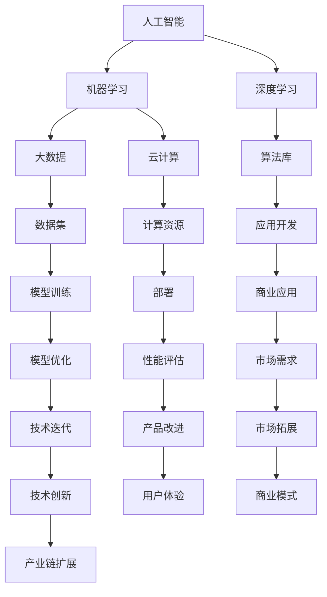

                 

AI创业生态的日益丰富是一个显著的趋势，不仅影响了技术创新的步伐，也加速了整个产业链的扩展。在本文中，我们将探讨这一生态系统的演变，分析其核心概念、算法原理、数学模型、项目实践以及未来应用场景。通过深入解析，我们希望能够为读者提供一个全面的理解，并激发对这一领域的进一步思考。

## 关键词 Keywords

- AI创业
- 产业链
- 技术创新
- 核心概念
- 算法
- 数学模型
- 项目实践
- 未来展望

## 摘要 Abstract

本文旨在探讨人工智能（AI）创业生态的丰富性和扩展性。通过对核心概念、算法原理、数学模型的深入分析，以及项目实践和未来应用场景的探讨，文章旨在为读者提供对AI创业生态系统全面而深刻的理解。同时，本文还将展望AI创业生态在未来可能面临的发展趋势和挑战。

## 1. 背景介绍 Background

人工智能作为21世纪最具颠覆性的技术之一，正以前所未有的速度改变着各行各业。随着计算能力的提升、数据量的爆炸式增长以及算法的不断进步，AI技术已经从理论研究走向了实际应用，并在医疗、金融、教育、交通等领域取得了显著成果。这一过程中，AI创业生态也经历了显著的变化。

在早期，AI创业主要集中在基础研究和算法开发领域。然而，随着技术的不断成熟，AI创业生态逐渐丰富，产业链也在不断扩展。从硬件设备到软件平台，从数据集到算法库，再到AI应用解决方案，AI创业生态已经形成了一个完整的产业链。这不仅为创业者提供了丰富的机会，也推动了整个产业的快速发展。

## 2. 核心概念与联系 Core Concepts and Relationships

为了更好地理解AI创业生态的丰富性和扩展性，我们需要先了解其中的核心概念及其相互关系。

### 2.1 核心概念

- **人工智能（AI）**：一种模拟人类智能的计算机系统，能够执行复杂的任务，如语音识别、图像识别、自然语言处理等。
- **机器学习（ML）**：一种AI技术，通过数据和算法让计算机自主学习和改进。
- **深度学习（DL）**：一种基于多层神经网络的机器学习技术，能够在大量数据中自动发现模式和特征。
- **大数据（Big Data）**：指无法使用常规软件工具在合理时间内进行捕捉、管理和处理的大量数据。
- **云计算（Cloud Computing）**：通过互联网提供动态可伸缩且经常是虚拟化的资源。

### 2.2 概念联系

核心概念之间的联系可以用以下Mermaid流程图来表示：



通过上述流程图，我们可以看到AI创业生态中的核心概念是如何相互联系和影响的。

## 3. 核心算法原理 & 具体操作步骤 Core Algorithm Principles & Detailed Steps

### 3.1 算法原理概述

在AI创业生态中，算法是核心驱动力之一。以下是一些常见的核心算法及其原理概述：

- **神经网络（Neural Networks）**：模拟人脑神经元连接的计算机模型，用于图像识别、语音识别等。
- **支持向量机（SVM）**：一种二类分类模型，通过找到一个最佳的超平面来分隔数据。
- **决策树（Decision Trees）**：一种树形结构，用于分类和回归分析。
- **聚类算法（Clustering Algorithms）**：用于发现数据集中的隐含结构，如K-means、层次聚类等。

### 3.2 算法步骤详解

以下以神经网络为例，介绍其具体操作步骤：

1. **数据预处理**：
   - 数据清洗：去除噪声和异常值。
   - 数据归一化：将数据缩放到同一范围内，便于模型训练。

2. **初始化权重和偏置**：
   - 权重（weights）：连接神经元之间的参数。
   - 偏置（biases）：每个神经元的内部偏置。

3. **前向传播（Forward Propagation）**：
   - 输入数据通过神经网络，计算每个神经元的输出。
   - 使用激活函数（如ReLU、Sigmoid、Tanh）引入非线性。

4. **计算损失函数**：
   - 损失函数用于衡量模型预测值与实际值之间的差异。
   - 常见损失函数有均方误差（MSE）、交叉熵（Cross-Entropy）等。

5. **反向传播（Backpropagation）**：
   - 计算损失函数关于每个权重的梯度。
   - 更新权重和偏置，以减少损失。

6. **迭代优化**：
   - 重复前向传播和反向传播，直到满足停止条件（如损失降低到某个阈值或迭代次数达到预设值）。

### 3.3 算法优缺点

- **优点**：
  - **强大的表达能力和泛化能力**：神经网络可以学习复杂的数据模式。
  - **自适应性和灵活性**：可以通过调整网络结构和参数来适应不同的任务和数据。

- **缺点**：
  - **计算复杂度高**：训练时间较长，资源消耗大。
  - **对数据质量敏感**：噪声和异常值可能影响模型性能。

### 3.4 算法应用领域

- **图像识别**：如人脸识别、图像分类等。
- **自然语言处理**：如文本分类、机器翻译等。
- **推荐系统**：如商品推荐、内容推荐等。

## 4. 数学模型和公式 Mathematical Models and Formulas

在AI创业生态中，数学模型是算法的基础。以下介绍一些常见的数学模型和公式，并提供详细讲解和举例说明。

### 4.1 数学模型构建

- **线性回归（Linear Regression）**：

$$
y = \beta_0 + \beta_1x
$$

- **逻辑回归（Logistic Regression）**：

$$
\hat{p} = \frac{1}{1 + e^{-(\beta_0 + \beta_1x)}}
$$

- **神经网络（Neural Networks）**：

$$
a_{ij}^{(l)} = \sigma \left( \sum_{k} w_{ik}^{(l)} a_{kj}^{(l-1)} + b_j^{(l)} \right)
$$

其中，$a_{ij}^{(l)}$ 是第$l$层的第$i$个神经元的输出，$\sigma$ 是激活函数，$w_{ik}^{(l)}$ 是连接第$l-1$层第$k$个神经元和第$l$层第$i$个神经元的权重，$b_j^{(l)}$ 是第$l$层第$j$个神经元的偏置。

### 4.2 公式推导过程

- **线性回归**：

线性回归的目标是最小化预测值与实际值之间的差异。假设我们有一个数据集$\{x_i, y_i\}$，其中$x_i$是自变量，$y_i$是因变量。线性回归的目标是最小化以下损失函数：

$$
J(\theta) = \frac{1}{2m} \sum_{i=1}^{m} (h_\theta(x_i) - y_i)^2
$$

其中，$h_\theta(x) = \theta_0 + \theta_1x$ 是线性回归模型，$\theta = [\theta_0, \theta_1]^T$ 是模型参数。

对损失函数关于$\theta$求偏导，并令其等于0，可以得到：

$$
\frac{\partial J(\theta)}{\partial \theta_0} = \frac{1}{m} \sum_{i=1}^{m} (h_\theta(x_i) - y_i) = 0
$$

$$
\frac{\partial J(\theta)}{\partial \theta_1} = \frac{1}{m} \sum_{i=1}^{m} (h_\theta(x_i) - y_i)x_i = 0
$$

解上述方程组，可以得到最优参数$\theta^*$。

- **逻辑回归**：

逻辑回归是一种二分类模型，其目标是最小化预测概率与实际标签之间的差异。假设我们有一个数据集$\{x_i, y_i\}$，其中$y_i$为二分类标签（0或1），$h_\theta(x) = \frac{1}{1 + e^{-(\theta_0 + \theta_1x)}}$ 是逻辑回归模型，$\theta = [\theta_0, \theta_1]^T$ 是模型参数。

损失函数可以使用对数损失函数（Log-Loss）：

$$
J(\theta) = \frac{1}{m} \sum_{i=1}^{m} -y_i \log(h_\theta(x_i)) - (1 - y_i) \log(1 - h_\theta(x_i))
$$

对损失函数关于$\theta$求偏导，并令其等于0，可以得到：

$$
\frac{\partial J(\theta)}{\partial \theta_0} = \frac{1}{m} \sum_{i=1}^{m} (h_\theta(x_i) - y_i)
$$

$$
\frac{\partial J(\theta)}{\partial \theta_1} = \frac{1}{m} \sum_{i=1}^{m} (h_\theta(x_i) - y_i)x_i
$$

解上述方程组，可以得到最优参数$\theta^*$。

- **神经网络**：

神经网络是一种多层前馈网络，其目标是学习输入和输出之间的非线性关系。假设我们有一个三层神经网络，包括输入层、隐藏层和输出层，其中$a_{ij}^{(l)}$ 是第$l$层的第$i$个神经元的输出，$w_{ik}^{(l)}$ 是连接第$l-1$层第$k$个神经元和第$l$层第$i$个神经元的权重，$b_j^{(l)}$ 是第$l$层第$j$个神经元的偏置，$\sigma$ 是激活函数。

前向传播过程中，我们可以使用链式法则来计算每个神经元的梯度。例如，对于输出层第$k$个神经元的梯度，可以表示为：

$$
\frac{\partial J}{\partial z_k^{(3)}} = \frac{\partial J}{\partial a_k^{(3)}} \frac{\partial a_k^{(3)}}{\partial z_k^{(3)}}
$$

其中，$z_k^{(3)} = \sum_{i} w_{ik}^{(3)} a_{ij}^{(2)} + b_k^{(3)}$，$a_k^{(3)} = \sigma(z_k^{(3)})$。

反向传播过程中，我们可以使用反向链式法则来计算每个权重的梯度。例如，对于隐藏层第$l$层第$k$个神经元到第$l+1$层第$i$个神经元的权重，可以表示为：

$$
\frac{\partial J}{\partial w_{ik}^{(l+1)}} = \frac{\partial J}{\partial z_i^{(l+1)}} \frac{\partial z_i^{(l+1)}}{\partial w_{ik}^{(l+1)}}
$$

$$
\frac{\partial z_i^{(l+1)}}{\partial w_{ik}^{(l+1)}} = a_{ik}^{(l)}
$$

通过反向传播，我们可以计算整个神经网络的梯度，并使用梯度下降法来更新权重和偏置。

### 4.3 案例分析与讲解

以下以一个简单的线性回归模型为例，介绍数学模型的构建和求解过程。

假设我们有一个包含两个特征的数据集$\{x_i, y_i\}$，其中$x_i$为输入特征，$y_i$为输出标签。我们使用线性回归模型来预测$y_i$。

1. **数据预处理**：

首先，我们对数据进行归一化处理，将每个特征缩放到[0, 1]范围内。

2. **初始化参数**：

初始化线性回归模型的参数$\theta = [\theta_0, \theta_1]^T$，我们可以使用随机初始化或启发式初始化方法。

3. **前向传播**：

对于每个样本$(x_i, y_i)$，我们计算预测值：

$$
h_\theta(x_i) = \theta_0 + \theta_1x_i
$$

4. **计算损失函数**：

计算预测值与实际值之间的差异，使用均方误差（MSE）作为损失函数：

$$
J(\theta) = \frac{1}{2m} \sum_{i=1}^{m} (h_\theta(x_i) - y_i)^2
$$

5. **反向传播**：

计算损失函数关于$\theta_0$和$\theta_1$的梯度：

$$
\frac{\partial J}{\partial \theta_0} = \frac{1}{m} \sum_{i=1}^{m} (h_\theta(x_i) - y_i)
$$

$$
\frac{\partial J}{\partial \theta_1} = \frac{1}{m} \sum_{i=1}^{m} (h_\theta(x_i) - y_i)x_i
$$

6. **迭代优化**：

使用梯度下降法更新参数：

$$
\theta_0 := \theta_0 - \alpha \frac{\partial J}{\partial \theta_0}
$$

$$
\theta_1 := \theta_1 - \alpha \frac{\partial J}{\partial \theta_1}
$$

其中，$\alpha$ 是学习率。

重复上述步骤，直到损失函数收敛或达到预设的迭代次数。

通过上述步骤，我们可以使用线性回归模型来预测输出标签$y_i$。在实际应用中，我们可以使用更复杂的模型和更先进的技术来提高预测性能。

## 5. 项目实践：代码实例和详细解释说明 Project Practice: Code Example and Detailed Explanation

在本节中，我们将通过一个简单的机器学习项目实例来展示AI创业生态中的实际应用。我们将使用Python编程语言和scikit-learn库来实现一个线性回归模型，并详细解释每一步的代码和操作。

### 5.1 开发环境搭建

在开始项目之前，我们需要搭建一个适合Python开发的环境。以下是搭建开发环境的步骤：

1. **安装Python**：从Python官方网站下载并安装Python 3.x版本。
2. **安装Jupyter Notebook**：Python的交互式开发环境，通过命令行安装：

   ```
   pip install notebook
   ```

3. **安装scikit-learn**：Python的机器学习库，通过命令行安装：

   ```
   pip install scikit-learn
   ```

4. **启动Jupyter Notebook**：在命令行中运行以下命令：

   ```
   jupyter notebook
   ```

### 5.2 源代码详细实现

下面是完整的代码实现：

```python
# 导入必要的库
import numpy as np
from sklearn.model_selection import train_test_split
from sklearn.linear_model import LinearRegression
from sklearn.metrics import mean_squared_error

# 生成模拟数据集
np.random.seed(0)
X = np.random.rand(100, 1)
y = 2 + 3 * X + np.random.randn(100, 1)

# 划分训练集和测试集
X_train, X_test, y_train, y_test = train_test_split(X, y, test_size=0.2, random_state=0)

# 初始化线性回归模型
model = LinearRegression()

# 训练模型
model.fit(X_train, y_train)

# 预测测试集结果
y_pred = model.predict(X_test)

# 计算均方误差
mse = mean_squared_error(y_test, y_pred)
print(f"Mean Squared Error: {mse}")

# 可视化结果
import matplotlib.pyplot as plt

plt.scatter(X_test, y_test, color='blue')
plt.plot(X_test, y_pred, color='red', linewidth=2)
plt.show()
```

### 5.3 代码解读与分析

1. **导入库**：
   - `numpy`：用于数值计算和数据处理。
   - `sklearn.model_selection`：用于数据集划分。
   - `sklearn.linear_model`：用于线性回归模型。
   - `sklearn.metrics`：用于评估模型性能。
   - `matplotlib.pyplot`：用于数据可视化。

2. **生成模拟数据集**：
   - 使用`numpy`生成包含100个样本的数据集，每个样本有一个特征和一个标签。

3. **划分训练集和测试集**：
   - 使用`train_test_split`将数据集划分为80%的训练集和20%的测试集。

4. **初始化线性回归模型**：
   - 使用`LinearRegression`类创建线性回归模型实例。

5. **训练模型**：
   - 使用`fit`方法训练模型，根据训练集数据计算参数。

6. **预测测试集结果**：
   - 使用`predict`方法对测试集数据进行预测。

7. **计算均方误差**：
   - 使用`mean_squared_error`计算预测值与实际值之间的差异，并打印结果。

8. **可视化结果**：
   - 使用`scatter`绘制测试集真实值，使用`plot`绘制预测值，展示线性回归模型的效果。

### 5.4 运行结果展示

运行上述代码后，我们会在控制台看到均方误差的输出，同时在Jupyter Notebook中展示一个散点图和拟合直线。散点图显示了测试集中的真实值，拟合直线显示了线性回归模型对测试集的预测结果。通过观察散点图和拟合直线，我们可以直观地看到模型的预测性能。

## 6. 实际应用场景 Practical Application Scenarios

AI创业生态的丰富性不仅体现在技术创新上，更体现在其实际应用场景的多样性。以下是一些典型的应用场景：

- **医疗健康**：AI技术可以用于疾病预测、诊断和治疗。例如，通过分析大量医学影像数据，AI模型可以早期发现癌症等疾病。
- **金融科技**：AI技术可以用于风险评估、投资策略制定和欺诈检测。例如，通过分析用户行为和交易数据，AI模型可以预测潜在的风险和欺诈行为。
- **智能制造**：AI技术可以用于生产线优化、设备维护和供应链管理。例如，通过实时监测生产线设备状态，AI模型可以预测设备故障并提前进行维护。
- **智慧城市**：AI技术可以用于交通管理、环境保护和公共安全。例如，通过实时分析交通流量数据，AI模型可以优化交通信号灯配置，减少交通拥堵。

## 7. 工具和资源推荐 Tools and Resources Recommendations

为了更好地掌握AI创业生态的相关技术，以下是一些推荐的学习资源和开发工具：

### 7.1 学习资源推荐

- **书籍**：
  - 《Python机器学习》
  - 《深度学习》
  - 《统计学习方法》
- **在线课程**：
  - Coursera上的《机器学习》
  - edX上的《深度学习基础》
  - Udacity的《人工智能工程师纳米学位》
- **教程和博客**：
  - fast.ai的《深度学习教程》
  - Medium上的AI博客
  - GitHub上的开源机器学习项目

### 7.2 开发工具推荐

- **编程环境**：
  - Jupyter Notebook
  - PyCharm
  - Visual Studio Code
- **机器学习库**：
  - Scikit-learn
  - TensorFlow
  - PyTorch
- **数据可视化工具**：
  - Matplotlib
  - Seaborn
  - Plotly

### 7.3 相关论文推荐

- **论文集**：
  - 《Nature》上的《机器学习》专题论文集
  - 《Science》上的《人工智能》专题论文集
- **顶级会议论文**：
  - NeurIPS
  - ICML
  - CVPR
  - KDD

## 8. 总结：未来发展趋势与挑战 Conclusion: Future Trends and Challenges

### 8.1 研究成果总结

AI创业生态的丰富性和扩展性已经取得了显著的成果。从技术创新到实际应用，AI技术正在深刻改变着各行各业。同时，随着计算能力的提升、数据量的增加和算法的优化，AI创业生态的潜力和价值也在不断提升。

### 8.2 未来发展趋势

- **计算能力提升**：随着量子计算的进步，未来AI的计算能力将得到极大的提升，为更复杂的AI应用提供可能。
- **数据隐私和安全**：随着数据隐私和安全的关注不断增加，未来AI技术将在数据保护和隐私保护方面取得更多突破。
- **跨学科融合**：AI技术将与其他学科（如生物学、心理学、社会学等）深度融合，推动新兴领域的诞生。
- **人机协同**：AI技术将更好地与人类协作，提升工作效率和生活质量。

### 8.3 面临的挑战

- **数据隐私和安全**：随着数据量的增加和数据的敏感性，如何保护数据隐私和安全是一个重大挑战。
- **算法透明性和可解释性**：随着AI技术的广泛应用，如何提高算法的透明性和可解释性，使其更加可靠和可信是一个重要问题。
- **技术标准化和法规**：随着AI技术的快速发展，如何制定统一的技术标准和法规，确保AI技术的健康发展和应用是一个挑战。

### 8.4 研究展望

未来，AI创业生态将继续丰富和扩展。通过技术创新、跨学科融合和行业合作，AI技术将更好地服务于社会，推动人类社会的进步。同时，我们也需要关注AI创业生态中的挑战，积极应对，为未来的发展做好准备。

## 9. 附录：常见问题与解答 Appendices: Frequently Asked Questions and Answers

### 9.1 什么是AI创业生态？

AI创业生态是指围绕人工智能技术的一套产业链，包括基础研究、技术开发、产品应用等多个环节。它涵盖了从硬件设备到软件平台，从数据集到算法库，再到AI应用解决方案的各个环节。

### 9.2 AI创业生态中的核心概念有哪些？

核心概念包括人工智能（AI）、机器学习（ML）、深度学习（DL）、大数据（Big Data）、云计算（Cloud Computing）等。

### 9.3 如何实现一个简单的机器学习模型？

可以使用Python编程语言和相应的机器学习库（如scikit-learn、TensorFlow、PyTorch）来实现简单的机器学习模型。首先，导入必要的库；然后，准备数据集；接着，初始化模型；训练模型；最后，评估模型性能。

### 9.4 AI技术在医疗健康领域的应用有哪些？

AI技术在医疗健康领域有广泛的应用，包括疾病预测、诊断和治疗。例如，通过分析医学影像数据，AI模型可以早期发现癌症等疾病；通过分析患者的电子健康记录，AI模型可以提供个性化的治疗方案。

### 9.5 未来AI创业生态的发展趋势是什么？

未来AI创业生态的发展趋势包括计算能力的提升、数据隐私和安全、跨学科融合、人机协同等。通过技术创新和行业合作，AI技术将更好地服务于社会，推动人类社会的进步。

### 9.6 面临的主要挑战有哪些？

面临的主要挑战包括数据隐私和安全、算法透明性和可解释性、技术标准化和法规等。这些挑战需要通过技术进步和政策法规的完善来应对。

---

通过本文的深入探讨，我们希望读者能够对AI创业生态的丰富性和扩展性有更全面的理解，并能够从中汲取灵感和启示，为未来的AI创业之路奠定坚实的基础。

