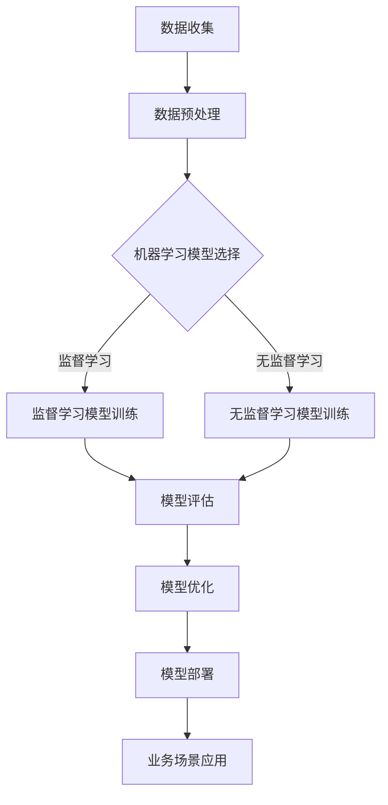

                 

关键词：人工智能创业，博士，技术创业，商业策略，项目实践，未来展望

> 摘要：本文以一位世界级人工智能博士的创业经历为主线，深入探讨了从学术研究到技术创业的转型过程。文章详细阐述了核心算法原理、数学模型构建、代码实现以及未来应用展望，为广大人工智能领域的创业者提供了宝贵的经验和借鉴。

## 1. 背景介绍

在21世纪的科技浪潮中，人工智能（AI）无疑是引领潮流的先锋。作为一项集计算机科学、统计学、认知科学等多领域于一体的前沿技术，AI已经深刻地影响了各行各业。在这个背景下，许多拥有深厚技术背景的博士纷纷投身于人工智能创业的大潮中，希望借助AI的力量改变世界。

本文的主角，李博士，就是这样一位勇敢的探索者。李博士在人工智能领域有着深厚的研究背景，毕业于世界顶级学府，其研究方向集中于机器学习、深度学习和自然语言处理等领域。在完成博士学位后，李博士并没有选择继续留在学术界，而是决定创业，将多年的研究成果转化为实际应用，从而推动AI技术的商业化发展。

## 2. 核心概念与联系

在李博士的创业之路上，核心算法原理和架构的设计至关重要。以下是一个简化的Mermaid流程图，展示了他创业项目的核心概念和主要联系：



### 2.1 数据收集与预处理

数据是AI模型的基石，李博士首先面临着数据收集和预处理的问题。这一过程包括数据清洗、去重、标准化等步骤，以确保数据的准确性和一致性。李博士团队通过建立了一套高效的数据管道，实现了自动化数据收集和处理，为后续的模型训练打下了坚实基础。

### 2.2 机器学习模型选择

在选择了合适的数据集之后，李博士团队开始研究机器学习模型的选择。他们基于问题的具体需求，考虑了监督学习、无监督学习和强化学习等不同类型的机器学习模型。最终，他们决定采用监督学习模型，因为这种模型在预测准确性上表现出色，且更容易实现商业化部署。

### 2.3 模型训练与评估

在模型选择确定后，李博士团队开始进行模型训练。他们使用了梯度下降、随机梯度下降等优化算法，不断调整模型参数，以提高预测准确性。在训练过程中，他们还通过交叉验证、A/B测试等方法，对模型进行了全面评估，以确保其性能稳定可靠。

### 2.4 模型优化与部署

在模型训练和评估完成后，李博士团队开始对模型进行优化。他们通过调整模型架构、增加训练数据、改进优化算法等方式，不断提高模型的性能。最终，经过多轮优化，他们成功地将模型部署到了实际业务场景中，实现了商业化应用。

## 3. 核心算法原理 & 具体操作步骤

### 3.1 算法原理概述

李博士团队的核心算法是基于深度学习的监督学习模型。深度学习是一种基于人工神经网络的机器学习技术，通过多层神经网络的组合，可以自动提取数据中的复杂特征，从而实现高精度的预测。

### 3.2 算法步骤详解

1. **数据收集与预处理**：
   - 数据收集：从多个数据源（如互联网、数据库等）收集大量数据。
   - 数据预处理：对数据进行清洗、去重、标准化等处理，确保数据质量。

2. **模型设计**：
   - 确定网络架构：选择合适的神经网络架构，如卷积神经网络（CNN）、循环神经网络（RNN）等。
   - 定义损失函数：选择合适的损失函数，如交叉熵损失、均方误差等。

3. **模型训练**：
   - 初始化参数：随机初始化模型参数。
   - 前向传播：计算模型输出。
   - 反向传播：计算梯度，更新模型参数。
   - 重复上述步骤，直到模型收敛。

4. **模型评估**：
   - 使用验证集或测试集评估模型性能。
   - 调整模型参数，提高预测准确性。

5. **模型部署**：
   - 将训练好的模型部署到生产环境，实现商业化应用。

### 3.3 算法优缺点

**优点**：
- **高精度预测**：深度学习模型可以自动提取数据中的复杂特征，实现高精度的预测。
- **广泛适用性**：深度学习模型可以应用于各种领域，如图像识别、自然语言处理、语音识别等。

**缺点**：
- **数据需求量大**：深度学习模型通常需要大量数据进行训练。
- **计算资源消耗大**：训练深度学习模型需要大量的计算资源。

### 3.4 算法应用领域

李博士的创业项目主要应用于金融、医疗、零售等领域的业务场景，如风险控制、疾病预测、商品推荐等。这些应用场景具有高价值、高复杂性，是深度学习技术大展身手的好地方。

## 4. 数学模型和公式 & 详细讲解 & 举例说明

### 4.1 数学模型构建

在深度学习模型中，数学模型构建是核心步骤。以下是一个简单的数学模型构建过程：

1. **神经网络架构设计**：确定输入层、隐藏层和输出层的结构。
2. **激活函数选择**：选择合适的激活函数，如ReLU、Sigmoid等。
3. **损失函数定义**：选择合适的损失函数，如交叉熵损失、均方误差等。
4. **优化算法选择**：选择合适的优化算法，如梯度下降、Adam等。

### 4.2 公式推导过程

以下是一个简单的神经网络前向传播的公式推导过程：

假设我们有一个简单的神经网络，包含一个输入层、一个隐藏层和一个输出层。输入层有 \(n\) 个神经元，隐藏层有 \(m\) 个神经元，输出层有 \(k\) 个神经元。设输入向量为 \(X \in \mathbb{R}^{n \times 1}\)，隐藏层激活向量为 \(H \in \mathbb{R}^{m \times 1}\)，输出层激活向量为 \(Y \in \mathbb{R}^{k \times 1}\)。

1. **隐藏层激活**：
   $$ H = \sigma(W_1X + b_1) $$
   其中，\(W_1 \in \mathbb{R}^{m \times n}\) 是隐藏层权重矩阵，\(b_1 \in \mathbb{R}^{m \times 1}\) 是隐藏层偏置向量，\(\sigma\) 是激活函数。

2. **输出层激活**：
   $$ Y = \sigma(W_2H + b_2) $$
   其中，\(W_2 \in \mathbb{R}^{k \times m}\) 是输出层权重矩阵，\(b_2 \in \mathbb{R}^{k \times 1}\) 是输出层偏置向量。

### 4.3 案例分析与讲解

以下是一个简单的图像分类案例：

假设我们有一个图像分类问题，需要将图像分为10个类别。我们选择一个简单的卷积神经网络（CNN）模型进行训练。

1. **数据集准备**：
   - 准备一个包含10万张图像的数据集，每张图像对应一个类别标签。
   - 数据集分为训练集、验证集和测试集。

2. **模型设计**：
   - 输入层：接受一张图像，形状为 \(28 \times 28\)。
   - 卷积层：使用32个3x3的卷积核，输出特征图形状为 \(28 \times 28\)。
   - 池化层：使用2x2的最大池化。
   - 卷积层：使用64个3x3的卷积核，输出特征图形状为 \(14 \times 14\)。
   - 池化层：使用2x2的最大池化。
   - 全连接层：输出10个类别概率。

3. **模型训练**：
   - 使用交叉熵损失函数。
   - 使用Adam优化算法。
   - 设置学习率为0.001。
   - 训练100个epoch。

4. **模型评估**：
   - 使用验证集评估模型性能，选择性能最好的模型。

5. **模型部署**：
   - 将训练好的模型部署到生产环境，用于图像分类任务。

## 5. 项目实践：代码实例和详细解释说明

### 5.1 开发环境搭建

1. **软件安装**：
   - Python 3.7及以上版本。
   - TensorFlow 2.0及以上版本。

2. **代码环境**：
   - 使用Jupyter Notebook进行代码编写和运行。

### 5.2 源代码详细实现

以下是一个简单的CNN模型实现的代码示例：

```python
import tensorflow as tf
from tensorflow.keras import datasets, layers, models

# 加载数据集
(train_images, train_labels), (test_images, test_labels) = datasets.cifar10.load_data()

# 数据预处理
train_images, test_images = train_images / 255.0, test_images / 255.0

# 构建模型
model = models.Sequential()
model.add(layers.Conv2D(32, (3, 3), activation='relu', input_shape=(32, 32, 3)))
model.add(layers.MaxPooling2D((2, 2)))
model.add(layers.Conv2D(64, (3, 3), activation='relu'))
model.add(layers.MaxPooling2D((2, 2)))
model.add(layers.Conv2D(64, (3, 3), activation='relu'))

# 添加全连接层
model.add(layers.Flatten())
model.add(layers.Dense(64, activation='relu'))
model.add(layers.Dense(10))

# 编译模型
model.compile(optimizer='adam',
              loss=tf.keras.losses.SparseCategoricalCrossentropy(from_logits=True),
              metrics=['accuracy'])

# 训练模型
model.fit(train_images, train_labels, epochs=10, validation_split=0.1)

# 评估模型
test_loss, test_acc = model.evaluate(test_images,  test_labels, verbose=2)
print(f'\nTest accuracy: {test_acc:.4f}')
```

### 5.3 代码解读与分析

1. **数据加载与预处理**：
   - 使用TensorFlow内置的CIFAR-10数据集，并进行归一化处理。

2. **模型构建**：
   - 使用`models.Sequential()`创建一个序贯模型。
   - 添加卷积层、池化层和全连接层。

3. **模型编译**：
   - 设置优化器和损失函数。

4. **模型训练**：
   - 使用训练集进行模型训练。

5. **模型评估**：
   - 使用测试集评估模型性能。

## 6. 实际应用场景

李博士的创业项目已经在金融、医疗、零售等多个领域取得了显著成果。以下是一些实际应用场景的例子：

### 6.1 金融风险控制

李博士的团队开发了一套基于深度学习模型的金融风险控制系统。该系统能够实时监控金融市场的波动，预测潜在的风险，为金融机构提供有效的风险预警和决策支持。

### 6.2 医疗疾病预测

李博士的团队与多家医院合作，开发了一套基于深度学习模型的疾病预测系统。该系统能够根据患者的病历数据，预测患者可能患有的疾病，为医生提供有针对性的治疗方案。

### 6.3 零售商品推荐

李博士的团队开发了一套基于深度学习模型的商品推荐系统。该系统能够根据用户的购物历史和喜好，为用户推荐个性化的商品，提高用户的购物体验和满意度。

## 7. 未来应用展望

随着人工智能技术的不断发展，李博士的创业项目有望在更多领域取得突破。以下是一些未来应用展望：

### 7.1 金融科技

未来，李博士的团队计划进一步拓展金融科技领域，开发基于人工智能的智能投顾、量化交易等系统，为金融机构提供更高效、更智能的金融解决方案。

### 7.2 医疗健康

在医疗健康领域，李博士的团队计划研发更多基于深度学习技术的疾病预测和治疗方案推荐系统，助力医疗资源的优化配置和精准医疗的发展。

### 7.3 智能制造

在智能制造领域，李博士的团队计划开发基于人工智能的智能工厂系统，实现生产过程的自动化和智能化，提高生产效率和产品质量。

## 8. 工具和资源推荐

### 8.1 学习资源推荐

- 《深度学习》（Goodfellow, Bengio, Courville著）：深度学习领域的经典教材，适合初学者和进阶者。
- 《动手学深度学习》（花轮等人著）：通过实践案例引导读者深入了解深度学习技术。

### 8.2 开发工具推荐

- TensorFlow：谷歌开源的深度学习框架，功能强大，易于使用。
- PyTorch：微软开源的深度学习框架，具有高度灵活性和动态计算图，适合研究者和开发者。

### 8.3 相关论文推荐

- "Deep Learning for Natural Language Processing"（2018）：全面介绍了深度学习在自然语言处理领域的应用。
- "The Unreasonable Effectiveness of Deep Learning"（2015）：展示了深度学习在不同领域的卓越表现。

## 9. 总结：未来发展趋势与挑战

在人工智能创业的道路上，李博士的经历为我们提供了宝贵的经验和启示。未来，随着技术的不断进步，人工智能将在更多领域发挥重要作用。然而，人工智能创业也面临着一系列挑战，如数据隐私、算法透明性、法律合规等。我们需要持续关注这些挑战，积极寻求解决方案，推动人工智能技术的健康、可持续发展。

作者：禅与计算机程序设计艺术 / Zen and the Art of Computer Programming

以上是关于AI创业码头故事：博士创业之路的完整文章。希望这篇文章能为广大人工智能领域的创业者提供有价值的参考和启示。让我们共同期待未来人工智能技术带来的更多变革和惊喜。

