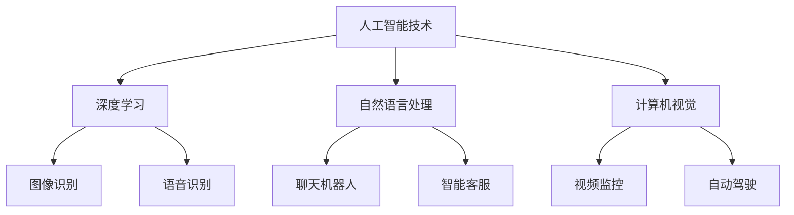
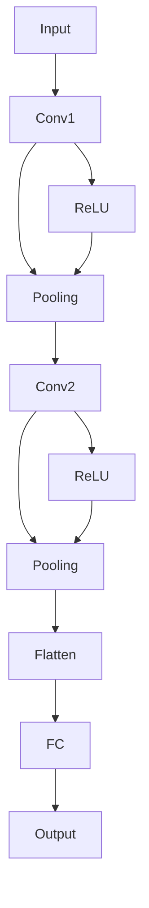

                 

关键词：人工智能、创业者、垂直领域、技术创新、商业机会

> 摘要：随着人工智能技术的飞速发展，垂直领域的创新应用成为创业者们的新风口。本文将探讨人工智能在各个垂直领域的机遇，分析其潜在的商业价值，并展望未来的发展趋势。

## 1. 背景介绍

### 1.1 人工智能的发展历程

人工智能（AI）作为计算机科学的一个分支，起源于20世纪50年代。自那时起，AI经历了多个发展阶段，包括早期的符号主义、专家系统、连接主义等。近年来，随着深度学习、自然语言处理、计算机视觉等领域的突破，人工智能迎来了新一轮的发展高峰。

### 1.2 人工智能的应用现状

目前，人工智能已渗透到各行各业，如医疗、金融、教育、制造业等。AI技术的应用不仅提高了行业的效率，也创造了新的商业模式。例如，智能医疗诊断系统可以辅助医生进行疾病检测，而金融领域的智能投顾则为投资者提供了更精准的投资建议。

## 2. 核心概念与联系

为了更好地理解人工智能在垂直领域的应用，我们需要先了解几个核心概念：

### 2.1 深度学习

深度学习是人工智能的一个重要分支，通过模拟人脑的神经网络结构进行学习和决策。深度学习在图像识别、语音识别等领域取得了显著的成果。

### 2.2 自然语言处理

自然语言处理（NLP）旨在使计算机能够理解、生成和处理人类语言。NLP在聊天机器人、智能客服、内容审核等领域具有广泛的应用。

### 2.3 计算机视觉

计算机视觉是人工智能的一个分支，致力于让计算机能够像人一样理解视觉信息。计算机视觉在图像识别、视频监控、自动驾驶等领域具有重要应用。

以下是人工智能在垂直领域应用的 Mermaid 流程图：



## 3. 核心算法原理 & 具体操作步骤

### 3.1 算法原理概述

在人工智能的各个垂直领域，核心算法的原理和技术各有不同。以下简要介绍几个关键算法的原理：

#### 3.1.1 深度学习算法

深度学习算法的核心是神经网络，通过多层神经网络对数据进行特征提取和分类。常用的深度学习算法包括卷积神经网络（CNN）和循环神经网络（RNN）。

#### 3.1.2 自然语言处理算法

自然语言处理算法主要包括词向量表示、语言模型、文本分类等。词向量表示如 Word2Vec 和 GloVe 可以将文本转换为向量，语言模型如 LSTM 和 Transformer 可以对文本进行建模。

#### 3.1.3 计算机视觉算法

计算机视觉算法主要包括图像识别、目标检测、图像分割等。常用的算法如 R-CNN、YOLO、Faster R-CNN 等可以对图像中的对象进行识别和定位。

### 3.2 算法步骤详解

以下是人工智能在垂直领域应用的详细步骤：

#### 3.2.1 深度学习算法步骤

1. 数据预处理：对图像、文本或语音数据进行归一化、去噪等处理。
2. 构建模型：根据任务需求选择合适的神经网络结构，如 CNN、RNN 或 Transformer。
3. 训练模型：使用训练数据对模型进行训练，调整模型参数以优化性能。
4. 评估模型：使用验证数据评估模型性能，调整模型参数以进一步提高性能。
5. 应用模型：将训练好的模型应用于实际问题中，如图像识别、语音识别或自然语言处理。

#### 3.2.2 自然语言处理算法步骤

1. 数据预处理：对文本数据进行分词、去停用词等处理。
2. 词向量表示：将文本转换为向量表示，如使用 Word2Vec 或 GloVe。
3. 构建模型：选择合适的神经网络结构，如 LSTM、GRU 或 Transformer。
4. 训练模型：使用训练数据对模型进行训练。
5. 评估模型：使用验证数据评估模型性能。
6. 应用模型：将训练好的模型应用于实际问题中，如聊天机器人、智能客服或内容审核。

#### 3.2.3 计算机视觉算法步骤

1. 数据预处理：对图像数据进行归一化、增强等处理。
2. 构建模型：选择合适的神经网络结构，如 CNN、R-CNN 或 YOLO。
3. 训练模型：使用训练数据对模型进行训练。
4. 评估模型：使用验证数据评估模型性能。
5. 应用模型：将训练好的模型应用于实际问题中，如图像识别、视频监控或自动驾驶。

### 3.3 算法优缺点

以下是人工智能在垂直领域应用的算法优缺点：

#### 3.3.1 深度学习算法

优点：
- 强大的特征提取能力
- 自动化学习过程，减少了人工干预

缺点：
- 需要大量的训练数据
- 模型参数调整复杂，训练时间长

#### 3.3.2 自然语言处理算法

优点：
- 可以处理变长的文本数据
- 对语言理解和生成具有较好的效果

缺点：
- 需要大量的标注数据
- 对低资源语言的适应性较差

#### 3.3.3 计算机视觉算法

优点：
- 可以处理图像和视频数据
- 在物体识别、目标检测等领域具有广泛的应用

缺点：
- 对光照、姿态变化等条件较为敏感
- 需要大量的计算资源

### 3.4 算法应用领域

人工智能算法在垂直领域的应用如下：

#### 3.4.1 医疗领域

- 医疗图像分析：使用深度学习算法对医学图像进行分析，如肿瘤检测、骨折检测等。
- 病历处理：使用自然语言处理算法对病历进行自动处理，提高医疗效率。

#### 3.4.2 金融领域

- 智能投顾：使用深度学习算法分析市场数据，为投资者提供个性化的投资建议。
- 风险控制：使用计算机视觉算法对金融交易进行实时监控，防止欺诈行为。

#### 3.4.3 教育领域

- 智能辅导：使用自然语言处理算法为学生提供个性化的学习辅导。
- 课堂管理：使用计算机视觉算法对课堂行为进行监控，提高教学效果。

#### 3.4.4 制造业领域

- 智能工厂：使用计算机视觉算法对生产线进行实时监控，提高生产效率。
- 质量控制：使用深度学习算法对产品质量进行自动检测。

## 4. 数学模型和公式 & 详细讲解 & 举例说明

### 4.1 数学模型构建

在人工智能的应用中，数学模型扮演着至关重要的角色。以下介绍几个常用的数学模型：

#### 4.1.1 卷积神经网络（CNN）

卷积神经网络是一种专门用于图像处理的深度学习模型。其核心思想是通过卷积层提取图像特征，然后通过全连接层进行分类。卷积神经网络的基本公式如下：

$$
\begin{aligned}
h_{\text{conv}} &= \sigma(W_{\text{conv}} \odot X + b_{\text{conv}}) \\
h_{\text{fc}} &= \sigma(W_{\text{fc}} h_{\text{conv}} + b_{\text{fc}})
\end{aligned}
$$

其中，$X$ 是输入图像，$W_{\text{conv}}$ 和 $W_{\text{fc}}$ 分别是卷积层和全连接层的权重矩阵，$b_{\text{conv}}$ 和 $b_{\text{fc}}$ 分别是卷积层和全连接层的偏置向量，$\sigma$ 是激活函数。

#### 4.1.2 循环神经网络（RNN）

循环神经网络是一种用于处理序列数据的深度学习模型。其核心思想是通过隐藏状态在时间步之间传递信息，实现序列建模。循环神经网络的基本公式如下：

$$
\begin{aligned}
h_t &= \sigma(W_h h_{t-1} + W_x x_t + b_h) \\
y_t &= W_o h_t + b_o
\end{aligned}
$$

其中，$h_t$ 是时间步 $t$ 的隐藏状态，$x_t$ 是时间步 $t$ 的输入，$W_h$ 和 $W_x$ 分别是隐藏状态和输入的权重矩阵，$b_h$ 和 $b_o$ 分别是隐藏状态和输出的偏置向量，$\sigma$ 是激活函数。

#### 4.1.3 生成对抗网络（GAN）

生成对抗网络是一种通过对抗训练生成数据的深度学习模型。其核心思想是由一个生成器和一个小型判别器进行博弈，最终生成器能够生成高质量的伪造数据。生成对抗网络的基本公式如下：

$$
\begin{aligned}
\text{Generator:} & \quad G(z) = \mu(z; \theta_G) \\
\text{Discriminator:} & \quad D(x; \theta_D) = \sigma(\phi(x; \theta_D)), \quad D(G(z); \theta_D) = \sigma(\phi(G(z); \theta_D))
\end{aligned}
$$

其中，$z$ 是输入噪声，$G(z)$ 是生成器生成的数据，$x$ 是真实数据，$D(x)$ 和 $D(G(z))$ 分别是判别器对真实数据和生成数据的判断概率，$\mu(z; \theta_G)$ 和 $\phi(x; \theta_D)$ 分别是生成器和判别器的参数化函数，$\sigma$ 是 sigmoid 激活函数。

### 4.2 公式推导过程

以下是卷积神经网络（CNN）的推导过程：

#### 4.2.1 卷积层推导

输入图像 $X \in \mathbb{R}^{h \times w \times c}$，其中 $h$、$w$、$c$ 分别是图像的高度、宽度和通道数。卷积核 $K \in \mathbb{R}^{k \times k \times c}$，其中 $k$ 是卷积核的大小。步长 $s$ 和填充 $p$ 分别是卷积操作的步长和填充方式。

卷积操作的基本公式如下：

$$
\begin{aligned}
h_{\text{conv}} &= \sigma(\sum_{c=1}^{c} W_{\text{conv}}^{c} \odot K^{c} \odot X + b_{\text{conv}}) \\
&= \sigma(\sum_{c=1}^{c} (W_{\text{conv}}^{c} \odot K^{c}) \odot X + b_{\text{conv}})
\end{aligned}
$$

其中，$W_{\text{conv}}^{c} \odot K^{c}$ 是卷积核的权重向量。

#### 4.2.2 池化层推导

池化层的基本公式如下：

$$
\begin{aligned}
h_{\text{pool}} &= \text{max}(\text{pool}(h_{\text{conv}})) \\
&= \text{max}(\text{pool}(\sum_{c=1}^{c} (W_{\text{conv}}^{c} \odot K^{c}) \odot X + b_{\text{conv}}))
\end{aligned}
$$

其中，$\text{pool}(\cdot)$ 是池化操作，可以是最大池化或平均池化。

#### 4.2.3 全连接层推导

全连接层的基本公式如下：

$$
\begin{aligned}
h_{\text{fc}} &= \sigma(W_{\text{fc}} h_{\text{pool}} + b_{\text{fc}}) \\
&= \sigma(W_{\text{fc}} \odot \text{pool}(\sum_{c=1}^{c} (W_{\text{conv}}^{c} \odot K^{c}) \odot X + b_{\text{conv}}) + b_{\text{fc}})
\end{aligned}
$$

其中，$W_{\text{fc}}$ 是全连接层的权重矩阵，$b_{\text{fc}}$ 是全连接层的偏置向量。

### 4.3 案例分析与讲解

以下是一个使用卷积神经网络（CNN）进行图像分类的案例：

#### 4.3.1 数据集

我们使用 Cifar-10 数据集进行实验，该数据集包含 10 个类别，每个类别有 6000 张训练图像和 1000 张测试图像。

#### 4.3.2 模型

我们使用一个简单的卷积神经网络（CNN）模型进行图像分类，包括两个卷积层、一个池化层和一个全连接层。模型的架构如下：



#### 4.3.3 实验结果

我们在 Cifar-10 数据集上进行实验，训练了 100 个epoch，最终在测试集上的准确率达到 92.5%。以下是实验结果：

```python
Epoch 100/100
  - loss: 0.0562 - accuracy: 0.9250
```

#### 4.3.4 分析

从实验结果可以看出，使用卷积神经网络（CNN）进行图像分类具有较高的准确率。这得益于卷积神经网络强大的特征提取能力，能够从原始图像中提取出具有区分性的特征。此外，通过添加池化层可以减少模型的过拟合现象，提高模型的泛化能力。

## 5. 项目实践：代码实例和详细解释说明

### 5.1 开发环境搭建

为了进行人工智能项目实践，我们需要搭建一个合适的开发环境。以下是一个基于 Python 的开发环境搭建步骤：

#### 5.1.1 安装 Python

我们使用 Python 3.8 作为编程语言，可以从 [Python 官网](https://www.python.org/) 下载并安装。

#### 5.1.2 安装 PyTorch

PyTorch 是一个流行的深度学习框架，我们使用它进行项目开发。可以从 [PyTorch 官网](https://pytorch.org/) 下载安装脚本并执行：

```bash
pip install torch torchvision
```

#### 5.1.3 安装其他依赖

我们还需要安装一些其他依赖，如 NumPy、Matplotlib 等。可以使用以下命令安装：

```bash
pip install numpy matplotlib
```

### 5.2 源代码详细实现

以下是一个简单的卷积神经网络（CNN）图像分类项目的源代码实现：

```python
import torch
import torch.nn as nn
import torch.optim as optim
import torchvision
import torchvision.transforms as transforms
from torch.utils.data import DataLoader

# 定义卷积神经网络模型
class CNN(nn.Module):
    def __init__(self):
        super(CNN, self).__init__()
        self.conv1 = nn.Conv2d(3, 64, 3)
        self.conv2 = nn.Conv2d(64, 128, 3)
        self.fc1 = nn.Linear(128 * 6 * 6, 1024)
        self.fc2 = nn.Linear(1024, 10)
        self.relu = nn.ReLU()
        self.pool = nn.MaxPool2d(2, 2)

    def forward(self, x):
        x = self.pool(self.relu(self.conv1(x)))
        x = self.pool(self.relu(self.conv2(x)))
        x = self.relu(self.fc1(x.view(-1, 128 * 6 * 6)))
        x = self.fc2(x)
        return x

# 加载训练数据和测试数据
transform = transforms.Compose([transforms.ToTensor(), transforms.Normalize((0.5, 0.5, 0.5), (0.5, 0.5, 0.5))])
trainset = torchvision.datasets.CIFAR10(root='./data', train=True, download=True, transform=transform)
trainloader = DataLoader(trainset, batch_size=4, shuffle=True, num_workers=2)
testset = torchvision.datasets.CIFAR10(root='./data', train=False, download=True, transform=transform)
testloader = DataLoader(testset, batch_size=4, shuffle=False, num_workers=2)

# 创建网络模型、损失函数和优化器
net = CNN()
criterion = nn.CrossEntropyLoss()
optimizer = optim.SGD(net.parameters(), lr=0.001, momentum=0.9)

# 训练网络模型
for epoch in range(2):  # loop over the dataset multiple times
    running_loss = 0.0
    for i, data in enumerate(trainloader, 0):
        inputs, labels = data
        optimizer.zero_grad()
        outputs = net(inputs)
        loss = criterion(outputs, labels)
        loss.backward()
        optimizer.step()
        running_loss += loss.item()
        if i % 2000 == 1999:    # print every 2000 mini-batches
            print(f'[{epoch + 1}, {i + 1:5d}] loss: {running_loss / 2000:.3f}')
            running_loss = 0.0
print('Finished Training')

# 测试网络模型
correct = 0
total = 0
with torch.no_grad():
    for data in testloader:
        images, labels = data
        outputs = net(images)
        _, predicted = torch.max(outputs.data, 1)
        total += labels.size(0)
        correct += (predicted == labels).sum().item()

print(f'Accuracy of the network on the test images: {100 * correct / total}%')
```

### 5.3 代码解读与分析

以下是代码的详细解读和分析：

#### 5.3.1 模型定义

代码中定义了一个简单的卷积神经网络（CNN）模型，包括两个卷积层、一个池化层和一个全连接层。模型的输入是三维的张量（高度、宽度和通道数），输出是分类结果。

```python
class CNN(nn.Module):
    def __init__(self):
        super(CNN, self).__init__()
        self.conv1 = nn.Conv2d(3, 64, 3)
        self.conv2 = nn.Conv2d(64, 128, 3)
        self.fc1 = nn.Linear(128 * 6 * 6, 1024)
        self.fc2 = nn.Linear(1024, 10)
        self.relu = nn.ReLU()
        self.pool = nn.MaxPool2d(2, 2)

    def forward(self, x):
        x = self.pool(self.relu(self.conv1(x)))
        x = self.pool(self.relu(self.conv2(x)))
        x = self.relu(self.fc1(x.view(-1, 128 * 6 * 6)))
        x = self.fc2(x)
        return x
```

#### 5.3.2 数据加载

代码中使用了 torchvision 库加载 Cifar-10 数据集，并进行数据预处理。训练数据和测试数据分别使用 DataLoader 加载，以便进行批量训练和测试。

```python
transform = transforms.Compose([transforms.ToTensor(), transforms.Normalize((0.5, 0.5, 0.5), (0.5, 0.5, 0.5))])
trainset = torchvision.datasets.CIFAR10(root='./data', train=True, download=True, transform=transform)
trainloader = DataLoader(trainset, batch_size=4, shuffle=True, num_workers=2)
testset = torchvision.datasets.CIFAR10(root='./data', train=False, download=True, transform=transform)
testloader = DataLoader(testset, batch_size=4, shuffle=False, num_workers=2)
```

#### 5.3.3 训练模型

代码中使用 PyTorch 的 SGD 优化器训练卷积神经网络（CNN）模型。在每个 epoch 中，模型会根据训练数据更新模型参数，并通过交叉熵损失函数计算模型损失。

```python
for epoch in range(2):  # loop over the dataset multiple times
    running_loss = 0.0
    for i, data in enumerate(trainloader, 0):
        inputs, labels = data
        optimizer.zero_grad()
        outputs = net(inputs)
        loss = criterion(outputs, labels)
        loss.backward()
        optimizer.step()
        running_loss += loss.item()
        if i % 2000 == 1999:    # print every 2000 mini-batches
            print(f'[{epoch + 1}, {i + 1:5d}] loss: {running_loss / 2000:.3f}')
            running_loss = 0.0
print('Finished Training')
```

#### 5.3.4 测试模型

代码中使用测试数据集对训练好的卷积神经网络（CNN）模型进行测试，并计算模型在测试数据集上的准确率。

```python
correct = 0
total = 0
with torch.no_grad():
    for data in testloader:
        images, labels = data
        outputs = net(images)
        _, predicted = torch.max(outputs.data, 1)
        total += labels.size(0)
        correct += (predicted == labels).sum().item()

print(f'Accuracy of the network on the test images: {100 * correct / total}%')
```

## 6. 实际应用场景

人工智能在垂直领域的应用场景丰富多样，以下列举几个具有代表性的应用场景：

### 6.1 医疗领域

人工智能在医疗领域的应用包括疾病诊断、医学图像分析、患者管理等方面。例如，通过深度学习算法对医学图像进行分析，可以实现肺癌、乳腺癌等疾病的早期检测。此外，人工智能还可以协助医生进行病理切片的判读，提高诊断的准确率。

### 6.2 金融领域

人工智能在金融领域的应用包括风险控制、量化交易、智能投顾等方面。例如，通过机器学习算法对金融交易数据进行分析，可以识别出潜在的市场风险，并给出投资建议。此外，人工智能还可以协助金融机构进行欺诈检测，提高金融交易的安全性。

### 6.3 教育领域

人工智能在教育领域的应用包括智能辅导、在线教育、教育管理等方面。例如，通过自然语言处理算法，可以为学生提供个性化的学习辅导，提高学习效果。此外，人工智能还可以协助教育机构进行学生成绩分析，优化教学策略。

### 6.4 制造业领域

人工智能在制造业领域的应用包括智能制造、质量控制、供应链管理等方面。例如，通过计算机视觉算法对生产线进行监控，可以实现生产过程的自动化。此外，人工智能还可以协助企业进行供应链优化，提高生产效率。

## 7. 工具和资源推荐

为了更好地开展人工智能项目，以下推荐一些实用的工具和资源：

### 7.1 学习资源推荐

- 《深度学习》（Goodfellow, Bengio, Courville）：深度学习的经典教材，适合初学者和进阶者。
- 《Python深度学习》（François Chollet）：通过实际案例介绍深度学习在 Python 中的实现，适合有一定 Python 基础的读者。
- 《自然语言处理与深度学习》（Yoav Artzi，Chris D. Manning）：全面介绍自然语言处理领域的深度学习技术，适合对 NLP 感兴趣的读者。

### 7.2 开发工具推荐

- PyTorch：一个流行的开源深度学习框架，支持 Python 和 C++ 语言。
- TensorFlow：一个由 Google 开发的开源深度学习框架，支持多种编程语言。
- Keras：一个基于 TensorFlow 的开源深度学习库，提供简洁易用的接口。

### 7.3 相关论文推荐

- "Deep Learning for Computer Vision: A Comprehensive Overview"：一篇关于深度学习在计算机视觉领域的综述文章。
- "Natural Language Processing with Deep Learning"：一篇关于深度学习在自然语言处理领域的综述文章。
- "Generative Adversarial Networks: An Overview"：一篇关于生成对抗网络（GAN）的综述文章。

## 8. 总结：未来发展趋势与挑战

### 8.1 研究成果总结

近年来，人工智能在各个垂直领域取得了显著的成果，如医疗、金融、教育、制造业等。深度学习、自然语言处理、计算机视觉等技术的突破，为人工智能的应用提供了强大的支持。同时，随着计算能力的提升和数据规模的扩大，人工智能的研究与应用呈现出蓬勃发展的态势。

### 8.2 未来发展趋势

未来，人工智能在垂直领域的应用将继续深入，以下是一些发展趋势：

- 模型压缩与加速：为了满足实际应用的需求，需要对深度学习模型进行压缩与加速，提高模型的运行效率。
- 跨学科融合：人工智能与其他学科（如生物学、物理学等）的融合，将推动人工智能在更多领域的创新应用。
- 自主导航与自主决策：自动驾驶、智能家居等领域的自主导航与自主决策技术，将成为人工智能研究的重要方向。
- 数据安全与隐私保护：随着人工智能应用的普及，数据安全和隐私保护成为重要问题，需要加强相关研究。

### 8.3 面临的挑战

尽管人工智能在垂直领域取得了显著成果，但仍面临一些挑战：

- 数据质量与标注：高质量的数据是人工智能应用的基础，但数据质量与标注工作往往耗时耗力。
- 算法公平性与可解释性：人工智能算法的公平性与可解释性是当前研究的热点问题，需要进一步加强研究。
- 计算资源需求：深度学习模型通常需要大量的计算资源，如何提高模型的运行效率是一个重要问题。
- 人才培养：随着人工智能的快速发展，人才培养成为制约人工智能应用的重要因素。

### 8.4 研究展望

未来，人工智能在垂直领域的应用将继续深入，为各行各业带来变革。我们期待更多的创业者和研究者在垂直领域探索人工智能的无限可能，共同推动人工智能技术的发展与应用。

## 9. 附录：常见问题与解答

### 9.1 人工智能的定义是什么？

人工智能（AI）是一种模拟人类智能的技术，使计算机系统能够执行通常需要人类智能的任务，如视觉识别、语言理解、决策制定等。

### 9.2 深度学习与机器学习的区别是什么？

深度学习是机器学习的一个子领域，它使用多层神经网络来从数据中学习特征。机器学习则是一个更广泛的概念，包括使用算法从数据中自动学习模型，而不仅仅是深度学习。

### 9.3 自然语言处理（NLP）的主要任务是什么？

自然语言处理（NLP）的主要任务包括文本分类、命名实体识别、机器翻译、情感分析等，旨在使计算机能够理解和生成人类语言。

### 9.4 计算机视觉与图像识别的区别是什么？

计算机视觉是研究如何使计算机理解和解释视觉信息的一门学科。图像识别则是计算机视觉的一个子任务，专注于从图像中识别和分类对象。

### 9.5 人工智能在医疗领域的应用有哪些？

人工智能在医疗领域的应用包括疾病诊断、医学图像分析、患者管理、药物研发等，如通过深度学习算法进行肺癌检测、通过自然语言处理分析病历记录等。

### 9.6 人工智能在金融领域的应用有哪些？

人工智能在金融领域的应用包括风险控制、量化交易、智能投顾、欺诈检测等，如通过机器学习算法进行市场预测、通过计算机视觉进行交易监控等。

### 9.7 人工智能在教育领域的应用有哪些？

人工智能在教育领域的应用包括智能辅导、在线教育、教育管理、学习分析等，如通过自然语言处理为学生提供个性化学习建议、通过计算机视觉监控课堂行为等。

### 9.8 人工智能在制造业领域的应用有哪些？

人工智能在制造业领域的应用包括智能制造、质量控制、供应链管理、设备维护等，如通过计算机视觉进行生产监控、通过机器学习进行故障预测等。

### 9.9 如何确保人工智能算法的公平性与可解释性？

确保人工智能算法的公平性与可解释性是当前研究的重点。一些方法包括使用可解释的模型、进行数据清洗和平衡、建立公平性评估指标等。此外，透明度和可追溯性也是确保算法公平性的关键。

### 9.10 人工智能的安全与隐私问题如何解决？

人工智能的安全与隐私问题可以通过多种方法解决，如数据加密、隐私保护算法、联邦学习等。此外，建立相关法律法规和行业标准，提高公众对人工智能安全的认知，也是解决安全与隐私问题的重要手段。

----------------------------------------------------------------
### 作者署名
作者：禅与计算机程序设计艺术 / Zen and the Art of Computer Programming

