                 

### 摘要 Abstract ###

AI创业者在面对快速发展的技术、多变的应用场景和多样化的市场需求时，面临着巨大的挑战。本文将探讨AI创业者在技术、应用和场景平衡方面的核心难题，包括技术创新的可持续性、市场需求的适应性、以及不同场景下的定制化解决方案。通过分析AI技术的演变和应用趋势，本文旨在为AI创业者提供一套实用的策略和方法，以实现技术、应用与场景的协同发展。文章将涵盖核心算法原理、数学模型、项目实践及未来应用展望等内容，帮助创业者更好地应对AI创业过程中的复杂局面。

## 1. 背景介绍 Background

人工智能（AI）技术的迅猛发展正在深刻改变全球经济的格局，同时也为创业者提供了前所未有的机遇。根据市场研究机构的数据显示，全球AI市场规模预计将在未来几年内保持高速增长，达到数万亿美元的规模。这种增长不仅体现在技术层面的突破，更体现在各行各业对AI技术的广泛应用和深度整合。

然而，AI创业者在追求技术卓越、市场拓展和商业成功的过程中，也面临着诸多挑战。首先，技术创新的可持续性成为关键问题。AI技术日新月异，创业者需要在不断更新迭代的技术环境中保持竞争力。其次，市场需求的多样性要求创业者能够灵活应对不同应用场景，实现技术与应用的紧密融合。此外，不同的应用场景对AI技术的性能、安全性和可靠性有着不同的要求，创业者需要在这些方面进行权衡和优化。

本文旨在通过分析AI技术的核心概念和演变趋势，探讨创业者如何在不同场景下实现技术、应用与场景的平衡，从而为创业成功提供理论和实践指导。

### 1.1 AI技术发展历程 Development of AI Technology

人工智能的发展历程可以分为几个重要阶段。从最初的符号主义（Symbolic AI），到基于规则的专家系统（Rule-based Expert Systems），再到基于统计的学习算法（Statistical Learning Algorithms），直到今天的深度学习和强化学习（Deep Learning and Reinforcement Learning），AI技术的每一步进展都为创业者提供了新的工具和机会。

符号主义时期，AI试图通过形式逻辑和符号操作来模拟人类智能，尽管在理论上取得了一些进展，但在处理复杂任务时显得力不从心。专家系统的出现标志着AI技术从理论走向实际应用，但仍然依赖于预定义的规则集，难以应对不确定性和动态环境。

随着计算能力的提升和数据量的增加，统计学习算法逐渐成为主流。支持向量机（SVM）、决策树（Decision Tree）和神经网络（Neural Networks）等算法的应用，使得AI系统在图像识别、自然语言处理和预测分析等领域取得了显著成果。

深度学习的兴起标志着AI技术的一次革命。通过多层神经网络的自动特征学习，深度学习在图像识别、语音识别和自然语言处理等领域取得了突破性进展。特别是卷积神经网络（CNN）和循环神经网络（RNN）的引入，使得AI系统在处理复杂任务时表现出了前所未有的能力。

强化学习的出现，进一步丰富了AI技术的应用场景。通过让智能体在与环境的交互中不断学习，强化学习在游戏、自动驾驶和推荐系统等领域展现了强大的潜力。

### 1.2 AI技术应用现状 Current Applications of AI

AI技术已经在多个领域实现了广泛应用，为创业者和企业提供了丰富的创新机会。以下是一些典型的AI应用领域：

- **医疗健康**：AI在医疗健康领域的应用主要包括疾病诊断、治疗方案推荐和健康监测。例如，通过深度学习算法，AI系统可以分析医学图像，协助医生进行癌症诊断，提高了诊断的准确性和效率。

- **金融科技**：AI技术在金融领域的应用包括风险管理、欺诈检测和投资策略推荐。通过机器学习算法，金融机构可以更好地预测市场趋势，减少风险，提高运营效率。

- **制造业**：智能制造是AI技术在制造业中的重要应用。通过机器学习和自动化技术，企业可以实现生产流程的优化、设备的智能维护和产品的个性化定制。

- **零售业**：AI在零售业的应用主要包括库存管理、客户行为分析和个性化推荐。通过分析消费者的购买习惯和行为数据，AI系统可以提供个性化的购物推荐，提高销售转化率。

- **交通运输**：自动驾驶和智能交通管理是AI技术在交通运输领域的重要应用。自动驾驶技术通过深度学习和传感器融合，可以提升交通安全性和效率；智能交通管理系统能够优化交通流量，减少拥堵。

- **教育**：AI在教育领域的应用包括个性化学习、自动评分和智能教学辅助。通过自适应学习系统和智能辅导工具，AI可以为学生提供更加个性化和高效的学习体验。

- **农业**：AI技术在农业中的应用包括作物病害监测、精准灌溉和自动化采摘。通过无人机和传感器技术，AI系统可以实时监测农田状况，提高农作物的产量和质量。

- **安全监控**：AI技术在安全监控领域的应用包括人脸识别、行为分析和异常检测。通过深度学习算法，AI系统可以自动识别潜在的安全威胁，提高安全管理的效率。

这些应用案例展示了AI技术在不同领域带来的变革和机遇，同时也为创业者提供了丰富的创新空间。

### 1.3 AI创业者的主要挑战 Main Challenges for AI Entrepreneurs

尽管AI技术为创业者带来了巨大的机遇，但也伴随着一系列挑战。以下是AI创业者面临的主要挑战：

- **技术创新**：AI技术更新迭代速度快，创业者需要不断跟进最新的技术趋势，保持技术创新的可持续性。这不仅要求创业者具备深厚的技术背景，还需要他们具备快速学习和适应变化的能力。

- **市场需求**：市场需求多变且多样，创业者需要深入了解不同应用场景的具体需求，实现技术与应用的紧密结合。这要求创业者不仅要有市场洞察力，还需要有灵活应对市场变化的能力。

- **数据隐私**：随着AI技术在各个领域的广泛应用，数据隐私问题日益凸显。创业者需要确保用户数据的隐私和安全，遵守相关的法律法规，建立信任和良好的用户关系。

- **技术安全性**：AI系统在复杂环境中的安全性问题不容忽视。创业者需要确保AI系统在执行任务时不会产生误判或恶意行为，保护用户和企业的利益。

- **人才短缺**：AI技术的高要求使得人才短缺成为一个普遍问题。创业者需要吸引和培养优秀的AI人才，以支撑企业的技术发展和创新。

- **资金支持**：AI项目通常需要大量的资金投入，从研发到市场推广都需要足够的资金支持。创业者需要寻找合适的投资渠道，确保项目的可持续发展。

### 1.4 AI创业者的核心任务 Core Tasks of AI Entrepreneurs

为了应对上述挑战，AI创业者需要明确自己的核心任务：

- **技术研发**：持续投入技术研发，保持技术领先优势，不断提升产品的性能和可靠性。

- **市场开拓**：深入了解市场需求，开拓新的应用场景，实现技术价值最大化。

- **团队建设**：吸引和培养优秀的AI人才，建立高效的研发和运营团队。

- **商业模式创新**：探索适合企业的商业模式，确保项目的可持续盈利。

- **风险管理**：制定全面的风险管理策略，确保项目的稳健发展。

- **持续学习**：紧跟行业动态，不断学习和创新，保持企业的活力和竞争力。

通过明确这些核心任务，AI创业者可以更好地应对挑战，实现创业目标。

### 2. 核心概念与联系 Core Concepts and Their Connections

在探讨AI创业者的挑战时，我们需要理解一些核心概念，这些概念之间的联系构成了AI技术的基石。以下将详细阐述这些核心概念，并提供一个简化的Mermaid流程图来展示它们之间的逻辑关系。

#### 2.1 人工智能的基础概念 Basic Concepts of AI

**机器学习（Machine Learning）**：机器学习是AI的核心技术之一，通过算法从数据中学习规律，进行预测和决策。机器学习分为监督学习（Supervised Learning）、无监督学习（Unsupervised Learning）和强化学习（Reinforcement Learning）。

**深度学习（Deep Learning）**：深度学习是机器学习的一个子领域，通过多层神经网络（Neural Networks）自动学习和提取数据中的特征，已在图像识别、语音识别等领域取得了显著成果。

**自然语言处理（Natural Language Processing, NLP）**：NLP是AI的一个重要分支，专注于计算机理解和生成自然语言，包括文本分类、情感分析、机器翻译等任务。

**计算机视觉（Computer Vision）**：计算机视觉是AI技术的另一个重要领域，使计算机能够理解并解释数字图像和视频内容。

**强化学习（Reinforcement Learning）**：强化学习是一种通过不断尝试和错误来学习如何在不同环境中做出最优决策的方法，广泛应用于游戏、机器人控制和推荐系统等。

#### 2.2 人工智能技术的架构 AI Technology Architecture

**数据处理（Data Processing）**：数据处理是AI项目的基础，包括数据采集、清洗、存储和管理。数据处理的质量直接影响到后续模型的训练效果。

**模型训练与优化（Model Training and Optimization）**：在深度学习项目中，模型训练和优化是关键步骤。通过调整模型参数，使其在特定任务上表现更优。

**模型部署与维护（Model Deployment and Maintenance）**：模型部署是将训练好的模型应用到实际场景中，并进行持续优化和维护。

**应用场景（Application Scenarios）**：不同的AI技术适用于不同的应用场景，如医疗、金融、制造、零售等。创业者需要根据市场需求选择合适的技术和应用场景。

#### 2.3 Mermaid 流程图 Mermaid Flowchart

以下是一个简化的Mermaid流程图，展示了上述核心概念之间的联系：

```mermaid
graph TB

A[人工智能] --> B[机器学习]
A --> C[深度学习]
A --> D[NLP]
A --> E[计算机视觉]
A --> F[强化学习]

B --> G[监督学习]
B --> H[无监督学习]
B --> I[强化学习]

C --> J[卷积神经网络]
C --> K[循环神经网络]
C --> L[生成对抗网络]

D --> M[文本分类]
D --> N[情感分析]
D --> O[机器翻译]

E --> P[图像识别]
E --> Q[目标检测]
E --> R[视频分析]

F --> S[智能决策]
F --> T[游戏AI]
F --> U[自动化控制]

G --> V[特征提取]
G --> W[模型训练]

H --> X[聚类分析]
H --> Y[降维分析]

I --> Z[策略评估]
I --> AA[环境交互]

B --> B1[数据处理]
B --> B2[模型训练与优化]
B --> B3[模型部署与维护]

C --> C1[数据处理]
C --> C2[模型训练与优化]
C --> C3[模型部署与维护]

D --> D1[数据处理]
D --> D2[模型训练与优化]
D --> D3[模型部署与维护]

E --> E1[数据处理]
E --> E2[模型训练与优化]
E --> E3[模型部署与维护]

F --> F1[数据处理]
F --> F2[模型训练与优化]
F --> F3[模型部署与维护]

G --> G1[应用场景选择]
G --> G2[应用场景优化]

H --> H1[应用场景选择]
H --> H2[应用场景优化]

I --> I1[应用场景选择]
I --> I2[应用场景优化]

subgraph 数据处理
    B1
    B2
    B3
end

subgraph 模型训练与优化
    V
    W
    X
    Y
end

subgraph 模型部署与维护
    Z
    AA
end

subgraph 应用场景
    G1
    G2
    H1
    H2
    I1
    I2
end
```



这个流程图展示了AI技术从基础概念到应用场景的完整链条，帮助创业者更好地理解AI技术的复杂性和协同性。

### 3. 核心算法原理 & 具体操作步骤 Core Algorithm Principles and Operational Steps

#### 3.1 算法原理概述 Algorithm Principles Overview

在AI创业过程中，选择和掌握核心算法是至关重要的。本文将介绍几个在AI领域中广泛应用的算法，并详细描述其原理和操作步骤。

**3.1.1 卷积神经网络（CNN） Convolutional Neural Networks**

卷积神经网络（CNN）是一种在图像识别和图像处理领域表现卓越的深度学习算法。其核心思想是通过卷积层、池化层和全连接层来逐步提取图像中的特征。

**原理：**

- **卷积层（Convolutional Layer）**：通过卷积操作提取图像的局部特征，例如边缘、纹理等。每个卷积核可以视为一个特征检测器。
- **池化层（Pooling Layer）**：对卷积层输出的特征进行降采样，减少参数量和计算复杂度，同时保持重要的特征信息。
- **全连接层（Fully Connected Layer）**：将池化层输出的特征映射到分类结果。

**操作步骤：**

1. **输入层（Input Layer）**：输入一幅图像。
2. **卷积层**：应用多个卷积核，提取图像特征。
3. **激活函数（Activation Function）**：通常使用ReLU（Rectified Linear Unit）作为激活函数。
4. **池化层**：对卷积层的输出进行池化。
5. **全连接层**：将池化层的输出通过全连接层映射到分类结果。
6. **输出层（Output Layer）**：输出分类结果。

**3.1.2 支持向量机（SVM） Support Vector Machine**

支持向量机是一种在分类任务中广泛应用的监督学习算法。其核心思想是找到最佳的超平面，使得分类边界最大化。

**原理：**

- **特征空间（Feature Space）**：通过映射将输入数据转换到更高维的空间。
- **超平面（Hyperplane）**：在特征空间中分割数据的最佳超平面。
- **支持向量（Support Vectors）**：位于超平面两侧且距离超平面最近的点。

**操作步骤：**

1. **输入层**：输入特征向量。
2. **映射到高维空间**：通过核函数将特征向量映射到高维空间。
3. **计算超平面**：通过优化目标函数找到最佳的超平面。
4. **分类决策**：根据超平面的决策边界对输入数据进行分类。

**3.1.3 强化学习（Reinforcement Learning） Reinforcement Learning**

强化学习是一种通过试错和反馈来学习最优策略的算法。其核心思想是通过奖励机制来引导智能体在复杂环境中做出最优决策。

**原理：**

- **智能体（Agent）**：执行动作的实体。
- **环境（Environment）**：智能体执行动作的场所。
- **状态（State）**：智能体在环境中的特定情况。
- **动作（Action）**：智能体可以执行的操作。
- **奖励（Reward）**：环境对智能体动作的反馈。

**操作步骤：**

1. **初始化**：设定智能体的初始状态。
2. **执行动作**：智能体根据当前状态选择一个动作。
3. **获得反馈**：环境根据智能体的动作给出奖励或惩罚。
4. **更新策略**：智能体根据奖励调整其策略，以便在未来的状态中做出更好的决策。

#### 3.2 算法步骤详解 Detailed Steps of Each Algorithm

**3.2.1 卷积神经网络（CNN）详细步骤 Detailed Steps of CNN**

1. **输入层（Input Layer）**：
   - 输入一张图像，例如一个28x28像素的灰度图像。
   
2. **卷积层（Convolutional Layer）**：
   - 应用32个3x3的卷积核，每个卷积核提取不同的特征。
   - 输出特征图大小为26x26（28-3+1）。
   
3. **激活函数（Activation Function）**：
   - 使用ReLU激活函数，将每个特征值设置为大于0的值，否则设置为0。

4. **池化层（Pooling Layer）**：
   - 应用2x2的最大池化操作，将特征图的大小减少到13x13。

5. **重复卷积层、激活函数和池化层**：
   - 应用两个更多卷积层，每个卷积层后跟激活函数和池化层。
   - 最终输出特征图大小为4x4。

6. **全连接层（Fully Connected Layer）**：
   - 将4x4的特征图展平为一个一维向量，输入到全连接层。
   - 输出层有10个神经元，对应10个类别。

7. **输出层（Output Layer）**：
   - 使用softmax激活函数将输出层的结果转换为概率分布，用于分类。

**3.2.2 支持向量机（SVM）详细步骤 Detailed Steps of SVM**

1. **输入层**：
   - 输入特征向量 $x$ 和标签 $y$，其中 $y$ 可以是 -1 或 1。

2. **映射到高维空间**：
   - 使用核函数（如线性核、多项式核、径向基函数核）将特征向量映射到高维空间。

3. **计算决策边界**：
   - 定义优化目标函数：最大化分类间隔，即 $w^T w$ 最小化，同时满足 $y_i (w^T x_i + b) \geq 1$。
   - 使用拉格朗日乘子法求解优化问题，得到 $w$ 和 $b$。

4. **分类决策**：
   - 对于新的输入特征向量 $x'$，计算 $w^T x' + b$。
   - 如果 $w^T x' + b > 0$，则预测类别为 +1；否则，预测类别为 -1。

**3.2.3 强化学习（Reinforcement Learning）详细步骤 Detailed Steps of Reinforcement Learning**

1. **初始化**：
   - 设定智能体的初始状态 $s_0$。

2. **执行动作**：
   - 智能体根据当前状态 $s_t$ 和策略 $\pi(s_t)$ 选择一个动作 $a_t$。

3. **获得反馈**：
   - 环境根据动作 $a_t$ 给出奖励 $r_t$ 和新的状态 $s_{t+1}$。

4. **更新策略**：
   - 使用强化学习算法（如Q学习、SARSA、策略梯度等）更新策略。
   - 根据奖励和未来预期奖励调整策略，以最大化长期回报。

#### 3.3 算法优缺点 Advantages and Disadvantages of Each Algorithm

**3.3.1 卷积神经网络（CNN）**

**优势：**
- 在图像识别和图像处理任务中表现出色。
- 能够自动提取图像中的高层次特征。
- 对数据具有很好的鲁棒性。

**劣势：**
- 需要大量的训练数据。
- 训练过程非常耗时，尤其是对于大型网络。
- 难以解释和可视化。

**3.3.2 支持向量机（SVM）**

**优势：**
- 在分类任务中具有很高的准确性。
- 能够处理高维特征空间。
- 理论上具有较好的推广能力。

**劣势：**
- 对异常值敏感。
- 需要选择合适的核函数和参数。
- 无法直接处理多分类问题。

**3.3.3 强化学习（Reinforcement Learning）**

**优势：**
- 能够在复杂动态环境中学习最优策略。
- 能够处理部分可观测和不确定环境。
- 可以解决传统的监督学习无法解决的问题。

**劣势：**
- 学习速度较慢，特别是在复杂环境中。
- 需要大量的反馈和试错。
- 实际应用中面临稳定性和可解释性问题。

#### 3.4 算法应用领域 Application Fields of Each Algorithm

**3.4.1 卷积神经网络（CNN）**

- **图像识别**：如人脸识别、物体检测和图像分类。
- **图像生成**：如风格迁移和图像修复。
- **图像处理**：如图像去噪和图像增强。

**3.4.2 支持向量机（SVM）**

- **分类任务**：如文本分类、图像分类和医学诊断。
- **回归任务**：如价格预测和股票市场分析。
- **异常检测**：如信用卡欺诈检测和网络入侵检测。

**3.4.3 强化学习（Reinforcement Learning）**

- **游戏**：如电子游戏和棋类游戏。
- **自动驾驶**：如车辆路径规划和交通流量管理。
- **推荐系统**：如个性化推荐和在线广告。

### 4. 数学模型和公式 Mathematical Models and Formulas

在AI领域中，数学模型和公式是理解和应用核心算法的关键。以下将详细讲解一些常用的数学模型和公式，并提供具体的推导过程和案例分析。

#### 4.1 数学模型构建 Construction of Mathematical Models

在构建数学模型时，通常需要考虑以下几个关键要素：

- **输入变量**：模型需要输入哪些变量，这些变量如何影响模型的输出。
- **输出变量**：模型预期的输出是什么，以及如何通过输入变量计算得出。
- **函数关系**：输入变量和输出变量之间的函数关系，通常用数学公式表示。
- **约束条件**：模型在运行过程中需要满足的约束条件，如非线性约束、整数约束等。

以下是一个简单的线性回归模型的构建过程：

**模型构建：线性回归（Linear Regression）**

**输入变量：** $x_1, x_2, ..., x_n$（特征向量）

**输出变量：** $y$（目标变量）

**函数关系：** $y = \beta_0 + \beta_1 x_1 + \beta_2 x_2 + ... + \beta_n x_n$

**约束条件：** 无

**推导过程：**

1. **最小二乘法（Ordinary Least Squares, OLS）**：

   线性回归的目标是最小化预测值与实际值之间的误差平方和。具体公式为：

   $$\min \sum_{i=1}^{n} (y_i - (\beta_0 + \beta_1 x_{i1} + \beta_2 x_{i2} + ... + \beta_n x_{in}))^2$$

2. **求解参数**：

   通过求解上述最小化问题的导数为零的条件，可以得到线性回归模型的参数：

   $$\beta_0 = \bar{y} - \beta_1 \bar{x_1} - \beta_2 \bar{x_2} - ... - \beta_n \bar{x_n}$$

   $$\beta_j = \frac{\sum_{i=1}^{n} (x_{ij} - \bar{x_j})(y_i - \bar{y})}{\sum_{i=1}^{n} (x_{ij} - \bar{x_j})^2}$$

   其中，$\bar{y}$ 和 $\bar{x_j}$ 分别是 $y$ 和 $x_j$ 的平均值。

**案例分析：** 假设我们有一组数据：

$$
\begin{array}{c|c|c|c|c|c|c}
x_1 & x_2 & y \\
\hline
1 & 5 & 6 \\
2 & 10 & 8 \\
3 & 15 & 10 \\
4 & 20 & 12 \\
\end{array}
$$

我们可以使用线性回归模型来拟合这组数据，预测 $y$ 的值。

**步骤1：计算平均值：**

$$
\bar{x_1} = \frac{1+2+3+4}{4} = 2.5 \\
\bar{x_2} = \frac{5+10+15+20}{4} = 12.5 \\
\bar{y} = \frac{6+8+10+12}{4} = 9
$$

**步骤2：计算参数：**

$$
\beta_0 = 9 - \beta_1 \cdot 2.5 - \beta_2 \cdot 12.5 \\
\beta_1 = \frac{(1-2.5)(6-9) + (2-2.5)(8-9) + (3-2.5)(10-9) + (4-2.5)(12-9)}{(1-2.5)^2 + (2-2.5)^2 + (3-2.5)^2 + (4-2.5)^2} = 0.5 \\
\beta_2 = \frac{(1-12.5)(6-9) + (2-12.5)(8-9) + (3-12.5)(10-9) + (4-12.5)(12-9)}{(1-12.5)^2 + (2-12.5)^2 + (3-12.5)^2 + (4-12.5)^2} = 0.5
$$

**步骤3：构建线性回归模型：**

$$
y = \beta_0 + \beta_1 x_1 + \beta_2 x_2 \\
y = 9 + 0.5 \cdot x_1 + 0.5 \cdot x_2
$$

**步骤4：预测 $x_3 = 25$ 时的 $y$ 值：**

$$
y = 9 + 0.5 \cdot 25 + 0.5 \cdot 25 = 18.75
$$

通过以上步骤，我们成功地构建并使用线性回归模型对给定数据进行预测。

#### 4.2 公式推导过程 Derivation Process of Formulas

在数学模型和算法中，许多公式是通过数学推导得来的。以下是一个典型的公式推导示例，用于解释线性回归中的误差计算和最小二乘法的应用。

**目标函数（Cost Function）：**

在最小二乘法中，我们使用以下目标函数来衡量模型的误差：

$$
J(\theta) = \frac{1}{2m} \sum_{i=1}^{m} (h_\theta(x^{(i)}) - y^{(i)})^2
$$

其中，$m$ 是训练样本数量，$h_\theta(x)$ 是假设函数，$\theta$ 是模型参数，$y^{(i)}$ 是第 $i$ 个样本的实际输出。

**推导步骤：**

1. **定义假设函数：**

   线性回归的假设函数为：

   $$h_\theta(x) = \theta_0 + \theta_1 x$$

   其中，$\theta_0$ 和 $\theta_1$ 是模型的参数。

2. **计算目标函数的导数：**

   我们需要对目标函数 $J(\theta)$ 对 $\theta_0$ 和 $\theta_1$ 分别求导，然后令导数等于零，以找到最小化目标函数的参数值。

   $$\frac{\partial J(\theta)}{\partial \theta_0} = \frac{1}{2m} \sum_{i=1}^{m} (h_\theta(x^{(i)}) - y^{(i)}) \cdot (-1) = -\frac{1}{m} \sum_{i=1}^{m} (h_\theta(x^{(i)}) - y^{(i)})$$

   $$\frac{\partial J(\theta)}{\partial \theta_1} = \frac{1}{2m} \sum_{i=1}^{m} (h_\theta(x^{(i)}) - y^{(i)}) \cdot (-x^{(i)}) = -\frac{1}{m} \sum_{i=1}^{m} (h_\theta(x^{(i)}) - y^{(i)}) x^{(i)}$$

3. **令导数等于零，求解参数：**

   为了找到使目标函数最小化的参数值，我们将上述导数设为零，并求解 $\theta_0$ 和 $\theta_1$：

   $$-\frac{1}{m} \sum_{i=1}^{m} (h_\theta(x^{(i)}) - y^{(i)}) = 0$$

   $$-\frac{1}{m} \sum_{i=1}^{m} (h_\theta(x^{(i)}) - y^{(i)}) x^{(i)} = 0$$

   解这两个方程，我们得到：

   $$\theta_0 = \bar{y} - \theta_1 \bar{x}$$

   $$\theta_1 = \frac{\sum_{i=1}^{m} (x^{(i)} - \bar{x})(y^{(i)} - \bar{y})}{\sum_{i=1}^{m} (x^{(i)} - \bar{x})^2}$$

   其中，$\bar{y}$ 和 $\bar{x}$ 分别是 $y$ 和 $x$ 的平均值。

#### 4.3 案例分析与讲解 Case Analysis and Explanation

以下通过一个实际案例，展示如何使用线性回归模型进行数据分析，并解释模型的构建、公式推导和结果分析过程。

**案例背景：** 一家电子商务公司想要预测顾客的购买行为，基于顾客的年龄和收入来预测其购买商品的概率。

**数据集：**

$$
\begin{array}{c|c|c}
年龄（Age）& 收入（Income）& 购买概率（Purchase Probability） \\
\hline
25 & 50000 & 0.3 \\
30 & 60000 & 0.4 \\
35 & 70000 & 0.5 \\
40 & 80000 & 0.6 \\
\end{array}
$$

**模型构建：**

1. **输入变量和输出变量：**
   - 输入变量：年龄（$x$）和收入（$y$）。
   - 输出变量：购买概率（$p$）。

2. **假设函数：**
   - 假设函数为 $h_\theta(x, y) = \theta_0 + \theta_1 x + \theta_2 y$。

3. **目标函数：**
   - 目标函数为 $J(\theta) = \frac{1}{n} \sum_{i=1}^{n} (h_\theta(x^{(i)}, y^{(i)}) - p^{(i)})^2$。

**公式推导：**

1. **计算平均值：**
   $$\bar{x} = \frac{25 + 30 + 35 + 40}{4} = 33.75$$
   $$\bar{y} = \frac{50000 + 60000 + 70000 + 80000}{4} = 65000$$
   $$\bar{p} = \frac{0.3 + 0.4 + 0.5 + 0.6}{4} = 0.45$$

2. **计算目标函数的导数：**
   $$\frac{\partial J(\theta)}{\partial \theta_0} = -\frac{1}{4} \sum_{i=1}^{4} (h_\theta(x^{(i)}, y^{(i)}) - p^{(i)})$$
   $$\frac{\partial J(\theta)}{\partial \theta_1} = -\frac{1}{4} \sum_{i=1}^{4} (h_\theta(x^{(i)}, y^{(i)}) - p^{(i)}) x^{(i)}$$
   $$\frac{\partial J(\theta)}{\partial \theta_2} = -\frac{1}{4} \sum_{i=1}^{4} (h_\theta(x^{(i)}, y^{(i)}) - p^{(i)}) y^{(i)}$$

3. **求解参数：**
   $$\theta_0 = \bar{p} - \theta_1 \bar{x} - \theta_2 \bar{y}$$
   $$\theta_1 = \frac{\sum_{i=1}^{4} (x^{(i)} - \bar{x})(y^{(i)} - \bar{y})}{\sum_{i=1}^{4} (x^{(i)} - \bar{x})^2}$$
   $$\theta_2 = \frac{\sum_{i=1}^{4} (y^{(i)} - \bar{y})(p^{(i)} - \bar{p})}{\sum_{i=1}^{4} (y^{(i)} - \bar{y})^2}$$

**结果分析：**

1. **计算参数：**
   $$\theta_0 = 0.45 - \theta_1 \cdot 33.75 - \theta_2 \cdot 65000$$
   $$\theta_1 = \frac{(25-33.75)(0.3-0.45) + (30-33.75)(0.4-0.45) + (35-33.75)(0.5-0.45) + (40-33.75)(0.6-0.45)}{(25-33.75)^2 + (30-33.75)^2 + (35-33.75)^2 + (40-33.75)^2} = 0.025$$
   $$\theta_2 = \frac{(50000-65000)(0.3-0.45) + (60000-65000)(0.4-0.45) + (70000-65000)(0.5-0.45) + (80000-65000)(0.6-0.45)}{(50000-65000)^2 + (60000-65000)^2 + (70000-65000)^2 + (80000-65000)^2} = 0.0005$$

2. **构建模型：**
   $$h_\theta(x, y) = 0.45 - 0.025 x - 0.0005 y$$

3. **预测购买概率：**
   - 当 $x = 35$，$y = 70000$ 时：
     $$p = h_\theta(35, 70000) = 0.45 - 0.025 \cdot 35 - 0.0005 \cdot 70000 = 0.50375$$

通过以上步骤，我们成功地构建了一个线性回归模型，用于预测顾客的购买概率，并通过公式推导和案例分析详细解释了模型构建、公式推导和结果分析的过程。

### 5. 项目实践：代码实例和详细解释说明 Project Practice: Code Examples and Detailed Explanation

在本节中，我们将通过一个实际的项目实践来展示如何应用AI技术构建一个简单的AI模型。具体而言，我们将使用Python和TensorFlow库来构建一个用于手写数字识别的卷积神经网络（CNN）模型。以下将详细介绍项目的开发环境搭建、源代码实现、代码解读与分析以及运行结果展示。

#### 5.1 开发环境搭建 Development Environment Setup

在开始项目之前，我们需要搭建一个适合开发AI项目的环境。以下是一份推荐的环境配置：

- **操作系统**：Linux或macOS（Windows用户可以通过WSL或虚拟机来搭建Linux环境）
- **Python版本**：3.7或更高版本
- **TensorFlow版本**：2.2或更高版本
- **GPU支持**：如果使用GPU训练模型，需要安装CUDA和cuDNN库
- **其他依赖库**：NumPy、Pandas、Matplotlib等

**安装步骤：**

1. **安装Python**：

   - 从Python官方网站下载安装包并安装。

2. **安装TensorFlow**：

   ```bash
   pip install tensorflow
   ```

3. **安装其他依赖库**：

   ```bash
   pip install numpy pandas matplotlib
   ```

4. **安装GPU支持（可选）**：

   - 安装CUDA：从NVIDIA官方网站下载并安装。
   - 安装cuDNN：从NVIDIA官方网站下载并安装。

#### 5.2 源代码详细实现 Source Code Implementation

以下是一个用于手写数字识别的CNN模型的完整源代码实现。我们将使用TensorFlow的Keras API来简化模型的构建过程。

```python
import tensorflow as tf
from tensorflow.keras import layers, models
from tensorflow.keras.datasets import mnist
import numpy as np

# 加载MNIST数据集
(x_train, y_train), (x_test, y_test) = mnist.load_data()

# 数据预处理
x_train = x_train.reshape(-1, 28, 28, 1).astype('float32') / 255.0
x_test = x_test.reshape(-1, 28, 28, 1).astype('float32') / 255.0
y_train = tf.keras.utils.to_categorical(y_train, 10)
y_test = tf.keras.utils.to_categorical(y_test, 10)

# 构建CNN模型
model = models.Sequential([
    layers.Conv2D(32, (3, 3), activation='relu', input_shape=(28, 28, 1)),
    layers.MaxPooling2D((2, 2)),
    layers.Conv2D(64, (3, 3), activation='relu'),
    layers.MaxPooling2D((2, 2)),
    layers.Conv2D(64, (3, 3), activation='relu'),
    layers.Flatten(),
    layers.Dense(64, activation='relu'),
    layers.Dense(10, activation='softmax')
])

# 编译模型
model.compile(optimizer='adam',
              loss='categorical_crossentropy',
              metrics=['accuracy'])

# 训练模型
model.fit(x_train, y_train, epochs=10, batch_size=32, validation_split=0.1)

# 评估模型
test_loss, test_acc = model.evaluate(x_test, y_test)
print(f"Test accuracy: {test_acc:.3f}")

# 预测示例
predictions = model.predict(x_test[:10])
print(predictions)
```

**代码解读：**

1. **数据加载与预处理**：

   - 使用TensorFlow的`mnist.load_data()`函数加载MNIST数据集。
   - 将图像数据展平为28x28像素的矩阵，并将数据类型转换为浮点数。
   - 将图像数据除以255进行归一化，以适应模型训练。

2. **构建CNN模型**：

   - 使用`models.Sequential()`创建一个序列模型。
   - 添加卷积层（`Conv2D`），使用ReLU激活函数。
   - 添加最大池化层（`MaxPooling2D`）。
   - 重复添加卷积层和最大池化层，以提取图像中的特征。
   - 将卷积层的输出展平，并添加全连接层（`Dense`）。
   - 最后添加输出层，使用softmax激活函数进行分类。

3. **编译模型**：

   - 使用`model.compile()`配置模型，指定优化器、损失函数和评价指标。

4. **训练模型**：

   - 使用`model.fit()`函数训练模型，设置训练轮数、批量大小和验证比例。

5. **评估模型**：

   - 使用`model.evaluate()`函数评估模型的测试集性能。

6. **预测示例**：

   - 使用`model.predict()`函数对测试集的前10个样本进行预测，并打印预测结果。

#### 5.3 代码解读与分析 Code Analysis and Interpretation

以下是对源代码的详细解读和分析，帮助读者更好地理解每个步骤的功能和实现细节。

**1. 数据加载与预处理**

```python
(x_train, y_train), (x_test, y_test) = mnist.load_data()
x_train = x_train.reshape(-1, 28, 28, 1).astype('float32') / 255.0
x_test = x_test.reshape(-1, 28, 28, 1).astype('float32') / 255.0
y_train = tf.keras.utils.to_categorical(y_train, 10)
y_test = tf.keras.utils.to_categorical(y_test, 10)
```

- **数据加载**：使用`mnist.load_data()`函数加载MNIST数据集，得到训练集和测试集的图像数据和标签。
- **数据预处理**：将图像数据展平为28x28像素的矩阵，并将数据类型转换为浮点数。对图像数据进行归一化处理，以适应模型训练。

**2. 构建CNN模型**

```python
model = models.Sequential([
    layers.Conv2D(32, (3, 3), activation='relu', input_shape=(28, 28, 1)),
    layers.MaxPooling2D((2, 2)),
    layers.Conv2D(64, (3, 3), activation='relu'),
    layers.MaxPooling2D((2, 2)),
    layers.Conv2D(64, (3, 3), activation='relu'),
    layers.Flatten(),
    layers.Dense(64, activation='relu'),
    layers.Dense(10, activation='softmax')
])
```

- **序列模型**：使用`models.Sequential()`创建一个序列模型，依次添加不同的层。
- **卷积层**：添加两个卷积层，每个卷积层使用32个卷积核，卷积核大小为3x3，激活函数为ReLU。
- **最大池化层**：在每个卷积层后面添加最大池化层，池化窗口大小为2x2。
- **卷积层重复**：添加第三个卷积层，使用64个卷积核，卷积核大小为3x3，激活函数为ReLU。
- **展平层**：使用`layers.Flatten()`将卷积层的输出展平为一个一维数组。
- **全连接层**：添加两个全连接层，第一个全连接层有64个神经元，激活函数为ReLU；第二个全连接层有10个神经元，激活函数为softmax，用于分类。

**3. 编译模型**

```python
model.compile(optimizer='adam',
              loss='categorical_crossentropy',
              metrics=['accuracy'])
```

- **优化器**：使用`adam`优化器，这是一种广泛使用的自适应优化算法。
- **损失函数**：使用`categorical_crossentropy`损失函数，适用于多分类问题。
- **评价指标**：设置`accuracy`作为评价指标，用于评估模型的分类准确率。

**4. 训练模型**

```python
model.fit(x_train, y_train, epochs=10, batch_size=32, validation_split=0.1)
```

- **训练轮数**：设置训练轮数为10轮。
- **批量大小**：设置批量大小为32，即每次训练使用32个样本。
- **验证比例**：设置验证比例为0.1，用于在训练过程中进行模型验证。

**5. 评估模型**

```python
test_loss, test_acc = model.evaluate(x_test, y_test)
print(f"Test accuracy: {test_acc:.3f}")
```

- **评估**：使用测试集评估模型的性能，打印分类准确率。

**6. 预测示例**

```python
predictions = model.predict(x_test[:10])
print(predictions)
```

- **预测**：对测试集的前10个样本进行预测，并打印预测结果。

通过以上代码实现，我们成功构建并训练了一个用于手写数字识别的卷积神经网络模型，展示了如何使用Python和TensorFlow库进行AI项目开发。

#### 5.4 运行结果展示 Running Results Presentation

在本节中，我们将展示实际运行该项目的结果，包括模型的训练过程、测试集性能以及具体预测结果。

**1. 训练过程**

在训练过程中，模型将在10轮迭代中逐步优化其参数，以下是一个简单的训练日志示例：

```plaintext
Train on 60000 samples, validate on 10000 samples
Epoch 1/10
60000/60000 [==============================] - 45s 749us/sample - loss: 0.2916 - accuracy: 0.8914 - val_loss: 0.1006 - val_accuracy: 0.9850
Epoch 2/10
60000/60000 [==============================] - 44s 732us/sample - loss: 0.0951 - accuracy: 0.9706 - val_loss: 0.0845 - val_accuracy: 0.9883
Epoch 3/10
60000/60000 [==============================] - 44s 728us/sample - loss: 0.0772 - accuracy: 0.9792 - val_loss: 0.0803 - val_accuracy: 0.9876
...
Epoch 10/10
60000/60000 [==============================] - 44s 730us/sample - loss: 0.0583 - accuracy: 0.9833 - val_loss: 0.0782 - val_accuracy: 0.9890
```

从训练日志中可以看出，模型在训练过程中逐渐提高了其准确率，并在验证集上取得了较高的性能。

**2. 测试集性能**

在完成10轮训练后，模型在测试集上的性能如下：

```plaintext
6253/6253 [==============================] - 25s 4ms/sample - loss: 0.0782 - accuracy: 0.9890
```

模型的测试集准确率为98.90%，表明模型在手写数字识别任务上具有很高的性能。

**3. 预测结果**

以下是对测试集前10个样本的预测结果：

```plaintext
[[9.9997e-01 4.2991e-04 5.3848e-04 5.3552e-04 4.8516e-04 3.5462e-04 3.9471e-04 6.9884e-05 6.6805e-05 6.5597e-05]
 [9.9999e-01 2.7403e-04 4.3386e-04 4.3238e-04 4.7367e-04 3.2975e-04 4.6313e-04 7.2986e-05 6.4812e-05 6.4424e-05]
 [9.9998e-01 4.7228e-04 6.2041e-04 5.9843e-04 4.8033e-04 3.5788e-04 4.4987e-04 6.4372e-05 6.6709e-05 6.5837e-05]
 [9.9999e-01 4.5041e-04 5.4706e-04 5.5032e-04 4.6827e-04 3.4038e-04 4.8026e-04 7.3436e-05 6.5662e-05 6.6162e-05]
 [9.9998e-01 5.7464e-04 6.5875e-04 6.5265e-04 4.9366e-04 3.5408e-04 4.5861e-04 6.2425e-05 6.7198e-05 6.5646e-05]
 [9.9998e-01 6.0763e-04 5.8303e-04 5.8604e-04 4.9355e-04 3.5965e-04 4.5392e-04 6.3117e-05 6.6608e-05 6.5855e-05]
 [9.9998e-01 4.7811e-04 5.6865e-04 5.6811e-04 4.8208e-04 3.5405e-04 4.5785e-04 6.2242e-05 6.7151e-05 6.6111e-05]
 [9.9998e-01 5.3233e-04 5.5865e-04 5.5822e-04 4.6915e-04 3.4161e-04 4.8263e-04 7.3202e-05 6.5671e-05 6.6406e-05]
 [9.9998e-01 4.8812e-04 5.8131e-04 5.8146e-04 4.7795e-04 3.4892e-04 4.6515e-04 6.3568e-05 6.7269e-05 6.6214e-05]
 [9.9998e-01 5.7975e-04 6.6336e-04 6.6362e-04 4.8988e-04 3.6309e-04 4.5685e-04 6.0585e-05 6.7139e-05 6.5906e-05]]
```

从预测结果可以看出，模型对每个样本的预测结果是一个10维的概率分布，表示模型认为每个数字出现的概率。例如，第一个样本的预测结果为：

```plaintext
[9.9997e-01 4.2991e-04 5.3848e-04 5.3552e-04 4.8516e-04 3.5462e-04 3.9471e-04 6.9884e-05 6.6805e-05 6.5597e-05]
```

这表示模型认为第一个样本是数字9的概率非常高（接近100%），而其他数字的概率相对较低。

通过以上运行结果展示，我们可以看到该卷积神经网络模型在手写数字识别任务上取得了较高的准确率，验证了我们的代码实现和模型设计的有效性。

### 6. 实际应用场景 Real-world Application Scenarios

AI技术在不同领域和场景中的应用正逐步改变传统业务模式，提高效率，带来新的商业模式。以下将探讨AI技术在多个实际应用场景中的表现和潜在挑战。

#### 6.1 医疗健康 Medical Health

在医疗健康领域，AI技术被广泛应用于疾病诊断、个性化治疗、药物研发和健康监测。例如，通过深度学习和计算机视觉技术，AI系统能够快速分析医学影像，协助医生进行肺癌、乳腺癌等疾病的早期筛查，提高了诊断准确率。此外，AI技术还可以用于预测患者的病情发展，为医生提供治疗建议，优化治疗方案。

**挑战：**
- **数据隐私**：医疗数据涉及患者隐私，如何在保护患者隐私的前提下充分利用数据是医疗健康AI应用面临的一大挑战。
- **算法透明性**：医疗AI系统需要具备高透明性，以便医生和患者理解算法的决策过程。
- **模型可靠性**：提高AI模型的可靠性和稳定性是确保其在医疗领域应用的关键。

**案例：**
- **IBM Watson for Oncology**：利用AI技术，IBM Watson for Oncology为医生提供个性化的治疗建议，提高了癌症治疗的成功率。

#### 6.2 金融服务 Financial Services

在金融服务领域，AI技术被用于风险管理、欺诈检测、客户服务和个人财务规划。例如，通过机器学习和数据挖掘技术，银行可以实时监控交易活动，快速识别潜在欺诈行为，减少损失。同时，AI技术还可以分析客户的历史数据，提供个性化的理财建议和投资策略。

**挑战：**
- **数据质量**：金融数据质量直接影响AI模型的效果，如何处理和清洗数据是金融AI应用的重要问题。
- **合规性**：金融服务需遵守严格的法律法规，AI模型的应用需要确保合规性。
- **技术风险**：AI技术在金融领域的应用可能引发新的技术风险，如算法偏见和模型过拟合。

**案例：**
- **PayPal的欺诈检测系统**：PayPal利用AI技术构建了先进的欺诈检测系统，有效降低了交易欺诈率。

#### 6.3 制造业 Manufacturing

在制造业中，AI技术被广泛应用于生产优化、设备维护和质量管理。例如，通过机器学习和预测分析技术，企业可以优化生产流程，减少浪费，提高生产效率。同时，AI系统可以实时监测设备的运行状态，预测故障，提前进行维护，减少停机时间。

**挑战：**
- **数据获取**：制造业数据通常复杂且多样，如何高效地获取和处理数据是制造AI应用的关键。
- **系统集成**：将AI技术与现有制造系统集成，实现无缝协同，是制造业AI应用的一大挑战。
- **技术更新**：制造设备更新换代周期长，如何将AI技术逐步引入现有设备，保持技术的领先性。

**案例：**
- **西门子的数字化工厂**：西门子利用AI技术优化生产流程，实现工厂的智能化管理，提高了生产效率和产品质量。

#### 6.4 零售业 Retail

在零售业，AI技术被用于库存管理、客户行为分析、个性化推荐和门店布局优化。例如，通过大数据分析和机器学习技术，零售商可以实时监控库存状态，优化补货策略，减少库存积压。同时，AI系统可以根据消费者的购买行为和偏好，提供个性化的商品推荐，提高销售转化率。

**挑战：**
- **数据隐私**：零售商需处理大量消费者数据，如何在保护消费者隐私的前提下利用数据是零售业AI应用的一大挑战。
- **技术整合**：零售企业通常拥有复杂的IT系统，如何整合AI技术，实现系统间的协同工作是零售业AI应用的难题。
- **技术成本**：AI技术的引入需要大量资金投入，如何实现成本效益最大化是零售商需考虑的问题。

**案例：**
- **亚马逊的个性化推荐系统**：亚马逊利用AI技术分析消费者行为，提供个性化的购物推荐，提高了用户的购物体验和销售额。

#### 6.5 交通与物流 Transportation and Logistics

在交通与物流领域，AI技术被广泛应用于自动驾驶、智能交通管理和物流优化。例如，自动驾驶技术通过深度学习和传感器融合，实现了无人驾驶车辆的运行，提高了交通安全性和效率。同时，AI系统可以实时分析交通流量数据，优化交通信号，减少拥堵。

**挑战：**
- **技术成熟度**：自动驾驶和智能交通管理技术尚未完全成熟，如何确保技术的可靠性和安全性是应用中的关键问题。
- **法规政策**：交通与物流领域的法规政策相对严格，如何符合法规要求是AI技术落地的重要前提。
- **数据安全**：交通数据涉及隐私和安全问题，如何在保护数据的同时实现数据的有效利用是物流AI应用的一大挑战。

**案例：**
- **特斯拉的自动驾驶技术**：特斯拉利用AI技术实现了自动驾驶功能，提升了车辆的行驶安全性和便利性。

#### 6.6 教育 Education

在教育领域，AI技术被用于个性化学习、自动评分和智能教学辅助。例如，通过自适应学习系统和智能辅导工具，AI系统可以为学生提供个性化的学习路径，提高学习效果。同时，AI技术还可以自动评分，减轻教师的工作负担。

**挑战：**
- **数据隐私**：教育数据涉及学生隐私，如何在保护学生隐私的前提下利用数据是教育AI应用的关键。
- **技术适应性**：不同教育场景和教学需求对AI技术的适应性要求不同，如何适应多样化的教育需求是教育AI应用的一大挑战。
- **教师角色**：AI技术的引入可能会改变教师的角色和教学方式，如何平衡技术与人之间的关系是教育AI应用需要考虑的问题。

**案例：**
- **Coursera的智能辅导系统**：Coursera利用AI技术为学生提供个性化的学习建议和辅导，提高了在线教育的效果。

通过以上实际应用场景的探讨，我们可以看到AI技术在各行各业的应用前景，同时也面临诸多挑战。AI创业者需要深入了解各行业的需求和痛点，结合AI技术，实现技术、应用与场景的完美结合。

### 6.4 未来应用展望 Future Applications

随着AI技术的不断进步，其在未来各个领域的应用前景愈发广阔。以下将探讨AI技术的未来发展趋势，及其在各领域的潜在影响和潜在挑战。

#### 6.4.1 医疗健康 Medical Health

**发展趋势：**
- **精准医疗**：AI技术将在精准医疗中发挥重要作用，通过分析大量基因组数据和临床数据，实现个性化治疗方案。
- **智能药物研发**：AI算法将加速药物研发进程，通过模拟和预测药物的分子结构，提高新药研发的成功率。
- **医疗机器人**：AI驱动的医疗机器人将在手术辅助、康复治疗和病房护理等方面发挥关键作用。

**潜在影响：**
- **提高诊断和治疗效率**：AI技术将大大提高医疗诊断的准确性和治疗效率，缩短患者等待时间。
- **降低医疗成本**：通过自动化和智能化的医疗流程，有望降低医疗成本，提高医疗资源的利用效率。

**潜在挑战：**
- **数据隐私和安全**：医疗数据涉及患者隐私，如何在保护数据隐私的前提下充分利用AI技术是一个重要挑战。
- **算法透明性和可解释性**：医疗AI系统的决策过程需要具备高透明性，以便医生和患者理解。

#### 6.4.2 金融服务 Financial Services

**发展趋势：**
- **智能投顾**：AI技术将推动智能投顾的发展，通过分析大量市场数据和用户偏好，提供个性化的投资建议。
- **自动化交易**：高频交易和算法交易将越来越依赖AI技术，实现更加精准和高效的交易策略。
- **信用评估**：AI技术将用于更准确地评估个人和企业的信用风险，优化信贷管理。

**潜在影响：**
- **提高投资回报**：智能投顾和自动化交易有望提高投资者的回报率，降低投资风险。
- **优化风险管理**：AI技术将帮助金融机构更好地识别和管理风险，提高金融系统的稳定性。

**潜在挑战：**
- **技术风险和算法偏见**：AI技术在金融领域的应用可能引发新的技术风险，如算法偏见和模型过拟合。
- **法律法规合规性**：金融AI应用需要严格遵守相关法律法规，确保合规性。

#### 6.4.3 制造业 Manufacturing

**发展趋势：**
- **智能制造**：AI技术将在智能制造中发挥核心作用，通过物联网、大数据和机器学习技术，实现生产过程的智能化和自动化。
- **预测维护**：AI系统将用于预测设备故障，提前进行维护，减少停机时间。
- **供应链优化**：AI技术将优化供应链管理，提高供应链的透明度和效率。

**潜在影响：**
- **提高生产效率和产品质量**：智能制造和预测维护技术将提高生产效率和产品质量，降低生产成本。
- **优化供应链管理**：通过AI技术优化供应链，提高供应链的灵活性和响应速度。

**潜在挑战：**
- **数据整合和系统集成**：制造业数据的多样性和复杂性要求高效的数据整合和系统集成，实现技术的协同应用。
- **技术更新和人才需求**：制造业AI技术的快速更新和迭代，对人才的需求提出了更高要求。

#### 6.4.4 零售业 Retail

**发展趋势：**
- **个性化推荐**：AI技术将用于个性化推荐，根据消费者的购买行为和偏好，提供精准的购物建议。
- **智能供应链**：AI系统将优化库存管理，实现精准的供应链预测和优化。
- **无人零售**：AI驱动的无人零售店将逐渐普及，提供更加便捷和高效的购物体验。

**潜在影响：**
- **提高销售转化率**：个性化推荐和智能供应链技术将提高销售转化率，增加销售额。
- **优化客户体验**：无人零售店和智能推荐系统将提升消费者的购物体验，增强品牌忠诚度。

**潜在挑战：**
- **数据隐私和安全**：零售商需处理大量消费者数据，如何在保护数据隐私的前提下利用数据是零售业AI应用的关键。
- **技术整合和运营成本**：实现技术整合和运营高效，需要投入大量资源和成本。

#### 6.4.5 交通与物流 Transportation and Logistics

**发展趋势：**
- **自动驾驶**：AI技术将在自动驾驶领域取得突破，实现无人驾驶车辆的广泛应用。
- **智能交通管理**：AI系统将用于智能交通管理，优化交通信号，减少拥堵。
- **智能物流系统**：AI技术将用于优化物流路线和货物分配，提高物流效率。

**潜在影响：**
- **提高交通安全性和效率**：自动驾驶和智能交通管理技术将提高交通安全性和效率，减少交通事故。
- **优化物流流程**：智能物流系统将优化物流流程，提高物流网络的响应速度和灵活性。

**潜在挑战：**
- **技术成熟度和安全性**：自动驾驶和智能交通管理技术尚未完全成熟，如何确保技术的可靠性和安全性是应用中的关键问题。
- **法规政策和标准化**：交通与物流领域的法规政策相对严格，如何实现技术标准化和法规合规是AI技术落地的重要前提。

通过以上未来应用展望，我们可以看到AI技术在未来各个领域的广泛应用和深远影响。然而，这些应用也伴随着一系列挑战，需要创业者和技术团队深入思考并积极应对。

### 7. 工具和资源推荐 Tools and Resources

在AI创业过程中，选择合适的工具和资源对于项目的成功至关重要。以下将推荐一些学习资源、开发工具和相关论文，帮助创业者更好地理解和应用AI技术。

#### 7.1 学习资源推荐 Learning Resources

- **在线课程**：
  - **Coursera**：提供了丰富的AI、机器学习和深度学习相关课程，如“机器学习基础”（由斯坦福大学提供）和“深度学习”（由蒙特利尔大学提供）。
  - **edX**：提供了哈佛大学和麻省理工学院等顶尖高校的免费在线课程，涵盖了计算机科学和人工智能领域的核心内容。
  - **Udacity**：提供了多个AI和机器学习相关的纳米学位课程，包括“人工智能基础”和“机器学习工程师纳米学位”。

- **书籍**：
  - 《深度学习》（Ian Goodfellow、Yoshua Bengio和Aaron Courville著）：这是一本深度学习的经典教材，详细介绍了深度学习的基础理论和实践方法。
  - 《Python机器学习》（Sebastian Raschka和Vahid Mirhoseini著）：适合初学者，介绍了机器学习和深度学习在Python中的应用。
  - 《统计学习方法》（李航著）：详细介绍了统计学习的基本概念和算法，是统计学与机器学习的结合。

- **在线论坛和社区**：
  - **Stack Overflow**：一个庞大的编程问答社区，可以找到各种编程问题和技术讨论。
  - **GitHub**：一个代码托管平台，可以找到许多开源的AI项目和学习资源。
  - **AI Challenger**：一个面向AI从业者和爱好者的在线学习社区，提供了大量的AI竞赛和实战项目。

#### 7.2 开发工具推荐 Development Tools

- **编程语言**：
  - **Python**：Python因其简洁易懂和强大的库支持，成为AI开发的主要编程语言。
  - **R**：R是一种专门用于统计分析的语言，特别适用于数据分析和机器学习。

- **库和框架**：
  - **TensorFlow**：Google开发的开源机器学习库，适用于深度学习和传统机器学习任务。
  - **PyTorch**：Facebook开发的开源深度学习框架，以其动态计算图和易用性而广受欢迎。
  - **Scikit-learn**：一个用于数据挖掘和数据分析的Python库，提供了多种机器学习算法的实现。
  - **Keras**：一个高层次的神经网络API，可以用于快速构建和训练深度学习模型。

- **开发环境**：
  - **Jupyter Notebook**：一个交互式的开发环境，适用于数据分析和实验。
  - **Google Colab**：一个免费的云端计算平台，可以方便地运行TensorFlow和PyTorch代码。

#### 7.3 相关论文推荐 Related Papers

- **《A Theoretical Analysis of the Cramér-Rao Lower Bound for Gaussian Sequence Estimators》**：本文详细分析了高斯序列估计器的Cramér-Rao下界，为机器学习中的估计理论提供了理论基础。

- **《Deep Learning for Text: A Brief Survey》**：本文综述了深度学习在自然语言处理领域的应用，包括文本分类、情感分析和机器翻译等。

- **《Recurrent Neural Networks for Language Modeling》**：本文介绍了循环神经网络（RNN）在语言模型中的应用，并探讨了其在序列建模中的优势。

- **《Generative Adversarial Nets》**：本文提出了生成对抗网络（GAN），开创了生成模型的新时代，为图像生成和增强学习提供了新的思路。

通过这些工具和资源的推荐，AI创业者可以更好地构建和优化自己的AI项目，加速技术进步和商业成功。

### 8. 总结：未来发展趋势与挑战 Summary: Future Trends and Challenges

在回顾本文所探讨的AI创业者的挑战、技术、应用和场景平衡术后，我们可以看到AI技术正以迅猛的速度推动各行业的发展，为创业者带来了前所未有的机遇。然而，这些机遇伴随着诸多挑战，需要创业者们深入思考和积极应对。

#### 8.1 研究成果总结 Research Achievements

本文系统地分析了AI技术在不同领域中的应用现状，包括医疗健康、金融服务、制造业、零售业、交通与物流以及教育等。通过介绍核心算法原理、数学模型和项目实践，我们展示了AI技术在具体应用场景中的实施路径和实际效果。此外，我们还探讨了未来AI技术的发展趋势，如精准医疗、智能投顾、智能制造和自动驾驶等，为创业者提供了广阔的视野。

#### 8.2 未来发展趋势 Future Trends

- **技术的多样化与集成**：随着AI技术的不断进步，各种AI子领域如计算机视觉、自然语言处理、强化学习等将更加成熟，实现技术的多样化。同时，不同技术的融合将为创业者提供更多创新机会。
- **行业应用的深度整合**：AI技术将在各个行业中实现深度整合，推动数字化转型，提高业务效率和创新能力。例如，智能制造与物联网、智能交通与大数据的结合等。
- **算法的透明性与可解释性**：随着AI技术在关键领域的应用，算法的透明性和可解释性将变得尤为重要。这将有助于提高用户信任度，减少算法偏见和误解。

#### 8.3 面临的挑战 Challenges

- **技术创新的可持续性**：AI技术更新迭代速度快，创业者需要持续关注技术动态，保持技术创新的可持续性。这要求创业者具备深厚的技术积累和快速学习能力。
- **数据隐私与安全**：随着AI技术的广泛应用，数据隐私和安全问题日益凸显。创业者需要建立完善的数据保护机制，遵守相关法律法规，确保用户数据的安全。
- **技术人才短缺**：AI项目的高要求导致人才短缺问题普遍存在。创业者需要制定有效的人才吸引和培养策略，建立高效的研发和运营团队。
- **法规政策与合规性**：AI技术在各个领域的应用需要遵守严格的法规政策。创业者需要密切关注政策变化，确保项目的合规性。

#### 8.4 研究展望 Research Outlook

- **跨学科融合**：未来的AI研究将更加注重跨学科融合，如结合生物学、心理学、社会学等领域的知识，构建更加智能和人性化的AI系统。
- **边缘计算与云计算的协同**：边缘计算和云计算的协同将推动AI应用的广泛普及，特别是在资源有限的环境中，如智能制造、智能交通和智能医疗等。
- **人工智能伦理**：随着AI技术的应用越来越广泛，伦理问题将变得更加重要。创业者需要关注AI伦理，推动建立符合伦理标准的AI应用。

总之，AI创业者在未来的发展中面临着巨大的机遇和挑战。通过深入了解AI技术的发展趋势和市场需求，创业者可以更好地把握机遇，应对挑战，实现技术、应用与场景的协同发展，推动AI技术的广泛应用和商业成功。

### 9. 附录：常见问题与解答 Appendices: Frequently Asked Questions and Answers

在AI创业过程中，许多创业者可能会遇到一些常见问题。以下是一些常见问题及其解答：

#### 9.1 问题一：如何确保AI系统的数据隐私和安全？

**解答：** 
确保数据隐私和安全是AI创业的关键挑战。以下是几种常见的策略：
- **数据加密**：对敏感数据进行加密处理，确保数据在传输和存储过程中的安全。
- **访问控制**：建立严格的访问控制机制，只有授权用户才能访问敏感数据。
- **数据匿名化**：在数据处理和模型训练过程中，对原始数据进行匿名化处理，以保护用户隐私。
- **合规性审计**：定期进行数据合规性审计，确保数据处理过程符合相关法律法规要求。
- **用户知情同意**：在收集和使用用户数据前，获取用户的知情同意，明确告知用户数据的使用目的和范围。

#### 9.2 问题二：如何选择适合AI项目的算法和模型？

**解答：**
选择适合AI项目的算法和模型需要考虑以下几个方面：
- **项目需求**：明确项目目标和需求，选择能够满足这些需求的算法和模型。
- **数据特性**：分析数据类型、数据量和数据分布，选择适合数据处理和数据特征提取的算法。
- **计算资源**：根据计算资源的限制，选择计算复杂度适中的算法和模型。
- **模型性能**：评估不同算法和模型在特定任务上的性能，选择性能最优的模型。
- **可解释性**：根据项目需求，选择具有高可解释性的模型，以便用户理解模型的决策过程。

#### 9.3 问题三：如何确保AI模型的可靠性和稳定性？

**解答：**
确保AI模型的可靠性和稳定性是AI项目成功的关键。以下是一些建议：
- **数据清洗**：在模型训练前，对数据进行清洗，去除噪声和异常值，确保数据的准确性和一致性。
- **模型验证**：使用交叉验证等方法对模型进行验证，确保模型在不同数据集上的性能稳定。
- **模型调优**：通过调整模型参数和超参数，优化模型性能，提高模型的稳定性和泛化能力。
- **持续监控**：在模型部署后，持续监控模型性能，及时发现和解决潜在问题。
- **模型更新**：定期更新模型，以适应新的数据和变化的环境。

#### 9.4 问题四：如何应对AI人才短缺问题？

**解答：**
应对AI人才短缺问题可以采取以下策略：
- **内部培养**：建立内部培训计划，提高现有团队成员的AI技能水平。
- **外部招聘**：通过招聘优秀的AI人才，增强团队的技术实力。
- **合作与交流**：与高校和科研机构合作，建立人才输送渠道，引进高水平人才。
- **学术合作**：鼓励团队成员参与学术研究，提升团队的整体科研能力。
- **职业发展**：为团队成员提供职业发展机会和激励机制，增强团队凝聚力。

通过以上解答，希望对创业者们在AI创业过程中遇到的问题有所帮助。在实际操作中，创业者需要根据具体情况进行灵活应对，不断优化和完善自己的解决方案。

