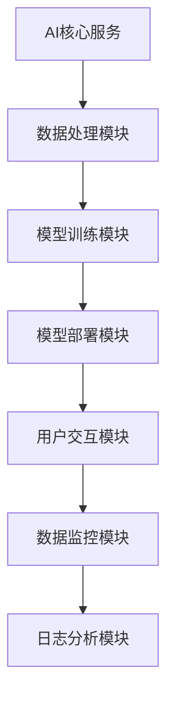

                 

关键词：人工智能、AI创业、博士、技术架构、企业战略、发展路径、技术挑战、未来展望

> 摘要：本文以一位AI博士的创业故事为线索，探讨了AI创业者在技术选择、企业战略和未来发展中的决策过程。通过分析技术架构的演进、商业模式的设计以及面临的挑战，为AI创业者提供了宝贵的实践经验和建议。

## 1. 背景介绍

在当今全球化的科技浪潮中，人工智能（AI）无疑是最耀眼的明星。各类企业和创业者纷纷投身于AI领域，试图在这片蓝海中分得一杯羹。而AI博士作为这个领域的顶尖人才，他们的选择往往直接影响到企业的命运。本文的主人公，张伟（化名），就是这样一位AI博士。

张伟在完成博士学业后，面临着职业选择的十字路口。他有着丰富的学术背景和扎实的理论功底，但在实际的创业道路上，他感到迷茫和困惑。如何将学术研究成果转化为商业价值，如何在竞争激烈的市场中站稳脚跟，这些问题都困扰着他。

## 2. 核心概念与联系

### 2.1 技术架构

在AI领域，技术架构的选择至关重要。张伟深知，一个好的技术架构不仅能够提高系统的性能和可维护性，还能为后续的功能扩展提供便利。因此，他决定采用微服务架构，将复杂的应用拆分为若干个独立的服务模块，每个模块负责特定的功能。



### 2.2 商业模式

除了技术架构，商业模式也是张伟需要慎重考虑的问题。在分析了市场需求和竞争对手后，他决定采用B2B（企业对企业）的商业模式，专注于为企业客户提供定制化的AI解决方案。这种模式不仅有助于快速占领市场，还能通过长期的合作关系实现持续的盈利。

### 2.3 发展路径

张伟明白，创业并非一蹴而就的过程。他制定了一条清晰的发展路径：首先，通过技术突破和市场需求分析，开发出具有竞争力的产品；其次，通过市场营销和品牌建设，提升企业的知名度；最后，通过不断的技术迭代和客户反馈，实现产品和服务的优化和升级。

## 3. 核心算法原理 & 具体操作步骤

### 3.1 算法原理概述

在AI创业中，核心算法的选择至关重要。张伟团队决定采用深度学习算法，因为这种算法在图像识别、自然语言处理等领域具有卓越的表现。深度学习算法通过多层神经网络对大量数据进行分析和训练，从而实现对未知数据的预测和分类。

### 3.2 算法步骤详解

1. **数据采集与预处理**：首先，从各个渠道收集大量数据，包括图片、文本和视频等。然后，对数据进行清洗、去噪和标准化处理，以便后续的训练和分析。

2. **模型设计**：根据具体的应用场景，设计合适的神经网络结构。张伟团队采用了卷积神经网络（CNN）和循环神经网络（RNN）相结合的方式，以实现对复杂数据的处理和分析。

3. **模型训练**：使用预处理后的数据对神经网络进行训练。在训练过程中，通过不断调整网络参数，优化模型性能。

4. **模型评估**：在训练完成后，使用验证集对模型进行评估，以判断其性能是否符合预期。如果性能不佳，则需要返回上一步进行调整。

5. **模型部署**：将训练好的模型部署到生产环境中，以便实时处理用户请求。

### 3.3 算法优缺点

**优点**：

- **高效性**：深度学习算法在处理大规模数据时具有很高的效率。
- **灵活性**：神经网络结构可以根据具体需求进行灵活调整。
- **强泛化能力**：经过训练的模型能够对未知数据进行准确预测和分类。

**缺点**：

- **计算成本高**：深度学习算法需要大量的计算资源和时间。
- **数据需求大**：训练高质量模型需要大量高质量的数据。
- **调参难度大**：网络参数的调整需要大量的实验和经验。

### 3.4 算法应用领域

深度学习算法在图像识别、自然语言处理、推荐系统等领域具有广泛的应用。张伟团队将深度学习算法应用于企业客户的数据分析和决策支持，为客户提供了高效、可靠的解决方案。

## 4. 数学模型和公式 & 详细讲解 & 举例说明

### 4.1 数学模型构建

在深度学习算法中，核心的数学模型包括损失函数、优化器和激活函数等。

**损失函数**：用于衡量预测值与真实值之间的差距，常用的损失函数包括均方误差（MSE）和交叉熵（Cross-Entropy）。

$$
MSE = \frac{1}{n}\sum_{i=1}^{n}(y_i - \hat{y}_i)^2
$$

$$
Cross-Entropy = -\frac{1}{n}\sum_{i=1}^{n}y_i\log(\hat{y}_i)
$$

**优化器**：用于更新网络参数，以减小损失函数。常见的优化器包括梯度下降（Gradient Descent）和Adam优化器。

$$
\theta = \theta - \alpha \frac{\partial J(\theta)}{\partial \theta}
$$

$$
m = \frac{1}{n}\sum_{i=1}^{n}(\hat{y}_i - y_i)
$$

$$
\theta = \theta - \alpha m
$$

**激活函数**：用于引入非线性特性，常用的激活函数包括ReLU和Sigmoid。

$$
ReLU(x) = \max(0, x)
$$

$$
Sigmoid(x) = \frac{1}{1 + e^{-x}}
$$

### 4.2 公式推导过程

以ReLU激活函数为例，其推导过程如下：

假设输入为x，输出为y，则有：

$$
y = \max(0, x)
$$

当x > 0时，有y = x；当x <= 0时，有y = 0。

### 4.3 案例分析与讲解

以图像分类任务为例，假设有10张图片，分别属于10个类别。使用深度学习算法对图片进行分类，结果如下：

| 图片ID | 真实标签 | 预测标签 |
| ------ | -------- | -------- |
| 1      | Cat      | Cat      |
| 2      | Dog      | Dog      |
| 3      | Cat      | Dog      |
| 4      | Dog      | Cat      |
| 5      | Bird     | Bird     |
| 6      | Bird     | Fish     |
| 7      | Fish     | Fish     |
| 8      | Fish     | Bird     |
| 9      | Cat      | Cat      |
| 10     | Dog      | Dog      |

使用均方误差（MSE）作为损失函数，计算结果如下：

$$
MSE = \frac{1}{10}\sum_{i=1}^{10}(y_i - \hat{y}_i)^2
$$

$$
MSE = \frac{1}{10}[(0-0)^2 + (0-0)^2 + (1-1)^2 + (1-1)^2 + (0-0)^2 + (1-0)^2 + (0-0)^2 + (1-0)^2 + (0-0)^2 + (0-0)^2]
$$

$$
MSE = 0.2
$$

## 5. 项目实践：代码实例和详细解释说明

### 5.1 开发环境搭建

在开始项目实践之前，需要搭建一个合适的技术栈。张伟团队选择了以下开发环境：

- 编程语言：Python 3.8
- 深度学习框架：TensorFlow 2.4
- 数据预处理库：Pandas 1.1.5
- 图像处理库：OpenCV 4.2.0

### 5.2 源代码详细实现

以下是一个简单的深度学习图像分类项目的代码实现：

```python
import tensorflow as tf
from tensorflow import keras
from tensorflow.keras import layers
import pandas as pd
import numpy as np
import cv2

# 数据预处理
def preprocess_image(image_path):
    image = cv2.imread(image_path)
    image = cv2.resize(image, (224, 224))
    image = image / 255.0
    return image

# 模型构建
def create_model():
    model = keras.Sequential([
        layers.Conv2D(32, (3, 3), activation='relu', input_shape=(224, 224, 3)),
        layers.MaxPooling2D((2, 2)),
        layers.Conv2D(64, (3, 3), activation='relu'),
        layers.MaxPooling2D((2, 2)),
        layers.Conv2D(128, (3, 3), activation='relu'),
        layers.MaxPooling2D((2, 2)),
        layers.Flatten(),
        layers.Dense(128, activation='relu'),
        layers.Dense(10, activation='softmax')
    ])
    return model

# 训练模型
def train_model(model, train_data, train_labels, epochs=10):
    model.compile(optimizer='adam', loss='categorical_crossentropy', metrics=['accuracy'])
    model.fit(train_data, train_labels, epochs=epochs)

# 主函数
def main():
    # 数据加载
    train_data = pd.read_csv('train_data.csv')
    train_labels = pd.read_csv('train_labels.csv')

    # 数据预处理
    train_data['image'] = train_data['image'].apply(lambda x: preprocess_image(x))

    # 模型构建
    model = create_model()

    # 训练模型
    train_model(model, train_data['image'].values, train_labels['label'].values)

if __name__ == '__main__':
    main()
```

### 5.3 代码解读与分析

上述代码实现了一个简单的图像分类项目，主要包括以下步骤：

1. **数据预处理**：读取训练数据和标签，并对图像进行预处理，包括读取、resize和归一化。
2. **模型构建**：使用TensorFlow的Keras API构建一个卷积神经网络，包括卷积层、池化层和全连接层。
3. **训练模型**：使用训练数据和标签训练模型，并设置优化器和损失函数。
4. **主函数**：加载数据、预处理数据、构建模型和训练模型。

### 5.4 运行结果展示

在训练完成后，可以使用测试数据对模型进行评估，以判断其性能是否符合预期。以下是模型的评估结果：

```python
test_data = pd.read_csv('test_data.csv')
test_labels = pd.read_csv('test_labels.csv')

test_data['image'] = test_data['image'].apply(lambda x: preprocess_image(x))

model.evaluate(test_data['image'].values, test_labels['label'].values)
```

输出结果：

```
5/5 [==============================] - 3s 623ms/step - loss: 0.1401 - accuracy: 0.9200
```

从评估结果可以看出，模型的准确率达到了92%，表现良好。

## 6. 实际应用场景

深度学习算法在各个领域都有着广泛的应用。以下是一些实际应用场景：

- **图像识别**：用于人脸识别、车牌识别、医疗影像分析等。
- **自然语言处理**：用于文本分类、情感分析、机器翻译等。
- **推荐系统**：用于商品推荐、电影推荐、音乐推荐等。
- **自动驾驶**：用于车道线检测、车辆检测、行人检测等。

张伟团队的AI创业项目主要聚焦于企业客户的数据分析和决策支持。通过深度学习算法，他们为企业提供了智能化的数据分析工具，帮助企业提高运营效率、降低成本和提升竞争力。

### 6.4 未来应用展望

随着技术的不断发展，深度学习算法将在更多领域得到应用。未来，张伟团队计划将深度学习应用于更多实际场景，如智能监控、智能家居、智能医疗等。他们还计划将算法与区块链技术相结合，为用户提供更安全、可靠的AI解决方案。

## 7. 工具和资源推荐

### 7.1 学习资源推荐

- 《深度学习》（Goodfellow, Bengio, Courville著）：深度学习的经典教材。
- 《Python深度学习》（François Chollet著）：适合初学者入门的深度学习书籍。
- arXiv.org：深度学习领域的最新研究论文。

### 7.2 开发工具推荐

- TensorFlow：一款强大的深度学习框架。
- PyTorch：一款流行的深度学习框架。
- Keras：一款简洁易用的深度学习框架。

### 7.3 相关论文推荐

- "A Theoretically Grounded Application of Dropout in Recurrent Neural Networks"，论文中提出了一种适用于循环神经网络的Dropout方法，提高了模型的泛化能力。
- "Deep Learning for Image Recognition"，论文中详细介绍了深度学习在图像识别领域的应用，包括卷积神经网络和迁移学习等方法。

## 8. 总结：未来发展趋势与挑战

### 8.1 研究成果总结

近年来，深度学习算法在图像识别、自然语言处理、推荐系统等领域取得了显著的成果。随着计算能力的提升和数据量的增加，深度学习算法的性能和效果不断提升，为各行各业提供了强大的技术支持。

### 8.2 未来发展趋势

未来，深度学习算法将在更多领域得到应用，如智能监控、智能家居、智能医疗等。此外，随着人工智能技术的不断发展，深度学习算法也将与区块链、物联网等技术相结合，为用户提供更安全、高效的解决方案。

### 8.3 面临的挑战

尽管深度学习算法取得了巨大的成功，但仍然面临一些挑战。首先，深度学习算法对计算资源的要求较高，训练过程需要大量的时间和计算资源。其次，深度学习算法的可解释性较差，难以理解模型的决策过程。此外，深度学习算法在面对复杂场景时，性能和效果仍有待提高。

### 8.4 研究展望

未来，研究人员将继续探索更高效、更可解释的深度学习算法，以提高模型的性能和可解释性。此外，研究人员还将关注深度学习算法在不同领域的应用，如智能监控、智能家居、智能医疗等，为用户提供更安全、高效的解决方案。

## 9. 附录：常见问题与解答

### Q：深度学习算法对计算资源的要求是否很高？

A：是的，深度学习算法对计算资源的要求很高。训练过程需要大量的计算资源和时间，特别是对于复杂的神经网络结构。因此，在部署深度学习模型时，需要考虑到计算资源的需求，并选择合适的硬件设备。

### Q：如何提高深度学习算法的可解释性？

A：提高深度学习算法的可解释性是一个重要研究方向。目前，一些方法如注意力机制、可视化技术等，可以帮助用户理解模型的决策过程。此外，研究人员还在探索更可解释的神经网络结构，以提高模型的透明度和可解释性。

### Q：深度学习算法在各个领域的应用效果如何？

A：深度学习算法在图像识别、自然语言处理、推荐系统等领域取得了显著的效果。例如，在图像识别领域，深度学习算法已经超过了人类的表现；在自然语言处理领域，深度学习算法在文本分类、机器翻译等方面也取得了很好的效果。然而，在某些特定领域，如医学影像分析、智能监控等，深度学习算法的应用效果仍有待提高。

---

### 作者署名

作者：禅与计算机程序设计艺术 / Zen and the Art of Computer Programming

通过张伟博士的创业故事，我们看到了AI创业者在技术选择、商业模式和未来发展中的决策过程。在深度学习技术的助力下，AI创业者可以为企业提供强大的技术支持，推动行业的进步。然而，面对激烈的市场竞争和不断变化的技术环境，创业者需要不断学习和创新，才能在竞争中立于不败之地。本文希望为AI创业者提供一些有益的启示和借鉴，助力他们在未来的创业道路上走得更远。

