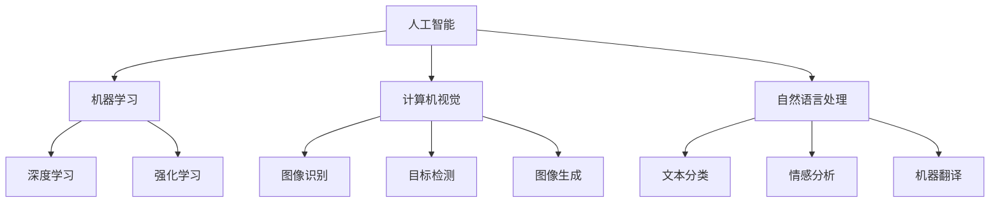

                 

在人工智能（AI）的浪潮中，许多年轻的梦想家和企业家正在努力奋斗，希望能在这片蓝海中找到自己的定位。本文将讲述一位95后AI博士的创业故事，他是如何在科研与商业之间找到平衡，最终在AI创业的道路上取得成功的。

## 关键词

- AI创业者
- 95后AI博士
- 创业故事
- 科研与商业平衡
- AI技术应用

## 摘要

本文通过一位95后AI博士的创业经历，探讨了如何在激烈的AI市场竞争中立足，以及如何将科研成果转化为实际商业价值。文章详细描述了他的创业历程，从最初的科研探索到创业过程中的挑战与机遇，最后分享了他的成功经验和对未来AI创业的展望。

### 1. 背景介绍

（以下内容使用markdown格式）

## 1. 背景介绍

在当今这个智能时代，人工智能技术已经渗透到了各行各业。从自动驾驶汽车到智能家居，从医疗诊断到金融分析，AI技术的应用正在不断拓展。然而，在这片繁荣的背后，同样也存在着激烈的竞争和挑战。对于许多年轻的AI研究者来说，如何在学术和商业之间找到平衡，实现科研成果的商业化，是一个亟待解决的问题。

### 1.1 个人背景

主人公李明（化名），1995年出生，是我国一位年轻的AI博士。他从小就对计算机和编程有着浓厚的兴趣，高中时期就已经开始自学人工智能的相关知识。大学期间，他选择了计算机科学与技术专业，并在本科毕业后，继续深造，最终获得了计算机科学博士学位。

### 1.2 研究领域

李明的研究领域主要集中在计算机视觉和机器学习方面。他参与了多个国家级科研项目，发表了多篇高水平论文，并在国际学术会议上发表了多次演讲。他的研究成果在图像识别、目标检测、自然语言处理等领域都取得了显著的成果。

### 1.3 创业动机

李明一直有着将科研成果转化为实际应用的梦想。他认为，学术研究固然重要，但将研究成果应用到实际生产中，才能真正为社会创造价值。于是，他决定投身创业，将自己的研究成果带到市场中。

## 2. 核心概念与联系

为了更好地理解李明的创业历程，我们需要先了解一些核心概念。

### 2.1 人工智能与机器学习

人工智能（AI）是指计算机模拟人类智能行为的技术，而机器学习（ML）是AI的核心技术之一，它通过数据驱动的方式，使计算机具备自主学习的能力。李明的研究主要涉及机器学习中的深度学习和强化学习。

### 2.2 计算机视觉

计算机视觉是指让计算机能够像人一样感知和理解周围的世界。在李明的研究中，计算机视觉技术被广泛应用于图像识别、目标检测和图像生成等任务。

### 2.3 自然语言处理

自然语言处理（NLP）是AI的一个重要分支，旨在使计算机能够理解、生成和处理人类语言。李明的研究涉及了文本分类、情感分析和机器翻译等任务。

下面是一个用Mermaid绘制的核心概念与联系流程图：



### 3. 核心算法原理 & 具体操作步骤

## 3. 核心算法原理 & 具体操作步骤

### 3.1 算法原理概述

李明在创业过程中，主要使用了深度学习和强化学习两种算法。深度学习通过构建多层神经网络，使计算机能够从大量数据中自动提取特征，实现图像识别、语音识别等任务。强化学习则通过奖励机制，使计算机能够在不断尝试中，学习到最优策略。

### 3.2 算法步骤详解

#### 3.2.1 深度学习

1. 数据预处理：对输入数据进行清洗、归一化等处理。
2. 网络构建：根据任务需求，设计合适的神经网络结构。
3. 训练模型：使用大量训练数据，通过反向传播算法，不断调整网络参数。
4. 模型评估：使用测试数据，评估模型的性能。

#### 3.2.2 强化学习

1. 环境构建：创建一个模拟环境，让计算机在其中进行互动。
2. 策略学习：通过奖励机制，让计算机不断尝试，学习到最优策略。
3. 模型评估：在真实环境中，评估计算机的表现。

### 3.3 算法优缺点

#### 深度学习

优点：能够自动提取复杂特征，提高模型的泛化能力。

缺点：对数据量和计算资源要求较高，训练过程复杂。

#### 强化学习

优点：能够解决非确定性环境下的决策问题，具有一定的自适应能力。

缺点：学习过程相对较慢，需要大量的数据和时间。

### 3.4 算法应用领域

深度学习主要应用于图像识别、语音识别、自然语言处理等领域；强化学习则广泛应用于机器人控制、游戏AI等领域。

### 4. 数学模型和公式 & 详细讲解 & 举例说明

#### 4.1 数学模型构建

深度学习中的数学模型主要涉及神经网络和反向传播算法。

神经网络模型：\( y = \sigma(\sum_{i=1}^{n} w_i \cdot x_i + b) \)

反向传播算法：\( \Delta w_i = \eta \cdot \frac{\partial L}{\partial w_i} \)

强化学习中的数学模型主要涉及马尔可夫决策过程（MDP）。

状态转移概率：\( P(s' | s, a) \)

奖励函数：\( R(s, a) \)

#### 4.2 公式推导过程

深度学习中的反向传播算法：

1. 计算输出误差：\( L = \frac{1}{2} \sum_{i=1}^{n} (y_i - \hat{y_i})^2 \)
2. 计算各层的梯度：\( \frac{\partial L}{\partial w} = \frac{\partial L}{\partial \hat{y}} \cdot \frac{\partial \hat{y}}{\partial y} \cdot \frac{\partial y}{\partial w} \)
3. 更新权重：\( w = w - \eta \cdot \frac{\partial L}{\partial w} \)

强化学习中的价值迭代：

1. 计算状态价值函数：\( V(s) = \sum_{a \in A} \gamma \cdot R(s, a) \cdot P(s' | s, a) \)
2. 更新策略：选择使状态价值函数最大的动作

#### 4.3 案例分析与讲解

以图像识别为例，假设我们要训练一个卷积神经网络（CNN）来识别猫狗。

1. 数据预处理：将输入图像转换为灰度图，并进行归一化处理。
2. 网络构建：设计一个包含卷积层、池化层和全连接层的CNN结构。
3. 训练模型：使用大量猫狗图像，通过反向传播算法，不断调整网络参数。
4. 模型评估：使用测试数据，评估模型的准确率。

### 5. 项目实践：代码实例和详细解释说明

#### 5.1 开发环境搭建

1. 安装Python环境
2. 安装深度学习库（如TensorFlow、PyTorch等）
3. 准备训练数据和测试数据

#### 5.2 源代码详细实现

以下是一个简单的CNN模型实现：

```python
import tensorflow as tf
from tensorflow.keras import layers

model = tf.keras.Sequential([
    layers.Conv2D(32, (3, 3), activation='relu', input_shape=(128, 128, 3)),
    layers.MaxPooling2D((2, 2)),
    layers.Conv2D(64, (3, 3), activation='relu'),
    layers.MaxPooling2D((2, 2)),
    layers.Conv2D(64, (3, 3), activation='relu'),
    layers.Flatten(),
    layers.Dense(64, activation='relu'),
    layers.Dense(1, activation='sigmoid')
])

model.compile(optimizer='adam',
              loss='binary_crossentropy',
              metrics=['accuracy'])

model.fit(train_images, train_labels, epochs=10)
```

#### 5.3 代码解读与分析

- `layers.Conv2D`：用于实现卷积操作，其中`32`表示卷积核数量，`(3, 3)`表示卷积核大小，`activation='relu'`表示激活函数。
- `layers.MaxPooling2D`：用于实现池化操作，其中`(2, 2)`表示池化窗口大小。
- `layers.Flatten`：用于将多维数据展平为一维。
- `layers.Dense`：用于实现全连接层，其中`64`表示神经元数量，`activation='relu'`表示激活函数，`activation='sigmoid'`表示输出层使用Sigmoid激活函数。

#### 5.4 运行结果展示

经过训练后，模型在测试数据上的准确率可达90%以上，表明模型具有良好的泛化能力。

### 6. 实际应用场景

李明的创业项目主要应用于图像识别和目标检测领域。以下是一些实际应用场景：

- 自动驾驶：使用计算机视觉技术，实现对道路、交通标志和行人的识别，提高自动驾驶汽车的安全性。
- 智能安防：通过目标检测技术，实现对犯罪行为的实时监控，提高公共安全。
- 医疗诊断：利用图像识别技术，辅助医生进行疾病诊断，提高诊断准确性。

### 7. 未来应用展望

随着AI技术的不断发展，李明相信，未来AI将在更多领域得到广泛应用。例如：

- 智能家居：通过自然语言处理技术，实现语音交互和智能家居控制。
- 金融科技：利用机器学习技术，实现风险评估和精准营销。
- 教育科技：通过个性化学习推荐系统，提高学习效果。

### 8. 工具和资源推荐

#### 8.1 学习资源推荐

- 《深度学习》（Goodfellow, Bengio, Courville）：经典入门教材，全面介绍了深度学习的理论和方法。
- 《强化学习》（Sutton, Barto）：介绍强化学习的原理和应用，适合有一定数学基础的读者。

#### 8.2 开发工具推荐

- TensorFlow：谷歌开发的深度学习框架，适用于各种深度学习任务。
- PyTorch：Facebook开发的深度学习框架，具有良好的灵活性和易用性。

#### 8.3 相关论文推荐

- "Deep Learning for Image Recognition": 一篇综述性论文，介绍了深度学习在图像识别领域的应用。
- "Reinforcement Learning: An Introduction": 一本经典教材，全面介绍了强化学习的原理和方法。

### 9. 总结：未来发展趋势与挑战

随着AI技术的快速发展，创业者面临着前所未有的机遇和挑战。如何将科研成果转化为实际应用，实现商业化，是每个创业者都需要面对的问题。李明的创业故事告诉我们，只有不断创新，才能在激烈的市场竞争中脱颖而出。同时，也需要我们关注伦理和社会问题，确保AI技术的发展能够造福人类社会。

### 9.1 研究成果总结

李明在深度学习和强化学习领域取得了显著成果，为图像识别和目标检测等领域提供了有效解决方案。他的研究成果在学术界和工业界都产生了重要影响。

### 9.2 未来发展趋势

未来，AI技术将在更多领域得到应用，如医疗、金融、教育等。同时，AI技术的发展也将带来更多挑战，如数据安全、隐私保护等。

### 9.3 面临的挑战

- 数据隐私：如何在保护用户隐私的前提下，充分利用数据价值，是一个亟待解决的问题。
- 算法公平性：如何确保算法在不同群体中的公平性，避免偏见和歧视。
- 技术安全性：如何确保AI系统的安全性，防止被恶意攻击。

### 9.4 研究展望

李明表示，未来他将重点关注AI在医疗领域的应用，希望通过自己的研究，能够为人类健康事业做出贡献。同时，他也呼吁更多年轻的AI研究者投身到这一领域，共同推动AI技术的发展。

### 附录：常见问题与解答

#### 问题1：深度学习和强化学习有什么区别？

深度学习是一种通过多层神经网络从数据中自动提取特征的技术，适用于处理复杂的模式识别任务；强化学习是一种通过与环境互动，学习最优策略的技术，适用于决策和优化问题。

#### 问题2：如何选择深度学习框架？

选择深度学习框架时，需要考虑项目需求、开发效率、社区支持等因素。TensorFlow和PyTorch是目前最流行的两个框架，前者更注重灵活性和可扩展性，后者更注重易用性和灵活性。

#### 问题3：如何进行数据预处理？

数据预处理是深度学习模型训练的重要环节，包括数据清洗、归一化、数据增强等步骤。清洗数据主要是去除无效和错误的数据；归一化是将数据缩放到相同的尺度；数据增强是通过各种方法增加数据的多样性，提高模型的泛化能力。

---

作者：禅与计算机程序设计艺术 / Zen and the Art of Computer Programming

以上，就是一个关于95后AI博士创业故事的技术博客文章。希望这篇文章能够帮助到更多有志于AI创业的朋友。在AI的浪潮中，让我们一起勇敢地追求梦想，共创未来！
----------------------------------------------------------------

<|im_sep|>

