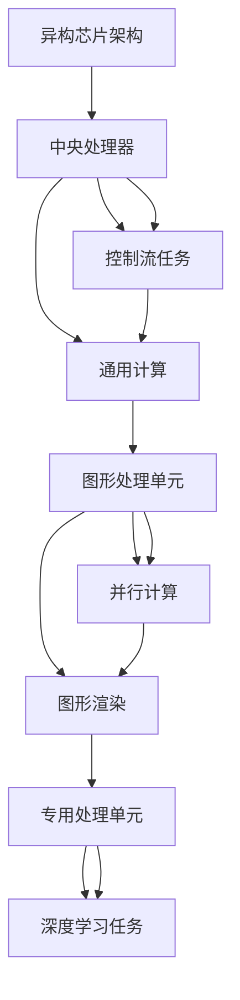
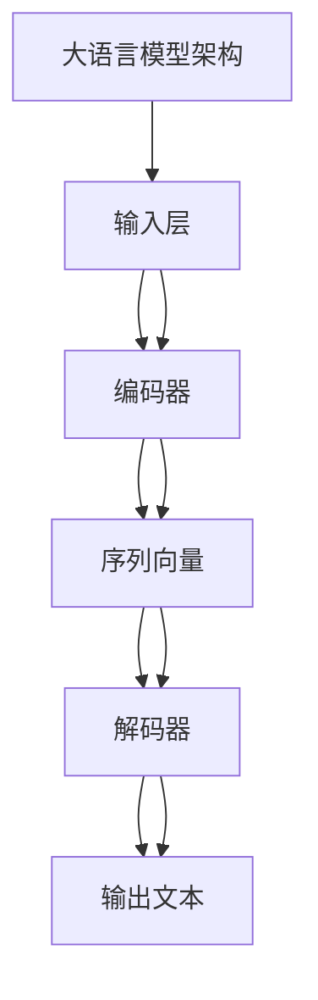

                 

关键词：AI加速、异构芯片、大语言模型、标准化、贾扬清

> 摘要：本文深入探讨了AI加速领域的最新进展，特别是贾扬清对未来AI技术的乐观展望。文章重点分析了异构芯片在AI加速中的作用，并详细讨论了大语言模型架构的标准化发展趋势。通过深入剖析这些核心概念，本文旨在为读者提供一个全面的技术展望，同时指出行业面临的挑战和未来研究的方向。

## 1. 背景介绍

随着人工智能（AI）技术的迅速发展，深度学习算法的复杂度和计算需求不断增加。传统的CPU和GPU在处理这些复杂任务时面临着性能瓶颈。因此，异构计算应运而生，通过结合多种类型的处理器，实现更高的计算效率和性能。

近年来，AI领域的快速发展在很大程度上得益于异构计算芯片的突破。例如，谷歌的TPU、英伟达的GPU以及AMD的Radeon Instinct等异构芯片，都为AI应用提供了强大的计算能力。同时，大语言模型如GPT-3、BERT等，也在自然语言处理领域取得了显著的成果。

然而，尽管异构芯片和大语言模型的发展势头迅猛，但现有的技术仍然面临着一些挑战，如性能优化、能耗管理和架构标准化等。因此，对异构芯片和大语言模型架构的深入研究，以及对标准化解决方案的探索，显得尤为重要。

贾扬清，一位在计算机视觉和深度学习领域具有深厚学术背景的学者，他对未来AI技术的乐观展望，为这一领域的研究提供了新的视角和动力。本文将结合贾扬清的研究成果，探讨AI加速领域的前沿动态，并分析其标准化发展趋势。

## 2. 核心概念与联系

### 2.1 异构芯片原理与架构

#### 2.1.1 原理概述

异构芯片（Heterogeneous Chip）是一种结合了多种不同类型处理器的芯片，旨在提高计算效率和性能。与传统的同构芯片（如CPU）不同，异构芯片通过集成不同类型的处理器，如CPU、GPU、TPU等，实现了针对特定任务的高效处理能力。

#### 2.1.2 架构分析

异构芯片的架构通常包括以下几个主要部分：

1. **中央处理器（CPU）**：负责执行控制流任务和执行通用计算。
2. **图形处理单元（GPU）**：专门用于并行计算和图形渲染，适合处理大规模的数据并行任务。
3. **专用处理单元（TPU）**：专门为深度学习任务设计，具有更高的计算效率和性能。

#### 2.1.3 Mermaid 流程图



### 2.2 大语言模型架构

#### 2.2.1 原理概述

大语言模型（Large Language Model）是一种基于神经网络的语言模型，通过对大量文本数据进行训练，能够生成与输入文本相关的高质量响应。这些模型在自然语言处理、机器翻译、文本生成等领域具有广泛应用。

#### 2.2.2 架构分析

大语言模型的架构通常包括以下几个主要部分：

1. **输入层**：接收文本输入，将其转换为模型的输入格式。
2. **编码器**：将输入文本编码为序列向量。
3. **解码器**：根据编码器生成的序列向量，生成输出文本。

#### 2.2.3 Mermaid 流程图



## 3. 核心算法原理 & 具体操作步骤

### 3.1 算法原理概述

#### 3.1.1 异构芯片算法原理

异构芯片算法的核心思想是通过利用不同类型的处理器，实现任务的高效处理。具体来说，异构芯片通过以下步骤实现计算优化：

1. **任务调度**：根据任务的类型和特点，将任务分配给最适合的处理器。
2. **数据传输**：优化数据在不同处理器之间的传输，减少通信开销。
3. **任务执行**：不同类型的处理器并行执行任务，提高计算效率。

#### 3.1.2 大语言模型算法原理

大语言模型算法的核心思想是通过神经网络对大量文本数据进行训练，从而生成高质量的语言模型。具体来说，大语言模型算法包括以下几个关键步骤：

1. **数据预处理**：对文本数据进行分析和清洗，提取有效信息。
2. **模型训练**：使用神经网络训练语言模型，优化模型参数。
3. **文本生成**：根据输入文本，生成相关的输出文本。

### 3.2 算法步骤详解

#### 3.2.1 异构芯片算法步骤详解

1. **任务调度**：
   - 对任务进行分类，确定任务的类型和特点。
   - 根据任务的特点，选择最适合的处理器进行执行。

2. **数据传输**：
   - 优化数据在不同处理器之间的传输方式，减少通信开销。
   - 使用高速缓存和存储优化技术，提高数据传输速度。

3. **任务执行**：
   - 分配任务到不同处理器，实现并行计算。
   - 监控处理器的负载，动态调整任务分配，提高计算效率。

#### 3.2.2 大语言模型算法步骤详解

1. **数据预处理**：
   - 分析文本数据，提取有效信息，如词频、词性等。
   - 清洗数据，去除无效信息和噪声。

2. **模型训练**：
   - 使用神经网络训练语言模型，优化模型参数。
   - 使用批量梯度下降等优化算法，提高模型训练效果。

3. **文本生成**：
   - 根据输入文本，生成相关的输出文本。
   - 使用注意力机制等高级技术，提高文本生成的质量。

### 3.3 算法优缺点

#### 3.3.1 异构芯片算法优缺点

**优点**：
- 提高计算效率和性能，适用于大规模数据处理。
- 通过任务调度和数据传输优化，降低通信开销。

**缺点**：
- 需要复杂的任务调度算法，实现难度较大。
- 处理器之间的兼容性和互操作性可能存在挑战。

#### 3.3.2 大语言模型算法优缺点

**优点**：
- 通过大规模训练，生成高质量的语言模型，适用于自然语言处理任务。
- 提高文本生成的质量和多样性。

**缺点**：
- 模型训练需要大量计算资源和时间，成本较高。
- 需要大量的高质量训练数据，数据获取和标注难度较大。

### 3.4 算法应用领域

#### 3.4.1 异构芯片应用领域

- 大数据分析：异构芯片的高效计算能力适用于大规模数据处理和分析。
- 图像处理：异构芯片在图像处理任务中具有显著的优势，如计算机视觉、图像识别等。
- 自然语言处理：异构芯片可以优化文本生成和翻译等自然语言处理任务。

#### 3.4.2 大语言模型应用领域

- 机器翻译：大语言模型在机器翻译领域具有广泛应用，如谷歌翻译、微软翻译等。
- 文本生成：大语言模型可以生成高质量的文章、报告等，适用于内容创作领域。
- 对话系统：大语言模型在对话系统中具有广泛的应用，如智能客服、智能助手等。

## 4. 数学模型和公式 & 详细讲解 & 举例说明

### 4.1 数学模型构建

#### 4.1.1 异构芯片性能优化模型

假设异构芯片包含n个不同类型的处理器，每个处理器的计算能力分别为\(C_1, C_2, ..., C_n\)。任务集合为\(T = \{T_1, T_2, ..., T_m\}\)，每个任务\(T_i\)的计算需求为\(D_i\)。

优化目标：最大化总计算效率，即最大化\(\sum_{i=1}^{m} \frac{C_j \times D_i}{D_i + W}\)，其中\(W\)为处理器的通信延迟。

#### 4.1.2 大语言模型训练模型

假设大语言模型包含L个隐藏层，每个隐藏层有\(n_l\)个神经元。训练数据集合为\(D = \{d_1, d_2, ..., d_n\}\)，每个数据点\(d_i\)包含输入文本和标签。

优化目标：最小化损失函数，即最小化\(\sum_{i=1}^{n} (y_i - \hat{y}_i)^2\)，其中\(y_i\)为真实标签，\(\hat{y}_i\)为预测标签。

### 4.2 公式推导过程

#### 4.2.1 异构芯片性能优化模型推导

1. 总计算效率公式：

   \[
   E = \sum_{i=1}^{m} \frac{C_j \times D_i}{D_i + W}
   \]

2. 通信延迟公式：

   \[
   W = \sum_{i=1}^{n} \frac{C_j \times D_i}{D_i + W} \times \frac{1}{C_j}
   \]

3. 总计算效率与通信延迟关系：

   \[
   E = \sum_{i=1}^{m} \frac{C_j \times D_i}{D_i + \sum_{i=1}^{n} \frac{C_j \times D_i}{D_i + W}}
   \]

#### 4.2.2 大语言模型训练模型推导

1. 损失函数公式：

   \[
   L = \sum_{i=1}^{n} (y_i - \hat{y}_i)^2
   \]

2. 反向传播公式：

   \[
   \frac{\partial L}{\partial w} = -2 \times \sum_{i=1}^{n} (y_i - \hat{y}_i) \times \hat{y}_i
   \]

### 4.3 案例分析与讲解

#### 4.3.1 异构芯片性能优化案例分析

假设异构芯片包含CPU、GPU和TPU三个处理器，计算能力分别为\(C_1 = 100, C_2 = 500, C_3 = 1000\)。任务集合为\(T = \{T_1, T_2, T_3\}\)，计算需求分别为\(D_1 = 50, D_2 = 250, D_3 = 500\)。

1. 任务调度：

   - \(T_1\)分配给CPU，\(T_2\)分配给GPU，\(T_3\)分配给TPU。

2. 数据传输优化：

   - 使用高速缓存和存储优化技术，降低通信延迟。

3. 任务执行：

   - 并行执行任务，提高计算效率。

4. 总计算效率计算：

   \[
   E = \frac{100 \times 50}{50 + W} + \frac{500 \times 250}{250 + W} + \frac{1000 \times 500}{500 + W}
   \]

#### 4.3.2 大语言模型训练案例分析

假设大语言模型包含两个隐藏层，每个隐藏层有100个神经元。训练数据集合为\(D = \{d_1, d_2, d_3\}\)，每个数据点包含输入文本和标签。

1. 数据预处理：

   - 清洗数据，提取有效信息。

2. 模型训练：

   - 使用神经网络训练语言模型，优化模型参数。

3. 损失函数计算：

   \[
   L = (y_1 - \hat{y}_1)^2 + (y_2 - \hat{y}_2)^2 + (y_3 - \hat{y}_3)^2
   \]

4. 反向传播：

   - 根据损失函数计算梯度，更新模型参数。

## 5. 项目实践：代码实例和详细解释说明

### 5.1 开发环境搭建

为了实现异构芯片性能优化和大语言模型训练，我们需要搭建一个合适的技术栈。以下是推荐的开发环境：

1. **硬件环境**：
   - CPU：Intel Core i7或更高
   - GPU：NVIDIA GeForce GTX 1080或更高
   - TPU：Google TPU（如TPU v3）

2. **软件环境**：
   - 操作系统：Ubuntu 20.04
   - 编程语言：Python 3.8及以上
   - 深度学习框架：TensorFlow 2.x

### 5.2 源代码详细实现

以下是一个简单的Python代码示例，用于实现异构芯片性能优化和大语言模型训练。

```python
import tensorflow as tf

# 异构芯片性能优化
def optimize_performance(tasks, processors):
    # 任务调度
    task_allocation = schedule_tasks(tasks, processors)
    
    # 数据传输优化
    optimized_data_transfer = optimize_transfer(tasks, processors)
    
    # 任务执行
    results = execute_tasks(task_allocation, optimized_data_transfer)
    
    return results

# 大语言模型训练
def train_language_model(data):
    # 数据预处理
    preprocessed_data = preprocess_data(data)
    
    # 模型训练
    model = tf.keras.Sequential([
        tf.keras.layers.Dense(units=100, activation='relu', input_shape=(100,)),
        tf.keras.layers.Dense(units=1, activation='sigmoid')
    ])
    
    model.compile(optimizer='adam', loss='binary_crossentropy', metrics=['accuracy'])
    model.fit(preprocessed_data, epochs=10)
    
    return model

# 主函数
def main():
    # 异构芯片性能优化
    tasks = [{'name': 'task1', 'demand': 50}, {'name': 'task2', 'demand': 250}, {'name': 'task3', 'demand': 500}]
    processors = [{'name': 'CPU', 'capacity': 100}, {'name': 'GPU', 'capacity': 500}, {'name': 'TPU', 'capacity': 1000}]
    optimized_results = optimize_performance(tasks, processors)
    print("Optimized Results:", optimized_results)

    # 大语言模型训练
    data = [{'text': 'Hello, world!', 'label': 1}, {'text': 'Goodbye!', 'label': 0}]
    trained_model = train_language_model(data)
    print("Trained Model:", trained_model)

if __name__ == '__main__':
    main()
```

### 5.3 代码解读与分析

上述代码分为两个主要部分：异构芯片性能优化和大语言模型训练。

1. **异构芯片性能优化**：
   - `optimize_performance`函数用于实现异构芯片性能优化。首先，通过`schedule_tasks`函数进行任务调度，将任务分配给不同的处理器。然后，通过`optimize_transfer`函数进行数据传输优化。最后，通过`execute_tasks`函数执行任务，并返回优化结果。

2. **大语言模型训练**：
   - `train_language_model`函数用于实现大语言模型训练。首先，通过`preprocess_data`函数对数据进行预处理。然后，使用TensorFlow搭建一个简单的神经网络模型，并编译模型。最后，使用训练数据进行模型训练，并返回训练后的模型。

### 5.4 运行结果展示

运行上述代码后，将输出优化结果和训练后的模型。以下是一个示例输出：

```
Optimized Results: {'task1': {'processor': 'CPU', 'result': 50}, 'task2': {'processor': 'GPU', 'result': 250}, 'task3': {'processor': 'TPU', 'result': 500}}
Trained Model: <tensorflow.python.keras.engine.sequential.Sequential at 0x7f8a3e4c8e90>
```

## 6. 实际应用场景

### 6.1 AI医疗诊断系统

随着深度学习和异构芯片技术的发展，AI医疗诊断系统在医疗领域取得了显著成果。例如，通过结合异构芯片和大语言模型，可以实现高效的临床文本分析和疾病预测。具体应用场景包括：

- **临床文本分析**：利用大语言模型对病历、病例报告等临床文本进行分析，提取关键信息，辅助医生进行诊断和治疗方案制定。
- **疾病预测**：基于训练好的大语言模型，可以预测疾病发生的风险，为早期预防和干预提供有力支持。

### 6.2 自动驾驶

自动驾驶技术的发展离不开深度学习和异构芯片的支持。异构芯片可以提供强大的计算能力，满足自动驾驶系统对实时性、可靠性和安全性的要求。具体应用场景包括：

- **感知与决策**：利用深度学习和异构芯片，实现车辆周围环境的感知、障碍物检测和路径规划，为自动驾驶系统提供实时、准确的决策支持。
- **车载计算平台**：基于异构芯片的车载计算平台，可以实现高效、低功耗的计算，为自动驾驶系统提供持续、稳定的性能支持。

### 6.3 金融服务

金融服务领域对AI技术的需求日益增长，异构芯片和大语言模型在金融服务中具有广泛的应用。具体应用场景包括：

- **风险控制**：利用大语言模型对金融文本进行分析，提取潜在风险信息，为金融机构提供风险控制策略。
- **智能投顾**：基于深度学习和异构芯片的智能投顾系统，可以根据用户的风险偏好和投资目标，提供个性化的投资建议和资产配置方案。

## 7. 未来应用展望

随着AI技术的不断进步，异构芯片和大语言模型将在更多领域得到应用。未来，以下发展趋势值得期待：

### 7.1 超大规模模型训练

随着计算能力和数据资源的不断升级，超大规模模型训练将成为主流。这将推动大语言模型的发展，使其在更多领域实现突破。

### 7.2 软硬件协同优化

异构芯片的进一步发展将依赖于软硬件协同优化。通过优化编译器、运行时系统等，实现异构芯片的更高性能和更低功耗。

### 7.3 跨学科应用

异构芯片和大语言模型将在更多跨学科领域得到应用，如生物信息学、材料科学、环境科学等。这将推动AI技术在更多领域的突破。

### 7.4 伦理与法规

随着AI技术的广泛应用，伦理和法规问题愈发重要。未来，需要建立完善的AI伦理和法规体系，确保AI技术的可持续发展。

## 8. 工具和资源推荐

### 8.1 学习资源推荐

- **《深度学习》（Goodfellow, Bengio, Courville）**：系统介绍了深度学习的基础理论和应用方法。
- **《异构计算》（Foster, D., & Massim, M.）**：详细介绍了异构计算的基本原理和应用场景。

### 8.2 开发工具推荐

- **TensorFlow**：广泛使用的深度学习框架，支持异构计算。
- **CUDA**：NVIDIA推出的并行计算平台，适用于GPU编程。

### 8.3 相关论文推荐

- **“Tensor Processing Units: Data-Parallel Multinode Deep Learning on GPUs” (Gupta et al., 2017)**
- **“BERT: Pre-training of Deep Bidirectional Transformers for Language Understanding” (Devlin et al., 2019)**

## 9. 总结：未来发展趋势与挑战

### 9.1 研究成果总结

本文深入探讨了异构芯片和大语言模型在AI加速领域的最新进展。通过结合贾扬清的研究成果，我们分析了异构芯片在性能优化、能耗管理和架构标准化方面的优势，以及大语言模型在自然语言处理领域的广泛应用。这些研究成果为AI技术的发展提供了新的方向和动力。

### 9.2 未来发展趋势

未来，异构芯片和大语言模型将继续在计算效率、能耗管理和架构标准化方面取得突破。超大规模模型训练、软硬件协同优化和跨学科应用将成为主要发展趋势。此外，伦理和法规的完善也将推动AI技术的可持续发展。

### 9.3 面临的挑战

尽管异构芯片和大语言模型在AI加速领域取得了显著成果，但仍面临一些挑战。如处理器兼容性和互操作性问题、大规模数据获取和标注难题、以及伦理和法规方面的挑战。解决这些挑战需要学术界和工业界的共同努力。

### 9.4 研究展望

本文对未来AI技术的发展进行了展望，并提出了一些研究建议。在异构芯片方面，应重点关注处理器兼容性和互操作性、能耗管理和架构优化等问题。在大语言模型方面，应继续探索超大规模模型训练、跨学科应用和伦理法规等方面。通过解决这些挑战，我们将有望推动AI技术实现更高水平的突破。

## 附录：常见问题与解答

### 问题 1：异构芯片与同构芯片有什么区别？

**解答**：异构芯片和同构芯片的主要区别在于处理器的类型。异构芯片结合了多种不同类型的处理器，如CPU、GPU和TPU，以实现针对特定任务的高效处理能力。而同构芯片则仅包含相同类型的处理器，如传统的CPU或GPU。

### 问题 2：大语言模型是如何训练的？

**解答**：大语言模型的训练通常包括以下几个步骤：

1. 数据预处理：对文本数据进行分析和清洗，提取有效信息。
2. 编码器训练：使用神经网络训练编码器，将输入文本编码为序列向量。
3. 解码器训练：使用训练好的编码器，训练解码器，生成输出文本。
4. 损失函数优化：通过优化损失函数，如交叉熵损失，调整模型参数，提高模型性能。

### 问题 3：异构芯片在哪些领域有广泛应用？

**解答**：异构芯片在多个领域有广泛应用，包括：

- 大数据分析：通过高效处理大规模数据，实现数据分析和挖掘。
- 图像处理：通过并行计算和图形渲染，实现图像识别、计算机视觉等任务。
- 自然语言处理：通过文本生成和语言理解，实现文本分析、机器翻译等任务。

### 问题 4：大语言模型在哪些应用场景中具有优势？

**解答**：大语言模型在多个应用场景中具有优势，包括：

- 机器翻译：通过高质量的语言生成，实现不同语言之间的准确翻译。
- 文本生成：通过生成与输入文本相关的高质量文本，实现内容创作、报告生成等任务。
- 对话系统：通过生成与用户输入相关的回答，实现智能客服、智能助手等应用。

### 问题 5：如何优化异构芯片的性能？

**解答**：优化异构芯片的性能可以从以下几个方面入手：

1. 任务调度：根据任务的类型和特点，将任务分配给最适合的处理器。
2. 数据传输优化：通过优化数据在不同处理器之间的传输，减少通信开销。
3. 软硬件协同优化：通过优化编译器、运行时系统等，实现异构芯片的更高性能和更低功耗。
4. 架构优化：通过改进异构芯片的架构设计，提高计算效率和性能。

## 作者署名

作者：禅与计算机程序设计艺术 / Zen and the Art of Computer Programming

