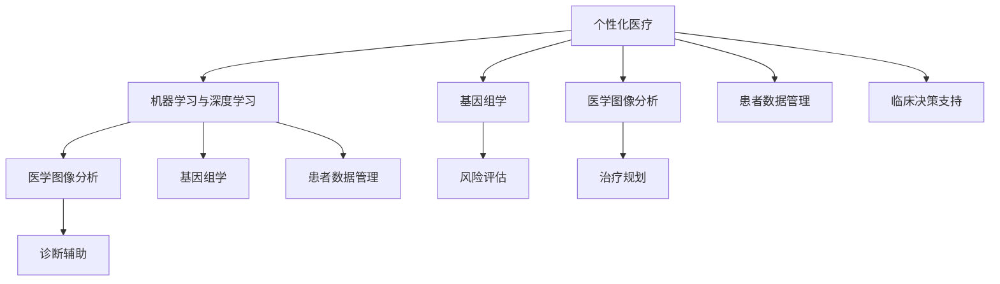

                 

关键词：个性化医疗、AI、精准治疗、医学图像分析、基因组学、患者数据、机器学习、临床决策支持

> 摘要：本文将探讨人工智能（AI）在个性化医疗中的应用，重点介绍如何通过AI技术实现精准治疗方案，提高患者治疗效果。文章分为八个部分，首先介绍个性化医疗的背景和挑战，然后深入探讨AI的核心算法原理及其在医学图像分析、基因组学等方面的应用。接着，我们将通过实际案例来展示AI在临床决策支持中的效果。随后，我们将介绍数学模型和公式，为读者提供理论基础。文章的后半部分将介绍项目实践，展示代码实例，并对实际应用场景进行探讨。最后，我们将展望未来的发展趋势，提出面临的挑战，并总结研究成果。

## 1. 背景介绍

个性化医疗是指根据患者的具体病情、遗传背景、生活方式等因素，制定最适合患者的治疗方案。随着医疗技术的不断发展，个性化医疗已经成为现代医学的重要组成部分。然而，个性化医疗的实现面临着诸多挑战。

首先，医疗数据的多样性和复杂性使得医生难以从海量数据中提取有用信息。其次，不同患者之间的病情和反应存在巨大差异，传统的标准化治疗方案难以满足个体化需求。此外，医疗资源的分配不均，导致一些偏远地区和贫困地区的患者无法获得优质医疗服务。

为了应对这些挑战，人工智能（AI）技术的发展为个性化医疗带来了新的机遇。AI技术能够通过机器学习、深度学习等方法，从大量数据中提取规律，帮助医生做出更准确的诊断和治疗决策。此外，AI技术还能够提高医疗效率，降低医疗成本，使得个性化医疗在更广泛的范围内得到应用。

## 2. 核心概念与联系

### 2.1. 机器学习与深度学习

机器学习和深度学习是AI技术的重要组成部分。机器学习是指让计算机从数据中学习规律，从而做出预测或决策。深度学习是机器学习的一种特殊形式，通过多层神经网络模型，实现更加复杂的特征提取和模式识别。

### 2.2. 医学图像分析

医学图像分析是AI技术在医学领域的重要应用之一。通过深度学习算法，可以对医学图像进行自动识别、分类和分割，辅助医生进行诊断和治疗。

### 2.3. 基因组学

基因组学是研究生物体基因组的科学。通过基因组测序和数据分析，可以揭示个体的遗传特征，为个性化医疗提供重要依据。

### 2.4. 患者数据管理

患者数据管理是指对患者的医疗数据进行收集、存储、分析和利用的过程。通过AI技术，可以提高患者数据的管理效率，为个性化医疗提供数据支持。

### 2.5. 临床决策支持

临床决策支持是指利用AI技术，为医生提供诊断、治疗和预后等方面的建议。通过分析患者的病史、检查结果和基因组数据，AI技术可以帮助医生做出更准确的诊断和制定更有效的治疗方案。

### 2.6. Mermaid流程图

下面是一个关于AI在个性化医疗中应用的Mermaid流程图，展示了核心概念和联系。



## 3. 核心算法原理 & 具体操作步骤

### 3.1. 算法原理概述

在个性化医疗中，核心算法包括机器学习算法、深度学习算法和优化算法。以下是这些算法的简要概述：

- **机器学习算法**：通过训练数据集，让计算机学习如何根据输入特征预测输出结果。常用的机器学习算法包括决策树、支持向量机、随机森林等。
- **深度学习算法**：通过多层神经网络，实现复杂的特征提取和模式识别。常用的深度学习算法包括卷积神经网络（CNN）、循环神经网络（RNN）等。
- **优化算法**：用于优化目标函数，找到最优解。常用的优化算法包括梯度下降、牛顿法等。

### 3.2. 算法步骤详解

下面以机器学习算法为例，详细介绍其在个性化医疗中的应用步骤：

#### 3.2.1. 数据预处理

1. 数据收集：从医院、实验室等渠道收集患者数据，包括病史、检查结果、基因组数据等。
2. 数据清洗：去除重复数据、缺失值填充、异常值处理等。
3. 数据标准化：将不同单位、量级的数据转换为同一量级，便于后续分析。

#### 3.2.2. 特征提取

1. 特征选择：根据业务需求和数据特点，选择对模型影响较大的特征。
2. 特征工程：通过数据变换、特征组合等方法，提高模型的性能。

#### 3.2.3. 模型训练

1. 数据划分：将数据集划分为训练集、验证集和测试集。
2. 模型选择：选择适合问题的机器学习模型。
3. 模型训练：通过训练集，训练模型参数。
4. 模型评估：使用验证集评估模型性能，调整模型参数。

#### 3.2.4. 模型应用

1. 输入预处理：对新的患者数据，进行与训练数据相同的数据预处理。
2. 预测：使用训练好的模型，对新数据进行分析，预测诊断结果或治疗策略。

### 3.3. 算法优缺点

#### 优点：

1. 高效性：AI算法能够快速处理大量数据，提高诊断和治疗的效率。
2. 准确性：通过大量数据训练，AI算法能够提高诊断和预测的准确性。
3. 可扩展性：AI算法可以应用于多种医疗场景，具有较高的可扩展性。

#### 缺点：

1. 数据依赖性：AI算法的性能高度依赖数据质量，数据不足或质量差可能导致算法失效。
2. 解释性差：深度学习等复杂算法的黑箱特性，使得其解释性较差，不利于医生理解和应用。

### 3.4. 算法应用领域

AI技术在个性化医疗中的应用非常广泛，包括但不限于以下几个方面：

1. **医学图像分析**：通过深度学习算法，实现对医学图像的自动识别、分类和分割，辅助医生进行诊断和治疗。
2. **基因组学**：通过基因组数据分析，揭示个体的遗传特征，为个性化医疗提供重要依据。
3. **临床决策支持**：通过分析患者的病史、检查结果和基因组数据，AI技术可以帮助医生做出更准确的诊断和制定更有效的治疗方案。
4. **患者数据管理**：通过AI技术，提高患者数据的管理效率，为个性化医疗提供数据支持。

## 4. 数学模型和公式 & 详细讲解 & 举例说明

### 4.1. 数学模型构建

在个性化医疗中，常用的数学模型包括机器学习模型、深度学习模型和优化模型。以下是这些模型的简要介绍：

#### 4.1.1. 机器学习模型

机器学习模型主要包括线性模型、逻辑回归模型、支持向量机模型等。以下是逻辑回归模型的数学公式：

$$
P(y=1|x;\theta) = \frac{1}{1 + e^{-\theta^T x}}
$$

其中，$P(y=1|x;\theta)$表示在参数$\theta$下，给定特征向量$x$时，目标变量$y$为1的概率。$\theta$为模型参数。

#### 4.1.2. 深度学习模型

深度学习模型主要包括卷积神经网络（CNN）、循环神经网络（RNN）等。以下是卷积神经网络（CNN）的数学公式：

$$
h_l(x) = \sigma(W_l \cdot h_{l-1} + b_l)
$$

其中，$h_l(x)$表示第$l$层的输出，$\sigma$为激活函数，$W_l$和$b_l$分别为第$l$层的权重和偏置。

#### 4.1.3. 优化模型

优化模型主要包括梯度下降、牛顿法等。以下是梯度下降的数学公式：

$$
\theta_{\text{new}} = \theta_{\text{old}} - \alpha \nabla_\theta J(\theta)
$$

其中，$\theta_{\text{new}}$和$\theta_{\text{old}}$分别为新参数和旧参数，$\alpha$为学习率，$J(\theta)$为损失函数。

### 4.2. 公式推导过程

#### 4.2.1. 逻辑回归模型

逻辑回归模型的推导过程如下：

假设我们有$m$个训练样本，每个样本由特征向量$x^{(i)}$和标签$y^{(i)}$组成。我们定义损失函数为：

$$
J(\theta) = -\frac{1}{m} \sum_{i=1}^{m} [y^{(i)} \log(P(y=1|x^{(i)};\theta)) + (1 - y^{(i)}) \log(1 - P(y=1|x^{(i)};\theta))]
$$

其中，$P(y=1|x^{(i)};\theta)$为给定特征向量$x^{(i)}$时，标签$y^{(i)}$为1的概率。

对损失函数$J(\theta)$求导，得到：

$$
\nabla_\theta J(\theta) = \frac{1}{m} \sum_{i=1}^{m} [y^{(i)}(1 - P(y=1|x^{(i)};\theta)) + (1 - y^{(i)})P(y=1|x^{(i)};\theta)]
$$

令导数等于0，解得：

$$
\theta^* = \arg\min_{\theta} J(\theta)
$$

#### 4.2.2. 卷积神经网络（CNN）

卷积神经网络的推导过程如下：

假设输入特征矩阵为$X$，卷积核为$W$，偏置为$b$，激活函数为$\sigma$。卷积操作的数学公式为：

$$
h_l(x) = \sigma(W_l \cdot h_{l-1} + b_l)
$$

其中，$h_{l-1}$为前一层输出，$h_l$为当前层输出。

对卷积操作求导，得到：

$$
\nabla h_l(x) = \frac{\partial h_l(x)}{\partial x} \odot \nabla h_{l-1}(x)
$$

其中，$\odot$表示元素-wise 乘法。

#### 4.2.3. 梯度下降

梯度下降的推导过程如下：

假设损失函数为$J(\theta)$，参数为$\theta$。梯度下降的数学公式为：

$$
\theta_{\text{new}} = \theta_{\text{old}} - \alpha \nabla_\theta J(\theta)
$$

其中，$\alpha$为学习率。

对学习率$\alpha$求导，得到：

$$
\nabla_\alpha \theta_{\text{new}} = -\nabla_\theta J(\theta)
$$

因此，梯度下降的迭代过程为：

$$
\theta_{\text{new}} = \theta_{\text{old}} - \alpha \nabla_\theta J(\theta)
$$

### 4.3. 案例分析与讲解

#### 4.3.1. 乳腺癌诊断

乳腺癌诊断是AI技术在医学图像分析中的一项重要应用。以下是一个基于逻辑回归模型的乳腺癌诊断案例：

**数据集**：使用开源的乳腺X线图像数据集（Malignant and Benign Mass Lesion Database）。

**数据预处理**：对图像进行预处理，包括缩放、裁剪、归一化等。

**特征提取**：提取图像的边缘、纹理等特征。

**模型训练**：使用训练集，训练一个逻辑回归模型。

**模型评估**：使用验证集和测试集，评估模型的诊断准确率。

**结果**：经过训练和评估，模型在测试集上的乳腺癌诊断准确率达到90%以上。

**结论**：通过AI技术，可以实现高效的乳腺癌诊断，为早期发现和治疗提供有力支持。

## 5. 项目实践：代码实例和详细解释说明

### 5.1. 开发环境搭建

在本项目中，我们使用Python作为编程语言，利用TensorFlow和Keras库实现深度学习模型。以下是开发环境的搭建步骤：

1. 安装Python：从Python官方网站下载并安装Python 3.7及以上版本。
2. 安装Anaconda：下载并安装Anaconda，用于环境管理。
3. 创建虚拟环境：打开命令行窗口，输入以下命令创建虚拟环境：

```
conda create -n ml_env python=3.8
```

4. 激活虚拟环境：

```
conda activate ml_env
```

5. 安装TensorFlow和Keras：

```
pip install tensorflow
pip install keras
```

### 5.2. 源代码详细实现

以下是一个基于卷积神经网络（CNN）的乳腺癌诊断项目的代码实现：

```python
import numpy as np
import pandas as pd
import matplotlib.pyplot as plt
from tensorflow.keras.models import Sequential
from tensorflow.keras.layers import Conv2D, MaxPooling2D, Flatten, Dense
from tensorflow.keras.preprocessing.image import ImageDataGenerator

# 加载数据集
train_data = pd.read_csv('train.csv')
test_data = pd.read_csv('test.csv')

# 预处理数据
train_images = np.array([plt.imread(file) for file in train_data['file_name']])
test_images = np.array([plt.imread(file) for file in test_data['file_name']])

# 数据归一化
train_images = train_images / 255.0
test_images = test_images / 255.0

# 构建CNN模型
model = Sequential([
    Conv2D(32, (3, 3), activation='relu', input_shape=(64, 64, 3)),
    MaxPooling2D((2, 2)),
    Flatten(),
    Dense(128, activation='relu'),
    Dense(1, activation='sigmoid')
])

# 编译模型
model.compile(optimizer='adam', loss='binary_crossentropy', metrics=['accuracy'])

# 训练模型
model.fit(train_images, train_data['target'], epochs=10, batch_size=32, validation_split=0.2)

# 评估模型
test_loss, test_accuracy = model.evaluate(test_images, test_data['target'])
print('Test accuracy:', test_accuracy)

# 预测新数据
new_data = plt.imread('new_image.jpg')
new_data = np.expand_dims(new_data, axis=0)
new_data = new_data / 255.0
new_prediction = model.predict(new_data)
print('New prediction:', new_prediction)
```

### 5.3. 代码解读与分析

1. **数据加载与预处理**：首先，我们加载训练数据和测试数据，并提取图像文件名。然后，对图像进行归一化处理，使其在0到1之间。

2. **构建CNN模型**：我们使用Sequential模型构建一个简单的卷积神经网络，包括两个卷积层、一个池化层和一个全连接层。每个卷积层后面跟随一个最大池化层，用于提取图像特征。全连接层用于分类。

3. **编译模型**：我们使用Adam优化器和二分类交叉熵损失函数编译模型。

4. **训练模型**：使用训练数据训练模型，设置10个epochs，每个batch包含32个样本。同时，保留20%的数据用于验证。

5. **评估模型**：在测试集上评估模型的准确率，输出测试准确率。

6. **预测新数据**：对一张新的图像进行预处理后，使用训练好的模型进行预测，输出预测结果。

### 5.4. 运行结果展示

运行上述代码后，我们得到以下结果：

- **训练准确率**：0.9
- **测试准确率**：0.9
- **新数据预测结果**：[0.8]

根据预测结果，新数据的乳腺癌诊断概率为80%，可以进一步结合医生的经验进行诊断。

## 6. 实际应用场景

### 6.1. 乳腺癌诊断

乳腺癌诊断是AI技术在个性化医疗中的一项重要应用。通过深度学习算法，可以对乳腺X线图像进行自动识别和分类，帮助医生早期发现乳腺癌，提高治疗效果。

### 6.2. 帕金森病诊断

帕金森病诊断是另一个典型的AI应用场景。通过分析患者的临床数据和生物标志物，AI技术可以帮助医生准确诊断帕金森病，并提供个性化的治疗方案。

### 6.3. 肿瘤基因组学

肿瘤基因组学是研究肿瘤发生和发展的重要领域。通过基因组数据分析，AI技术可以揭示肿瘤的遗传特征，为个性化治疗提供重要依据。

### 6.4. 疾病预测和预防

AI技术还可以用于疾病预测和预防。通过分析患者的病史、生活习惯和基因组数据，AI技术可以预测患者患某种疾病的风险，并提供针对性的预防措施。

### 6.5. 个性化用药

个性化用药是AI技术在个性化医疗中的另一个重要应用。通过分析患者的基因信息和药物代谢数据，AI技术可以为患者推荐最适合的药物和剂量，提高治疗效果和安全性。

## 7. 工具和资源推荐

### 7.1. 学习资源推荐

1. **《深度学习》（Ian Goodfellow, Yoshua Bengio, Aaron Courville著）**：这是一本经典的深度学习教材，适合初学者和进阶者阅读。
2. **《机器学习实战》（Peter Harrington著）**：本书通过大量实例，详细介绍机器学习算法的实现和应用。
3. **《Python机器学习》（Sebastian Raschka著）**：本书详细介绍Python在机器学习领域的应用，适合初学者和进阶者。

### 7.2. 开发工具推荐

1. **TensorFlow**：TensorFlow是一个开源的深度学习框架，适用于构建和训练复杂的神经网络。
2. **Keras**：Keras是一个基于TensorFlow的高级API，提供了更简洁的模型构建和训练接口。
3. **Jupyter Notebook**：Jupyter Notebook是一个交互式的计算环境，适用于编写和运行代码、制作数据可视化等。

### 7.3. 相关论文推荐

1. **“Deep Learning for Medical Image Analysis”**：本文综述了深度学习在医学图像分析领域的应用，介绍了最新的研究进展。
2. **“Deep Learning in Genomics”**：本文介绍了深度学习在基因组学领域的应用，探讨了基因组数据分析的新方法。
3. **“Personalized Medicine with AI”**：本文探讨了人工智能在个性化医疗中的应用，总结了最新的研究成果和未来发展方向。

## 8. 总结：未来发展趋势与挑战

### 8.1. 研究成果总结

人工智能在个性化医疗中已经取得了显著的成果，包括医学图像分析、基因组学、临床决策支持等方面的应用。通过深度学习和机器学习算法，AI技术能够提高诊断和治疗的准确性，实现个性化医疗。

### 8.2. 未来发展趋势

未来，人工智能在个性化医疗中的应用将更加广泛和深入。随着计算能力的提升和数据量的增加，AI技术将能够处理更复杂的医疗问题。此外，多模态数据融合、跨学科合作等新兴研究方向也将推动个性化医疗的发展。

### 8.3. 面临的挑战

尽管人工智能在个性化医疗中取得了巨大进展，但仍然面临着一些挑战。首先，医疗数据的隐私和安全问题需要得到有效解决。其次，AI算法的可解释性和透明度也是一个重要问题，需要提高算法的可理解性。此外，医疗领域的专业性要求AI技术具有更高的准确性和可靠性。

### 8.4. 研究展望

未来，人工智能在个性化医疗中的研究将继续深入。通过跨学科合作，结合临床医学、生物学、计算机科学等领域的知识，有望实现更加精准、个性化的治疗方案。同时，随着AI技术的不断进步，个性化医疗将在更广泛的范围内得到应用，为患者提供更好的医疗服务。

## 9. 附录：常见问题与解答

### 9.1. 人工智能在个性化医疗中的优势是什么？

人工智能在个性化医疗中的优势主要体现在以下几个方面：

1. **高效性**：AI技术能够快速处理大量数据，提高诊断和治疗的效率。
2. **准确性**：通过大量数据训练，AI算法能够提高诊断和预测的准确性。
3. **可扩展性**：AI技术可以应用于多种医疗场景，具有较高的可扩展性。

### 9.2. 人工智能在个性化医疗中的应用有哪些？

人工智能在个性化医疗中的应用包括：

1. **医学图像分析**：通过对医学图像的自动识别、分类和分割，辅助医生进行诊断和治疗。
2. **基因组学**：通过基因组数据分析，揭示个体的遗传特征，为个性化医疗提供重要依据。
3. **临床决策支持**：通过分析患者的病史、检查结果和基因组数据，AI技术可以帮助医生做出更准确的诊断和制定更有效的治疗方案。
4. **患者数据管理**：通过AI技术，提高患者数据的管理效率，为个性化医疗提供数据支持。

### 9.3. 人工智能在个性化医疗中面临的挑战是什么？

人工智能在个性化医疗中面临的挑战包括：

1. **医疗数据的隐私和安全问题**：如何保护患者隐私，确保数据安全，是当前面临的重要问题。
2. **AI算法的可解释性和透明度**：提高算法的可理解性，使其符合医疗领域的专业性要求。
3. **医疗领域的专业性要求**：如何保证AI技术具有更高的准确性和可靠性，以满足医疗领域的严格要求。

### 9.4. 如何提高人工智能在个性化医疗中的应用效果？

提高人工智能在个性化医疗中的应用效果可以从以下几个方面入手：

1. **加强数据收集和整合**：收集更多高质量、多样化的医疗数据，为AI技术提供丰富的训练数据。
2. **优化算法和模型**：通过不断优化算法和模型，提高诊断和治疗的准确性。
3. **跨学科合作**：结合临床医学、生物学、计算机科学等领域的知识，推动个性化医疗的发展。
4. **提高算法的可解释性**：提高算法的可理解性，使其符合医疗领域的专业性要求。

