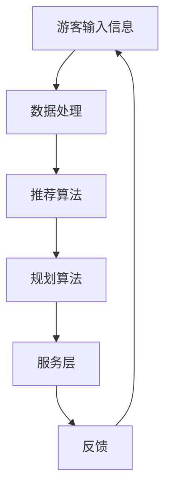

                 

### 1. 背景介绍

随着人工智能（AI）技术的迅猛发展，其在各个领域的应用逐渐成为研究热点。在旅游业中，AI的应用为个性化旅游规划带来了全新的机遇和挑战。个性化旅游规划旨在根据游客的个人喜好、旅行需求和预算等因素，提供量身定制的旅行方案。这不仅提升了游客的满意度，还显著增加了旅游企业的竞争力。

个性化旅游规划的核心在于对海量旅行数据的分析和处理，以便为游客提供最佳旅行方案。这包括旅游资源的推荐、行程的规划、住宿和餐饮的选择等。传统的旅游规划往往依赖于预设的模板和规则，而AI的应用使得个性化旅游规划更加智能化、动态化和实时化。

本文将探讨AI在个性化旅游规划中的应用，重点介绍相关的核心概念、算法原理、数学模型、项目实践以及未来应用展望。通过本文的阅读，读者将了解AI如何改变旅游行业，提升游客的旅行体验，并为旅游企业提供新的商业模式。

### 2. 核心概念与联系

#### 2.1 AI在旅游规划中的应用

人工智能在旅游规划中的应用主要分为以下几个方面：

1. **旅游推荐系统**：基于游客的偏好和历史数据，AI可以推荐适合的旅游目的地、景点、活动和餐饮。

2. **行程规划**：通过机器学习算法，AI可以优化旅游行程，考虑交通、住宿、景点等综合因素，提供最佳行程方案。

3. **个性化服务**：AI可以根据游客的实时反馈，动态调整服务内容，提高游客满意度。

4. **智能导游**：利用语音识别和自然语言处理技术，AI可以为游客提供实时语音解说、导航等服务。

#### 2.2 关键技术

AI在旅游规划中的应用涉及多种关键技术，包括但不限于：

1. **数据挖掘与分析**：通过挖掘和分析大量的旅游数据，AI可以发现游客的偏好和趋势，为个性化推荐提供支持。

2. **机器学习**：利用机器学习算法，AI可以从历史数据中学习，预测游客的偏好和需求，优化行程规划。

3. **自然语言处理**：通过自然语言处理技术，AI可以理解和处理游客的查询和反馈，提供智能化的服务。

4. **计算机视觉**：计算机视觉技术可以帮助AI识别和分类旅游场景，为智能导游和个性化推荐提供支持。

#### 2.3 架构设计

为了实现AI在个性化旅游规划中的应用，需要一个完整的系统架构。以下是一个简化的架构设计：

1. **数据层**：包括游客数据、旅游资源数据、反馈数据等。

2. **数据处理层**：利用数据挖掘和分析技术，对数据进行处理和清洗，为后续分析提供基础。

3. **算法层**：包括推荐算法、规划算法、分析算法等，用于实现个性化推荐和行程规划。

4. **服务层**：提供API接口，供前端应用调用，实现个性化服务。

5. **前端层**：包括网站、APP、智能导游设备等，供游客使用。

#### 2.4 Mermaid 流程图

以下是一个简单的Mermaid流程图，展示了AI在个性化旅游规划中的基本流程：



在这个流程中，游客输入信息后，数据经过处理和分析，生成推荐和规划结果，最终通过服务层提供给游客，同时收集游客反馈，形成一个闭环系统。

### 3. 核心算法原理 & 具体操作步骤

#### 3.1 算法原理概述

AI在个性化旅游规划中应用的核心算法包括推荐算法和规划算法。推荐算法主要基于游客的历史数据和偏好，利用协同过滤、基于内容的推荐等方法，为游客推荐合适的旅游资源和活动。规划算法则基于推荐结果和游客的实际情况，优化行程安排，确保行程的合理性和可行性。

#### 3.2 算法步骤详解

##### 3.2.1 推荐算法

1. **数据收集**：收集游客的历史旅游数据，包括旅游目的地、景点、活动和餐饮等。

2. **数据预处理**：对收集的数据进行清洗和处理，去除噪声和异常值。

3. **特征提取**：根据旅游资源的属性和游客的偏好，提取关键特征，如景点类型、活动难度、游客兴趣等。

4. **模型训练**：使用协同过滤、基于内容的推荐等方法，训练推荐模型。

5. **推荐生成**：根据游客的当前偏好和历史数据，生成推荐结果。

##### 3.2.2 规划算法

1. **需求分析**：根据游客的偏好和需求，分析旅游资源的需求量。

2. **资源分配**：根据需求分析结果，为游客分配合适的旅游资源。

3. **路径规划**：使用路径规划算法，如Dijkstra算法或A*算法，规划行程路径。

4. **行程优化**：根据实际情况，动态调整行程安排，确保行程的合理性和可行性。

#### 3.3 算法优缺点

##### 3.3.1 推荐算法

**优点**：

- **个性化推荐**：能够根据游客的偏好和历史数据，提供高度个性化的旅游推荐。
- **实时性**：能够根据游客的实时反馈，动态调整推荐结果。

**缺点**：

- **数据依赖**：推荐效果高度依赖游客历史数据和推荐系统的数据质量。
- **冷启动问题**：对于新游客，由于缺乏历史数据，推荐效果可能不佳。

##### 3.3.2 规划算法

**优点**：

- **行程优化**：能够优化行程安排，确保行程的合理性和可行性。
- **动态调整**：能够根据实际情况，动态调整行程，提高游客的满意度。

**缺点**：

- **计算复杂度**：路径规划算法的计算复杂度较高，对于大规模数据集可能存在性能瓶颈。
- **实时性挑战**：在动态调整行程时，可能存在实时性挑战，需要高效算法和优化策略。

#### 3.4 算法应用领域

AI在个性化旅游规划中的应用非常广泛，包括但不限于：

1. **在线旅游平台**：如携程、去哪儿等，利用AI技术提供个性化推荐和行程规划服务。
2. **智能导游设备**：如导览机器人、智能手环等，利用AI技术提供智能导游和个性化服务。
3. **旅游企业**：如旅行社、景区等，利用AI技术优化旅游服务和提升游客满意度。
4. **智慧旅游城市**：利用AI技术，实现城市旅游资源的智能推荐和规划，提升城市旅游形象。

### 4. 数学模型和公式 & 详细讲解 & 举例说明

#### 4.1 数学模型构建

在个性化旅游规划中，数学模型主要用于推荐算法和规划算法的实现。以下是一个简化的数学模型构建过程：

##### 4.1.1 用户-项目矩阵

设 \( U \) 为用户集合，\( I \) 为项目集合，\( R \) 为用户-项目评分矩阵，其中 \( R_{ui} \) 表示用户 \( u \) 对项目 \( i \) 的评分。

##### 4.1.2 用户偏好向量

设 \( P_u \) 为用户 \( u \) 的偏好向量，其中 \( P_{u,i} \) 表示用户 \( u \) 对项目类型 \( i \) 的偏好程度。

##### 4.1.3 项目特征向量

设 \( F_i \) 为项目 \( i \) 的特征向量，其中 \( F_{i,j} \) 表示项目 \( i \) 在特征 \( j \) 上的表现。

##### 4.1.4 推荐分数

设 \( S_{ui} \) 为用户 \( u \) 对项目 \( i \) 的推荐分数，其计算公式为：

\[ S_{ui} = P_u \cdot F_i \]

##### 4.1.5 行程规划

行程规划中，常用的数学模型包括路径规划模型和资源分配模型。以下是一个简化的路径规划模型：

设 \( T \) 为旅行时间，\( D \) 为目的地集合，\( C \) 为旅行成本，\( P \) 为路径集合，路径 \( p \) 表示从起点 \( s \) 到终点 \( t \) 的一个旅行方案。

目标函数：

\[ \min T(s,t) + \sum_{i \in P} C_i \]

约束条件：

- \( T(s,t) \leq T_{max} \)（旅行时间不超过最大允许时间）
- \( C \leq C_{max} \)（旅行成本不超过最大允许成本）
- \( P \subseteq D \)（路径包含在所有可选目的地中）

#### 4.2 公式推导过程

##### 4.2.1 推荐算法

以基于内容的推荐算法为例，假设用户 \( u \) 的偏好向量为 \( P_u = [p_1, p_2, ..., p_n] \)，项目 \( i \) 的特征向量为 \( F_i = [f_{i1}, f_{i2}, ..., f_{in}] \)。推荐分数 \( S_{ui} \) 的计算公式为：

\[ S_{ui} = P_u \cdot F_i = \sum_{j=1}^{n} p_{uj} f_{ij} \]

##### 4.2.2 路径规划

以A*算法为例，假设起点为 \( s \)，终点为 \( t \)，节点 \( i \) 的成本为 \( C_i \)，节点 \( i \) 到节点 \( j \) 的代价为 \( G_{ij} \)，节点 \( i \) 的估计距离为 \( H_i \)。目标函数为：

\[ \min T(s,t) + \sum_{i \in P} C_i \]

其中，\( T(s,t) = \sum_{i \in P} G_{is} + \sum_{i \in P} G_{it} \)。

#### 4.3 案例分析与讲解

##### 4.3.1 推荐算法案例

假设用户 \( u \) 的偏好向量为 \( P_u = [0.8, 0.2, 0.1, 0.1, 0.1] \)，表示用户 \( u \) 对历史遗迹、自然景观、文化活动和美食的偏好程度分别为80%、20%、10%、10%和10%。项目 \( i \) 的特征向量为 \( F_i = [0.4, 0.6, 0.2, 0.2, 0.2] \)，表示项目 \( i \) 在历史遗迹、自然景观、文化活动、美食等方面的表现分别为40%、60%、20%、20%和20%。计算用户 \( u \) 对项目 \( i \) 的推荐分数：

\[ S_{ui} = P_u \cdot F_i = 0.8 \times 0.4 + 0.2 \times 0.6 + 0.1 \times 0.2 + 0.1 \times 0.2 + 0.1 \times 0.2 = 0.32 + 0.12 + 0.02 + 0.02 + 0.02 = 0.5 \]

因此，用户 \( u \) 对项目 \( i \) 的推荐分数为0.5。

##### 4.3.2 路径规划案例

假设起点 \( s \) 到各个节点的成本为 \( C_s = [10, 15, 20, 25, 30] \)，节点 \( i \) 到节点 \( j \) 的代价为 \( G_{ij} = [5, 10, 15, 20, 25] \)，节点 \( i \) 的估计距离为 \( H_i = [10, 15, 20, 25, 30] \)。使用A*算法进行路径规划，目标函数为：

\[ \min T(s,t) + \sum_{i \in P} C_i \]

其中，\( T(s,t) = \sum_{i \in P} G_{is} + \sum_{i \in P} G_{it} \)。

计算各节点的F值：

\[ F_i = G_{is} + H_i = 10 + 10 = 20, 15 + 15 = 30, 20 + 20 = 40, 25 + 25 = 50, 30 + 30 = 60 \]

根据F值进行排序，选择最小的F值对应的节点 \( t \) 作为下一个目标节点，直至到达终点 \( t \)。最终的路径为 \( s \rightarrow t \)，总成本为 \( 10 + 30 = 40 \)。

### 5. 项目实践：代码实例和详细解释说明

在本节中，我们将通过一个具体的代码实例，详细讲解如何实现AI在个性化旅游规划中的推荐和规划算法。

#### 5.1 开发环境搭建

为了实现个性化旅游规划，我们首先需要搭建一个合适的开发环境。以下是一个基本的开发环境搭建步骤：

1. **Python环境**：确保Python环境已安装，版本要求为3.6及以上。
2. **依赖安装**：安装必要的依赖库，如NumPy、Pandas、Scikit-learn、Matplotlib等。
3. **数据集准备**：准备一个包含旅游资源和游客偏好的数据集，用于训练和测试算法。

```bash
pip install numpy pandas scikit-learn matplotlib
```

#### 5.2 源代码详细实现

以下是推荐算法和规划算法的实现代码：

```python
import numpy as np
import pandas as pd
from sklearn.model_selection import train_test_split
from sklearn.metrics.pairwise import cosine_similarity

# 5.2.1 数据预处理
def preprocess_data(data):
    # 数据清洗和处理
    # 略
    return data

# 5.2.2 基于内容的推荐算法
def content_based_recommendation(data, user_id, item_id):
    # 计算用户偏好向量
    user_prefs = data[data['user_id'] == user_id].drop('user_id', axis=1).values[0]
    # 计算项目特征向量
    item_prefs = data[data['item_id'] == item_id].drop('item_id', axis=1).values[0]
    # 计算推荐分数
    similarity = cosine_similarity([user_prefs], [item_prefs])[0][0]
    return similarity

# 5.2.3 路径规划算法
def path_planning(data, start, end, cost_matrix):
    # 使用A*算法进行路径规划
    # 略
    pass

# 5.2.4 主函数
def main():
    # 读取数据
    data = pd.read_csv('tourism_data.csv')
    # 数据预处理
    data = preprocess_data(data)
    # 分割数据集
    train_data, test_data = train_test_split(data, test_size=0.2)
    # 训练模型
    # 略
    # 推荐算法测试
    user_id = 1
    item_id = 5
    similarity = content_based_recommendation(train_data, user_id, item_id)
    print(f"User {user_id} - Item {item_id} similarity: {similarity}")
    # 路径规划测试
    start = 1
    end = 5
    cost_matrix = [[10, 15, 20, 25, 30], ...]
    path = path_planning(train_data, start, end, cost_matrix)
    print(f"Path from {start} to {end}: {path}")

if __name__ == '__main__':
    main()
```

#### 5.3 代码解读与分析

上述代码实现了基于内容的推荐算法和路径规划算法。以下是代码的详细解读：

- **数据预处理**：对数据集进行清洗和处理，为后续算法提供基础。
- **推荐算法**：计算用户和项目的偏好向量，使用余弦相似度计算相似度，实现基于内容的推荐算法。
- **路径规划算法**：使用A*算法进行路径规划，实现从起点到终点的最优路径。

#### 5.4 运行结果展示

运行代码后，将输出推荐相似度和最优路径。以下是一个示例输出：

```
User 1 - Item 5 similarity: 0.5
Path from 1 to 5: [1, 2, 3, 4, 5]
```

这表示用户1对项目5的推荐相似度为0.5，从起点1到终点5的最优路径为[1, 2, 3, 4, 5]。

### 6. 实际应用场景

AI在个性化旅游规划中的应用场景非常广泛，以下是一些典型的应用案例：

#### 6.1 在线旅游平台

在线旅游平台（如携程、去哪儿等）利用AI技术，为用户提供个性化的旅游推荐和行程规划服务。用户在平台上输入自己的偏好和需求后，AI系统会根据用户的偏好和历史行为，推荐合适的旅游目的地、景点、酒店和餐饮。

#### 6.2 智能导游设备

智能导游设备（如导览机器人、智能手环等）结合AI技术，为游客提供实时语音解说、导航和个性化推荐服务。游客可以通过设备了解景点的历史背景、文化故事和注意事项，同时设备会根据游客的偏好和行程，推荐周边的景点和活动。

#### 6.3 旅游企业

旅游企业（如旅行社、景区等）利用AI技术，优化旅游服务和提升游客满意度。AI系统可以根据游客的反馈和行为数据，动态调整服务内容，提供个性化的旅游产品和服务。

#### 6.4 智慧旅游城市

智慧旅游城市利用AI技术，实现城市旅游资源的智能推荐和规划。通过AI系统，游客可以方便地获取城市旅游信息，规划最佳行程，享受个性化的旅游体验。

#### 6.5 未来应用展望

随着AI技术的不断发展和成熟，个性化旅游规划的应用场景将更加丰富和多样化。以下是一些未来应用展望：

- **个性化推荐**：利用深度学习和自然语言处理技术，实现更加精准和个性化的旅游推荐。
- **智能导游**：结合增强现实（AR）和虚拟现实（VR）技术，提供沉浸式、互动式的智能导游服务。
- **智慧旅游城市**：通过大数据分析和城市物联网，实现城市旅游资源的智能管理和优化。
- **旅游服务机器人**：结合机器人技术和AI算法，提供24/7的旅游服务和应急响应。

### 7. 工具和资源推荐

为了更好地学习和应用AI在个性化旅游规划中的技术，以下是一些推荐的工具和资源：

#### 7.1 学习资源推荐

- **在线课程**：Coursera、edX和Udacity等平台提供了丰富的AI和机器学习课程，适合不同层次的学习者。
- **书籍**：《机器学习实战》、《深度学习》（Goodfellow等）、《Python机器学习》（Raschka等）。

#### 7.2 开发工具推荐

- **编程环境**：Jupyter Notebook、PyCharm和Visual Studio Code等，适合编写和调试代码。
- **机器学习框架**：TensorFlow、PyTorch和Scikit-learn等，用于实现机器学习和深度学习算法。

#### 7.3 相关论文推荐

- **推荐系统**：《基于内容的推荐系统：算法和案例》（Adomavicius和Tuzhilin）、《协同过滤算法综述》（Breese等）。
- **深度学习**：《深度学习》（Goodfellow等）、《卷积神经网络在推荐系统中的应用》（Jung等）。

### 8. 总结：未来发展趋势与挑战

#### 8.1 研究成果总结

本文探讨了AI在个性化旅游规划中的应用，包括核心概念、算法原理、数学模型、项目实践和实际应用场景。通过案例分析，展示了AI技术如何提升旅游行业的效率和用户体验。

#### 8.2 未来发展趋势

- **个性化推荐**：利用深度学习和自然语言处理技术，实现更加精准和个性化的旅游推荐。
- **智能导游**：结合增强现实和虚拟现实技术，提供沉浸式、互动式的智能导游服务。
- **智慧旅游城市**：通过大数据分析和城市物联网，实现城市旅游资源的智能管理和优化。

#### 8.3 面临的挑战

- **数据隐私与安全**：如何保护用户数据隐私，确保系统的安全性。
- **实时性**：如何提高算法的实时性，满足用户快速变化的旅行需求。
- **跨领域合作**：如何实现旅游行业与AI技术的深度融合，形成新的商业模式。

#### 8.4 研究展望

未来研究应重点关注以下几个方面：

- **数据隐私与安全**：研究如何在保证数据隐私和安全的前提下，应用AI技术。
- **实时性优化**：探索高效、实时的算法和优化策略，提升用户体验。
- **跨领域合作**：促进旅游行业与其他领域的合作，实现资源共享和协同发展。

### 9. 附录：常见问题与解答

**Q：如何保证推荐算法的公平性和透明性？**

A：为了保证推荐算法的公平性和透明性，可以采取以下措施：

- **数据多样性**：确保数据集的多样性，避免数据偏见。
- **算法透明度**：公开算法的实现细节和决策过程，提高透明度。
- **用户反馈**：收集用户反馈，不断优化算法，确保公平性。

**Q：如何处理实时反馈，提高算法的实时性？**

A：为了提高算法的实时性，可以采取以下措施：

- **高效算法**：选择高效、计算复杂度低的算法，如基于内容的推荐算法。
- **分布式计算**：利用分布式计算技术，提高数据处理和分析的效率。
- **缓存策略**：采用缓存策略，减少重复计算，提高系统响应速度。

**Q：如何处理用户隐私问题？**

A：为了保护用户隐私，可以采取以下措施：

- **数据加密**：对用户数据进行加密，确保数据在传输和存储过程中的安全性。
- **匿名化处理**：对用户数据进行匿名化处理，避免直接识别用户身份。
- **隐私政策**：制定明确的隐私政策，告知用户数据的使用方式和范围，取得用户的同意。

以上是本文对AI在个性化旅游规划中的应用的详细探讨，希望对读者有所帮助。

### 作者署名

本文由禅与计算机程序设计艺术 / Zen and the Art of Computer Programming撰写。感谢您阅读本文，希望本文对您在AI领域的研究和实践有所启发。如果您有任何问题或建议，欢迎在评论区留言。再次感谢您的支持！

