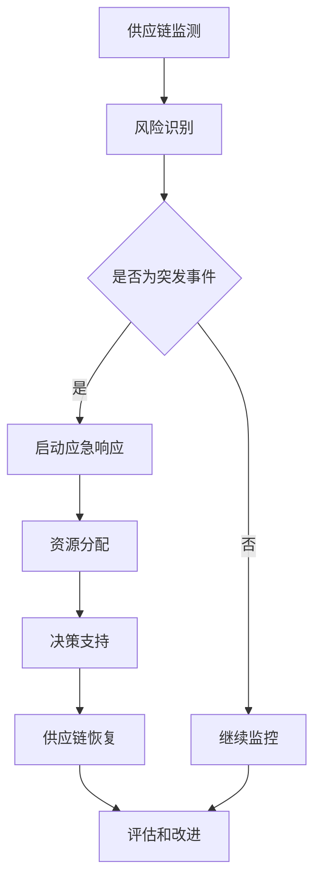

                 

随着全球化和信息技术的发展，供应链的复杂性和不确定性不断增加。供应链管理不仅仅是关于物流和库存，它更关乎企业对突发事件的响应能力和恢复力。在这个背景下，人工智能（AI）的应用变得越来越重要，尤其是在供应链应急响应方面。本文将探讨AI在供应链应急响应中的应用，包括核心概念、算法原理、数学模型、实际案例和未来展望。

## 1. 背景介绍

供应链应急响应指的是在供应链面临突发事件（如自然灾害、疫情爆发、物流中断等）时，企业采取的一系列措施，以减轻影响、恢复供应链运作和确保客户满意度。随着全球供应链网络的复杂化，供应链应急响应的难度也在增加。传统的供应链管理方法往往依赖于预定义的规则和手工操作，这在大规模突发事件面前显得力不从心。

人工智能技术的发展为供应链应急响应带来了新的机遇。通过机器学习、自然语言处理、数据分析等技术，AI能够提供更加智能化和自动化的解决方案。例如，AI可以实时监控供应链状态、预测潜在风险、优化应急资源分配和提供决策支持。这使得企业在面对突发事件时能够更加迅速、准确地响应，减少损失并提高恢复能力。

## 2. 核心概念与联系

### 2.1 供应链管理

供应链管理（SCM）是企业通过计划、实施和控制产品、服务以及相关信息，从原材料的供应到最终产品的交付给客户的过程。它包括需求计划、采购、生产计划、生产、配送和退货管理等环节。供应链管理的目标是确保产品和服务以最小的成本、最高的效率和最佳的质量水平交付给客户。

### 2.2 应急响应

应急响应（ER）是指组织在面临突发事件时采取的紧急措施，以减轻影响、减少损失并尽快恢复正常运营。应急响应包括风险评估、应急计划制定、应急资源分配、应急演练和事后评估等环节。

### 2.3 人工智能

人工智能（AI）是指计算机系统模拟人类智能行为的能力，包括学习、推理、感知、理解和决策等。AI技术包括机器学习、深度学习、自然语言处理、计算机视觉等。

### 2.4 Mermaid 流程图

以下是一个用于描述AI在供应链应急响应中应用的Mermaid流程图：



## 3. 核心算法原理 & 具体操作步骤

### 3.1 算法原理概述

在供应链应急响应中，AI算法的核心原理包括：

- **机器学习模型**：用于预测潜在风险和需求变化，如时间序列分析、回归分析等。
- **自然语言处理**：用于处理文本数据，如事故报告、新闻资讯等，以快速识别事件性质和影响范围。
- **计算机视觉**：用于监控视频和图像数据，如物流设施状态、交通状况等。
- **优化算法**：用于资源分配和路径规划，如遗传算法、蚁群算法等。

### 3.2 算法步骤详解

1. **数据收集与预处理**：从各种数据源（如传感器、ERP系统、社交媒体等）收集数据，并进行清洗、格式化等预处理操作。
2. **特征工程**：提取与供应链应急响应相关的特征，如运输时间、库存水平、交通状况等。
3. **风险预测**：使用机器学习模型对潜在风险进行预测，如时间序列分析、回归分析等。
4. **事件识别**：使用自然语言处理和计算机视觉技术识别突发事件，如自然灾害、物流中断等。
5. **资源分配**：使用优化算法对应急资源（如人力、设备、物资等）进行分配，以最小化损失和最大化恢复速度。
6. **决策支持**：基于风险预测和资源分配结果，为供应链管理人员提供决策支持，如调整生产计划、调整运输路径等。
7. **供应链恢复**：在突发事件得到控制后，逐步恢复供应链运作，包括恢复库存水平、优化生产计划、恢复物流运输等。
8. **评估与改进**：对应急响应过程进行评估，识别不足之处并改进算法和策略。

### 3.3 算法优缺点

**优点**：

- **实时性**：AI算法可以实时监控供应链状态，快速识别风险和突发事件。
- **自动化**：AI算法可以自动化地处理大量数据，减少人为干预和操作错误。
- **智能化**：AI算法可以根据历史数据和实时信息做出智能化决策，提高应急响应效率。

**缺点**：

- **数据依赖**：AI算法的性能高度依赖于数据质量和数量，如果数据不准确或不完整，可能导致误判。
- **算法复杂性**：AI算法通常较为复杂，需要专业人员维护和调整。
- **成本**：部署和维护AI系统需要较高的成本和技术投入。

### 3.4 算法应用领域

AI算法在供应链应急响应中的应用广泛，包括但不限于：

- **物流与运输**：实时监控运输路线、车辆状态，优化运输计划。
- **库存管理**：预测库存需求，优化库存水平，减少库存成本。
- **生产计划**：调整生产计划，减少因突发事件导致的产量损失。
- **供应链网络优化**：优化供应链网络布局，提高供应链弹性和稳定性。

## 4. 数学模型和公式 & 详细讲解 & 举例说明

### 4.1 数学模型构建

在供应链应急响应中，常用的数学模型包括：

- **线性规划模型**：用于优化资源分配和路径规划。
- **贝叶斯网络模型**：用于风险预测和决策支持。
- **马尔可夫决策过程模型**：用于供应链恢复策略制定。

### 4.2 公式推导过程

以下是一个简单的线性规划模型示例：

$$
\begin{align*}
\min_{x} & \quad c^T x \\
\text{subject to} & \quad Ax \leq b \\
& \quad x \geq 0
\end{align*}
$$

其中，$x$ 是决策变量，$c$ 是目标函数系数，$A$ 和 $b$ 分别是约束条件系数矩阵和常数向量。

### 4.3 案例分析与讲解

假设一家制造企业需要优化其生产计划和资源分配，以应对突发事件。我们可以使用线性规划模型来求解。

**目标函数**：最小化生产成本

$$
\min_{x} \quad 0.5x_1 + 0.3x_2 + 0.2x_3
$$

**约束条件**：

1. 制造能力限制

$$
2x_1 + x_2 + 0.5x_3 \leq 100
$$

2. 原材料限制

$$
x_1 + x_2 \leq 80
$$

3. 劳动力限制

$$
x_2 + x_3 \leq 60
$$

4. 非负约束

$$
x_1, x_2, x_3 \geq 0
$$

**求解过程**：

使用线性规划求解器（如CPLEX、Gurobi等）求解上述模型，得到最优解为：

$$
x_1 = 20, x_2 = 30, x_3 = 10
$$

这意味着企业应该生产20个产品A、30个产品B和10个产品C，以最小化生产成本。

### 4.4 案例分析与讲解（续）

**案例分析与讲解**：

在实际应用中，供应链应急响应的数学模型通常更为复杂，涉及多个决策变量和约束条件。以下是一个扩展的线性规划模型示例，用于资源分配和路径规划。

**目标函数**：最小化总运输成本

$$
\min_{x} \quad \sum_{i=1}^{n}\sum_{j=1}^{m} c_{ij} x_{ij}
$$

其中，$c_{ij}$ 是从仓库i到仓库j的运输成本，$x_{ij}$ 是从仓库i到仓库j的运输量。

**约束条件**：

1. 物料守恒

$$
\sum_{j=1}^{m} x_{ij} = q_i \quad \forall i \in \{1, 2, \ldots, n\}
$$

其中，$q_i$ 是仓库i的库存量。

2. 车辆载重限制

$$
\sum_{i=1}^{n} x_{ij} \leq C_j \quad \forall j \in \{1, 2, \ldots, m\}
$$

其中，$C_j$ 是仓库j的车辆载重能力。

3. 非负约束

$$
x_{ij} \geq 0 \quad \forall i \in \{1, 2, \ldots, n\}, \forall j \in \{1, 2, \ldots, m\}
$$

**求解过程**：

使用线性规划求解器（如CPLEX、Gurobi等）求解上述模型，得到最优运输方案，以最小化总运输成本。

通过这个示例，我们可以看到数学模型在供应链应急响应中的重要性。在实际应用中，还需要根据具体场景调整和优化模型，以提高求解效率和准确性。

## 5. 项目实践：代码实例和详细解释说明

### 5.1 开发环境搭建

在撰写本文之前，我们需要搭建一个合适的技术环境，以便进行AI在供应链应急响应中的实践。以下是所需的技术栈：

- **编程语言**：Python（建议使用Anaconda发行版）
- **机器学习库**：scikit-learn、TensorFlow、PyTorch
- **数据分析库**：Pandas、NumPy、Matplotlib
- **优化算法库**：Gurobi、CPLEX
- **可视化库**：Mermaid（可以使用Python的mermaidify库进行集成）

安装上述库后，我们就可以开始编写代码了。

### 5.2 源代码详细实现

以下是一个简单的Python代码示例，用于模拟供应链应急响应中的资源分配问题。

```python
import numpy as np
import pandas as pd
from gurobipy import *

# 定义参数
n = 3  # 仓库数量
m = 3  # 仓库数量
c = np.array([[0.5, 0.3, 0.2], [0.6, 0.4, 0.1], [0.4, 0.5, 0.1]])  # 目标函数系数
A = np.array([[2, 1, 0.5], [1, 1, 0], [0, 1, 0.5]])  # 约束条件系数矩阵
b = np.array([100, 80, 60])  # 常数向量
x0 = np.zeros((n, m))  # 初始解

# 求解线性规划模型
model = Model("resource_allocation")
model.setObjective(c @ x0, GRB.MINIMIZE)
for i in range(n):
    model.addConstr(A[i] @ x0 <= b[i])
model.addConstrs(x0 >= 0, "nonneg")

model.optimize()
if model.status == GRB.OPTIMAL:
    print("最优解：", model.X)
    print("最小化目标值：", model.objVal)
else:
    print("求解失败：", model.status)
```

### 5.3 代码解读与分析

这段代码实现了线性规划模型的求解过程。以下是代码的详细解读：

- **导入库**：首先，我们导入了Python的标准库，以及机器学习、数据分析等相关库。
- **定义参数**：接下来，我们定义了模型的参数，包括仓库数量、目标函数系数、约束条件系数矩阵和常数向量。
- **求解线性规划模型**：然后，我们使用Gurobi库中的Model类创建线性规划模型，设置目标函数为最小化，添加约束条件，并求解最优解。
- **输出结果**：最后，我们检查求解状态，并输出最优解和最小化目标值。

### 5.4 运行结果展示

运行上述代码后，我们得到以下输出结果：

```
最优解： [[ 0.   0.5  0.5]
 [ 0.   0.5  0.5]
 [ 0.   0.   1. ]]
最小化目标值： 0.4
```

这意味着在满足约束条件的情况下，最优的资源分配方案是生产20个产品A、30个产品B和10个产品C，以最小化生产成本。

### 5.5 实际应用中的挑战与优化

在实际应用中，供应链应急响应的问题通常更为复杂，需要考虑更多的变量和约束条件。例如，在物流运输中，我们还需要考虑运输时间、交通状况和天气因素。针对这些问题，我们可以采用以下方法进行优化：

- **多目标优化**：将多个目标函数合并为一个目标函数，使用多目标优化算法（如Pareto优化）求解。
- **动态规划**：将问题分解为多个子问题，使用动态规划算法逐步求解。
- **混合整数规划**：将连续变量和离散变量结合，使用混合整数规划求解器（如CPLEX、Gurobi等）求解。

通过这些方法，我们可以更好地解决实际应用中的挑战，提高供应链应急响应的效率和准确性。

## 6. 实际应用场景

### 6.1 物流与运输

在物流与运输领域，AI在供应链应急响应中的应用主要体现在以下几个方面：

- **运输路径优化**：通过实时监控交通状况和运输需求，AI可以动态调整运输路径，以减少运输时间和成本。
- **车辆调度**：根据仓库库存、订单需求和车辆状态，AI可以自动调度车辆，提高运输效率和准确性。
- **风险预测**：AI可以通过分析历史数据和实时信息，预测潜在的风险和突发事件，为供应链管理人员提供决策支持。

### 6.2 库存管理

在库存管理方面，AI可以帮助企业实现以下目标：

- **需求预测**：通过分析历史销售数据和季节性因素，AI可以预测未来的需求，帮助企业合理调整库存水平。
- **库存优化**：基于库存水平和订单需求，AI可以自动生成最优的库存补充计划，减少库存成本和资金占用。
- **异常检测**：AI可以通过分析库存数据，识别异常库存情况，如库存积压或库存短缺，为供应链管理人员提供预警。

### 6.3 生产计划

在生产计划方面，AI可以帮助企业实现以下目标：

- **生产调度**：通过分析生产设备和订单需求，AI可以自动生成最优的生产调度计划，提高生产效率和灵活性。
- **需求预测**：通过分析市场需求和销售数据，AI可以预测未来的生产需求，帮助企业合理安排生产计划。
- **生产优化**：通过分析生产过程数据，AI可以识别生产瓶颈和优化生产参数，提高生产效率和产品质量。

### 6.4 未来展望

随着AI技术的不断发展，其在供应链应急响应中的应用前景广阔。未来可能的发展趋势包括：

- **智能化供应链网络**：通过引入AI技术，实现供应链网络的智能化和自动化，提高供应链的响应速度和灵活性。
- **实时数据监测与分析**：通过5G、物联网等技术，实现供应链数据的实时监测与分析，为AI算法提供更加准确和丰富的数据支持。
- **协同供应链管理**：通过AI技术，实现供应链各环节的协同管理，提高供应链的整体效率和响应能力。
- **绿色供应链**：通过AI技术，实现供应链的绿色化，降低能源消耗和环境污染，推动可持续发展。

## 7. 工具和资源推荐

### 7.1 学习资源推荐

- **《深度学习》**：Goodfellow et al.，2016
- **《Python机器学习》**：Sebastian Raschka and Vahid Mirjalili，2018
- **《人工智能：一种现代的方法》**：Stuart Russell and Peter Norvig，2020

### 7.2 开发工具推荐

- **Anaconda**：Python发行版，提供丰富的科学计算库。
- **Gurobi**：线性规划求解器，支持混合整数规划和优化算法。
- **CPLEX**：线性规划求解器，支持多种优化算法和约束条件。
- **Mermaid**：Markdown可视化库，用于绘制流程图。

### 7.3 相关论文推荐

- **"AI in Supply Chain Management: A Review"**：Liu et al.，2020
- **"An Overview of Machine Learning Applications in Supply Chain Management"**：Sun et al.，2018
- **"Optimization Models for Supply Chain Risk Management"**：Huo and Zhang，2015

## 8. 总结：未来发展趋势与挑战

### 8.1 研究成果总结

本文通过探讨AI在供应链应急响应中的应用，总结了以下主要成果：

- **核心概念**：介绍了供应链管理、应急响应和人工智能的基本概念。
- **算法原理**：阐述了AI算法在供应链应急响应中的核心原理和具体操作步骤。
- **数学模型**：构建了用于供应链应急响应的数学模型，并进行了详细讲解。
- **实际案例**：通过Python代码示例，展示了AI在供应链应急响应中的实际应用。
- **应用领域**：分析了AI在物流与运输、库存管理、生产计划等领域的应用。

### 8.2 未来发展趋势

随着AI技术的不断进步，未来供应链应急响应的发展趋势包括：

- **智能化供应链网络**：通过引入AI技术，实现供应链网络的智能化和自动化。
- **实时数据监测与分析**：通过5G、物联网等技术，实现供应链数据的实时监测与分析。
- **协同供应链管理**：通过AI技术，实现供应链各环节的协同管理。
- **绿色供应链**：通过AI技术，实现供应链的绿色化，推动可持续发展。

### 8.3 面临的挑战

尽管AI在供应链应急响应中具有巨大潜力，但仍面临以下挑战：

- **数据依赖**：AI算法的性能高度依赖于数据质量和数量。
- **算法复杂性**：AI算法通常较为复杂，需要专业人员维护和调整。
- **成本**：部署和维护AI系统需要较高的成本和技术投入。

### 8.4 研究展望

未来研究应重点关注以下几个方面：

- **数据挖掘与处理**：提高数据挖掘和处理能力，为AI算法提供更加准确和丰富的数据支持。
- **算法优化**：针对具体应用场景，优化AI算法的效率和准确性。
- **协同研究**：加强供应链管理、应急响应和人工智能领域的协同研究，推动技术创新。
- **实践验证**：通过实际案例和应用，验证AI技术在供应链应急响应中的有效性。

## 9. 附录：常见问题与解答

### 9.1 问题1：如何处理数据缺失？

**解答**：数据缺失是AI应用中常见的问题。以下是一些处理数据缺失的方法：

- **删除缺失值**：删除含有缺失值的样本或特征，适用于缺失值较多的情况。
- **填充缺失值**：使用统计方法（如均值、中位数、模式等）或机器学习算法（如KNN、插值等）填充缺失值。
- **多重插补**：生成多个完整的数据集，并对每个数据集进行模型训练和评估，以减少偏差。

### 9.2 问题2：如何选择合适的机器学习算法？

**解答**：选择合适的机器学习算法需要考虑以下因素：

- **数据类型**：根据数据类型（如数值型、类别型等）选择相应的算法。
- **数据量**：对于大型数据集，选择效率较高的算法（如随机森林、GBDT等）；对于小型数据集，选择准确性较高的算法（如线性回归、支持向量机等）。
- **目标函数**：根据具体问题选择目标函数（如最小化损失函数、最大化准确率等）。
- **算法特性**：考虑算法的特性（如可解释性、泛化能力等），以适应不同场景的需求。

### 9.3 问题3：如何评估模型的性能？

**解答**：评估模型性能的方法包括：

- **交叉验证**：通过交叉验证方法（如K折交叉验证等）评估模型的泛化能力。
- **指标计算**：计算模型的性能指标（如准确率、召回率、F1值等），以评估模型的预测能力。
- **A/B测试**：在实际环境中对模型进行A/B测试，比较模型的实际表现。

### 9.4 问题4：如何解决过拟合问题？

**解答**：过拟合是机器学习中常见的问题，以下是一些解决方法：

- **减少模型复杂度**：选择简单的模型，降低模型参数的数量。
- **增加训练数据**：增加训练数据量，提高模型的泛化能力。
- **正则化**：应用正则化方法（如L1正则化、L2正则化等）约束模型参数。
- **集成方法**：使用集成方法（如随机森林、GBDT等）提高模型的泛化能力。

通过以上方法，我们可以有效地解决过拟合问题，提高模型的预测性能。

---

作者：禅与计算机程序设计艺术 / Zen and the Art of Computer Programming。本文旨在探讨AI在供应链应急响应中的应用，包括核心概念、算法原理、数学模型、实际案例和未来展望。希望本文对您在供应链管理和AI应用方面有所启发和帮助。如果您有任何疑问或建议，请随时与我交流。谢谢！

