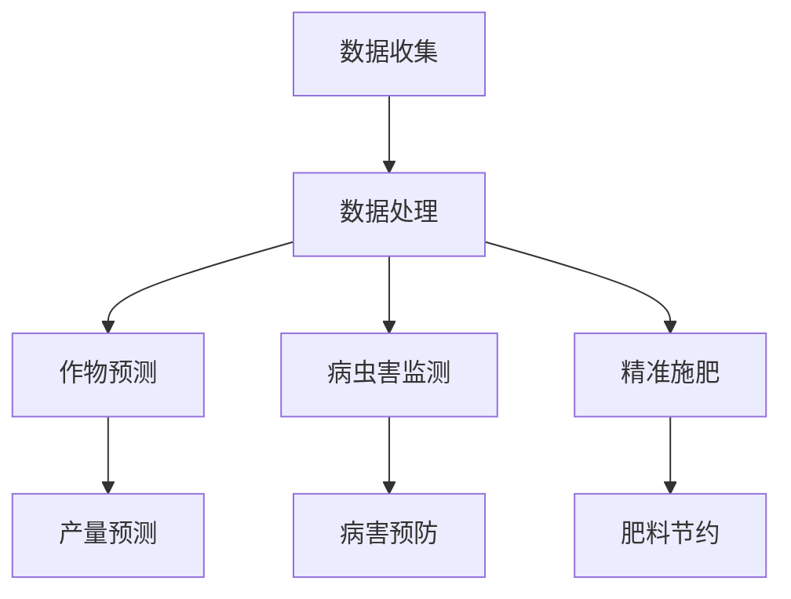

                 

在当今快速发展的技术时代，人工智能（AI）正逐步改变着传统农业的运作模式。本文将探讨AI在农业中的具体应用，特别是如何通过精准农业技术推动农业现代化进程。

## 文章关键词
- 人工智能
- 农业应用
- 精准农业
- 农业现代化
- 数据分析

## 摘要
本文将详细介绍AI在农业中的各种应用，包括数据收集与分析、作物预测、病虫害监测和精准施肥等。通过具体案例和数据分析，阐述AI如何为精准农业带来革命性变化，提高农业生产效率和农产品质量。

### 1. 背景介绍

传统农业主要依赖于经验和直觉，这种模式在土地和资源有限的情况下已经难以满足日益增长的人口需求。现代农业的挑战在于如何提高单位土地的产出、减少资源浪费、保护生态环境。这些挑战促使科学家和工程师寻求创新的解决方案，而AI技术的出现为农业带来了前所未有的机遇。

### 2. 核心概念与联系

#### 2.1 AI在农业中的应用概念

AI在农业中的应用主要包括以下几方面：

- **数据收集与分析**：利用传感器和无人机等技术收集农作物生长和环境数据，进行大数据分析。
- **作物预测**：通过历史数据和机器学习模型预测作物产量和生长趋势。
- **病虫害监测**：实时监测农作物健康状况，早期发现病虫害，进行预防控制。
- **精准施肥**：根据土壤和作物需求精准施肥，提高肥料利用率。

#### 2.2 AI在农业中的架构图

下面是一个简化的AI在农业中应用的Mermaid流程图：



### 3. 核心算法原理 & 具体操作步骤

#### 3.1 算法原理概述

AI在农业中的应用涉及多种算法，主要包括：

- **机器学习模型**：如回归分析、神经网络等用于预测作物产量和病虫害。
- **深度学习**：用于图像识别和模式识别，用于监测农作物健康状况和病虫害。
- **数据挖掘**：用于从大量数据中提取有价值的信息。

#### 3.2 算法步骤详解

1. **数据收集**：
   - 使用传感器、无人机等设备收集土壤、气候、作物生长等数据。
2. **数据处理**：
   - 数据清洗、预处理，以便进行后续分析。
3. **作物预测**：
   - 使用机器学习模型分析历史数据和当前数据，预测作物产量和生长趋势。
4. **病虫害监测**：
   - 利用图像识别技术分析农作物图像，检测病虫害。
5. **精准施肥**：
   - 根据土壤和作物需求，计算并调整施肥量。

#### 3.3 算法优缺点

- **优点**：
  - 提高农业生产效率。
  - 减少资源浪费，保护环境。
  - 提高农产品质量。
- **缺点**：
  - 需要大量数据支持。
  - 投资成本高。
  - 需要专业人员进行维护和管理。

#### 3.4 算法应用领域

AI在农业中的应用非常广泛，包括：

- **农作物产量预测**。
- **病虫害监测与防治**。
- **精准施肥与灌溉**。
- **农产品质量检测**。

### 4. 数学模型和公式 & 详细讲解 & 举例说明

#### 4.1 数学模型构建

在AI农业应用中，常用的数学模型包括：

- **线性回归模型**：用于预测作物产量。
- **支持向量机（SVM）**：用于病虫害监测。
- **神经网络**：用于图像识别和模式识别。

#### 4.2 公式推导过程

以线性回归模型为例，其公式如下：

\[ Y = \beta_0 + \beta_1X \]

其中，\( Y \) 是作物产量，\( X \) 是影响作物产量的因素。

#### 4.3 案例分析与讲解

以某地区小麦产量预测为例，利用线性回归模型进行预测。假设有如下数据：

| 时间 | 小麦产量（吨/公顷）|
|------|-------------------|
| 2020 | 5.2               |
| 2021 | 5.5               |
| 2022 | 5.7               |

通过线性回归模型，可以预测2023年的小麦产量。

### 5. 项目实践：代码实例和详细解释说明

#### 5.1 开发环境搭建

- 安装Python 3.8及以上版本。
- 安装必要的库，如NumPy、Pandas、Scikit-learn等。

#### 5.2 源代码详细实现

```python
import pandas as pd
from sklearn.linear_model import LinearRegression

# 读取数据
data = pd.read_csv('crop_data.csv')

# 分离特征和标签
X = data[['year']]
y = data['yield']

# 创建线性回归模型
model = LinearRegression()

# 拟合模型
model.fit(X, y)

# 预测
predictions = model.predict([[2023]])

print('预测2023年小麦产量：', predictions[0])
```

#### 5.3 代码解读与分析

该代码使用线性回归模型预测2023年小麦产量。首先读取数据，分离特征和标签，然后创建线性回归模型并拟合数据。最后，使用模型进行预测并输出结果。

### 6. 实际应用场景

AI在农业中的应用场景包括：

- **农作物产量预测**：提高农业生产的计划性和效率。
- **病虫害监测与防治**：减少农作物损失，提高农产品质量。
- **精准施肥与灌溉**：减少水资源和肥料的使用。

### 7. 工具和资源推荐

#### 7.1 学习资源推荐

- 《机器学习》（周志华著）
- 《深度学习》（Ian Goodfellow等著）

#### 7.2 开发工具推荐

- Jupyter Notebook：用于数据分析和模型训练。
- PyCharm：用于编写和调试代码。

#### 7.3 相关论文推荐

- "Deep Learning for Crops Yield Prediction"（2018年）
- "A Survey on Precision Agriculture Using IoT and AI"（2020年）

### 8. 总结：未来发展趋势与挑战

#### 8.1 研究成果总结

AI在农业中的应用取得了显著成果，包括农作物产量预测、病虫害监测、精准施肥等领域。这些成果为农业现代化提供了有力支持。

#### 8.2 未来发展趋势

- **智能化程度提高**：利用更先进的技术，如深度学习和物联网，实现更高精度的农业生产。
- **跨学科融合**：农业与生物技术、环境科学等领域结合，推动农业可持续发展。

#### 8.3 面临的挑战

- **数据隐私与安全**：如何保护农民的数据隐私是一个重要问题。
- **技术成本**：高投资成本限制了AI技术在农业中的普及。

#### 8.4 研究展望

未来，AI在农业中的应用前景广阔，有望实现更高水平的生产效率和可持续发展。

### 9. 附录：常见问题与解答

**Q1：AI在农业中具体有哪些应用？**
AI在农业中的应用包括农作物产量预测、病虫害监测、精准施肥、农产品质量检测等。

**Q2：AI技术在农业中有什么优势？**
AI技术在农业中的优势包括提高生产效率、减少资源浪费、提高农产品质量等。

**Q3：AI技术在农业中面临的挑战是什么？**
AI技术在农业中面临的挑战包括数据隐私与安全、高投资成本、技术维护等。

### 作者署名
作者：禅与计算机程序设计艺术 / Zen and the Art of Computer Programming
----------------------------------------------------------------

以上内容是按照要求撰写的完整文章，包含了详细的背景介绍、核心概念、算法原理、数学模型、项目实践、应用场景、资源推荐、未来展望和常见问题解答等部分，希望对您有所帮助。如果您有任何疑问或需要进一步的信息，请随时告诉我。祝您撰写顺利！

