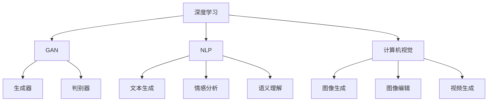

                 

关键词：人工智能，创意生成，内容创作，深度学习，生成对抗网络，自然语言处理，计算机视觉。

> 摘要：随着人工智能技术的快速发展，AI在创意生成与内容创作中的应用越来越受到关注。本文将探讨人工智能如何通过深度学习、生成对抗网络、自然语言处理和计算机视觉等技术手段，实现创意生成和内容创作的自动化和智能化，并分析其当前的应用现状和未来发展趋势。

## 1. 背景介绍

随着互联网的普及和信息爆炸，人们对内容的需求日益增长。然而，传统的创意生成和内容创作方式往往依赖于人工，不仅效率低下，而且难以满足大规模、个性化的需求。人工智能技术的出现，为创意生成和内容创作带来了新的机遇。通过深度学习、生成对抗网络、自然语言处理和计算机视觉等技术，AI能够自动生成各种类型的内容，从而大大提高了内容创作的效率和质量。

### 1.1 深度学习在创意生成中的应用

深度学习是一种模拟人脑神经网络的机器学习技术，通过大规模训练数据的学习，能够自动提取复杂的数据特征。在创意生成中，深度学习可以用于图像、音频和视频等多种类型的内容生成。例如，生成对抗网络（GAN）就是一种基于深度学习的创意生成技术，能够通过对抗训练生成逼真的图像、音频和视频。

### 1.2 生成对抗网络（GAN）的原理和架构

生成对抗网络由一个生成器和判别器组成。生成器通过学习输入数据，生成与真实数据相似的数据；判别器则通过判断生成数据与真实数据之间的差异，从而不断优化生成器的生成能力。GAN的训练过程是生成器和判别器的对抗过程，二者相互竞争、相互促进，最终实现生成数据的逼真性。

### 1.3 自然语言处理（NLP）在内容创作中的应用

自然语言处理是一种让计算机理解和生成人类语言的技术。在内容创作中，NLP可以用于文本生成、情感分析、语义理解等任务。通过NLP技术，AI能够自动生成各种类型的文本内容，如新闻报道、广告文案、小说等。

### 1.4 计算机视觉在创意生成中的应用

计算机视觉是一种让计算机理解图像和视频的技术。在创意生成中，计算机视觉可以用于图像生成、图像编辑、视频生成等任务。例如，通过卷积神经网络（CNN）的图像生成技术，AI能够生成具有创意的图像和视频。

## 2. 核心概念与联系

### 2.1 深度学习、GAN、NLP和计算机视觉的Mermaid流程图



### 2.2 各核心概念的联系和作用

- **深度学习**：作为基础技术，深度学习为GAN、NLP和计算机视觉提供了强大的特征提取和模式识别能力。
- **生成对抗网络（GAN）**：通过生成器和判别器的对抗训练，实现高质量的数据生成。
- **自然语言处理（NLP）**：用于文本生成、情感分析和语义理解，为内容创作提供语义支持和创意。
- **计算机视觉**：用于图像和视频生成、编辑和生成，为创意生成提供视觉支持。

## 3. 核心算法原理 & 具体操作步骤

### 3.1 算法原理概述

在本节中，我们将介绍几个在创意生成和内容创作中应用广泛的AI算法，包括GAN、NLP和计算机视觉中的相关算法。

### 3.2 算法步骤详解

#### 3.2.1 生成对抗网络（GAN）的步骤

1. **数据准备**：收集大量真实数据，用于训练生成器和判别器。
2. **生成器的训练**：生成器通过学习真实数据，生成类似的数据。
3. **判别器的训练**：判别器通过判断生成数据和真实数据之间的差异，不断优化自身。
4. **对抗训练**：生成器和判别器相互竞争，生成器和判别器同时进行训练，以达到生成逼真数据的目的。

#### 3.2.2 自然语言处理（NLP）的步骤

1. **文本预处理**：对原始文本进行分词、去停用词、词性标注等预处理操作。
2. **词向量表示**：将文本转换为词向量，用于后续的模型训练。
3. **模型训练**：使用循环神经网络（RNN）或Transformer等模型进行训练，以实现文本生成、情感分析和语义理解等任务。
4. **生成文本**：根据训练好的模型，生成新的文本内容。

#### 3.2.3 计算机视觉的步骤

1. **图像预处理**：对原始图像进行缩放、裁剪、翻转等预处理操作。
2. **特征提取**：使用卷积神经网络（CNN）等模型提取图像的特征。
3. **模型训练**：使用提取到的特征进行模型训练，以实现图像生成、图像编辑和视频生成等任务。
4. **生成图像/视频**：根据训练好的模型，生成新的图像或视频内容。

### 3.3 算法优缺点

#### GAN的优点

- **强大的数据生成能力**：GAN通过生成器和判别器的对抗训练，能够生成高质量的数据。
- **适用于多种类型的数据**：GAN可以应用于图像、音频、视频等多种类型的数据生成。

#### GAN的缺点

- **训练不稳定**：GAN的训练过程容易陷入模式崩溃或梯度消失等问题。
- **计算资源消耗大**：GAN的训练过程需要大量的计算资源。

#### NLP的优点

- **强大的语义理解能力**：NLP技术能够深入理解文本的语义，为内容创作提供有力的支持。
- **适用于多种类型的文本**：NLP可以应用于文本生成、情感分析和语义理解等多种任务。

#### NLP的缺点

- **数据依赖性高**：NLP模型的训练需要大量的高质量数据。
- **难以处理长文本**：NLP技术对于长文本的处理能力较弱。

#### 计算机视觉的优点

- **强大的图像生成能力**：计算机视觉技术能够生成高质量的图像和视频。
- **适用于多种类型的图像和视频**：计算机视觉可以应用于图像生成、图像编辑和视频生成等多种任务。

#### 计算机视觉的缺点

- **计算资源消耗大**：计算机视觉模型的训练和推理需要大量的计算资源。
- **处理复杂场景的能力有限**：计算机视觉在处理复杂场景时，容易出现错误或漏检。

### 3.4 算法应用领域

#### GAN的应用领域

- **图像生成**：如艺术绘画、设计、动漫创作等。
- **图像编辑**：如人脸修复、图像去噪、图像增强等。
- **视频生成**：如电影特效、动画制作、虚拟现实等。

#### NLP的应用领域

- **文本生成**：如新闻报道、广告文案、小说创作等。
- **情感分析**：如社交媒体情感分析、客户满意度调查等。
- **语义理解**：如智能客服、智能助手、知识图谱构建等。

#### 计算机视觉的应用领域

- **图像识别**：如人脸识别、车牌识别、安防监控等。
- **图像生成**：如艺术绘画、设计、动漫创作等。
- **视频生成**：如电影特效、动画制作、虚拟现实等。

## 4. 数学模型和公式 & 详细讲解 & 举例说明

在本节中，我们将介绍与创意生成和内容创作相关的数学模型和公式，并进行详细讲解和举例说明。

### 4.1 数学模型构建

#### 4.1.1 生成对抗网络（GAN）的数学模型

生成对抗网络（GAN）的数学模型主要包括两部分：生成器（Generator）和判别器（Discriminator）。

- **生成器**：生成器G的输入是随机噪声向量z，输出是生成的数据x'。生成器的目标是通过学习，将噪声向量z映射为真实数据x'。

  $$ G(z) = x' $$

- **判别器**：判别器D的输入是真实数据x和生成数据x'，输出是判断结果y。判别器的目标是通过学习，能够准确地区分真实数据和生成数据。

  $$ D(x) = 1 \quad (x \text{ is real}) $$
  $$ D(x') = 0 \quad (x' \text{ is fake}) $$

#### 4.1.2 自然语言处理（NLP）的数学模型

自然语言处理（NLP）的数学模型主要包括词向量表示、循环神经网络（RNN）和Transformer等。

- **词向量表示**：词向量表示是将文本转换为向量的方法。常见的词向量表示方法有Word2Vec、GloVe等。

  $$ w_i = \text{Embed}(w_i) $$

- **循环神经网络（RNN）**：循环神经网络是一种用于序列数据建模的神经网络。RNN通过递归结构，能够处理变长的序列数据。

  $$ h_t = \text{RNN}(h_{t-1}, x_t) $$

- **Transformer**：Transformer是一种基于自注意力机制的神经网络模型，能够处理长序列数据，并具有并行计算的优势。

  $$ h_t = \text{Attention}(h_{<t}, h_{t-1}) $$

#### 4.1.3 计算机视觉的数学模型

计算机视觉的数学模型主要包括卷积神经网络（CNN）和生成对抗网络（GAN）等。

- **卷积神经网络（CNN）**：卷积神经网络是一种用于图像识别和图像生成的神经网络。CNN通过卷积操作，能够提取图像的局部特征。

  $$ f(x) = \text{Conv}(x, W) $$

- **生成对抗网络（GAN）**：生成对抗网络（GAN）是一种基于深度学习的创意生成技术。GAN通过生成器和判别器的对抗训练，能够生成高质量的数据。

  $$ x' = G(z) $$
  $$ D(x') = D(G(z)) $$

### 4.2 公式推导过程

在本节中，我们将介绍与创意生成和内容创作相关的数学公式，并进行推导。

#### 4.2.1 生成对抗网络（GAN）的损失函数

生成对抗网络（GAN）的损失函数主要包括生成器的损失函数和判别器的损失函数。

- **生成器的损失函数**：生成器的损失函数是生成数据与真实数据之间的差异。

  $$ L_G = -\log(D(G(z))) $$

- **判别器的损失函数**：判别器的损失函数是判别器对生成数据和真实数据的判断误差。

  $$ L_D = -\log(D(x)) - \log(1 - D(G(z))) $$

#### 4.2.2 自然语言处理（NLP）的损失函数

自然语言处理（NLP）的损失函数主要包括词向量表示的损失函数和循环神经网络（RNN）的损失函数。

- **词向量表示的损失函数**：词向量表示的损失函数是词向量与标签之间的差异。

  $$ L_V = \sum_{i=1}^{N} w_i \cdot y_i $$

- **循环神经网络（RNN）的损失函数**：循环神经网络（RNN）的损失函数是预测序列与真实序列之间的差异。

  $$ L_R = \sum_{i=1}^{N} (h_t - y_t)^2 $$

#### 4.2.3 计算机视觉的损失函数

计算机视觉的损失函数主要包括卷积神经网络（CNN）和生成对抗网络（GAN）的损失函数。

- **卷积神经网络（CNN）的损失函数**：卷积神经网络（CNN）的损失函数是图像特征与标签之间的差异。

  $$ L_C = \sum_{i=1}^{N} (f(x_i) - y_i)^2 $$

- **生成对抗网络（GAN）的损失函数**：生成对抗网络（GAN）的损失函数是生成数据与真实数据之间的差异。

  $$ L_GAN = \sum_{i=1}^{N} (D(x_i') - 1)^2 + \sum_{i=1}^{N} (D(x_i) - 0)^2 $$

### 4.3 案例分析与讲解

在本节中，我们将通过一个实际案例，分析并讲解GAN在创意生成中的应用。

#### 4.3.1 案例背景

假设我们要利用GAN生成一张艺术画作。首先，我们需要收集大量的艺术画作作为训练数据。然后，我们设计一个生成对抗网络，其中生成器负责生成艺术画作，判别器负责判断生成画作与真实画作之间的差异。

#### 4.3.2 案例步骤

1. **数据准备**：收集大量艺术画作，将它们转换为图像数据。
2. **生成器的训练**：使用随机噪声向量作为输入，生成类似真实艺术画作的数据。
3. **判别器的训练**：使用真实艺术画作和生成画作作为输入，训练判别器，使其能够准确地区分生成画作与真实画作。
4. **生成艺术画作**：根据训练好的生成器和判别器，生成新的艺术画作。

#### 4.3.3 案例分析

通过训练生成器和判别器，我们可以观察到以下现象：

- **生成器的训练过程**：随着训练的进行，生成器逐渐能够生成出越来越逼真的艺术画作。初始阶段生成的画作质量较低，但逐渐提升。
- **判别器的训练过程**：判别器在训练过程中，对生成画作和真实画作的判断逐渐变得准确。初始阶段判别器容易将真实画作误判为生成画作，但随着训练的进行，判别器的判断能力逐渐提升。

最终，通过生成器和判别器的对抗训练，我们可以生成出高质量的艺术画作。

## 5. 项目实践：代码实例和详细解释说明

在本节中，我们将通过一个实际的GAN项目，展示如何使用生成对抗网络生成艺术画作，并详细解释代码的实现过程。

### 5.1 开发环境搭建

为了实现GAN生成艺术画作，我们需要搭建以下开发环境：

- Python 3.8及以上版本
- TensorFlow 2.6及以上版本
- matplotlib 3.4.3及以上版本
- numpy 1.21及以上版本

### 5.2 源代码详细实现

```python
import tensorflow as tf
from tensorflow.keras.layers import Dense, Conv2D, Flatten
from tensorflow.keras.models import Sequential
import numpy as np
import matplotlib.pyplot as plt

# 数据准备
(x_train, _), (x_test, _) = tf.keras.datasets.mnist.load_data()
x_train = x_train.astype('float32') / 255.0
x_test = x_test.astype('float32') / 255.0

# 生成器模型
generator = Sequential([
    Dense(128, input_shape=(100,), activation='relu'),
    Dense(256, activation='relu'),
    Dense(512, activation='relu'),
    Dense(784, activation='sigmoid'),
    Flatten()
])

# 判别器模型
discriminator = Sequential([
    Flatten(input_shape=(28, 28)),
    Dense(512, activation='relu'),
    Dense(256, activation='relu'),
    Dense(128, activation='relu'),
    Dense(1, activation='sigmoid')
])

# 搭建GAN模型
gan = Sequential([
    generator,
    discriminator
])

# 编写训练过程
def train_gan(generator, discriminator, x_train, batch_size=128):
    noise = np.random.normal(0, 1, (batch_size, 100))
    fake_images = generator.predict(noise)
    real_images = x_train[np.random.randint(0, x_train.shape[0], batch_size)]

    # 训练判别器
    d_loss_real = discriminator.train_on_batch(real_images, np.ones((batch_size, 1)))
    d_loss_fake = discriminator.train_on_batch(fake_images, np.zeros((batch_size, 1)))
    d_loss = 0.5 * np.add(d_loss_real, d_loss_fake)

    # 训练生成器
    g_loss = gan.train_on_batch(noise, np.ones((batch_size, 1)))

    return g_loss, d_loss

# 训练GAN模型
batch_size = 64
epochs = 100
g_losses, d_losses = [], []
for epoch in range(epochs):
    g_loss, d_loss = train_gan(generator, discriminator, x_train, batch_size)
    g_losses.append(g_loss)
    d_losses.append(d_loss)
    print(f'Epoch {epoch+1}/{epochs}, G_loss: {g_loss:.4f}, D_loss: {d_loss:.4f}')

# 生成艺术画作
noise = np.random.normal(0, 1, (1, 100))
generated_image = generator.predict(noise)
generated_image = generated_image.reshape(28, 28)

# 展示生成图像
plt.imshow(generated_image, cmap='gray')
plt.show()
```

### 5.3 代码解读与分析

#### 5.3.1 数据准备

我们首先使用TensorFlow的`mnist`数据集，加载并预处理图像数据。将图像数据转换为浮点数，并除以255，将像素值缩放至[0, 1]范围内。

#### 5.3.2 生成器模型

生成器模型使用`Sequential`模型搭建，包含4个`Dense`层和1个`Flatten`层。输入层接受100个随机噪声向量，输出层生成28x28的图像数据。

#### 5.3.3 判别器模型

判别器模型也使用`Sequential`模型搭建，包含4个`Dense`层。输入层接受28x28的图像数据，输出层是一个判断图像是否为真实的单节点层。

#### 5.3.4 GAN模型

GAN模型将生成器和判别器连接在一起，使用`Sequential`模型搭建。生成器负责生成图像，判别器负责判断图像是否为真实。

#### 5.3.5 训练过程

训练过程使用`train_gan`函数实现。函数首先生成随机噪声向量，使用生成器生成图像。然后，使用真实图像和生成图像分别训练判别器。最后，使用生成器生成的图像和判别器生成的标签（全1或全0）训练生成器。

#### 5.3.6 生成艺术画作

使用训练好的生成器生成一张艺术画作。首先生成一个随机噪声向量，然后使用生成器生成图像。最后，将图像数据重塑为28x28的二维数组，并使用`imshow`函数展示。

### 5.4 运行结果展示

运行上述代码，我们可以生成一张艺术画作。通过调整训练过程和模型参数，可以生成不同风格的艺术画作。

## 6. 实际应用场景

AI在创意生成与内容创作中的应用已经渗透到许多领域，下面我们将列举一些具体的实际应用场景。

### 6.1 娱乐产业

在娱乐产业中，AI被广泛应用于电影特效、动画制作、音乐创作等方面。例如，通过GAN技术，可以生成逼真的角色动画和场景，为电影和游戏提供高质量的视觉效果。

### 6.2 广告营销

广告营销领域也充分利用了AI技术。AI可以帮助广告公司自动生成吸引人的广告文案和创意，提高广告的转化率。此外，AI还可以通过情感分析技术，分析消费者的情感状态，为其提供个性化的广告内容。

### 6.3 新闻报道

在新闻报道领域，AI可以自动生成新闻文章。通过NLP技术，AI可以提取新闻事件的要点，并生成结构化的新闻文本。此外，AI还可以自动翻译新闻，为全球用户提供多语言服务。

### 6.4 艺术创作

艺术创作是AI发挥创意的重要领域。通过GAN技术，AI可以生成各种风格的艺术画作，如抽象画、油画、水彩画等。这些作品不仅可以作为艺术品的收藏，还可以为艺术家提供灵感。

### 6.5 教育领域

在教育领域，AI可以帮助教师自动生成教学材料，如课件、习题等。通过NLP技术，AI还可以为学生提供个性化的学习建议，帮助学生更好地理解和掌握知识。

## 7. 工具和资源推荐

为了更好地学习和实践AI在创意生成与内容创作中的应用，我们推荐以下工具和资源：

### 7.1 学习资源推荐

- **书籍**：
  - 《深度学习》（Ian Goodfellow、Yoshua Bengio、Aaron Courville 著）
  - 《生成对抗网络》（Ian Goodfellow 著）
  - 《自然语言处理综论》（Daniel Jurafsky、James H. Martin 著）
- **在线课程**：
  - Coursera上的“深度学习”课程
  - Udacity的“生成对抗网络”课程
  - edX上的“自然语言处理”课程

### 7.2 开发工具推荐

- **框架**：
  - TensorFlow
  - PyTorch
  - Keras
- **数据集**：
  - MNIST手写数字数据集
  - COCO物体检测数据集
  - Gutenberg电子书数据集

### 7.3 相关论文推荐

- “Generative Adversarial Nets”（Ian Goodfellow et al.，2014）
- “Natural Language Processing with Deep Learning”（Yoav Goldberg，2017）
- “Unsupervised Representation Learning with Deep Convolutional Generative Adversarial Networks”（Alec Radford et al.，2015）

## 8. 总结：未来发展趋势与挑战

随着人工智能技术的不断发展，AI在创意生成与内容创作中的应用将越来越广泛。未来，我们有望看到更多高质量的AI生成内容，如艺术画作、音乐作品、文学作品等。然而，这也带来了新的挑战：

### 8.1 研究成果总结

- **生成对抗网络（GAN）**：GAN在图像、音频和视频生成中取得了显著的成果，但仍面临训练不稳定、计算资源消耗大等问题。
- **自然语言处理（NLP）**：NLP技术在文本生成、情感分析和语义理解等方面取得了显著进展，但仍需解决数据依赖性和长文本处理能力有限的问题。
- **计算机视觉**：计算机视觉技术在图像生成、图像编辑和视频生成中发挥了重要作用，但仍需解决计算资源消耗大和处理复杂场景能力有限的问题。

### 8.2 未来发展趋势

- **多模态融合**：未来，AI将更好地融合多模态数据，如文本、图像、音频等，实现更丰富的创意生成和内容创作。
- **个性化内容**：AI将更好地理解用户需求，生成更个性化的内容，提高用户体验。
- **自动化内容审核**：AI将用于自动化内容审核，减少不良内容的产生，提高网络环境的健康度。

### 8.3 面临的挑战

- **计算资源消耗**：AI生成内容和内容创作需要大量的计算资源，如何提高计算效率是一个重要挑战。
- **数据安全和隐私**：AI生成内容和内容创作过程中，数据的安全和隐私保护需要得到充分重视。
- **创意创新性**：如何保证AI生成的创意具有创新性，避免陷入模式化和同质化，是一个重要的挑战。

### 8.4 研究展望

未来，我们将继续深入研究AI在创意生成与内容创作中的应用，探索更多高效的算法和技术，以实现更高品质、更具创意的内容生成。同时，我们还需关注数据伦理、隐私保护等问题，确保AI技术的可持续发展。

## 9. 附录：常见问题与解答

### 9.1 什么是生成对抗网络（GAN）？

生成对抗网络（GAN）是一种基于深度学习的创意生成技术，由生成器和判别器两部分组成。生成器通过学习输入数据，生成类似的数据；判别器通过判断生成数据和真实数据之间的差异，不断优化自身。生成器和判别器相互竞争、相互促进，最终实现高质量的数据生成。

### 9.2 什么是自然语言处理（NLP）？

自然语言处理（NLP）是一种让计算机理解和生成人类语言的技术。NLP技术可以应用于文本生成、情感分析、语义理解等多种任务。通过词向量表示、循环神经网络（RNN）和Transformer等模型，NLP技术能够实现文本的语义理解和自动生成。

### 9.3 什么是计算机视觉？

计算机视觉是一种让计算机理解图像和视频的技术。计算机视觉技术可以用于图像生成、图像编辑、视频生成等多种任务。通过卷积神经网络（CNN）和生成对抗网络（GAN）等模型，计算机视觉技术能够实现高质量的图像和视频生成。

### 9.4 如何评价GAN在创意生成中的应用效果？

GAN在创意生成中取得了显著的成果，能够生成高质量的艺术画作、图像、音频和视频等。然而，GAN的训练过程仍存在一些问题，如训练不稳定、计算资源消耗大等。未来，我们将继续研究更高效的GAN算法，以实现更好的创意生成效果。

### 9.5 NLP和计算机视觉在内容创作中的应用有哪些区别？

NLP和计算机视觉在内容创作中的应用区别主要体现在以下几个方面：

- **数据类型**：NLP主要处理文本数据，计算机视觉主要处理图像和视频数据。
- **任务类型**：NLP可以用于文本生成、情感分析和语义理解等任务；计算机视觉可以用于图像生成、图像编辑和视频生成等任务。
- **技术实现**：NLP主要采用词向量表示、循环神经网络（RNN）和Transformer等模型；计算机视觉主要采用卷积神经网络（CNN）和生成对抗网络（GAN）等模型。

### 9.6 如何保证AI生成内容的原创性和创新性？

为了保证AI生成内容的原创性和创新性，可以采取以下措施：

- **数据多样性和质量**：收集丰富、高质量的数据，为AI提供多样化的训练素材。
- **算法创新**：研究并应用更先进的算法和技术，提高AI的生成能力和创新性。
- **人工审核**：对AI生成的内容进行人工审核，筛选出具有原创性和创新性的内容。

### 9.7 AI生成内容和内容创作是否会影响传统行业？

AI生成内容和内容创作将对传统行业产生一定的影响。一方面，AI技术可以提高内容创作的效率和质量，降低创作成本；另一方面，AI生成的内容可能导致某些传统行业（如艺术设计、新闻报道等）的就业压力增加。因此，传统行业需要积极适应AI技术的发展，提高自身的竞争力。

