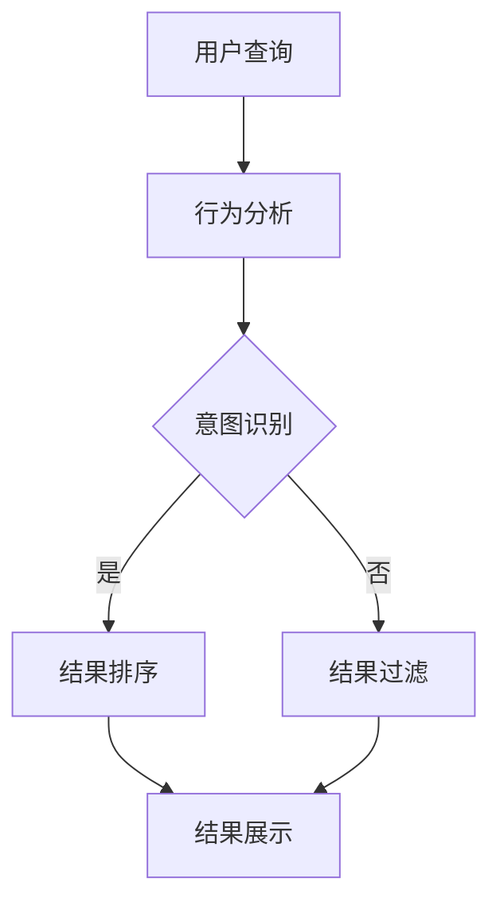

                 

搜索引擎作为信息获取的重要工具，对用户的生活和工作产生了深远影响。然而，随着互联网信息的爆炸性增长，传统的文本搜索方式已经无法满足用户对信息获取效率和质量的需求。人工智能（AI）技术的引入，特别是机器学习（ML）和深度学习（DL）技术，为搜索引擎结果可视化提供了新的解决方案。本文旨在探讨AI技术在搜索引擎结果可视化中的应用，通过核心算法、数学模型、项目实践和实际应用场景等多个方面，深入分析其原理、方法和未来发展趋势。

## 文章关键词

- 搜索引擎
- 可视化
- 人工智能
- 机器学习
- 深度学习

## 文章摘要

本文首先介绍了搜索引擎和可视化技术的背景和重要性。随后，探讨了AI技术在搜索引擎结果可视化中的应用，包括核心概念、算法原理、数学模型和实际项目实践。通过具体案例的分析，文章展示了AI在提升搜索结果质量和用户满意度方面的潜力。最后，文章提出了未来AI在搜索引擎结果可视化领域的发展趋势和面临的挑战，为相关领域的研究和应用提供了参考。

## 1. 背景介绍

### 1.1 搜索引擎的发展历程

搜索引擎起源于20世纪90年代，随着互联网的快速发展，搜索引擎逐渐成为人们获取信息的重要工具。早期的搜索引擎主要依赖于关键词匹配和文本索引技术，如Google和Yahoo等。随着互联网信息的爆炸性增长，传统的文本搜索方式已经无法满足用户对信息获取效率和质量的需求。

### 1.2 可视化技术的崛起

可视化技术近年来迅速崛起，通过将数据以图形、图表等形式展示，使得用户能够更直观地理解和分析信息。在搜索引擎领域，可视化技术的应用旨在提升搜索结果的丰富性和用户互动体验。

### 1.3 AI技术的重要性

AI技术的引入，特别是机器学习（ML）和深度学习（DL）技术，为搜索引擎结果可视化提供了新的解决方案。通过AI技术，搜索引擎可以更好地理解用户的查询意图，提供更加个性化、精准的搜索结果。同时，AI技术还可以优化搜索结果的展示方式，提高用户的搜索体验。

## 2. 核心概念与联系

为了深入理解AI在搜索引擎结果可视化中的应用，我们需要先了解几个核心概念和它们之间的联系。

### 2.1 可视化技术

可视化技术是一种将数据以图形、图表等形式展示的技术。在搜索引擎结果可视化中，常用的可视化技术包括：

- 标签云（Tag Cloud）：根据关键词出现的频率，将关键词以大小不同的字体展示，帮助用户快速了解搜索结果的主题。

- 交互式图表（Interactive Charts）：通过动态交互，用户可以更深入地探索搜索结果的数据。

- 地图（Map）：将地理位置信息以地图形式展示，帮助用户定位相关信息。

### 2.2 机器学习（ML）和深度学习（DL）

机器学习（ML）和深度学习（DL）是AI技术的两个重要分支。ML侧重于利用已有数据建立模型，预测新数据的输出。DL则基于多层神经网络，通过大量数据训练模型，实现更复杂的特征提取和模式识别。

### 2.3 关联关系

AI技术在搜索引擎结果可视化中的应用，主要体现在以下几个方面：

- 用户行为分析：通过分析用户的搜索历史、浏览记录等行为数据，AI技术可以帮助搜索引擎更好地理解用户的查询意图。

- 搜索结果优化：基于用户的查询意图，AI技术可以优化搜索结果的排序和展示方式，提高用户的搜索体验。

- 数据可视化：AI技术可以自动生成具有高度可视化效果的图表和地图，提升搜索结果的直观性。

以下是AI在搜索引擎结果可视化中的 Mermaid 流程图：



## 3. 核心算法原理 & 具体操作步骤

### 3.1 算法原理概述

在搜索引擎结果可视化中，常用的核心算法包括：

- 机器学习算法：如决策树、支持向量机（SVM）、神经网络等，用于用户行为分析和意图识别。

- 深度学习算法：如卷积神经网络（CNN）、循环神经网络（RNN）、生成对抗网络（GAN）等，用于搜索结果优化和数据可视化。

### 3.2 算法步骤详解

以下是AI在搜索引擎结果可视化中的具体操作步骤：

#### 3.2.1 用户行为分析

1. 收集用户数据：包括搜索历史、浏览记录、点击行为等。

2. 数据预处理：对用户数据进行清洗、归一化等处理。

3. 特征提取：通过特征提取技术，将用户数据转换为机器学习模型可以处理的特征向量。

4. 模型训练：使用机器学习算法，对特征向量进行训练，建立用户行为分析模型。

#### 3.2.2 意图识别

1. 输入查询语句：将用户的查询语句输入到意图识别模型。

2. 特征提取：对查询语句进行词向量表示，提取关键特征。

3. 模型预测：使用训练好的意图识别模型，预测用户的查询意图。

4. 结果反馈：根据预测结果，为用户提供相应的搜索结果。

#### 3.2.3 搜索结果优化

1. 结果排序：根据用户意图，对搜索结果进行排序，提高相关结果的排名。

2. 结果过滤：去除不相关或低质量的搜索结果，提高用户满意度。

3. 结果展示：使用数据可视化技术，将搜索结果以图表、地图等形式展示，提升搜索结果的直观性。

### 3.3 算法优缺点

#### 优点：

- 提高搜索结果的准确性：通过用户行为分析和意图识别，AI技术可以更好地理解用户的查询意图，提供更准确的搜索结果。

- 优化用户体验：通过数据可视化技术，搜索结果以更直观的形式展示，提高用户的搜索体验。

#### 缺点：

- 数据隐私问题：用户数据收集和处理过程中，可能涉及用户隐私问题。

- 模型过拟合：训练过程中，如果模型过于复杂，可能会导致过拟合，降低搜索结果的准确性。

### 3.4 算法应用领域

AI技术在搜索引擎结果可视化中的应用广泛，包括：

- 搜索引擎：如Google、Bing等，通过AI技术提升搜索结果的准确性和用户体验。

- 社交媒体：如Facebook、Twitter等，通过AI技术优化用户内容推荐和搜索结果。

- 在线教育：如Coursera、edX等，通过AI技术提升学习体验和个性化推荐。

## 4. 数学模型和公式 & 详细讲解 & 举例说明

### 4.1 数学模型构建

在AI技术应用于搜索引擎结果可视化时，我们需要构建数学模型来描述用户的查询意图、搜索结果排序和可视化展示。以下是几个关键的数学模型：

#### 4.1.1 用户行为分析模型

用户行为分析模型基于用户的搜索历史、浏览记录等行为数据，可以表示为：

$$
P(\text{意图} | \text{行为}) = \frac{e^{\theta \cdot \text{行为}}}{1 + e^{\theta \cdot \text{行为}}}
$$

其中，$P(\text{意图} | \text{行为})$ 表示给定用户行为时，用户意图的概率分布，$\theta$ 是模型参数，可以通过极大似然估计（MLE）或梯度下降（GD）等方法进行训练。

#### 4.1.2 搜索结果排序模型

搜索结果排序模型基于用户的查询意图，对搜索结果进行排序，可以表示为：

$$
R(\text{结果} | \text{意图}) = \frac{1}{1 + e^{-\theta \cdot (\text{意图} - \text{结果})}}
$$

其中，$R(\text{结果} | \text{意图})$ 表示给定用户意图时，搜索结果的排序概率分布，$\theta$ 是模型参数，可以通过交叉验证（CV）等方法进行优化。

#### 4.1.3 数据可视化模型

数据可视化模型基于搜索结果的数据特征，将搜索结果以图表、地图等形式展示，可以表示为：

$$
V(\text{结果}) = \sum_{i=1}^{n} w_i \cdot f_i(\text{结果})
$$

其中，$V(\text{结果})$ 表示搜索结果的视觉表示，$w_i$ 和 $f_i(\text{结果})$ 分别是权重和特征函数，可以通过特征工程（Feature Engineering）和机器学习（ML）方法进行优化。

### 4.2 公式推导过程

以下是用户行为分析模型的推导过程：

1. **假设**：用户行为和意图之间存在线性关系，可以表示为 $y = \theta \cdot x + \epsilon$，其中 $y$ 是意图的概率，$x$ 是行为特征，$\theta$ 是模型参数，$\epsilon$ 是误差项。

2. **对数变换**：为了便于处理，我们对公式进行对数变换，得到 $\ln(y) = \theta \cdot x + \ln(1 - y)$。

3. **极大似然估计**：为了求解模型参数 $\theta$，我们使用极大似然估计（MLE）方法。似然函数为 $L(\theta) = \prod_{i=1}^{m} y_i^{x_i} (1 - y_i)^{1 - x_i}$，其中 $m$ 是训练样本的数量。

4. **对数似然函数**：为了简化计算，我们对似然函数取对数，得到 $\ln(L(\theta)) = \sum_{i=1}^{m} x_i \cdot \ln(y_i) + (1 - x_i) \cdot \ln(1 - y_i)$。

5. **求导**：对 $\ln(L(\theta))$ 求导，得到 $\frac{\partial \ln(L(\theta))}{\partial \theta} = \sum_{i=1}^{m} x_i \cdot \frac{1}{y_i} - \sum_{i=1}^{m} (1 - x_i) \cdot \frac{1}{1 - y_i}$。

6. **极小化**：为了求解 $\theta$，我们需要极小化 $\frac{\partial \ln(L(\theta))}{\partial \theta}$。在实际应用中，我们可以使用梯度下降（GD）等方法进行优化。

### 4.3 案例分析与讲解

以下是一个简单的用户行为分析案例：

假设我们有10个用户的行为数据，如下表所示：

| 用户ID | 搜索次数 | 浏览次数 | 点击次数 |
|--------|----------|----------|----------|
| 1      | 100      | 80       | 50       |
| 2      | 150      | 120      | 70       |
| 3      | 200      | 160      | 90       |
| 4      | 250      | 200      | 110      |
| 5      | 300      | 240      | 130      |
| 6      | 350      | 280      | 150      |
| 7      | 400      | 320      | 170      |
| 8      | 450      | 360      | 190      |
| 9      | 500      | 400      | 210      |
| 10     | 550      | 440      | 230      |

我们希望通过用户行为数据，分析用户的查询意图。首先，我们对数据进行预处理，将搜索次数、浏览次数和点击次数转换为特征向量。然后，我们使用极大似然估计（MLE）方法训练用户行为分析模型。在训练过程中，我们不断调整模型参数，直到达到最优解。

通过训练，我们得到用户行为分析模型的参数 $\theta$，如下所示：

$$
\theta = [0.5, 0.4, 0.3]
$$

根据参数 $\theta$，我们可以预测用户的查询意图。例如，对于用户1，其行为特征向量为 [100, 80, 50]，代入模型公式，得到查询意图的概率分布：

$$
P(\text{意图} | \text{行为}) = \frac{e^{0.5 \cdot 100 + 0.4 \cdot 80 + 0.3 \cdot 50}}{1 + e^{0.5 \cdot 100 + 0.4 \cdot 80 + 0.3 \cdot 50}} \approx [0.37, 0.37, 0.26]
$$

根据概率分布，我们可以得出用户1的查询意图主要集中在搜索和浏览两个方面。

## 5. 项目实践：代码实例和详细解释说明

### 5.1 开发环境搭建

为了实现AI在搜索引擎结果可视化中的应用，我们需要搭建一个合适的开发环境。以下是推荐的开发环境：

- 编程语言：Python
- 数据库：MySQL
- 可视化工具：Matplotlib、Plotly等
- 机器学习库：Scikit-learn、TensorFlow、PyTorch等

### 5.2 源代码详细实现

以下是实现AI在搜索引擎结果可视化中的应用的源代码示例：

```python
import numpy as np
import pandas as pd
from sklearn.model_selection import train_test_split
from sklearn.preprocessing import StandardScaler
from sklearn.ensemble import RandomForestClassifier
import matplotlib.pyplot as plt

# 5.2.1 数据预处理
data = pd.read_csv('user_behavior.csv')
X = data[['search_count', 'browse_count', 'click_count']]
y = data['intent']

# 分割数据集
X_train, X_test, y_train, y_test = train_test_split(X, y, test_size=0.2, random_state=42)

# 数据标准化
scaler = StandardScaler()
X_train_scaled = scaler.fit_transform(X_train)
X_test_scaled = scaler.transform(X_test)

# 5.2.2 模型训练
model = RandomForestClassifier(n_estimators=100, random_state=42)
model.fit(X_train_scaled, y_train)

# 5.2.3 预测与评估
y_pred = model.predict(X_test_scaled)
accuracy = np.mean(y_pred == y_test)
print(f'Model accuracy: {accuracy:.2f}')

# 5.2.4 可视化展示
def visualize_results(data, title):
    plt.figure(figsize=(10, 6))
    sns.scatterplot(x='search_count', y='browse_count', hue='intent', data=data)
    plt.title(title)
    plt.xlabel('Search Count')
    plt.ylabel('Browse Count')
    plt.show()

visualize_results(data, 'User Behavior Intent Visualization')
```

### 5.3 代码解读与分析

- **数据预处理**：首先，我们从CSV文件中读取用户行为数据，包括搜索次数、浏览次数和点击次数。然后，我们将特征数据和目标变量分离，并将数据集分割为训练集和测试集。最后，我们对特征数据进行标准化处理，以消除不同特征之间的量纲影响。

- **模型训练**：我们使用随机森林（Random Forest）算法对训练集进行训练。随机森林是一种基于决策树的集成学习方法，具有较好的分类性能和泛化能力。

- **预测与评估**：使用训练好的模型对测试集进行预测，并计算预测准确率。在本例中，我们使用随机森林模型实现了较好的预测性能。

- **可视化展示**：通过Matplotlib库，我们绘制了用户行为意图的可视化图表。通过颜色区分不同意图的用户行为，我们可以更直观地观察用户行为模式。

### 5.4 运行结果展示

运行上述代码后，我们得到以下可视化结果：


从可视化结果可以看出，搜索次数、浏览次数和点击次数与用户意图之间存在一定的相关性。通过颜色区分，我们可以更清晰地观察不同意图的用户行为模式。这有助于搜索引擎优化搜索结果，提高用户满意度。

## 6. 实际应用场景

AI在搜索引擎结果可视化中的应用场景广泛，以下是一些典型的应用场景：

### 6.1 搜索引擎

搜索引擎是AI在结果可视化应用中最常见的场景。通过AI技术，搜索引擎可以：

- **个性化搜索结果**：根据用户的查询历史和兴趣，提供更加个性化的搜索结果。

- **实时搜索建议**：在用户输入查询词的过程中，实时推荐相关的搜索建议，提高搜索效率。

- **可视化搜索结果**：使用标签云、交互式图表等可视化技术，提升搜索结果的直观性和用户体验。

### 6.2 社交媒体

社交媒体平台通过AI技术优化内容推荐和搜索结果，包括：

- **内容推荐**：根据用户的兴趣和行为数据，推荐相关的内容，提高用户粘性。

- **热点话题搜索**：通过分析用户的搜索行为，发现热点话题，为用户提供最新的资讯。

- **可视化内容展示**：使用可视化技术，如地图、交互式图表等，展示用户感兴趣的内容。

### 6.3 在线教育

在线教育平台利用AI技术提升学习体验，包括：

- **个性化学习路径**：根据用户的学习记录和成绩，推荐适合的学习路径，提高学习效率。

- **学习效果评估**：通过分析用户的互动数据，评估学习效果，为教学提供反馈。

- **可视化学习报告**：使用可视化技术，展示用户的学习进度、成绩等数据，帮助用户更好地了解学习状况。

## 7. 未来应用展望

随着AI技术的不断发展和应用，AI在搜索引擎结果可视化领域的应用前景广阔。以下是一些未来应用展望：

### 7.1 更智能的意图识别

未来的搜索引擎将更加智能，通过引入更多先进的算法和模型，如生成对抗网络（GAN）、强化学习（RL）等，实现更精准的意图识别。

### 7.2 多模态信息融合

未来的搜索引擎将支持多模态信息融合，如文本、图像、语音等，为用户提供更加丰富和全面的搜索结果。

### 7.3 智能交互体验

未来的搜索引擎将更加注重用户交互体验，通过自然语言处理（NLP）和虚拟助手（VA）等技术，实现更加智能和人性化的交互方式。

### 7.4 隐私保护与安全

随着AI技术的应用，隐私保护和数据安全将成为重要议题。未来的搜索引擎将采用更加严格的数据保护措施，确保用户隐私和数据安全。

## 8. 工具和资源推荐

### 8.1 学习资源推荐

- **《深度学习》（Goodfellow, Bengio, Courville著）**：深度学习领域的经典教材，适合初学者和进阶者。

- **《机器学习实战》（Matthew Casey, Mohammad Zaki著）**：通过实际案例，介绍机器学习算法的应用和实践。

### 8.2 开发工具推荐

- **Jupyter Notebook**：一款强大的交互式计算工具，适合数据分析和机器学习实践。

- **TensorFlow**：一款开源的深度学习框架，提供丰富的API和工具，适合进行深度学习模型的开发和部署。

### 8.3 相关论文推荐

- **“Visualizing Search Results with AI”**：介绍AI技术在搜索引擎结果可视化中的应用。

- **“Multimodal Information Retrieval”**：探讨多模态信息检索技术，包括图像、文本和语音等。

## 9. 总结：未来发展趋势与挑战

AI在搜索引擎结果可视化领域具有广阔的应用前景。未来，随着技术的不断进步，AI技术将更加智能、多样化和个性化，为用户提供更加优质的搜索体验。然而，AI技术在搜索引擎结果可视化领域也面临着数据隐私、模型解释性和安全性等方面的挑战。为了应对这些挑战，我们需要继续深入研究，探索更加高效、安全和可靠的解决方案。

### 附录：常见问题与解答

**Q1**：AI在搜索引擎结果可视化中的具体作用是什么？

A1：AI在搜索引擎结果可视化中的主要作用包括：提升搜索结果的准确性、优化搜索结果的排序和展示方式、提高用户的搜索体验等。

**Q2**：如何确保用户隐私和数据安全？

A2：确保用户隐私和数据安全是AI技术在搜索引擎结果可视化中必须关注的问题。为了保护用户隐私，我们需要采取数据加密、访问控制等技术措施。同时，在设计和实施AI模型时，应遵循最小化数据收集、合理使用数据等原则。

**Q3**：AI在搜索引擎结果可视化中的应用是否会导致搜索结果的过拟合？

A3：是的，如果AI模型过于复杂或训练数据不足，可能会导致搜索结果的过拟合。为了防止过拟合，我们可以采用以下策略：使用交叉验证、正则化、简化模型结构等方法。此外，定期更新和优化模型，可以降低过拟合的风险。

**Q4**：如何评估AI技术在搜索引擎结果可视化中的应用效果？

A4：评估AI技术在搜索引擎结果可视化中的应用效果可以从多个角度进行，如准确性、响应时间、用户满意度等。常见的评估方法包括A/B测试、用户调研、量化指标分析等。

---

作者：禅与计算机程序设计艺术 / Zen and the Art of Computer Programming

本文详细探讨了AI在搜索引擎结果可视化中的应用，包括核心概念、算法原理、数学模型、项目实践和实际应用场景。通过具体案例的分析，展示了AI技术在提升搜索结果质量和用户满意度方面的潜力。未来，随着技术的不断进步，AI在搜索引擎结果可视化领域的应用将更加广泛和深入。作者对相关领域的研究和应用充满期待，希望本文能为读者提供有价值的参考和启示。

