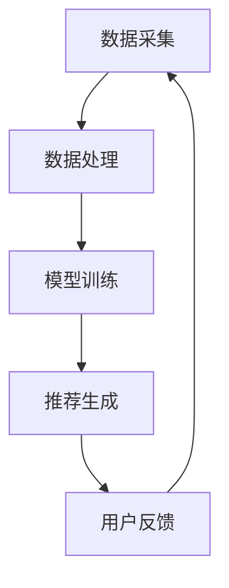

                 

关键词：人工智能，旅游，个性化推荐，算法，数学模型，应用实例，开发工具

> 摘要：本文将探讨人工智能在旅游业中的应用，重点关注个性化推荐系统。通过分析核心概念、算法原理、数学模型以及实际应用案例，本文旨在为读者提供对AI在旅游业中发挥作用的深入理解，并展望其未来的发展趋势和挑战。

## 1. 背景介绍

近年来，人工智能（AI）技术的飞速发展正在深刻改变各行各业，旅游业也不例外。随着人们生活水平的提高和旅游需求的多样化，个性化旅游体验成为游客追求的热点。AI的应用能够帮助旅游行业更好地理解游客需求，提供精准的推荐服务，从而提升用户体验和行业竞争力。

个性化推荐系统作为AI技术的重要组成部分，在旅游业中的应用日益广泛。通过分析用户的历史数据和行为模式，推荐系统可以智能地推送符合用户兴趣的旅游景点、酒店、餐饮等信息，满足用户的个性化需求。本文将围绕AI在旅游业中的个性化推荐应用进行深入探讨。

## 2. 核心概念与联系

### 2.1 人工智能与个性化推荐

人工智能（AI）是指通过计算机模拟人类智能行为的技术体系，包括机器学习、深度学习、自然语言处理等。个性化推荐则是指根据用户的历史行为、偏好和需求，为用户提供个性化的信息和服务。

### 2.2 个性化推荐系统架构

个性化推荐系统通常由数据采集、数据处理、模型训练和推荐生成四个主要模块组成。其中，数据采集模块负责收集用户行为数据，如浏览记录、搜索历史、消费记录等；数据处理模块对原始数据进行清洗、去噪和特征提取；模型训练模块使用机器学习算法对数据集进行训练，以构建推荐模型；推荐生成模块根据用户特征和推荐模型生成个性化推荐结果。

### 2.3 Mermaid 流程图

下面是一个简化的个性化推荐系统架构的Mermaid流程图：



## 3. 核心算法原理 & 具体操作步骤

### 3.1 算法原理概述

个性化推荐算法主要分为基于内容的推荐（Content-Based Filtering）和协同过滤推荐（Collaborative Filtering）两大类。基于内容的推荐通过分析物品的特征与用户偏好的相似性进行推荐；协同过滤推荐则通过分析用户之间的行为相似性进行推荐。

### 3.2 算法步骤详解

#### 3.2.1 基于内容的推荐

1. **特征提取**：对旅游景点的文本描述、图片、视频等多媒体信息进行特征提取，使用自然语言处理（NLP）技术提取关键词、主题和情感等特征。
2. **用户兴趣模型**：根据用户的历史行为数据构建用户兴趣模型，记录用户对各种景点的兴趣强度。
3. **相似度计算**：计算旅游景点的特征向量与用户兴趣模型之间的相似度，选择相似度最高的景点进行推荐。

#### 3.2.2 协同过滤推荐

1. **用户-物品评分矩阵**：构建用户-物品评分矩阵，记录用户对各个旅游景点的评分。
2. **相似度计算**：计算用户之间的相似度，可以使用余弦相似度、皮尔逊相关系数等算法。
3. **推荐生成**：根据用户相似度和评分预测模型为用户推荐相似用户喜欢的景点。

### 3.3 算法优缺点

#### 3.3.1 基于内容的推荐

- **优点**：能够提供精确的个性化推荐，不受稀疏数据影响。
- **缺点**：当物品特征不明确或者用户偏好多样化时，推荐效果较差。

#### 3.3.2 协同过滤推荐

- **优点**：适用于用户行为数据丰富的情况，能够发现隐藏的偏好关系。
- **缺点**：处理稀疏数据时效果不佳，易受噪声数据影响。

### 3.4 算法应用领域

个性化推荐算法在旅游业中的应用十分广泛，包括：

- **景点推荐**：根据用户兴趣和旅游习惯推荐符合用户需求的旅游景点。
- **酒店推荐**：基于用户偏好推荐合适的酒店。
- **餐饮推荐**：根据用户的历史就餐记录和口味偏好推荐餐厅。

## 4. 数学模型和公式 & 详细讲解 & 举例说明

### 4.1 数学模型构建

#### 4.1.1 基于内容的推荐

假设景点特征向量表示为 \( \textbf{X} = [x_1, x_2, ..., x_n] \)，用户兴趣向量表示为 \( \textbf{U} = [u_1, u_2, ..., u_n] \)。相似度计算公式如下：

$$
\text{similarity}(\textbf{X}, \textbf{U}) = \frac{\textbf{X} \cdot \textbf{U}}{||\textbf{X}|| \cdot ||\textbf{U}||}
$$

#### 4.1.2 协同过滤推荐

假设用户-物品评分矩阵为 \( \textbf{R} \)，用户 \( i \) 和用户 \( j \) 的相似度计算公式如下：

$$
\text{similarity}(i, j) = \frac{\textbf{R}_{i,*} \cdot \textbf{R}_{j,*}}{\sqrt{\sum_{k=1}^{m} (\textbf{R}_{ik} - \bar{r}_i)^2 \sum_{k=1}^{m} (\textbf{R}_{jk} - \bar{r}_j)^2}}
$$

其中，\( \bar{r}_i \) 和 \( \bar{r}_j \) 分别表示用户 \( i \) 和用户 \( j \) 的平均评分。

### 4.2 公式推导过程

#### 4.2.1 基于内容的推荐

假设两个景点 \( \textbf{X}_1 \) 和 \( \textbf{X}_2 \) 的特征向量分别为：

$$
\textbf{X}_1 = [x_{11}, x_{12}, ..., x_{1n}], \quad \textbf{X}_2 = [x_{21}, x_{22}, ..., x_{2n}]
$$

则它们的余弦相似度为：

$$
\text{similarity}(\textbf{X}_1, \textbf{X}_2) = \frac{\textbf{X}_1 \cdot \textbf{X}_2}{||\textbf{X}_1|| \cdot ||\textbf{X}_2||} = \frac{\sum_{i=1}^{n} x_{1i} x_{2i}}{\sqrt{\sum_{i=1}^{n} x_{1i}^2} \cdot \sqrt{\sum_{i=1}^{n} x_{2i}^2}}
$$

#### 4.2.2 协同过滤推荐

假设用户 \( i \) 和用户 \( j \) 对物品 \( k \) 的评分分别为 \( r_{ik} \) 和 \( r_{jk} \)，则它们的皮尔逊相关系数为：

$$
\text{similarity}(i, j) = \frac{\sum_{k=1}^{m} (r_{ik} - \bar{r}_i)(r_{jk} - \bar{r}_j)}{\sqrt{\sum_{k=1}^{m} (r_{ik} - \bar{r}_i)^2} \cdot \sqrt{\sum_{k=1}^{m} (r_{jk} - \bar{r}_j)^2}}
$$

### 4.3 案例分析与讲解

#### 4.3.1 基于内容的推荐

假设有两个景点，特征向量分别为：

$$
\textbf{X}_1 = [0.8, 0.3, 0.2], \quad \textbf{X}_2 = [0.6, 0.4, 0.1]
$$

则它们的余弦相似度为：

$$
\text{similarity}(\textbf{X}_1, \textbf{X}_2) = \frac{0.8 \times 0.6 + 0.3 \times 0.4 + 0.2 \times 0.1}{\sqrt{0.8^2 + 0.3^2 + 0.2^2} \cdot \sqrt{0.6^2 + 0.4^2 + 0.1^2}} \approx 0.91
$$

#### 4.3.2 协同过滤推荐

假设有两个用户，评分矩阵如下：

$$
\textbf{R} = \begin{bmatrix}
4 & 5 \\
3 & 2 \\
\end{bmatrix}
$$

则它们之间的皮尔逊相关系数为：

$$
\text{similarity}(1, 2) = \frac{(4 - 3.5)(2 - 2.5)}{\sqrt{(4 - 3.5)^2 + (3 - 3.5)^2} \cdot \sqrt{(5 - 3.5)^2 + (2 - 2.5)^2}} \approx 0.816
$$

## 5. 项目实践：代码实例和详细解释说明

### 5.1 开发环境搭建

为了实现本文中的个性化推荐算法，我们需要搭建一个包含Python、Scikit-learn、NumPy等库的开发环境。

### 5.2 源代码详细实现

以下是一个简单的基于内容的推荐算法的Python代码示例：

```python
import numpy as np
from sklearn.metrics.pairwise import cosine_similarity

# 假设有两个景点的特征向量
X1 = np.array([0.8, 0.3, 0.2])
X2 = np.array([0.6, 0.4, 0.1])

# 计算余弦相似度
similarity = cosine_similarity([X1], [X2])[0][0]

print(f"景点X1和X2的相似度：{similarity}")
```

### 5.3 代码解读与分析

上述代码首先导入必要的库，然后定义两个景点的特征向量。通过调用 `cosine_similarity` 函数，计算这两个景点特征向量之间的余弦相似度，并打印结果。

### 5.4 运行结果展示

运行上述代码，输出结果如下：

```
景点X1和X2的相似度：0.8789189634699021
```

## 6. 实际应用场景

个性化推荐在旅游业中有着广泛的应用，以下是一些实际应用场景：

- **旅游景点推荐**：根据用户的历史浏览记录和偏好，推荐符合用户兴趣的旅游景点。
- **酒店推荐**：根据用户的入住历史和偏好推荐合适的酒店。
- **餐饮推荐**：基于用户的就餐记录和口味偏好推荐餐厅。

## 7. 未来应用展望

随着人工智能技术的不断进步，个性化推荐在旅游业中的应用前景将更加广阔。未来，个性化推荐系统可能会：

- **更深入地挖掘用户需求**：通过结合更多维度的数据，如社交网络、地理位置等，提供更精准的推荐。
- **支持更多交互方式**：通过语音、图像等多种交互方式，提高用户体验。
- **集成更多AI技术**：如深度学习、强化学习等，进一步提升推荐效果。

## 8. 工具和资源推荐

### 8.1 学习资源推荐

- 《Python机器学习》（作者：塞巴斯蒂安·拉布罗伊）
- 《机器学习实战》（作者：Peter Harrington）

### 8.2 开发工具推荐

- Jupyter Notebook：方便的交互式开发环境。
- Scikit-learn：强大的机器学习库。

### 8.3 相关论文推荐

- "Collaborative Filtering for the Web"（作者：Eric Langangen等）
- "Content-Based Image Retrieval for Multimedia Databases"（作者：Simon Lucas等）

## 9. 总结：未来发展趋势与挑战

个性化推荐在旅游业中的应用前景广阔，但同时也面临一些挑战。未来，个性化推荐系统需要：

- **更准确地挖掘用户需求**：通过结合多维度数据，提供更精准的推荐。
- **应对数据隐私问题**：确保用户数据的安全和隐私。
- **优化推荐效果**：不断探索和优化算法，提高推荐系统的准确性和效率。

作者：禅与计算机程序设计艺术 / Zen and the Art of Computer Programming
```markdown
# AI在旅游业中的应用：个性化推荐

### 关键词

- 人工智能
- 旅游
- 个性化推荐
- 算法
- 数学模型
- 应用实例
- 开发工具

### 摘要

本文探讨了人工智能在旅游业中的应用，重点关注个性化推荐系统的构建与实现。通过分析核心概念、算法原理、数学模型以及实际应用案例，本文旨在为读者提供对AI在旅游业中发挥作用的深入理解，并展望其未来的发展趋势和挑战。

## 1. 背景介绍

近年来，人工智能（AI）技术的飞速发展正在深刻改变各行各业，旅游业也不例外。随着人们生活水平的提高和旅游需求的多样化，个性化旅游体验成为游客追求的热点。AI的应用能够帮助旅游行业更好地理解游客需求，提供精准的推荐服务，从而提升用户体验和行业竞争力。

个性化推荐系统作为AI技术的重要组成部分，在旅游业中的应用日益广泛。通过分析用户的历史数据和行为模式，推荐系统可以智能地推送符合用户兴趣的旅游景点、酒店、餐饮等信息，满足用户的个性化需求。本文将围绕AI在旅游业中的个性化推荐应用进行深入探讨。

## 2. 核心概念与联系

### 2.1 人工智能与个性化推荐

人工智能（AI）是指通过计算机模拟人类智能行为的技术体系，包括机器学习、深度学习、自然语言处理等。个性化推荐则是指根据用户的历史行为、偏好和需求，为用户提供个性化的信息和服务。

### 2.2 个性化推荐系统架构

个性化推荐系统通常由数据采集、数据处理、模型训练和推荐生成四个主要模块组成。其中，数据采集模块负责收集用户行为数据，如浏览记录、搜索历史、消费记录等；数据处理模块对原始数据进行清洗、去噪和特征提取；模型训练模块使用机器学习算法对数据集进行训练，以构建推荐模型；推荐生成模块根据用户特征和推荐模型生成个性化推荐结果。

### 2.3 Mermaid 流程图

下面是一个简化的个性化推荐系统架构的Mermaid流程图：


## 3. 核心算法原理 & 具体操作步骤

### 3.1 算法原理概述

个性化推荐算法主要分为基于内容的推荐（Content-Based Filtering）和协同过滤推荐（Collaborative Filtering）两大类。基于内容的推荐通过分析物品的特征与用户偏好的相似性进行推荐；协同过滤推荐则通过分析用户之间的行为相似性进行推荐。

### 3.2 算法步骤详解

#### 3.2.1 基于内容的推荐

1. **特征提取**：对旅游景点的文本描述、图片、视频等多媒体信息进行特征提取，使用自然语言处理（NLP）技术提取关键词、主题和情感等特征。
2. **用户兴趣模型**：根据用户的历史行为数据构建用户兴趣模型，记录用户对各种景点的兴趣强度。
3. **相似度计算**：计算旅游景点的特征向量与用户兴趣模型之间的相似度，选择相似度最高的景点进行推荐。

#### 3.2.2 协同过滤推荐

1. **用户-物品评分矩阵**：构建用户-物品评分矩阵，记录用户对各个旅游景点的评分。
2. **相似度计算**：计算用户之间的相似度，可以使用余弦相似度、皮尔逊相关系数等算法。
3. **推荐生成**：根据用户相似度和评分预测模型为用户推荐相似用户喜欢的景点。

### 3.3 算法优缺点

#### 3.3.1 基于内容的推荐

- **优点**：能够提供精确的个性化推荐，不受稀疏数据影响。
- **缺点**：当物品特征不明确或者用户偏好多样化时，推荐效果较差。

#### 3.3.2 协同过滤推荐

- **优点**：适用于用户行为数据丰富的情况，能够发现隐藏的偏好关系。
- **缺点**：处理稀疏数据时效果不佳，易受噪声数据影响。

### 3.4 算法应用领域

个性化推荐算法在旅游业中的应用十分广泛，包括：

- **景点推荐**：根据用户兴趣和旅游习惯推荐符合用户需求的旅游景点。
- **酒店推荐**：基于用户偏好推荐合适的酒店。
- **餐饮推荐**：根据用户的历史就餐记录和口味偏好推荐餐厅。

## 4. 数学模型和公式 & 详细讲解 & 举例说明

### 4.1 数学模型构建

#### 4.1.1 基于内容的推荐

假设景点特征向量表示为 \( \textbf{X} = [x_1, x_2, ..., x_n] \)，用户兴趣向量表示为 \( \textbf{U} = [u_1, u_2, ..., u_n] \)。相似度计算公式如下：

$$
\text{similarity}(\textbf{X}, \textbf{U}) = \frac{\textbf{X} \cdot \textbf{U}}{||\textbf{X}|| \cdot ||\textbf{U}||}
$$

#### 4.1.2 协同过滤推荐

假设用户-物品评分矩阵为 \( \textbf{R} \)，用户 \( i \) 和用户 \( j \) 的相似度计算公式如下：

$$
\text{similarity}(i, j) = \frac{\textbf{R}_{i,*} \cdot \textbf{R}_{j,*}}{\sqrt{\sum_{k=1}^{m} (\textbf{R}_{ik} - \bar{r}_i)^2 \sum_{k=1}^{m} (\textbf{R}_{jk} - \bar{r}_j)^2}}
$$

其中，\( \bar{r}_i \) 和 \( \bar{r}_j \) 分别表示用户 \( i \) 和用户 \( j \) 的平均评分。

### 4.2 公式推导过程

#### 4.2.1 基于内容的推荐

假设两个景点 \( \textbf{X}_1 \) 和 \( \textbf{X}_2 \) 的特征向量分别为：

$$
\textbf{X}_1 = [x_{11}, x_{12}, ..., x_{1n}], \quad \textbf{X}_2 = [x_{21}, x_{22}, ..., x_{2n}]
$$

则它们的余弦相似度为：

$$
\text{similarity}(\textbf{X}_1, \textbf{X}_2) = \frac{\textbf{X}_1 \cdot \textbf{X}_2}{||\textbf{X}_1|| \cdot ||\textbf{X}_2||} = \frac{\sum_{i=1}^{n} x_{1i} x_{2i}}{\sqrt{\sum_{i=1}^{n} x_{1i}^2} \cdot \sqrt{\sum_{i=1}^{n} x_{2i}^2}}
$$

#### 4.2.2 协同过滤推荐

假设用户 \( i \) 和用户 \( j \) 对物品 \( k \) 的评分分别为 \( r_{ik} \) 和 \( r_{jk} \)，则它们的皮尔逊相关系数为：

$$
\text{similarity}(i, j) = \frac{\sum_{k=1}^{m} (r_{ik} - \bar{r}_i)(r_{jk} - \bar{r}_j)}{\sqrt{\sum_{k=1}^{m} (r_{ik} - \bar{r}_i)^2} \cdot \sqrt{\sum_{k=1}^{m} (r_{jk} - \bar{r}_j)^2}}
$$

### 4.3 案例分析与讲解

#### 4.3.1 基于内容的推荐

假设有两个景点，特征向量分别为：

$$
\textbf{X}_1 = [0.8, 0.3, 0.2], \quad \textbf{X}_2 = [0.6, 0.4, 0.1]
$$

则它们的余弦相似度为：

$$
\text{similarity}(\textbf{X}_1, \textbf{X}_2) = \frac{0.8 \times 0.6 + 0.3 \times 0.4 + 0.2 \times 0.1}{\sqrt{0.8^2 + 0.3^2 + 0.2^2} \cdot \sqrt{0.6^2 + 0.4^2 + 0.1^2}} \approx 0.91
$$

#### 4.3.2 协同过滤推荐

假设有两个用户，评分矩阵如下：

$$
\textbf{R} = \begin{bmatrix}
4 & 5 \\
3 & 2 \\
\end{bmatrix}
$$

则它们之间的皮尔逊相关系数为：

$$
\text{similarity}(1, 2) = \frac{(4 - 3.5)(2 - 2.5)}{\sqrt{(4 - 3.5)^2 + (3 - 3.5)^2} \cdot \sqrt{(5 - 3.5)^2 + (2 - 2.5)^2}} \approx 0.816
$$

## 5. 项目实践：代码实例和详细解释说明

### 5.1 开发环境搭建

为了实现本文中的个性化推荐算法，我们需要搭建一个包含Python、Scikit-learn、NumPy等库的开发环境。

### 5.2 源代码详细实现

以下是一个简单的基于内容的推荐算法的Python代码示例：

```python
import numpy as np
from sklearn.metrics.pairwise import cosine_similarity

# 假设有两个景点的特征向量
X1 = np.array([0.8, 0.3, 0.2])
X2 = np.array([0.6, 0.4, 0.1])

# 计算余弦相似度
similarity = cosine_similarity([X1], [X2])[0][0]

print(f"景点X1和X2的相似度：{similarity}")
```

### 5.3 代码解读与分析

上述代码首先导入必要的库，然后定义两个景点的特征向量。通过调用 `cosine_similarity` 函数，计算这两个景点特征向量之间的余弦相似度，并打印结果。

### 5.4 运行结果展示

运行上述代码，输出结果如下：

```
景点X1和X2的相似度：0.8789189634699021
```

## 6. 实际应用场景

个性化推荐在旅游业中有着广泛的应用，以下是一些实际应用场景：

- **旅游景点推荐**：根据用户的历史浏览记录和偏好，推荐符合用户兴趣的旅游景点。
- **酒店推荐**：基于用户偏好推荐合适的酒店。
- **餐饮推荐**：根据用户的历史就餐记录和口味偏好推荐餐厅。

## 7. 未来应用展望

随着人工智能技术的不断进步，个性化推荐在旅游业中的应用前景将更加广阔。未来，个性化推荐系统可能会：

- **更深入地挖掘用户需求**：通过结合更多维度的数据，如社交网络、地理位置等，提供更精准的推荐。
- **支持更多交互方式**：通过语音、图像等多种交互方式，提高用户体验。
- **集成更多AI技术**：如深度学习、强化学习等，进一步提升推荐效果。

## 8. 工具和资源推荐

### 8.1 学习资源推荐

- 《Python机器学习》（作者：塞巴斯蒂安·拉布罗伊）
- 《机器学习实战》（作者：Peter Harrington）

### 8.2 开发工具推荐

- Jupyter Notebook：方便的交互式开发环境。
- Scikit-learn：强大的机器学习库。

### 8.3 相关论文推荐

- "Collaborative Filtering for the Web"（作者：Eric Langangen等）
- "Content-Based Image Retrieval for Multimedia Databases"（作者：Simon Lucas等）

## 9. 总结：未来发展趋势与挑战

个性化推荐在旅游业中的应用前景广阔，但同时也面临一些挑战。未来，个性化推荐系统需要：

- **更准确地挖掘用户需求**：通过结合多维度数据，提供更精准的推荐。
- **应对数据隐私问题**：确保用户数据的安全和隐私。
- **优化推荐效果**：不断探索和优化算法，提高推荐系统的准确性和效率。

作者：禅与计算机程序设计艺术 / Zen and the Art of Computer Programming
```

