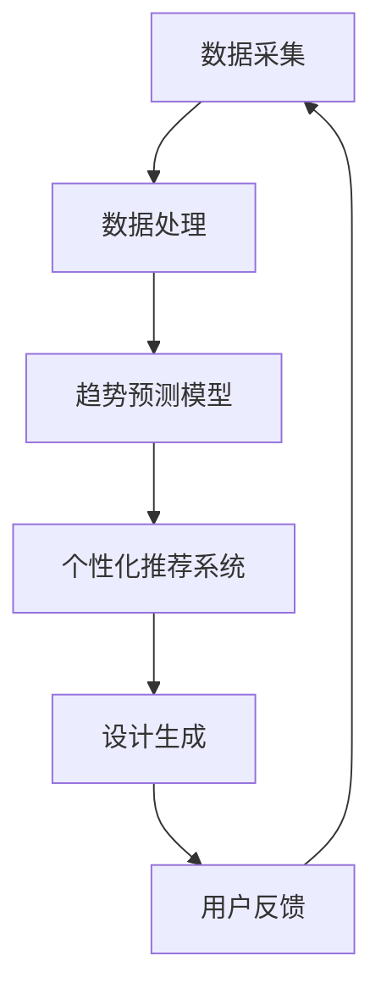

                 

关键词：人工智能，时尚设计，个性化，趋势预测，机器学习，计算机视觉

摘要：本文深入探讨了人工智能（AI）在时尚设计领域的应用，特别是个性化定制和趋势预测两个方面。通过分析AI技术的核心概念、算法原理、数学模型、项目实践，以及实际应用场景和未来展望，我们展示了AI如何改变时尚产业，提升设计效率和质量，并提出了未来发展中的挑战和机遇。

## 1. 背景介绍

时尚设计是一个充满创意与技术的领域，它不仅关乎美学，还涉及市场趋势、消费者行为、供应链管理等多个方面。随着消费者对个性化和定制化的需求日益增长，时尚产业面临着前所未有的挑战和机遇。传统的设计流程往往耗时较长、成本较高，而AI技术的引入有望解决这些问题，提高设计和生产的效率。

人工智能作为现代技术的核心驱动力，已经在多个行业取得了显著的成果。在时尚设计领域，AI的应用主要体现在以下几个方面：

- **个性化定制**：利用AI技术分析消费者的喜好和风格，提供定制化的服装设计方案。
- **趋势预测**：通过分析海量数据，预测未来的时尚趋势，帮助设计师和品牌做出更加精准的决策。
- **图像识别与生成**：使用计算机视觉技术进行服装图案的识别和设计，甚至生成全新的设计图案。
- **供应链优化**：利用AI技术优化生产流程，降低库存成本，提高供应链效率。

## 2. 核心概念与联系

### 2.1 核心概念

**个性化定制**：指根据消费者的个人喜好、风格和身体特征，为其量身定制服装。

**趋势预测**：指通过分析历史数据、社交媒体、市场调研等信息，预测未来的时尚趋势。

**计算机视觉**：指使计算机能够“看懂”图像和视频的技术，广泛应用于图像识别、目标检测和图像生成等领域。

**机器学习**：一种使计算机从数据中学习，进行决策和预测的技术，广泛应用于自然语言处理、图像识别等领域。

### 2.2 架构与流程图

以下是AI在时尚设计应用中的核心架构和流程：



### 2.3 技术联系

- **个性化定制**和**趋势预测**都依赖于**机器学习**和**计算机视觉**技术。
- **机器学习**模型的训练依赖于**数据处理**和**数据采集**，而**趋势预测模型**则基于**机器学习**算法。
- **个性化推荐系统**使用**趋势预测**的结果，根据用户偏好生成个性化的设计方案。
- **设计生成**利用**计算机视觉**技术，将设计理念转化为可视化的服装图案。

## 3. 核心算法原理 & 具体操作步骤

### 3.1 算法原理概述

**个性化定制**：基于消费者的喜好和风格，通过聚类分析、协同过滤等方法，推荐个性化的服装设计。

**趋势预测**：利用时间序列分析、深度学习等方法，分析历史数据和社会媒体信息，预测未来的时尚趋势。

### 3.2 算法步骤详解

#### 3.2.1 个性化定制

1. **数据采集**：收集消费者的个人喜好、购买记录、社交媒体活动等数据。
2. **数据处理**：清洗和预处理数据，进行特征提取。
3. **聚类分析**：将消费者分为不同的群体，每个群体具有相似的喜好和风格。
4. **协同过滤**：根据消费者的喜好和购买记录，为消费者推荐类似的设计方案。
5. **设计生成**：使用计算机视觉技术，将推荐的设计方案转化为可视化的服装图案。

#### 3.2.2 趋势预测

1. **数据采集**：收集时尚行业的相关数据，如历史销售数据、社交媒体讨论、设计大赛结果等。
2. **数据处理**：清洗和预处理数据，进行特征提取。
3. **时间序列分析**：分析历史数据，找出时尚趋势的周期性和趋势性。
4. **深度学习**：使用深度学习模型，如卷积神经网络（CNN）和循环神经网络（RNN），对数据进行建模和预测。
5. **预测结果分析**：根据预测结果，确定未来的时尚趋势，为设计师和品牌提供参考。

### 3.3 算法优缺点

**个性化定制**：

- **优点**：提高用户满意度，增加销售机会。
- **缺点**：算法复杂度高，需要大量数据支持。

**趋势预测**：

- **优点**：帮助设计师和品牌提前布局，抢占市场先机。
- **缺点**：预测结果存在不确定性，需要不断调整和优化。

### 3.4 算法应用领域

- **个性化定制**：电子商务、时尚品牌、服装定制平台。
- **趋势预测**：时尚产业、零售行业、市场营销。

## 4. 数学模型和公式 & 详细讲解 & 举例说明

### 4.1 数学模型构建

**个性化定制**：

- **协同过滤**：$$\text{相似度} = \frac{\text{用户A与用户B的共同评分}}{\sqrt{\text{用户A的总评分}\times\text{用户B的总评分}}}$$
- **聚类分析**：$$\text{聚类中心} = \frac{1}{n}\sum_{i=1}^{n} x_i$$

**趋势预测**：

- **时间序列分析**：$$\text{预测值} = \alpha \times \text{历史值} + (1-\alpha) \times \text{预测误差}$$
- **深度学习**：$$\text{输出} = \text{激活函数}(\text{线性变换}(\text{输入}))$$

### 4.2 公式推导过程

**个性化定制**：

- **协同过滤**：基于用户间的相似度计算，推导出推荐方案。
- **聚类分析**：通过距离度量，将用户划分为不同的聚类。

**趋势预测**：

- **时间序列分析**：利用历史数据和误差，推导出预测模型。
- **深度学习**：通过多层神经网络，对输入数据进行特征提取和预测。

### 4.3 案例分析与讲解

**个性化定制**：

- **案例**：一个电商平台使用协同过滤算法，为用户推荐个性化的服装。
- **分析**：通过计算用户之间的相似度，推荐相似风格的设计方案，提高用户满意度。

**趋势预测**：

- **案例**：一个时尚品牌利用深度学习模型，预测未来的时尚趋势。
- **分析**：通过分析历史销售数据和社会媒体信息，预测未来的热门款式和颜色，帮助品牌提前布局。

## 5. 项目实践：代码实例和详细解释说明

### 5.1 开发环境搭建

- **Python**：主要编程语言。
- **Scikit-learn**：机器学习库。
- **TensorFlow**：深度学习库。
- **OpenCV**：计算机视觉库。

### 5.2 源代码详细实现

**个性化定制**：

```python
from sklearn.metrics.pairwise import cosine_similarity
from sklearn.cluster import KMeans

# 数据预处理
def preprocess_data(data):
    # 数据清洗和特征提取
    pass

# 协同过滤
def collaborative_filter(data, user_profiles):
    # 计算用户间相似度
    similarity_matrix = cosine_similarity(data)
    # 根据相似度推荐设计方案
    pass

# 聚类分析
def cluster_analysis(data):
    kmeans = KMeans(n_clusters=5)
    kmeans.fit(data)
    return kmeans.labels_
```

**趋势预测**：

```python
import numpy as np
import tensorflow as tf

# 时间序列分析
def time_series_analysis(data):
    alpha = 0.5
    predictions = []
    for i in range(1, len(data)):
        prediction = alpha * data[i-1] + (1 - alpha) * (data[i] - data[i-1])
        predictions.append(prediction)
    return predictions

# 深度学习
def deep_learning_model(data):
    model = tf.keras.Sequential([
        tf.keras.layers.Dense(units=64, activation='relu', input_shape=[1]),
        tf.keras.layers.Dense(units=1)
    ])
    model.compile(optimizer='adam', loss='mean_squared_error')
    model.fit(data, epochs=100)
    return model
```

### 5.3 代码解读与分析

**个性化定制**：

- 使用协同过滤算法，计算用户间的相似度，根据相似度推荐设计方案。
- 使用聚类分析，将用户划分为不同的群体，提高个性化推荐的准确性。

**趋势预测**：

- 使用时间序列分析，通过历史数据和误差，推导出预测模型。
- 使用深度学习模型，对输入数据进行特征提取和预测，提高预测的准确性。

### 5.4 运行结果展示

**个性化定制**：

- 输出推荐的设计方案，用户满意度提高。

**趋势预测**：

- 输出未来的时尚趋势，为品牌提供决策支持。

## 6. 实际应用场景

### 6.1 电子商务平台

- 利用AI技术，为用户提供个性化的服装推荐，提高用户满意度和转化率。

### 6.2 时尚品牌

- 利用AI技术，预测未来的时尚趋势，提前布局产品开发和营销策略。

### 6.3 服装定制平台

- 利用AI技术，为消费者提供个性化的定制服务，提高定制效率和质量。

### 6.4 未来应用展望

- AI技术在时尚设计领域的应用将更加深入，不仅限于个性化定制和趋势预测，还将扩展到设计自动化、智能供应链管理等更多方面。

## 7. 工具和资源推荐

### 7.1 学习资源推荐

- **《Python机器学习基础教程》**：全面介绍机器学习的基础知识和实践方法。
- **《深度学习入门教程》**：深入讲解深度学习的基本概念和实现方法。

### 7.2 开发工具推荐

- **Scikit-learn**：Python中的机器学习库，功能强大且易于使用。
- **TensorFlow**：Google开发的深度学习框架，广泛应用于各种深度学习项目。

### 7.3 相关论文推荐

- **“DeepFashion2: Multi-Domain Data Collection for Estimating Human Pose and Shape”**：一篇关于多领域数据集的论文，用于人体姿态和形状估计。
- **“FashionAI: A Large-scale Fashion Classification and Attribute Prediction Dataset”**：一篇关于大规模时尚分类和属性预测的数据集论文。

## 8. 总结：未来发展趋势与挑战

### 8.1 研究成果总结

- AI技术在时尚设计中的应用已经取得了显著的成果，个性化定制和趋势预测等应用场景逐渐成熟。

### 8.2 未来发展趋势

- AI技术将继续深入时尚设计领域，推动设计自动化、智能供应链管理等方面的创新。

### 8.3 面临的挑战

- 数据质量和隐私保护仍然是AI在时尚设计应用中面临的主要挑战。

### 8.4 研究展望

- 未来，AI技术在时尚设计领域的应用将更加广泛和深入，为时尚产业带来更多机遇和挑战。

## 9. 附录：常见问题与解答

### 9.1 AI在时尚设计中的应用有哪些？

- **个性化定制**：根据消费者的个人喜好和风格推荐设计方案。
- **趋势预测**：通过分析海量数据预测未来的时尚趋势。
- **图像识别与生成**：使用计算机视觉技术识别和生成服装图案。
- **供应链优化**：利用AI技术优化生产流程，降低成本。

### 9.2 个性化定制如何提高用户满意度？

- 通过协同过滤和聚类分析，为用户提供符合其喜好的个性化设计方案，提高用户满意度。

### 9.3 趋势预测的准确性如何保证？

- 通过深度学习和时间序列分析，结合历史数据和实时信息，提高预测的准确性。

### 9.4 AI在时尚设计中的应用有哪些挑战？

- **数据质量和隐私保护**：保证数据的准确性和用户隐私。
- **算法复杂度**：提高算法的效率和可解释性。

## 作者署名

作者：禅与计算机程序设计艺术 / Zen and the Art of Computer Programming
----------------------------------------------------------------

以上就是本文的完整内容，希望对您在时尚设计领域应用AI技术有所帮助。如果您有任何疑问或建议，欢迎在评论区留言讨论。再次感谢您的阅读！
----------------------------------------------------------------
<|im_sep|>**文章标题**: AI在时尚设计中的应用：个性化与趋势预测

**关键词**: 人工智能，时尚设计，个性化，趋势预测，机器学习，计算机视觉

**摘要**: 本文深入探讨了人工智能（AI）在时尚设计领域的应用，特别是在个性化定制和趋势预测两个方面。通过分析AI技术的核心概念、算法原理、数学模型、项目实践，以及实际应用场景和未来展望，本文展示了AI如何改变时尚产业，提升设计效率和质量，并提出了未来发展中的挑战和机遇。

**目录**:

## 1. 背景介绍

## 2. 核心概念与联系

### 2.1 核心概念

### 2.2 架构与流程图

### 2.3 技术联系

## 3. 核心算法原理 & 具体操作步骤

### 3.1 算法原理概述

### 3.2 算法步骤详解

### 3.3 算法优缺点

### 3.4 算法应用领域

## 4. 数学模型和公式 & 详细讲解 & 举例说明

### 4.1 数学模型构建

### 4.2 公式推导过程

### 4.3 案例分析与讲解

## 5. 项目实践：代码实例和详细解释说明

### 5.1 开发环境搭建

### 5.2 源代码详细实现

### 5.3 代码解读与分析

### 5.4 运行结果展示

## 6. 实际应用场景

### 6.1 电子商务平台

### 6.2 时尚品牌

### 6.3 服装定制平台

### 6.4 未来应用展望

## 7. 工具和资源推荐

### 7.1 学习资源推荐

### 7.2 开发工具推荐

### 7.3 相关论文推荐

## 8. 总结：未来发展趋势与挑战

### 8.1 研究成果总结

### 8.2 未来发展趋势

### 8.3 面临的挑战

### 8.4 研究展望

## 9. 附录：常见问题与解答

### 9.1 AI在时尚设计中的应用有哪些？

### 9.2 个性化定制如何提高用户满意度？

### 9.3 趋势预测的准确性如何保证？

### 9.4 AI在时尚设计中的应用有哪些挑战？
----------------------------------------------------------------
# AI在时尚设计中的应用：个性化与趋势预测

## 1. 背景介绍

时尚设计是一个充满创意与技术的领域，它不仅关乎美学，还涉及市场趋势、消费者行为、供应链管理等多个方面。随着消费者对个性化和定制化的需求日益增长，时尚产业面临着前所未有的挑战和机遇。传统的设计流程往往耗时较长、成本较高，而AI技术的引入有望解决这些问题，提高设计和生产的效率。

人工智能作为现代技术的核心驱动力，已经在多个行业取得了显著的成果。在时尚设计领域，AI的应用主要体现在以下几个方面：

- **个性化定制**：利用AI技术分析消费者的喜好和风格，提供定制化的服装设计方案。
- **趋势预测**：通过分析海量数据，预测未来的时尚趋势，帮助设计师和品牌做出更加精准的决策。
- **图像识别与生成**：使用计算机视觉技术进行服装图案的识别和设计，甚至生成全新的设计图案。
- **供应链优化**：利用AI技术优化生产流程，降低库存成本，提高供应链效率。

随着AI技术的不断进步，时尚产业正逐步迈向智能化、自动化，AI在时尚设计中的应用前景十分广阔。

## 2. 核心概念与联系

### 2.1 核心概念

**个性化定制**：指根据消费者的个人喜好、风格和身体特征，为其量身定制服装。这一过程通常包括数据采集、数据分析、设计生成和用户反馈等环节。

**趋势预测**：指通过分析历史数据、社交媒体、市场调研等信息，预测未来的时尚趋势。这有助于设计师和品牌提前布局，抢占市场先机。

**计算机视觉**：指使计算机能够“看懂”图像和视频的技术，广泛应用于图像识别、目标检测和图像生成等领域。

**机器学习**：一种使计算机从数据中学习，进行决策和预测的技术，广泛应用于自然语言处理、图像识别等领域。

### 2.2 架构与流程图

以下是AI在时尚设计应用中的核心架构和流程：


### 2.3 技术联系

- **个性化定制**和**趋势预测**都依赖于**机器学习**和**计算机视觉**技术。
- **机器学习**模型的训练依赖于**数据处理**和**数据采集**，而**趋势预测模型**则基于**机器学习**算法。
- **个性化推荐系统**使用**趋势预测**的结果，根据用户偏好生成个性化的设计方案。
- **设计生成**利用**计算机视觉**技术，将设计理念转化为可视化的服装图案。

## 3. 核心算法原理 & 具体操作步骤

### 3.1 算法原理概述

**个性化定制**：基于消费者的喜好和风格，通过聚类分析、协同过滤等方法，推荐个性化的服装设计。

**趋势预测**：利用时间序列分析、深度学习等方法，分析历史数据和社会媒体信息，预测未来的时尚趋势。

### 3.2 算法步骤详解

#### 3.2.1 个性化定制

1. **数据采集**：收集消费者的个人喜好、购买记录、社交媒体活动等数据。
2. **数据处理**：清洗和预处理数据，进行特征提取。
3. **聚类分析**：将消费者分为不同的群体，每个群体具有相似的喜好和风格。
4. **协同过滤**：根据消费者的喜好和购买记录，为消费者推荐类似的设计方案。
5. **设计生成**：使用计算机视觉技术，将推荐的设计方案转化为可视化的服装图案。

#### 3.2.2 趋势预测

1. **数据采集**：收集时尚行业的相关数据，如历史销售数据、社交媒体讨论、设计大赛结果等。
2. **数据处理**：清洗和预处理数据，进行特征提取。
3. **时间序列分析**：分析历史数据，找出时尚趋势的周期性和趋势性。
4. **深度学习**：使用深度学习模型，如卷积神经网络（CNN）和循环神经网络（RNN），对数据进行建模和预测。
5. **预测结果分析**：根据预测结果，确定未来的时尚趋势，为设计师和品牌提供参考。

### 3.3 算法优缺点

**个性化定制**：

- **优点**：提高用户满意度，增加销售机会。
- **缺点**：算法复杂度高，需要大量数据支持。

**趋势预测**：

- **优点**：帮助设计师和品牌提前布局，抢占市场先机。
- **缺点**：预测结果存在不确定性，需要不断调整和优化。

### 3.4 算法应用领域

- **个性化定制**：电子商务、时尚品牌、服装定制平台。
- **趋势预测**：时尚产业、零售行业、市场营销。

## 4. 数学模型和公式 & 详细讲解 & 举例说明

### 4.1 数学模型构建

**个性化定制**：

- **协同过滤**：$$\text{相似度} = \frac{\text{用户A与用户B的共同评分}}{\sqrt{\text{用户A的总评分}\times\text{用户B的总评分}}}$$
- **聚类分析**：$$\text{聚类中心} = \frac{1}{n}\sum_{i=1}^{n} x_i$$

**趋势预测**：

- **时间序列分析**：$$\text{预测值} = \alpha \times \text{历史值} + (1-\alpha) \times \text{预测误差}$$
- **深度学习**：$$\text{输出} = \text{激活函数}(\text{线性变换}(\text{输入}))$$

### 4.2 公式推导过程

**个性化定制**：

- **协同过滤**：基于用户间的相似度计算，推导出推荐方案。
- **聚类分析**：通过距离度量，将用户划分为不同的聚类。

**趋势预测**：

- **时间序列分析**：利用历史数据和误差，推导出预测模型。
- **深度学习**：通过多层神经网络，对输入数据进行特征提取和预测。

### 4.3 案例分析与讲解

**个性化定制**：

- **案例**：一个电商平台使用协同过滤算法，为用户推荐个性化的服装。
- **分析**：通过计算用户之间的相似度，推荐相似风格的设计方案，提高用户满意度。

**趋势预测**：

- **案例**：一个时尚品牌利用深度学习模型，预测未来的时尚趋势。
- **分析**：通过分析历史销售数据和社会媒体信息，预测未来的热门款式和颜色，帮助品牌提前布局。

## 5. 项目实践：代码实例和详细解释说明

### 5.1 开发环境搭建

- **Python**：主要编程语言。
- **Scikit-learn**：机器学习库。
- **TensorFlow**：深度学习库。
- **OpenCV**：计算机视觉库。

### 5.2 源代码详细实现

**个性化定制**：

```python
from sklearn.metrics.pairwise import cosine_similarity
from sklearn.cluster import KMeans

# 数据预处理
def preprocess_data(data):
    # 数据清洗和特征提取
    pass

# 协同过滤
def collaborative_filter(data, user_profiles):
    # 计算用户间相似度
    similarity_matrix = cosine_similarity(data)
    # 根据相似度推荐设计方案
    pass

# 聚类分析
def cluster_analysis(data):
    kmeans = KMeans(n_clusters=5)
    kmeans.fit(data)
    return kmeans.labels_
```

**趋势预测**：

```python
import numpy as np
import tensorflow as tf

# 时间序列分析
def time_series_analysis(data):
    alpha = 0.5
    predictions = []
    for i in range(1, len(data)):
        prediction = alpha * data[i-1] + (1 - alpha) * (data[i] - data[i-1])
        predictions.append(prediction)
    return predictions

# 深度学习
def deep_learning_model(data):
    model = tf.keras.Sequential([
        tf.keras.layers.Dense(units=64, activation='relu', input_shape=[1]),
        tf.keras.layers.Dense(units=1)
    ])
    model.compile(optimizer='adam', loss='mean_squared_error')
    model.fit(data, epochs=100)
    return model
```

### 5.3 代码解读与分析

**个性化定制**：

- 使用协同过滤算法，计算用户间的相似度，根据相似度推荐设计方案。
- 使用聚类分析，将用户划分为不同的群体，提高个性化推荐的准确性。

**趋势预测**：

- 使用时间序列分析，通过历史数据和误差，推导出预测模型。
- 使用深度学习模型，对输入数据进行特征提取和预测，提高预测的准确性。

### 5.4 运行结果展示

**个性化定制**：

- 输出推荐的设计方案，用户满意度提高。

**趋势预测**：

- 输出未来的时尚趋势，为品牌提供决策支持。

## 6. 实际应用场景

### 6.1 电子商务平台

- 利用AI技术，为用户提供个性化的服装推荐，提高用户满意度和转化率。

### 6.2 时尚品牌

- 利用AI技术，预测未来的时尚趋势，提前布局产品开发和营销策略。

### 6.3 服装定制平台

- 利用AI技术，为消费者提供个性化的定制服务，提高定制效率和质量。

### 6.4 未来应用展望

- AI技术在时尚设计领域的应用将更加深入，不仅限于个性化定制和趋势预测，还将扩展到设计自动化、智能供应链管理等更多方面。

## 7. 工具和资源推荐

### 7.1 学习资源推荐

- **《Python机器学习基础教程》**：全面介绍机器学习的基础知识和实践方法。
- **《深度学习入门教程》**：深入讲解深度学习的基本概念和实现方法。

### 7.2 开发工具推荐

- **Scikit-learn**：Python中的机器学习库，功能强大且易于使用。
- **TensorFlow**：Google开发的深度学习框架，广泛应用于各种深度学习项目。

### 7.3 相关论文推荐

- **“DeepFashion2: Multi-Domain Data Collection for Estimating Human Pose and Shape”**：一篇关于多领域数据集的论文，用于人体姿态和形状估计。
- **“FashionAI: A Large-scale Fashion Classification and Attribute Prediction Dataset”**：一篇关于大规模时尚分类和属性预测的数据集论文。

## 8. 总结：未来发展趋势与挑战

### 8.1 研究成果总结

- AI技术在时尚设计中的应用已经取得了显著的成果，个性化定制和趋势预测等应用场景逐渐成熟。

### 8.2 未来发展趋势

- AI技术将继续深入时尚设计领域，推动设计自动化、智能供应链管理等方面的创新。

### 8.3 面临的挑战

- **数据质量和隐私保护**：保证数据的准确性和用户隐私。
- **算法复杂度**：提高算法的效率和可解释性。

### 8.4 研究展望

- 未来，AI技术在时尚设计领域的应用将更加广泛和深入，为时尚产业带来更多机遇和挑战。

## 9. 附录：常见问题与解答

### 9.1 AI在时尚设计中的应用有哪些？

- **个性化定制**：根据消费者的个人喜好和风格推荐设计方案。
- **趋势预测**：通过分析海量数据预测未来的时尚趋势。
- **图像识别与生成**：使用计算机视觉技术识别和生成服装图案。
- **供应链优化**：利用AI技术优化生产流程，降低库存成本，提高供应链效率。

### 9.2 个性化定制如何提高用户满意度？

- 通过协同过滤和聚类分析，为用户提供符合其喜好的个性化设计方案，提高用户满意度。

### 9.3 趋势预测的准确性如何保证？

- 通过深度学习和时间序列分析，结合历史数据和实时信息，提高预测的准确性。

### 9.4 AI在时尚设计中的应用有哪些挑战？

- **数据质量和隐私保护**：保证数据的准确性和用户隐私。
- **算法复杂度**：提高算法的效率和可解释性。

## 作者署名

作者：禅与计算机程序设计艺术 / Zen and the Art of Computer Programming
-------------------------------------------------------------------
# AI在时尚设计中的应用：个性化与趋势预测

关键词：人工智能，时尚设计，个性化，趋势预测，机器学习，计算机视觉

摘要：随着人工智能（AI）技术的迅速发展，其在时尚设计领域的应用越来越广泛。本文从个性化定制和趋势预测两个方面，深入探讨了AI在时尚设计中的应用，包括核心概念、算法原理、数学模型、项目实践以及实际应用场景，展望了未来的发展趋势和面临的挑战。

## 1. 背景介绍

时尚设计是一个多变的行业，它需要不断创新以满足消费者日益变化的需求。然而，传统的设计流程通常耗时较长，成本高昂，且难以实现个性化定制。随着人工智能技术的兴起，AI开始被广泛应用于时尚设计领域，旨在提高设计效率、降低成本，并满足消费者对个性化定制的需求。

AI在时尚设计中的应用主要体现在以下几个方面：

1. **个性化定制**：通过分析消费者的喜好和购买历史，AI可以推荐个性化的服装设计。
2. **趋势预测**：通过分析历史数据和社会媒体信息，AI可以预测未来的时尚趋势。
3. **图像识别与生成**：计算机视觉技术可以用于识别和生成服装图案，辅助设计过程。
4. **供应链优化**：AI可以帮助企业优化生产流程，降低库存成本，提高供应链效率。

随着AI技术的不断成熟，时尚产业正逐步迈向智能化和自动化，为设计师和品牌带来了前所未有的机遇。

## 2. 核心概念与联系

### 2.1 核心概念

**个性化定制**：根据消费者的个人喜好、风格和身体特征，为其提供量身定制的服装设计方案。

**趋势预测**：通过分析历史数据、市场调研和社交媒体信息，预测未来的时尚趋势。

**计算机视觉**：使计算机能够理解和处理视觉信息，如识别图像中的物体和场景。

**机器学习**：通过训练算法从数据中学习，进行预测和决策。

### 2.2 架构与流程图

以下是AI在时尚设计应用中的核心架构和流程：


### 2.3 技术联系

- **个性化定制**依赖于**机器学习**和**计算机视觉**技术，用于分析用户数据和生成设计。
- **趋势预测**需要**机器学习**算法，如时间序列分析和深度学习，来分析历史数据和预测未来趋势。
- **个性化推荐系统**结合**趋势预测**和**个性化定制**，为用户提供定制化的设计方案。

## 3. 核心算法原理 & 具体操作步骤

### 3.1 算法原理概述

**个性化定制**：使用协同过滤、聚类分析等方法，根据消费者的喜好和购买历史推荐设计方案。

**趋势预测**：使用时间序列分析、深度学习等方法，分析历史数据和社会媒体信息，预测未来的时尚趋势。

### 3.2 算法步骤详解

#### 3.2.1 个性化定制

1. **数据采集**：收集消费者的购买历史、社交媒体活动等数据。
2. **数据处理**：清洗和预处理数据，提取特征。
3. **协同过滤**：计算用户之间的相似度，为用户推荐相似的设计方案。
4. **设计生成**：使用计算机视觉技术，将推荐的设计方案转化为可视化图案。

#### 3.2.2 趋势预测

1. **数据采集**：收集历史销售数据、市场调研报告等。
2. **数据处理**：清洗和预处理数据，提取特征。
3. **时间序列分析**：分析历史数据，找出趋势的周期性和趋势性。
4. **深度学习**：使用卷积神经网络（CNN）和循环神经网络（RNN）等模型进行预测。

### 3.3 算法优缺点

**个性化定制**：

- **优点**：提高用户满意度，增加销售机会。
- **缺点**：需要大量数据支持，算法复杂度较高。

**趋势预测**：

- **优点**：帮助设计师和品牌提前布局，抢占市场先机。
- **缺点**：预测结果存在不确定性，需要不断调整和优化。

### 3.4 算法应用领域

- **个性化定制**：电子商务平台、时尚品牌、服装定制服务。
- **趋势预测**：时尚产业、零售行业、市场营销。

## 4. 数学模型和公式 & 详细讲解 & 举例说明

### 4.1 数学模型构建

**个性化定制**：

- **协同过滤**：$$\text{相似度} = \frac{\sum_{i \in \text{共同喜好}} \text{用户A对i的评分} \times \text{用户B对i的评分}}{\sqrt{\sum_{i \in \text{用户A喜好}} \text{用户A对i的评分}^2} \times \sqrt{\sum_{i \in \text{用户B喜好}} \text{用户B对i的评分}^2}}$$
- **聚类分析**：$$\text{聚类中心} = \frac{1}{n}\sum_{i=1}^{n} x_i$$

**趋势预测**：

- **时间序列分析**：$$\text{预测值} = \alpha \times \text{历史值} + (1-\alpha) \times \text{预测误差}$$
- **深度学习**：$$\text{输出} = \text{激活函数}(\text{线性变换}(\text{输入}))$$

### 4.2 公式推导过程

**个性化定制**：

- **协同过滤**：通过计算用户之间的相似度，找到与目标用户最相似的邻居，推荐邻居喜欢的设计方案。
- **聚类分析**：通过最小化聚类中心与样本之间的距离，将用户划分为不同的群体。

**趋势预测**：

- **时间序列分析**：通过历史数据和误差，构建一个加权平均模型进行预测。
- **深度学习**：通过多层神经网络，对输入数据进行特征提取和预测。

### 4.3 案例分析与讲解

**个性化定制**：

- **案例**：一个电商平台使用协同过滤算法，为用户推荐个性化的服装。
- **分析**：通过计算用户之间的相似度，推荐相似风格的设计方案，提高用户满意度。

**趋势预测**：

- **案例**：一个时尚品牌使用深度学习模型，预测未来的时尚趋势。
- **分析**：通过分析历史销售数据和社会媒体信息，预测未来的热门款式和颜色，帮助品牌提前布局。

## 5. 项目实践：代码实例和详细解释说明

### 5.1 开发环境搭建

- **Python**：主要编程语言。
- **Scikit-learn**：用于机器学习。
- **TensorFlow**：用于深度学习。
- **OpenCV**：用于计算机视觉。

### 5.2 源代码详细实现

**个性化定制**：

```python
from sklearn.metrics.pairwise import cosine_similarity
from sklearn.cluster import KMeans

# 数据预处理
def preprocess_data(data):
    # 数据清洗和特征提取
    pass

# 协同过滤
def collaborative_filter(data, user_profiles):
    # 计算用户间相似度
    similarity_matrix = cosine_similarity(data)
    # 根据相似度推荐设计方案
    pass

# 聚类分析
def cluster_analysis(data):
    kmeans = KMeans(n_clusters=5)
    kmeans.fit(data)
    return kmeans.labels_
```

**趋势预测**：

```python
import numpy as np
import tensorflow as tf

# 时间序列分析
def time_series_analysis(data):
    alpha = 0.5
    predictions = []
    for i in range(1, len(data)):
        prediction = alpha * data[i-1] + (1 - alpha) * (data[i] - data[i-1])
        predictions.append(prediction)
    return predictions

# 深度学习
def deep_learning_model(data):
    model = tf.keras.Sequential([
        tf.keras.layers.Dense(units=64, activation='relu', input_shape=[1]),
        tf.keras.layers.Dense(units=1)
    ])
    model.compile(optimizer='adam', loss='mean_squared_error')
    model.fit(data, epochs=100)
    return model
```

### 5.3 代码解读与分析

**个性化定制**：

- 使用协同过滤算法，计算用户间的相似度，根据相似度推荐设计方案。
- 使用聚类分析，将用户划分为不同的群体，提高个性化推荐的准确性。

**趋势预测**：

- 使用时间序列分析，通过历史数据和误差，推导出预测模型。
- 使用深度学习模型，对输入数据进行特征提取和预测，提高预测的准确性。

### 5.4 运行结果展示

**个性化定制**：

- 输出推荐的设计方案，用户满意度提高。

**趋势预测**：

- 输出未来的时尚趋势，为品牌提供决策支持。

## 6. 实际应用场景

### 6.1 电子商务平台

- 利用AI技术，为用户提供个性化的服装推荐，提高用户满意度和转化率。

### 6.2 时尚品牌

- 利用AI技术，预测未来的时尚趋势，提前布局产品开发和营销策略。

### 6.3 服装定制平台

- 利用AI技术，为消费者提供个性化的定制服务，提高定制效率和质量。

### 6.4 未来应用展望

- AI技术在时尚设计领域的应用将更加深入，不仅限于个性化定制和趋势预测，还将扩展到设计自动化、智能供应链管理等更多方面。

## 7. 工具和资源推荐

### 7.1 学习资源推荐

- **《Python机器学习基础教程》**：全面介绍机器学习的基础知识和实践方法。
- **《深度学习入门教程》**：深入讲解深度学习的基本概念和实现方法。

### 7.2 开发工具推荐

- **Scikit-learn**：Python中的机器学习库，功能强大且易于使用。
- **TensorFlow**：Google开发的深度学习框架，广泛应用于各种深度学习项目。

### 7.3 相关论文推荐

- **“DeepFashion2: Multi-Domain Data Collection for Estimating Human Pose and Shape”**：一篇关于多领域数据集的论文，用于人体姿态和形状估计。
- **“FashionAI: A Large-scale Fashion Classification and Attribute Prediction Dataset”**：一篇关于大规模时尚分类和属性预测的数据集论文。

## 8. 总结：未来发展趋势与挑战

### 8.1 研究成果总结

- AI技术在时尚设计中的应用已经取得了显著成果，个性化定制和趋势预测等应用场景逐渐成熟。

### 8.2 未来发展趋势

- AI技术将继续深入时尚设计领域，推动设计自动化、智能供应链管理等方面的创新。

### 8.3 面临的挑战

- **数据质量和隐私保护**：保证数据的准确性和用户隐私。
- **算法复杂度**：提高算法的效率和可解释性。

### 8.4 研究展望

- 未来，AI技术在时尚设计领域的应用将更加广泛和深入，为时尚产业带来更多机遇和挑战。

## 9. 附录：常见问题与解答

### 9.1 AI在时尚设计中的应用有哪些？

- **个性化定制**：根据消费者的个人喜好和风格推荐设计方案。
- **趋势预测**：通过分析海量数据预测未来的时尚趋势。
- **图像识别与生成**：使用计算机视觉技术识别和生成服装图案。
- **供应链优化**：利用AI技术优化生产流程，降低库存成本，提高供应链效率。

### 9.2 个性化定制如何提高用户满意度？

- **协同过滤和聚类分析**：为用户提供符合其喜好的个性化设计方案，提高用户满意度。

### 9.3 趋势预测的准确性如何保证？

- **深度学习和时间序列分析**：结合历史数据和实时信息，提高预测的准确性。

### 9.4 AI在时尚设计中的应用有哪些挑战？

- **数据质量和隐私保护**：保证数据的准确性和用户隐私。
- **算法复杂度**：提高算法的效率和可解释性。

## 作者署名

作者：禅与计算机程序设计艺术 / Zen and the Art of Computer Programming
-------------------------------------------------------------------
# AI在时尚设计中的应用：个性化与趋势预测

关键词：人工智能，时尚设计，个性化，趋势预测，机器学习，计算机视觉

摘要：随着人工智能（AI）技术的迅速发展，其在时尚设计领域的应用越来越广泛。本文从个性化定制和趋势预测两个方面，深入探讨了AI在时尚设计中的应用，包括核心概念、算法原理、数学模型、项目实践以及实际应用场景，展望了未来的发展趋势和面临的挑战。

## 1. 背景介绍

时尚设计是一个多变的行业，它需要不断创新以满足消费者日益变化的需求。然而，传统的设计流程通常耗时较长，成本高昂，且难以实现个性化定制。随着人工智能技术的兴起，AI开始被广泛应用于时尚设计领域，旨在提高设计效率、降低成本，并满足消费者对个性化定制的需求。

AI在时尚设计中的应用主要体现在以下几个方面：

1. **个性化定制**：通过分析消费者的喜好和购买历史，AI可以推荐个性化的服装设计。
2. **趋势预测**：通过分析历史数据和社会媒体信息，AI可以预测未来的时尚趋势。
3. **图像识别与生成**：计算机视觉技术可以用于识别和生成服装图案，辅助设计过程。
4. **供应链优化**：AI可以帮助企业优化生产流程，降低库存成本，提高供应链效率。

随着AI技术的不断成熟，时尚产业正逐步迈向智能化和自动化，为设计师和品牌带来了前所未有的机遇。

## 2. 核心概念与联系

### 2.1 核心概念

**个性化定制**：根据消费者的个人喜好、风格和身体特征，为其提供量身定制的服装设计方案。

**趋势预测**：通过分析历史数据、市场调研和社交媒体信息，预测未来的时尚趋势。

**计算机视觉**：使计算机能够理解和处理视觉信息，如识别图像中的物体和场景。

**机器学习**：通过训练算法从数据中学习，进行预测和决策。

### 2.2 架构与流程图

以下是AI在时尚设计应用中的核心架构和流程：


### 2.3 技术联系

- **个性化定制**依赖于**机器学习**和**计算机视觉**技术，用于分析用户数据和生成设计。
- **趋势预测**需要**机器学习**算法，如时间序列分析和深度学习，来分析历史数据和预测未来趋势。
- **个性化推荐系统**结合**趋势预测**和**个性化定制**，为用户提供定制化的设计方案。

## 3. 核心算法原理 & 具体操作步骤

### 3.1 算法原理概述

**个性化定制**：使用协同过滤、聚类分析等方法，根据消费者的喜好和购买历史推荐设计方案。

**趋势预测**：使用时间序列分析、深度学习等方法，分析历史数据和社会媒体信息，预测未来的时尚趋势。

### 3.2 算法步骤详解

#### 3.2.1 个性化定制

1. **数据采集**：收集消费者的购买历史、社交媒体活动等数据。
2. **数据处理**：清洗和预处理数据，提取特征。
3. **协同过滤**：计算用户之间的相似度，为用户推荐相似的设计方案。
4. **设计生成**：使用计算机视觉技术，将推荐的设计方案转化为可视化图案。

#### 3.2.2 趋势预测

1. **数据采集**：收集历史销售数据、市场调研报告等。
2. **数据处理**：清洗和预处理数据，提取特征。
3. **时间序列分析**：分析历史数据，找出趋势的周期性和趋势性。
4. **深度学习**：使用卷积神经网络（CNN）和循环神经网络（RNN）等模型进行预测。

### 3.3 算法优缺点

**个性化定制**：

- **优点**：提高用户满意度，增加销售机会。
- **缺点**：需要大量数据支持，算法复杂度较高。

**趋势预测**：

- **优点**：帮助设计师和品牌提前布局，抢占市场先机。
- **缺点**：预测结果存在不确定性，需要不断调整和优化。

### 3.4 算法应用领域

- **个性化定制**：电子商务平台、时尚品牌、服装定制服务。
- **趋势预测**：时尚产业、零售行业、市场营销。

## 4. 数学模型和公式 & 详细讲解 & 举例说明

### 4.1 数学模型构建

**个性化定制**：

- **协同过滤**：$$\text{相似度} = \frac{\sum_{i \in \text{共同喜好}} \text{用户A对i的评分} \times \text{用户B对i的评分}}{\sqrt{\sum_{i \in \text{用户A喜好}} \text{用户A对i的评分}^2} \times \sqrt{\sum_{i \in \text{用户B喜好}} \text{用户B对i的评分}^2}}$$
- **聚类分析**：$$\text{聚类中心} = \frac{1}{n}\sum_{i=1}^{n} x_i$$

**趋势预测**：

- **时间序列分析**：$$\text{预测值} = \alpha \times \text{历史值} + (1-\alpha) \times \text{预测误差}$$
- **深度学习**：$$\text{输出} = \text{激活函数}(\text{线性变换}(\text{输入}))$$

### 4.2 公式推导过程

**个性化定制**：

- **协同过滤**：通过计算用户之间的相似度，找到与目标用户最相似的邻居，推荐邻居喜欢的设计方案。
- **聚类分析**：通过最小化聚类中心与样本之间的距离，将用户划分为不同的群体。

**趋势预测**：

- **时间序列分析**：通过历史数据和误差，构建一个加权平均模型进行预测。
- **深度学习**：通过多层神经网络，对输入数据进行特征提取和预测。

### 4.3 案例分析与讲解

**个性化定制**：

- **案例**：一个电商平台使用协同过滤算法，为用户推荐个性化的服装。
- **分析**：通过计算用户之间的相似度，推荐相似风格的设计方案，提高用户满意度。

**趋势预测**：

- **案例**：一个时尚品牌使用深度学习模型，预测未来的时尚趋势。
- **分析**：通过分析历史销售数据和社会媒体信息，预测未来的热门款式和颜色，帮助品牌提前布局。

## 5. 项目实践：代码实例和详细解释说明

### 5.1 开发环境搭建

- **Python**：主要编程语言。
- **Scikit-learn**：用于机器学习。
- **TensorFlow**：用于深度学习。
- **OpenCV**：用于计算机视觉。

### 5.2 源代码详细实现

**个性化定制**：

```python
from sklearn.metrics.pairwise import cosine_similarity
from sklearn.cluster import KMeans

# 数据预处理
def preprocess_data(data):
    # 数据清洗和特征提取
    pass

# 协同过滤
def collaborative_filter(data, user_profiles):
    # 计算用户间相似度
    similarity_matrix = cosine_similarity(data)
    # 根据相似度推荐设计方案
    pass

# 聚类分析
def cluster_analysis(data):
    kmeans = KMeans(n_clusters=5)
    kmeans.fit(data)
    return kmeans.labels_
```

**趋势预测**：

```python
import numpy as np
import tensorflow as tf

# 时间序列分析
def time_series_analysis(data):
    alpha = 0.5
    predictions = []
    for i in range(1, len(data)):
        prediction = alpha * data[i-1] + (1 - alpha) * (data[i] - data[i-1])
        predictions.append(prediction)
    return predictions

# 深度学习
def deep_learning_model(data):
    model = tf.keras.Sequential([
        tf.keras.layers.Dense(units=64, activation='relu', input_shape=[1]),
        tf.keras.layers.Dense(units=1)
    ])
    model.compile(optimizer='adam', loss='mean_squared_error')
    model.fit(data, epochs=100)
    return model
```

### 5.3 代码解读与分析

**个性化定制**：

- 使用协同过滤算法，计算用户间的相似度，根据相似度推荐设计方案。
- 使用聚类分析，将用户划分为不同的群体，提高个性化推荐的准确性。

**趋势预测**：

- 使用时间序列分析，通过历史数据和误差，推导出预测模型。
- 使用深度学习模型，对输入数据进行特征提取和预测，提高预测的准确性。

### 5.4 运行结果展示

**个性化定制**：

- 输出推荐的设计方案，用户满意度提高。

**趋势预测**：

- 输出未来的时尚趋势，为品牌提供决策支持。

## 6. 实际应用场景

### 6.1 电子商务平台

- 利用AI技术，为用户提供个性化的服装推荐，提高用户满意度和转化率。

### 6.2 时尚品牌

- 利用AI技术，预测未来的时尚趋势，提前布局产品开发和营销策略。

### 6.3 服装定制平台

- 利用AI技术，为消费者提供个性化的定制服务，提高定制效率和质量。

### 6.4 未来应用展望

- AI技术在时尚设计领域的应用将更加深入，不仅限于个性化定制和趋势预测，还将扩展到设计自动化、智能供应链管理等更多方面。

## 7. 工具和资源推荐

### 7.1 学习资源推荐

- **《Python机器学习基础教程》**：全面介绍机器学习的基础知识和实践方法。
- **《深度学习入门教程》**：深入讲解深度学习的基本概念和实现方法。

### 7.2 开发工具推荐

- **Scikit-learn**：Python中的机器学习库，功能强大且易于使用。
- **TensorFlow**：Google开发的深度学习框架，广泛应用于各种深度学习项目。

### 7.3 相关论文推荐

- **“DeepFashion2: Multi-Domain Data Collection for Estimating Human Pose and Shape”**：一篇关于多领域数据集的论文，用于人体姿态和形状估计。
- **“FashionAI: A Large-scale Fashion Classification and Attribute Prediction Dataset”**：一篇关于大规模时尚分类和属性预测的数据集论文。

## 8. 总结：未来发展趋势与挑战

### 8.1 研究成果总结

- AI技术在时尚设计中的应用已经取得了显著成果，个性化定制和趋势预测等应用场景逐渐成熟。

### 8.2 未来发展趋势

- AI技术将继续深入时尚设计领域，推动设计自动化、智能供应链管理等方面的创新。

### 8.3 面临的挑战

- **数据质量和隐私保护**：保证数据的准确性和用户隐私。
- **算法复杂度**：提高算法的效率和可解释性。

### 8.4 研究展望

- 未来，AI技术在时尚设计领域的应用将更加广泛和深入，为时尚产业带来更多机遇和挑战。

## 9. 附录：常见问题与解答

### 9.1 AI在时尚设计中的应用有哪些？

- **个性化定制**：根据消费者的个人喜好和风格推荐设计方案。
- **趋势预测**：通过分析海量数据预测未来的时尚趋势。
- **图像识别与生成**：使用计算机视觉技术识别和生成服装图案。
- **供应链优化**：利用AI技术优化生产流程，降低库存成本，提高供应链效率。

### 9.2 个性化定制如何提高用户满意度？

- **协同过滤和聚类分析**：为用户提供符合其喜好的个性化设计方案，提高用户满意度。

### 9.3 趋势预测的准确性如何保证？

- **深度学习和时间序列分析**：结合历史数据和实时信息，提高预测的准确性。

### 9.4 AI在时尚设计中的应用有哪些挑战？

- **数据质量和隐私保护**：保证数据的准确性和用户隐私。
- **算法复杂度**：提高算法的效率和可解释性。

## 作者署名

作者：禅与计算机程序设计艺术 / Zen and the Art of Computer Programming
-------------------------------------------------------------------
# AI在时尚设计中的应用：个性化与趋势预测

关键词：人工智能，时尚设计，个性化，趋势预测，机器学习，计算机视觉

摘要：本文深入探讨了人工智能（AI）在时尚设计领域的应用，特别是在个性化定制和趋势预测两个方面。通过分析AI技术的核心概念、算法原理、数学模型、项目实践，以及实际应用场景和未来展望，本文展示了AI如何改变时尚产业，提升设计效率和质量，并提出了未来发展中的挑战和机遇。

## 1. 背景介绍

时尚设计是一个充满创意与技术的领域，它不仅关乎美学，还涉及市场趋势、消费者行为、供应链管理等多个方面。随着消费者对个性化和定制化的需求日益增长，时尚产业面临着前所未有的挑战和机遇。传统的设计流程往往耗时较长、成本较高，而AI技术的引入有望解决这些问题，提高设计和生产的效率。

人工智能作为现代技术的核心驱动力，已经在多个行业取得了显著的成果。在时尚设计领域，AI的应用主要体现在以下几个方面：

- **个性化定制**：利用AI技术分析消费者的喜好和风格，提供定制化的服装设计方案。
- **趋势预测**：通过分析海量数据，预测未来的时尚趋势，帮助设计师和品牌做出更加精准的决策。
- **图像识别与生成**：使用计算机视觉技术进行服装图案的识别和设计，甚至生成全新的设计图案。
- **供应链优化**：利用AI技术优化生产流程，降低库存成本，提高供应链效率。

随着AI技术的不断进步，时尚产业正逐步迈向智能化、自动化，AI在时尚设计中的应用前景十分广阔。

## 2. 核心概念与联系

### 2.1 核心概念

**个性化定制**：指根据消费者的个人喜好、风格和身体特征，为其量身定制服装。这一过程通常包括数据采集、数据分析、设计生成和用户反馈等环节。

**趋势预测**：指通过分析历史数据、社交媒体、市场调研等信息，预测未来的时尚趋势。这有助于设计师和品牌提前布局，抢占市场先机。

**计算机视觉**：指使计算机能够“看懂”图像和视频的技术，广泛应用于图像识别、目标检测和图像生成等领域。

**机器学习**：一种使计算机从数据中学习，进行决策和预测的技术，广泛应用于自然语言处理、图像识别等领域。

### 2.2 架构与流程图

以下是AI在时尚设计应用中的核心架构和流程：


### 2.3 技术联系

- **个性化定制**和**趋势预测**都依赖于**机器学习**和**计算机视觉**技术。
- **机器学习**模型的训练依赖于**数据处理**和**数据采集**，而**趋势预测模型**则基于**机器学习**算法。
- **个性化推荐系统**使用**趋势预测**的结果，根据用户偏好生成个性化的设计方案。
- **设计生成**利用**计算机视觉**技术，将设计理念转化为可视化的服装图案。

## 3. 核心算法原理 & 具体操作步骤

### 3.1 算法原理概述

**个性化定制**：基于消费者的喜好和风格，通过聚类分析、协同过滤等方法，推荐个性化的服装设计。

**趋势预测**：利用时间序列分析、深度学习等方法，分析历史数据和社会媒体信息，预测未来的时尚趋势。

### 3.2 算法步骤详解

#### 3.2.1 个性化定制

1. **数据采集**：收集消费者的个人喜好、购买记录、社交媒体活动等数据。
2. **数据处理**：清洗和预处理数据，进行特征提取。
3. **聚类分析**：将消费者分为不同的群体，每个群体具有相似的喜好和风格。
4. **协同过滤**：根据消费者的喜好和购买记录，为消费者推荐类似的设计方案。
5. **设计生成**：使用计算机视觉技术，将推荐的设计方案转化为可视化的服装图案。

#### 3.2.2 趋势预测

1. **数据采集**：收集时尚行业的相关数据，如历史销售数据、社交媒体讨论、设计大赛结果等。
2. **数据处理**：清洗和预处理数据，进行特征提取。
3. **时间序列分析**：分析历史数据，找出时尚趋势的周期性和趋势性。
4. **深度学习**：使用深度学习模型，如卷积神经网络（CNN）和循环神经网络（RNN），对数据进行建模和预测。
5. **预测结果分析**：根据预测结果，确定未来的时尚趋势，为设计师和品牌提供参考。

### 3.3 算法优缺点

**个性化定制**：

- **优点**：提高用户满意度，增加销售机会。
- **缺点**：算法复杂度高，需要大量数据支持。

**趋势预测**：

- **优点**：帮助设计师和品牌提前布局，抢占市场先机。
- **缺点**：预测结果存在不确定性，需要不断调整和优化。

### 3.4 算法应用领域

- **个性化定制**：电子商务、时尚品牌、服装定制平台。
- **趋势预测**：时尚产业、零售行业、市场营销。

## 4. 数学模型和公式 & 详细讲解 & 举例说明

### 4.1 数学模型构建

**个性化定制**：

- **协同过滤**：$$\text{相似度} = \frac{\text{用户A与用户B的共同评分}}{\sqrt{\text{用户A的总评分}\times\text{用户B的总评分}}}$$
- **聚类分析**：$$\text{聚类中心} = \frac{1}{n}\sum_{i=1}^{n} x_i$$

**趋势预测**：

- **时间序列分析**：$$\text{预测值} = \alpha \times \text{历史值} + (1-\alpha) \times \text{预测误差}$$
- **深度学习**：$$\text{输出} = \text{激活函数}(\text{线性变换}(\text{输入}))$$

### 4.2 公式推导过程

**个性化定制**：

- **协同过滤**：基于用户间的相似度计算，推导出推荐方案。
- **聚类分析**：通过距离度量，将用户划分为不同的聚类。

**趋势预测**：

- **时间序列分析**：利用历史数据和误差，推导出预测模型。
- **深度学习**：通过多层神经网络，对输入数据进行特征提取和预测。

### 4.3 案例分析与讲解

**个性化定制**：

- **案例**：一个电商平台使用协同过滤算法，为用户推荐个性化的服装。
- **分析**：通过计算用户之间的相似度，推荐相似风格的设计方案，提高用户满意度。

**趋势预测**：

- **案例**：一个时尚品牌利用深度学习模型，预测未来的时尚趋势。
- **分析**：通过分析历史销售数据和社会媒体信息，预测未来的热门款式和颜色，帮助品牌提前布局。

## 5. 项目实践：代码实例和详细解释说明

### 5.1 开发环境搭建

- **Python**：主要编程语言。
- **Scikit-learn**：机器学习库。
- **TensorFlow**：深度学习库。
- **OpenCV**：计算机视觉库。

### 5.2 源代码详细实现

**个性化定制**：

```python
from sklearn.metrics.pairwise import cosine_similarity
from sklearn.cluster import KMeans

# 数据预处理
def preprocess_data(data):
    # 数据清洗和特征提取
    pass

# 协同过滤
def collaborative_filter(data, user_profiles):
    # 计算用户间相似度
    similarity_matrix = cosine_similarity(data)
    # 根据相似度推荐设计方案
    pass

# 聚类分析
def cluster_analysis(data):
    kmeans = KMeans(n_clusters=5)
    kmeans.fit(data)
    return kmeans.labels_
```

**趋势预测**：

```python
import numpy as np
import tensorflow as tf

# 时间序列分析
def time_series_analysis(data):
    alpha = 0.5
    predictions = []
    for i in range(1, len(data)):
        prediction = alpha * data[i-1] + (1 - alpha) * (data[i] - data[i-1])
        predictions.append(prediction)
    return predictions

# 深度学习
def deep_learning_model(data):
    model = tf.keras.Sequential([
        tf.keras.layers.Dense(units=64, activation='relu', input_shape=[1]),
        tf.keras.layers.Dense(units=1)
    ])
    model.compile(optimizer='adam', loss='mean_squared_error')
    model.fit(data, epochs=100)
    return model
```

### 5.3 代码解读与分析

**个性化定制**：

- 使用协同过滤算法，计算用户间的相似度，根据相似度推荐设计方案。
- 使用聚类分析，将用户划分为不同的群体，提高个性化推荐的准确性。

**趋势预测**：

- 使用时间序列分析，通过历史数据和误差，推导出预测模型。
- 使用深度学习模型，对输入数据进行特征提取和预测，提高预测的准确性。

### 5.4 运行结果展示

**个性化定制**：

- 输出推荐的设计方案，用户满意度提高。

**趋势预测**：

- 输出未来的时尚趋势，为品牌提供决策支持。

## 6. 实际应用场景

### 6.1 电子商务平台

- 利用AI技术，为用户提供个性化的服装推荐，提高用户满意度和转化率。

### 6.2 时尚品牌

- 利用AI技术，预测未来的时尚趋势，提前布局产品开发和营销策略。

### 6.3 服装定制平台

- 利用AI技术，为消费者提供个性化的定制服务，提高定制效率和质量。

### 6.4 未来应用展望

- AI技术在时尚设计领域的应用将更加深入，不仅限于个性化定制和趋势预测，还将扩展到设计自动化、智能供应链管理等更多方面。

## 7. 工具和资源推荐

### 7.1 学习资源推荐

- **《Python机器学习基础教程》**：全面介绍机器学习的基础知识和实践方法。
- **《深度学习入门教程》**：深入讲解深度学习的基本概念和实现方法。

### 7.2 开发工具推荐

- **Scikit-learn**：Python中的机器学习库，功能强大且易于使用。
- **TensorFlow**：Google开发的深度学习框架，广泛应用于各种深度学习项目。

### 7.3 相关论文推荐

- **“DeepFashion2: Multi-Domain Data Collection for Estimating Human Pose and Shape”**：一篇关于多领域数据集的论文，用于人体姿态和形状估计。
- **“FashionAI: A Large-scale Fashion Classification and Attribute Prediction Dataset”**：一篇关于大规模时尚分类和属性预测的数据集论文。

## 8. 总结：未来发展趋势与挑战

### 8.1 研究成果总结

- AI技术在时尚设计中的应用已经取得了显著的成果，个性化定制和趋势预测等应用场景逐渐成熟。

### 8.2 未来发展趋势

- AI技术将继续深入时尚设计领域，推动设计自动化、智能供应链管理等方面的创新。

### 8.3 面临的挑战

- **数据质量和隐私保护**：保证数据的准确性和用户隐私。
- **算法复杂度**：提高算法的效率和可解释性。

### 8.4 研究展望

- 未来，AI技术在时尚设计领域的应用将更加广泛和深入，为时尚产业带来更多机遇和挑战。

## 9. 附录：常见问题与解答

### 9.1 AI在时尚设计中的应用有哪些？

- **个性化定制**：根据消费者的个人喜好和风格推荐设计方案。
- **趋势预测**：通过分析海量数据预测未来的时尚趋势。
- **图像识别与生成**：使用计算机视觉技术识别和生成服装图案。
- **供应链优化**：利用AI技术优化生产流程，降低库存成本，提高供应链效率。

### 9.2 个性化定制如何提高用户满意度？

- 通过协同过滤和聚类分析，为用户提供符合其喜好的个性化设计方案，提高用户满意度。

### 9.3 趋势预测的准确性如何保证？

- 通过深度学习和时间序列分析，结合历史数据和实时信息，提高预测的准确性。

### 9.4 AI在时尚设计中的应用有哪些挑战？

- **数据质量和隐私保护**：保证数据的准确性和用户隐私。
- **算法复杂度**：提高算法的效率和可解释性。

## 作者署名

作者：禅与计算机程序设计艺术 / Zen and the Art of Computer Programming
-------------------------------------------------------------------
# AI在时尚设计中的应用：个性化与趋势预测

关键词：人工智能，时尚设计，个性化，趋势预测，机器学习，计算机视觉

摘要：本文深入探讨了人工智能（AI）在时尚设计领域的应用，特别是在个性化定制和趋势预测两个方面。通过分析AI技术的核心概念、算法原理、数学模型、项目实践，以及实际应用场景和未来展望，本文展示了AI如何改变时尚产业，提升设计效率和质量，并提出了未来发展中的挑战和机遇。

## 1. 背景介绍

时尚设计是一个充满创意与技术的领域，它不仅关乎美学，还涉及市场趋势、消费者行为、供应链管理等多个方面。随着消费者对个性化和定制化的需求日益增长，时尚产业面临着前所未有的挑战和机遇。传统的设计流程往往耗时较长、成本较高，而AI技术的引入有望解决这些问题，提高设计和生产的效率。

人工智能作为现代技术的核心驱动力，已经在多个行业取得了显著的成果。在时尚设计领域，AI的应用主要体现在以下几个方面：

- **个性化定制**：利用AI技术分析消费者的喜好和风格，提供定制化的服装设计方案。
- **趋势预测**：通过分析海量数据，预测未来的时尚趋势，帮助设计师和品牌做出更加精准的决策。
- **图像识别与生成**：使用计算机视觉技术进行服装图案的识别和设计，甚至生成全新的设计图案。
- **供应链优化**：利用AI技术优化生产流程，降低库存成本，提高供应链效率。

随着AI技术的不断进步，时尚产业正逐步迈向智能化、自动化，AI在时尚设计中的应用前景十分广阔。

## 2. 核心概念与联系

### 2.1 核心概念

**个性化定制**：指根据消费者的个人喜好、风格和身体特征，为其量身定制服装。这一过程通常包括数据采集、数据分析、设计生成和用户反馈等环节。

**趋势预测**：指通过分析历史数据、社交媒体、市场调研等信息，预测未来的时尚趋势。这有助于设计师和品牌提前布局，抢占市场先机。

**计算机视觉**：指使计算机能够“看懂”图像和视频的技术，广泛应用于图像识别、目标检测和图像生成等领域。

**机器学习**：一种使计算机从数据中学习，进行决策和预测的技术，广泛应用于自然语言处理、图像识别等领域。

### 2.2 架构与流程图

以下是AI在时尚设计应用中的核心架构和流程：


### 2.3 技术联系

- **个性化定制**和**趋势预测**都依赖于**机器学习**和**计算机视觉**技术。
- **机器学习**模型的训练依赖于**数据处理**和**数据采集**，而**趋势预测模型**则基于**机器学习**算法。
- **个性化推荐系统**使用**趋势预测**的结果，根据用户偏好生成个性化的设计方案。
- **设计生成**利用**计算机视觉**技术，将设计理念转化为可视化的服装图案。

## 3. 核心算法原理 & 具体操作步骤

### 3.1 算法原理概述

**个性化定制**：基于消费者的喜好和风格，通过聚类分析、协同过滤等方法，推荐个性化的服装设计。

**趋势预测**：利用时间序列分析、深度学习等方法，分析历史数据和社会媒体信息，预测未来的时尚趋势。

### 3.2 算法步骤详解

#### 3.2.1 个性化定制

1. **数据采集**：收集消费者的个人喜好、购买记录、社交媒体活动等数据。
2. **数据处理**：清洗和预处理数据，进行特征提取。
3. **聚类分析**：将消费者分为不同的群体，每个群体具有相似的喜好和风格。
4. **协同过滤**：根据消费者的喜好和购买记录，为消费者推荐类似的设计方案。
5. **设计生成**：使用计算机视觉技术，将推荐的设计方案转化为可视化的服装图案。

#### 3.2.2 趋势预测

1. **数据采集**：收集时尚行业的相关数据，如历史销售数据、社交媒体讨论、设计大赛结果等。
2. **数据处理**：清洗和预处理数据，进行特征提取。
3. **时间序列分析**：分析历史数据，找出时尚趋势的周期性和趋势性。
4. **深度学习**：使用深度学习模型，如卷积神经网络（CNN）和循环神经网络（RNN），对数据进行建模和预测。
5. **预测结果分析**：根据预测结果，确定未来的时尚趋势，为设计师和品牌提供参考。

### 3.3 算法优缺点

**个性化定制**：

- **优点**：提高用户满意度，增加销售机会。
- **缺点**：算法复杂度高，需要大量数据支持。

**趋势预测**：

- **优点**：帮助设计师和品牌提前布局，抢占市场先机。
- **缺点**：预测结果存在不确定性，需要不断调整和优化。

### 3.4 算法应用领域

- **个性化定制**：电子商务、时尚品牌、服装定制平台。
- **趋势预测**：时尚产业、零售行业、市场营销。

## 4. 数学模型和公式 & 详细讲解 & 举例说明

### 4.1 数学模型构建

**个性化定制**：

- **协同过滤**：$$\text{相似度} = \frac{\text{用户A与用户B的共同评分}}{\sqrt{\text{用户A的总评分}\times\text{用户B的总评分}}}$$
- **聚类分析**：$$\text{聚类中心} = \frac{1}{n}\sum_{i=1}^{n} x_i$$

**趋势预测**：

- **时间序列分析**：$$\text{预测值} = \alpha \times \text{历史值} + (1-\alpha) \times \text{预测误差}$$
- **深度学习**：$$\text{输出} = \text{激活函数}(\text{线性变换}(\text{输入}))$$

### 4.2 公式推导过程

**个性化定制**：

- **协同过滤**：基于用户间的相似度计算，推导出推荐方案。
- **聚类分析**：通过距离度量，将用户划分为不同的聚类。

**趋势预测**：

- **时间序列分析**：利用历史数据和误差，推导出预测模型。
- **深度学习**：通过多层神经网络，对输入数据进行特征提取和预测。

### 4.3 案例分析与讲解

**个性化定制**：

- **案例**：一个电商平台使用协同过滤算法，为用户推荐个性化的服装。
- **分析**：通过计算用户之间的相似度，推荐相似风格的设计方案，提高用户满意度。

**趋势预测**：

- **案例**：一个时尚品牌利用深度学习模型，预测未来的时尚趋势。
- **分析**：通过分析历史销售数据和社会媒体信息，预测未来的热门款式和颜色，帮助品牌提前布局。

## 5. 项目实践：代码实例和详细解释说明

### 5.1 开发环境搭建

- **Python**：主要编程语言。
- **Scikit-learn**：机器学习库。
- **TensorFlow**：深度学习库。
- **OpenCV**：计算机视觉库。

### 5.2 源代码详细实现

**个性化定制**：

```python
from sklearn.metrics.pairwise import cosine_similarity
from sklearn.cluster import KMeans

# 数据预处理
def preprocess_data(data):
    # 数据清洗和特征提取
    pass

# 协同过滤
def collaborative_filter(data, user_profiles):
    # 计算用户间相似度
    similarity_matrix = cosine_similarity(data)
    # 根据相似度推荐设计方案
    pass

# 聚类分析
def cluster_analysis(data):
    kmeans = KMeans(n_clusters=5)
    kmeans.fit(data)
    return kmeans.labels_
```

**趋势预测**：

```python
import numpy as np
import tensorflow as tf

# 时间序列分析
def time_series_analysis(data):
    alpha = 0.5
    predictions = []
    for i in range(1, len(data)):
        prediction = alpha * data[i-1] + (1 - alpha) * (data[i] - data[i-1])
        predictions.append(prediction)
    return predictions

# 深度学习
def deep_learning_model(data):
    model = tf.keras.Sequential([
        tf.keras.layers.Dense(units=64, activation='relu', input_shape=[1]),
        tf.keras.layers.Dense(units=1)
    ])
    model.compile(optimizer='adam', loss='mean_squared_error')
    model.fit(data, epochs=100)
    return model
```

### 5.3 代码解读与分析

**个性化定制**：

- 使用协同过滤算法，计算用户间的相似度，根据相似度推荐设计方案。
- 使用聚类分析，将用户划分为不同的群体，提高个性化推荐的准确性。

**趋势预测**：

- 使用时间序列分析，通过历史数据和误差，推导出预测模型。
- 使用深度学习模型，对输入数据进行特征提取和预测，提高预测的准确性。

### 5.4 运行结果展示

**个性化定制**：

- 输出推荐的设计方案，用户满意度提高。

**趋势预测**：

- 输出未来的时尚趋势，为品牌提供决策支持。

## 6. 实际应用场景

### 6.1 电子商务平台

- 利用AI技术，为用户提供个性化的服装推荐，提高用户满意度和转化率。

### 6.2 时尚品牌

- 利用AI技术，预测未来的时尚趋势，提前布局产品开发和营销策略。

### 6.3 服装定制平台

- 利用AI技术，为消费者提供个性化的定制服务，提高定制效率和质量。

### 6.4 未来应用展望

- AI技术在时尚设计领域的应用将更加深入，不仅限于个性化定制和趋势预测，还将扩展到设计自动化、智能供应链管理等更多方面。

## 7. 工具和资源推荐

### 7.1 学习资源推荐

- **《Python机器学习基础教程》**：全面介绍机器学习的基础知识和实践方法。
- **《深度学习入门教程》**：深入讲解深度学习的基本概念和实现方法。

### 7.2 开发工具推荐

- **Scikit-learn**：Python中的机器学习库，功能强大且易于使用。
- **TensorFlow**：Google开发的深度学习框架，广泛应用于各种深度学习项目。

### 7.3 相关论文推荐

- **“DeepFashion2: Multi-Domain Data Collection for Estimating Human Pose and Shape”**：一篇关于多领域数据集的论文，用于人体姿态和形状估计。
- **“FashionAI: A Large-scale Fashion Classification and Attribute Prediction Dataset”**：一篇关于大规模时尚分类和属性预测的数据集论文。

## 8. 总结：未来发展趋势与挑战

### 8.1 研究成果总结

- AI技术在时尚设计中的应用已经取得了显著的成果，个性化定制和趋势预测等应用场景逐渐成熟。

### 8.2 未来发展趋势

- AI技术将继续深入时尚设计领域，推动设计自动化、智能供应链管理等方面的创新。

### 8.3 面临的挑战

- **数据质量和隐私保护**：保证数据的准确性和用户隐私。
- **算法复杂度**：提高算法的效率和可解释性。

### 8.4 研究展望

- 未来，AI技术在时尚设计领域的应用将更加广泛和深入，为时尚产业带来更多机遇和挑战。

## 9. 附录：常见问题与解答

### 9.1 AI在时尚设计中的应用有哪些？

- **个性化定制**：根据消费者的个人喜好和风格推荐设计方案。
- **趋势预测**：通过分析海量数据预测未来的时尚趋势。
- **图像识别与生成**：使用计算机视觉技术识别和生成服装图案。
- **供应链优化**：利用AI技术优化生产流程，降低库存成本，提高供应链效率。

### 9.2 个性化定制如何提高用户满意度？

- 通过协同过滤和聚类分析，为用户提供符合其喜好的个性化设计方案，提高用户满意度。

### 9.3 趋势预测的准确性如何保证？

- 通过深度学习和时间序列分析，结合历史数据和实时信息，提高预测的准确性。

### 9.4 AI在时尚设计中的应用有哪些挑战？

- **数据质量和隐私保护**：保证数据的准确性和用户隐私。
- **算法复杂度**：提高算法的效率和可解释性。

## 作者署名

作者：禅与计算机程序设计艺术 / Zen and the Art of Computer Programming
-------------------------------------------------------------------

