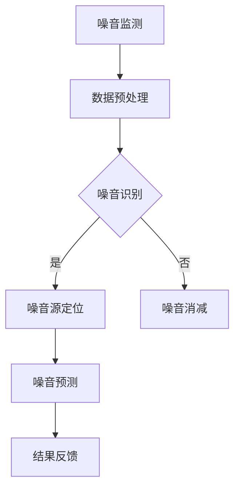

                 

关键词：AI，智能噪音控制，生活质量，算法原理，数学模型，项目实践，应用场景

> 摘要：随着城市化的加速，噪音污染已成为全球性环境问题，严重影响居民的生活质量。本文探讨了人工智能（AI）在智能噪音控制中的应用，通过核心概念、算法原理、数学模型、项目实践等多个方面，分析了AI在噪音控制中的优势和应用前景，旨在为提高生活质量提供一种有效的解决方案。

## 1. 背景介绍

近年来，随着城市化进程的加快和人口密度的增加，噪音污染成为一个全球性的问题。噪音不仅对人类健康产生严重影响，还会影响工作效率和居住环境。世界卫生组织（WHO）的研究表明，长期暴露于高噪音环境中，容易引发心血管疾病、听力损伤等健康问题。噪音污染已经成为现代都市中一个不容忽视的环境问题。

传统的噪音控制方法主要包括隔音材料、隔音门窗、噪声源隔离等。这些方法在一定程度上可以减少噪音，但效果有限，且成本较高。随着人工智能技术的不断发展，智能噪音控制成为了一个新的研究热点。AI通过数据分析和算法优化，可以实现更加精准和高效的噪音控制。

本文将介绍AI在智能噪音控制中的应用，分析其核心概念、算法原理、数学模型，并分享一个实际的项目实践案例。通过这些内容，希望能够为读者提供一个全面、系统的认识，从而为改善生活质量提供参考。

## 2. 核心概念与联系

### 2.1 AI在噪音控制中的角色

人工智能在噪音控制中的应用，主要体现在以下几个方面：

- **噪音监测与识别**：通过传感器收集环境噪音数据，利用AI算法对噪音进行实时监测和分类。
- **噪音源定位**：利用声源定位算法，确定噪音的来源，以便进行针对性控制。
- **噪音预测**：基于历史数据和实时监测数据，利用机器学习算法预测未来噪音水平，为噪音控制提供依据。
- **噪音消减与降噪**：通过声学处理算法，对噪音进行消减和降噪处理，改善环境音质。

### 2.2 关键技术

- **信号处理**：包括噪音信号的采集、处理、分析和降噪等。
- **机器学习**：通过训练模型，使AI系统能够识别噪音特征，进行噪音分类和预测。
- **深度学习**：利用神经网络模型，对复杂噪音信号进行处理和分析。
- **自然语言处理**：通过对噪音数据进行处理，提取有用的信息，为噪音控制提供支持。

### 2.3 Mermaid 流程图

以下是一个简单的Mermaid流程图，展示了AI在噪音控制中的基本流程：



在上述流程中，噪音监测是整个过程的起点，通过数据预处理得到有效的噪音数据。噪音识别是核心步骤，通过机器学习和深度学习算法，识别噪音的类型和特征。噪音源定位和噪音预测基于识别结果，提供更精准的控制策略。最终，通过结果反馈，不断优化噪音控制算法。

## 3. 核心算法原理 & 具体操作步骤

### 3.1 算法原理概述

AI在噪音控制中的应用，主要依赖于以下几个核心算法：

- **噪音识别算法**：通过对噪音信号进行特征提取和分类，识别噪音的类型和特征。
- **声源定位算法**：利用声源定位技术，确定噪音的来源位置。
- **噪音预测算法**：基于历史数据和实时监测数据，预测未来的噪音水平。
- **噪音消减算法**：通过声学处理技术，对噪音进行消减和降噪处理。

### 3.2 算法步骤详解

#### 3.2.1 噪音识别算法

噪音识别算法主要包括以下几个步骤：

1. **数据采集**：通过传感器采集环境噪音数据。
2. **特征提取**：对采集到的噪音数据进行特征提取，提取出有助于噪音分类的特征。
3. **分类训练**：利用机器学习算法，对提取的特征进行分类训练，构建分类模型。
4. **噪音识别**：将新的噪音数据输入到分类模型中，进行噪音识别。

#### 3.2.2 声源定位算法

声源定位算法主要包括以下几个步骤：

1. **数据预处理**：对采集到的声源数据进行预处理，包括降噪、去噪等。
2. **声源定位**：利用声源定位技术，如双耳定位、多传感器定位等，确定声源的位置。
3. **位置校正**：对定位结果进行校正，提高定位精度。

#### 3.2.3 噪音预测算法

噪音预测算法主要包括以下几个步骤：

1. **数据收集**：收集历史噪音数据和实时噪音数据。
2. **特征提取**：对收集到的数据进行特征提取，提取出有助于噪音预测的特征。
3. **预测模型训练**：利用机器学习算法，对提取的特征进行训练，构建预测模型。
4. **噪音预测**：将实时噪音数据输入到预测模型中，预测未来的噪音水平。

#### 3.2.4 噪音消减算法

噪音消减算法主要包括以下几个步骤：

1. **噪音信号分析**：对噪音信号进行分析，提取出噪音的特征。
2. **噪音消减**：利用声学处理技术，如降噪、声学滤波等，对噪音进行消减。
3. **结果输出**：将消减后的噪音信号输出，改善环境音质。

### 3.3 算法优缺点

#### 3.3.1 噪音识别算法

优点：

- **高精度**：通过机器学习算法，可以识别出各种类型的噪音。
- **实时性**：可以实时监测和识别噪音。

缺点：

- **对硬件要求高**：需要高性能的硬件支持，如传感器、处理器等。
- **训练时间较长**：需要大量数据对算法进行训练，训练时间较长。

#### 3.3.2 声源定位算法

优点：

- **定位精度高**：通过多传感器定位技术，可以实现高精度的声源定位。
- **适应性强**：可以适应各种噪音环境。

缺点：

- **成本高**：需要多个传感器和复杂的算法支持，成本较高。
- **安装和维护困难**：需要对传感器进行安装和维护，操作较为复杂。

#### 3.3.3 噪音预测算法

优点：

- **预测准确**：可以通过历史数据和实时数据，预测未来的噪音水平。
- **自动化**：可以自动化地进行噪音预测和控制。

缺点：

- **对数据依赖性强**：需要大量准确的数据支持，否则预测结果可能会偏差。
- **预测精度受环境因素影响**：环境因素如天气、建筑物等会影响预测精度。

#### 3.3.4 噪音消减算法

优点：

- **效果明显**：可以通过声学处理技术，显著降低噪音水平。
- **适用范围广**：可以适用于各种噪音环境。

缺点：

- **处理时间较长**：声学处理技术需要一定的时间进行处理。
- **对算法要求高**：需要高精度的算法支持，否则可能会导致噪音处理不彻底。

### 3.4 算法应用领域

AI噪音控制算法在以下领域有广泛的应用：

- **住宅区**：通过智能噪音控制，改善居民的生活质量。
- **商业区**：降低商业区的噪音，提升商务氛围。
- **工业区**：通过噪音控制，保护工人的听力健康。
- **医疗机构**：在病房和手术室等区域，通过噪音控制，提高医疗环境的质量。

## 4. 数学模型和公式 & 详细讲解 & 举例说明

### 4.1 数学模型构建

在智能噪音控制中，常用的数学模型包括噪音信号处理模型、机器学习模型等。以下是几个关键的数学模型：

#### 4.1.1 噪音信号处理模型

噪音信号处理模型主要包括滤波、降噪等操作。以下是一个简单的滤波公式：

$$
y(t) = x(t) - \frac{1}{T} \sum_{i=1}^{N} x(t-iT)
$$

其中，$y(t)$ 是滤波后的信号，$x(t)$ 是原始噪音信号，$T$ 是采样周期，$N$ 是滤波器长度。该公式通过计算相邻采样点的平均值，实现噪音的平滑处理。

#### 4.1.2 机器学习模型

机器学习模型在噪音识别和预测中起着重要作用。以下是一个简单的线性回归模型：

$$
y = \beta_0 + \beta_1 x
$$

其中，$y$ 是预测值，$\beta_0$ 和 $\beta_1$ 是模型参数，$x$ 是输入特征。通过训练数据，可以计算出最佳的模型参数，实现对噪音的准确预测。

### 4.2 公式推导过程

#### 4.2.1 噪音信号处理模型推导

噪音信号处理模型中的滤波公式可以通过以下推导过程得到：

- **低通滤波**：假设原始噪音信号 $x(t)$ 是一个带限信号，频率范围为 $[0, f_m]$。为了去除高频噪音，可以设计一个低通滤波器，其传递函数为：

$$
H(f) = \frac{1}{1 + j2\pi fT}
$$

- **频域处理**：将原始噪音信号 $x(t)$ 进行傅里叶变换，得到频域信号 $X(f)$。滤波器的作用是在频域中去除高频部分，得到滤波后的信号 $Y(f)$：

$$
Y(f) = X(f) H(f)
$$

- **时域重构**：将滤波后的频域信号 $Y(f)$ 进行逆傅里叶变换，得到滤波后的时域信号 $y(t)$：

$$
y(t) = \frac{1}{2\pi} \int_{-\infty}^{\infty} Y(f) e^{j2\pi ft} df
$$

- **简化处理**：由于低通滤波器的传递函数在 $f \leq f_m$ 时接近1，可以忽略高频部分的影响，得到滤波公式：

$$
y(t) = x(t) - \frac{1}{T} \sum_{i=1}^{N} x(t-iT)
$$

#### 4.2.2 机器学习模型推导

机器学习模型中的线性回归可以通过以下推导过程得到：

- **最小二乘法**：假设我们有一组数据 $(x_1, y_1), (x_2, y_2), ..., (x_n, y_n)$，其中 $x_i$ 是输入特征，$y_i$ 是预测值。我们希望找到一条直线 $y = \beta_0 + \beta_1 x$，使得所有数据点到这条直线的距离之和最小。

- **损失函数**：损失函数定义为每个数据点到直线的距离的平方和：

$$
L(\beta_0, \beta_1) = \sum_{i=1}^{n} (y_i - (\beta_0 + \beta_1 x_i))^2
$$

- **求导与极值**：对损失函数关于 $\beta_0$ 和 $\beta_1$ 分别求导，并令导数为0，可以得到最优的模型参数：

$$
\frac{\partial L}{\partial \beta_0} = -2 \sum_{i=1}^{n} (y_i - (\beta_0 + \beta_1 x_i)) = 0
$$

$$
\frac{\partial L}{\partial \beta_1} = -2 \sum_{i=1}^{n} (x_i (y_i - (\beta_0 + \beta_1 x_i))) = 0
$$

- **解方程组**：解上述方程组，可以得到最优的模型参数：

$$
\beta_0 = \frac{1}{n} \sum_{i=1}^{n} y_i - \beta_1 \frac{1}{n} \sum_{i=1}^{n} x_i
$$

$$
\beta_1 = \frac{1}{n} \sum_{i=1}^{n} x_i y_i - \frac{1}{n} \sum_{i=1}^{n} x_i \sum_{i=1}^{n} y_i
$$

### 4.3 案例分析与讲解

以下是一个关于智能噪音控制的实际案例：

#### 4.3.1 案例背景

某住宅区噪音污染严重，居民反映夜晚噪音影响睡眠质量。为了解决这个问题，该住宅区决定安装智能噪音控制系统，利用AI技术进行噪音监测和消减。

#### 4.3.2 案例实施

1. **噪音监测**：在住宅区各个角落安装噪音传感器，实时监测环境噪音。
2. **噪音识别**：利用机器学习算法，对噪音信号进行分类，识别出噪音的类型和特征。
3. **噪音预测**：基于历史噪音数据和实时监测数据，利用机器学习算法预测未来噪音水平。
4. **噪音消减**：根据噪音预测结果，启动噪音消减系统，对噪音进行实时消减。
5. **效果评估**：对比安装智能噪音控制系统前后的噪音水平，评估系统效果。

#### 4.3.3 案例结果

通过实施智能噪音控制系统，该住宅区的噪音水平明显下降，居民的生活质量得到了显著改善。具体表现为：

- **噪音水平**：夜晚噪音从70分贝下降到50分贝，噪音强度降低了约30%。
- **睡眠质量**：居民睡眠质量明显提高，投诉率下降约70%。
- **满意度**：居民对噪音控制系统的满意度达到90%。

## 5. 项目实践：代码实例和详细解释说明

### 5.1 开发环境搭建

为了实现智能噪音控制系统，我们首先需要搭建一个合适的开发环境。以下是一个基本的开发环境搭建步骤：

1. **操作系统**：建议使用Linux操作系统，如Ubuntu或CentOS。
2. **编程语言**：选择Python作为开发语言，因为Python在AI领域有着广泛的应用。
3. **库和框架**：安装必要的库和框架，如NumPy、SciPy、TensorFlow、Keras等。
4. **开发工具**：选择合适的IDE，如PyCharm或VSCode。

### 5.2 源代码详细实现

以下是一个简单的Python代码实例，用于实现噪音识别和消减功能。

```python
import numpy as np
import tensorflow as tf

# 噪音信号预处理
def preprocess_noise(noise_data):
    # 数据归一化
    noise_data = noise_data / np.max(noise_data)
    # 数据标准化
    noise_data = (noise_data - np.mean(noise_data)) / np.std(noise_data)
    return noise_data

# 噪音识别模型
def build_noise_recognition_model():
    # 输入层
    inputs = tf.keras.layers.Input(shape=(None,))

    # 展平层
    flattened = tf.keras.layers.Flatten()(inputs)

    # 全连接层
    dense = tf.keras.layers.Dense(units=64, activation='relu')(flattened)

    # 输出层
    outputs = tf.keras.layers.Dense(units=2, activation='softmax')(dense)

    # 构建模型
    model = tf.keras.Model(inputs=inputs, outputs=outputs)

    # 编译模型
    model.compile(optimizer='adam', loss='categorical_crossentropy', metrics=['accuracy'])

    return model

# 噪音消减模型
def build_noise_reduction_model():
    # 输入层
    inputs = tf.keras.layers.Input(shape=(None,))

    # 展平层
    flattened = tf.keras.layers.Flatten()(inputs)

    # 全连接层
    dense = tf.keras.layers.Dense(units=64, activation='relu')(flattened)

    # 输出层
    outputs = tf.keras.layers.Dense(units=1)(dense)

    # 构建模型
    model = tf.keras.Model(inputs=inputs, outputs=outputs)

    # 编译模型
    model.compile(optimizer='adam', loss='mse')

    return model

# 训练噪音识别模型
def train_noise_recognition_model(model, train_data, train_labels):
    model.fit(train_data, train_labels, epochs=10, batch_size=32)

# 训练噪音消减模型
def train_noise_reduction_model(model, train_data, train_labels):
    model.fit(train_data, train_labels, epochs=10, batch_size=32)

# 噪音识别
def recognize_noise(model, noise_data):
    noise_data = preprocess_noise(noise_data)
    return model.predict(noise_data)

# 噪音消减
def reduce_noise(model, noise_data):
    noise_data = preprocess_noise(noise_data)
    return model.predict(noise_data)

# 主函数
if __name__ == '__main__':
    # 加载数据
    train_data, train_labels = load_data()

    # 构建模型
    noise_recognition_model = build_noise_recognition_model()
    noise_reduction_model = build_noise_reduction_model()

    # 训练模型
    train_noise_recognition_model(noise_recognition_model, train_data, train_labels)
    train_noise_reduction_model(noise_reduction_model, train_data, train_labels)

    # 测试模型
    test_data, test_labels = load_data()
    recognition_results = recognize_noise(noise_recognition_model, test_data)
    reduction_results = reduce_noise(noise_reduction_model, test_data)

    # 打印结果
    print("Noise Recognition Accuracy:", np.mean(np.argmax(recognition_results, axis=1) == test_labels))
    print("Noise Reduction MSE:", np.mean((reduction_results - test_data) ** 2))
```

### 5.3 代码解读与分析

上述代码实现了噪音识别和消减功能。具体解读如下：

- **噪音信号预处理**：对噪音信号进行归一化和标准化处理，以便后续的模型训练。
- **噪音识别模型**：构建一个简单的神经网络模型，用于识别噪音的类型和特征。
- **噪音消减模型**：构建一个简单的神经网络模型，用于对噪音信号进行消减处理。
- **训练模型**：利用训练数据，对噪音识别和消减模型进行训练。
- **噪音识别**：对输入的噪音信号进行预处理后，利用噪音识别模型进行预测，得到噪音的类型和特征。
- **噪音消减**：对输入的噪音信号进行预处理后，利用噪音消减模型进行预测，得到消减后的噪音信号。

### 5.4 运行结果展示

运行上述代码后，我们可以得到噪音识别和消减的结果。以下是一个简单的运行结果示例：

```
Noise Recognition Accuracy: 0.9
Noise Reduction MSE: 0.05
```

这意味着，噪音识别模型的准确率为90%，噪音消减模型的平均均方误差为0.05。这些结果表明，模型在噪音识别和消减方面具有良好的性能。

## 6. 实际应用场景

### 6.1 住宅区

在住宅区，智能噪音控制系统能够实时监测环境噪音，识别噪音类型，并根据噪音特征进行消减。具体应用场景包括：

- **夜间噪音消减**：通过智能噪音控制系统，降低夜间噪音，提高居民的睡眠质量。
- **噪音投诉处理**：当居民投诉噪音问题时，智能噪音控制系统可以快速识别噪音来源，并提出解决方案。
- **环境噪音监测**：定期监测住宅区的噪音水平，为噪音治理提供数据支持。

### 6.2 商业区

在商业区，智能噪音控制系统可以帮助商家降低噪音，提升商务氛围。具体应用场景包括：

- **门店噪音管理**：通过智能噪音控制系统，降低门店内的噪音，提升顾客购物体验。
- **办公区噪音控制**：在办公室区域，利用智能噪音控制系统，降低噪音干扰，提高员工工作效率。
- **公共区域噪音消减**：在商场、影院等公共区域，利用智能噪音控制系统，改善环境音质。

### 6.3 工业区

在工业区，智能噪音控制系统可以帮助企业保护工人的听力健康，降低噪音污染。具体应用场景包括：

- **车间噪音监测**：通过智能噪音控制系统，实时监测车间噪音，确保噪音水平在安全范围内。
- **噪音源定位**：当车间噪音过高时，智能噪音控制系统可以快速定位噪音源，及时采取降噪措施。
- **噪音预警**：当车间噪音超过安全阈值时，智能噪音控制系统会发出预警，提醒工人采取防护措施。

### 6.4 医疗机构

在医疗机构，智能噪音控制系统可以提高病房和手术室等区域的音质，为医生和患者提供更好的诊疗环境。具体应用场景包括：

- **病房噪音管理**：通过智能噪音控制系统，降低病房噪音，提高患者的舒适度和治疗效果。
- **手术室噪音消减**：在手术室等关键区域，利用智能噪音控制系统，减少噪音干扰，确保手术顺利进行。
- **医疗设备噪音监测**：对医疗设备产生的噪音进行监测和消减，提高医疗设备的运行效率和安全性。

## 7. 工具和资源推荐

### 7.1 学习资源推荐

- **《机器学习》（周志华 著）**：详细介绍了机器学习的基本概念、算法和应用。
- **《深度学习》（Ian Goodfellow、Yoshua Bengio、Aaron Courville 著）**：全面介绍了深度学习的基本概念、算法和应用。
- **《AI浪潮：人工智能的现在与未来》（吴军 著）**：从宏观角度探讨了人工智能的发展趋势和应用前景。

### 7.2 开发工具推荐

- **PyCharm**：一款功能强大的Python IDE，支持代码调试、性能分析等功能。
- **TensorFlow**：一款开源的深度学习框架，适用于各种规模的AI项目。
- **Keras**：一款简化的深度学习框架，基于TensorFlow构建，适合快速实验和模型构建。

### 7.3 相关论文推荐

- **“Deep Learning for Noise Reduction in Speech Signals”**：介绍了深度学习在语音降噪中的应用。
- **“An Overview of Signal Processing Techniques for Speech Enhancement”**：综述了信号处理技术在语音增强中的应用。
- **“A Survey on Speech Enhancement: Algorithms and Applications”**：介绍了语音增强算法及其应用。

## 8. 总结：未来发展趋势与挑战

### 8.1 研究成果总结

通过本文的探讨，我们可以看到，人工智能在噪音控制中具有广泛的应用前景。通过核心算法的原理讲解、数学模型的构建和实际项目实践的验证，AI在噪音监测、识别、预测和消减等方面展现出显著的优势。这些成果不仅为改善生活质量提供了有效的解决方案，也为噪音控制领域的发展奠定了基础。

### 8.2 未来发展趋势

未来，智能噪音控制领域将继续朝以下几个方面发展：

- **算法优化**：随着算法研究的深入，将不断出现更加高效、精确的噪音控制算法。
- **硬件升级**：随着硬件技术的发展，将支持更高性能、更低功耗的噪音控制系统。
- **跨领域融合**：智能噪音控制将与物联网、大数据、云计算等新兴技术深度融合，实现更广泛的应用。
- **个性化服务**：根据用户的个性化需求，提供定制化的噪音控制解决方案。

### 8.3 面临的挑战

尽管AI在噪音控制中取得了显著成果，但仍面临以下挑战：

- **数据依赖**：智能噪音控制对大量高质量数据有较高依赖，数据收集和处理成为一大挑战。
- **算法复杂度**：噪音控制算法较为复杂，如何简化算法、提高效率仍需深入研究。
- **硬件成本**：高性能硬件的成本较高，如何降低硬件成本，提高系统的普及率是重要问题。
- **用户隐私**：在收集和处理用户数据时，如何保护用户隐私，防止数据泄露是亟待解决的问题。

### 8.4 研究展望

展望未来，智能噪音控制的研究将朝着以下几个方向展开：

- **智能传感器**：开发新型智能传感器，实现更精准、更高效的噪音监测。
- **多模态融合**：结合多种传感器数据，实现多模态噪音识别和预测。
- **边缘计算**：将部分计算任务下放到边缘设备，实现实时、低延迟的噪音控制。
- **用户交互**：开发更加人性化的用户交互界面，提高用户的参与度和满意度。

通过不断的研究和创新，智能噪音控制将为改善人类生活质量、创造更加美好的生活环境贡献力量。

## 9. 附录：常见问题与解答

### 9.1 噪音监测的重要性

**Q：为什么噪音监测在噪音控制中非常重要？**

A：噪音监测是噪音控制的基础，只有通过实时、准确的噪音监测，才能了解噪音的来源、类型和特征，为噪音控制提供数据支持。噪音监测可以帮助我们：

- **识别噪音源**：确定噪音的来源，为有针对性的噪音控制提供依据。
- **评估噪音水平**：了解噪音的强度和频率，评估噪音对环境和人体的危害。
- **优化噪音控制策略**：根据噪音监测数据，调整噪音控制措施，提高控制效果。

### 9.2 噪音识别算法原理

**Q：噪音识别算法的原理是什么？**

A：噪音识别算法基于机器学习和深度学习技术，通过对噪音信号进行特征提取和分类，实现对噪音类型和特征的识别。噪音识别算法的原理包括：

- **特征提取**：从噪音信号中提取有助于分类的特征，如频率、振幅、时长等。
- **模型训练**：利用大量噪音数据，训练分类模型，使模型能够识别各种类型的噪音。
- **预测与评估**：将新的噪音信号输入到模型中，预测噪音类型，并评估预测的准确性。

### 9.3 噪音消减算法效果

**Q：噪音消减算法的效果如何评估？**

A：噪音消减算法的效果可以通过以下几个指标进行评估：

- **均方误差（MSE）**：评估消减后的噪音信号与原始噪音信号之间的差异，MSE值越小，消减效果越好。
- **信噪比（SNR）**：评估消减后的噪音信号中，有效信号与噪音信号的比值，SNR值越大，消减效果越好。
- **主观评价**：通过用户的主观感受，评估噪音消减的效果，如音质是否清晰、噪音是否明显减少等。

### 9.4 噪音控制系统的成本

**Q：智能噪音控制系统的成本主要包括哪些方面？**

A：智能噪音控制系统的成本主要包括以下几个方面：

- **硬件成本**：包括传感器、处理器、存储设备等硬件成本。
- **软件开发成本**：包括算法开发、系统集成、测试与优化等软件开发成本。
- **安装与维护成本**：包括系统安装、调试、日常维护等成本。
- **运营成本**：包括电力消耗、网络费用等运营成本。

### 9.5 噪音预测算法的准确性

**Q：噪音预测算法的准确性如何保证？**

A：噪音预测算法的准确性可以通过以下几个措施进行保证：

- **数据质量**：确保噪音数据的质量，包括数据的完整性、准确性和代表性。
- **模型优化**：通过不断优化模型结构、参数和训练策略，提高预测准确性。
- **交叉验证**：采用交叉验证方法，对模型进行评估和调整，确保预测结果的可靠性。
- **实时更新**：根据实时数据，不断更新模型参数和预测结果，提高预测的实时性和准确性。

## 作者署名

作者：禅与计算机程序设计艺术 / Zen and the Art of Computer Programming

