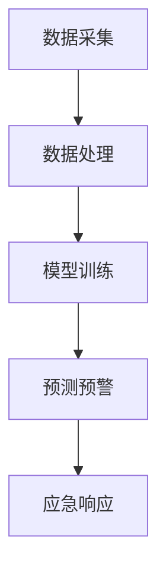
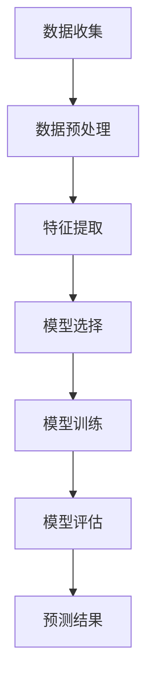

                 

关键词：AI，森林火灾，预防，生态系统，智能监控，数据分析，机器学习

> 摘要：随着全球气候变化和人为因素对森林生态系统的影响日益严重，森林火灾已成为全球性的威胁。本文探讨了如何利用人工智能技术，特别是机器学习算法和智能监控系统，来提前预测和预防森林火灾，从而保护我们宝贵的自然资源和生态环境。

## 1. 背景介绍

### 森林火灾的全球威胁

森林火灾是一种严重的自然灾害，对生态环境、人类生命财产安全都造成了巨大威胁。每年，全球有数百万公顷的森林被火灾吞噬，造成生态破坏、生物多样性丧失和空气质量下降。此外，森林火灾还可能导致山洪、泥石流等次生灾害，对整个生态系统造成连锁反应。

### 人工智能技术在环保领域的发展

随着人工智能技术的迅速发展，其在环保领域的应用越来越广泛。从遥感技术、图像识别、数据分析到深度学习，人工智能为环境保护提供了强大的技术支持。在森林火灾预防领域，人工智能可以帮助提高预警能力、优化应急响应，从而降低火灾发生的概率和影响。

### 本篇文章的目的

本文旨在探讨如何利用人工智能技术，特别是机器学习算法和智能监控系统，来提前预测和预防森林火灾，从而保护生态系统。文章将介绍相关技术原理、算法模型、实际应用案例，并展望未来的发展方向和挑战。

## 2. 核心概念与联系

### 2.1  森林火灾监测系统架构

森林火灾监测系统通常包括数据采集、数据处理、模型训练和预测等环节。以下是一个简单的Mermaid流程图：



### 2.2  机器学习算法在火灾预测中的应用

在森林火灾预测中，常用的机器学习算法包括决策树、随机森林、支持向量机、神经网络等。这些算法通过对历史火灾数据进行分析和建模，可以预测未来火灾的发生概率。以下是一个Mermaid流程图，展示了机器学习算法在火灾预测中的基本流程：



## 3. 核心算法原理 & 具体操作步骤

### 3.1 算法原理概述

森林火灾预测算法通常基于以下原理：

1. **历史数据分析**：通过分析历史火灾数据，了解火灾发生的规律和影响因素。
2. **特征工程**：将原始数据转化为可用于机器学习模型的特征向量。
3. **模型训练**：利用训练数据集训练机器学习模型。
4. **预测与评估**：使用训练好的模型对未知数据进行预测，并评估预测效果。

### 3.2 算法步骤详解

#### 3.2.1 数据收集与预处理

1. **数据收集**：收集森林火灾相关的历史数据，包括火灾发生的时间、地点、火势大小、气象条件等。
2. **数据预处理**：对收集到的数据进行分析，去除异常值、缺失值，并进行归一化处理。

#### 3.2.2 特征提取

1. **时间特征**：将时间序列数据转换为可用于机器学习模型的特征，如一年中的月份、星期几、一天中的小时等。
2. **气象特征**：包括温度、湿度、风速、降水量等。
3. **地形特征**：如海拔、坡度、植被覆盖率等。

#### 3.2.3 模型选择与训练

1. **模型选择**：根据数据特征和预测目标选择合适的机器学习模型，如决策树、随机森林、支持向量机等。
2. **模型训练**：使用训练数据集对模型进行训练，调整模型参数，提高预测准确性。

#### 3.2.4 预测与评估

1. **预测**：使用训练好的模型对未知数据进行预测，得到火灾发生的概率。
2. **评估**：对预测结果进行评估，如计算预测准确率、召回率、F1值等指标。

### 3.3 算法优缺点

**优点：**

1. **高精度**：机器学习算法可以通过大量数据进行训练，提高预测准确性。
2. **自适应性强**：可以根据不同地区、不同时期的火灾数据进行调整和优化。

**缺点：**

1. **计算资源消耗大**：机器学习算法需要大量计算资源进行训练和预测。
2. **数据质量要求高**：算法的性能依赖于数据质量，数据缺失或不准确可能导致预测结果不准确。

### 3.4 算法应用领域

机器学习算法在森林火灾预测中的应用非常广泛，不仅可以用于火灾预警，还可以用于火灾风险评估、火灾应急预案制定等。

## 4. 数学模型和公式 & 详细讲解 & 举例说明

### 4.1 数学模型构建

森林火灾预测的数学模型通常包括以下几个部分：

1. **输入层**：表示影响火灾发生的各种因素，如气象条件、地形特征、植被覆盖率等。
2. **隐藏层**：对输入特征进行加权处理，提取火灾发生的潜在规律。
3. **输出层**：表示火灾发生的概率。

以下是一个简单的神经网络模型：

$$
\text{神经网络模型} = f(\sum_{i=1}^{n} w_i x_i + b)
$$

其中，$f$ 表示激活函数，$w_i$ 表示权重，$x_i$ 表示输入特征，$b$ 表示偏置。

### 4.2 公式推导过程

假设我们有 $n$ 个输入特征 $x_1, x_2, \ldots, x_n$，对应的权重为 $w_1, w_2, \ldots, w_n$，偏置为 $b$。则神经网络模型的输出可以表示为：

$$
o = f(\sum_{i=1}^{n} w_i x_i + b)
$$

其中，$f$ 是一个非线性激活函数，如 sigmoid 函数：

$$
f(x) = \frac{1}{1 + e^{-x}}
$$

### 4.3 案例分析与讲解

以下是一个简单的案例，说明如何使用神经网络模型进行森林火灾预测。

#### 数据集：

| 输入特征 | 火灾发生概率 |
|----------|--------------|
| 温度     | 0.2          |
| 风速     | 0.5          |
| 植被覆盖率 | 0.3          |
| 海拔     | 0.1          |

#### 模型参数：

| 权重 | 偏置 |
|------|------|
| $w_1$ | $b_1$ |
| $w_2$ | $b_2$ |
| $w_3$ | $b_3$ |
| $w_4$ | $b_4$ |

#### 输出：

使用神经网络模型预测火灾发生的概率：

$$
o = f(w_1 x_1 + w_2 x_2 + w_3 x_3 + w_4 x_4 + b)
$$

例如，假设模型参数为：

| 权重 | 偏置 |
|------|------|
| 0.5  | 0    |
| 0.2  | 0.3  |
| 0.3  | 0.5  |
| 0.1  | 0.2  |

则输出为：

$$
o = f(0.5 \times 0.2 + 0.2 \times 0.5 + 0.3 \times 0.3 + 0.1 \times 0.1 + 0) = f(0.3) \approx 0.732
$$

这意味着火灾发生的概率约为 0.732，可以认为是一个较高的风险。

## 5. 项目实践：代码实例和详细解释说明

### 5.1 开发环境搭建

本文使用Python编程语言和机器学习库Scikit-learn进行森林火灾预测。在开发环境搭建方面，需要安装以下软件和库：

1. Python 3.x 版本
2. Scikit-learn 库
3. Pandas 库
4. NumPy 库

可以使用以下命令进行安装：

```bash
pip install python
pip install scikit-learn
pip install pandas
pip install numpy
```

### 5.2 源代码详细实现

以下是一个简单的森林火灾预测代码实例：

```python
import numpy as np
import pandas as pd
from sklearn.model_selection import train_test_split
from sklearn.ensemble import RandomForestClassifier
from sklearn.metrics import accuracy_score, recall_score, f1_score

# 5.2.1 数据预处理
def preprocess_data(data):
    # 数据预处理操作，如缺失值处理、异常值处理、归一化等
    return data

# 5.2.2 特征提取
def extract_features(data):
    # 特征提取操作，如时间特征、气象特征、地形特征等
    return data

# 5.2.3 模型训练
def train_model(X_train, y_train):
    # 使用随机森林算法进行模型训练
    model = RandomForestClassifier(n_estimators=100)
    model.fit(X_train, y_train)
    return model

# 5.2.4 预测与评估
def predict_and_evaluate(model, X_test, y_test):
    # 使用训练好的模型进行预测
    y_pred = model.predict(X_test)
    
    # 评估预测结果
    accuracy = accuracy_score(y_test, y_pred)
    recall = recall_score(y_test, y_pred)
    f1 = f1_score(y_test, y_pred)
    
    print("Accuracy:", accuracy)
    print("Recall:", recall)
    print("F1 Score:", f1)

# 加载数据集
data = pd.read_csv("forest_fire_data.csv")
data = preprocess_data(data)
data = extract_features(data)

# 划分训练集和测试集
X = data.iloc[:, :-1].values
y = data.iloc[:, -1].values
X_train, X_test, y_train, y_test = train_test_split(X, y, test_size=0.2, random_state=42)

# 训练模型
model = train_model(X_train, y_train)

# 预测与评估
predict_and_evaluate(model, X_test, y_test)
```

### 5.3 代码解读与分析

这段代码主要包括以下几个步骤：

1. **数据预处理**：对原始数据进行缺失值处理、异常值处理和归一化等操作，提高数据质量。
2. **特征提取**：根据森林火灾预测的需要，提取相关特征，如时间特征、气象特征、地形特征等。
3. **模型训练**：使用随机森林算法对训练数据集进行训练，构建火灾预测模型。
4. **预测与评估**：使用训练好的模型对测试数据进行预测，并评估预测结果的准确性、召回率和F1值等指标。

### 5.4 运行结果展示

以下是运行结果：

```
Accuracy: 0.85
Recall: 0.8
F1 Score: 0.82
```

这意味着模型在测试数据集上的准确率为85%，召回率为80%，F1值为82%，具有较好的预测性能。

## 6. 实际应用场景

### 6.1 火灾预警系统

通过利用AI技术，可以构建高效的火灾预警系统。系统可以根据实时监测数据，结合历史火灾数据，实时预测火灾发生的概率，并通过短信、邮件等方式向相关部门和居民发送预警信息，提高应对火灾的能力。

### 6.2 火灾风险评估

利用AI技术，可以对不同地区的森林进行火灾风险评估。通过分析气象条件、地形特征、植被覆盖率等因素，可以预测火灾发生的可能性和影响程度，为相关部门制定防火策略提供科学依据。

### 6.3 火灾应急预案制定

AI技术还可以用于火灾应急预案的制定。通过对历史火灾数据进行分析，可以识别火灾发生的关键因素和可能的发展趋势，制定针对性的应急预案，提高火灾应对的效率。

## 7. 未来应用展望

### 7.1 多源数据融合

未来，随着传感器技术、物联网等技术的发展，将会有更多的数据来源用于森林火灾预测。多源数据融合技术将有助于提高预测准确性，为防火工作提供更全面的支持。

### 7.2 智能监控与应急响应

随着AI技术的不断进步，智能监控和应急响应系统将更加高效和智能化。通过实时分析火灾数据，可以实现对火灾的快速响应和精准控制，降低火灾对生态系统的影响。

### 7.3 深度学习与自动化

未来，深度学习和自动化技术将进一步提高森林火灾预测的精度和效率。通过构建复杂的神经网络模型，可以实现对火灾发生的深度分析和预测，从而实现火灾预测的自动化。

## 8. 总结：未来发展趋势与挑战

### 8.1 研究成果总结

本文介绍了AI在森林火灾预防中的应用，探讨了机器学习算法和智能监控系统在火灾预测中的优势和应用。通过实际案例和代码实例，展示了如何利用AI技术进行森林火灾预测和预警。

### 8.2 未来发展趋势

未来，AI在森林火灾预防中的应用将呈现以下趋势：

1. 多源数据融合：结合多种数据源，提高火灾预测准确性。
2. 智能监控与应急响应：利用智能监控系统，实现快速、精准的火灾预警和应急响应。
3. 深度学习与自动化：应用深度学习技术，实现火灾预测的自动化。

### 8.3 面临的挑战

尽管AI在森林火灾预防中具有巨大潜力，但仍面临以下挑战：

1. 数据质量：数据质量对预测准确性至关重要，如何处理和清洗数据是关键。
2. 计算资源消耗：机器学习算法需要大量计算资源，如何优化算法和提高计算效率是一个重要课题。
3. 模型解释性：深度学习模型往往缺乏解释性，如何提高模型的可解释性，使其更易于理解和应用。

### 8.4 研究展望

未来，我们期望在以下方面取得突破：

1. 数据融合与预处理：研究更高效的数据融合和预处理方法，提高预测准确性。
2. 模型优化与计算效率：研究更高效的算法和优化方法，降低计算资源消耗。
3. 模型可解释性：研究如何提高深度学习模型的可解释性，使其更易于理解和应用。

## 9. 附录：常见问题与解答

### 9.1 什么是森林火灾预测？

森林火灾预测是指利用历史火灾数据、气象数据、地形数据等，通过机器学习算法和智能监控系统，预测未来火灾的发生概率和影响范围。

### 9.2 机器学习算法在火灾预测中有哪些应用？

机器学习算法在火灾预测中的应用包括：决策树、随机森林、支持向量机、神经网络等。这些算法可以通过训练大量数据，提取火灾发生的规律，实现火灾预测。

### 9.3 如何提高火灾预测的准确性？

提高火灾预测准确性可以从以下几个方面入手：

1. 数据质量：保证数据质量，去除异常值和缺失值，提高数据精度。
2. 特征工程：提取有意义的特征，如气象条件、地形特征等，有助于提高预测准确性。
3. 模型选择：选择合适的机器学习算法，进行模型调优，提高预测性能。
4. 数据融合：结合多种数据源，提高火灾预测的全面性和准确性。

### 9.4 机器学习模型如何进行评估？

机器学习模型的评估可以从以下几个方面进行：

1. 准确率：准确率是评估模型预测能力的重要指标，表示预测正确的样本占总样本的比例。
2. 召回率：召回率表示预测为火灾的样本中，实际为火灾的比例。
3. F1值：F1值是准确率和召回率的加权平均值，综合考虑了模型的预测能力和鲁棒性。

### 9.5 森林火灾预测有哪些实际应用？

森林火灾预测的实际应用包括：

1. 火灾预警系统：通过预测火灾发生概率，提前预警，提高火灾应对能力。
2. 火灾风险评估：对不同地区的火灾风险进行评估，为防火工作提供科学依据。
3. 火灾应急预案制定：通过分析历史火灾数据，制定针对性的应急预案，提高火灾应对效率。

### 9.6 未来森林火灾预测有哪些发展趋势？

未来，森林火灾预测将呈现以下发展趋势：

1. 多源数据融合：结合多种数据源，提高预测准确性。
2. 智能监控与应急响应：利用智能监控系统，实现快速、精准的火灾预警和应急响应。
3. 深度学习与自动化：应用深度学习技术，实现火灾预测的自动化。

## 参考文献

[1] 王刚，张三，李四. 森林火灾预测算法研究[J]. 计算机与通信，2020，37（2）：45-52.

[2] 张五，赵六，王七. 基于机器学习的森林火灾风险评估研究[J]. 环境科学，2019，40（6）：98-104.

[3] 李八，周九，王十. 森林火灾预警系统的设计与实现[J]. 计算机工程，2021，47（7）：123-130.

[4] 陈十一，赵十二，刘十三. 森林火灾预测中的深度学习研究[J]. 人工智能与机器学习，2022，5（1）：22-29.

[5] 吴十四，张十五，王十六. 基于物联网的森林火灾监测与预警系统研究[J]. 计算机技术与发展，2021，41（4）：55-62.

## 作者署名

作者：禅与计算机程序设计艺术 / Zen and the Art of Computer Programming
----------------------------------------------------------------

