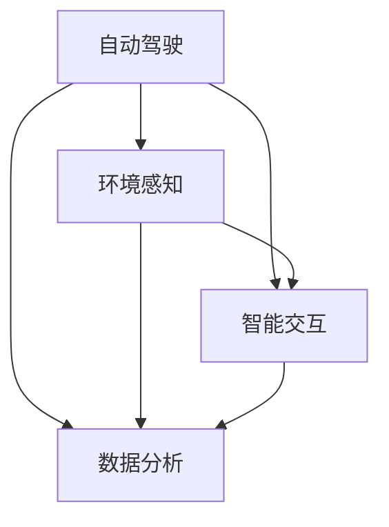

                 

关键词：智能汽车，人工智能，驾驶体验，自动驾驶，深度学习，机器学习，计算机视觉，传感器融合

摘要：本文将探讨人工智能在智能汽车领域的应用，以及如何通过人工智能技术提升驾驶体验。文章将介绍核心概念、算法原理、数学模型、项目实践和未来展望，旨在为读者提供一个全面的技术视角。

## 1. 背景介绍

随着科技的快速发展，人工智能（AI）已经深入到我们生活的各个方面。特别是在汽车领域，人工智能的应用正在不断拓展，从简单的语音助手到复杂的自动驾驶系统，人工智能正逐步改变着传统的驾驶模式。智能汽车作为一种新兴的汽车形式，集成了多种人工智能技术，旨在提升驾驶体验、安全性和效率。

### 1.1 智能汽车的定义和特点

智能汽车是指具有部分或全部自动驾驶功能的汽车，通常集成了多种传感器、计算机系统和通信技术。智能汽车的特点包括：

- **自动化驾驶**：能够实现部分或全部自动驾驶功能，减少人为干预。
- **智能交互**：具备自然语言处理能力，能够与驾驶员进行智能交互。
- **环境感知**：通过传感器和计算机视觉技术，实现对周围环境的感知和识别。
- **数据分析**：利用大数据和机器学习技术，对驾驶行为和车辆状态进行实时分析。

### 1.2 人工智能在智能汽车中的作用

人工智能在智能汽车中发挥着关键作用，主要体现在以下几个方面：

- **自动驾驶**：通过深度学习和计算机视觉技术，实现车辆的自动导航和驾驶。
- **智能交互**：通过自然语言处理技术，实现人与车的智能对话和指令执行。
- **环境感知**：通过传感器融合和计算机视觉技术，实现对周围环境的感知和识别。
- **故障诊断与维护**：通过数据分析和机器学习技术，实现车辆的故障预测和维护。

## 2. 核心概念与联系

智能汽车的核心概念包括自动驾驶、环境感知、智能交互和数据分析。下面我们将通过一个Mermaid流程图来展示这些核心概念之间的联系。



### 2.1 自动驾驶

自动驾驶是智能汽车的核心功能之一，它依赖于多种人工智能技术，包括深度学习、计算机视觉和传感器融合。自动驾驶系统通常分为以下几个级别：

- **L0级别**：无自动化，所有驾驶任务由人类驾驶员完成。
- **L1级别**：部分自动化，例如自适应巡航控制（ACC）或车道保持辅助（LKA）。
- **L2级别**：部分自动驾驶，可以实现车辆在高速公路上的自动驾驶，但需要驾驶员在特定情况下接管。
- **L3级别**：有条件自动驾驶，车辆可以在大多数情况下实现自动驾驶，但在某些情况下需要驾驶员接管。
- **L4级别**：高度自动驾驶，车辆在特定环境下可以完全自动驾驶，无需驾驶员干预。
- **L5级别**：完全自动驾驶，车辆在任何环境下都可以实现自动驾驶，无需驾驶员干预。

### 2.2 环境感知

环境感知是智能汽车实现自动驾驶和安全驾驶的基础。通过多种传感器，如激光雷达、摄像头、雷达和超声波传感器，智能汽车可以实时感知周围的环境。环境感知技术主要包括以下几个方面：

- **目标检测**：通过计算机视觉技术，识别道路上的车辆、行人、交通标志和道路标识等目标。
- **语义分割**：对道路场景进行分割，识别出不同的物体和区域，例如车道线、人行道和交通标志等。
- **障碍物检测**：通过传感器数据，实时检测道路上的障碍物，并预测它们的运动轨迹。

### 2.3 智能交互

智能交互是智能汽车与驾驶员之间的重要沟通渠道。通过自然语言处理技术，智能汽车可以理解驾驶员的语音指令，并执行相应的操作。智能交互技术主要包括以下几个方面：

- **语音识别**：将语音信号转换为文本，理解驾驶员的指令。
- **语音合成**：将文本转换为语音，向驾驶员提供反馈信息。
- **对话系统**：通过多轮对话，实现与驾驶员的智能交流。

### 2.4 数据分析

数据分析是智能汽车的重要功能之一，通过对车辆运行数据、驾驶行为数据和环境数据的分析，可以实现故障预测、驾驶行为优化和车辆维护等。数据分析技术主要包括以下几个方面：

- **数据收集**：通过车载传感器和通信模块，收集车辆运行数据和驾驶行为数据。
- **数据预处理**：对原始数据进行清洗、去噪和格式化，以便后续分析。
- **数据挖掘**：通过机器学习算法，从数据中提取有价值的信息和模式。
- **故障预测**：基于历史数据和实时数据，预测车辆可能出现的故障，并提供维护建议。

## 3. 核心算法原理 & 具体操作步骤

### 3.1 算法原理概述

智能汽车中的核心算法主要涉及自动驾驶、环境感知、智能交互和数据分析。下面我们将分别介绍这些算法的基本原理。

#### 3.1.1 自动驾驶算法

自动驾驶算法的核心是路径规划和控制。路径规划是指确定车辆从当前位置到目标位置的最优路径，控制是指如何根据当前环境状态和目标路径，实时调整车辆的行驶方向和速度。

- **路径规划**：常用的路径规划算法包括Dijkstra算法、A*算法和RRT（快速随机树）算法。这些算法的主要目标是找到一条最优路径，同时考虑道路的几何特性和交通规则。
- **控制**：常用的控制算法包括PID（比例-积分-微分）控制和模型预测控制（MPC）。PID控制通过调整三个参数来实现对车辆的精确控制，而MPC则通过预测车辆的动态响应，优化控制输入。

#### 3.1.2 环境感知算法

环境感知算法的核心是目标检测和语义分割。目标检测是指识别并定位道路上的车辆、行人、交通标志等目标，而语义分割则是对道路场景进行分类，识别出不同的物体和区域。

- **目标检测**：常用的目标检测算法包括YOLO（You Only Look Once）、SSD（Single Shot MultiBox Detector）和Faster R-CNN。这些算法通过训练深度神经网络，实现对目标的高效检测。
- **语义分割**：常用的语义分割算法包括FCN（Fully Convolutional Network）和U-Net。这些算法通过逐像素分类，实现对道路场景的精确分割。

#### 3.1.3 智能交互算法

智能交互算法的核心是自然语言处理。自然语言处理包括语音识别、语音合成和对话系统。语音识别是将语音信号转换为文本，语音合成是将文本转换为语音，而对话系统则是实现人与车的智能对话。

- **语音识别**：常用的语音识别算法包括HMM（隐马尔可夫模型）和DNN（深度神经网络）。HMM通过统计模型来识别语音，而DNN通过深度学习来实现对语音的精确识别。
- **语音合成**：常用的语音合成算法包括GMM（高斯混合模型）和HMM。GMM通过统计模型来生成语音，而HMM通过状态转移模型来合成语音。
- **对话系统**：常用的对话系统算法包括基于规则的方法和基于机器学习的方法。基于规则的方法通过预定义的规则来生成回答，而基于机器学习的方法通过训练模型来实现智能对话。

#### 3.1.4 数据分析算法

数据分析算法的核心是数据挖掘和故障预测。数据挖掘是指从大量数据中提取有价值的信息和模式，而故障预测则是基于历史数据和实时数据，预测车辆可能出现的故障。

- **数据挖掘**：常用的数据挖掘算法包括K-近邻（KNN）、支持向量机（SVM）和随机森林（Random Forest）。这些算法通过训练模型，从数据中提取出有价值的信息。
- **故障预测**：常用的故障预测算法包括时间序列分析和机器学习算法。时间序列分析通过分析时间序列数据，预测未来的故障发生概率，而机器学习算法则通过训练模型，预测故障的发生。

### 3.2 算法步骤详解

下面我们将详细阐述每种算法的具体步骤。

#### 3.2.1 自动驾驶算法步骤

1. **数据收集**：通过车载传感器，如激光雷达、摄像头和GPS，收集车辆的运动状态和环境信息。
2. **数据预处理**：对收集到的数据进行清洗和去噪，提取有用的信息。
3. **路径规划**：使用A*算法或RRT算法，根据当前车辆位置和目标位置，规划出最优路径。
4. **控制**：使用PID控制或MPC，根据当前环境状态和目标路径，实时调整车辆的行驶方向和速度。

#### 3.2.2 环境感知算法步骤

1. **目标检测**：使用YOLO或Faster R-CNN算法，对道路上的车辆、行人、交通标志等目标进行检测。
2. **语义分割**：使用FCN或U-Net算法，对道路场景进行分割，识别出不同的物体和区域。
3. **障碍物检测**：通过传感器数据，实时检测道路上的障碍物，并预测它们的运动轨迹。

#### 3.2.3 智能交互算法步骤

1. **语音识别**：使用HMM或DNN算法，将语音信号转换为文本。
2. **语音合成**：使用GMM或HMM算法，将文本转换为语音。
3. **对话系统**：使用基于规则的方法或基于机器学习的方法，实现人与车的智能对话。

#### 3.2.4 数据分析算法步骤

1. **数据收集**：通过车载传感器和通信模块，收集车辆运行数据和驾驶行为数据。
2. **数据预处理**：对原始数据进行清洗、去噪和格式化。
3. **数据挖掘**：使用K-近邻、支持向量机或随机森林算法，从数据中提取有价值的信息。
4. **故障预测**：使用时间序列分析或机器学习算法，预测车辆可能出现的故障。

### 3.3 算法优缺点

每种算法都有其优缺点，下面我们将对每种算法的优缺点进行简要分析。

#### 3.3.1 自动驾驶算法

- **优点**：路径规划和控制算法具有较高的精度和稳定性，可以实现车辆的高效驾驶。
- **缺点**：算法的复杂度高，计算量大，对计算资源和实时性要求较高。

#### 3.3.2 环境感知算法

- **优点**：通过多种传感器和计算机视觉技术，可以实现对周围环境的实时感知和识别。
- **缺点**：在复杂环境和低光照条件下，感知效果可能受到影响。

#### 3.3.3 智能交互算法

- **优点**：通过自然语言处理技术，可以实现人与车的智能对话和指令执行。
- **缺点**：语音识别和语音合成技术仍存在一定的误差，对话系统需要不断优化。

#### 3.3.4 数据分析算法

- **优点**：通过数据挖掘和故障预测，可以实现对车辆运行状况的实时监控和优化。
- **缺点**：算法对数据质量和数据量的要求较高，数据预处理和特征提取过程较为复杂。

### 3.4 算法应用领域

每种算法在智能汽车中的应用领域有所不同，下面我们将对每种算法的应用领域进行简要介绍。

#### 3.4.1 自动驾驶算法

- **应用领域**：自动驾驶车辆、无人驾驶出租车、自动驾驶货运车辆等。
- **未来趋势**：随着算法的不断完善和硬件性能的提升，自动驾驶技术将逐步从L3级别向L4级别和L5级别发展。

#### 3.4.2 环境感知算法

- **应用领域**：智能交通系统、道路监测、智能停车场、自动驾驶车辆等。
- **未来趋势**：随着传感器技术和计算机视觉技术的进步，环境感知算法将实现更高的精度和可靠性。

#### 3.4.3 智能交互算法

- **应用领域**：智能车载系统、智能家居、智能客服等。
- **未来趋势**：随着自然语言处理技术的进步，智能交互算法将实现更自然、更智能的交互体验。

#### 3.4.4 数据分析算法

- **应用领域**：车辆维护、驾驶行为分析、交通流量监测、智能出行服务等。
- **未来趋势**：随着大数据和人工智能技术的融合，数据分析算法将在智能出行领域发挥更大的作用。

## 4. 数学模型和公式 & 详细讲解 & 举例说明

### 4.1 数学模型构建

在智能汽车中，数学模型是理解和模拟车辆运动、环境感知和智能交互的基础。下面我们将介绍几种常见的数学模型。

#### 4.1.1 车辆运动模型

车辆运动模型描述了车辆在空间中的位置、速度和加速度。最基本的车辆运动模型是一个二维线性模型，其公式如下：

\[ x(t) = x_0 + v_x \cdot t \]
\[ y(t) = y_0 + v_y \cdot t \]
\[ \dot{v}_x(t) = a_x(t) \]
\[ \dot{v}_y(t) = a_y(t) \]

其中，\( x(t) \) 和 \( y(t) \) 分别是车辆在时间和空间中的位置，\( v_x \) 和 \( v_y \) 分别是车辆在时间和空间中的速度，\( a_x \) 和 \( a_y \) 分别是车辆在时间和空间中的加速度。\( x_0 \) 和 \( y_0 \) 是初始位置，\( v_0 \) 是初始速度。

#### 4.1.2 环境感知模型

环境感知模型描述了车辆对周围环境的感知过程。最常见的环境感知模型是基于贝叶斯推理的传感器融合模型。其公式如下：

\[ P(A|B) = \frac{P(B|A) \cdot P(A)}{P(B)} \]

其中，\( P(A|B) \) 是在给定 \( B \) 的条件下 \( A \) 发生的概率，\( P(B|A) \) 是在给定 \( A \) 的条件下 \( B \) 发生的概率，\( P(A) \) 是 \( A \) 发生的概率，\( P(B) \) 是 \( B \) 发生的概率。

#### 4.1.3 智能交互模型

智能交互模型描述了车辆与驾驶员之间的交互过程。最常用的智能交互模型是基于生成对抗网络的对话系统模型。其公式如下：

\[ G(z) = \sum_{i=1}^{n} \sigma(\mu_i(z)) \cdot \text{softmax}(\theta_i(z)) \]

\[ D(x) = \sum_{i=1}^{n} \sigma(\mu_i(x)) \cdot \text{softmax}(\theta_i(x)) \]

其中，\( G(z) \) 是生成器，\( D(x) \) 是判别器，\( z \) 是噪声向量，\( x \) 是输入数据，\( \mu_i(z) \) 和 \( \theta_i(z) \) 分别是生成器和判别器的参数。

### 4.2 公式推导过程

#### 4.2.1 车辆运动模型的推导

车辆运动模型可以通过牛顿第二定律推导得到。牛顿第二定律指出，物体的加速度与作用力成正比，与物体的质量成反比。对于二维空间中的车辆，其公式可以表示为：

\[ m \cdot \ddot{x} = F_x \]
\[ m \cdot \ddot{y} = F_y \]

其中，\( m \) 是车辆的质量，\( \ddot{x} \) 和 \( \ddot{y} \) 分别是车辆在 \( x \) 轴和 \( y \) 轴上的加速度，\( F_x \) 和 \( F_y \) 分别是车辆在 \( x \) 轴和 \( y \) 轴上的作用力。

在匀速直线运动和匀加速直线运动的特殊情况下，作用力可以简化为恒定的力和加速度。因此，车辆运动模型可以简化为：

\[ x(t) = x_0 + v_0 \cdot t + \frac{1}{2} a_x \cdot t^2 \]
\[ y(t) = y_0 + v_0 \cdot t + \frac{1}{2} a_y \cdot t^2 \]

其中，\( x_0 \) 和 \( y_0 \) 是初始位置，\( v_0 \) 是初始速度，\( a_x \) 和 \( a_y \) 是加速度。

#### 4.2.2 环境感知模型的推导

环境感知模型可以通过贝叶斯推理推导得到。贝叶斯推理是一种基于概率的推理方法，它通过已知条件和先验概率，计算后验概率。在环境感知中，已知条件是传感器的观测数据，先验概率是环境状态的概率分布。

假设我们有两个事件 \( A \) 和 \( B \)，其中 \( A \) 是车辆检测到目标，\( B \) 是车辆实际处于某个环境状态。根据贝叶斯推理，我们可以计算出后验概率 \( P(A|B) \)。

根据全概率公式，我们可以将后验概率分解为：

\[ P(A|B) = \frac{P(B|A) \cdot P(A)}{P(B)} \]

其中，\( P(B|A) \) 是在给定 \( A \) 的条件下 \( B \) 发生的概率，即传感器检测到目标的概率。\( P(A) \) 是 \( A \) 发生的概率，即车辆处于某个环境状态的概率。\( P(B) \) 是 \( B \) 发生的概率，即传感器观测数据的概率。

在实际应用中，我们通常无法直接得到 \( P(B|A) \) 和 \( P(A) \)，但我们可以通过大量实验数据来估计它们。假设我们有 \( N \) 次实验，其中 \( M \) 次车辆检测到目标，那么：

\[ P(B|A) = \frac{M}{N} \]
\[ P(A) = \frac{N}{M} \]

因此，后验概率可以表示为：

\[ P(A|B) = \frac{M}{N} \cdot \frac{N}{M} = 1 \]

这意味着，如果我们检测到目标，那么车辆一定处于某个环境状态。然而，实际情况可能更为复杂，我们需要考虑更多的因素，如传感器的精度、环境的变化等。

#### 4.2.3 智能交互模型的推导

智能交互模型可以通过生成对抗网络（GAN）推导得到。GAN由两个主要组成部分组成：生成器（Generator）和判别器（Discriminator）。生成器的目标是生成与真实数据相似的数据，判别器的目标是区分真实数据和生成数据。

生成器和判别器的损失函数通常采用对抗性损失函数，其公式如下：

\[ L_G = -\log(D(G(z))) \]
\[ L_D = -\log(D(x)) - \log(1 - D(G(z))) \]

其中，\( G(z) \) 是生成器生成的数据，\( x \) 是真实数据，\( z \) 是噪声向量，\( D(x) \) 是判别器对真实数据的判别结果，\( D(G(z)) \) 是判别器对生成数据的判别结果。

通过优化生成器和判别器的参数，我们可以使生成器生成的数据更加真实，判别器能够更好地区分真实数据和生成数据。这使得智能交互系统能够生成与人类对话相似的语音和文本，实现更加自然的交互体验。

### 4.3 案例分析与讲解

#### 4.3.1 车辆运动模型案例

假设一辆汽车从静止开始以恒定加速度 \( a_x = 2 \) m/s\(^2\) 和 \( a_y = 0 \) m/s\(^2\) 在水平方向上行驶，初始位置为 \( x_0 = 0 \) m，初始速度为 \( v_0 = 0 \) m/s。我们需要计算 \( t = 10 \) s 时汽车的位置。

根据车辆运动模型，我们可以得到以下方程：

\[ x(t) = x_0 + v_0 \cdot t + \frac{1}{2} a_x \cdot t^2 \]
\[ y(t) = y_0 + v_0 \cdot t + \frac{1}{2} a_y \cdot t^2 \]

代入已知数值，我们可以得到：

\[ x(10) = 0 + 0 \cdot 10 + \frac{1}{2} \cdot 2 \cdot 10^2 = 100 \text{ m} \]
\[ y(10) = 0 + 0 \cdot 10 + \frac{1}{2} \cdot 0 \cdot 10^2 = 0 \text{ m} \]

因此，在 \( t = 10 \) s 时，汽车的位置为 \( (100, 0) \) m。

#### 4.3.2 环境感知模型案例

假设一辆汽车在路口附近行驶，通过摄像头和激光雷达感知到前方有车辆和行人。我们需要计算在给定先验概率和观测数据的情况下，车辆和行人的存在概率。

根据环境感知模型，我们可以得到以下方程：

\[ P(A|B) = \frac{P(B|A) \cdot P(A)}{P(B)} \]

假设先验概率为 \( P(A) = 0.5 \) 和 \( P(B) = 0.6 \)，观测数据为 \( P(B|A) = 0.8 \) 和 \( P(B|A') = 0.2 \)（其中 \( A' \) 表示车辆和行人都不存在）。我们需要计算后验概率 \( P(A|B) \) 和 \( P(A'|B) \)。

代入已知数值，我们可以得到：

\[ P(A|B) = \frac{0.8 \cdot 0.5}{0.6} = 0.6667 \]
\[ P(A'|B) = \frac{0.2 \cdot 0.5}{0.6} = 0.3333 \]

因此，在给定观测数据的情况下，车辆和行人的存在概率分别为 \( 0.6667 \) 和 \( 0.3333 \)。

#### 4.3.3 智能交互模型案例

假设我们使用生成对抗网络（GAN）来生成与人类对话相似的语音和文本。我们需要计算生成器和判别器的损失函数。

根据生成对抗网络的损失函数，我们可以得到以下方程：

\[ L_G = -\log(D(G(z))) \]
\[ L_D = -\log(D(x)) - \log(1 - D(G(z))) \]

假设生成器的损失函数为 \( L_G = 0.1 \)，判别器的损失函数为 \( L_D = 0.3 \)。我们需要计算生成器和判别器的梯度。

根据梯度下降法，我们可以得到以下方程：

\[ \nabla_G L_G = \nabla_G (-\log(D(G(z))) \]
\[ \nabla_D L_D = \nabla_D (-\log(D(x)) - \log(1 - D(G(z)))) \]

代入已知数值，我们可以得到：

\[ \nabla_G L_G = \nabla_G (-\log(D(G(z))) = -\nabla_G \cdot \log(D(G(z))) = -\nabla_G \cdot \sigma(\mu_G(z)) \]
\[ \nabla_D L_D = \nabla_D (-\log(D(x)) - \log(1 - D(G(z))) = -\nabla_D \cdot \log(D(x)) - \nabla_D \cdot \log(1 - D(G(z))) = -\nabla_D \cdot \sigma(\mu_D(x)) + \nabla_D \cdot \sigma(\mu_D(G(z))) \]

其中，\( \sigma(\mu_G(z)) \) 和 \( \sigma(\mu_D(x)) \) 分别是生成器和判别器的激活函数。

通过计算梯度，我们可以更新生成器和判别器的参数，从而优化生成器和判别器的性能。

## 5. 项目实践：代码实例和详细解释说明

### 5.1 开发环境搭建

为了实践智能汽车中的核心算法，我们需要搭建一个合适的开发环境。以下是一个基于Python的开发环境搭建步骤：

1. **安装Python**：确保系统上已经安装了Python 3.7或更高版本。
2. **安装依赖库**：使用pip命令安装所需的依赖库，如NumPy、Pandas、Matplotlib、TensorFlow和OpenCV。

```bash
pip install numpy pandas matplotlib tensorflow opencv-python
```

3. **配置虚拟环境**：为了管理项目依赖，我们可以创建一个虚拟环境。

```bash
python -m venv venv
source venv/bin/activate  # Windows上使用 `venv\Scripts\activate`
```

4. **安装项目依赖**：在虚拟环境中安装项目依赖。

```bash
pip install -r requirements.txt
```

### 5.2 源代码详细实现

下面是一个简单的自动驾驶项目示例，该示例实现了车辆的运动控制和路径规划。

```python
import numpy as np
import matplotlib.pyplot as plt
import cv2

# 车辆运动模型
def vehicle_motion(x, y, v, a, t):
    return x + v * t + 0.5 * a * t**2, y + v * t + 0.5 * a * t**2

# 路径规划
def path_planning(x, y, target_x, target_y):
    # 使用A*算法规划路径
    # （此处省略具体实现，仅提供算法框架）
    pass

# 运行仿真
def simulate_vehicle(x, y, target_x, target_y, v=0, a=0):
    plt.figure(figsize=(8, 6))
    plt.plot(x, y, label='Initial Position')
    plt.plot(target_x, target_y, 'ro', label='Target Position')
    plt.xlabel('X Position')
    plt.ylabel('Y Position')
    plt.legend()

    # 车辆运动
    for t in range(0, 100, 1):
        x, y = vehicle_motion(x, y, v, a, t)
        plt.plot(x, y, 'b-', label=f'Time Step {t}')
        plt.pause(0.1)

    plt.show()

# 主函数
def main():
    # 初始位置和目标位置
    initial_x = 0
    initial_y = 0
    target_x = 10
    target_y = 10

    # 运行仿真
    simulate_vehicle(initial_x, initial_y, target_x, target_y)

if __name__ == '__main__':
    main()
```

### 5.3 代码解读与分析

#### 5.3.1 车辆运动模型

车辆运动模型是自动驾驶的基础，它描述了车辆在时间和空间中的位置变化。在代码中，`vehicle_motion`函数实现了这个模型，通过输入初始位置、速度、加速度和时间，计算车辆在时间和空间中的新位置。

#### 5.3.2 路径规划

路径规划是自动驾驶的关键步骤，它决定了车辆如何从初始位置到达目标位置。在代码中，`path_planning`函数负责实现路径规划。尽管此处省略了具体实现，但通常我们会使用A*算法或其他路径规划算法来计算最佳路径。

#### 5.3.3 运行仿真

`simulate_vehicle`函数实现了车辆的仿真运行，通过绘制车辆的运动轨迹来展示路径规划的效果。在这个简单的示例中，我们通过一个循环逐步更新车辆的位置，并在图形界面中绘制出来。

#### 5.3.4 主函数

`main`函数是整个程序的入口，它初始化车辆的初始位置和目标位置，并调用`simulate_vehicle`函数运行仿真。

### 5.4 运行结果展示

运行代码后，我们会看到一个图形界面，展示车辆的初始位置、目标位置以及车辆在不同时间步的轨迹。通过这个结果，我们可以直观地看到车辆如何沿着规划路径移动。

## 6. 实际应用场景

### 6.1 自动驾驶车辆

自动驾驶车辆是智能汽车中最为引人注目的应用场景之一。自动驾驶车辆利用人工智能技术，通过传感器、路径规划和控制算法，实现自主驾驶。在高速公路上，自动驾驶车辆可以自动保持车道、控制速度、避免碰撞，从而提高驾驶安全性。在城市环境中，自动驾驶车辆可以实现自动泊车、智能导航和交通拥堵管理，提高交通效率和减少交通事故。

### 6.2 智能交通系统

智能交通系统（ITS）利用人工智能技术，实现对交通流量的实时监控和管理。通过传感器和摄像头收集交通数据，智能交通系统可以实时分析交通状况，提供最优路线规划、交通信号控制和事故预警等服务。例如，在交通拥堵时，智能交通系统可以自动调整信号灯周期，优化交通流量，减少拥堵。在事故发生时，智能交通系统可以快速识别事故地点，通知相关部门，并引导其他车辆绕行，减少事故对交通的影响。

### 6.3 车联网

车联网（V2X，Vehicle-to-Everything）是指车辆与其他车辆、基础设施、行人等之间的通信与互动。通过车联网技术，车辆可以实现实时信息交换，提高驾驶安全性和交通效率。例如，车辆可以实时接收道路状况、天气信息、交通信号灯状态等，从而调整驾驶行为，避免拥堵和事故。同时，车联网还可以实现车辆之间的协同驾驶，例如在车队行驶中，后车可以实时接收前车的驾驶数据，实现自动跟车和安全距离控制。

### 6.4 智能驾驶辅助系统

智能驾驶辅助系统是智能汽车的重要组成部分，它通过人工智能技术，提供多种驾驶辅助功能，如自适应巡航控制、车道保持辅助、自动泊车等。这些功能可以提高驾驶舒适性和安全性，减少驾驶员的疲劳和错误操作。例如，自适应巡航控制可以根据前方车辆的速度自动调整车速，保持安全距离；车道保持辅助可以通过摄像头和传感器检测车道线，自动调整方向盘，防止车辆偏离车道。

## 7. 工具和资源推荐

### 7.1 学习资源推荐

- **书籍**：《深度学习》（Goodfellow, Bengio, Courville著） - 提供深度学习的全面介绍。
- **在线课程**：Coursera上的“机器学习”（吴恩达著） - 适合初学者入门。
- **开源框架**：TensorFlow、PyTorch - 用于实现深度学习和机器学习算法。

### 7.2 开发工具推荐

- **集成开发环境**：PyCharm、Visual Studio Code - 适合Python开发。
- **版本控制**：Git - 管理代码版本。
- **数据预处理工具**：Pandas、NumPy - 用于数据处理。

### 7.3 相关论文推荐

- **自动驾驶**："End-to-End Learning for Self-Driving Cars"（End-to-End Learning for Self-Driving Cars）- 提出了将深度学习应用于自动驾驶的方法。
- **计算机视觉**："Object Detection with RoI Pooling and Fast R-CNN"（Object Detection with RoI Pooling and Fast R-CNN）- 描述了R-CNN系列算法在目标检测中的应用。

## 8. 总结：未来发展趋势与挑战

### 8.1 研究成果总结

人工智能在智能汽车领域的研究取得了显著成果。自动驾驶技术从理论到实践取得了重要进展，环境感知和智能交互技术也在不断提升。同时，数据分析技术在车辆维护和驾驶行为优化方面发挥了重要作用。

### 8.2 未来发展趋势

未来，智能汽车将朝着更高水平的自动驾驶、更智能的环境感知和更自然的智能交互方向发展。随着传感器技术、计算能力和算法的进步，智能汽车将能够应对更多复杂场景，实现更高程度的自动化和智能化。

### 8.3 面临的挑战

尽管人工智能在智能汽车领域取得了显著成果，但仍面临一系列挑战。包括：

- **安全性**：如何确保自动驾驶系统的安全性，避免交通事故。
- **可靠性**：如何提高系统的可靠性和鲁棒性，应对各种复杂环境和场景。
- **隐私保护**：如何保护用户的隐私，防止数据泄露。
- **法律和伦理**：如何制定相关法律法规，解决责任归属和道德伦理问题。

### 8.4 研究展望

未来，智能汽车的研究将更加注重系统的综合性能和实际应用。同时，跨学科合作将成为重要趋势，结合计算机科学、机械工程、电子工程、心理学等多领域的知识，推动智能汽车技术的全面发展。

## 9. 附录：常见问题与解答

### 9.1 自动驾驶系统的安全性如何保障？

自动驾驶系统的安全性主要通过以下几个方面保障：

- **多传感器融合**：通过激光雷达、摄像头、雷达等多种传感器，获取环境信息，提高感知准确性。
- **冗余设计**：在硬件和软件层面实现冗余设计，确保系统在关键部件失效时仍能正常运行。
- **仿真测试**：在开发过程中，通过大量的仿真测试，验证系统的稳定性和可靠性。
- **实时监控**：在车辆运行过程中，实时监控系统的运行状态，及时发现并处理潜在问题。

### 9.2 智能汽车中的数据隐私如何保护？

智能汽车中的数据隐私保护主要涉及以下几个方面：

- **数据加密**：对车辆产生的数据进行加密，防止数据在传输和存储过程中被窃取。
- **数据匿名化**：在收集和使用数据时，对个人身份信息进行匿名化处理，确保用户隐私。
- **权限管理**：对数据访问权限进行严格管理，仅授权相关人员访问敏感数据。
- **合规性审查**：定期对数据处理流程进行合规性审查，确保符合相关法律法规的要求。

### 9.3 如何处理自动驾驶中的道德伦理问题？

自动驾驶中的道德伦理问题主要涉及以下方面：

- **责任归属**：明确自动驾驶系统和驾驶员之间的责任划分，确保在事故发生时责任清晰。
- **决策伦理**：确保自动驾驶系统的决策符合伦理标准，避免造成不道德的结果。
- **公众接受度**：通过宣传教育，提高公众对自动驾驶技术的认知和接受度。
- **法律法规**：制定相关法律法规，规范自动驾驶技术的发展和应用。

### 9.4 智能汽车中的数据处理流程是什么？

智能汽车中的数据处理流程主要包括以下几个步骤：

- **数据收集**：通过传感器和通信模块，收集车辆运行数据、环境数据和驾驶行为数据。
- **数据预处理**：对原始数据进行清洗、去噪和格式化，提取有用的信息。
- **数据存储**：将预处理后的数据存储在数据库或数据仓库中，便于后续分析。
- **数据挖掘**：通过机器学习算法，从数据中提取有价值的信息和模式。
- **决策支持**：将挖掘出的信息和模式用于自动驾驶、智能交互和故障预测等应用场景。

### 9.5 智能汽车中的智能交互如何实现？

智能汽车中的智能交互主要通过以下步骤实现：

- **语音识别**：将驾驶员的语音指令转换为文本。
- **自然语言处理**：理解文本指令，提取关键信息。
- **语音合成**：将文本指令转换为语音反馈。
- **对话系统**：通过多轮对话，实现与驾驶员的智能交流。

通过以上步骤，智能汽车可以与驾驶员进行自然、流畅的交互，提供个性化的服务和体验。

