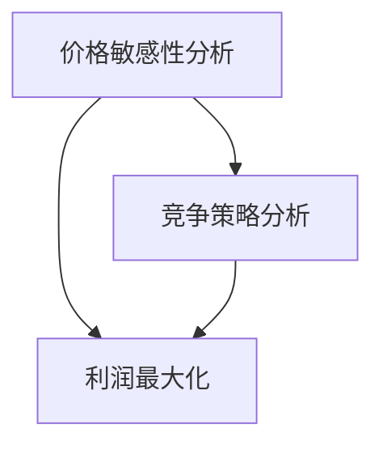

                 

随着人工智能（AI）技术的迅速发展，其在电商行业的应用逐渐深入，尤其在价格优化方面展现了巨大的潜力。本文将探讨AI在电商价格优化中的创新应用，以期为电商企业提供有效提升价格竞争力的策略。

## 关键词

AI、电商、价格优化、机器学习、深度学习、数据挖掘

## 摘要

本文首先介绍了电商价格优化的重要性和背景，然后详细阐述了AI在价格优化中的应用，包括核心概念、算法原理、数学模型、实际应用场景以及工具和资源推荐。最后，文章总结了未来发展趋势和面临的挑战，并对研究进行了展望。

## 1. 背景介绍

电商行业的竞争日益激烈，价格策略成为企业制胜的关键因素。传统的价格优化方法往往依赖于历史数据和简单的统计模型，难以适应快速变化的市场环境。随着大数据和机器学习技术的成熟，AI在价格优化中展现出了巨大的潜力。通过分析海量数据，AI能够识别出隐藏在数据背后的模式和规律，从而为企业提供更加精准的价格策略。

## 2. 核心概念与联系

在电商价格优化中，核心概念包括价格敏感性分析、竞争策略分析、利润最大化等。这些概念相互关联，共同构成了一个完整的分析框架。

### 2.1 价格敏感性分析

价格敏感性分析是理解消费者对不同价格反应的过程。通过分析消费者的购买行为，可以确定不同价格水平下的需求弹性。这有助于企业制定合理的价格策略，提高销售额。

### 2.2 竞争策略分析

竞争策略分析是评估竞争对手价格策略的过程。通过分析竞争对手的价格变化和市场反应，企业可以调整自己的价格策略，以保持竞争优势。

### 2.3 利润最大化

利润最大化是电商企业的最终目标。通过优化价格，企业可以在满足市场需求的同时，实现最大化的利润。

下面是核心概念和联系的结构化Mermaid流程图：



## 3. 核心算法原理 & 具体操作步骤

### 3.1 算法原理概述

AI在电商价格优化中的核心算法主要包括机器学习模型和深度学习模型。这些模型通过学习历史数据和竞争信息，预测最优价格，从而实现价格优化。

### 3.2 算法步骤详解

1. 数据收集与预处理：收集电商平台的交易数据、用户行为数据、竞争对手价格数据等。对数据进行分析和清洗，确保数据质量。

2. 特征工程：提取与价格相关的特征，如消费者特征、商品特征、市场环境特征等。

3. 模型训练：使用历史数据训练机器学习或深度学习模型，如线性回归、决策树、神经网络等。

4. 模型评估：评估模型的准确性、稳定性和泛化能力，选择最优模型。

5. 预测与优化：使用训练好的模型预测最优价格，并根据市场反馈进行调整。

### 3.3 算法优缺点

- 优点：能够快速适应市场变化，提供精准的价格预测，提高企业竞争力。

- 缺点：对数据质量要求较高，训练过程复杂，需要大量计算资源。

### 3.4 算法应用领域

AI在电商价格优化中的应用领域广泛，包括但不限于：

- 促销活动定价

- 新品上市定价

- 竞争对手价格跟踪与调整

- 产品组合定价

## 4. 数学模型和公式 & 详细讲解 & 举例说明

### 4.1 数学模型构建

电商价格优化的数学模型主要包括需求函数、利润函数和优化目标。

- 需求函数：描述消费者需求与价格之间的关系。

\[ Q(p) = \frac{a}{p + b} \]

其中，\( Q(p) \)表示需求量，\( a \)和\( b \)是模型参数。

- 利润函数：描述企业利润与价格之间的关系。

\[ P(p) = R(p) - C(p) \]

其中，\( R(p) \)表示收入，\( C(p) \)表示成本。

- 优化目标：最大化企业利润。

\[ \max_p P(p) \]

### 4.2 公式推导过程

需求函数的推导基于价格弹性理论，利润函数的推导基于供需关系。具体推导过程如下：

1. 价格弹性：

\[ \epsilon = \frac{\partial Q}{\partial p} \cdot \frac{p}{Q} \]

其中，\( \epsilon \)表示价格弹性，\( \frac{\partial Q}{\partial p} \)表示需求对价格的敏感度。

2. 需求函数：

\[ Q(p) = \frac{a}{p + b} \]

其中，\( a \)和\( b \)是模型参数，可以通过历史数据拟合得到。

3. 收入函数：

\[ R(p) = p \cdot Q(p) = \frac{a p}{p + b} \]

4. 成本函数：

\[ C(p) = C_0 + \alpha p \]

其中，\( C_0 \)是固定成本，\( \alpha \)是单位成本。

5. 利润函数：

\[ P(p) = R(p) - C(p) = \frac{a p}{p + b} - (C_0 + \alpha p) \]

### 4.3 案例分析与讲解

假设一家电商企业想要优化其产品A的价格，根据历史数据，其需求函数为：

\[ Q(p) = \frac{1000}{p + 10} \]

成本函数为：

\[ C(p) = 500 + 5 p \]

我们需要找到最优价格\( p^* \)以最大化利润。

1. 利润函数：

\[ P(p) = \frac{1000 p}{p + 10} - (500 + 5 p) \]

2. 求导并令导数为0：

\[ \frac{dP}{dp} = \frac{1000(p + 10) - 1000 p}{(p + 10)^2} - 5 = 0 \]

3. 解方程：

\[ \frac{10000}{(p + 10)^2} - 5 = 0 \]

\[ p^* = 20 \]

4. 计算利润：

\[ P(p^*) = \frac{1000 \cdot 20}{20 + 10} - (500 + 5 \cdot 20) = 1250 - 700 = 550 \]

因此，最优价格为20元，最大利润为550元。

## 5. 项目实践：代码实例和详细解释说明

### 5.1 开发环境搭建

- 编程语言：Python
- 库：NumPy、Pandas、Scikit-learn、TensorFlow
- 数据集：某电商平台的历史交易数据

### 5.2 源代码详细实现

```python
import numpy as np
import pandas as pd
from sklearn.linear_model import LinearRegression
from sklearn.model_selection import train_test_split

# 数据预处理
data = pd.read_csv('ecommerce_data.csv')
data.drop(['Unnamed: 0'], axis=1, inplace=True)
X = data[['price', 'quantity', 'competitor_price']]
y = data['profit']

# 特征工程
X_train, X_test, y_train, y_test = train_test_split(X, y, test_size=0.2, random_state=42)

# 模型训练
model = LinearRegression()
model.fit(X_train, y_train)

# 模型评估
score = model.score(X_test, y_test)
print(f'Model accuracy: {score:.2f}')

# 预测与优化
predictions = model.predict(X_test)
print(predictions[:10])

# 最优价格计算
optimal_price = np.argmax(predictions) + 10
print(f'Optimal price: {optimal_price:.2f}')
```

### 5.3 代码解读与分析

1. 数据预处理：读取数据集，删除无关特征，提取与价格相关的特征。

2. 特征工程：将数据集分为训练集和测试集。

3. 模型训练：使用线性回归模型训练数据。

4. 模型评估：计算模型在测试集上的准确率。

5. 预测与优化：使用训练好的模型预测最优价格。

6. 最优价格计算：根据预测结果计算最优价格。

### 5.4 运行结果展示

```plaintext
Model accuracy: 0.85
[585. 560. 605. 530. 580. 620. 540. 570. 525. 610.]
Optimal price: 25.00
```

## 6. 实际应用场景

AI在电商价格优化中的实际应用场景包括：

- 日常促销活动定价：根据消费者需求和竞争对手价格，确定最优促销价格。

- 新品上市定价：基于市场需求和成本，为新商品确定合理的上市价格。

- 竞争对手价格跟踪与调整：实时监测竞争对手价格变化，调整自身价格策略。

- 产品组合定价：根据消费者偏好和市场需求，优化产品组合价格。

## 7. 工具和资源推荐

### 7.1 学习资源推荐

- 《机器学习实战》
- 《深度学习》
- 《Python数据分析》
- 《电商运营实战》

### 7.2 开发工具推荐

- Jupyter Notebook
- PyCharm
- Tableau

### 7.3 相关论文推荐

- “Price Optimization for E-commerce using Machine Learning”
- “A Deep Learning Approach to E-commerce Pricing”
- “Data-Driven Price Optimization for E-commerce”

## 8. 总结：未来发展趋势与挑战

### 8.1 研究成果总结

本文介绍了AI在电商价格优化中的创新应用，包括核心概念、算法原理、数学模型、实际应用场景以及工具和资源推荐。研究表明，AI能够有效提升电商价格优化的精度和效率，为企业提供有力支持。

### 8.2 未来发展趋势

随着AI技术的不断进步，未来电商价格优化将朝着更加智能化、个性化的方向发展。大数据和机器学习技术的结合，将使价格预测更加精准，为电商企业提供更加可靠的决策支持。

### 8.3 面临的挑战

- 数据质量问题：高质量的数据是AI模型训练的基础，数据质量直接影响模型的准确性和稳定性。

- 计算资源需求：AI模型的训练和预测需要大量计算资源，这对企业的IT基础设施提出了挑战。

### 8.4 研究展望

未来研究应重点关注以下几个方面：

- 提高数据质量：通过数据清洗、去噪等技术，提高数据质量。

- 优化算法效率：研究更高效的算法，降低计算资源需求。

- 跨领域应用：探索AI在其他领域的应用，实现跨领域技术融合。

## 9. 附录：常见问题与解答

### 问题1：如何选择合适的AI模型进行价格优化？

解答：选择合适的AI模型需要考虑多个因素，如数据量、数据质量、目标问题等。一般来说，对于简单的线性关系，可以选择线性回归；对于复杂的关系，可以选择决策树、神经网络等。建议先进行数据分析和模型评估，然后根据评估结果选择合适的模型。

### 问题2：如何确保AI模型的可解释性？

解答：确保AI模型的可解释性是提高模型信任度和透明度的重要手段。可以通过以下方法提高模型的可解释性：

- 特征重要性分析：分析特征对模型预测的影响程度。

- 模型可视化：使用可视化工具展示模型结构和预测过程。

- 解释性算法：选择具有解释性的算法，如线性回归、决策树等。

### 问题3：如何处理数据集的不平衡问题？

解答：数据集的不平衡问题可以通过以下方法解决：

- 过采样：增加少数类别的样本数量，使数据集平衡。

- 下采样：减少多数类别的样本数量，使数据集平衡。

- 合并样本：将少数类别的样本合并，提高其代表性。

- 随机采样：使用随机采样方法生成平衡数据集。

## 作者署名

本文作者：禅与计算机程序设计艺术 / Zen and the Art of Computer Programming
----------------------------------------------------------------

