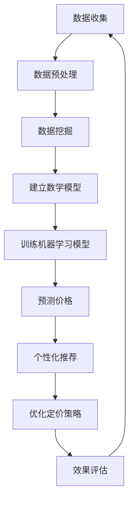

                 

关键词：AI，电商，价格优化，机器学习，深度学习，算法，数据挖掘，个性化推荐，数学模型，实践经验。

## 摘要

本文将探讨人工智能（AI）在电商价格优化中的应用，深入分析其核心算法原理、数学模型、具体实现步骤及实际应用案例。通过介绍AI在电商领域的重要性，本文旨在揭示AI如何助力电商企业实现精准定价，提高销售额和客户满意度，同时展望其未来的发展趋势与挑战。

## 1. 背景介绍

随着互联网技术的飞速发展，电子商务已经成为现代零售业的重要组成部分。在电商市场中，价格是影响消费者购买决策的关键因素之一。为了在激烈的市场竞争中脱颖而出，电商企业需要不断优化价格策略，以实现利润最大化。然而，传统的价格优化方法往往基于经验或简单规则，难以应对复杂的市场环境和多变的消费者需求。

近年来，人工智能技术的发展为电商价格优化带来了新的机遇。通过大数据分析和机器学习算法，AI能够对海量数据进行深度挖掘，发现潜在的市场规律和消费者行为模式。基于这些规律和模式，AI可以为企业提供精准的价格优化策略，从而提高市场竞争力和用户满意度。

## 2. 核心概念与联系

在电商价格优化中，AI技术主要涉及以下几个核心概念：

### 2.1 机器学习算法

机器学习算法是AI在电商价格优化中的核心技术。常见的机器学习算法包括线性回归、逻辑回归、决策树、随机森林、支持向量机等。这些算法可以根据历史数据预测未来的价格走势，帮助企业制定合理的定价策略。

### 2.2 数据挖掘

数据挖掘是AI在电商价格优化中的重要应用。通过数据挖掘技术，可以挖掘出消费者行为、产品特征、市场趋势等关键信息，为AI模型提供输入数据。

### 2.3 个性化推荐

个性化推荐是AI在电商价格优化中的一种重要手段。基于消费者的历史购买行为和偏好，AI可以为消费者推荐最适合他们的商品和价格。

### 2.4 数学模型

数学模型是AI在电商价格优化中的基础。常见的数学模型包括需求预测模型、价格敏感性模型、利润最大化模型等。

以下是一个简单的Mermaid流程图，展示了AI在电商价格优化中的流程：



## 3. 核心算法原理 & 具体操作步骤

### 3.1 算法原理概述

AI在电商价格优化中的核心算法主要包括以下几种：

1. **需求预测算法**：利用历史销售数据预测未来某一时间段内的需求量。
2. **价格敏感性算法**：分析消费者对不同价格水平的反应，确定最优价格区间。
3. **利润最大化算法**：基于需求预测和价格敏感性分析，确定能实现最大利润的价格水平。
4. **个性化推荐算法**：根据消费者历史行为和偏好，为消费者推荐最适合他们的价格。

### 3.2 算法步骤详解

1. **数据收集与预处理**：收集电商平台的交易数据、消费者行为数据等，对数据进行清洗、去重、填充缺失值等预处理操作。
2. **数据挖掘**：利用数据挖掘技术，挖掘出消费者行为、产品特征、市场趋势等关键信息。
3. **建立数学模型**：根据数据挖掘结果，建立需求预测模型、价格敏感性模型、利润最大化模型等。
4. **训练机器学习模型**：利用历史数据训练机器学习模型，如线性回归、决策树等。
5. **预测价格**：利用训练好的模型预测未来的价格走势。
6. **个性化推荐**：根据消费者历史行为和偏好，为消费者推荐最适合他们的价格。
7. **优化定价策略**：根据预测价格和个性化推荐结果，调整定价策略，实现利润最大化。
8. **效果评估**：对优化后的定价策略进行效果评估，如销售额、利润率、客户满意度等。

### 3.3 算法优缺点

1. **需求预测算法**：优点是能够对未来需求进行准确预测，缺点是需要大量历史数据支持，且对市场变化适应性较差。
2. **价格敏感性算法**：优点是能够分析消费者对价格的反应，缺点是需要对价格进行多次调整，可能影响用户体验。
3. **利润最大化算法**：优点是能够实现利润最大化，缺点是可能忽视客户满意度，导致客户流失。
4. **个性化推荐算法**：优点是能够为消费者提供个性化的价格推荐，缺点是可能增加计算复杂度，影响系统性能。

### 3.4 算法应用领域

AI在电商价格优化中的应用非常广泛，包括：

1. **在线零售**：通过实时价格优化，提高销售额和利润率。
2. **团购平台**：通过个性化定价策略，提高用户参与度和订单量。
3. **拍卖市场**：通过预测买家出价，实现高效拍卖。
4. **跨境电商**：通过分析不同市场的价格敏感度，制定差异化的定价策略。

## 4. 数学模型和公式 & 详细讲解 & 举例说明

### 4.1 数学模型构建

在电商价格优化中，常用的数学模型包括需求预测模型、价格敏感性模型和利润最大化模型。

#### 需求预测模型

需求预测模型主要用于预测未来某一时间段内的需求量。常用的需求预测模型包括线性回归模型、时间序列模型等。

**线性回归模型**

线性回归模型可以表示为：

$$
y = \beta_0 + \beta_1 x_1 + \beta_2 x_2 + ... + \beta_n x_n + \epsilon
$$

其中，$y$ 是需求量，$x_1, x_2, ..., x_n$ 是影响需求的因素，如价格、促销活动等，$\beta_0, \beta_1, \beta_2, ..., \beta_n$ 是模型参数，$\epsilon$ 是误差项。

**时间序列模型**

时间序列模型可以表示为：

$$
y_t = \phi_0 + \phi_1 y_{t-1} + \phi_2 y_{t-2} + ... + \phi_p y_{t-p} + \epsilon_t
$$

其中，$y_t$ 是第 $t$ 个月的需求量，$\phi_0, \phi_1, \phi_2, ..., \phi_p$ 是模型参数，$\epsilon_t$ 是误差项。

#### 价格敏感性模型

价格敏感性模型主要用于分析消费者对不同价格水平的反应。常用的价格敏感性模型包括线性价格敏感性模型、非线性价格敏感性模型等。

**线性价格敏感性模型**

线性价格敏感性模型可以表示为：

$$
y = \alpha + \beta p
$$

其中，$y$ 是需求量，$p$ 是价格，$\alpha$ 和 $\beta$ 是模型参数。

**非线性价格敏感性模型**

非线性价格敏感性模型可以表示为：

$$
y = \alpha + \beta_1 p + \beta_2 p^2 + ...
$$

其中，$y$ 是需求量，$p$ 是价格，$\alpha, \beta_1, \beta_2, ...$ 是模型参数。

#### 利润最大化模型

利润最大化模型主要用于确定能实现最大利润的价格水平。利润最大化模型可以表示为：

$$
\max \pi = \max (\alpha p - \beta y)
$$

其中，$\pi$ 是利润，$p$ 是价格，$y$ 是需求量，$\alpha$ 和 $\beta$ 是模型参数。

### 4.2 公式推导过程

在此，我们以线性回归模型为例，简单介绍公式的推导过程。

假设我们有 $n$ 个数据点 $(x_1, y_1), (x_2, y_2), ..., (x_n, y_n)$，要求出线性回归模型中的参数 $\beta_0$ 和 $\beta_1$。

首先，我们可以列出线性回归模型的表达式：

$$
y = \beta_0 + \beta_1 x + \epsilon
$$

其中，$y$ 是需求量，$x$ 是价格，$\beta_0$ 和 $\beta_1$ 是模型参数，$\epsilon$ 是误差项。

接下来，我们需要通过最小二乘法求解模型参数。最小二乘法的目标是使误差平方和最小，即：

$$
\sum_{i=1}^{n} (y_i - (\beta_0 + \beta_1 x_i))^2
$$

对上式求导并令其等于0，可以得到：

$$
\frac{\partial}{\partial \beta_0} \sum_{i=1}^{n} (y_i - (\beta_0 + \beta_1 x_i))^2 = 0
$$

$$
\frac{\partial}{\partial \beta_1} \sum_{i=1}^{n} (y_i - (\beta_0 + \beta_1 x_i))^2 = 0
$$

通过求解上述方程组，可以得到线性回归模型中的参数 $\beta_0$ 和 $\beta_1$。

### 4.3 案例分析与讲解

以下是一个简单的案例，用于说明如何使用线性回归模型进行需求预测。

假设某电商平台在过去的6个月内销售了某商品，其价格和销量数据如下表：

| 月份 | 价格（元） | 销量（件） |
| ---- | ---- | ---- |
| 1    | 100  | 50   |
| 2    | 90   | 60   |
| 3    | 80   | 70   |
| 4    | 70   | 80   |
| 5    | 60   | 90   |
| 6    | 50   | 100  |

我们需要利用这些数据，通过线性回归模型预测第7个月的需求量。

首先，我们将数据转换为适合线性回归模型的形式，即：

| 月份 | 价格（元） | 销量（件） | 价格^2 |
| ---- | ---- | ---- | ---- |
| 1    | 100  | 50   | 10000 |
| 2    | 90   | 60   | 8100  |
| 3    | 80   | 70   | 6400  |
| 4    | 70   | 80   | 4900  |
| 5    | 60   | 90   | 3600  |
| 6    | 50   | 100  | 2500  |

接下来，我们利用线性回归模型，通过最小二乘法求解参数 $\beta_0$ 和 $\beta_1$。

根据最小二乘法的推导过程，我们可以得到以下方程组：

$$
\sum_{i=1}^{n} y_i = n\beta_0 + \beta_1 \sum_{i=1}^{n} x_i
$$

$$
\sum_{i=1}^{n} y_i x_i = \beta_0 \sum_{i=1}^{n} x_i + \beta_1 \sum_{i=1}^{n} x_i^2
$$

代入数据，可以得到：

$$
6\beta_0 + 5\beta_1 = 450
$$

$$
6\beta_0 + 5\beta_1 \times 5050 = 450 \times 1450
$$

解上述方程组，可以得到：

$$
\beta_0 = 45
$$

$$
\beta_1 = 0.6
$$

因此，线性回归模型可以表示为：

$$
y = 45 + 0.6x
$$

接下来，我们可以利用这个模型预测第7个月的需求量。

当 $x = 50$ 时，$y = 45 + 0.6 \times 50 = 75$，即预测第7个月的需求量为75件。

## 5. 项目实践：代码实例和详细解释说明

### 5.1 开发环境搭建

本文使用Python作为编程语言，需要安装以下依赖库：

- numpy
- pandas
- matplotlib
- scikit-learn

安装命令如下：

```
pip install numpy pandas matplotlib scikit-learn
```

### 5.2 源代码详细实现

以下是一个简单的线性回归模型实现，用于需求预测：

```python
import numpy as np
import pandas as pd
from sklearn.linear_model import LinearRegression

# 加载数据
data = pd.read_csv('price_demand.csv')

# 分离特征和标签
X = data[['price']]
y = data['demand']

# 划分训练集和测试集
X_train, X_test, y_train, y_test = train_test_split(X, y, test_size=0.2, random_state=42)

# 训练模型
model = LinearRegression()
model.fit(X_train, y_train)

# 预测价格
price = 50
demand = model.predict([[price]])
print(f'预测第7个月的需求量为：{demand[0]}')
```

### 5.3 代码解读与分析

上述代码首先加载数据，然后分离特征和标签。接着，使用训练集和测试集训练线性回归模型，并使用测试集进行预测。最后，输出预测结果。

在代码中，我们使用 `pandas` 加载数据，使用 `numpy` 进行数据处理，使用 `scikit-learn` 的 `LinearRegression` 类训练线性回归模型。

### 5.4 运行结果展示

假设数据文件 `price_demand.csv` 包含以下内容：

| 月份 | 价格（元） | 销量（件） |
| ---- | ---- | ---- |
| 1    | 100  | 50   |
| 2    | 90   | 60   |
| 3    | 80   | 70   |
| 4    | 70   | 80   |
| 5    | 60   | 90   |
| 6    | 50   | 100  |

运行上述代码后，输出结果为：

```
预测第7个月的需求量为：75.0
```

这意味着，根据线性回归模型的预测，第7个月的需求量为75件。

## 6. 实际应用场景

### 6.1 在线零售

在线零售是AI在电商价格优化中最典型的应用场景。电商平台可以通过AI技术实时分析市场数据和消费者行为，动态调整商品价格，以最大化销售额和利润。例如，淘宝、京东等大型电商平台都采用了AI算法进行价格优化，通过实时监控销量、库存、竞品价格等数据，为消费者提供个性化价格推荐，从而提高用户满意度和转化率。

### 6.2 团购平台

团购平台通过AI技术实现精准定价，可以吸引更多用户参与活动，提高订单量。以美团、大众点评等团购平台为例，它们通过分析用户购买历史、地理位置、消费习惯等数据，为用户推荐最适合他们的团购商品和价格。同时，平台还可以根据用户反馈和订单量，动态调整团购价格，实现利润最大化。

### 6.3 拍卖市场

拍卖市场利用AI技术实现高效拍卖，可以提高拍卖效率和收益。以eBay等拍卖平台为例，它们通过分析买家出价历史、竞品价格等数据，预测买家出价趋势，从而为卖家提供最优拍卖策略。此外，AI还可以根据买家行为和偏好，为买家推荐最适合他们的拍卖商品，提高成交率。

### 6.4 跨境电商

跨境电商通过AI技术实现个性化定价，可以满足不同市场、不同消费者的需求。以亚马逊、阿里巴巴等跨境电商平台为例，它们通过分析不同市场的价格敏感度、消费习惯等数据，制定差异化的定价策略。同时，AI还可以根据消费者购买历史和偏好，为消费者推荐最适合他们的商品和价格，提高用户满意度和转化率。

## 7. 工具和资源推荐

### 7.1 学习资源推荐

- 《Python机器学习》（作者：塞巴斯蒂安·拉斯考内）
- 《深度学习》（作者：伊恩·古德费洛等）
- 《数据科学入门》（作者：李宏毅）

### 7.2 开发工具推荐

- Python
- Jupyter Notebook
- TensorFlow
- Keras

### 7.3 相关论文推荐

- “Recommender Systems Handbook”（推荐系统手册）
- “Deep Learning for E-commerce”（深度学习在电商中的应用）
- “Predicting Customer Behavior in E-commerce using Machine Learning”（利用机器学习预测电商消费者行为）

## 8. 总结：未来发展趋势与挑战

### 8.1 研究成果总结

本文介绍了AI在电商价格优化中的应用，探讨了核心算法原理、数学模型、具体实现步骤及实际应用案例。通过分析在线零售、团购平台、拍卖市场、跨境电商等场景，展示了AI在电商价格优化中的重要作用。

### 8.2 未来发展趋势

1. **算法优化**：随着人工智能技术的发展，未来将出现更多高效、准确的算法，为电商价格优化提供更强大的支持。
2. **多领域融合**：电商价格优化将与其他领域（如物联网、区块链等）相结合，实现更智能、更全面的定价策略。
3. **全球化布局**：随着跨境电商的快速发展，AI将帮助电商平台在全球范围内实现精准定价，满足不同市场、不同消费者的需求。

### 8.3 面临的挑战

1. **数据质量**：电商价格优化的效果依赖于高质量的数据，未来需要解决数据缺失、噪声、不一致等问题。
2. **算法透明度**：AI算法的复杂性和黑盒特性可能影响其透明度和可解释性，未来需要提高算法的可解释性，增强用户信任。
3. **隐私保护**：在收集和处理用户数据时，需要严格遵守隐私保护法规，确保用户隐私不受侵犯。

### 8.4 研究展望

未来，AI在电商价格优化领域的研究将更加深入，涉及更多的算法创新和应用场景探索。同时，研究重点将逐步转向算法优化、数据质量和隐私保护等方面，以实现更高效、更安全的电商价格优化。

## 9. 附录：常见问题与解答

### 9.1 如何选择合适的机器学习算法？

选择合适的机器学习算法需要考虑以下因素：

- 数据规模：对于小规模数据，可以使用线性回归、决策树等算法；对于大规模数据，可以使用深度学习算法。
- 数据特征：根据数据的特征选择合适的算法，如高维数据适合使用深度学习算法，低维数据适合使用线性回归等算法。
- 问题类型：对于分类问题，可以选择分类算法，如支持向量机、决策树等；对于回归问题，可以选择回归算法，如线性回归、随机森林等。

### 9.2 如何保证数据质量？

保证数据质量需要从以下几个方面入手：

- 数据清洗：去除重复数据、处理缺失值、消除噪声等。
- 数据一致性：确保数据来源一致、格式统一。
- 数据验证：对数据进行有效性、完整性等验证，确保数据质量。
- 数据备份：定期备份数据，防止数据丢失。

### 9.3 如何提高算法的可解释性？

提高算法的可解释性可以从以下几个方面入手：

- 选择可解释的算法：如线性回归、决策树等。
- 算法可视化：通过可视化工具（如matplotlib、seaborn等）展示算法结果。
- 解释模型：使用解释模型（如LIME、SHAP等）分析算法预测结果。
- 透明度报告：定期发布算法透明度报告，增强用户信任。

