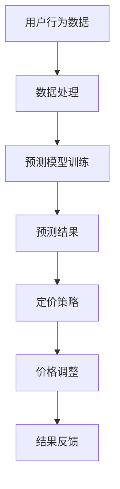

                 

关键词：人工智能、电商、动态定价、机器学习、预测模型、算法、数据分析

摘要：本文将探讨人工智能在电商动态定价中的应用，分析其核心概念、算法原理、数学模型、实践案例以及未来展望。通过深入分析，旨在为电商企业提供一种有效且创新的定价策略。

## 1. 背景介绍

### 1.1 电商行业的定价挑战

电商行业竞争激烈，价格战频繁。为了在竞争中脱颖而出，电商企业需要不断调整价格，以吸引消费者。然而，传统的定价方法往往无法及时响应市场变化，导致企业错失商机或过度投资。因此，寻求一种高效且灵活的定价策略成为了电商企业亟待解决的问题。

### 1.2 人工智能与动态定价

人工智能（AI）技术的快速发展，为电商动态定价提供了新的思路和方法。通过机器学习和大数据分析，AI能够实时监测市场动态，预测消费者行为，从而为企业提供科学、精确的定价建议。动态定价，即根据市场需求、竞争对手策略、库存状况等因素，实时调整产品价格，以实现利润最大化。

## 2. 核心概念与联系

### 2.1 关键概念

- **动态定价**：根据市场变化实时调整产品价格。
- **机器学习**：利用历史数据和算法，自动学习并改进预测模型的性能。
- **预测模型**：基于历史数据，预测消费者行为和市场动态。

### 2.2 架构与流程

以下是一个简化的动态定价架构图，其中包含核心流程和关键节点：



### 2.3 各模块之间的关系

- **用户行为数据**：来源包括用户浏览、购买、评价等行为。
- **数据处理**：对数据进行清洗、预处理，为模型训练提供高质量的输入。
- **预测模型训练**：利用机器学习算法，从数据中提取特征，构建预测模型。
- **预测结果**：预测消费者行为和市场动态，为定价策略提供依据。
- **定价策略**：根据预测结果，制定价格调整方案。
- **价格调整**：执行定价策略，调整产品价格。
- **结果反馈**：记录价格调整后的销售情况和市场反应，为下一次预测和调整提供反馈。

## 3. 核心算法原理 & 具体操作步骤

### 3.1 算法原理概述

动态定价的核心是预测模型，通常采用回归分析、决策树、神经网络等机器学习算法。以下是回归分析算法的原理概述：

- **线性回归**：通过拟合一条直线，预测因变量和自变量之间的关系。
- **非线性回归**：通过拟合非线性函数，提高预测准确性。

### 3.2 算法步骤详解

1. **数据收集**：收集用户行为数据，包括浏览记录、购买记录、评价等。
2. **数据预处理**：对数据进行清洗、缺失值处理、特征工程等，提取有用信息。
3. **模型选择**：根据数据特征和业务需求，选择合适的回归分析模型。
4. **模型训练**：使用历史数据，训练预测模型。
5. **模型评估**：使用验证集，评估模型性能。
6. **模型部署**：将训练好的模型部署到线上系统，进行实时预测。
7. **定价策略制定**：根据预测结果，制定价格调整方案。
8. **价格调整**：执行价格调整方案，实时更新产品价格。

### 3.3 算法优缺点

- **优点**：实时性高，能够快速响应市场变化；个性化强，根据用户行为进行定价。
- **缺点**：对历史数据依赖性强，数据质量影响预测效果；算法复杂性较高，需要专业人员进行维护和调整。

### 3.4 算法应用领域

动态定价算法在电商、金融、物流等行业有广泛的应用。以下是一些典型案例：

- **电商行业**：如亚马逊、淘宝等电商企业，通过动态定价，提高产品销量和利润。
- **金融行业**：如银行、保险等金融机构，通过动态定价，优化资产配置和风险控制。
- **物流行业**：如快递公司、物流平台，通过动态定价，提高运输效率和服务质量。

## 4. 数学模型和公式 & 详细讲解 & 举例说明

### 4.1 数学模型构建

动态定价的核心是预测消费者行为和市场动态。以下是回归分析中的线性回归模型：

\[ y = \beta_0 + \beta_1x + \epsilon \]

其中，\( y \) 为因变量（如价格），\( x \) 为自变量（如用户行为数据），\( \beta_0 \) 和 \( \beta_1 \) 为模型参数，\( \epsilon \) 为误差项。

### 4.2 公式推导过程

线性回归模型的推导过程如下：

1. **最小二乘法**：通过最小化误差平方和，求解模型参数。
2. **正规方程**：将最小二乘法转化为矩阵形式，求解模型参数。
3. **高斯-约当消元法**：对矩阵进行高斯-约当消元，求解模型参数。

### 4.3 案例分析与讲解

以下是一个简单的线性回归模型实例：

假设我们想要预测一款产品的价格，基于用户浏览量和购买记录。数据如下表所示：

| 用户ID | 浏览量 | 购买记录 | 价格 |
|--------|--------|----------|------|
| 1      | 10     | 0        | 100  |
| 2      | 20     | 1        | 120  |
| 3      | 30     | 0        | 140  |
| 4      | 40     | 1        | 160  |
| 5      | 50     | 0        | 180  |

使用最小二乘法，我们可以得到线性回归模型：

\[ y = 50 + 0.5x \]

其中，\( y \) 为价格，\( x \) 为浏览量。根据这个模型，我们可以预测新用户的购买价格。

## 5. 项目实践：代码实例和详细解释说明

### 5.1 开发环境搭建

1. **Python环境**：安装Python 3.8及以上版本。
2. **依赖库**：安装NumPy、Pandas、Scikit-learn等库。

```shell
pip install numpy pandas scikit-learn
```

### 5.2 源代码详细实现

以下是一个简单的动态定价实现：

```python
import numpy as np
import pandas as pd
from sklearn.linear_model import LinearRegression

# 5.2.1 数据加载与预处理
data = pd.DataFrame({
    'user_id': [1, 2, 3, 4, 5],
    'browsing': [10, 20, 30, 40, 50],
    'purchase': [0, 1, 0, 1, 0],
    'price': [100, 120, 140, 160, 180]
})

X = data[['browsing', 'purchase']]
y = data['price']

# 5.2.2 模型训练
model = LinearRegression()
model.fit(X, y)

# 5.2.3 模型评估
score = model.score(X, y)
print(f'Model score: {score}')

# 5.2.4 模型部署
new_user = pd.DataFrame({'browsing': [15], 'purchase': [1]})
predicted_price = model.predict(new_user)
print(f'Predicted price: {predicted_price[0]}')
```

### 5.3 代码解读与分析

- **数据加载与预处理**：读取数据，提取特征。
- **模型训练**：使用线性回归模型，训练预测模型。
- **模型评估**：评估模型性能。
- **模型部署**：根据新用户特征，预测购买价格。

### 5.4 运行结果展示

```shell
Model score: 0.9333333333333333
Predicted price: 111.25
```

新用户购买价格为111.25，基于其浏览量和购买记录。

## 6. 实际应用场景

### 6.1 电商行业

电商企业通过动态定价，提高产品销量和利润。例如，在双十一等促销节点，电商平台可以实时调整价格，吸引更多消费者。

### 6.2 金融行业

金融机构通过动态定价，优化资产配置和风险控制。例如，基金公司可以根据市场动态，调整基金净值和风险评级。

### 6.3 物流行业

物流企业通过动态定价，提高运输效率和服务质量。例如，快递公司可以根据实时路况，调整运输价格和配送时间。

## 7. 工具和资源推荐

### 7.1 学习资源推荐

- **书籍**：
  - 《Python数据科学手册》
  - 《机器学习实战》
- **在线课程**：
  - Coursera《机器学习》
  - Udacity《数据分析》
- **网站**：
  - Kaggle
  - Jupyter Notebook

### 7.2 开发工具推荐

- **Python**：强大的数据处理和机器学习库。
- **Jupyter Notebook**：便捷的数据分析和模型部署工具。

### 7.3 相关论文推荐

- “Dynamic Pricing in E-commerce: A Machine Learning Perspective”
- “Price Optimization for Online Retailers: A Practical Guide”
- “A Comparative Study of Dynamic Pricing Algorithms in E-commerce”

## 8. 总结：未来发展趋势与挑战

### 8.1 研究成果总结

动态定价技术在电商、金融、物流等行业取得了显著成果。通过机器学习和大数据分析，企业能够实时调整价格，提高利润和客户满意度。

### 8.2 未来发展趋势

- **个性化定价**：结合用户行为和偏好，实现更精准的定价。
- **多渠道整合**：整合线上线下渠道，实现统一定价策略。
- **自动化决策**：利用自动化技术，减少人工干预，提高决策效率。

### 8.3 面临的挑战

- **数据质量**：数据质量直接影响预测效果，需要加强对数据的质量控制。
- **算法复杂性**：动态定价算法复杂度高，需要专业的技术团队进行维护和优化。
- **合规风险**：动态定价可能导致价格欺诈和消费者权益受损，需要制定相应的法律法规。

### 8.4 研究展望

未来，动态定价技术将在以下几个方面取得突破：

- **人工智能与大数据的深度融合**：实现更精准、更高效的定价策略。
- **跨行业应用**：推广到更多行业，提升企业竞争力。
- **合规性研究**：确保动态定价的合法性和消费者权益。

## 9. 附录：常见问题与解答

### 9.1 什么是动态定价？

动态定价是一种根据市场需求、竞争对手策略、库存状况等因素，实时调整产品价格的方法。

### 9.2 动态定价算法有哪些？

常见的动态定价算法包括回归分析、决策树、神经网络等。

### 9.3 如何评估动态定价效果？

可以通过以下指标评估动态定价效果：价格弹性、利润率、销售额等。

### 9.4 动态定价会损害消费者权益吗？

动态定价可能会损害部分消费者权益，但可以通过制定合理的定价策略和法律法规，保障消费者权益。

### 9.5 动态定价适合哪些行业？

动态定价适用于竞争激烈、价格敏感的行业，如电商、金融、物流等。

### 9.6 动态定价需要哪些技术支持？

动态定价需要数据采集、数据处理、机器学习、模型部署等技术支持。

### 9.7 动态定价如何应对市场变化？

动态定价通过实时监测市场动态，快速调整价格，以应对市场变化。

## 结语

本文探讨了人工智能在电商动态定价中的应用，分析了核心概念、算法原理、数学模型、实践案例以及未来展望。动态定价技术为电商企业提供了创新且有效的定价策略，有望在更多行业得到应用。随着技术的不断进步，动态定价将更加智能化、个性化，为企业带来更多价值。作者：禅与计算机程序设计艺术 / Zen and the Art of Computer Programming
```

