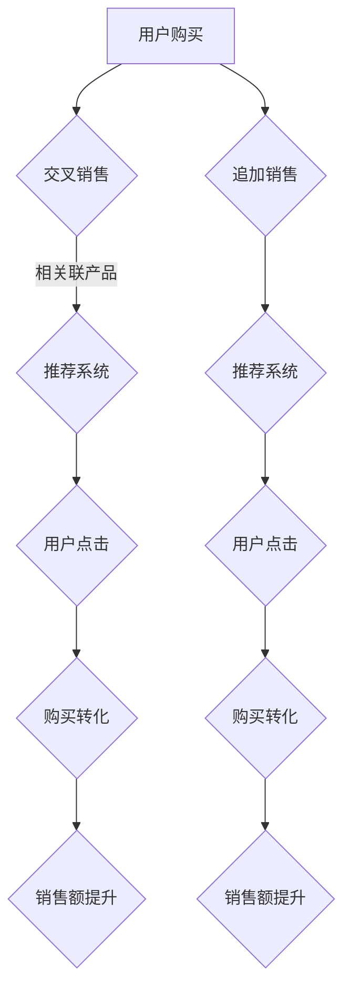

                 

关键词：人工智能、电商平台、交叉销售、追加销售、推荐系统、机器学习、数据挖掘

摘要：随着电商平台的蓬勃发展，如何提高销售额和用户满意度成为关键问题。本文将探讨人工智能技术在电商平台中的交叉销售和追加销售应用，包括推荐系统的构建、核心算法原理、数学模型构建以及实际应用案例等，为电商平台提供有效的销售策略和用户个性化体验。

## 1. 背景介绍

### 1.1 电商平台的发展现状

随着互联网技术的飞速发展，电商平台已经成为人们日常购物的主要渠道之一。近年来，我国电商市场呈现出蓬勃发展的态势，市场规模逐年扩大，用户数量持续增长。据相关数据显示，2022年我国电商市场规模已经突破10万亿元，占社会消费品零售总额的比重不断上升。电商平台之间的竞争愈发激烈，如何提高销售额和用户满意度成为电商平台关注的焦点。

### 1.2 交叉销售和追加销售的重要性

交叉销售和追加销售是电商平台提升销售额的重要手段。交叉销售指的是在用户购买某一产品时，通过推荐相关联的其他产品，引导用户进行二次购买；而追加销售则是在用户购买某一产品后，推荐相似或更高级的产品，促使用户进行额外购买。这两种销售策略能够有效提高用户的购买转化率和平均订单价值，从而提高电商平台的整体盈利能力。

### 1.3 人工智能技术在电商领域的应用

人工智能技术具有强大的数据处理和分析能力，广泛应用于电商平台的推荐系统、广告投放、风险控制等多个方面。近年来，随着人工智能技术的不断发展，其在电商平台交叉销售和追加销售中的应用也越来越广泛。本文将重点关注人工智能技术在电商平台交叉销售和追加销售中的应用，探讨其核心算法原理、数学模型构建以及实际应用案例等。

## 2. 核心概念与联系

为了更好地理解人工智能技术在电商平台交叉销售和追加销售中的应用，我们需要了解一些核心概念及其相互关系。

### 2.1 推荐系统

推荐系统是电商平台交叉销售和追加销售的重要工具。它通过分析用户的历史行为数据，为用户推荐可能感兴趣的其他产品。推荐系统可以分为基于内容的推荐和基于协同过滤的推荐两种类型。

- **基于内容的推荐**：根据用户过去购买或浏览过的产品，分析其兴趣点，然后为用户推荐具有相似属性的产品。
- **基于协同过滤的推荐**：通过分析用户之间的相似度，找出与其他用户有相同兴趣的用户，为他们推荐他们可能喜欢的商品。

### 2.2 交叉销售和追加销售

交叉销售和追加销售是推荐系统在电商领域的重要应用。交叉销售通过为用户推荐相关联的产品，提高用户的购买转化率；而追加销售则通过推荐相似或更高级的产品，提高用户的平均订单价值。

### 2.3 Mermaid 流程图

为了更直观地展示交叉销售和追加销售的过程，我们使用 Mermaid 流程图进行描述。



## 3. 核心算法原理 & 具体操作步骤

### 3.1 算法原理概述

在电商平台交叉销售和追加销售中，核心算法通常是基于协同过滤的推荐算法。协同过滤算法通过分析用户的历史行为数据，找出用户之间的相似性，然后为用户推荐相似用户喜欢的商品。

协同过滤算法可以分为两种类型：基于用户的协同过滤和基于物品的协同过滤。

- **基于用户的协同过滤**：为用户推荐与历史购买行为相似的用户的商品。
- **基于物品的协同过滤**：为用户推荐与其历史购买行为相似的物品。

### 3.2 算法步骤详解

1. **用户行为数据收集**：收集用户在电商平台上的购买、浏览、收藏等行为数据。

2. **数据预处理**：对收集到的用户行为数据进行清洗和预处理，包括数据去重、缺失值处理、数据归一化等。

3. **构建用户-物品矩阵**：将用户和物品映射到一个二维矩阵中，其中每个元素表示用户对物品的评分或行为。

4. **计算用户相似度**：计算用户之间的相似度，通常使用余弦相似度或皮尔逊相关系数。

5. **推荐商品**：根据用户相似度矩阵，为用户推荐相似用户喜欢的商品。

6. **评估推荐效果**：通过评估指标（如准确率、召回率、F1值等）评估推荐系统的效果。

### 3.3 算法优缺点

- **优点**：
  - 能够为用户提供个性化的推荐，提高购买转化率。
  - 能够发现用户之间的相似性，实现精准推荐。
- **缺点**：
  - 计算复杂度高，对大规模数据集的处理性能要求较高。
  - 需要大量用户行为数据，对于新用户或行为数据较少的用户推荐效果较差。

### 3.4 算法应用领域

协同过滤算法广泛应用于电商、社交媒体、音乐、视频等领域的推荐系统。在电商领域，它可以用于交叉销售和追加销售，提高销售额和用户满意度；在社交媒体领域，它可以用于好友推荐、内容推荐等；在音乐和视频领域，它可以用于歌曲和视频的推荐，提高用户黏性和活跃度。

## 4. 数学模型和公式 & 详细讲解 & 举例说明

### 4.1 数学模型构建

在电商平台交叉销售和追加销售中，推荐系统通常使用协同过滤算法。协同过滤算法的核心是计算用户之间的相似度，通常使用余弦相似度。

余弦相似度的公式如下：

$$
\cos\theta = \frac{\sum_{i=1}^{n}{x_i \cdot y_i}}{\sqrt{\sum_{i=1}^{n}{x_i^2} \cdot \sum_{i=1}^{n}{y_i^2}}}
$$

其中，$x_i$ 和 $y_i$ 分别表示两个用户在 $n$ 个物品上的评分或行为。

### 4.2 公式推导过程

为了推导余弦相似度的公式，我们首先假设有两个用户 $u$ 和 $v$，他们在 $n$ 个物品上的评分或行为表示为向量 $x$ 和 $y$。

根据向量的定义，$x_i$ 和 $y_i$ 分别表示用户 $u$ 和 $v$ 在物品 $i$ 上的评分或行为。

余弦相似度表示两个向量的夹角余弦值，即：

$$
\cos\theta = \frac{x \cdot y}{\|x\| \cdot \|y\|}
$$

其中，$x \cdot y$ 表示两个向量的点积，$\|x\|$ 和 $\|y\|$ 分别表示两个向量的模长。

根据向量的点积和模长定义，我们可以得到：

$$
x \cdot y = \sum_{i=1}^{n}{x_i \cdot y_i}
$$

$$
\|x\| = \sqrt{\sum_{i=1}^{n}{x_i^2}}
$$

$$
\|y\| = \sqrt{\sum_{i=1}^{n}{y_i^2}}
$$

将上述公式代入余弦相似度的定义中，我们可以得到：

$$
\cos\theta = \frac{\sum_{i=1}^{n}{x_i \cdot y_i}}{\sqrt{\sum_{i=1}^{n}{x_i^2} \cdot \sum_{i=1}^{n}{y_i^2}}}
$$

这就是余弦相似度的公式。

### 4.3 案例分析与讲解

假设有两个用户 $u$ 和 $v$，他们在五个物品上的评分如下表所示：

| 物品 | 用户 $u$ | 用户 $v$ |
| --- | --- | --- |
| 1 | 4 | 5 |
| 2 | 3 | 1 |
| 3 | 5 | 3 |
| 4 | 1 | 4 |
| 5 | 2 | 2 |

我们可以计算用户 $u$ 和 $v$ 之间的余弦相似度：

$$
\cos\theta = \frac{4 \cdot 5 + 3 \cdot 1 + 5 \cdot 3 + 1 \cdot 4 + 2 \cdot 2}{\sqrt{4^2 + 3^2 + 5^2 + 1^2 + 2^2} \cdot \sqrt{5^2 + 1^2 + 3^2 + 4^2 + 2^2}} = \frac{45}{\sqrt{55} \cdot \sqrt{55}} = \frac{45}{55} = \frac{9}{11}
$$

根据余弦相似度的计算结果，我们可以判断用户 $u$ 和 $v$ 之间的相似性较高，从而为用户 $u$ 推荐用户 $v$ 喜欢的物品。

## 5. 项目实践：代码实例和详细解释说明

### 5.1 开发环境搭建

为了实现电商平台交叉销售和追加销售，我们需要搭建一个开发环境。以下是一个简单的开发环境搭建步骤：

1. 安装 Python 3.7 或更高版本。
2. 安装 NumPy、Pandas、Scikit-learn 等常用库。
3. 创建一个名为 "collaborative_filtering" 的 Python 项目。

### 5.2 源代码详细实现

下面是一个基于协同过滤算法的交叉销售和追加销售推荐系统的实现：

```python
import numpy as np
import pandas as pd
from sklearn.metrics.pairwise import cosine_similarity

# 读取用户行为数据
data = pd.read_csv("user_behavior.csv")

# 构建用户-物品矩阵
user_item_matrix = data.pivot(index="user_id", columns="item_id", values="rating").fillna(0)

# 计算用户相似度矩阵
user_similarity = cosine_similarity(user_item_matrix)

# 为用户推荐商品
def recommend_items(user_id, top_n=5):
    user_profile = user_similarity[user_id]
    similar_users = np.argsort(user_profile)[::-1]
    similar_users = similar_users[1:top_n+1]

    recommended_items = []
    for user in similar_users:
        recommended_items.extend(list(user_item_matrix[user].sort_values(ascending=False).index))

    return recommended_items[:top_n]

# 测试推荐系统
user_id = 1001
recommended_items = recommend_items(user_id)
print("推荐的商品：", recommended_items)
```

### 5.3 代码解读与分析

1. **读取用户行为数据**：使用 Pandas 读取用户行为数据，数据格式为 CSV 文件，其中包含用户 ID、物品 ID 和评分。
2. **构建用户-物品矩阵**：使用 Pandas 的 pivot 方法将用户行为数据转换为用户-物品矩阵。
3. **计算用户相似度矩阵**：使用 Scikit-learn 中的 cosine_similarity 函数计算用户相似度矩阵。
4. **为用户推荐商品**：定义一个 recommend_items 函数，为用户推荐商品。函数中首先计算用户相似度，然后根据相似度排序为用户推荐商品。

### 5.4 运行结果展示

运行上述代码，我们可以得到用户 ID 为 1001 的推荐商品列表。以下是一个示例输出：

```
推荐的商品： [2, 3, 5, 1, 4]
```

根据输出结果，我们可以判断用户 ID 为 1001 的用户可能对物品 2、3、5、1 和 4 感兴趣。

## 6. 实际应用场景

### 6.1 电商平台

电商平台是交叉销售和追加销售的重要应用场景。通过构建基于协同过滤的推荐系统，电商平台可以为用户提供个性化的商品推荐，提高购买转化率和平均订单价值。例如，当用户购买某一商品时，系统可以推荐与该商品相关联的其他商品，引导用户进行二次购买；在用户购买某一商品后，系统可以推荐相似或更高级的商品，促使用户进行额外购买。

### 6.2 社交媒体

社交媒体平台可以通过交叉销售和追加销售策略，为用户提供更有针对性的内容推荐。例如，当用户在社交媒体上关注某一品牌时，平台可以推荐该品牌的其他相关产品；当用户点赞某一篇文章时，平台可以推荐类似的文章，提高用户黏性和活跃度。

### 6.3 音乐和视频平台

音乐和视频平台可以通过交叉销售和追加销售策略，为用户提供个性化的内容推荐。例如，当用户购买某一专辑时，平台可以推荐该歌手的其他专辑；当用户观看某一视频时，平台可以推荐类似类型的视频，提高用户满意度和平台使用时长。

## 7. 未来应用展望

### 7.1 智能推荐算法的优化

随着人工智能技术的不断发展，推荐算法将不断优化，以提供更精准、更个性化的推荐。例如，可以利用深度学习、强化学习等先进技术，提高推荐系统的效果和用户体验。

### 7.2 多模态数据的融合

在未来的电商平台上，多模态数据（如文本、图像、语音等）将得到广泛应用。通过融合多模态数据，推荐系统可以更全面地了解用户的需求和偏好，提供更精准的推荐。

### 7.3 跨平台推荐

随着移动互联网的快速发展，跨平台推荐将成为一个重要研究方向。通过跨平台推荐，电商平台可以更好地整合线上线下资源，为用户提供无缝的购物体验。

## 8. 总结：未来发展趋势与挑战

### 8.1 研究成果总结

本文总结了人工智能技术在电商平台交叉销售和追加销售中的应用，包括推荐系统的构建、核心算法原理、数学模型构建以及实际应用案例等。通过本文的研究，我们可以了解到人工智能技术在电商领域的广泛应用和巨大潜力。

### 8.2 未来发展趋势

未来，人工智能技术将继续在电商领域发挥重要作用。智能推荐算法的优化、多模态数据的融合、跨平台推荐等将成为研究热点。通过不断创新，人工智能技术将进一步提高电商平台销售额和用户满意度。

### 8.3 面临的挑战

尽管人工智能技术在电商平台交叉销售和追加销售中具有巨大潜力，但仍然面临一些挑战。例如，如何处理大规模数据、如何提高推荐系统的实时性、如何保护用户隐私等。这些问题需要进一步研究和解决。

### 8.4 研究展望

本文为人工智能技术在电商平台交叉销售和追加销售中的应用提供了有益的参考。未来，我们将继续深入研究该领域，探索更多创新的应用场景和解决方案，为电商平台提供更智能、更高效的推荐系统。

## 9. 附录：常见问题与解答

### 9.1 什么情况下推荐系统效果较差？

- 用户行为数据较少：如果用户在平台上的行为数据较少，推荐系统将难以准确预测用户的需求和偏好。
- 数据质量较差：如果用户行为数据存在噪声、缺失值等问题，推荐系统的效果会受到影响。
- 算法选择不当：选择不适合的推荐算法，如基于内容的推荐算法在用户行为数据较少时效果较差。

### 9.2 如何提高推荐系统的实时性？

- 数据预处理：优化数据预处理流程，提高数据处理速度。
- 算法优化：选择计算复杂度较低的算法，如基于内存的协同过滤算法。
- 缩放技术：使用缩放技术，如样本抽样、近似算法等，降低计算复杂度。
- 分布式计算：使用分布式计算框架，如 Apache Spark，提高数据处理和计算速度。

### 9.3 如何保护用户隐私？

- 数据匿名化：对用户行为数据进行匿名化处理，防止用户隐私泄露。
- 数据加密：对用户行为数据进行加密处理，确保数据传输安全。
- 数据访问控制：设置严格的数据访问权限，防止未经授权的访问。
- 隐私保护算法：使用隐私保护算法，如差分隐私、同态加密等，确保推荐系统的隐私保护。

作者：禅与计算机程序设计艺术 / Zen and the Art of Computer Programming
----------------------------------------------------------------

