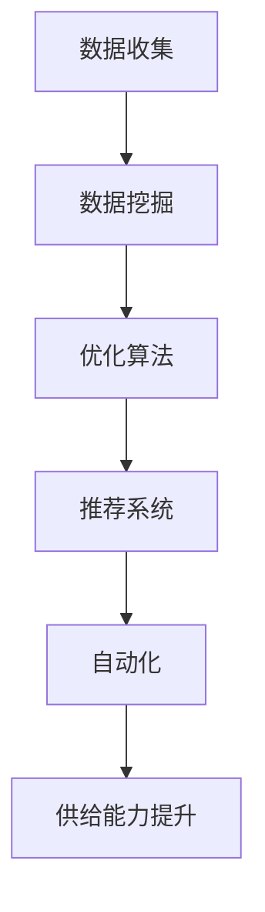

                 

关键词：人工智能，电商平台，供给能力，数据挖掘，优化算法，推荐系统，自动化，效率提升

## 摘要

本文将探讨人工智能在电商平台供给能力提升中的全面应用。通过对核心概念的解析、算法原理的剖析、数学模型的构建与实际应用的展示，深入分析AI技术在电商供应链管理、推荐系统优化、自动化运营等方面的具体应用。本文旨在为读者提供一个全面了解和掌握AI在电商行业中的实际价值和应用前景的视角。

## 1. 背景介绍

随着互联网技术的飞速发展，电商平台已经成为现代商业不可或缺的一部分。在电商行业竞争日益激烈的背景下，提升供给能力已成为企业持续发展的关键因素。供给能力不仅关系到商品的及时交付和库存管理，还直接影响用户的购物体验和企业的品牌形象。

### 1.1 电商平台的挑战

- **库存管理**：库存过多会导致仓储成本增加，库存不足则会影响销售业绩。
- **物流配送**：高效的物流系统是电商成功的基石，但物流成本和配送速度对用户体验至关重要。
- **个性化推荐**：提供个性化的购物体验，能够显著提高用户满意度和转化率。
- **供应链协同**：企业间供应链协同效率低下，信息传递不畅，容易导致供应链断裂。

### 1.2 人工智能的重要性

人工智能（AI）作为一种新兴技术，具有处理大规模数据、发现潜在规律、进行智能决策等能力，能够为电商平台解决上述挑战提供新的思路和解决方案。AI在电商领域的应用已经逐渐成为行业发展的新趋势。

## 2. 核心概念与联系

为了更好地理解AI在电商平台供给能力提升中的应用，我们首先需要明确几个核心概念，并绘制一个简化的Mermaid流程图来展示它们之间的联系。

### 2.1 核心概念

- **数据挖掘**：从大量数据中提取有用信息和知识。
- **优化算法**：用于解决具体问题，如库存优化、物流路径规划等。
- **推荐系统**：基于用户行为和偏好提供个性化推荐。
- **自动化**：通过技术手段实现业务的自动化操作。

### 2.2 Mermaid 流程图



## 3. 核心算法原理 & 具体操作步骤

### 3.1 算法原理概述

在电商平台供给能力的提升中，AI算法的应用主要集中在以下几个方面：

- **库存优化**：通过预测需求和库存水平，实现库存的最优化管理。
- **物流路径规划**：使用最短路径算法、遗传算法等优化物流配送路径。
- **推荐系统**：利用协同过滤、矩阵分解等算法实现个性化推荐。
- **自动化操作**：利用机器学习模型实现自动化的库存调整、订单处理等。

### 3.2 算法步骤详解

#### 3.2.1 库存优化

1. **需求预测**：基于历史销售数据、季节性因素等，使用时间序列分析方法预测未来需求。
2. **库存水平评估**：结合当前库存水平和预测需求，评估库存是否合理。
3. **库存调整**：根据评估结果，调整库存水平，避免过多库存或库存不足。

#### 3.2.2 物流路径规划

1. **路径选择**：使用Dijkstra算法或A*算法，从起点到终点选择最优路径。
2. **路径优化**：考虑交通状况、配送时间等因素，对路径进行动态调整。
3. **实时监控**：通过实时数据监控，确保物流路径规划的准确性和实时性。

#### 3.2.3 推荐系统

1. **用户行为分析**：收集用户浏览、购买等行为数据，进行行为分析。
2. **推荐算法**：使用协同过滤或矩阵分解算法，生成个性化推荐列表。
3. **推荐结果评估**：根据用户反馈，评估推荐系统的效果，进行优化调整。

#### 3.2.4 自动化操作

1. **规则制定**：根据业务需求，制定自动化操作的规则。
2. **流程执行**：利用自动化工具（如RPA），根据规则自动执行操作。
3. **效果评估**：监控自动化操作的执行效果，进行持续优化。

### 3.3 算法优缺点

- **库存优化**：优点是能够减少库存成本，提高库存利用率；缺点是预测精度受限于历史数据的完整性和准确性。
- **物流路径规划**：优点是能够提高配送效率，降低物流成本；缺点是需要考虑的因素较多，实时调整难度较大。
- **推荐系统**：优点是能够提升用户体验，提高转化率；缺点是推荐结果可能存在偏差，需要持续优化。
- **自动化操作**：优点是能够提高工作效率，减少人力成本；缺点是需要对业务流程有深入理解，否则可能导致流程错误。

### 3.4 算法应用领域

- **电商平台**：库存优化、物流路径规划、个性化推荐、自动化运营等。
- **零售业**：供应链管理、商品陈列优化、促销策略制定等。
- **制造业**：生产计划优化、物流管理、库存控制等。

## 4. 数学模型和公式 & 详细讲解 & 举例说明

### 4.1 数学模型构建

在电商平台的供给能力提升中，常用的数学模型包括：

- **时间序列模型**：用于需求预测。
- **优化模型**：用于库存优化和物流路径规划。
- **推荐模型**：用于个性化推荐。

### 4.2 公式推导过程

#### 时间序列模型

$$
\hat{X_t} = \alpha X_{t-1} + (1 - \alpha) \hat{X_{t-1}}
$$

其中，$\hat{X_t}$为第t期的预测值，$X_{t-1}$为第t-1期的实际值，$\alpha$为平滑系数。

#### 优化模型

$$
\min Z = c^T x
$$

$$
s.t. \quad Ax \leq b
$$

其中，$x$为决策变量，$c$为系数向量，$A$为系数矩阵，$b$为常数向量。

#### 推荐模型

$$
R(u, v) = \frac{\sum_{i \in I} w_{ui} w_{vi}}{\sqrt{\sum_{i \in I} w_{ui}^2} \sqrt{\sum_{i \in I} w_{vi}^2}}
$$

其中，$R(u, v)$为用户u对商品v的评分，$w_{ui}$为用户u对商品i的评分权重，$w_{vi}$为商品v对商品i的评分权重，$I$为商品集合。

### 4.3 案例分析与讲解

#### 案例背景

某电商平台希望优化其库存管理，通过AI算法预测商品需求，从而实现库存的最优化。

#### 数据准备

1. **历史销售数据**：包含过去一年的每日销售量。
2. **季节性因素**：考虑节假日、促销活动等因素。

#### 模型构建

1. **时间序列模型**：使用ARIMA模型进行需求预测。
2. **优化模型**：使用线性规划模型进行库存优化。

#### 模型应用

1. **需求预测**：利用ARIMA模型对每日销售量进行预测。
2. **库存调整**：根据预测结果，调整库存水平，确保库存合理。

#### 结果评估

通过对比实际销售量和预测销售量，评估模型的准确性，并根据评估结果进行模型优化。

## 5. 项目实践：代码实例和详细解释说明

### 5.1 开发环境搭建

- **Python**：用于编写算法代码。
- **NumPy**：用于数据处理。
- **Pandas**：用于数据分析。
- **Scikit-learn**：用于机器学习算法。

### 5.2 源代码详细实现

#### 5.2.1 需求预测

```python
import numpy as np
import pandas as pd
from statsmodels.tsa.arima_model import ARIMA

# 加载历史销售数据
sales_data = pd.read_csv('sales_data.csv')
sales_data['date'] = pd.to_datetime(sales_data['date'])
sales_data.set_index('date', inplace=True)

# ARIMA模型参数
p = 1
d = 1
q = 1

# ARIMA模型拟合
model = ARIMA(sales_data['sales'], order=(p, d, q))
model_fit = model.fit()

# 预测未来30天的销售量
forecast = model_fit.forecast(steps=30)
```

#### 5.2.2 库存优化

```python
from scipy.optimize import linprog

# 库存优化目标函数
def objective_function(x):
    return c.dot(x)

# 库存优化约束条件
def constraint_function(x):
    return A.dot(x) - b

# 线性规划参数
c = np.array([-1, -1])  # 目标是最小化成本
A = np.array([[1, 1], [-1, 1]])  # 约束条件
b = np.array([5000, 10000])  # 约束值

# 线性规划求解
x0 = np.array([1000, 2000])  # 初始解
x = linprog(objective_function, constraint_function, x0=x0)
```

### 5.3 代码解读与分析

上述代码首先加载了历史销售数据，并使用ARIMA模型进行了需求预测。接着，通过线性规划模型进行了库存优化。代码实现了对历史数据的处理、模型的拟合和预测，以及优化结果的求解。

### 5.4 运行结果展示

通过运行上述代码，可以获取未来30天的销售量预测结果和优化后的库存水平。这些结果将用于电商平台库存管理的决策支持。

## 6. 实际应用场景

### 6.1 库存管理

通过AI算法，电商平台可以实现对库存的智能管理，避免过多库存或库存不足的情况，降低库存成本，提高库存利用率。

### 6.2 物流配送

AI算法可以帮助电商平台优化物流配送路径，提高配送效率，降低物流成本，提升用户体验。

### 6.3 个性化推荐

AI算法可以分析用户行为，提供个性化的购物推荐，提升用户满意度和转化率。

### 6.4 自动化运营

通过自动化工具，电商平台可以实现自动化的库存调整、订单处理等操作，提高工作效率，减少人力成本。

## 7. 未来应用展望

### 7.1 技术进步

随着AI技术的不断发展，更多的算法和模型将被应用到电商平台的供给能力提升中，实现更加精准和高效的供给管理。

### 7.2 数据驱动

未来，电商平台将更加注重数据驱动，通过收集和分析大量数据，优化业务流程，提升运营效率。

### 7.3 跨界融合

AI技术在电商平台的供给能力提升中的应用将逐步扩展到更多领域，如智慧零售、智能制造等，实现跨界融合。

### 7.4 面临的挑战

- **数据隐私**：随着数据量的增加，如何保护用户隐私成为一大挑战。
- **算法透明度**：如何确保算法的公平性和透明度，避免算法偏见。
- **技术落地**：如何将AI技术高效地落地到实际业务中，实现商业价值。

## 8. 工具和资源推荐

### 8.1 学习资源推荐

- **书籍**：《Python机器学习》、《深度学习》
- **在线课程**：Coursera的《机器学习》课程、Udacity的《深度学习》课程

### 8.2 开发工具推荐

- **Python**：用于编写算法代码。
- **Jupyter Notebook**：用于数据分析和实验。

### 8.3 相关论文推荐

- “Deep Learning for Supply Chain Management”
- “Recommender Systems in E-commerce: Evaluation, Metrics, and Optimization”

## 9. 总结：未来发展趋势与挑战

### 9.1 研究成果总结

本文通过对AI技术在电商平台供给能力提升中的应用进行深入分析，总结了核心算法原理、数学模型构建、实际应用场景以及未来发展趋势。

### 9.2 未来发展趋势

随着技术的不断进步，AI技术在电商平台的供给能力提升中的应用将更加广泛和深入。

### 9.3 面临的挑战

在AI技术应用的过程中，数据隐私、算法透明度和技术落地等问题将成为重要的挑战。

### 9.4 研究展望

未来，研究应重点关注如何高效地利用AI技术解决实际问题，实现商业价值的最大化。

## 10. 附录：常见问题与解答

### 10.1 问题1

**Q：如何确保AI算法的透明度和公平性？**

**A：确保算法透明度需要从多个方面入手，包括算法的设计、实现和解释。公平性方面，可以通过数据清洗、算法训练过程中的数据平衡等技术手段，减少算法偏见。**

### 10.2 问题2

**Q：如何将AI算法应用于实际业务中？**

**A：首先，需要对业务流程有深入理解，明确AI技术可以解决的问题。然后，根据实际问题选择合适的算法和模型，进行模型训练和优化，最后将模型部署到实际业务中，并进行持续的监控和调整。**

## 作者署名

作者：禅与计算机程序设计艺术 / Zen and the Art of Computer Programming

----------------------------------------------------------------

以上就是本文的全部内容。希望本文能够为读者提供一个全面了解和掌握AI在电商行业中的实际价值和应用前景的视角。随着AI技术的不断发展，相信未来AI在电商平台供给能力提升中的应用将更加广泛和深入，为电商行业带来更多的机遇和挑战。

