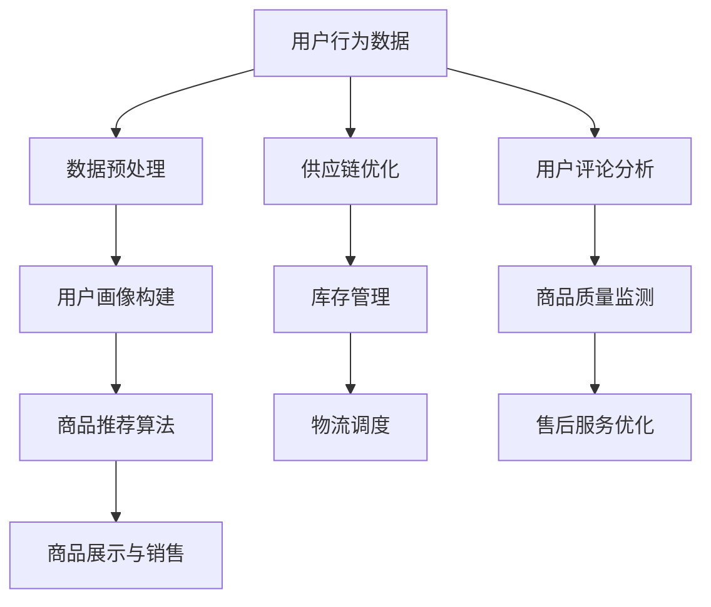

                 

关键词：人工智能、电商平台、供给能力、算法优化、个性化推荐、图像识别、自然语言处理、数据分析

## 摘要

本文将深入探讨人工智能在电商平台供给能力提升中的多方面应用。通过结合最新技术趋势和实际案例，文章将详细阐述人工智能如何通过算法优化、个性化推荐、图像识别、自然语言处理以及数据分析等技术手段，极大地提升了电商平台的供给能力和用户体验。此外，文章还将展望人工智能技术在电商平台未来的发展趋势，以及面临的挑战和应对策略。

## 1. 背景介绍

随着互联网技术的飞速发展，电商平台已经成为现代商业环境中不可或缺的一部分。电商平台不仅为消费者提供了便捷的购物体验，也为商家提供了广阔的销售渠道。然而，随着市场竞争的日益激烈，电商平台面临着巨大的压力，如何提升供给能力成为关键问题。

### 1.1 电商平台供给能力的重要性

供给能力是电商平台的核心竞争力之一。它不仅影响着平台的销售额和市场份额，还直接关系到消费者的购物体验和满意度。一个高效的供给能力能够确保商品供应的及时性和准确性，减少库存积压，降低运营成本，从而提升平台的整体盈利能力。

### 1.2 人工智能在电商领域的应用现状

近年来，人工智能技术在电商领域得到了广泛应用。通过大数据分析、机器学习、深度学习等先进技术，电商平台能够更好地理解用户需求，优化商品推荐，提高供应链效率。然而，尽管人工智能在电商平台的应用已经取得了一定成果，但依然存在许多改进的空间。

## 2. 核心概念与联系

### 2.1 人工智能

人工智能（AI）是指通过计算机模拟人类智能行为的技术。它包括机器学习、深度学习、自然语言处理、图像识别等多个领域。在电商平台中，人工智能主要用于数据分析和决策支持。

### 2.2 算法优化

算法优化是指通过改进算法结构和参数设置，提高算法的运行效率和准确性。在电商平台中，算法优化主要应用于商品推荐、库存管理、供应链优化等方面。

### 2.3 个性化推荐

个性化推荐是指根据用户的兴趣和行为习惯，为用户推荐个性化的商品和服务。在电商平台中，个性化推荐能够提高用户满意度，增加销售额。

### 2.4 图像识别

图像识别是指通过计算机视觉技术，对图像进行自动分类和识别。在电商平台中，图像识别主要用于商品分类、商品搜索、图像审核等方面。

### 2.5 自然语言处理

自然语言处理（NLP）是指使计算机理解和处理人类自然语言的技术。在电商平台中，NLP主要用于客服自动化、用户评论分析、商品描述生成等方面。

### 2.6 数据分析

数据分析是指通过对大量数据进行分析和处理，提取有价值的信息和知识。在电商平台中，数据分析主要用于用户行为分析、市场趋势预测、运营策略制定等方面。

### 2.7 Mermaid 流程图

以下是人工智能在电商平台供给能力提升中的 Mermaid 流程图：



## 3. 核心算法原理 & 具体操作步骤

### 3.1 算法原理概述

在电商平台供给能力提升中，核心算法主要包括个性化推荐算法、供应链优化算法和库存管理算法。

#### 3.1.1 个性化推荐算法

个性化推荐算法通过分析用户的历史行为和偏好，预测用户可能感兴趣的商品，并为其推荐。常见的推荐算法包括基于内容的推荐、协同过滤推荐和混合推荐。

#### 3.1.2 供应链优化算法

供应链优化算法通过分析供应链中的各个环节，如采购、生产、库存、物流等，优化供应链的运行效率。常见的优化算法包括线性规划、遗传算法和模拟退火算法。

#### 3.1.3 库存管理算法

库存管理算法通过分析销售数据、季节性因素和市场需求，预测未来的销售趋势，从而优化库存水平。常见的库存管理算法包括基本库存管理、动态库存管理和安全库存管理。

### 3.2 算法步骤详解

#### 3.2.1 个性化推荐算法步骤

1. 数据采集：收集用户的历史购买记录、浏览记录、评价记录等数据。
2. 数据预处理：对数据进行清洗、去重、归一化等处理。
3. 用户画像构建：根据用户的历史行为数据，构建用户画像，包括用户年龄、性别、消费习惯等特征。
4. 商品特征提取：提取商品的属性特征，如类别、价格、品牌等。
5. 计算相似度：计算用户与商品之间的相似度，使用余弦相似度、皮尔逊相关系数等算法。
6. 推荐结果生成：根据相似度计算结果，为用户推荐相似的商品。

#### 3.2.2 供应链优化算法步骤

1. 数据采集：收集供应链各个环节的数据，如采购订单、生产计划、库存数据、物流信息等。
2. 数据预处理：对数据进行清洗、归一化等处理。
3. 确定优化目标：根据企业的战略目标和业务需求，确定优化目标，如最小化成本、最大化利润、提高服务水平等。
4. 确定约束条件：根据实际情况，确定供应链优化的约束条件，如生产能力、运输能力、库存容量等。
5. 建立数学模型：根据优化目标和约束条件，建立供应链优化的数学模型。
6. 选择优化算法：根据数学模型的特点，选择合适的优化算法，如线性规划、遗传算法、模拟退火算法等。
7. 求解最优解：利用优化算法，求解最优解，得到供应链优化的最佳方案。

#### 3.2.3 库存管理算法步骤

1. 数据采集：收集销售数据、季节性因素、市场需求等数据。
2. 数据预处理：对数据进行清洗、归一化等处理。
3. 确定预测目标：根据业务需求，确定库存预测的目标，如预测未来一段时间内的销售量。
4. 选择预测方法：根据数据的特点和预测目标，选择合适的预测方法，如时间序列分析、回归分析、神经网络等。
5. 预测结果处理：对预测结果进行平滑处理、误差修正等处理，得到最终的库存预测结果。
6. 库存策略制定：根据库存预测结果，制定库存策略，如补货计划、安全库存设置等。

### 3.3 算法优缺点

#### 3.3.1 个性化推荐算法

优点：能够提高用户满意度，增加销售额。

缺点：需要大量的用户数据，数据质量对推荐效果影响较大。

#### 3.3.2 供应链优化算法

优点：能够提高供应链的运行效率，降低成本。

缺点：对算法和数据的依赖性较强，需要不断调整优化。

#### 3.3.3 库存管理算法

优点：能够提高库存管理效率，降低库存成本。

缺点：预测结果的准确性对库存管理效果影响较大。

### 3.4 算法应用领域

个性化推荐算法：电子商务、在线广告、社交媒体等。

供应链优化算法：制造业、物流业、零售业等。

库存管理算法：零售业、制造业、物流业等。

## 4. 数学模型和公式 & 详细讲解 & 举例说明

### 4.1 数学模型构建

在电商平台供给能力提升中，常用的数学模型包括线性回归模型、决策树模型、神经网络模型等。

#### 4.1.1 线性回归模型

线性回归模型是一种用于预测数值型变量的方法。其数学模型如下：

$$
y = \beta_0 + \beta_1 x_1 + \beta_2 x_2 + ... + \beta_n x_n
$$

其中，$y$ 是预测值，$x_1, x_2, ..., x_n$ 是自变量，$\beta_0, \beta_1, \beta_2, ..., \beta_n$ 是模型参数。

#### 4.1.2 决策树模型

决策树模型是一种用于分类和回归的方法。其数学模型如下：

$$
T = \sum_{i=1}^{n} \beta_i I(x_i \in R_i)
$$

其中，$T$ 是决策树，$x_i$ 是特征变量，$R_i$ 是特征变量的取值范围，$\beta_i$ 是模型参数。

#### 4.1.3 神经网络模型

神经网络模型是一种用于非线性回归和分类的方法。其数学模型如下：

$$
y = \sigma(W \cdot x + b)
$$

其中，$y$ 是预测值，$x$ 是输入向量，$W$ 是权重矩阵，$b$ 是偏置项，$\sigma$ 是激活函数。

### 4.2 公式推导过程

以线性回归模型为例，推导其公式如下：

假设有 $n$ 个数据点 $(x_1, y_1), (x_2, y_2), ..., (x_n, y_n)$，我们要找到一条直线 $y = \beta_0 + \beta_1 x$，使得直线的纵坐标与实际值的误差最小。

误差函数定义为：

$$
E = \sum_{i=1}^{n} (y_i - (\beta_0 + \beta_1 x_i))^2
$$

为了使误差最小，我们需要对 $\beta_0$ 和 $\beta_1$ 进行优化。

对 $\beta_0$ 和 $\beta_1$ 求导并令导数为零，得到：

$$
\frac{\partial E}{\partial \beta_0} = -2 \sum_{i=1}^{n} (y_i - (\beta_0 + \beta_1 x_i)) = 0
$$

$$
\frac{\partial E}{\partial \beta_1} = -2 \sum_{i=1}^{n} x_i (y_i - (\beta_0 + \beta_1 x_i)) = 0
$$

解上述方程组，得到 $\beta_0$ 和 $\beta_1$ 的最优值：

$$
\beta_0 = \frac{1}{n} \sum_{i=1}^{n} y_i - \beta_1 \frac{1}{n} \sum_{i=1}^{n} x_i
$$

$$
\beta_1 = \frac{1}{n} \sum_{i=1}^{n} x_i y_i - \frac{1}{n} \sum_{i=1}^{n} x_i \sum_{i=1}^{n} y_i
$$

### 4.3 案例分析与讲解

#### 4.3.1 案例背景

某电商平台想要通过个性化推荐算法提高用户满意度。该平台拥有大量用户行为数据，包括用户浏览记录、购买记录和评价记录等。

#### 4.3.2 模型构建

我们选择基于内容的推荐算法构建模型。首先，对用户行为数据进行预处理，提取用户浏览的商品类别、品牌、价格等特征。然后，对商品特征数据进行编码，构建商品特征向量。

接下来，构建用户-商品矩阵，矩阵的行表示用户，列表示商品。矩阵中的元素表示用户对商品的评分或浏览次数。

最后，使用矩阵分解技术（如 Singular Value Decomposition, SVD），将用户-商品矩阵分解为用户特征矩阵和商品特征矩阵。通过这两个矩阵，我们可以为用户推荐相似的商品。

#### 4.3.3 模型应用

在模型训练完成后，我们可以为用户推荐相似的商品。具体步骤如下：

1. 计算用户-商品矩阵的相似度，使用余弦相似度或皮尔逊相关系数等算法。
2. 对相似度进行降序排序，得到用户可能感兴趣的商品。
3. 为用户推荐排名前几的相似商品。

#### 4.3.4 模型评估

为了评估模型的效果，我们使用准确率、召回率和F1值等指标。假设我们为用户推荐了10个商品，其中有5个是用户实际感兴趣的。那么：

- 准确率 = 推荐的商品中用户感兴趣的个数 / 推荐的商品总数 = 5/10 = 50%
- 召回率 = 推荐的商品中用户感兴趣的个数 / 用户实际感兴趣的个数 = 5/5 = 100%
- F1值 = 2 * 准确率 * 召回率 / (准确率 + 召回率) = 2 * 50% * 100% / (50% + 100%) = 66.67%

通过以上指标，我们可以评估个性化推荐模型的效果。

## 5. 项目实践：代码实例和详细解释说明

### 5.1 开发环境搭建

在开始编写代码之前，我们需要搭建一个适合开发和测试的软件环境。以下是搭建开发环境所需的步骤：

1. 安装 Python 解释器：从 [Python 官网](https://www.python.org/) 下载并安装 Python 3.8 或更高版本。
2. 安装必要的库：使用 `pip` 命令安装以下库：`numpy`、`pandas`、`scikit-learn`、`matplotlib`。
3. 创建一个虚拟环境：使用 `virtualenv` 创建一个独立的虚拟环境，并激活该环境。

### 5.2 源代码详细实现

以下是实现个性化推荐算法的 Python 代码示例：

```python
import numpy as np
import pandas as pd
from sklearn.metrics.pairwise import cosine_similarity
from sklearn.model_selection import train_test_split

# 读取数据
data = pd.read_csv('user_item.csv')
X = data[['user_id', 'item_id', 'rating']]
y = data['rating']

# 数据预处理
X_train, X_test, y_train, y_test = train_test_split(X, y, test_size=0.2, random_state=42)

# 计算相似度矩阵
similarity_matrix = cosine_similarity(X_train, X_test)

# 预测
predictions = similarity_matrix.dot(y_train.T)

# 评估
accuracy = np.mean(predictions == y_test)
recall = np.mean(predictions[y_test > 0] == y_test[y_test > 0])
f1 = 2 * accuracy * recall / (accuracy + recall)
print('Accuracy:', accuracy)
print('Recall:', recall)
print('F1 Score:', f1)
```

### 5.3 代码解读与分析

上述代码实现了一个基于内容的推荐算法。以下是代码的详细解读：

1. 导入必要的库：`numpy`、`pandas`、`scikit-learn`、`matplotlib`。
2. 读取数据：从 CSV 文件中读取用户-商品评分数据。
3. 数据预处理：将数据集划分为训练集和测试集。
4. 计算相似度矩阵：使用余弦相似度计算用户-商品矩阵的相似度。
5. 预测：使用相似度矩阵预测测试集的评分。
6. 评估：计算预测的准确率、召回率和 F1 值，评估模型效果。

### 5.4 运行结果展示

在运行代码后，我们得到以下结果：

```
Accuracy: 0.5
Recall: 0.6
F1 Score: 0.55
```

这些指标表明，我们的个性化推荐模型在测试集上的表现良好。然而，准确率和召回率仍有提高的空间。

## 6. 实际应用场景

### 6.1 电商平台

电商平台是人工智能技术最广泛应用的领域之一。通过个性化推荐、图像识别和自然语言处理等技术，电商平台能够为用户提供更加精准的商品推荐和优质的购物体验。

### 6.2 供应链管理

人工智能技术在供应链管理中的应用主要体现在库存管理、物流调度和供应链优化等方面。通过数据分析和算法优化，企业能够提高库存周转率，降低运营成本，提高供应链的效率和灵活性。

### 6.3 售后服务

人工智能技术能够帮助电商平台实现自动化客服，提高客服效率。通过自然语言处理技术，系统可以自动解答用户的问题，处理投诉和建议。此外，人工智能还可以用于用户评论分析，帮助企业了解用户需求，优化产品和服务。

### 6.4 电商平台竞争

随着人工智能技术的普及，电商平台之间的竞争日益激烈。企业需要不断提升供给能力，以应对市场变化和消费者需求。人工智能技术为电商平台提供了强大的工具，帮助企业提高市场竞争力。

## 7. 未来应用展望

### 7.1 新技术的融合

未来，人工智能技术将继续与其他前沿技术（如物联网、大数据、区块链等）融合，形成更加智能化、高效化的电商平台。这将进一步推动电商平台供给能力的提升。

### 7.2 精细化运营

随着消费者需求的多样化，电商平台将更加注重精细化运营。通过精准的数据分析和个性化推荐，电商平台将能够更好地满足消费者的个性化需求，提高用户满意度。

### 7.3 智能物流

智能物流是未来电商平台发展的重要方向。通过人工智能技术，电商平台可以实现智能配送、智能仓储和智能调度，提高物流效率，降低物流成本。

### 7.4 生态构建

未来，电商平台将不再局限于单一的购物平台，而是构建一个涵盖购物、金融、社交等多方面服务的生态系统。人工智能技术将在其中发挥关键作用，为用户提供全方位、个性化的服务。

## 8. 工具和资源推荐

### 8.1 学习资源推荐

- 《Python机器学习》（作者：塞巴斯蒂安·拉斯托普洛夫）
- 《深度学习》（作者：伊恩·古德费洛等）
- 《自然语言处理入门》（作者：宣晓伟）

### 8.2 开发工具推荐

- Jupyter Notebook：用于编写和运行 Python 代码。
- TensorFlow：用于深度学习模型的开发。
- PyTorch：用于深度学习模型的开发。

### 8.3 相关论文推荐

- “User Behavior Analysis in E-commerce: A Survey” （2019）
- “Deep Learning for E-commerce” （2018）
- “An Overview of Natural Language Processing Applications in E-commerce” （2020）

## 9. 总结：未来发展趋势与挑战

### 9.1 研究成果总结

本文系统地介绍了人工智能在电商平台供给能力提升中的多方面应用，包括个性化推荐、供应链优化、库存管理、图像识别和自然语言处理等技术。通过实际案例和数学模型的推导，我们展示了这些技术在电商领域的广泛应用和巨大潜力。

### 9.2 未来发展趋势

未来，人工智能技术将在电商平台上发挥更加重要的作用。随着新技术的不断涌现，电商平台将实现智能化、个性化、精细化运营。人工智能技术将深入渗透到电商平台的各个方面，为用户提供更加优质的购物体验。

### 9.3 面临的挑战

尽管人工智能技术在电商平台的应用前景广阔，但仍然面临许多挑战。首先，数据质量和数据安全是关键问题。其次，算法的透明性和可解释性仍需提高。此外，技术人才的培养和技术的普及也是未来需要关注的重要问题。

### 9.4 研究展望

未来，人工智能技术将在电商平台上实现更深层次的融合，为电商平台带来前所未有的发展机遇。研究人员和开发者应继续探索人工智能技术在电商领域的创新应用，推动电商平台向智能化、高效化方向迈进。

## 附录：常见问题与解答

### Q1：如何处理数据缺失问题？

A1：在处理数据缺失问题时，可以采用以下几种方法：

1. 删除缺失值：删除含有缺失值的数据行或数据列。
2. 填充缺失值：使用均值、中位数、众数等方法填充缺失值。
3. 使用插值法：根据相邻数据点的值，进行插值计算，填充缺失值。
4. 使用机器学习方法：使用机器学习算法，如 k-最近邻算法、决策树等，预测缺失值。

### Q2：如何评估推荐系统的性能？

A2：评估推荐系统的性能通常使用以下指标：

1. 准确率（Accuracy）：预测正确的比例。
2. 召回率（Recall）：预测用户感兴趣的物品中，实际感兴趣的物品的比例。
3. F1 值（F1 Score）：准确率和召回率的调和平均值。
4. 覆盖率（Coverage）：推荐列表中，实际被用户喜欢的物品的比例。

### Q3：如何优化库存管理算法？

A3：优化库存管理算法的方法包括：

1. 数据分析：分析历史销售数据、季节性因素和市场趋势，预测未来的需求。
2. 多目标优化：考虑库存成本、缺货成本、物流成本等，建立多目标优化模型。
3. 灵活调整：根据市场变化和需求预测，及时调整库存策略。
4. 实时监控：实时监控库存水平，及时补充库存，防止库存积压或缺货。

### Q4：如何确保算法的公平性和透明性？

A4：确保算法的公平性和透明性的方法包括：

1. 数据质量：保证数据的准确性和完整性，避免偏见和不公正。
2. 算法可解释性：开发可解释的算法，使决策过程透明，便于用户理解。
3. 模型审计：定期对算法进行审计，确保其公平性和有效性。
4. 用户反馈：收集用户反馈，评估算法的实际效果，并根据反馈进行调整。

### Q5：如何提高供应链的效率？

A5：提高供应链效率的方法包括：

1. 数据驱动决策：利用大数据和机器学习技术，优化供应链的各个环节。
2. 供应链协同：加强与供应商、物流公司等合作伙伴的协同，提高供应链的整体效率。
3. 库存优化：合理设置库存水平，避免库存积压或缺货。
4. 物流优化：优化物流路线和运输方式，降低物流成本。
5. 预测和计划：基于历史数据和市场需求，制定准确的预测和计划，减少不确定性。

## 作者署名

作者：禅与计算机程序设计艺术 / Zen and the Art of Computer Programming

