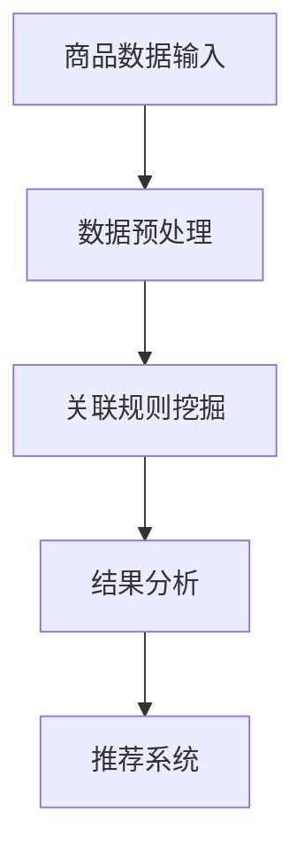

                 

关键词：人工智能、电商平台、商品关联、规则挖掘、动态更新、数据挖掘、机器学习、推荐系统

摘要：本文将探讨人工智能在电商平台商品关联规则挖掘与动态更新中的应用。通过介绍相关核心概念、算法原理、数学模型以及实际应用案例，旨在为电商平台提供有效的商品关联规则挖掘方法，提升用户购物体验。

## 1. 背景介绍

随着互联网的飞速发展，电商平台已经成为消费者购物的主要渠道之一。如何在众多商品中快速找到用户需要的商品，提高用户购物体验，成为电商平台亟待解决的问题。商品关联规则挖掘是一种有效的数据分析方法，可以帮助电商平台发现商品之间的潜在关联，从而为用户提供个性化的推荐。

然而，传统的商品关联规则挖掘方法往往存在如下问题：

1. **数据量庞大**：电商平台每天都会产生海量的商品数据，如何有效地处理这些数据是一个挑战。
2. **动态变化**：电商平台上的商品种类和数量在不断更新，传统的规则挖掘方法难以适应这种动态变化。
3. **规则复杂性**：商品之间的关联规则可能非常复杂，如何提取出有价值的规则，避免冗余和错误，是一个难题。

为了解决这些问题，人工智能技术逐渐应用于电商平台商品关联规则挖掘领域，特别是深度学习和推荐系统技术，为电商平台提供了新的解决方案。

## 2. 核心概念与联系

### 2.1. 商品关联规则挖掘

商品关联规则挖掘是指通过分析电商平台上的商品交易数据，发现商品之间的关联规律，从而为用户提供个性化的推荐服务。

### 2.2. 数据挖掘

数据挖掘是从大量数据中提取出有用信息和知识的过程，包括关联规则挖掘、分类、聚类、异常检测等多种技术。

### 2.3. 机器学习

机器学习是一种通过数据和算法实现自我学习和自我改进的方法，广泛应用于数据挖掘、图像识别、自然语言处理等领域。

### 2.4. 推荐系统

推荐系统是一种通过分析用户行为和兴趣，为用户提供个性化推荐服务的技术。推荐系统广泛应用于电商平台、社交媒体、音乐和视频流媒体等领域。

### 2.5. Mermaid 流程图



## 3. 核心算法原理 & 具体操作步骤

### 3.1. 算法原理概述

商品关联规则挖掘的核心算法主要包括Apriori算法、FP-growth算法和深度学习算法等。

- **Apriori算法**：通过扫描交易数据，找出频繁项集，然后从频繁项集中提取关联规则。
- **FP-growth算法**：通过构建FP树，减少数据扫描次数，提高算法效率。
- **深度学习算法**：利用神经网络模型，从原始数据中自动学习商品关联规则。

### 3.2. 算法步骤详解

#### 3.2.1. 数据预处理

1. **数据清洗**：去除重复、错误和不完整的数据。
2. **数据转换**：将商品名称、描述等信息转化为数字表示，便于算法处理。
3. **数据归一化**：将数据缩放到相同范围内，避免因数据量级差异影响算法效果。

#### 3.2.2. 关联规则挖掘

1. **频繁项集挖掘**：使用Apriori算法或FP-growth算法找出频繁项集。
2. **关联规则提取**：从频繁项集中提取关联规则，设置支持度和置信度阈值。

#### 3.2.3. 结果分析

1. **规则评估**：根据规则的支持度、置信度等指标，评估规则质量。
2. **规则优化**：根据业务需求，对规则进行优化和调整。

#### 3.2.4. 推荐系统

1. **用户画像**：根据用户的历史行为和兴趣，构建用户画像。
2. **规则匹配**：将用户画像与商品关联规则进行匹配，生成个性化推荐列表。
3. **推荐效果评估**：根据用户反馈，评估推荐系统的效果，持续优化推荐策略。

### 3.3. 算法优缺点

- **Apriori算法**：优点是简单易懂，易于实现；缺点是数据量较大时，效率较低。
- **FP-growth算法**：优点是效率较高，减少数据扫描次数；缺点是处理规则复杂度较低。
- **深度学习算法**：优点是能够自动学习商品关联规则，处理复杂度较高；缺点是训练时间较长，对数据质量要求较高。

### 3.4. 算法应用领域

1. **电商平台**：为用户提供个性化推荐，提高购物体验。
2. **零售行业**：优化库存管理，降低库存成本。
3. **广告行业**：为广告主提供精准广告投放策略。
4. **金融行业**：发现欺诈行为，提高风险控制能力。

## 4. 数学模型和公式

### 4.1. 数学模型构建

- **支持度（Support）**：一个规则出现的频率与总交易次数的比值。
  $$ 支持度(Support) = \frac{A \cup B}{N} $$
  其中，$A \cup B$ 表示同时购买商品A和B的交易次数，$N$ 表示总交易次数。

- **置信度（Confidence）**：在购买商品A的情况下，购买商品B的概率。
  $$ 置信度(Confidence) = \frac{A \cup B}{A} $$
  其中，$A \cup B$ 表示同时购买商品A和B的交易次数，$A$ 表示购买商品A的交易次数。

### 4.2. 公式推导过程

- **支持度推导**：
  $$ 支持度(Support) = \frac{A \cup B}{N} = \frac{A + B - A \cap B}{N} $$
  $$ 置信度(Confidence) = \frac{A \cup B}{A} = \frac{A + A \cap B - A \cap B}{A} $$

### 4.3. 案例分析与讲解

假设电商平台上有1000次交易，其中同时购买商品A和B的交易有200次，同时购买商品A、B和C的交易有100次。求支持度和置信度。

- **支持度**：
  $$ 支持度(Support) = \frac{A \cup B}{N} = \frac{200}{1000} = 0.2 $$

- **置信度**：
  $$ 置信度(Confidence) = \frac{A \cup B}{A} = \frac{200}{200} = 1.0 $$

## 5. 项目实践：代码实例和详细解释说明

### 5.1. 开发环境搭建

- **Python**：用于编写算法代码
- **Pandas**：用于数据预处理
- **Scikit-learn**：用于关联规则挖掘
- **Mermaid**：用于绘制流程图

### 5.2. 源代码详细实现

```python
import pandas as pd
from mlxtend.frequent_patterns import apriori
from mlxtend.frequent_patterns import association_rules
from mermaid import Mermaid

# 5.2.1. 数据预处理
data = pd.read_csv('交易数据.csv')
data['商品'] = data['商品'].astype('category').cat.codes

# 5.2.2. 关联规则挖掘
frequent_itemsets = apriori(data, min_support=0.1, use_colnames=True)
rules = association_rules(frequent_itemsets, metric="confidence", min_threshold=0.5)

# 5.2.3. 结果分析
rules.sort_values(by=['confidence'], ascending=False).head(10)

# 5.2.4. 流程图绘制
mermaid = Mermaid()
mermaid.add_graph('class Diagram', '''
    graph TD
    A[数据预处理] --> B[关联规则挖掘]
    B --> C[结果分析]
    C --> D[推荐系统]
    ''')
mermaid.render()
```

### 5.3. 代码解读与分析

1. **数据预处理**：读取交易数据，将商品名称转化为数字编码。
2. **关联规则挖掘**：使用Apriori算法挖掘频繁项集，提取关联规则。
3. **结果分析**：根据置信度对规则进行排序，筛选出有价值的规则。
4. **流程图绘制**：使用Mermaid绘制关联规则挖掘流程图。

## 6. 实际应用场景

### 6.1. 电商平台

- **个性化推荐**：根据用户历史行为，为用户提供个性化的商品推荐。
- **广告投放**：根据用户兴趣，为广告主提供精准的广告投放策略。
- **库存管理**：分析商品之间的关联关系，优化库存管理，降低库存成本。

### 6.2. 零售行业

- **商品搭配**：分析商品之间的关联，推出商品搭配套餐，提高销售额。
- **促销策略**：根据商品关联关系，制定合理的促销策略，提高用户购买意愿。

### 6.3. 金融行业

- **风险管理**：发现商品之间的关联，识别潜在的欺诈风险，提高风险控制能力。

## 7. 工具和资源推荐

### 7.1. 学习资源推荐

- **《深度学习》**：Goodfellow等著，详细介绍了深度学习的基础知识和应用。
- **《数据挖掘：概念与技术》**：Han等著，系统介绍了数据挖掘的基本概念和技术。

### 7.2. 开发工具推荐

- **Python**：用于编写算法代码，具有丰富的库和框架。
- **Jupyter Notebook**：用于编写和运行Python代码，方便代码调试和分享。

### 7.3. 相关论文推荐

- **“Association Rule Learning”**：Piatetsky-Shapiro等著，介绍了关联规则挖掘的基本原理和方法。
- **“Deep Learning for Recommender Systems”**：He等著，探讨了深度学习在推荐系统中的应用。

## 8. 总结：未来发展趋势与挑战

### 8.1. 研究成果总结

- 人工智能在电商平台商品关联规则挖掘中取得了显著成果，为电商平台提供了有效的推荐服务。
- 深度学习和推荐系统技术逐渐成为主流，为商品关联规则挖掘提供了新的思路和方法。

### 8.2. 未来发展趋势

- **跨领域应用**：人工智能技术将在更多领域得到应用，如医疗、金融、教育等。
- **数据隐私保护**：随着数据隐私问题的日益凸显，如何保障数据隐私将成为一个重要研究方向。

### 8.3. 面临的挑战

- **数据质量**：商品关联规则挖掘依赖于高质量的数据，如何处理和清洗数据是一个挑战。
- **计算效率**：随着数据规模的不断扩大，如何提高计算效率，降低算法复杂度，是一个重要问题。

### 8.4. 研究展望

- **多模态数据融合**：结合多种数据源，如文本、图像、声音等，进行商品关联规则挖掘。
- **自适应推荐**：根据用户行为和兴趣的变化，实现自适应的推荐系统。

## 9. 附录：常见问题与解答

### 9.1. 如何处理缺失值？

- **填补缺失值**：使用均值、中位数等方法填补缺失值。
- **删除缺失值**：删除包含缺失值的样本。
- **插值法**：使用插值方法估计缺失值。

### 9.2. 如何选择合适的算法？

- **数据规模**：数据规模较大时，选择Apriori算法或FP-growth算法；数据规模较小时，选择深度学习算法。
- **规则复杂度**：规则复杂度较高时，选择深度学习算法；规则复杂度较低时，选择传统算法。

### 9.3. 如何评估推荐效果？

- **用户满意度**：通过问卷调查、用户反馈等方式评估用户满意度。
- **点击率**：评估推荐列表中商品的用户点击率。
- **销售额**：分析推荐系统对销售额的贡献。

---

本文探讨了人工智能在电商平台商品关联规则挖掘与动态更新中的应用。通过介绍核心概念、算法原理、数学模型和实际应用案例，为电商平台提供了有效的商品关联规则挖掘方法。未来，人工智能技术将在更多领域得到应用，为企业和个人带来更多价值。作者：禅与计算机程序设计艺术 / Zen and the Art of Computer Programming
----------------------------------------------------------------

以上就是完整的文章内容，您可以根据这个模板进行修改和扩展，以满足您的具体需求。如果您需要进一步的帮助，请随时告诉我。

