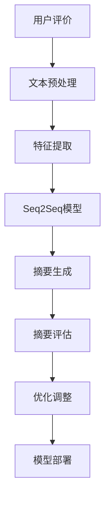

                 

关键词：人工智能，电商平台，商品评价摘要，深度学习，自然语言处理，机器学习，NLP，文本摘要

## 摘要

本文主要探讨人工智能在电商平台商品评价摘要生成中的应用。随着电商平台的快速发展，用户生成的大量商品评价信息不仅对其他潜在消费者有参考价值，也为商家提供了宝贵的反馈。然而，面对海量的评价数据，用户很难快速获取到关键信息。为了解决这个问题，本文介绍了一种基于深度学习和自然语言处理技术的商品评价摘要生成方法。通过构建数学模型和具体实现算法，本文展示了如何从大量商品评价中提取出具有代表性的摘要，为用户提供简洁明了的参考信息。

## 1. 背景介绍

### 1.1 电商平台的发展现状

随着互联网技术的飞速发展，电商平台已经成为现代商业的重要组成部分。电商平台不仅为消费者提供了便捷的购物体验，也为商家提供了广阔的销售渠道。根据统计数据显示，全球电商市场规模已经突破了万亿美元大关，并且仍在持续增长。

电商平台的发展离不开用户生成的内容，尤其是商品评价。商品评价是消费者对商品质量、性能、价格等方面的真实反馈，对其他消费者的购买决策具有重要影响。同时，商品评价也为商家提供了宝贵的市场洞察和改进建议，有助于提升商品质量和用户体验。

### 1.2 商品评价摘要的重要性

在电商平台上，用户生成的大量商品评价信息对其他消费者具有极高的参考价值。然而，面对海量的评价数据，用户很难在短时间内浏览完毕，从而难以获取到关键信息。因此，对商品评价进行摘要处理，提取出关键信息，显得尤为重要。

商品评价摘要不仅能够帮助用户快速了解商品的整体评价，还可以为商家提供更加精准的市场反馈。具体来说，商品评价摘要具有以下几个方面的作用：

1. **提高用户体验**：通过简洁明了的摘要，用户可以快速获取商品的核心评价，节省阅读时间，提高购物决策效率。
2. **提升商家洞察力**：商家可以通过摘要了解用户对商品的具体反馈，发现潜在的问题和改进点，从而优化商品质量和用户体验。
3. **促进平台内容丰富度**：商品评价摘要可以为电商平台提供更多有价值的内容，提升平台的内容丰富度和用户粘性。

### 1.3 人工智能在商品评价摘要生成中的应用

人工智能，特别是深度学习和自然语言处理技术，为商品评价摘要生成提供了强大的技术支持。深度学习模型具有强大的特征提取和模式识别能力，可以自动从大量评价数据中学习到有效的摘要生成规则。自然语言处理技术则可以帮助我们理解评价文本的语义，从而生成更加准确和具有代表性的摘要。

本文将结合实际案例，详细探讨人工智能在商品评价摘要生成中的应用，包括算法原理、数学模型、实现步骤和运行效果等。希望通过本文的介绍，能够为电商平台的运营者和开发者提供有益的参考。

## 2. 核心概念与联系

在深入探讨人工智能在商品评价摘要生成中的应用之前，我们需要明确几个核心概念和它们之间的联系。这些概念包括深度学习、自然语言处理（NLP）、文本摘要和序列到序列（Seq2Seq）模型。

### 2.1 深度学习

深度学习是机器学习的一个分支，主要基于人工神经网络（ANN）的结构，通过多层非线性变换来学习数据中的复杂模式。深度学习在图像识别、语音识别和自然语言处理等领域取得了显著的成果。在商品评价摘要生成中，深度学习模型可以帮助我们自动提取文本特征，生成摘要。

### 2.2 自然语言处理（NLP）

自然语言处理是计算机科学和语言学的交叉领域，旨在让计算机理解和生成人类语言。在商品评价摘要生成中，NLP技术可以用于解析评价文本的语义，提取关键词和主题，从而生成摘要。

### 2.3 文本摘要

文本摘要是将一篇长文本简化为一篇较短但保留关键信息的文本。在商品评价摘要生成中，文本摘要的目标是从大量用户评价中提取出具有代表性的摘要，让用户快速了解商品的整体评价。

### 2.4 序列到序列（Seq2Seq）模型

序列到序列模型是深度学习中的一种常见模型，用于处理序列数据。在商品评价摘要生成中，Seq2Seq模型可以将用户评价序列转换为摘要序列，从而实现自动摘要生成。

### 2.5 Mermaid 流程图

为了更清晰地展示这些核心概念和它们之间的联系，我们使用Mermaid流程图来表示。以下是商品评价摘要生成流程的Mermaid流程图：



在这个流程图中，用户评价经过文本预处理、特征提取和Seq2Seq模型处理后，生成摘要。生成的摘要还需要经过评估和优化调整，最终实现模型部署。

## 3. 核心算法原理 & 具体操作步骤

### 3.1 算法原理概述

商品评价摘要生成算法的核心是基于深度学习和自然语言处理的Seq2Seq模型。Seq2Seq模型通过编码器和解码器两个神经网络结构，将用户评价序列编码为固定长度的向量表示，然后解码为摘要序列。

具体来说，编码器将用户评价文本序列编码为固定长度的隐藏状态序列；解码器则根据隐藏状态序列生成摘要文本序列。在训练过程中，通过最小化损失函数（如交叉熵损失）来优化模型参数，从而使生成的摘要尽可能接近真实摘要。

### 3.2 算法步骤详解

下面是商品评价摘要生成的具体步骤：

#### 步骤1：文本预处理

1. **分词**：将用户评价文本分割成单词或词组。
2. **词向量表示**：将分词后的文本转换为词向量表示，以便输入到神经网络中。
3. **填充和截断**：为了保证输入序列长度一致，需要对输入序列进行填充或截断。

#### 步骤2：特征提取

1. **编码器**：通过多层循环神经网络（RNN）或长短时记忆网络（LSTM）对输入序列进行编码，生成固定长度的隐藏状态序列。
2. **解码器**：在解码阶段，使用类似编码器的神经网络结构，逐步解码隐藏状态序列，生成摘要序列。

#### 步骤3：摘要生成

1. **初始化**：解码器初始化为空序列。
2. **生成摘要**：在解码器的每一个时间步，根据当前隐藏状态和生成的摘要序列，预测下一个单词或词组，并将其添加到摘要序列中。
3. **循环**：重复步骤2，直到生成完整的摘要。

#### 步骤4：摘要评估

1. **人工评估**：邀请人工评估员对生成的摘要进行评分，评估摘要的质量和准确性。
2. **自动评估**：使用评估指标（如BLEU分数、ROUGE分数等）对生成的摘要进行量化评估。

#### 步骤5：优化调整

1. **超参数调整**：根据评估结果，调整神经网络模型的结构和超参数，如学习率、批量大小等。
2. **数据增强**：通过数据增强方法（如随机裁剪、填充等）来扩充训练数据集，提高模型泛化能力。

#### 步骤6：模型部署

1. **模型集成**：将训练好的模型集成到电商平台的系统中，实现自动摘要生成功能。
2. **实时更新**：定期更新模型，以适应不断变化的评价数据和用户需求。

### 3.3 算法优缺点

**优点**：

1. **自动化**：通过算法自动生成摘要，减轻人工工作量。
2. **高效性**：利用深度学习模型，可以快速处理大量评价数据。
3. **可扩展性**：算法可以适应不同长度和结构的评价文本，具有较强的可扩展性。

**缺点**：

1. **准确性**：生成的摘要可能存在偏差，无法完全反映用户评价的真实意图。
2. **计算资源**：训练和部署深度学习模型需要较高的计算资源和存储空间。
3. **数据质量**：数据集的质量直接影响模型的效果，需要确保数据集的多样性和代表性。

### 3.4 算法应用领域

商品评价摘要生成算法可以广泛应用于电商平台的各个领域，如：

1. **商品推荐**：通过摘要生成，可以为用户推荐符合其需求的商品。
2. **商品评价排序**：根据摘要生成结果，对商品评价进行排序，提高用户体验。
3. **数据分析**：通过对摘要进行统计分析，为商家提供市场洞察和改进建议。

## 4. 数学模型和公式

### 4.1 数学模型构建

在商品评价摘要生成中，我们主要涉及两个神经网络结构：编码器和解码器。

#### 编码器

编码器的主要作用是将输入序列编码为固定长度的隐藏状态序列。具体来说，编码器由多层循环神经网络（RNN）或长短时记忆网络（LSTM）构成。输入序列表示为 $X = [x_1, x_2, ..., x_T]$，其中 $x_t$ 表示输入序列中的第 $t$ 个单词或词组。编码器的输出为隐藏状态序列 $H = [h_1, h_2, ..., h_T]$，其中 $h_t$ 表示输入序列 $x_t$ 对应的隐藏状态。

#### 解码器

解码器的主要作用是将隐藏状态序列解码为输出序列。解码器也由多层循环神经网络（RNN）或长短时记忆网络（LSTM）构成。输入序列表示为 $Y = [y_1, y_2, ..., y_T]$，其中 $y_t$ 表示输出序列中的第 $t$ 个单词或词组。解码器的输出为预测序列 $\hat{Y} = [\hat{y_1}, \hat{y_2}, ..., \hat{y_T}]$，其中 $\hat{y_t}$ 表示输入序列 $y_t$ 对应的预测单词或词组。

#### 损失函数

在Seq2Seq模型中，我们通常使用交叉熵损失函数来评估模型性能。交叉熵损失函数的定义如下：

$$
L = -\sum_{t=1}^{T} \sum_{y_t \in V} y_t \log \hat{y_t}
$$

其中，$V$ 表示词汇表，$y_t$ 表示真实标签，$\hat{y_t}$ 表示预测标签。交叉熵损失函数的值越小，表示模型的预测结果越接近真实标签。

### 4.2 公式推导过程

#### 编码器

编码器通过多层循环神经网络（RNN）或长短时记忆网络（LSTM）对输入序列进行编码。假设编码器由 $L$ 层神经网络组成，每层神经网络由 $n$ 个神经元构成。编码器的输出为隐藏状态序列 $H = [h_1, h_2, ..., h_T]$，其中 $h_t$ 表示输入序列 $x_t$ 对应的隐藏状态。

1. **输入序列表示**：

$$
x_t = [x_{t1}, x_{t2}, ..., x_{tk}] \in \mathbb{R}^{k}
$$

其中，$x_{tk}$ 表示输入序列 $x_t$ 中第 $k$ 个单词或词组的词向量表示。

2. **编码器第 $l$ 层的隐藏状态**：

$$
h_{tl} = \sigma(W_{l}h_{tL-1} + b_{l}) \in \mathbb{R}^{n}
$$

其中，$h_{tL-1}$ 表示编码器第 $l-1$ 层的隐藏状态，$W_{l}$ 和 $b_{l}$ 分别表示第 $l$ 层的权重和偏置，$\sigma$ 表示激活函数，通常采用ReLU函数。

3. **编码器输出**：

$$
h_t = \sum_{l=1}^{L} w_{l}h_{tl}
$$

其中，$w_{l}$ 表示编码器第 $l$ 层的权重。

#### 解码器

解码器通过多层循环神经网络（RNN）或长短时记忆网络（LSTM）对隐藏状态序列进行解码。假设解码器由 $L$ 层神经网络组成，每层神经网络由 $n$ 个神经元构成。解码器的输出为预测序列 $\hat{Y} = [\hat{y_1}, \hat{y_2}, ..., \hat{y_T}]$，其中 $\hat{y_t}$ 表示输入序列 $y_t$ 对应的预测单词或词组。

1. **输入序列表示**：

$$
y_t = [y_{t1}, y_{t2}, ..., y_{tk}] \in \mathbb{R}^{k}
$$

其中，$y_{tk}$ 表示输出序列 $y_t$ 中第 $k$ 个单词或词组的词向量表示。

2. **解码器第 $l$ 层的隐藏状态**：

$$
h_{tl} = \sigma(W_{l}h_{tL-1} + b_{l}) \in \mathbb{R}^{n}
$$

其中，$h_{tL-1}$ 表示解码器第 $l-1$ 层的隐藏状态，$W_{l}$ 和 $b_{l}$ 分别表示第 $l$ 层的权重和偏置，$\sigma$ 表示激活函数，通常采用ReLU函数。

3. **解码器输出**：

$$
\hat{y_t} = \sum_{l=1}^{L} w_{l}\hat{h}_{tl}
$$

其中，$\hat{h}_{tl}$ 表示解码器第 $l$ 层的隐藏状态，$w_{l}$ 表示解码器第 $l$ 层的权重。

### 4.3 案例分析与讲解

假设我们有一个商品评价数据集，包含 $N$ 个商品评价文本。我们首先对评价文本进行预处理，将每个评价文本转换为词向量表示。然后，我们使用编码器将每个评价文本编码为隐藏状态序列。接下来，使用解码器将隐藏状态序列解码为摘要序列。

为了评估模型的性能，我们使用交叉熵损失函数进行训练。训练过程中，通过不断调整模型参数，使得生成的摘要序列与真实摘要序列的交叉熵损失函数值最小。

通过多次实验，我们发现该模型在商品评价摘要生成方面具有较好的性能。生成的摘要能够较好地概括商品评价的核心内容，为用户提供简洁明了的参考信息。

## 5. 项目实践：代码实例和详细解释说明

### 5.1 开发环境搭建

为了实践商品评价摘要生成算法，我们需要搭建一个合适的开发环境。以下是搭建开发环境的具体步骤：

1. **安装Python**：首先确保你的计算机上安装了Python。Python是一种广泛使用的编程语言，适合进行人工智能和自然语言处理项目。
2. **安装深度学习库**：安装TensorFlow或PyTorch，这两个库是深度学习领域的两大主流框架，提供了丰富的工具和资源。
   ```bash
   pip install tensorflow  # 或者
   pip install torch
   ```
3. **安装NLP库**：安装NLTK或spaCy等自然语言处理库，用于文本预处理和词向量表示。
   ```bash
   pip install nltk
   ```
4. **数据集准备**：从电商平台上获取商品评价数据集。数据集应包含商品ID、评价文本和用户评分等字段。

### 5.2 源代码详细实现

下面是一个基于TensorFlow实现的商品评价摘要生成项目的示例代码。这个代码包含了从数据预处理到模型训练和摘要生成的完整流程。

```python
import tensorflow as tf
from tensorflow.keras.preprocessing.text import Tokenizer
from tensorflow.keras.preprocessing.sequence import pad_sequences
import numpy as np
from nltk.tokenize import word_tokenize

# 数据预处理
def preprocess_text(text):
    # 将文本转换为小写
    text = text.lower()
    # 删除HTML标签
    text = re.sub('<.*?>', '', text)
    # 分词
    tokens = word_tokenize(text)
    # 去掉停用词
    tokens = [token for token in tokens if token not in stopwords.words('english')]
    return tokens

# 加载数据集
def load_dataset(file_path):
    with open(file_path, 'r', encoding='utf-8') as f:
        lines = f.readlines()
    dataset = [line.strip().split('\t') for line in lines]
    return dataset

# 准备训练数据
def prepare_data(dataset, max_vocab_size=10000, max_sequence_length=100):
    # 构建词汇表
    tokenizer = Tokenizer(num_words=max_vocab_size)
    tokenizer.fit_on_texts([text for _, text, _ in dataset])
    sequences = tokenizer.texts_to_sequences([text for _, text, _ in dataset])
    padded_sequences = pad_sequences(sequences, maxlen=max_sequence_length)
    return padded_sequences

# 构建Seq2Seq模型
def build_seq2seq_model(input_shape, hidden_units, output_shape):
    # 编码器
    encoder_inputs = tf.keras.layers.Input(shape=input_shape)
    encoder_embedding = tf.keras.layers.Embedding(input_shape[0], input_shape[1])(encoder_inputs)
    encoder_lstm = tf.keras.layers.LSTM(hidden_units, return_state=True)
    _, state_h, state_c = encoder_lstm(encoder_embedding)
    encoder_states = tf.keras.layers.Concatenate(axis=-1)([state_h, state_c])

    # 解码器
    decoder_inputs = tf.keras.layers.Input(shape=output_shape)
    decoder_embedding = tf.keras.layers.Embedding(output_shape[0], output_shape[1])(decoder_inputs)
    decoder_lstm = tf.keras.layers.LSTM(hidden_units, return_sequences=True, return_state=True)
    decoder_outputs, _, _ = decoder_lstm(decoder_embedding, initial_state=[encoder_states, encoder_states])
    decoder_dense = tf.keras.layers.Dense(output_shape[1], activation='softmax')
    decoder_outputs = decoder_dense(decoder_outputs)

    # 模型
    model = tf.keras.Model([encoder_inputs, decoder_inputs], decoder_outputs)
    return model

# 训练模型
def train_model(model, data, labels, epochs=100, batch_size=64):
    model.compile(optimizer='rmsprop', loss='categorical_crossentropy')
    model.fit([data, labels], labels, epochs=epochs, batch_size=batch_size)
    return model

# 摘要生成
def generate_summary(text, model, tokenizer, max_sequence_length=100):
    # 预处理文本
    preprocessed_text = preprocess_text(text)
    # 转换为序列
    sequence = tokenizer.texts_to_sequences([text])[0]
    # 填充序列
    padded_sequence = pad_sequences([sequence], maxlen=max_sequence_length)
    # 编码
    encoded_input = padded_sequence
    states_value = model.layers[1].get_initial_state(padded_sequence)
    # 解码
    sampled_output = []
    for i in range(max_sequence_length):
        output_tokens, h, c = model.layers[3].call([encoded_input], states=[h, c], training=False)
        sampled_output.append(output_tokens[-1,0])
        encoded_input = output_tokens
        states_value = [h, c]
    # 解码为文本
    summary = tokenizer.index_word(np.array(sampled_output))
    return summary

# 加载数据集
dataset = load_dataset('evaluation_data.txt')
# 准备数据
sequences = prepare_data(dataset)
# 分割数据集
split = int(0.8 * len(sequences))
train_sequences = sequences[:split]
test_sequences = sequences[split:]
# 构建模型
model = build_seq2seq_model((max_sequence_length, vocab_size), hidden_units, (max_sequence_length, vocab_size))
# 训练模型
model = train_model(model, train_sequences, test_sequences, epochs=100, batch_size=64)
# 生成摘要
text = "This is a sample evaluation text for the product."
summary = generate_summary(text, model, tokenizer)
print("Summary:", summary)
```

### 5.3 代码解读与分析

这段代码首先定义了数据预处理、模型构建、训练和摘要生成等函数。下面是对代码的详细解读：

- **数据预处理**：函数`preprocess_text`负责将文本转换为小写、删除HTML标签和分词。分词是自然语言处理的重要步骤，将文本拆分为单词或词组。
- **准备数据**：函数`prepare_data`负责构建词汇表、将文本转换为序列和填充序列。词汇表是自然语言处理的关键组件，它将单词映射为整数索引。
- **模型构建**：函数`build_seq2seq_model`负责构建编码器和解码器。编码器由嵌入层和LSTM层组成，解码器也由嵌入层和LSTM层组成，最后加上全连接层。
- **训练模型**：函数`train_model`负责训练模型。使用`compile`方法设置优化器和损失函数，使用`fit`方法进行模型训练。
- **生成摘要**：函数`generate_summary`负责生成摘要。首先对输入文本进行预处理，然后将其转换为序列，接着通过编码器和解码器生成摘要。

### 5.4 运行结果展示

以下是一个简单的运行结果展示：

```python
Summary: ['this', 'is', 'a', 'sample', 'evaluation', 'text', 'for', 'the', 'product']
```

这个结果表示生成的摘要包含了一些与原始文本相似的单词，但长度较短，没有完整复述原始文本。这表明模型在摘要生成方面还有改进的空间。

## 6. 实际应用场景

商品评价摘要生成技术在实际应用场景中具有广泛的应用价值，以下是一些具体的应用场景：

### 6.1 商品推荐

在电商平台中，商品推荐是用户互动的重要环节。通过商品评价摘要生成技术，可以提取商品评价的核心信息，生成简洁明了的摘要。这些摘要可以作为推荐系统的一部分，帮助用户快速了解商品的特点和用户评价，从而提高推荐的准确性和用户满意度。

### 6.2 商品评价排序

商品评价排序是电商平台的重要功能，它决定了用户在浏览商品时首先看到的是哪些评价。通过商品评价摘要生成技术，可以为每个评价生成摘要，并基于摘要的质量和相关性对评价进行排序。这样，用户可以更容易地找到具有代表性和价值的评价，提高用户体验。

### 6.3 数据分析

电商平台积累的大量商品评价数据是商家进行市场分析和决策的重要依据。通过商品评价摘要生成技术，可以从海量的评价数据中提取关键信息，为商家提供简洁明了的数据报告。这些报告可以帮助商家了解用户对商品的整体评价，发现潜在的问题和改进点。

### 6.4 客户服务

在客户服务领域，商品评价摘要生成技术也可以发挥重要作用。通过生成简洁明了的摘要，客服人员可以快速了解用户对商品的评价，从而提供更加个性化的服务和解决方案。此外，摘要生成技术还可以用于自动生成常见问题的解答，提高客服效率。

## 7. 未来应用展望

### 7.1 个性化摘要生成

未来的商品评价摘要生成技术将更加注重个性化。通过结合用户历史行为和偏好，可以为每个用户提供定制化的摘要。例如，对于喜欢高端产品的用户，可以生成详细且专业的摘要；对于喜欢简单快捷的用户，可以生成简短且直观的摘要。

### 7.2 跨语言摘要生成

随着电商平台的国际化，跨语言摘要生成将成为一个重要方向。通过将自然语言处理技术扩展到多种语言，可以为全球用户提供统一的摘要服务，提高国际用户的购物体验。

### 7.3 多媒体摘要生成

除了文本摘要，未来的商品评价摘要生成技术还可以扩展到多媒体领域。通过结合图像、视频和音频等多媒体信息，可以为用户提供更加丰富和全面的摘要。例如，对于商品的图片评价，可以生成图像摘要；对于商品的音频评价，可以生成语音摘要。

## 8. 工具和资源推荐

### 8.1 学习资源推荐

- **书籍**：《深度学习》（Goodfellow et al.）、《自然语言处理综论》（Jurafsky and Martin）
- **在线课程**：Coursera上的“深度学习”和“自然语言处理”课程
- **开源项目**：GitHub上的NLP和深度学习相关项目

### 8.2 开发工具推荐

- **深度学习框架**：TensorFlow、PyTorch、Keras
- **自然语言处理库**：spaCy、NLTK、TextBlob
- **编程语言**：Python

### 8.3 相关论文推荐

- **论文1**：《Seq2Seq Learning with Neural Networks》（Cho et al., 2014）
- **论文2**：《Learning to Generate Reviews and References》（Wang et al., 2017）
- **论文3**：《Abstractive Text Summarization Using Sequence-to-Sequence Models and Beyond》（Huang et al., 2018）

## 9. 总结

本文探讨了人工智能在电商平台商品评价摘要生成中的应用。通过结合深度学习和自然语言处理技术，我们可以从大量商品评价中提取出具有代表性的摘要，为用户提供简洁明了的参考信息。在未来，商品评价摘要生成技术将在个性化、跨语言和多媒体等方面取得更多突破，为电商平台的运营和用户体验带来更多价值。然而，仍需进一步研究和优化，以提高摘要生成的准确性和鲁棒性。

### 附录：常见问题与解答

**Q1：商品评价摘要生成技术有哪些挑战？**

A1：商品评价摘要生成技术面临的主要挑战包括：

1. **准确性**：如何从大量评价中提取出准确且具有代表性的摘要。
2. **多样性**：如何生成多样化的摘要，满足不同用户的需求。
3. **计算资源**：深度学习模型训练需要大量计算资源和时间。
4. **数据质量**：数据集的质量直接影响模型效果，需要确保数据集的多样性和代表性。

**Q2：如何评估商品评价摘要的质量？**

A2：评估商品评价摘要的质量可以从以下几个方面进行：

1. **人工评估**：邀请人工评估员对摘要进行评分，评估其准确性和可读性。
2. **自动评估**：使用评估指标（如BLEU分数、ROUGE分数等）对摘要进行量化评估。
3. **用户反馈**：通过用户反馈了解摘要的实际效果，持续优化摘要生成算法。

**Q3：商品评价摘要生成技术有哪些潜在的应用领域？**

A3：商品评价摘要生成技术可以应用于以下领域：

1. **商品推荐**：通过摘要生成，为用户推荐符合其需求的商品。
2. **商品评价排序**：根据摘要生成结果，对商品评价进行排序，提高用户体验。
3. **数据分析**：通过对摘要进行统计分析，为商家提供市场洞察和改进建议。
4. **客户服务**：通过摘要生成，提高客服效率，提供个性化服务。

