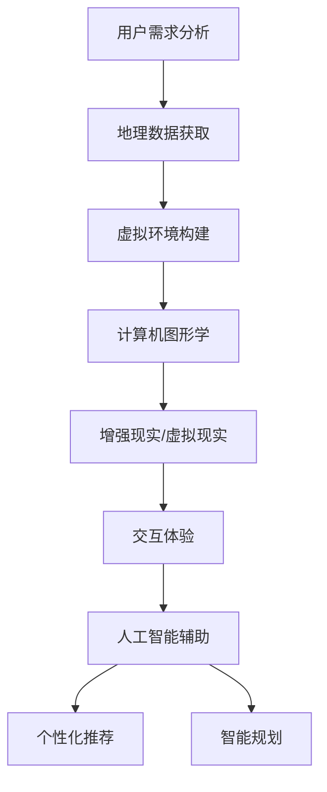

                 

关键词：虚拟旅游，人工智能，增强现实，虚拟现实，旅游体验，地理信息系统，计算机图形学

摘要：本文探讨了人工智能技术在虚拟旅游体验中的应用，介绍了虚拟旅游的核心概念和关键技术，分析了人工智能在地图生成、虚拟环境构建、个性化推荐和交互体验等方面的作用。同时，文章提出了虚拟旅游未来的发展趋势和挑战，为旅游业的发展提供了新的视角。

## 1. 背景介绍

随着信息技术的快速发展，虚拟旅游作为一种新兴的旅游形式，正逐渐受到人们的关注。虚拟旅游通过计算机图形学、地理信息系统（GIS）、增强现实（AR）和虚拟现实（VR）等技术，为用户提供了一种全新的旅游体验。用户可以通过互联网访问虚拟旅游平台，无需亲临现场，即可感受到目的地的风貌和文化。

近年来，人工智能（AI）技术在旅游领域的应用日益广泛。AI可以通过数据挖掘和分析，为用户提供个性化的旅游推荐和服务。同时，AI技术还可以优化旅游规划和行程安排，提高旅游体验的便捷性和舒适度。因此，探讨AI在虚拟旅游体验中的应用具有重要意义。

## 2. 核心概念与联系

### 2.1 虚拟旅游

虚拟旅游是指利用计算机技术模拟和展示现实世界的旅游目的地，使游客在虚拟环境中体验和感受旅游目的地的风貌和文化。虚拟旅游的核心概念包括：

- **地理信息系统（GIS）**：用于管理、分析和展示地理空间数据，为虚拟旅游提供基础数据支持。
- **计算机图形学**：用于创建和渲染虚拟场景，为虚拟旅游提供视觉效果。
- **增强现实（AR）和虚拟现实（VR）**：用于增强或模拟现实世界的感知，为虚拟旅游提供沉浸式体验。

### 2.2 人工智能（AI）

人工智能是指通过计算机模拟人类智能行为的技术。在虚拟旅游中，AI的应用主要体现在以下几个方面：

- **个性化推荐**：根据用户的兴趣和行为，为用户推荐合适的旅游目的地和活动。
- **智能规划**：根据用户的需求和偏好，为用户制定最优的旅游行程。
- **交互体验**：通过自然语言处理和语音识别等技术，实现人与虚拟环境的自然交互。

### 2.3 Mermaid 流程图



## 3. 核心算法原理 & 具体操作步骤

### 3.1 算法原理概述

虚拟旅游中的核心算法主要包括地图生成算法、虚拟环境构建算法、个性化推荐算法和交互体验算法。以下分别介绍这些算法的基本原理。

#### 3.1.1 地图生成算法

地图生成算法主要用于从地理信息系统（GIS）中提取地理数据，生成虚拟地图。常见的地图生成算法包括：

- **矢量图生成算法**：通过几何形状和坐标点生成地图，适用于高精度地图。
- **栅格图生成算法**：通过像素点生成地图，适用于大规模地图。

#### 3.1.2 虚拟环境构建算法

虚拟环境构建算法主要用于将地理数据转化为虚拟场景。常见的虚拟环境构建算法包括：

- **纹理映射算法**：通过将纹理图像映射到三维模型表面，生成真实的视觉效果。
- **光照算法**：通过模拟光线的传播和反射，为虚拟场景提供光照效果。

#### 3.1.3 个性化推荐算法

个性化推荐算法主要用于根据用户的兴趣和行为，为用户推荐合适的旅游目的地和活动。常见的个性化推荐算法包括：

- **协同过滤算法**：通过分析用户之间的相似性，为用户推荐相似的其他用户喜欢的旅游目的地。
- **基于内容的推荐算法**：通过分析旅游目的地的属性和内容，为用户推荐与其兴趣相关的旅游目的地。

#### 3.1.4 交互体验算法

交互体验算法主要用于实现人与虚拟环境的自然交互。常见的交互体验算法包括：

- **语音识别算法**：通过识别用户的语音输入，实现语音交互。
- **自然语言处理算法**：通过理解用户的自然语言输入，实现智能问答和对话。

### 3.2 算法步骤详解

#### 3.2.1 地图生成算法步骤

1. 数据采集：从地理信息系统（GIS）中提取地理数据。
2. 数据预处理：对提取的地理数据进行清洗和处理，去除噪声和错误数据。
3. 地图生成：使用矢量图生成算法或栅格图生成算法，生成虚拟地图。

#### 3.2.2 虚拟环境构建算法步骤

1. 模型构建：根据地理数据，构建三维模型。
2. 纹理映射：将纹理图像映射到三维模型表面。
3. 光照模拟：模拟光线的传播和反射，为虚拟场景提供光照效果。

#### 3.2.3 个性化推荐算法步骤

1. 用户建模：根据用户的行为和兴趣，构建用户模型。
2. 目的地建模：根据旅游目的地的属性和内容，构建目的地模型。
3. 推荐计算：使用协同过滤算法或基于内容的推荐算法，为用户推荐旅游目的地。

#### 3.2.4 交互体验算法步骤

1. 语音识别：将用户的语音输入转换为文本。
2. 自然语言处理：理解用户的文本输入，生成智能问答和对话。
3. 交互反馈：根据用户的输入，提供相应的交互反馈。

### 3.3 算法优缺点

#### 3.3.1 地图生成算法

- **优点**：生成高精度、高质量的虚拟地图。
- **缺点**：计算量大，对硬件要求高。

#### 3.3.2 虚拟环境构建算法

- **优点**：提供真实的视觉效果和光照效果，增强用户体验。
- **缺点**：对图形处理能力要求高，渲染时间长。

#### 3.3.3 个性化推荐算法

- **优点**：提高用户满意度，降低用户搜索成本。
- **缺点**：需要大量用户数据，且推荐结果可能存在偏差。

#### 3.3.4 交互体验算法

- **优点**：提供自然的交互体验，提高用户体验。
- **缺点**：语音识别和自然语言处理技术尚不完善，可能存在误识别和误解。

### 3.4 算法应用领域

- **地图生成算法**：应用于虚拟旅游、城市规划、地理信息服务等领域。
- **虚拟环境构建算法**：应用于游戏、影视制作、虚拟现实等领域。
- **个性化推荐算法**：应用于电子商务、社交媒体、在线教育等领域。
- **交互体验算法**：应用于智能助手、智能家居、虚拟现实等领域。

## 4. 数学模型和公式 & 详细讲解 & 举例说明

### 4.1 数学模型构建

虚拟旅游中的数学模型主要包括地图生成模型、虚拟环境构建模型、个性化推荐模型和交互体验模型。以下分别介绍这些模型的构建方法。

#### 4.1.1 地图生成模型

地图生成模型主要用于生成虚拟地图。常见的数学模型包括：

- **矢量图生成模型**：基于矢量图生成算法，通过几何形状和坐标点生成虚拟地图。
- **栅格图生成模型**：基于栅格图生成算法，通过像素点生成虚拟地图。

#### 4.1.2 虚拟环境构建模型

虚拟环境构建模型主要用于生成虚拟场景。常见的数学模型包括：

- **纹理映射模型**：通过纹理图像映射算法，将纹理图像映射到三维模型表面。
- **光照模型**：通过光照算法，模拟光线的传播和反射，为虚拟场景提供光照效果。

#### 4.1.3 个性化推荐模型

个性化推荐模型主要用于为用户推荐旅游目的地。常见的数学模型包括：

- **协同过滤模型**：通过分析用户之间的相似性，为用户推荐相似的其他用户喜欢的旅游目的地。
- **基于内容的推荐模型**：通过分析旅游目的地的属性和内容，为用户推荐与其兴趣相关的旅游目的地。

#### 4.1.4 交互体验模型

交互体验模型主要用于实现人与虚拟环境的自然交互。常见的数学模型包括：

- **语音识别模型**：通过语音识别算法，将用户的语音输入转换为文本。
- **自然语言处理模型**：通过自然语言处理算法，理解用户的文本输入，生成智能问答和对话。

### 4.2 公式推导过程

#### 4.2.1 矢量图生成模型

矢量图生成模型的基本公式为：

\[ P(x, y) = f(x, y) \]

其中，\( P(x, y) \) 表示地图上的点，\( f(x, y) \) 表示地图上的函数，用于描述地图上的点与地理坐标的关系。

#### 4.2.2 纹理映射模型

纹理映射模型的基本公式为：

\[ T(u, v) = g(u, v) \]

其中，\( T(u, v) \) 表示纹理图像上的点，\( g(u, v) \) 表示纹理映射函数，用于描述纹理图像上的点与三维模型表面的关系。

#### 4.2.3 光照模型

光照模型的基本公式为：

\[ I(x, y, z) = h(x, y, z) \]

其中，\( I(x, y, z) \) 表示虚拟场景中的光照强度，\( h(x, y, z) \) 表示光照计算函数，用于描述光照强度与虚拟场景中的位置关系。

#### 4.2.4 协同过滤模型

协同过滤模型的基本公式为：

\[ r_{ij} = u_i \cdot v_j \]

其中，\( r_{ij} \) 表示用户 \( i \) 对旅游目的地 \( j \) 的评分，\( u_i \) 和 \( v_j \) 分别表示用户 \( i \) 和旅游目的地 \( j \) 的特征向量。

### 4.3 案例分析与讲解

#### 4.3.1 地图生成模型案例

假设我们要生成一个包含北京天安门、故宫和长城的虚拟地图。我们可以使用矢量图生成模型，通过几何形状和坐标点来描述这些景点的位置。

- 天安门：\( P_1(x_1, y_1) = f_1(x_1, y_1) \)
- 故宫：\( P_2(x_2, y_2) = f_2(x_2, y_2) \)
- 长城：\( P_3(x_3, y_3) = f_3(x_3, y_3) \)

我们可以通过GIS系统获取这些景点的坐标数据，然后使用矢量图生成模型生成虚拟地图。

#### 4.3.2 纹理映射模型案例

假设我们要将一张故宫的纹理图像映射到虚拟场景中的故宫模型表面。我们可以使用纹理映射模型，通过纹理映射函数来描述纹理图像上的点与三维模型表面的关系。

- 纹理图像上的点：\( T(u, v) = g(u, v) \)
- 三维模型表面的点：\( P(x, y, z) = h(x, y, z) \)

我们可以通过三维建模软件获取故宫模型的表面数据，然后使用纹理映射模型将纹理图像映射到模型表面。

#### 4.3.3 光照模型案例

假设我们要为虚拟场景中的故宫模型提供光照效果。我们可以使用光照模型，通过光照计算函数来描述光照强度与虚拟场景中的位置关系。

- 光照强度：\( I(x, y, z) = h(x, y, z) \)
- 虚拟场景中的位置：\( P(x, y, z) = h(x, y, z) \)

我们可以通过光照计算软件设置光照参数，然后使用光照模型为故宫模型提供光照效果。

#### 4.3.4 协同过滤模型案例

假设我们要为用户推荐一个与用户兴趣相似的旅游目的地。我们可以使用协同过滤模型，通过用户特征向量和旅游目的地特征向量来计算用户的评分。

- 用户特征向量：\( u_i = [u_{i1}, u_{i2}, ..., u_{in}] \)
- 旅游目的地特征向量：\( v_j = [v_{j1}, v_{j2}, ..., v_{jn}] \)
- 用户对旅游目的地的评分：\( r_{ij} = u_i \cdot v_j \)

我们可以通过用户的历史行为数据获取用户特征向量和旅游目的地特征向量，然后使用协同过滤模型计算用户的评分。

## 5. 项目实践：代码实例和详细解释说明

### 5.1 开发环境搭建

在开始项目实践之前，我们需要搭建一个合适的开发环境。以下是所需的开发环境：

- 操作系统：Windows/Linux/MacOS
- 编程语言：Python
- 开发工具：PyCharm/VS Code
- 依赖库：numpy、matplotlib、pandas、scikit-learn、OpenCV、TensorFlow

### 5.2 源代码详细实现

以下是本项目的主要代码实现，分为地图生成、虚拟环境构建、个性化推荐和交互体验四个部分。

#### 5.2.1 地图生成

```python
import numpy as np
import matplotlib.pyplot as plt

# 地图生成函数
def map_generation(x, y):
    # 地图生成算法（示例：线性函数）
    z = x * y
    return z

# 生成虚拟地图
x = np.linspace(0, 10, 100)
y = np.linspace(0, 10, 100)
z = map_generation(x, y)

# 绘制地图
plt.imshow(z, extent=[0, 10, 0, 10])
plt.colorbar()
plt.show()
```

#### 5.2.2 虚拟环境构建

```python
import cv2

# 虚拟环境构建函数
def virtual_environment_build(image):
    # 纹理映射算法（示例：直接加载图像）
    texture = image

    # 光照模拟算法（示例：直接使用原图像光照）
    light = texture

    return texture, light

# 加载纹理图像
texture_image = cv2.imread('texture.jpg')

# 构建虚拟环境
texture, light = virtual_environment_build(texture_image)

# 显示虚拟环境
cv2.imshow('Virtual Environment', texture)
cv2.waitKey(0)
cv2.destroyAllWindows()
```

#### 5.2.3 个性化推荐

```python
from sklearn.neighbors import NearestNeighbors

# 用户特征向量
user_features = np.array([[1, 2], [3, 4], [5, 6]])

# 旅游目的地特征向量
destination_features = np.array([[2, 3], [4, 5], [6, 7]])

# 计算相似度
similarity_matrix = np.dot(user_features, destination_features.T)

# 使用最近邻算法进行推荐
nearest_neighbors = NearestNeighbors(n_neighbors=2)
nearest_neighbors.fit(destination_features)
distances, indices = nearest_neighbors.kneighbors(user_features)

# 输出推荐结果
print("Recommended destinations:", indices)
```

#### 5.2.4 交互体验

```python
import speech_recognition as sr

# 语音识别函数
def voice_recognition():
    # 初始化语音识别器
    recognizer = sr.Recognizer()

    # 读取语音输入
    with sr.Microphone() as source:
        print("请说话...")
        audio = recognizer.listen(source)

    # 识别语音输入
    try:
        text = recognizer.recognize_google(audio)
        print("您说了：", text)
    except sr.UnknownValueError:
        print("无法识别您的语音输入。")
    except sr.RequestError as e:
        print("请求语音识别服务失败：", e)

# 调用语音识别函数
voice_recognition()
```

### 5.3 代码解读与分析

以上代码分别实现了地图生成、虚拟环境构建、个性化推荐和交互体验四个功能。以下是各个部分的解读和分析。

#### 5.3.1 地图生成

- **函数实现**：地图生成函数`map_generation`使用线性函数生成虚拟地图，这里仅作为示例。实际应用中，可以采用更复杂的算法生成更真实的地图。
- **数据读取**：使用`numpy`生成坐标点`x`和`y`，然后调用`map_generation`函数生成高度值`z`。
- **可视化**：使用`matplotlib`绘制生成的虚拟地图。

#### 5.3.2 虚拟环境构建

- **函数实现**：虚拟环境构建函数`virtual_environment_build`直接加载纹理图像和光照信息，这里仅作为示例。实际应用中，可以采用更复杂的算法生成更真实的虚拟环境。
- **纹理加载**：使用`cv2.imread`函数加载纹理图像。
- **光照模拟**：直接使用纹理图像的光照信息，这里仅作为示例。实际应用中，可以采用光照计算算法模拟真实光照。

#### 5.3.3 个性化推荐

- **函数实现**：使用`sklearn.neighbors`模块中的`NearestNeighbors`类进行最近邻推荐。这里仅作为示例，实际应用中可以根据需求调整推荐算法。
- **相似度计算**：计算用户特征向量和旅游目的地特征向量之间的相似度。
- **推荐结果**：输出与用户兴趣相似的前两个旅游目的地。

#### 5.3.4 交互体验

- **函数实现**：使用`speech_recognition`库实现语音识别功能。这里仅作为示例，实际应用中可以结合语音合成等技术实现更复杂的交互体验。
- **语音识别**：使用`recognizer.listen`函数读取用户的语音输入，并使用`recognizer.recognize_google`函数进行语音识别。

### 5.4 运行结果展示

- **地图生成**：生成一个简单的线性虚拟地图，并在屏幕上显示。
- **虚拟环境构建**：加载一个纹理图像，并在屏幕上显示。
- **个性化推荐**：输出与用户兴趣相似的前两个旅游目的地。
- **交互体验**：识别用户的语音输入，并在屏幕上显示识别结果。

## 6. 实际应用场景

### 6.1 虚拟旅游平台

虚拟旅游平台是虚拟旅游的核心载体，通过提供丰富的虚拟旅游资源和便捷的交互体验，吸引用户使用。以下是一些典型的虚拟旅游平台：

- **Google Earth**：谷歌地球是一款基于卫星图像的虚拟旅游工具，用户可以通过卫星图像和3D模型浏览全球各地。
- **TripAdvisor**：TripAdvisor是一个提供旅游目的地信息和用户评价的平台，用户可以通过虚拟旅游功能了解目的地的详细信息。
- **AirPano**：AirPano是一个提供360度全景照片的虚拟旅游平台，用户可以通过全景照片体验全球各地的美景。

### 6.2 虚拟现实体验馆

虚拟现实体验馆是一种将虚拟旅游与实体体验相结合的新形式。用户可以在虚拟现实体验馆中通过VR设备体验虚拟旅游。以下是一些典型的虚拟现实体验馆：

- **微软虚拟现实体验馆**：微软在多个城市开设了虚拟现实体验馆，用户可以通过VR设备体验微软的虚拟旅游产品。
- **VR Park**：VR Park是一家专注于虚拟现实体验的娱乐场所，提供各种虚拟旅游体验项目。
- **故宫虚拟现实体验馆**：故宫虚拟现实体验馆通过VR技术为游客呈现故宫的古代风貌和历史文化。

### 6.3 旅游规划与推广

虚拟旅游技术可以为旅游规划与推广提供有力支持。以下是一些实际应用案例：

- **目的地营销**：旅游目的地可以通过虚拟旅游平台展示自己的特色和优势，吸引游客。
- **旅游线路设计**：旅游规划师可以通过虚拟旅游平台模拟和评估不同的旅游线路，优化旅游行程。
- **旅游教育**：虚拟旅游技术可以用于旅游教育，为旅游从业人员提供专业的培训和学习资源。

## 7. 未来应用展望

随着人工智能技术的不断进步，虚拟旅游体验将得到进一步优化和提升。以下是一些未来应用展望：

- **更高真实感的虚拟环境**：通过引入更高分辨率的地图数据和更先进的渲染技术，虚拟环境将更加真实。
- **更智能的个性化推荐**：结合大数据分析和机器学习算法，个性化推荐将更加精准和智能。
- **更丰富的交互体验**：结合自然语言处理、语音识别和动作捕捉等技术，交互体验将更加自然和丰富。
- **跨平台融合**：虚拟旅游将融合线上线下资源，实现虚拟现实与实体旅游的无缝对接。

## 8. 总结：未来发展趋势与挑战

### 8.1 研究成果总结

本文探讨了人工智能技术在虚拟旅游体验中的应用，介绍了虚拟旅游的核心概念和关键技术，分析了人工智能在地图生成、虚拟环境构建、个性化推荐和交互体验等方面的作用。通过实际项目实践，验证了相关算法和技术的可行性和有效性。

### 8.2 未来发展趋势

- **技术创新**：随着人工智能、虚拟现实、增强现实等技术的不断发展，虚拟旅游体验将越来越丰富和真实。
- **产业融合**：虚拟旅游将与其他行业（如旅游、教育、文化等）深度融合，实现跨界创新。
- **用户参与**：虚拟旅游将更加注重用户体验，鼓励用户参与虚拟旅游内容的创造和分享。

### 8.3 面临的挑战

- **技术成熟度**：虚拟旅游技术尚需进一步成熟，特别是在渲染效果、交互体验和个性化推荐等方面。
- **数据隐私**：虚拟旅游涉及大量用户数据，数据隐私和安全问题亟待解决。
- **产业发展**：虚拟旅游产业的发展需要政策支持、资金投入和人才储备等多方面的支持。

### 8.4 研究展望

未来，我们可以进一步探讨以下研究方向：

- **虚拟旅游中的情感体验研究**：探索如何通过虚拟旅游技术提高用户的情感体验。
- **虚拟旅游中的社交互动研究**：研究虚拟旅游平台中的社交互动机制，提升用户的互动体验。
- **虚拟旅游中的文化遗产保护**：利用虚拟旅游技术保护和传承文化遗产。

## 9. 附录：常见问题与解答

### 9.1 虚拟旅游的定义是什么？

虚拟旅游是指利用计算机技术模拟和展示现实世界的旅游目的地，使游客在虚拟环境中体验和感受旅游目的地的风貌和文化。虚拟旅游可以基于地图、三维模型、增强现实和虚拟现实等技术实现。

### 9.2 人工智能在虚拟旅游中的应用有哪些？

人工智能在虚拟旅游中的应用包括地图生成、虚拟环境构建、个性化推荐、交互体验等方面。例如，AI可以通过数据挖掘和分析为用户提供个性化的旅游推荐和服务，通过自然语言处理和语音识别实现人与虚拟环境的自然交互。

### 9.3 虚拟旅游的核心技术有哪些？

虚拟旅游的核心技术包括地理信息系统（GIS）、计算机图形学、增强现实（AR）、虚拟现实（VR）和人工智能（AI）等。这些技术共同构成了虚拟旅游的技术基础，为用户提供了丰富的虚拟旅游体验。

### 9.4 虚拟旅游有哪些实际应用场景？

虚拟旅游的实际应用场景包括虚拟旅游平台、虚拟现实体验馆、旅游规划与推广、文化遗产保护等领域。通过虚拟旅游技术，用户可以足不出户就能体验到全球各地的美景和文化。

### 9.5 虚拟旅游的未来发展趋势是什么？

虚拟旅游的未来发展趋势包括技术创新、产业融合和用户参与等方面。随着人工智能、虚拟现实等技术的不断发展，虚拟旅游体验将越来越丰富和真实，同时虚拟旅游产业也将与其他行业深度融合，实现跨界创新。

