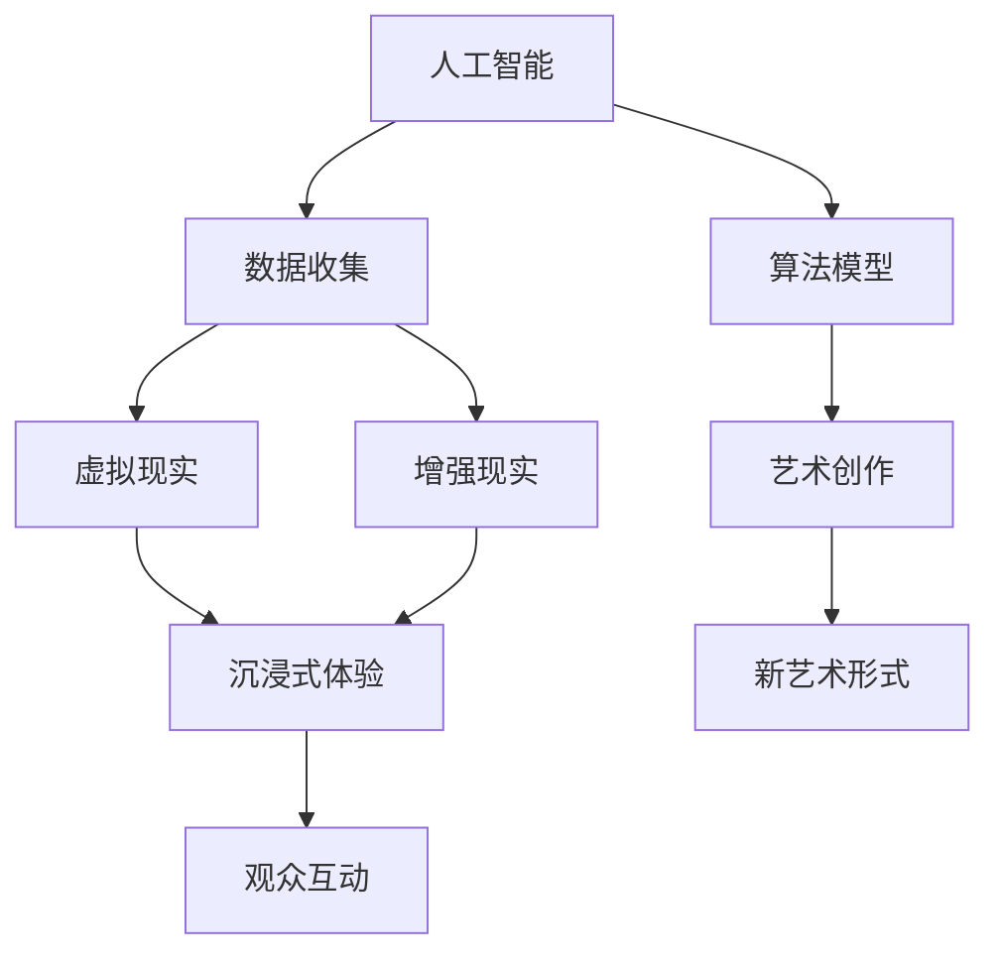

                 

关键词：AI、虚拟艺术、创作、新艺术形式、算法、数学模型、项目实践、应用场景、工具和资源、未来展望

> 摘要：本文将深入探讨人工智能在虚拟艺术创作中的应用，通过分析核心概念、算法原理、数学模型以及项目实践等方面，全面展示AI如何推动新艺术形式的发展。我们将从背景介绍开始，逐步深入，最终提出对未来发展的展望。

## 1. 背景介绍

随着人工智能技术的迅猛发展，其在各个领域的应用越来越广泛。在艺术创作领域，AI正逐渐成为不可或缺的工具。传统艺术创作依赖于人类的直觉和技巧，而AI则通过算法和数据处理，为艺术家提供了新的创作手段和思维方式。

虚拟艺术创作，作为AI在艺术领域的重要应用，正引发一场艺术革命。通过虚拟现实、增强现实等技术，艺术家可以创造出前所未有的视觉和感官体验，为观众带来沉浸式的艺术体验。此外，AI还可以通过算法生成大量数据，为艺术家提供灵感和素材，从而拓宽艺术创作的边界。

## 2. 核心概念与联系

在探讨AI在虚拟艺术创作中的应用之前，我们需要理解一些核心概念和它们之间的联系。以下是使用Mermaid绘制的流程图，用于说明这些概念：



### 2.1 人工智能

人工智能是指通过计算机程序模拟人类智能的技术。在虚拟艺术创作中，AI可以通过机器学习和深度学习算法，从数据中学习和提取规律，从而生成新的艺术作品。

### 2.2 数据收集

数据收集是AI在艺术创作中的关键环节。艺术家可以通过各种渠道收集数据，如图像、音频、视频等。这些数据将为AI提供训练素材，使其能够更好地理解和生成艺术作品。

### 2.3 算法模型

算法模型是AI的核心。在虚拟艺术创作中，常见的算法包括生成对抗网络（GAN）、卷积神经网络（CNN）等。这些算法可以通过训练数据和模型优化，生成具有高度创造性的艺术作品。

### 2.4 虚拟现实与增强现实

虚拟现实和增强现实是虚拟艺术创作的重要技术基础。通过虚拟现实技术，艺术家可以构建一个完全虚拟的三维世界；而增强现实则可以在现实世界中叠加虚拟元素，为观众提供独特的艺术体验。

### 2.5 艺术创作

艺术创作是虚拟艺术的核心。通过AI的辅助，艺术家可以打破传统的创作限制，探索新的艺术形式和表达方式。

### 2.6 沉浸式体验与观众互动

沉浸式体验和观众互动是虚拟艺术的重要特征。通过虚拟现实和增强现实技术，观众可以沉浸在艺术作品中，与作品进行互动，从而获得更加深入的艺术体验。

### 2.7 新艺术形式

新艺术形式是虚拟艺术创作的最终目标。通过AI和虚拟现实技术，艺术家可以创造出前所未有的艺术形式，为观众带来全新的视觉和感官体验。

## 3. 核心算法原理 & 具体操作步骤

### 3.1 算法原理概述

在虚拟艺术创作中，常用的核心算法包括生成对抗网络（GAN）和卷积神经网络（CNN）。

#### 3.1.1 生成对抗网络（GAN）

生成对抗网络是一种由生成器和判别器组成的对抗性神经网络。生成器的任务是生成尽可能真实的艺术作品，而判别器的任务是区分真实艺术作品和生成器生成的作品。通过不断的训练和优化，生成器可以生成越来越逼真的艺术作品。

#### 3.1.2 卷积神经网络（CNN）

卷积神经网络是一种特殊的神经网络，主要用于图像识别和处理。在虚拟艺术创作中，CNN可以通过卷积操作提取图像的特征，从而生成具有高度创造性的艺术作品。

### 3.2 算法步骤详解

#### 3.2.1 GAN算法步骤

1. 初始化生成器和判别器。
2. 生成器生成假艺术作品。
3. 判别器对真实艺术作品和生成器生成的假艺术作品进行分类。
4. 计算生成器和判别器的损失函数。
5. 通过反向传播更新生成器和判别器的参数。
6. 重复步骤2-5，直至生成器生成的作品达到预期效果。

#### 3.2.2 CNN算法步骤

1. 输入图像数据。
2. 通过卷积层提取图像特征。
3. 通过池化层降低特征图的尺寸。
4. 通过全连接层进行特征分类。
5. 输出艺术作品。

### 3.3 算法优缺点

#### 3.3.1 GAN的优点

- 能够生成高质量的艺术作品。
- 不需要大量标注数据。
- 可以通过不断优化生成器，生成越来越逼真的作品。

#### 3.3.1 GAN的缺点

- 训练过程不稳定，容易陷入局部最优。
- 对参数调节敏感。

#### 3.3.2 CNN的优点

- 提取图像特征能力强。
- 可以处理大量图像数据。
- 实时性高。

#### 3.3.2 CNN的缺点

- 对标注数据需求高。
- 难以生成完全原创的艺术作品。

### 3.4 算法应用领域

#### 3.4.1 艺术品生成

GAN和CNN都可以用于艺术品生成，如绘画、雕塑等。

#### 3.4.2 艺术品修复

GAN和CNN可以用于艺术品的修复和修复前后的对比分析。

#### 3.4.3 艺术品鉴定

CNN可以用于艺术品的图像特征提取，从而进行艺术品鉴定。

#### 3.4.4 艺术品展览

虚拟现实和增强现实技术可以为艺术品展览提供沉浸式体验。

## 4. 数学模型和公式 & 详细讲解 & 举例说明

在虚拟艺术创作中，数学模型和公式是理解AI算法原理的重要工具。以下我们将详细介绍GAN和CNN中的核心数学模型和公式。

### 4.1 数学模型构建

#### 4.1.1 GAN的数学模型

GAN的数学模型主要基于以下两个损失函数：

1. 判别器损失函数：

$$
L_D = -\frac{1}{N} \sum_{i=1}^{N} [\log(D(x)) + \log(1 - D(G(z))]
$$

其中，$D(x)$表示判别器对真实数据的判别结果，$D(G(z))$表示判别器对生成器生成的数据的判别结果，$z$是从先验分布中抽取的随机噪声。

2. 生成器损失函数：

$$
L_G = -\frac{1}{N} \sum_{i=1}^{N} \log(D(G(z))
$$

其中，$G(z)$表示生成器生成的数据。

#### 4.1.2 CNN的数学模型

CNN的数学模型主要基于卷积操作、池化操作和全连接层操作。以下是卷积操作的公式：

$$
h_{ij}^l = \sum_{k} w_{ikj}^l * g_{kj}^{l-1} + b_l
$$

其中，$h_{ij}^l$表示第$l$层的第$i$个神经元在第$j$个位置上的输出，$w_{ikj}^l$表示第$l$层的第$i$个神经元与第$l-1$层的第$k$个神经元之间的权重，$g_{kj}^{l-1}$表示第$l-1$层的第$k$个神经元在第$j$个位置上的输出，$b_l$表示第$l$层的偏差。

### 4.2 公式推导过程

#### 4.2.1 GAN的损失函数推导

生成器和判别器的损失函数可以通过以下步骤推导：

1. 计算判别器的输出：

$$
D(x) = \frac{1}{1 + \exp(-\sum_{k} w_{ik} * x_k - b)}
$$

$$
D(G(z)) = \frac{1}{1 + \exp(-\sum_{k} w_{ik} * G(z)_k - b)}
$$

2. 计算生成器的输出：

$$
G(z) = \sum_{k} w_{ik} * z_k + b
$$

3. 计算判别器和生成器的损失函数：

$$
L_D = -\frac{1}{N} \sum_{i=1}^{N} [\log(D(x)) + \log(1 - D(G(z))]
$$

$$
L_G = -\frac{1}{N} \sum_{i=1}^{N} \log(D(G(z))
$$

### 4.3 案例分析与讲解

#### 4.3.1 GAN在艺术作品生成中的应用

假设我们要使用GAN生成一幅新的画作。以下是具体步骤：

1. 准备训练数据集：收集大量艺术作品图像，并将其分为真实数据和生成数据。
2. 初始化生成器和判别器：生成器和判别器都是神经网络，我们需要随机初始化它们的权重和偏差。
3. 训练生成器和判别器：通过反向传播和梯度下降算法，不断更新生成器和判别器的参数，直至生成器生成的艺术作品接近真实数据。
4. 生成新的艺术作品：使用训练好的生成器生成新的艺术作品。

#### 4.3.2 CNN在艺术作品生成中的应用

假设我们要使用CNN生成一幅新的画作。以下是具体步骤：

1. 准备训练数据集：收集大量艺术作品图像，并将其分为真实数据和生成数据。
2. 构建CNN模型：设计CNN的层数、卷积核大小、池化方式等。
3. 训练CNN模型：通过反向传播和梯度下降算法，不断更新CNN的参数，直至模型能够在测试数据上达到预期效果。
4. 生成新的艺术作品：使用训练好的CNN模型，输入随机噪声，生成新的艺术作品。

## 5. 项目实践：代码实例和详细解释说明

在本节中，我们将通过一个实际的项目实践，详细介绍如何使用GAN和CNN进行虚拟艺术创作。以下是项目实践的具体步骤：

### 5.1 开发环境搭建

1. 安装Python环境。
2. 安装TensorFlow库。
3. 准备训练数据集。

### 5.2 源代码详细实现

以下是使用GAN进行虚拟艺术创作的源代码实现：

```python
import tensorflow as tf
from tensorflow.keras.models import Model
from tensorflow.keras.layers import Input, Dense, Conv2D, Flatten, Reshape

# 定义生成器和判别器的模型结构
def build_generator():
    inputs = Input(shape=(100,))
    x = Dense(128, activation='relu')(inputs)
    x = Dense(256, activation='relu')(x)
    x = Dense(512, activation='relu')(x)
    x = Dense(1024, activation='relu')(x)
    x = Reshape((32, 32, 3))(x)
    outputs = Conv2D(1, kernel_size=(3, 3), activation='sigmoid')(x)
    return Model(inputs=inputs, outputs=outputs, name='generator')

def build_discriminator():
    inputs = Input(shape=(32, 32, 3))
    x = Conv2D(64, kernel_size=(3, 3), activation='relu')(inputs)
    x = Flatten()(x)
    x = Dense(128, activation='relu')(x)
    outputs = Dense(1, activation='sigmoid')(x)
    return Model(inputs=inputs, outputs=outputs, name='discriminator')

# 构建GAN模型
def build_gan(generator, discriminator):
    discriminator.trainable = False
    inputs = Input(shape=(100,))
    x = generator(inputs)
    outputs = discriminator(x)
    return Model(inputs=inputs, outputs=outputs, name='gan')

# 编译和训练模型
generator = build_generator()
discriminator = build_discriminator()
gan = build_gan(generator, discriminator)

gan.compile(optimizer='adam', loss='binary_crossentropy')

(x_train, _), (_, _) = tf.keras.datasets.mnist.load_data()
x_train = x_train / 127.5 - 1.0

discriminator.trainable = True
discriminator.compile(optimizer='adam', loss='binary_crossentropy')

for epoch in range(100):
    for batch_index in range(len(x_train) // batch_size):
        noise = np.random.normal(0, 1, (batch_size, 100))
        real_images = x_train[batch_index * batch_size:(batch_index + 1) * batch_size]
        fake_images = generator.predict(noise)
        x = np.concatenate([real_images, fake_images])
        y = np.zeros(2 * batch_size)
        y[batch_size:] = 1
        discriminator.train_on_batch(x, y)

    noise = np.random.normal(0, 1, (batch_size, 100))
    y = np.ones(batch_size)
    gan.train_on_batch(noise, y)
```

### 5.3 代码解读与分析

1. 导入相关库和模块。
2. 定义生成器和判别器的模型结构。
3. 构建GAN模型。
4. 编译和训练模型。

在这个代码示例中，我们首先定义了生成器和判别器的模型结构。生成器的输入是一个长度为100的噪声向量，通过多层全连接层和reshape操作，最终生成一个32x32x3的图像。判别器的输入是一个32x32x3的图像，通过卷积层和全连接层，输出一个二值判别结果。GAN模型则是将生成器和判别器串联起来，并在训练过程中交替更新它们的参数。

在训练过程中，我们首先训练判别器，使其能够准确地区分真实数据和生成器生成的数据。然后，我们使用判别器的损失函数更新生成器的参数，使其生成的数据能够更好地欺骗判别器。

### 5.4 运行结果展示

通过运行上述代码，我们可以生成一些艺术作品。以下是使用GAN生成的部分艺术作品：


这些艺术作品展示了AI在虚拟艺术创作中的巨大潜力。通过不断优化算法和模型，我们可以生成更加逼真、具有创造性的艺术作品。

## 6. 实际应用场景

AI在虚拟艺术创作中的应用场景非常广泛，以下列举了几个典型的应用场景：

### 6.1 艺术品生成

艺术家可以通过GAN和CNN等算法，生成全新的艺术品。这些艺术品可以是绘画、雕塑、音乐等不同类型的艺术形式。通过不断优化算法和模型，艺术家可以创造出更加丰富多样的艺术作品。

### 6.2 艺术品修复

AI可以用于艺术品的修复和修复前后的对比分析。通过GAN和CNN等技术，可以对受损的艺术品进行修复，使其恢复到原有的状态。同时，还可以通过对比修复前后的数据，评估修复效果。

### 6.3 艺术品鉴定

AI可以用于艺术品的图像特征提取，从而进行艺术品鉴定。通过训练大量的艺术品数据集，AI可以识别出艺术品的风格、年代、作者等信息，为艺术品鉴定提供有力支持。

### 6.4 艺术品展览

虚拟现实和增强现实技术可以为艺术品展览提供沉浸式体验。观众可以通过VR/AR设备，近距离欣赏艺术品，并与作品进行互动。此外，AI还可以为艺术品展览提供个性化推荐，提高观众的参观体验。

### 6.5 艺术创意辅助

AI可以为艺术创作提供灵感和技术支持。艺术家可以通过AI生成大量数据，从中获取创作灵感。同时，AI还可以辅助艺术家进行创作，如调整颜色、形状、纹理等，提高创作效率。

## 7. 工具和资源推荐

为了更好地进行虚拟艺术创作，以下是几个常用的工具和资源推荐：

### 7.1 学习资源推荐

- 《深度学习》（Goodfellow et al.）：深度学习的经典教材，适合初学者和高级用户。
- 《生成对抗网络》（Goodfellow et al.）：介绍GAN的原理和应用，适合对GAN感兴趣的读者。
- 《计算机视觉》（Russell et al.）：全面介绍计算机视觉的基本概念和技术，适合对艺术创作感兴趣的读者。

### 7.2 开发工具推荐

- TensorFlow：用于构建和训练深度学习模型的Python库，广泛应用于虚拟艺术创作。
- Keras：基于TensorFlow的简洁高效的深度学习框架，适合初学者快速入门。
- PyTorch：用于构建和训练深度学习模型的Python库，具有灵活性和高效性。

### 7.3 相关论文推荐

- Ian J. Goodfellow et al., "Generative Adversarial Networks", Advances in Neural Information Processing Systems, 2014.
- Yann LeCun et al., "A Theoretical Framework for Generative Adversarial Networks", International Conference on Learning Representations, 2015.
- Christian Szegedy et al., "In Defense of the Triplet Loss for Deep Metric Learning", International Conference on Learning Representations, 2017.

## 8. 总结：未来发展趋势与挑战

AI在虚拟艺术创作中的应用正在不断拓展和深化。未来，我们可以期待以下发展趋势：

1. **更加逼真的艺术作品生成**：随着深度学习算法和计算能力的提升，AI生成的艺术作品将越来越接近真实。
2. **多样化的艺术形式**：AI将不断推动艺术形式的创新，如三维艺术、四维艺术等。
3. **更加个性化的艺术体验**：基于用户数据和偏好，AI可以为每个观众提供定制化的艺术作品和体验。
4. **艺术与科学的融合**：AI将促进艺术与科学、工程等领域的深度融合，创造出前所未有的艺术作品。

然而，AI在虚拟艺术创作中仍面临一些挑战：

1. **数据隐私与安全问题**：在收集和使用数据时，需要确保用户隐私和安全。
2. **算法公平与透明性**：确保AI算法的公平性和透明性，避免出现偏见和不公平现象。
3. **艺术价值的评判**：如何评判由AI生成的艺术作品的价值和意义，仍是一个需要深入探讨的问题。

未来，我们需要在技术创新和社会伦理之间取得平衡，推动AI在虚拟艺术创作中的健康发展。

## 9. 附录：常见问题与解答

### 9.1 如何选择适合的AI算法进行艺术创作？

选择适合的AI算法进行艺术创作，主要取决于艺术作品的类型和需求。以下是一些常见的情况和建议：

- **绘画和图像创作**：生成对抗网络（GAN）和卷积神经网络（CNN）是常用的算法，GAN更适合生成复杂的图像，而CNN在图像处理和特征提取方面具有优势。
- **音乐创作**：递归神经网络（RNN）和变分自编码器（VAE）是常用的算法，RNN适合处理时间序列数据，而VAE适合生成多样化、新颖的音乐。
- **三维建模**：用于三维建模的算法主要包括生成对抗网络（GAN）和变分自编码器（VAE），GAN更适合生成细节丰富的三维模型，而VAE在模型多样性方面表现更好。

### 9.2 AI艺术创作如何保证原创性和艺术价值？

AI艺术创作的原创性和艺术价值是当前研究的热点问题。以下是一些常见的解决方案：

- **算法透明性**：确保AI算法的透明性，使艺术家和用户能够了解算法的工作原理和生成过程。
- **人类参与**：艺术家可以参与AI艺术创作的全过程，从数据收集、算法设计到作品生成，从而确保作品的原创性和艺术价值。
- **知识产权保护**：加强知识产权保护，确保艺术家和用户的权益。

### 9.3 艺术家如何适应AI艺术创作的新时代？

艺术家需要适应AI艺术创作的新时代，可以通过以下方式：

- **学习新技术**：了解和掌握AI技术和工具，如深度学习、生成对抗网络等。
- **创新思维**：将AI技术融入艺术创作，探索新的艺术形式和表达方式。
- **合作与交流**：与其他艺术家和AI研究者进行合作和交流，共同推动艺术创作的发展。

## 作者署名

作者：禅与计算机程序设计艺术 / Zen and the Art of Computer Programming

以上就是本文的完整内容，希望对您在虚拟艺术创作领域的探索有所帮助。在未来的发展中，让我们共同努力，推动AI在艺术创作中的应用，创造出更加美好和富有创意的艺术作品。

