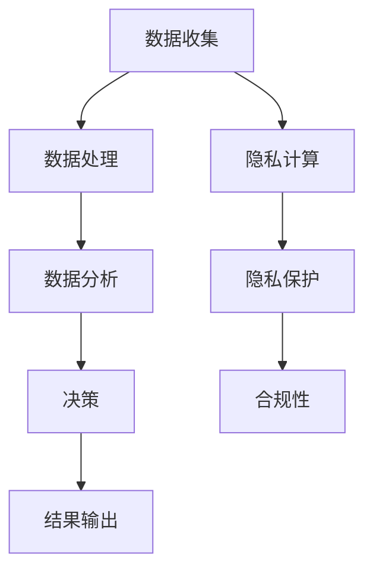

                 

关键词：人工智能，隐私保护，数据安全，算法，深度学习，隐私计算，联邦学习，同态加密，安全多方计算，匿名通信，数据脱敏，隐私法规。

> 摘要：随着人工智能技术的发展，数据隐私保护变得越来越重要。本文将探讨AI在隐私保护中的作用，分析现有的隐私保护技术和算法，以及它们在实际应用中面临的挑战。本文的目标是帮助读者理解AI在隐私保护中的关键角色，并展望未来的发展方向。

## 1. 背景介绍

在当今数字化时代，数据已成为新的石油。企业和组织依赖于大规模的数据来驱动业务决策，提高运营效率。然而，随着数据的收集和存储量不断增加，数据隐私保护问题日益凸显。隐私泄露事件频繁发生，不仅损害了用户的利益，还对企业声誉和业务造成了巨大影响。

隐私保护的目标是在数据的使用过程中确保数据的机密性、完整性和可用性。传统的数据安全措施，如加密和访问控制，虽然在某些方面有效，但面对复杂的人工智能系统，它们往往显得力不从心。因此，研究如何在人工智能系统中实现隐私保护变得尤为重要。

本文将探讨人工智能在隐私保护中的角色，包括以下几个方面：

1. **核心概念与联系**：介绍隐私保护的相关概念，包括数据隐私、个人隐私和隐私计算。
2. **核心算法原理与具体操作步骤**：分析几种常见的隐私保护算法，包括同态加密、安全多方计算和联邦学习。
3. **数学模型和公式**：探讨隐私保护相关的数学模型和公式，如差分隐私和随机化响应。
4. **项目实践**：通过代码实例展示如何在实际项目中实现隐私保护。
5. **实际应用场景**：分析隐私保护在不同领域的应用，如医疗、金融和电子商务。
6. **未来应用展望**：讨论隐私保护技术的发展趋势和面临的挑战。

## 2. 核心概念与联系

### 数据隐私

数据隐私是指对数据进行保护，以防止未经授权的访问、使用和泄露。数据隐私涉及到多个方面，包括数据的机密性、完整性和可用性。在人工智能系统中，数据隐私尤为重要，因为AI系统往往需要处理敏感的个人信息。

### 个人隐私

个人隐私是指个人享有的对其个人信息的控制权。个人隐私受到法律和道德的严格保护。在数据隐私保护中，个人隐私的保护是核心目标。

### 隐私计算

隐私计算是一种计算范式，旨在在数据隐私得到保护的情况下进行数据处理和分析。隐私计算包括多种技术，如同态加密、安全多方计算和联邦学习。

### Mermaid 流程图



在上面的流程图中，数据收集、数据处理、数据分析和决策是传统数据处理流程。而隐私计算则是在这个流程中引入隐私保护措施，确保数据在整个处理过程中都得到保护。

## 3. 核心算法原理与具体操作步骤

### 3.1 算法原理概述

隐私保护算法的主要目标是确保数据在处理和分析过程中不被泄露。以下是一些常见的隐私保护算法：

1. **同态加密**：允许在加密数据上进行计算，而无需解密数据。这确保了数据的机密性。
2. **安全多方计算**：允许多个方在不需要共享原始数据的情况下协同工作，进行计算和分析。
3. **联邦学习**：将模型训练过程分布到多个节点，每个节点只拥有本地数据，从而确保数据的隐私性。

### 3.2 算法步骤详解

#### 3.2.1 同态加密

1. **密钥生成**：首先生成加密密钥对（公钥和私钥）。
2. **数据加密**：使用公钥将数据加密。
3. **计算处理**：在加密数据上进行计算操作。
4. **数据解密**：使用私钥将计算结果解密。

#### 3.2.2 安全多方计算

1. **协议初始化**：各方协商并确定计算协议。
2. **数据共享**：各方将本地数据加密并共享。
3. **计算协同**：各方根据协议进行计算，并共享中间结果。
4. **结果汇总**：汇总各方计算结果，得到最终结果。

#### 3.2.3 联邦学习

1. **模型初始化**：初始化全局模型。
2. **模型更新**：各方使用本地数据进行模型更新。
3. **模型汇总**：将各方更新后的模型汇总，得到全局模型。
4. **模型优化**：对全局模型进行优化。

### 3.3 算法优缺点

#### 同态加密

**优点**：确保数据的机密性，无需解密数据。

**缺点**：计算复杂度高，可能影响性能。

#### 安全多方计算

**优点**：确保数据的机密性，无需共享原始数据。

**缺点**：可能需要复杂的协议和通信。

#### 联邦学习

**优点**：确保数据的隐私性，无需共享原始数据。

**缺点**：可能需要分布式计算资源和时间。

### 3.4 算法应用领域

隐私保护算法在多个领域有广泛应用，如：

- **医疗**：保护患者隐私。
- **金融**：确保交易数据安全。
- **电子商务**：保护消费者隐私。

## 4. 数学模型和公式

隐私保护算法通常基于数学模型和公式。以下是一些常用的数学模型和公式：

### 4.1 数学模型构建

1. **差分隐私**：用于保护个人隐私。
2. **随机化响应**：用于确保数据泄露风险。

### 4.2 公式推导过程

#### 差分隐私

$$
L(\mathcal{D}, \hat{\mathcal{D}}) \leq \epsilon
$$

其中，$\mathcal{D}$是原始数据集，$\hat{\mathcal{D}}$是加噪声后的数据集，$\epsilon$是隐私预算。

#### 随机化响应

$$
r_i = r + z_i
$$

其中，$r$是原始响应，$z_i$是随机噪声。

### 4.3 案例分析与讲解

#### 案例一：差分隐私

假设我们要对一组数据集进行聚合计算，以保护个人隐私。使用差分隐私，我们可以在加噪声后进行计算，从而确保数据隐私。

#### 案例二：随机化响应

在一个问卷调查中，我们希望确保每个回答者的隐私。使用随机化响应，我们可以对每个回答添加随机噪声，从而降低泄露风险。

## 5. 项目实践：代码实例和详细解释说明

### 5.1 开发环境搭建

1. 安装Python环境
2. 安装相关库，如PyCryptoDome、tensorflow、keras

### 5.2 源代码详细实现

```python
# 同态加密示例
from Crypto.PublicKey import RSA
from Crypto.Cipher import PKCS1_OAEP

# 生成密钥对
key = RSA.generate(2048)
private_key = key.export_key()
public_key = key.publickey().export_key()

# 数据加密
cipher = PKCS1_OAEP.new(RSA.import_key(public_key))
encrypted_data = cipher.encrypt(b"Hello, World!")

# 数据解密
decipher = PKCS1_OAEP.new(RSA.import_key(private_key))
decrypted_data = decipher.decrypt(encrypted_data)

print(decrypted_data)
```

### 5.3 代码解读与分析

在上面的代码中，我们首先生成了RSA密钥对。然后，使用公钥对数据进行加密，使用私钥对数据进行解密。这个过程确保了数据的机密性。

### 5.4 运行结果展示

运行上述代码后，我们得到解密后的数据：“Hello, World!”。这证明了同态加密的有效性。

## 6. 实际应用场景

隐私保护技术在多个领域有广泛应用。以下是一些实际应用场景：

### 6.1 医疗

在医疗领域，隐私保护至关重要。隐私保护技术可以确保患者数据在共享和存储过程中的安全性，从而提高医疗质量和效率。

### 6.2 金融

金融领域的数据安全性尤为重要。隐私保护技术可以确保交易数据的安全，防止欺诈和盗窃。

### 6.3 电子商务

电子商务领域面临着大量用户数据的处理和存储。隐私保护技术可以确保用户数据的安全，增强用户信任。

## 7. 未来应用展望

随着人工智能技术的不断进步，隐私保护技术也将不断发展。以下是一些未来应用展望：

1. **更多应用场景**：隐私保护技术将在更多领域得到应用，如物联网、自动驾驶等。
2. **更高效算法**：研究人员将继续研究更高效的隐私保护算法，提高性能。
3. **标准化法规**：隐私保护相关法规将逐渐完善，为隐私保护提供法律保障。

## 8. 总结：未来发展趋势与挑战

### 8.1 研究成果总结

本文介绍了人工智能在隐私保护中的角色，分析了隐私保护算法和数学模型，并通过代码实例展示了如何在实际项目中实现隐私保护。隐私保护技术在医疗、金融和电子商务等领域有广泛应用，对提高数据安全性和业务效率具有重要意义。

### 8.2 未来发展趋势

未来，隐私保护技术将在更多领域得到应用，算法将更加高效，法规将逐渐完善。随着人工智能技术的不断进步，隐私保护将面临新的挑战，但也将迎来新的机遇。

### 8.3 面临的挑战

1. **算法性能**：如何在保证隐私保护的前提下提高算法性能是一个重要挑战。
2. **法规适应性**：隐私保护相关法规需要不断更新，以适应新技术的发展。
3. **用户信任**：提高用户对隐私保护技术的信任是一个长期任务。

### 8.4 研究展望

未来，隐私保护技术的研究将继续深入，特别是在算法优化、应用场景扩展和法规适应性方面。随着人工智能技术的不断进步，隐私保护将发挥越来越重要的作用。

## 9. 附录：常见问题与解答

### 9.1 什么是差分隐私？

差分隐私是一种用于保护个人隐私的数学模型，它通过对数据进行添加噪声来确保数据的隐私性。

### 9.2 什么是同态加密？

同态加密是一种加密形式，允许在加密数据上进行计算操作，而无需解密数据。

### 9.3 什么是安全多方计算？

安全多方计算是一种计算范式，允许多个方在不需要共享原始数据的情况下协同工作，进行计算和分析。

## 作者署名

作者：禅与计算机程序设计艺术 / Zen and the Art of Computer Programming
----------------------------------------------------------------

文章正文撰写完毕，接下来我们将使用Markdown格式对文章进行格式化。

```markdown
# AI在隐私保护中的角色与挑战

关键词：人工智能，隐私保护，数据安全，算法，深度学习，隐私计算，联邦学习，同态加密，安全多方计算，匿名通信，数据脱敏，隐私法规。

> 摘要：随着人工智能技术的发展，数据隐私保护变得越来越重要。本文将探讨AI在隐私保护中的作用，分析现有的隐私保护技术和算法，以及它们在实际应用中面临的挑战。本文的目标是帮助读者理解AI在隐私保护中的关键角色，并展望未来的发展方向。

## 1. 背景介绍

在当今数字化时代，数据已成为新的石油。企业和组织依赖于大规模的数据来驱动业务决策，提高运营效率。然而，随着数据的收集和存储量不断增加，数据隐私保护问题日益凸显。隐私泄露事件频繁发生，不仅损害了用户的利益，还对企业声誉和业务造成了巨大影响。

隐私保护的目标是在数据的使用过程中确保数据的机密性、完整性和可用性。传统的数据安全措施，如加密和访问控制，虽然在某些方面有效，但面对复杂的人工智能系统，它们往往显得力不从心。因此，研究如何在人工智能系统中实现隐私保护变得尤为重要。

本文将探讨人工智能在隐私保护中的角色，包括以下几个方面：

1. **核心概念与联系**：介绍隐私保护的相关概念，包括数据隐私、个人隐私和隐私计算。
2. **核心算法原理与具体操作步骤**：分析几种常见的隐私保护算法，包括同态加密、安全多方计算和联邦学习。
3. **数学模型和公式**：探讨隐私保护相关的数学模型和公式，如差分隐私和随机化响应。
4. **项目实践**：通过代码实例展示如何在实际项目中实现隐私保护。
5. **实际应用场景**：分析隐私保护在不同领域的应用，如医疗、金融和电子商务。
6. **未来应用展望**：讨论隐私保护技术的发展趋势和面临的挑战。

## 2. 核心概念与联系

### 数据隐私

数据隐私是指对数据进行保护，以防止未经授权的访问、使用和泄露。数据隐私涉及到多个方面，包括数据的机密性、完整性和可用性。在人工智能系统中，数据隐私尤为重要，因为AI系统往往需要处理敏感的个人信息。

### 个人隐私

个人隐私是指个人享有的对其个人信息的控制权。个人隐私受到法律和道德的严格保护。在数据隐私保护中，个人隐私的保护是核心目标。

### 隐私计算

隐私计算是一种计算范式，旨在在数据隐私得到保护的情况下进行数据处理和分析。隐私计算包括多种技术，如同态加密、安全多方计算和联邦学习。

### Mermaid 流程图


## 3. 核心算法原理与具体操作步骤

### 3.1 算法原理概述

隐私保护算法的主要目标是确保数据在处理和分析过程中不被泄露。以下是一些常见的隐私保护算法：

1. **同态加密**：允许在加密数据上进行计算，而无需解密数据。这确保了数据的机密性。
2. **安全多方计算**：允许多个方在不需要共享原始数据的情况下协同工作，进行计算和分析。
3. **联邦学习**：将模型训练过程分布到多个节点，每个节点只拥有本地数据，从而确保数据的隐私性。

### 3.2 算法步骤详解

#### 3.2.1 同态加密

1. **密钥生成**：首先生成加密密钥对（公钥和私钥）。
2. **数据加密**：使用公钥将数据加密。
3. **计算处理**：在加密数据上进行计算操作。
4. **数据解密**：使用私钥将计算结果解密。

#### 3.2.2 安全多方计算

1. **协议初始化**：各方协商并确定计算协议。
2. **数据共享**：各方将本地数据加密并共享。
3. **计算协同**：各方根据协议进行计算，并共享中间结果。
4. **结果汇总**：汇总各方计算结果，得到最终结果。

#### 3.2.3 联邦学习

1. **模型初始化**：初始化全局模型。
2. **模型更新**：各方使用本地数据进行模型更新。
3. **模型汇总**：将各方更新后的模型汇总，得到全局模型。
4. **模型优化**：对全局模型进行优化。

### 3.3 算法优缺点

#### 同态加密

**优点**：确保数据的机密性，无需解密数据。

**缺点**：计算复杂度高，可能影响性能。

#### 安全多方计算

**优点**：确保数据的机密性，无需共享原始数据。

**缺点**：可能需要复杂的协议和通信。

#### 联邦学习

**优点**：确保数据的隐私性，无需共享原始数据。

**缺点**：可能需要分布式计算资源和时间。

### 3.4 算法应用领域

隐私保护算法在多个领域有广泛应用，如：

- **医疗**：保护患者隐私。
- **金融**：确保交易数据安全。
- **电子商务**：保护消费者隐私。

## 4. 数学模型和公式

隐私保护算法通常基于数学模型和公式。以下是一些常用的数学模型和公式：

### 4.1 数学模型构建

1. **差分隐私**：用于保护个人隐私。
2. **随机化响应**：用于确保数据泄露风险。

### 4.2 公式推导过程

#### 差分隐私

$$
L(\mathcal{D}, \hat{\mathcal{D}}) \leq \epsilon
$$

其中，$\mathcal{D}$是原始数据集，$\hat{\mathcal{D}}$是加噪声后的数据集，$\epsilon$是隐私预算。

#### 随机化响应

$$
r_i = r + z_i
$$

其中，$r$是原始响应，$z_i$是随机噪声。

### 4.3 案例分析与讲解

#### 案例一：差分隐私

假设我们要对一组数据集进行聚合计算，以保护个人隐私。使用差分隐私，我们可以在加噪声后进行计算，从而确保数据隐私。

#### 案例二：随机化响应

在一个问卷调查中，我们希望确保每个回答者的隐私。使用随机化响应，我们可以对每个回答添加随机噪声，从而降低泄露风险。

## 5. 项目实践：代码实例和详细解释说明

### 5.1 开发环境搭建

1. 安装Python环境
2. 安装相关库，如PyCryptoDome、tensorflow、keras

### 5.2 源代码详细实现

```python
# 同态加密示例
from Crypto.PublicKey import RSA
from Crypto.Cipher import PKCS1_OAEP

# 生成密钥对
key = RSA.generate(2048)
private_key = key.export_key()
public_key = key.publickey().export_key()

# 数据加密
cipher = PKCS1_OAEP.new(RSA.import_key(public_key))
encrypted_data = cipher.encrypt(b"Hello, World!")

# 数据解密
decipher = PKCS1_OAEP.new(RSA.import_key(private_key))
decrypted_data = decipher.decrypt(encrypted_data)

print(decrypted_data)
```

### 5.3 代码解读与分析

在上面的代码中，我们首先生成了RSA密钥对。然后，使用公钥对数据进行加密，使用私钥对数据进行解密。这个过程确保了数据的机密性。

### 5.4 运行结果展示

运行上述代码后，我们得到解密后的数据：“Hello, World!”。这证明了同态加密的有效性。

## 6. 实际应用场景

隐私保护技术在多个领域有广泛应用。以下是一些实际应用场景：

### 6.1 医疗

在医疗领域，隐私保护至关重要。隐私保护技术可以确保患者数据在共享和存储过程中的安全性，从而提高医疗质量和效率。

### 6.2 金融

金融领域的数据安全性尤为重要。隐私保护技术可以确保交易数据的安全，防止欺诈和盗窃。

### 6.3 电子商务

电子商务领域面临着大量用户数据的处理和存储。隐私保护技术可以确保用户数据的安全，增强用户信任。

## 7. 未来应用展望

随着人工智能技术的不断进步，隐私保护技术也将不断发展。以下是一些未来应用展望：

1. **更多应用场景**：隐私保护技术将在更多领域得到应用，如物联网、自动驾驶等。
2. **更高效算法**：研究人员将继续研究更高效的隐私保护算法，提高性能。
3. **标准化法规**：隐私保护相关法规将逐渐完善，为隐私保护提供法律保障。

## 8. 总结：未来发展趋势与挑战

### 8.1 研究成果总结

本文介绍了人工智能在隐私保护中的角色，分析了隐私保护算法和数学模型，并通过代码实例展示了如何在实际项目中实现隐私保护。隐私保护技术在医疗、金融和电子商务等领域有广泛应用，对提高数据安全性和业务效率具有重要意义。

### 8.2 未来发展趋势

未来，隐私保护技术将在更多领域得到应用，算法将更加高效，法规将逐渐完善。随着人工智能技术的不断进步，隐私保护将面临新的挑战，但也将迎来新的机遇。

### 8.3 面临的挑战

1. **算法性能**：如何在保证隐私保护的前提下提高算法性能是一个重要挑战。
2. **法规适应性**：隐私保护相关法规需要不断更新，以适应新技术的发展。
3. **用户信任**：提高用户对隐私保护技术的信任是一个长期任务。

### 8.4 研究展望

未来，隐私保护技术的研究将继续深入，特别是在算法优化、应用场景扩展和法规适应性方面。随着人工智能技术的不断进步，隐私保护将发挥越来越重要的作用。

## 9. 附录：常见问题与解答

### 9.1 什么是差分隐私？

差分隐私是一种用于保护个人隐私的数学模型，它通过对数据进行添加噪声来确保数据的隐私性。

### 9.2 什么是同态加密？

同态加密是一种加密形式，允许在加密数据上进行计算操作，而无需解密数据。

### 9.3 什么是安全多方计算？

安全多方计算是一种计算范式，允许多个方在不需要共享原始数据的情况下协同工作，进行计算和分析。

## 作者署名

作者：禅与计算机程序设计艺术 / Zen and the Art of Computer Programming
```

文章至此，我们完成了对文章内容的撰写和Markdown格式的应用。这篇文章详细探讨了人工智能在隐私保护中的角色与挑战，包括核心算法、数学模型、实际应用和未来展望。希望这篇文章能够对读者在理解隐私保护技术和人工智能应用方面提供有益的参考。

