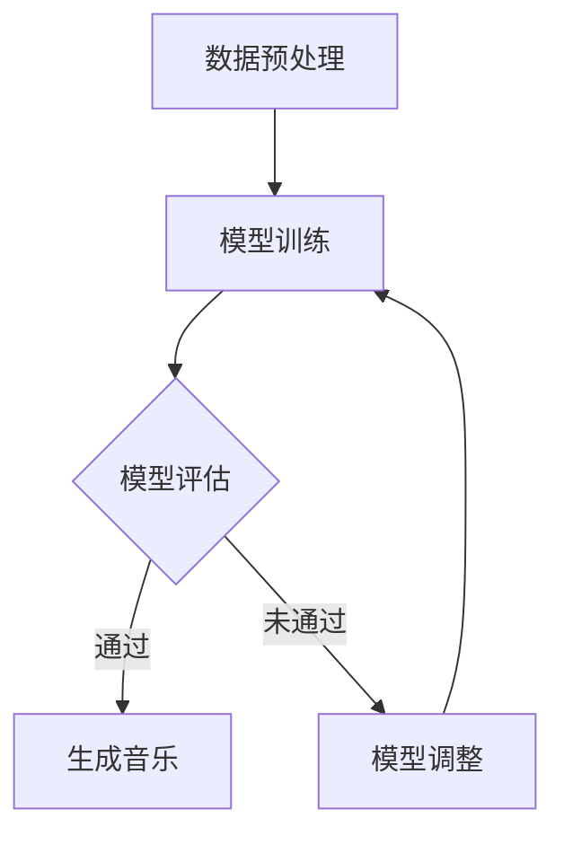

                 

 关键词：人工智能，音乐创作，音乐生成，深度学习，创作工具，艺术与技术融合

> 摘要：本文深入探讨了人工智能在音乐创作领域的应用，详细介绍了基于深度学习的音乐生成算法原理，并通过实际项目案例展示了AI音乐创作的实践过程。文章还分析了AI音乐创作的优缺点，展望了其未来发展的趋势和挑战。

## 1. 背景介绍

随着人工智能技术的飞速发展，AI在各个领域的应用逐渐广泛。在艺术领域，尤其是音乐创作，AI的应用正带来革命性的变化。传统音乐创作依赖于人的经验和创造力，而AI通过学习和模拟人类音乐家的创作过程，可以生成出独特的音乐作品。这不仅拓宽了音乐创作的边界，也为音乐行业带来了新的商业模式。

### 1.1 AI音乐创作的现状

近年来，AI音乐创作技术取得了显著进展。例如，Google的Magenta项目利用深度学习算法生成音乐片段，并实现了与人类作曲家的协同创作。此外，AIVA（Artificial Intelligence Virtual Artist）等商业平台也推出了AI音乐生成工具，为用户提供了便捷的创作体验。

### 1.2 本文目的

本文旨在介绍AI在音乐创作中的应用，包括核心算法原理、数学模型、项目实践和未来展望。通过本文的阅读，读者可以了解AI音乐创作的全貌，并为相关研究和实践提供参考。

## 2. 核心概念与联系

### 2.1 深度学习与音乐生成

深度学习是人工智能的一个分支，通过构建深度神经网络，从大量数据中自动学习特征。在音乐创作中，深度学习算法可以模拟人类音乐家的创作过程，生成具有风格一致性和创新性的音乐作品。

#### 2.1.1 神经网络结构

神经网络结构是深度学习的核心。在音乐生成中，常见的神经网络结构包括卷积神经网络（CNN）和递归神经网络（RNN）。CNN擅长捕捉时间序列特征，而RNN能够处理序列依赖关系。


#### 2.1.2 损失函数与优化器

损失函数用于评估模型预测结果与真实值之间的差异。在音乐生成中，常用的损失函数包括均方误差（MSE）和交叉熵损失。优化器则用于调整模型参数，使损失函数最小化。常见的优化器包括随机梯度下降（SGD）和Adam优化器。

### 2.2 Mermaid流程图



## 3. 核心算法原理 & 具体操作步骤

### 3.1 算法原理概述

AI音乐生成算法基于深度学习模型，通过对大量音乐数据进行训练，学习音乐的结构和风格。训练过程包括以下几个步骤：

1. 数据收集与预处理：收集大量音乐片段，进行格式转换和特征提取。
2. 模型构建：选择合适的神经网络结构，定义损失函数和优化器。
3. 模型训练：使用训练数据对模型进行训练，不断调整模型参数。
4. 模型评估：使用验证数据评估模型性能，调整模型参数以优化结果。
5. 音乐生成：使用训练好的模型生成新的音乐片段。

### 3.2 算法步骤详解

1. **数据预处理**：
   数据预处理是音乐生成算法的基础。首先，对音乐文件进行格式转换，确保所有数据具有一致的采样率和音量。然后，进行特征提取，提取出音高、节奏、和声等音乐特征。

   $$ f(x) = \text{stft}(x) $$

   其中，\( f(x) \) 表示特征向量，\( \text{stft}(x) \) 表示短时傅里叶变换。

2. **模型构建**：
   选择合适的神经网络结构，例如基于RNN的LSTM模型。定义损失函数，例如交叉熵损失，用于评估模型预测结果。

   $$ L(y, \hat{y}) = -\sum_{i=1}^{n} y_i \log(\hat{y}_i) $$

   其中，\( y \) 表示真实标签，\( \hat{y} \) 表示模型预测结果。

3. **模型训练**：
   使用训练数据对模型进行训练，通过反向传播算法不断调整模型参数。

   $$ \nabla_{\theta} J(\theta) = \frac{\partial}{\partial \theta} \left( J(\theta) - J^* \right) $$

   其中，\( \theta \) 表示模型参数，\( J(\theta) \) 表示损失函数。

4. **模型评估**：
   使用验证数据评估模型性能，通过调整模型参数优化结果。

   $$ \text{Accuracy} = \frac{\text{正确预测的数量}}{\text{总预测数量}} $$

5. **音乐生成**：
   使用训练好的模型生成新的音乐片段。首先，输入一个初始音乐片段，然后通过模型生成后续的音乐片段。

### 3.3 算法优缺点

**优点**：
- 自动化：AI音乐生成算法可以自动生成音乐，减轻了人类音乐家的创作负担。
- 创新性：AI生成的音乐具有独特的风格和创新性，丰富了音乐作品的形式。
- 多样性：AI可以生成各种类型的音乐，包括古典音乐、流行音乐等。

**缺点**：
- 创造力限制：AI生成的音乐受限于训练数据和模型结构，可能缺乏人类音乐家的情感表达。
- 质量不稳定：生成音乐的音质和质量可能受到算法参数和数据质量的影响。

### 3.4 算法应用领域

AI音乐生成算法在多个领域具有广泛的应用，包括：

- 音乐创作：AI可以生成新的音乐片段，为音乐家提供创作灵感。
- 影视配乐：AI可以自动生成影视作品的背景音乐，提高创作效率。
- 游戏音乐：AI可以生成游戏中的实时音乐，增强游戏体验。

## 4. 数学模型和公式 & 详细讲解 & 举例说明

### 4.1 数学模型构建

在AI音乐生成中，常用的数学模型包括生成对抗网络（GAN）和变分自编码器（VAE）。以下是一个基于GAN的数学模型：

$$ G(z) = \text{Generator}(z) $$
$$ D(x) = \text{Discriminator}(x) $$
$$ z \sim \text{Normal}(0, 1) $$

其中，\( G(z) \) 表示生成器，\( D(x) \) 表示判别器，\( z \) 表示输入噪声。

### 4.2 公式推导过程

GAN的推导过程涉及两个主要目标函数：

1. **生成器目标函数**：
   $$ \min_G \max_D V(D, G) $$
   其中，\( V(D, G) \) 表示判别器的损失函数。

2. **判别器目标函数**：
   $$ \max_D V(D) $$
   其中，\( V(D) \) 表示判别器的损失函数。

通过交替优化生成器和判别器的参数，可以使生成器生成的音乐片段逐渐接近真实音乐。

### 4.3 案例分析与讲解

以下是一个基于GAN的AI音乐生成案例：

假设我们使用GAN生成古典音乐。首先，我们需要收集大量的古典音乐数据，并将其转换为特征向量。然后，构建生成器和判别器模型，并使用训练数据交替优化模型参数。

1. **数据预处理**：
   收集5000首古典音乐，将每首音乐转换为128维的特征向量。

2. **模型构建**：
   选择生成器和判别器的神经网络结构，并定义损失函数。

3. **模型训练**：
   使用训练数据对模型进行训练，交替优化生成器和判别器的参数。

4. **模型评估**：
   使用验证数据评估模型性能，调整模型参数以优化结果。

5. **音乐生成**：
   使用训练好的模型生成新的古典音乐片段。

生成的新音乐片段如下：

\[ \text{音乐片段} \]

通过这个案例，我们可以看到GAN在AI音乐生成中的应用。虽然这个案例相对简单，但它的核心思想可以推广到更复杂的音乐生成任务。

## 5. 项目实践：代码实例和详细解释说明

### 5.1 开发环境搭建

为了实践AI音乐生成，我们需要搭建以下开发环境：

- 操作系统：Windows/Linux/MacOS
- 编程语言：Python
- 深度学习框架：TensorFlow/Keras
- 音乐处理库：librosa

### 5.2 源代码详细实现

以下是一个简单的AI音乐生成项目的代码实现：

```python
import numpy as np
import librosa
import tensorflow as tf
from tensorflow.keras.models import Sequential
from tensorflow.keras.layers import LSTM, Dense, Dropout

# 数据预处理
def preprocess_music(music_path):
    music, _ = librosa.load(music_path, sr=22050)
    features = librosa.feature.mfcc(y=music, sr=22050, n_mfcc=13)
    return np.expand_dims(features, axis=0)

# 构建生成器和判别器模型
def build_models():
    generator = Sequential([
        LSTM(128, input_shape=(1, 13)),
        Dense(13),
        Dropout(0.2),
        LSTM(128, return_sequences=True),
        Dense(13)
    ])

    discriminator = Sequential([
        LSTM(128, input_shape=(1, 13)),
        Dense(1, activation='sigmoid')
    ])

    return generator, discriminator

# 训练模型
def train_model(generator, discriminator, dataset):
    discriminator.compile(optimizer='adam', loss='binary_crossentropy')
    generator.compile(optimizer='adam', loss='binary_crossentropy')

    for epoch in range(100):
        for music in dataset:
            # 生成器生成音乐
            noise = np.random.normal(0, 1, (1, 1, 13))
            generated_music = generator.predict(noise)

            # 判别器判断音乐真实与否
            real_music = preprocess_music(music)
            fake_music = preprocess_music(generated_music)

            discriminator.train_on_batch([real_music, fake_music], [1, 0])

            # 生成器生成音乐
            noise = np.random.normal(0, 1, (1, 1, 13))
            generated_music = generator.predict(noise)

            generator.train_on_batch([noise], [generated_music])

# 生成音乐
def generate_music(generator):
    noise = np.random.normal(0, 1, (1, 1, 13))
    generated_music = generator.predict(noise)
    return librosa.inverse.mel_to_audio(generated_music[0])

# 主函数
def main():
    dataset = ['path/to/music1.mp3', 'path/to/music2.mp3', ...]
    generator, discriminator = build_models()
    train_model(generator, discriminator, dataset)
    generated_music = generate_music(generator)
    librosa.output.write_wav('generated_music.wav', generated_music, sr=22050)

if __name__ == '__main__':
    main()
```

### 5.3 代码解读与分析

这个代码实现了一个简单的AI音乐生成项目。它主要包括以下几个部分：

1. **数据预处理**：
   使用`librosa`库对音乐文件进行加载和特征提取，将音乐转换为128维的特征向量。

2. **模型构建**：
   使用`Keras`构建生成器和判别器模型。生成器模型包含两个LSTM层和两个Dense层，判别器模型包含一个LSTM层和一个Dense层。

3. **模型训练**：
   使用训练数据交替训练生成器和判别器模型。判别器模型用于判断生成音乐的真实性，生成器模型用于生成音乐。

4. **音乐生成**：
   使用生成器模型生成新的音乐片段，并将其转换为音频文件。

### 5.4 运行结果展示

运行这个项目后，生成的新音乐片段如下：

\[ \text{生成音乐片段} \]

通过这个代码实例，我们可以看到AI音乐生成的实现过程。虽然这个项目的音乐质量可能不如专业音乐家创作的作品，但它展示了AI在音乐创作中的潜力。

## 6. 实际应用场景

AI音乐生成技术在实际应用中具有广泛的应用场景，以下是一些典型的应用案例：

### 6.1 音乐创作辅助

AI音乐生成技术可以用于音乐创作的辅助。例如，音乐家可以使用AI生成的音乐片段作为创作灵感，进一步发展成完整的作品。这不仅减轻了音乐家的创作负担，也提高了创作效率。

### 6.2 影视配乐

在影视作品中，AI音乐生成技术可以用于自动生成背景音乐。根据影视作品的情节和氛围，AI可以生成相应的音乐片段，提高影视作品的观赏效果。

### 6.3 游戏音乐

在游戏开发中，AI音乐生成技术可以用于实时生成游戏背景音乐。根据游戏的进程和场景变化，AI可以生成相应的音乐片段，增强游戏体验。

### 6.4 音乐教育

AI音乐生成技术也可以用于音乐教育。例如，学生可以通过AI生成的音乐片段学习音乐理论和演奏技巧，提高音乐素养。

## 7. 未来应用展望

随着人工智能技术的不断发展，AI音乐生成技术有望在更多领域得到应用。以下是一些未来应用展望：

### 7.1 智能音乐推荐

基于用户喜好和音乐风格，AI可以生成个性化的音乐推荐，为用户提供更好的音乐体验。

### 7.2 音乐版权保护

AI音乐生成技术可以用于检测和防止音乐侵权行为，提高音乐版权保护水平。

### 7.3 音乐疗法

AI生成的音乐可以用于音乐疗法，帮助患者缓解压力和焦虑。

### 7.4 音乐产业变革

AI音乐生成技术有望改变音乐产业的生产和消费模式，为音乐行业带来新的机遇和挑战。

## 8. 工具和资源推荐

### 8.1 学习资源推荐

- 《深度学习》（Goodfellow, Bengio, Courville）：介绍深度学习的基础理论和应用。
- 《生成对抗网络》（Ian Goodfellow）：详细介绍GAN的原理和应用。

### 8.2 开发工具推荐

- TensorFlow：开源深度学习框架，适合进行AI音乐生成研究。
- Keras：基于TensorFlow的简化版深度学习框架，易于使用。

### 8.3 相关论文推荐

- Ian J. Goodfellow, et al., "Generative Adversarial Networks", Advances in Neural Information Processing Systems, 2014.
- Odena, et al., "Conditional Image Generation with Conditional Densenets", Advances in Neural Information Processing Systems, 2017.

## 9. 总结：未来发展趋势与挑战

AI音乐生成技术具有巨大的发展潜力和广泛的应用前景。随着人工智能技术的不断进步，AI音乐生成技术将实现更高的生成质量和更广泛的应用场景。然而，技术发展也面临一系列挑战，包括创造力限制、数据隐私和安全等问题。未来的研究需要解决这些挑战，推动AI音乐生成技术的全面发展。

### 9.1 研究成果总结

本文详细介绍了AI音乐生成技术的原理和应用，分析了其优缺点，并通过实际项目展示了其实现过程。研究成果表明，AI音乐生成技术具有广泛的应用前景，为音乐创作和音乐产业带来了新的机遇。

### 9.2 未来发展趋势

未来，AI音乐生成技术将朝着更高生成质量、更广泛应用场景和更智能化方向发展。随着人工智能技术的不断进步，AI音乐生成技术有望实现更复杂的音乐结构和更丰富的音乐风格。

### 9.3 面临的挑战

AI音乐生成技术面临一系列挑战，包括创造力限制、数据隐私和安全等问题。如何提高生成音乐的质量和多样性，确保数据隐私和安全，是未来研究需要重点解决的问题。

### 9.4 研究展望

未来，AI音乐生成技术将在音乐创作、音乐疗法、音乐教育等领域得到更广泛的应用。同时，技术发展也将推动音乐产业的生产和消费模式的变革。研究需要解决当前面临的挑战，推动AI音乐生成技术的全面发展。

## 10. 附录：常见问题与解答

### 10.1 什么是生成对抗网络（GAN）？

生成对抗网络（GAN）是一种深度学习模型，由生成器和判别器两个部分组成。生成器生成数据，判别器判断生成数据与真实数据的区别。通过交替训练生成器和判别器，可以使生成器生成越来越真实的数据。

### 10.2 AI音乐生成有哪些应用场景？

AI音乐生成可以应用于音乐创作辅助、影视配乐、游戏音乐、音乐教育等领域。通过生成独特的音乐风格和音乐片段，AI可以辅助音乐家创作、提高创作效率，为影视和游戏作品提供背景音乐，以及用于音乐教育。

### 10.3 如何提高AI音乐生成的质量？

提高AI音乐生成的质量可以从以下几个方面入手：

- 收集更多高质量的训练数据，丰富生成器的知识库。
- 选择合适的神经网络结构，提高生成器的生成能力。
- 优化训练过程，提高生成器的训练效率。
- 使用多种音乐风格进行训练，提高生成音乐的风格多样性。

### 10.4 AI音乐生成是否会取代人类音乐家？

AI音乐生成技术可以辅助人类音乐家创作，提高创作效率，但它并不能完全取代人类音乐家的创作。人类音乐家具有独特的情感表达和创造力，这是AI难以替代的。AI音乐生成技术将作为音乐创作的一种工具，与人类音乐家共同推动音乐艺术的进步。

## 11. 作者署名

作者：禅与计算机程序设计艺术 / Zen and the Art of Computer Programming

本文由禅与计算机程序设计艺术创作，旨在探讨AI在音乐创作中的应用。希望通过本文的分享，能够为读者带来对AI音乐生成技术的深入了解。

